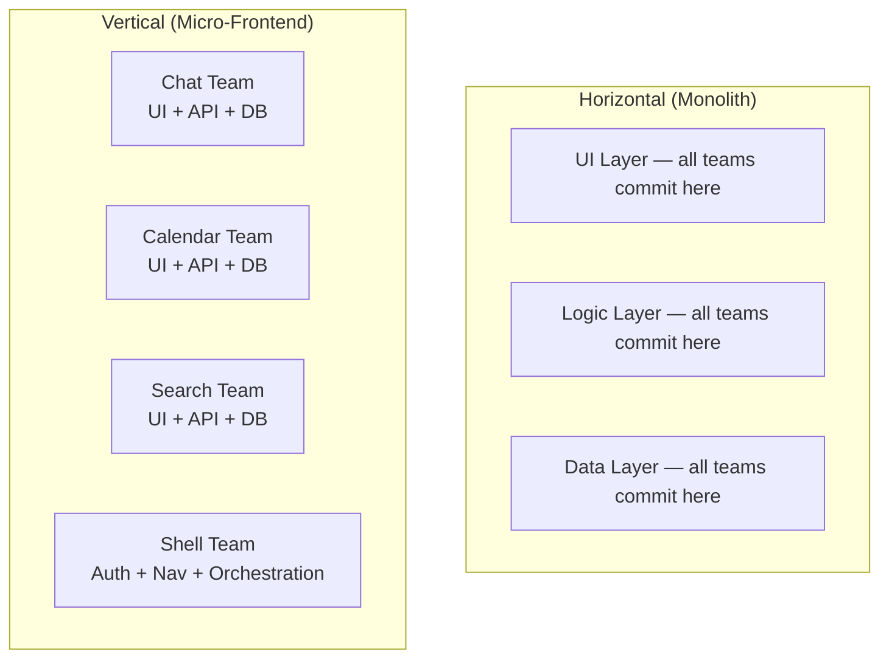
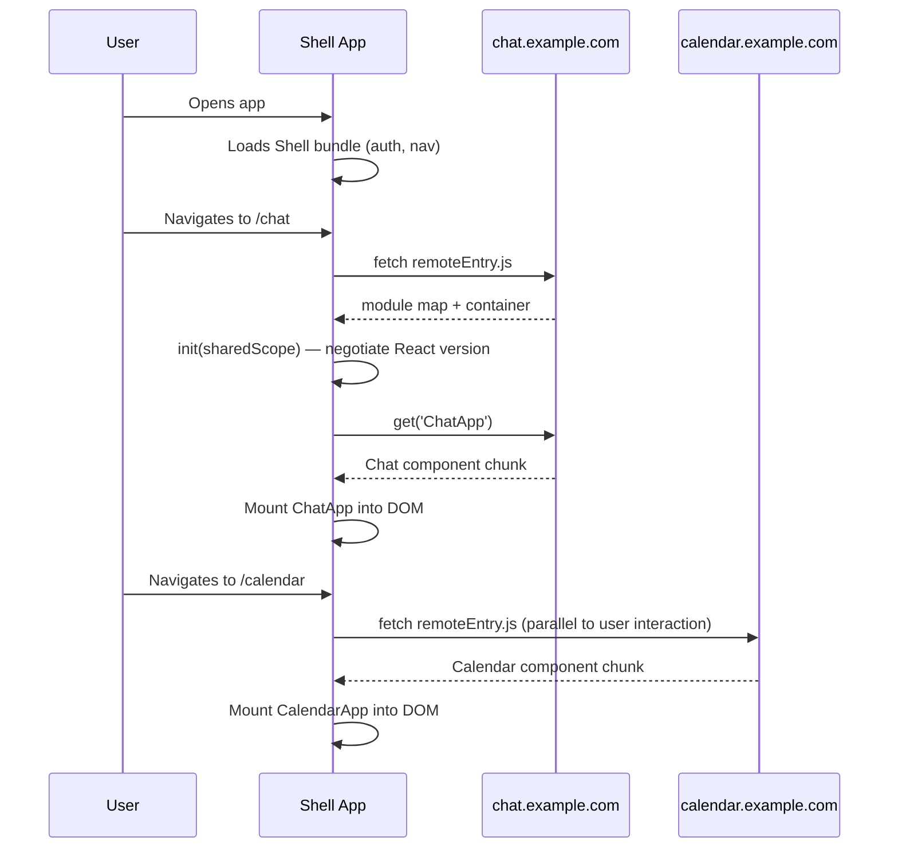
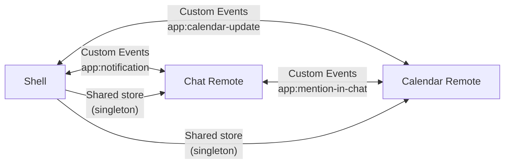
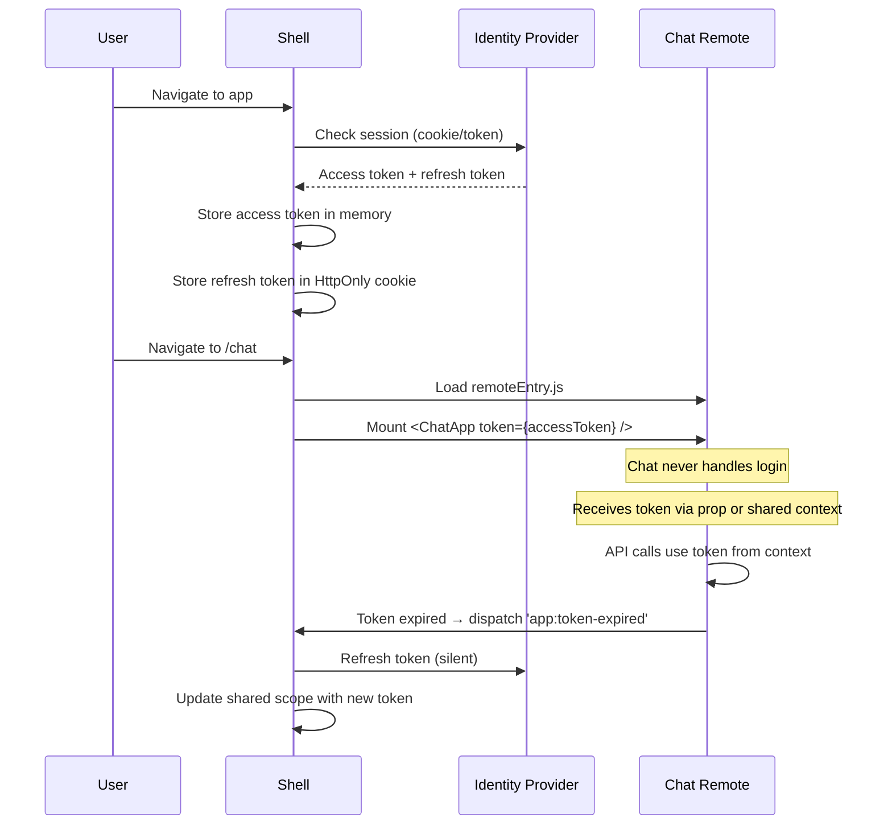
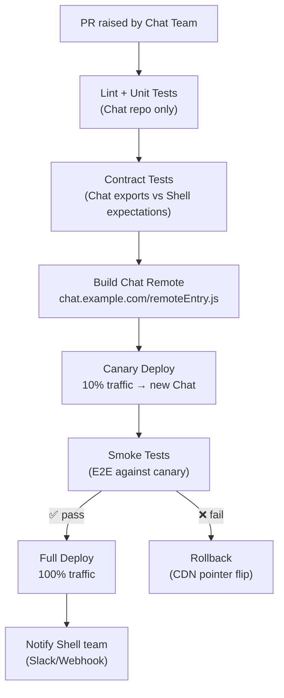
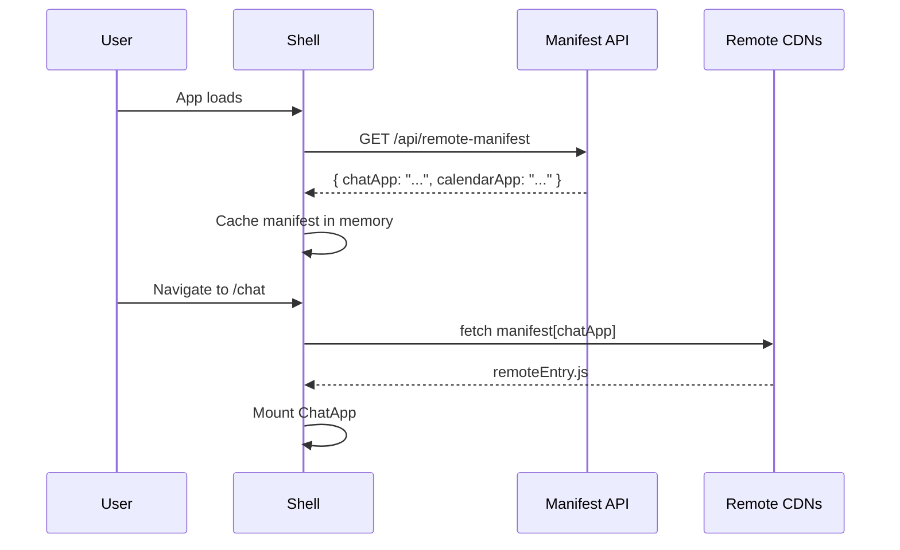

# Micro-Frontends — Interview Reference

---

## What Are Micro-Frontends?

Micro-frontends apply **microservice thinking to the frontend** — decompose a monolithic UI into independently owned, deployed, and composed vertical slices.

> **One-liner:** Micro-frontends let multiple teams own separate business domains end-to-end (UI → API → DB), deploying independently while presenting a single cohesive user experience.

**The organizational problem they solve:**

```
Monolith frontend:
  Team Chat   ──┐
  Team Calendar ──┼──→  one giant repo → one release train → blocked by each other
  Team Search ──┘

Micro-frontend:
  Team Chat     → chat.example.com/remoteEntry.js    → deploy independently
  Team Calendar → calendar.example.com/remoteEntry.js → deploy independently
  Team Search   → search.example.com/remoteEntry.js  → deploy independently
  Shell         → orchestrates, provides auth + nav
```

> Micro-frontends are an **organizational solution** first, technical solution second. If you have one team, you probably don't need them.

---

## 1. Vertical Slicing — Core Philosophy

Unlike horizontal layers (UI / Logic / Data), vertical slices give one team full ownership from UI to database for their domain.



| Team | Owns | Deploys |
|---|---|---|
| Shell | Navigation, auth, route orchestration | Independently |
| Chat | Chat UI, chat API, chat DB | Independently |
| Calendar | Calendar UI, events API, events DB | Independently |
| Search | Search UI, search service, index | Independently |

---

## 2. Integration Strategies — Trade-offs

Three ways to stitch independently built frontends into one shell.

### A. Build-Time Integration (NPM packages)

Each team publishes their component as an npm package. Shell installs and bundles them at build time.

```
Team Chat publishes @company/chat-widget@2.1.0
Shell: npm install @company/chat-widget
Shell: import ChatWidget from '@company/chat-widget'
→ Shell must rebuild + redeploy to pick up Chat updates
```

| ✅ Pros | ❌ Cons |
|---|---|
| Simple setup, strong type safety | Not truly independent — Shell redeploys on every update |
| Tree-shakeable, optimized bundle | Creates a "distributed monolith" — teams still synchronized |
| No runtime coordination needed | Version lag — consumers stuck on old version until they upgrade |

**When to use:** Shared design system components, utility libraries — not for independently deployable features.

---

### B. Server-Side Composition (Edge / ESI)

Server assembles the page from fragments owned by different services before sending HTML to browser.

```
Browser: GET /dashboard
  ↓
Nginx / Composition Layer:
  → GET chat-service.internal/fragment
  → GET calendar-service.internal/fragment
  → GET search-service.internal/fragment
  → Assembles into one HTML response
  ↓
Browser receives complete HTML
```

| ✅ Pros | ❌ Cons |
|---|---|
| Excellent SEO — full HTML on first load | High infrastructure complexity |
| Fast FCP — no client-side loading states | Server-to-server latency adds up |
| Works without JavaScript | Hard to do client-side transitions between fragments |
| True deployment independence | Shared session/auth state is complex |

**When to use:** Content-heavy sites (news, e-commerce product pages), SEO-critical pages.

---

### C. Run-Time Integration — Module Federation

Shell fetches independently hosted JavaScript bundles at runtime and composes them in the browser. This is how Teams, Azure Portal, and similar large apps work.



| ✅ Pros | ❌ Cons |
|---|---|
| True runtime independence — no Shell rebuild | Runtime coordination complexity |
| Teams deploy at any time without coordination | Network latency for each remoteEntry.js load |
| Shared singletons (React loaded once) | Global scope used for coordination |
| Lazy load remotes only when needed | Version conflicts can cause subtle bugs |

---

## 3. Module Federation Deep Dive

### Configuration

```js
// chat-app/webpack.config.js — REMOTE
new ModuleFederationPlugin({
  name: 'chatApp',
  filename: 'remoteEntry.js',    // manifest — loaded by Shell
  exposes: {
    './ChatApp':    './src/ChatApp',
    './useChat':    './src/hooks/useChat',    // expose hooks too
    './chatStore':  './src/store/chatStore',  // expose store
  },
  shared: {
    react:     { singleton: true, requiredVersion: '^18.0.0' },
    'react-dom': { singleton: true, requiredVersion: '^18.0.0' },
    'react-router-dom': { singleton: true },
  }
})

// shell/webpack.config.js — HOST
new ModuleFederationPlugin({
  name: 'shell',
  remotes: {
    chatApp:     'chatApp@https://chat.example.com/remoteEntry.js',
    calendarApp: 'calendarApp@https://calendar.example.com/remoteEntry.js',
  },
  shared: {
    react:     { singleton: true, requiredVersion: '^18.0.0', eager: true },
    'react-dom': { singleton: true, requiredVersion: '^18.0.0', eager: true },
  }
})
```

### The Global Scope Registry (the trick)

```js
// When remoteEntry.js loads:
self['chatApp'] = {
  init: (sharedScope) => { /* negotiate shared deps */ },
  get:  (module) => { /* return module factory */ }
};

// Shell accesses via window global:
const container = window['chatApp'];
await container.init(__webpack_share_scopes__.default);
const factory = await container.get('./ChatApp');
const ChatApp = factory().default;
```

**Why window?** Two separately deployed builds have no other shared channel. The global registry IS the communication protocol between independently hosted bundles.

### Version Negotiation — The Dance

```
Shell declares:   react@18.2.0 (loaded, singleton: true)
ChatApp declares: react ^18.0.0 (needs, singleton: true)

Module Federation checks:
  18.2.0 satisfies ^18.0.0? → YES → ChatApp uses Shell's React

CalendarApp declares: react ^17.0.0 (needs, singleton: true)
  18.2.0 satisfies ^17.0.0? → NO (major version mismatch)
  strictVersion: false → CalendarApp loads its OWN React 17
  → TWO React instances → hooks will BREAK
```

**Fix:** Enforce version alignment across teams. Use `requiredVersion` in CI checks. Teams must upgrade React together.

### `eager` vs lazy loading

```js
// eager: true — include in initial bundle (no async chunk)
// Use for Shell's OWN React — must be available immediately
shared: { react: { singleton: true, eager: true } }

// eager: false (default) — load on demand
// Use for remotes' shared deps — loaded when remote first loads
```

---

## 4. CSS Isolation

Without isolation, CSS from one MFE leaks into another. Three strategies:

### Strategy 1 — CSS Modules (build-time scoping)

```css
/* chat.module.css */
.container { padding: 16px; } /* → .chatApp_container_abc123 */
.button { color: blue; }      /* → .chatApp_button_abc123 */
```

Zero runtime cost. Works with any bundler. Does not isolate third-party styles.

### Strategy 2 — Shadow DOM (true browser isolation)

```js
class ChatWidget extends HTMLElement {
  connectedCallback() {
    const shadow = this.attachShadow({ mode: 'open' });
    // All styles inside shadow are completely isolated from the document
    shadow.innerHTML = `
      <style>
        .container { padding: 16px; }  /* never leaks outside */
      </style>
      <div class="container"></div>
    `;
    // Mount React inside shadow root
    ReactDOM.createRoot(shadow.querySelector('.container')).render(<Chat />);
  }
}
customElements.define('chat-widget', ChatWidget);
```

**True isolation** — no CSS leakage either direction. **Trade-off:** React portals (modals, tooltips) need explicit handling as they render outside the shadow root.

### Strategy 3 — CSS-in-JS with scoped classnames

```js
// Each team uses a unique prefix in their CSS-in-JS theme
const theme = createTheme({
  components: {
    MuiButton: {
      styleOverrides: { root: { /* chat-specific overrides */ } }
    }
  }
});
// Styled-components generates: .sc-chatApp-abc123
```

### Strategy 4 — BEM namespace convention (simplest)

```css
/* Each team prefixes all classes with their app name */
.chat__container { }
.chat__button { }
.calendar__container { }   /* never collides with .chat__container */
```

No tooling needed. Relies on team discipline.

---

## 5. Shared State and Communication

### Option 1 — Custom Events (recommended for decoupled teams)

```js
// Chat publishes an event
window.dispatchEvent(new CustomEvent('app:notification', {
  detail: { from: 'chat', count: 5, preview: 'Alice: Hey!' }
}));

// Shell (or any remote) listens — no knowledge of who published
window.addEventListener('app:notification', (e) => {
  updateNotificationBadge(e.detail);
});
```

Zero coupling. Works across frameworks. **Limitation:** Late-mounted remotes miss past events.
**Fix:** Also write current state to `window.__APP_STATE__` for initial read.

### Option 2 — Shared Store (singleton via Module Federation)

```js
// shell exposes its store
exposes: { './store': './src/store/appStore' }

// Chat remote imports it
import { useAppStore } from 'shell/store';
const user = useAppStore(state => state.user);
```

Same store instance guaranteed by `singleton: true`. **Risk:** Tight coupling between teams — store schema changes require coordination.

### Option 3 — URL / Query Params (for navigation state)

```js
// Shell navigates with state in URL — works across remotes and page refreshes
navigate('/chat?threadId=123&userId=456');

// Remote reads from URL — no cross-app coupling
const { threadId } = useParams();
```

Simple, debuggable, browser-native. Works with back/forward buttons. Limited payload size.

### Option 4 — Shared Context (React-only)

```js
// Shell exposes AuthContext
exposes: { './AuthContext': './src/contexts/AuthContext' }

// Remote consumes it — same React instance means same fiber tree
import { useAuth } from 'shell/AuthContext';
const { user, token } = useAuth();
```

### Communication Matrix



---

## 6. Authentication & Session Sharing

Auth is owned by the Shell. Remotes never handle login — they consume the session.



**Patterns for token sharing:**
- **Props** — Shell passes `token` prop to remote components (simplest, but prop-drilling)
- **Shared AuthContext** — Shell exposes `AuthContext`, remotes consume via `useAuth()`
- **Shared store** — `authStore.getState().token` accessible to all remotes
- **Cookie** — HttpOnly cookie sent automatically with every API call (requires same domain or CORS config)

---

## 7. Routing Strategies

### Option A — Shell-Controlled (centralized)

```jsx
// Shell owns all top-level routes
<Routes>
  <Route path="/chat/*"     element={<RemoteLoader remote="chatApp" module="ChatApp" />} />
  <Route path="/calendar/*" element={<RemoteLoader remote="calendarApp" module="CalendarApp" />} />
</Routes>
```

✅ Central navigation, consistent UX
❌ Shell must know every remote's route prefix — coordination required

### Option B — Nested Remote Routing (federated)

```jsx
// Shell: delegates everything under /chat/* to Chat remote
<Route path="/chat/*" element={<ChatApp />} />

// Inside ChatApp — owns its own sub-routes independently
<Routes>
  <Route index element={<ChatList />} />
  <Route path=":threadId" element={<ChatThread />} />
  <Route path="settings" element={<ChatSettings />} />
</Routes>
```

✅ True independence — Chat team controls its own routes
❌ URL collisions possible if teams don't coordinate prefixes

### Option C — Dynamic Route Registration

```js
// Each remote registers its routes at runtime into a shared router registry
// Shell exposes the registration API
exposes: { './routeRegistry': './src/routing/RouteRegistry' }

// Chat remote registers on mount
import { registerRoutes } from 'shell/routeRegistry';
useEffect(() => {
  registerRoutes('chatApp', [
    { path: '/chat',          component: () => import('./ChatList') },
    { path: '/chat/:threadId', component: () => import('./ChatThread') },
  ]);
  return () => unregisterRoutes('chatApp');
}, []);
```

✅ Shell doesn't need to know routes at build time — fully dynamic
❌ Complex implementation, potential race conditions on initial load

---

## 8. Error Boundaries & Resilience

A failed remote must never crash the Shell or other remotes.

```jsx
// Shell wraps every remote in isolation
function RemoteLoader({ remote, module, fallback }) {
  const RemoteComponent = React.lazy(() =>
    import(`${remote}/${module}`).catch((err) => {
      // Log to monitoring (Sentry, Datadog)
      reportError(`Remote ${remote}/${module} failed`, err);
      // Return degraded fallback — not a crash
      return { default: () => <RemoteUnavailable name={remote} /> };
    })
  );

  return (
    <ErrorBoundary
      fallback={<RemoteUnavailable name={remote} />}
      onError={(err) => reportError(err)}
    >
      <Suspense fallback={fallback ?? <RemoteSkeleton />}>
        <RemoteComponent />
      </Suspense>
    </ErrorBoundary>
  );
}
```

### Remote Health Check + Prefetching

```js
// Shell prefetches remote manifests on idle — fail early, not on click
const remotes = ['chatApp', 'calendarApp', 'searchApp'];

window.addEventListener('load', () => {
  requestIdleCallback(() => {
    remotes.forEach(async (name) => {
      const url = REMOTE_URLS[name];
      try {
        await fetch(`${url}/remoteEntry.js`, { method: 'HEAD' });
      } catch {
        // Mark as unavailable BEFORE user clicks — show degraded nav
        markRemoteUnavailable(name);
        reportError(`Remote ${name} unreachable`);
      }
    });
  });
});
```

**Retry with backoff for transient failures:**

```js
async function loadRemoteWithRetry(remoteName, retries = 3) {
  for (let i = 0; i < retries; i++) {
    try {
      return await import(`${remoteName}/App`);
    } catch {
      if (i === retries - 1) throw new Error(`${remoteName} unavailable`);
      await new Promise(r => setTimeout(r, 500 * 2 ** i)); // 500ms, 1s, 2s
    }
  }
}
```

---

## 9. Versioning & Deployment Strategy

### Semantic Versioning for Remotes

```
remoteEntry.js              ← always points to latest (used by Shell)
remoteEntry-v2.1.0.js       ← pinned version (used for canary/rollback)
```

```js
// Shell can pin specific versions
remotes: {
  chatApp: process.env.CHAT_VERSION === 'canary'
    ? 'chatApp@https://chat.example.com/remoteEntry-canary.js'
    : 'chatApp@https://chat.example.com/remoteEntry.js'
}
```

### Blue-Green Deployment

```
chat.example.com/remoteEntry.js
  → points to BLUE (current stable)

CDN switches pointer to GREEN after smoke tests pass:
chat.example.com/remoteEntry.js
  → now points to GREEN (new version)

Shell fetches remoteEntry.js on each user session start
→ all new sessions automatically get GREEN
→ in-progress sessions finish on BLUE (graceful)
```

### Rollback Strategy

```
Problem: Chat team deployed v2.1.0 with a bug.
Shell is fetching: chat.example.com/remoteEntry.js → v2.1.0

Rollback options:
1. CDN pointer rollback — update DNS/CDN to serve v2.0.9 in <1min
2. Shell environment variable — redeploy Shell with CHAT_VERSION=v2.0.9
3. Feature flag — disable Chat remote entirely, show fallback

Shell should always have a "killswitch" per remote:
if (!featureFlags.chatEnabled) return <ChatUnavailablePage />;
```

### Canary Deployments

```js
// Shell routes 10% of traffic to new Chat version
function getRemoteUrl(remoteName, userId) {
  const isCanary = hashUserId(userId) % 100 < 10; // 10% canary
  return isCanary
    ? `https://chat-canary.example.com/remoteEntry.js`
    : `https://chat.example.com/remoteEntry.js`;
}
```

---

## 10. Testing Strategy

Testing federated apps requires multiple layers:

### Layer 1 — Unit Tests (per remote, isolated)

Each remote tests its own components in isolation — no Shell, no other remotes. Standard Jest + Testing Library.

### Layer 2 — Contract Testing (the critical one)

Remote exposes a contract (what it exports). Shell has a contract (what it expects). Contract tests verify these match — without running either app.

```js
// chat-app/src/__tests__/contract.test.js
// Verify that Chat exports exactly what Shell expects
describe('ChatApp contract', () => {
  it('exports a ChatApp component', async () => {
    const module = await import('../ChatApp');
    expect(module.default).toBeDefined();
    expect(typeof module.default).toBe('function');
  });

  it('ChatApp accepts expected props', () => {
    const { getByTestId } = render(<ChatApp userId="123" token="tok" />);
    expect(getByTestId('chat-container')).toBeInTheDocument();
  });
});

// shell/src/__tests__/chatApp.contract.test.js
// Verify Shell's assumptions about Chat match Chat's actual interface
it('ChatApp renders without crashing with minimal props', () => {
  const { container } = render(
    <RemoteLoader remote="chatApp" module="ChatApp"
      props={{ userId: 'test', token: 'test' }} />
  );
  expect(container).not.toBeEmpty();
});
```

### Layer 3 — Integration Tests (Shell + one remote)

```js
// Test Shell routing to Chat — real Chat remote loaded via mock server
it('navigates to chat and renders ChatApp', async () => {
  // Mock chat remote entry
  server.use(
    rest.get('https://chat.example.com/remoteEntry.js', (req, res, ctx) =>
      res(ctx.text(mockRemoteEntry))
    )
  );
  render(<Shell />);
  fireEvent.click(screen.getByText('Chat'));
  await screen.findByTestId('chat-container');
});
```

### Layer 4 — E2E Tests (Playwright/Cypress against live deployed apps)

```js
// test with real remotes — run after each deployment
test('user can send a chat message', async ({ page }) => {
  await page.goto('https://app.example.com');
  await page.click('[data-testid="nav-chat"]');
  await expect(page.locator('[data-testid="chat-input"]')).toBeVisible();
  await page.fill('[data-testid="chat-input"]', 'Hello');
  await page.click('[data-testid="send-btn"]');
  await expect(page.locator('[data-testid="message-list"]')).toContainText('Hello');
});
```

---

## 11. CI/CD Pipeline



**Key principle:** Chat team CI never touches Shell repo. Shell team is notified via webhook after Chat deploys successfully. Shell re-fetches `remoteEntry.js` on next user session — zero Shell redeployment needed.

---

## 12. Feature Flagging Across MFEs

Feature flags must be consistent across remotes — a flag enabling a feature in Chat should be visible to Calendar if Calendar reacts to it.

```js
// Shell fetches flags from flagging service on load
// Stores in shared context/store — all remotes read from same source
const flags = await flagService.getFlags(userId);
store.dispatch(setFeatureFlags(flags));

// Remote reads flag — same store instance via singleton
import { useAppStore } from 'shell/store';

function ChatApp() {
  const newEditorEnabled = useAppStore(s => s.flags['chat-new-editor']);
  return newEditorEnabled ? <NewEditor /> : <LegacyEditor />;
}
```

**Important:** Feature flags must NOT be evaluated in each remote independently — network latency could cause Shell and Chat to see different flag values in the same session (flag flicker).

---

## 13. Performance — The MFE Tax

Every remote adds a network waterfall. Mitigate aggressively.

### The waterfall problem

```
Without optimization:
  Load Shell (200ms)
    → User clicks Chat
    → fetch remoteEntry.js (50ms RTT)
    → fetch chat.chunk.js (100ms)
    → parse + execute (50ms)
    → render (16ms)
  Time to interactive for Chat: 416ms extra
```

### Mitigation strategies

```html
<!-- 1. Prefetch remote manifests on Shell load (not on click) -->
<link rel="prefetch" href="https://chat.example.com/remoteEntry.js" />
<link rel="prefetch" href="https://calendar.example.com/remoteEntry.js" />
```

```js
// 2. Preload on hover (user signals intent 200ms before click)
navItem.addEventListener('mouseenter', () => {
  import('chatApp/ChatApp'); // starts loading 200ms early
});

// 3. Service Worker caches remoteEntry.js
// Cache strategy: stale-while-revalidate for remoteEntry.js
// → instant from cache, updates in background
self.addEventListener('fetch', (e) => {
  if (e.request.url.includes('remoteEntry.js')) {
    e.respondWith(
      caches.open('mfe-manifests').then(cache =>
        cache.match(e.request).then(cached => {
          const fetchPromise = fetch(e.request).then(res => {
            cache.put(e.request, res.clone());
            return res;
          });
          return cached || fetchPromise; // stale-while-revalidate
        })
      )
    );
  }
});
```

### Bundle size discipline

```js
// Each remote must stay within a size budget
// webpack.config.js
performance: {
  maxAssetSize: 250_000,       // 250KB per chunk
  maxEntrypointSize: 500_000,  // 500KB total
  hints: 'error'               // fail build if exceeded
}
```

---

## 14. Security

### Content Security Policy (CSP) — the hardest MFE problem

Standard CSP blocks dynamically loaded scripts from unknown origins. Module Federation loads scripts from remote domains at runtime — you must explicitly allow them.

```
# Without MFE-aware CSP:
Content-Security-Policy: script-src 'self'
→ Shell loads chat.example.com/remoteEntry.js
→ Browser BLOCKS it — origin not in allowlist
```

```
# MFE-aware CSP:
Content-Security-Policy:
  script-src 'self'
    https://chat.example.com
    https://calendar.example.com
    https://search.example.com;
  connect-src 'self'
    https://chat-api.example.com
    https://calendar-api.example.com;
```

**Problem:** Adding a new remote requires updating Shell's CSP header. Tight coupling via infrastructure.

**Better approach — nonce-based CSP:**

```js
// Server generates a unique nonce per request
const nonce = crypto.randomBytes(16).toString('base64');
res.setHeader('Content-Security-Policy', `script-src 'nonce-${nonce}'`);

// Shell passes nonce to Module Federation plugin
new ModuleFederationPlugin({
  // scripts injected by MF get the nonce automatically
})
```

**Practical reality:** Most large MFE apps use a subdomain pattern (`*.example.com`) in CSP — simpler, teams don't need Shell approval for new remotes, still restricts scripts to the org's domain.

```
Content-Security-Policy: script-src 'self' *.example.com
```

---

### Subresource Integrity (SRI) for remoteEntry.js

SRI verifies that a fetched script hasn't been tampered with (CDN compromise, MITM attack).

```html
<!-- Standard SRI — works for static scripts -->
<script src="https://cdn.example.com/library.js"
        integrity="sha384-abc123..."
        crossorigin="anonymous"></script>
```

**Problem with MFE:** `remoteEntry.js` is dynamic and content changes on every deployment — you can't pin a hash.

**Solution — use HTTPS + CORS strictly:**

```
Instead of SRI for dynamic scripts, enforce:
1. TLS everywhere — no HTTP remotes
2. Strict CORS on remote CDN origins
3. CSP restricts allowed origins
4. Code signing via CI/CD pipeline (sign artifacts, verify in deploy step)
```

**XSS surface area — what MFE adds:**

```
Traditional app XSS:
  Attack vector: inject script via user input

MFE additional attack vectors:
  1. Compromised CDN → malicious remoteEntry.js → full app access
  2. DNS hijack of chat.example.com → load attacker-controlled JS
  3. Shared window namespace → window.chatApp overwritten by attacker

Mitigations:
  - Integrity checks in CI before publishing remoteEntry.js
  - CDN access restricted to CI/CD service account only
  - CSP to limit what origins can load
  - Avoid storing sensitive data in window.__APP_STATE__
```

---

### Cross-Remote Data Leakage

Remotes share the same JavaScript heap. Sensitive data in one remote's memory is accessible to another.

```js
// ❌ Don't put sensitive data in window
window.__APP_STATE__ = { user: { ssn: '123-45-6789' } };
// Any remote (or injected script) can read this

// ✅ Share only what's necessary, via controlled API
// Shell exposes a scoped accessor — not the raw store
exposes: {
  './useCurrentUser': './src/auth/useCurrentUser',
  // → returns { id, name, role } — not the full token or PII
}
```

---

## 15. Dynamic Remote Discovery

**Problem with hardcoded remote URLs:**

```js
// Hardcoded in Shell — changing remote URL requires Shell redeploy
remotes: {
  chatApp: 'chatApp@https://chat.example.com/remoteEntry.js',
}
```

**Solution — runtime manifest (production pattern):**

```js
// Shell fetches a manifest on startup — all remote URLs centralized
const manifest = await fetch('/api/remote-manifest').then(r => r.json());
// Returns:
// {
//   chatApp:     "https://chat.example.com/remoteEntry.js",
//   calendarApp: "https://calendar.example.com/remoteEntry.js",
// }
```

```js
// Shell uses dynamic remote loading (no webpack.config remotes needed)
async function loadRemote(manifestEntry) {
  const { name, url } = manifestEntry;

  // Dynamically inject the remote script
  await new Promise((resolve, reject) => {
    const script = document.createElement('script');
    script.src = url;
    script.onload = resolve;
    script.onerror = reject;
    document.head.appendChild(script);
  });

  // Access the registered container
  const container = window[name];
  await container.init(__webpack_share_scopes__.default);
  return container;
}
```

```js
// Get a component from a dynamically loaded remote
async function getRemoteComponent(remoteName, modulePath) {
  const container = await loadRemote({ name: remoteName, url: manifest[remoteName] });
  const factory = await container.get(modulePath);
  return factory().default;
}

// Usage in Shell
const ChatApp = await getRemoteComponent('chatApp', './ChatApp');
```

**Benefits:**
- New remote deployments update the manifest — Shell picks it up without redeployment
- A/B testing by returning different URLs per user segment
- Rollback by updating manifest to point to previous version URL
- Canary by returning canary URL for specific user cohorts



---

## 16. Observability & Monitoring

Single-page apps are easy to monitor — one error boundary, one Sentry project. MFEs are harder: a crash in Chat looks identical to a crash in Calendar from the Shell's perspective.

### Error Attribution — which remote crashed?

```js
// Each remote sets its identity before mounting
function RemoteLoader({ remoteName, ...props }) {
  useEffect(() => {
    // Tag all errors thrown during this remote's lifetime
    Sentry.setTag('mfe.remote', remoteName);
    Sentry.setContext('remote', {
      name: remoteName,
      version: window.__REMOTE_VERSIONS__?.[remoteName],
      url: REMOTE_URLS[remoteName],
    });
  }, [remoteName]);

  return (
    <ErrorBoundary
      onError={(error) => {
        Sentry.withScope((scope) => {
          scope.setTag('mfe.remote', remoteName);
          scope.setTag('mfe.crash', true);
          Sentry.captureException(error);
        });
      }}
    >
      {/* ... */}
    </ErrorBoundary>
  );
}
```

### Distributed Tracing Across Remotes

Each remote makes its own API calls. Without trace propagation, you can't correlate a slow Calendar API call with the user's original Shell action.

```js
// Shell generates a trace ID for the session
const traceId = crypto.randomUUID();
store.dispatch(setTraceId(traceId));

// Shell exposes trace context via shared store
exposes: { './tracing': './src/observability/tracing' }

// Each remote imports and propagates the trace ID
import { getTraceContext } from 'shell/tracing';

async function fetchCalendarEvents() {
  const { traceId, spanId } = getTraceContext();
  return fetch('/api/events', {
    headers: {
      'X-Trace-Id': traceId,       // correlates all remote calls for this session
      'X-Span-Id': spanId,         // identifies this specific remote's call
      'X-Remote-Name': 'calendarApp',
    }
  });
}
```

### Performance Monitoring Per Remote

```js
// Measure each remote's load time independently
performance.mark(`remote:${remoteName}:start`);
await loadRemote(remoteName);
performance.mark(`remote:${remoteName}:end`);

performance.measure(
  `remote:${remoteName}:load`,
  `remote:${remoteName}:start`,
  `remote:${remoteName}:end`
);

// Report to analytics
const [entry] = performance.getEntriesByName(`remote:${remoteName}:load`);
analytics.track('remote_load_time', {
  remote: remoteName,
  duration: entry.duration,
  version: window.__REMOTE_VERSIONS__?.[remoteName],
});
```

### Remote Version Tracking

```js
// Each remoteEntry.js sets its version on load
// chat/webpack.config.js
new webpack.DefinePlugin({
  '__REMOTE_VERSION__': JSON.stringify(process.env.GIT_SHA),
  '__REMOTE_NAME__': JSON.stringify('chatApp'),
});

// chat/src/index.js — runs when remoteEntry.js executes
window.__REMOTE_VERSIONS__ = window.__REMOTE_VERSIONS__ || {};
window.__REMOTE_VERSIONS__['chatApp'] = __REMOTE_VERSION__;
```

```js
// Shell can now report: user experienced a bug while using
// Shell@abc123 + ChatApp@def456 + CalendarApp@ghi789
function reportBugSnapshot() {
  return {
    shell: process.env.SHELL_VERSION,
    remotes: window.__REMOTE_VERSIONS__,
    timestamp: Date.now(),
    userId: store.getState().auth.userId,
  };
}
```

---

## 17. Design System & Shared Theming

The hardest shared-UI problem in MFEs: how do independently deployed remotes share visual consistency without build-time coupling?

### CSS Custom Properties — the right answer

CSS custom properties (variables) are inherited across Shadow DOM boundaries and work with any framework.

```css
/* Shell sets design tokens as CSS custom properties on :root */
:root {
  /* Colors */
  --color-primary:     #0066cc;
  --color-primary-dark: #0052a3;
  --color-danger:      #d32f2f;
  --color-surface:     #ffffff;
  --color-on-surface:  #1a1a1a;

  /* Typography */
  --font-family-base:  'Inter', sans-serif;
  --font-size-sm:      0.875rem;
  --font-size-md:      1rem;
  --font-size-lg:      1.25rem;

  /* Spacing */
  --spacing-sm:  8px;
  --spacing-md:  16px;
  --spacing-lg:  24px;

  /* Elevation */
  --shadow-sm:  0 1px 3px rgba(0,0,0,0.12);
  --shadow-md:  0 4px 12px rgba(0,0,0,0.15);
}
```

```css
/* Chat remote uses tokens — zero knowledge of actual values */
.chat-button {
  background: var(--color-primary);
  font-family: var(--font-family-base);
  padding: var(--spacing-sm) var(--spacing-md);
  box-shadow: var(--shadow-sm);
}

/* Shell switches to dark mode by updating tokens — ALL remotes update instantly */
[data-theme="dark"] {
  --color-surface:     #1a1a1a;
  --color-on-surface:  #ffffff;
  --color-primary:     #66b2ff;
}
```

**Why CSS custom properties beat alternatives:**
- No build-time coupling — remotes don't import from Shell
- Works across frameworks (React, Vue, Angular, vanilla)
- Works inside Shadow DOM (custom properties pierce the shadow boundary)
- Dark mode / white-label theming is a one-line change on `:root`
- Computed in the browser — no SCSS variable re-compilation needed

### Theme Propagation at Runtime

```js
// Shell exposes a theme setter — remotes can react to theme changes
exposes: { './theme': './src/design/theme' }

// Shell updates tokens dynamically
function applyTheme(tokens) {
  const root = document.documentElement;
  Object.entries(tokens).forEach(([key, value]) => {
    root.style.setProperty(`--${key}`, value);
  });
}

// Customer-specific white-label theming
const brandTokens = await fetch(`/api/brand/${tenantId}/tokens`).then(r => r.json());
applyTheme(brandTokens);
// → all remotes instantly reflect the brand colors
```

### Shared Component Library Strategy

Two approaches for sharing UI components across remotes:

**Option A — Published npm package (build-time)**
```
@company/design-system → versioned npm package
Each remote: npm install @company/design-system@1.4.0
→ Shell must coordinate version upgrades across all remotes
→ Version drift is real — Chat on v1.4, Calendar on v1.6
```

**Option B — Module Federation exposed (runtime)**
```js
// Shell exposes design system components
exposes: {
  './Button':  './src/design-system/Button',
  './Modal':   './src/design-system/Modal',
  './Input':   './src/design-system/Input',
}

// Remote imports at runtime — always the current Shell version
import Button from 'shell/Button';
```

```
✅ All remotes always use the same version (Shell's)
✅ Design system updates propagate without remote redeployment
❌ Coupling — design system change in Shell affects all remotes simultaneously
❌ Remote can't use a newer Button until Shell deploys first
```

**Pragmatic recommendation:** CSS custom properties for tokens (always runtime, zero coupling) + npm package for component primitives (versioned, teams upgrade at their own pace) + Module Federation for complex shared state-bearing components (auth context, notification center).

---

## 18. MFE Approaches Compared

| | Module Federation | iframes | Web Components |
|---|---|---|---|
| **JS isolation** | Shared (by design) | Full (separate browsing context) | Partial (Shadow DOM for CSS) |
| **CSS isolation** | Manual (CSS Modules/BEM) | Full (separate document) | Full (Shadow DOM) |
| **Communication** | Events, shared store | `postMessage` only | Events, attributes |
| **Performance** | Fast (shared deps) | Heavy (separate document per frame) | Fast |
| **SEO** | Good | Poor (crawlers skip iframes) | Good |
| **Routing** | Shared (Shell controls) | Independent per frame | Shared |
| **Framework sharing** | Yes (React singleton) | No (separate React per iframe) | Framework-agnostic |
| **Best for** | SPA-like apps, same-team ecosystem | 3rd party widgets, sandboxing untrusted code | Design system components, cross-framework |

---

## 15. Interview Summary

### Key Decisions Table

| Decision | Problem it solves | Trade-off |
|---|---|---|
| Module Federation (runtime) | True deployment independence | Global scope coordination, version conflicts |
| `singleton: true` for React | One React instance = no hook breaks | All teams must stay on compatible version |
| Shell owns auth | Remotes never touch tokens | Auth changes require Shell coordination |
| Custom events for cross-remote | Zero coupling between teams | Late-mounted remotes miss past events |
| Error boundary per remote | Failed remote doesn't crash Shell | Extra boilerplate per remote mount |
| CDN pointer for rollback | Rollback in <1min without redeployment | CDN invalidation propagation delay |
| Contract tests | Catch Shell/Remote interface mismatch before deployment | Teams must maintain contract test suites |

### Key talking points

1. "Micro-frontends are an organizational solution first. The question isn't 'can we do it' — it's 'do we have multiple teams blocked on each other's deployments?' If yes, MFE solves that. If not, a monolith is simpler."

2. "Module Federation uses `window` as a shared registry — `window.chatApp` is the remote container. This is intentional global scope pollution. It's the only way two separately deployed builds can coordinate at runtime without a shared build step."

3. "Version negotiation: Shell declares React 18.2.0. Chat needs `^18.0.0`. MF sees 18.2.0 satisfies the range → Chat reuses Shell's React. Calendar needs `^17.0.0` → range mismatch → Calendar loads its own React 17 → two React instances → hooks break. This is the most common production bug in MFE setups."

4. "CSS isolation choices: CSS Modules for build-time scoping (most common), Shadow DOM for true browser-level isolation (needed for untrusted/3rd party), BEM namespacing as the lowest-friction option. Shadow DOM breaks React portals — modals render outside the shadow root."

5. "Rollback is a CDN pointer flip — `chat.example.com/remoteEntry.js` is updated to serve the previous version. Shell fetches `remoteEntry.js` on each session start. No Shell redeployment. In-progress sessions finish gracefully on the old version. Rollback is complete in under a minute."

6. "Contract testing is the missing piece most teams skip. Unit tests per remote don't catch the interface mismatch between Shell's expectations and what Chat actually exports. Contract tests run in CI before deployment and fail if Chat's exported props change in a breaking way."

7. "The MFE performance tax is real — every remote adds a network waterfall. Mitigate with: `<link rel=prefetch>` for remote manifests on Shell load, preload on hover (user signals intent 200ms before click), Service Worker stale-while-revalidate for `remoteEntry.js`, and bundle size budgets that fail CI if exceeded."

8. "Hardcoded remote URLs in webpack.config create a tight coupling between Shell and remote deployments. Production MFEs use a runtime manifest — Shell fetches `/api/remote-manifest` on startup, gets the current URLs, and loads remotes dynamically. This enables zero-Shell-redeploy rollback and A/B routing."

9. "CSP is the sneaky security problem in MFE. Standard `script-src 'self'` blocks all remote scripts. You need to explicitly allowlist each remote origin — or use `*.example.com` to cover all team subdomains. Every new remote requires an infrastructure change unless you design the CSP upfront."

10. "For observability, the key problem is error attribution — when Chat crashes inside Shell, Sentry sees one crash with no indication which remote caused it. Wrap every remote in an error boundary that sets `mfe.remote` as a Sentry tag. Also track `window.__REMOTE_VERSIONS__` so each bug report includes the exact Chat commit SHA, not just the Shell version."

11. "Shared theming without build-time coupling: CSS custom properties set on `:root` by Shell are consumed by all remotes without any import. Dark mode or white-label theming is a single `document.documentElement.style.setProperty` call — all remotes update instantly, no redeploy."
