# How the Browser Executes a Document: A Senior Engineer's Guide

A comprehensive guide to browser document execution for system design interviews.

---

## 1. The Complete Journey: URL to Pixels

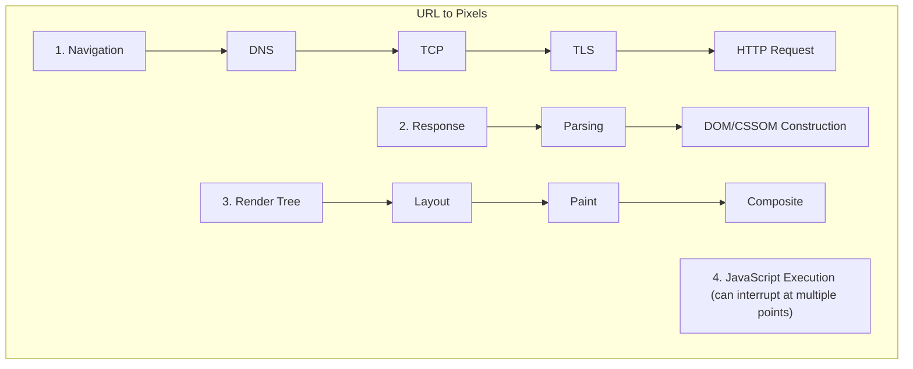

---

## 2. Phase 1: Navigation & Network

### DNS Resolution

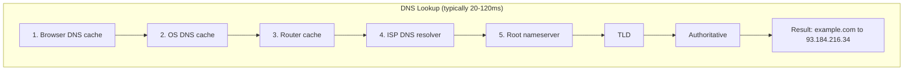

### TCP Connection (3-Way Handshake)

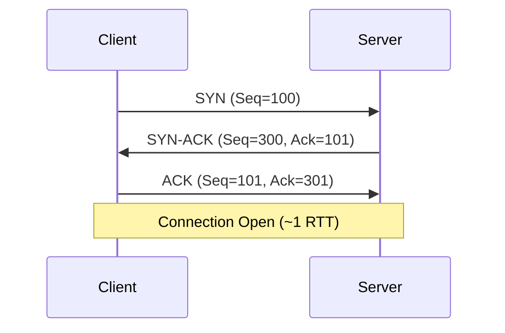

### TLS Handshake (HTTPS)

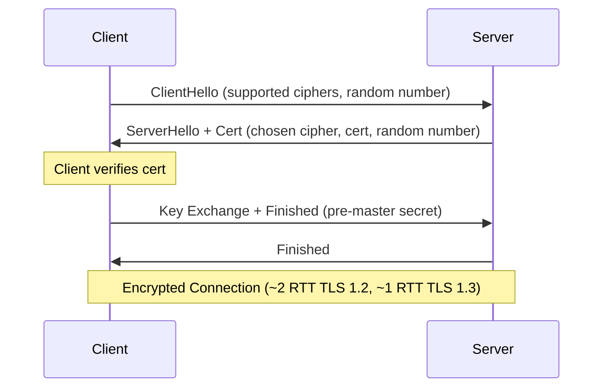

### HTTP Request/Response

```
GET /index.html HTTP/1.1
Host: example.com
Accept: text/html
Accept-Encoding: gzip, br
Connection: keep-alive

──────────────────────────────────

HTTP/1.1 200 OK
Content-Type: text/html; charset=utf-8
Content-Encoding: gzip
Cache-Control: max-age=3600
Content-Length: 12345

<!DOCTYPE html>...
```

---

## 3. Phase 2: Parsing & Tree Construction

### HTML Parsing

The browser converts HTML bytes into a **DOM tree**.

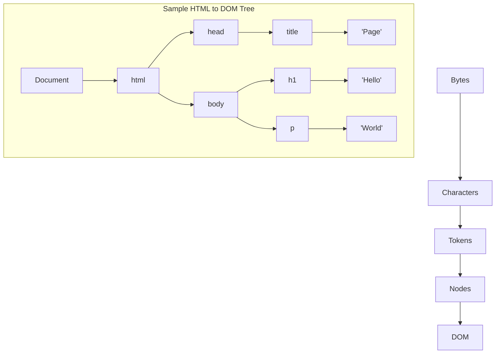

### The Preload Scanner

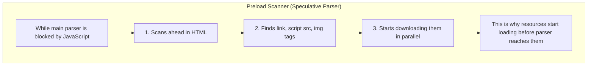

### CSS Parsing (CSSOM)

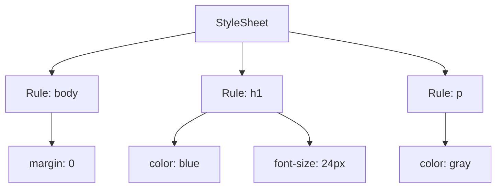

### Parser Blocking

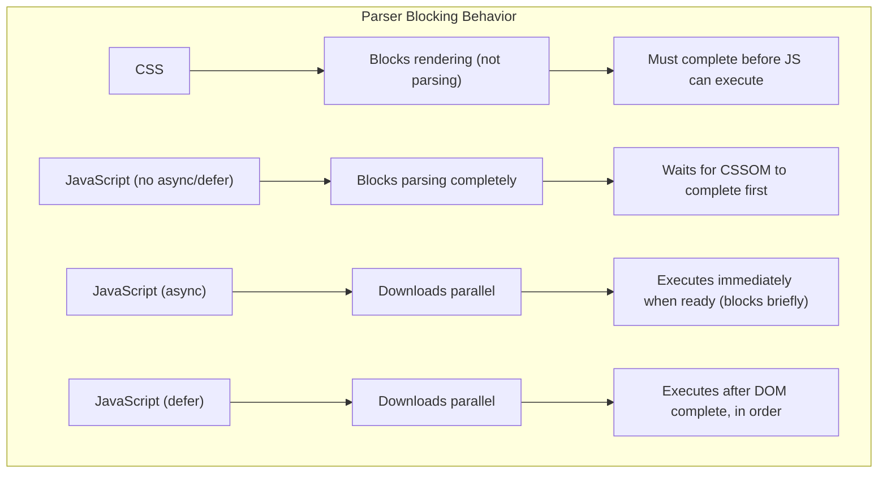

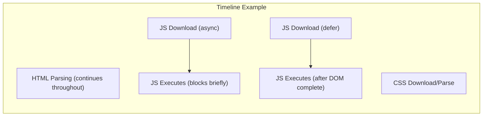

---

## 4. Phase 3: Rendering Pipeline

### Step 1: Render Tree Construction

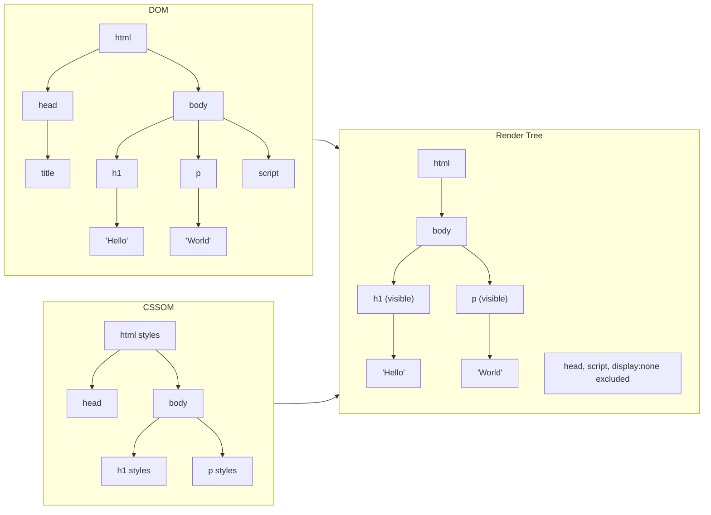

**Excluded from Render Tree:**
- `<head>`, `<script>`, `<meta>` (non-visual)
- Elements with `display: none`
- Elements with `visibility: hidden` ARE included (they affect layout)

### Step 2: Layout (Reflow)

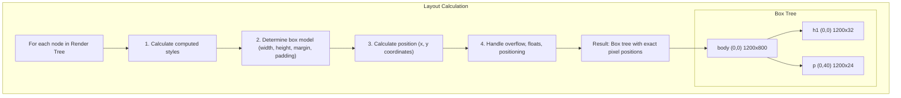

### Step 3: Paint

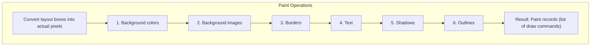

### Step 4: Composite

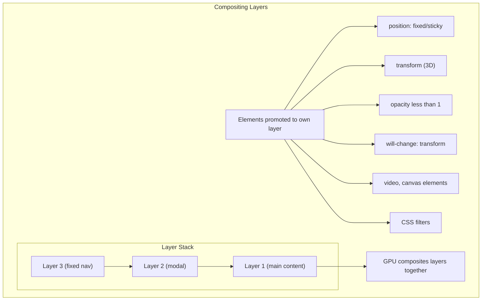

---

## 5. Reflow vs Repaint

### What Triggers Each

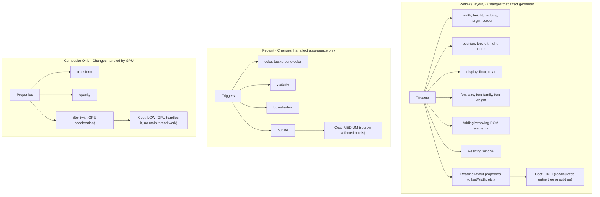

### Layout Thrashing

```js
// ❌ BAD - Forces synchronous layout on each iteration
elements.forEach(el => {
  const width = el.offsetWidth;      // READ - forces layout
  el.style.width = width + 10 + 'px'; // WRITE - invalidates layout
  // Next iteration: READ forces new layout calculation
});

// ✅ GOOD - Batch reads, then batch writes
const widths = elements.map(el => el.offsetWidth);  // All READs
elements.forEach((el, i) => {
  el.style.width = widths[i] + 10 + 'px';           // All WRITEs
});
```

```js
// ✅ BETTER - Use requestAnimationFrame
function animate() {
  // Batch DOM reads
  const measurements = elements.map(el => el.getBoundingClientRect());

  // Schedule writes for next frame
  requestAnimationFrame(() => {
    elements.forEach((el, i) => {
      el.style.transform = `translateX(${measurements[i].width}px)`;
    });
  });
}
```

---

## 6. JavaScript Execution

### The Event Loop

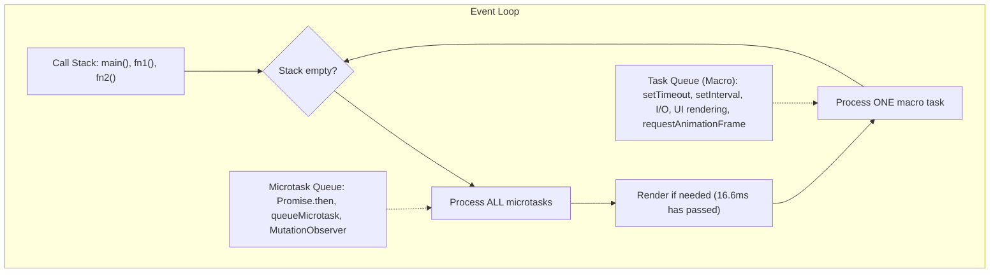

### Execution Order Example

```js
console.log('1');  // Sync

setTimeout(() => console.log('2'), 0);  // Macro task

Promise.resolve().then(() => console.log('3'));  // Microtask

console.log('4');  // Sync

// Output: 1, 4, 3, 2
```

### Long Tasks

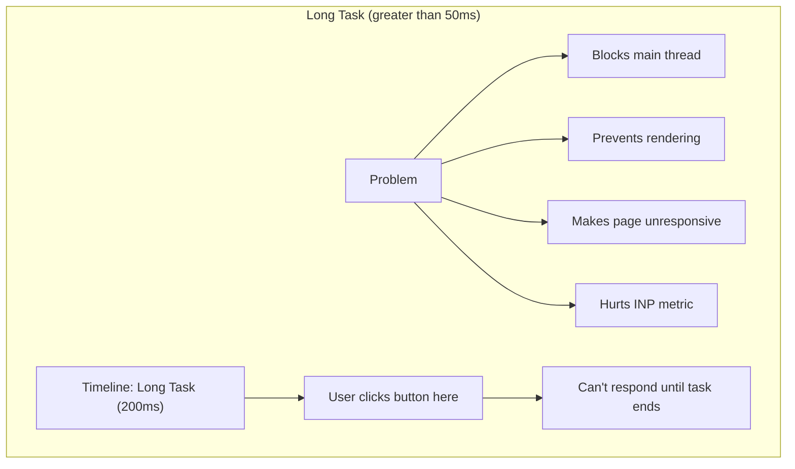

### Breaking Up Long Tasks

```js
// ❌ BAD - Single long task
function processItems(items) {
  items.forEach(item => {
    expensiveOperation(item);  // Total: 500ms
  });
}

// ✅ GOOD - Yield to main thread
async function processItems(items) {
  for (const item of items) {
    expensiveOperation(item);

    // Yield control back to browser
    await scheduler.yield?.() ||
          new Promise(r => setTimeout(r, 0));
  }
}

// ✅ ALSO GOOD - requestIdleCallback for non-urgent work
function processItems(items) {
  const queue = [...items];

  function processChunk(deadline) {
    while (queue.length && deadline.timeRemaining() > 0) {
      expensiveOperation(queue.shift());
    }

    if (queue.length) {
      requestIdleCallback(processChunk);
    }
  }

  requestIdleCallback(processChunk);
}
```

---

## 7. Document Lifecycle Events

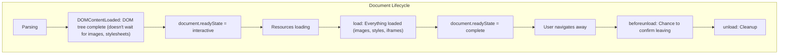

```js
// DOMContentLoaded - DOM ready, safe to query
document.addEventListener('DOMContentLoaded', () => {
  const button = document.querySelector('#myButton');
  // Safe - DOM exists
});

// load - Everything loaded
window.addEventListener('load', () => {
  // Images are loaded, can get dimensions
  const img = document.querySelector('img');
  console.log(img.naturalWidth);
});

// Check current state
if (document.readyState === 'loading') {
  document.addEventListener('DOMContentLoaded', init);
} else {
  init();  // DOM already ready
}
```

---

## 8. Frame Budget

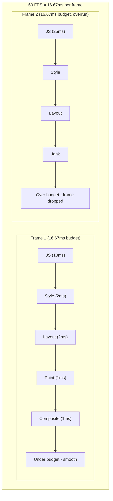

---

## 9. Optimization Summary

| Phase | Optimization |
|-------|--------------|
| **Network** | DNS prefetch, preconnect, HTTP/2, CDN |
| **Parsing** | Defer/async scripts, inline critical CSS |
| **Render Tree** | Minimize DOM nodes, avoid deep nesting |
| **Layout** | Batch reads/writes, avoid layout thrashing |
| **Paint** | Use transform/opacity, reduce paint areas |
| **Composite** | Promote animated elements, use will-change |
| **JavaScript** | Break long tasks, use Web Workers |

---

## 10. Interview Tip

> "When a browser receives an HTML document, it goes through several phases. First, it parses HTML to build the DOM while simultaneously parsing CSS to build the CSSOM. The preload scanner runs ahead to fetch resources in parallel. JavaScript blocks parsing unless marked async or defer. Once DOM and CSSOM are ready, they're combined into a Render Tree (excluding invisible elements). Layout calculates exact positions, Paint generates draw commands, and finally Composite layers are sent to the GPU. I optimize by avoiding layout thrashing, using transform for animations, deferring non-critical JavaScript, and breaking long tasks to stay within the 16ms frame budget for 60fps."
