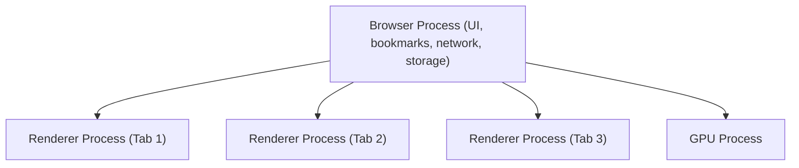
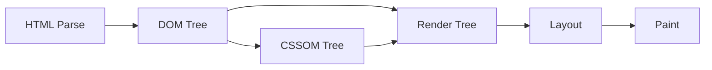
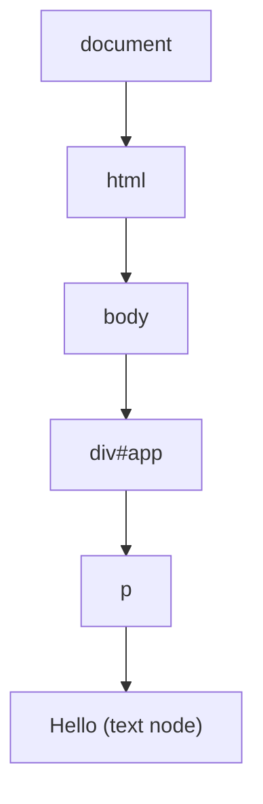
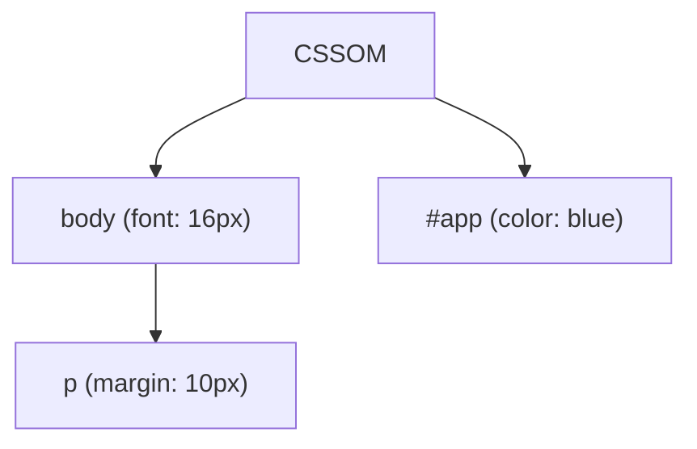
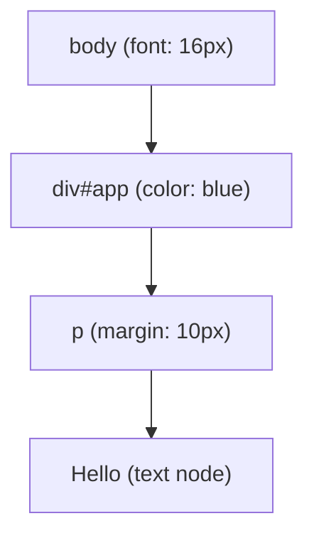
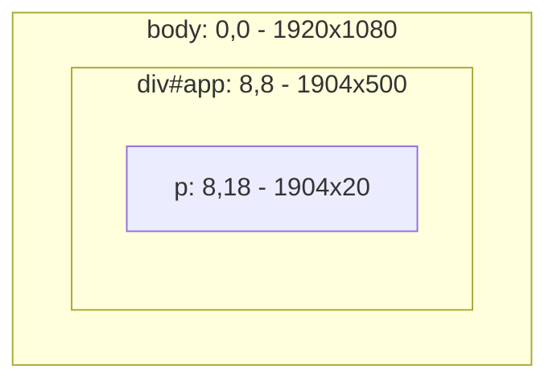
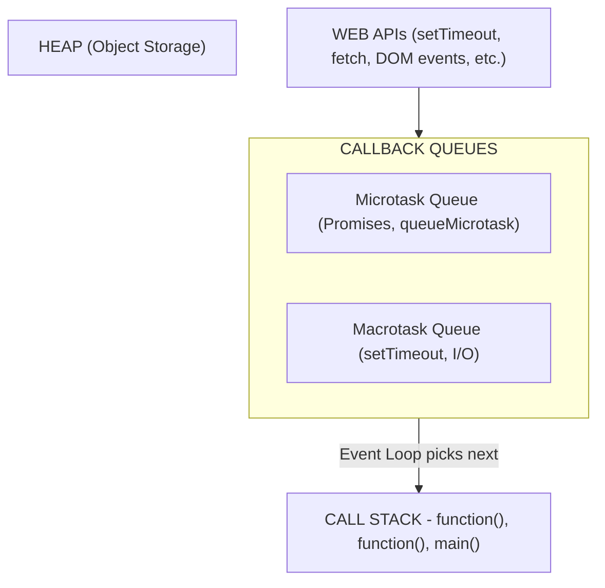
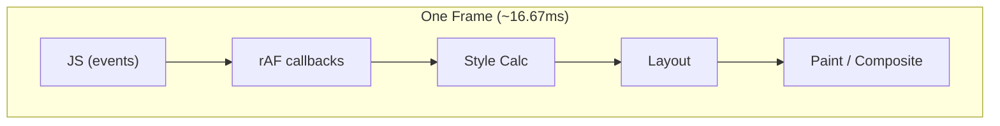

# Browser Internals: A Senior Engineer's Deep Dive

Understanding how the browser works under the hood is essential for performance optimization and debugging.

---

## 1. The Browser Architecture

Modern browsers have a multi-process architecture:



### Why Multiple Processes?

| Benefit | Explanation |
|---------|-------------|
| **Security** | Each tab is sandboxed; malicious site can't access other tabs |
| **Stability** | If one tab crashes, others survive |
| **Performance** | Parallel processing across CPU cores |

---

## 2. The Rendering Pipeline (Critical Rendering Path)

This is **the most important concept** for frontend performance.



### Step-by-Step Breakdown

#### 1. HTML Parsing → DOM Tree

```html
<html>
  <body>
    <div id="app">
      <p>Hello</p>
    </div>
  </body>
</html>
```



**Key Point:** Parser is **synchronous**. When it hits `<script>`, it STOPS.

#### 2. CSS Parsing → CSSOM Tree

```css
body { font-size: 16px; }
#app { color: blue; }
p { margin: 10px; }
```



**Key Point:** CSSOM construction **blocks rendering**. This is why we inline critical CSS.

#### 3. Render Tree (DOM + CSSOM)

Only **visible** elements are included:



NOT included:
  - `<head>` and its children
  - Elements with `display: none`
  - `<script>`, `<meta>`, `<link>`

#### 4. Layout (Reflow)

Calculates the **exact position and size** of each element:



**Expensive Operation:** Changing width, height, position triggers reflow of all descendants.

#### 5. Paint

Fills in pixels: colors, borders, shadows, text.

**Paint Order:**
1. Background color
2. Background image
3. Border
4. Children
5. Outline

#### 6. Composite

GPU combines layers into final image. Elements on separate layers can animate without repaint.

---

## 3. The Event Loop: JavaScript's Heartbeat

JavaScript is **single-threaded**. The Event Loop is how it handles async operations.

### The Mental Model



### Execution Order

```js
console.log('1');  // Sync

setTimeout(() => console.log('2'), 0);  // Macrotask

Promise.resolve().then(() => console.log('3'));  // Microtask

console.log('4');  // Sync

// Output: 1, 4, 3, 2
```

**The Rule:**
1. Execute all synchronous code (Call Stack empties)
2. Execute ALL microtasks (Promise callbacks, queueMicrotask)
3. Execute ONE macrotask (setTimeout, setInterval, I/O)
4. Repeat from step 2

### Microtasks vs Macrotasks

| Microtasks | Macrotasks |
|------------|------------|
| `Promise.then/catch/finally` | `setTimeout` |
| `queueMicrotask()` | `setInterval` |
| `MutationObserver` | `setImmediate` (Node) |
| `process.nextTick` (Node) | I/O callbacks |
| | `requestAnimationFrame`* |

*`requestAnimationFrame` runs before repaint, after microtasks.

### The Danger: Blocking the Event Loop

```js
// BAD: Blocks for 5 seconds
function processLargeArray(items) {
  items.forEach(item => {
    // Heavy computation
    heavyWork(item);
  });
}

// GOOD: Yield to the event loop
async function processLargeArray(items) {
  for (const item of items) {
    heavyWork(item);

    // Let browser breathe every 100 items
    if (index % 100 === 0) {
      await new Promise(r => setTimeout(r, 0));
    }
  }
}
```

---

## 4. Reflow vs Repaint

Understanding what triggers each is crucial for performance.

### Repaint (Cheap)

Changes to **visual properties** that don't affect layout:

```js
element.style.color = 'red';
element.style.backgroundColor = 'blue';
element.style.visibility = 'hidden';  // Still takes space
element.style.opacity = 0.5;
```

### Reflow (Expensive)

Changes to **geometry** trigger layout recalculation:

```js
element.style.width = '100px';
element.style.height = '200px';
element.style.padding = '10px';
element.style.margin = '20px';
element.style.display = 'none';  // Removed from layout
element.style.position = 'absolute';
element.style.fontSize = '20px';  // Text reflow!
```

### Layout Thrashing

The **worst performance anti-pattern**:

```js
// BAD: Forces 100 reflows!
elements.forEach(el => {
  const height = el.offsetHeight;  // READ → forces layout
  el.style.height = height + 10 + 'px';  // WRITE → invalidates layout
});

// GOOD: Batch reads, then batch writes
const heights = elements.map(el => el.offsetHeight);  // All reads

elements.forEach((el, i) => {
  el.style.height = heights[i] + 10 + 'px';  // All writes
});
```

### Properties That Trigger Layout

Reading these forces an immediate reflow:

```js
// These are "layout-triggering" getters
element.offsetTop / offsetLeft / offsetWidth / offsetHeight
element.scrollTop / scrollLeft / scrollWidth / scrollHeight
element.clientTop / clientLeft / clientWidth / clientHeight
element.getBoundingClientRect()
window.getComputedStyle(element)
```

---

## 5. Compositor Layers

The GPU can animate certain properties **without reflow or repaint**.

### Properties Handled by Compositor

```css
/* These animate on the GPU — 60fps guaranteed */
transform: translateX(100px);
transform: scale(1.5);
transform: rotate(45deg);
opacity: 0.5;
```

### How to Promote to Own Layer

```css
/* Modern way */
.animated-element {
  will-change: transform;
}

/* Legacy fallback */
.animated-element {
  transform: translateZ(0);  /* "Null transform hack" */
}
```

### The Layer Explosion Problem

```css
/* BAD: Creates too many layers */
* {
  will-change: transform;
}

/* GOOD: Only elements that will animate */
.card:hover {
  will-change: transform;
}
.card {
  will-change: auto;  /* Release after animation */
}
```

---

## 6. requestAnimationFrame: The Right Way to Animate

### Why Not setTimeout?

```js
// BAD: Timer doesn't sync with display refresh
setInterval(() => {
  element.style.left = x++ + 'px';
}, 16);  // Hoping for 60fps

// GOOD: Synced with browser's paint cycle
function animate() {
  element.style.left = x++ + 'px';
  requestAnimationFrame(animate);
}
requestAnimationFrame(animate);
```

### When rAF Fires



---

## 7. Web Workers: True Parallelism

For heavy computation that would block the main thread:

```js
// main.js
const worker = new Worker('worker.js');

worker.postMessage({ data: largeArray });

worker.onmessage = (event) => {
  console.log('Result:', event.data);
};

// worker.js
self.onmessage = (event) => {
  const result = heavyComputation(event.data);
  self.postMessage(result);
};
```

### Limitations

| Can Access | Cannot Access |
|------------|---------------|
| `fetch` | DOM |
| `setTimeout/setInterval` | `window` |
| `WebSockets` | `document` |
| `IndexedDB` | UI-related APIs |
| `postMessage` | `localStorage` (use IndexedDB) |

---

## 8. Memory Management & Garbage Collection

### How GC Works (Mark and Sweep)

```
1. Mark Phase: Start from "roots" (global, stack), mark all reachable objects
2. Sweep Phase: Delete all unmarked objects
```

### Common Memory Leaks

```js
// 1. Forgotten event listeners
element.addEventListener('click', handler);
// element removed from DOM, but handler still references it

// 2. Closures holding references
function createHandler() {
  const largeData = new Array(1000000);
  return () => console.log(largeData.length);
}

// 3. Detached DOM trees
const div = document.createElement('div');
div.innerHTML = '<span>Hello</span>';
// div never added to DOM, but JavaScript holds reference
```

### Detecting Leaks

```js
// Chrome DevTools → Memory → Take Heap Snapshot
// Compare snapshots before and after suspected leak
```

---

## 9. Interview Tip

> "I understand the browser as a multi-stage pipeline: parsing HTML/CSS into trees, combining them into the render tree, calculating layout, painting pixels, and compositing layers. I optimize by avoiding layout thrashing (batch reads before writes), using compositor-friendly properties (transform, opacity) for animations, and leveraging requestAnimationFrame for smooth 60fps. For heavy computation, I use Web Workers to keep the main thread responsive. Understanding the event loop — especially the microtask/macrotask distinction — helps me write predictable async code."
