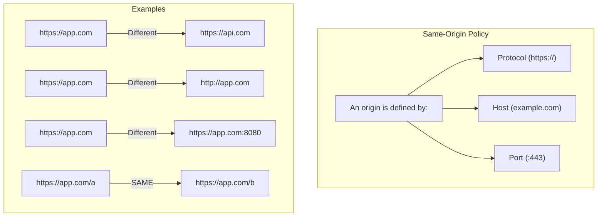
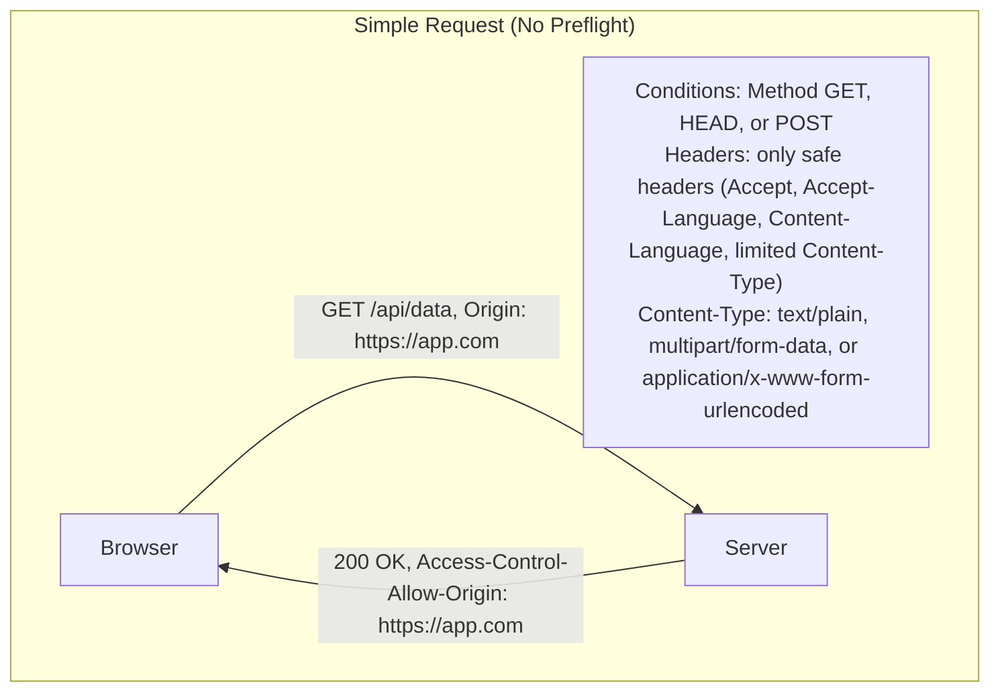
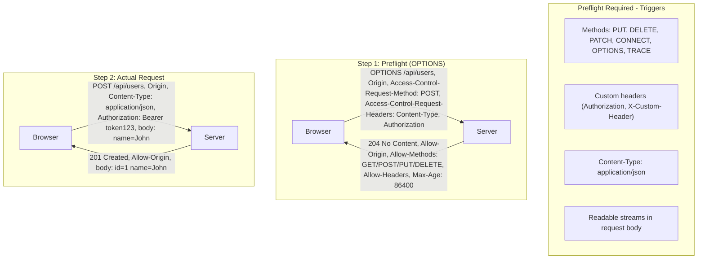
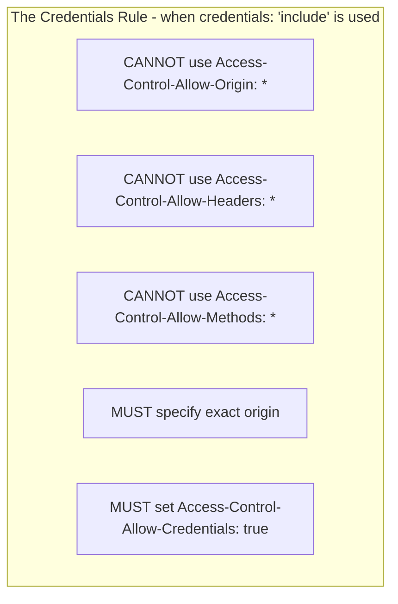
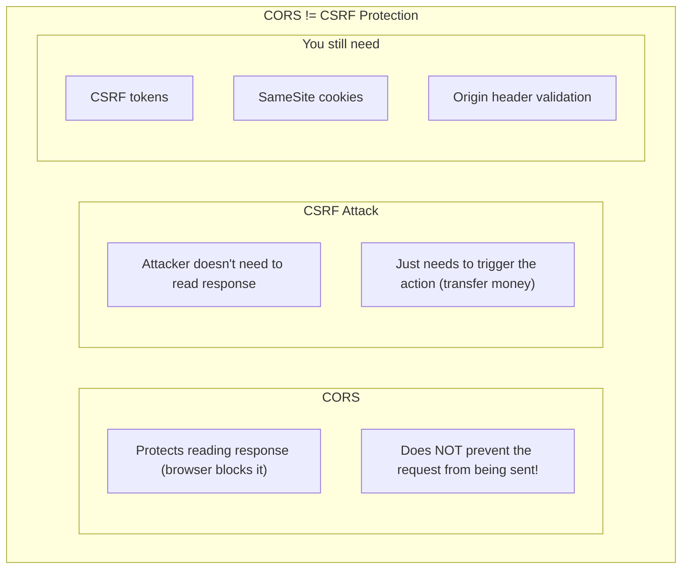

# CORS Security: A Senior Engineer's Guide

A comprehensive guide to Cross-Origin Resource Sharing for system design interviews.

---

## 1. What is CORS?

CORS (Cross-Origin Resource Sharing) is a **browser security mechanism** that controls how web pages can request resources from different origins.



### Why It Exists

```
Without CORS:

1. User logs into bank.com (gets session cookie)
2. User visits evil.com
3. evil.com runs: fetch('https://bank.com/transfer?to=hacker&amount=10000')
4. Browser sends bank.com cookie automatically!
5. Money transferred 💸

With CORS:

1. User logs into bank.com
2. User visits evil.com
3. evil.com tries fetch to bank.com
4. Browser: "Does bank.com allow requests from evil.com?"
5. bank.com: "No, only from bank.com"
6. Browser: BLOCKS the response ✋
```

---

## 2. The Preflight Dance

### Simple Requests (No Preflight)



### Preflighted Requests



---

## 3. CORS Headers Reference

### Response Headers (Server → Browser)

| Header | Purpose | Example |
|--------|---------|---------|
| `Access-Control-Allow-Origin` | Which origins can access | `https://app.com` or `*` |
| `Access-Control-Allow-Methods` | Allowed HTTP methods | `GET, POST, PUT, DELETE` |
| `Access-Control-Allow-Headers` | Allowed request headers | `Content-Type, Authorization` |
| `Access-Control-Allow-Credentials` | Allow cookies/auth | `true` |
| `Access-Control-Max-Age` | Preflight cache duration (seconds) | `86400` |
| `Access-Control-Expose-Headers` | Headers readable by JS | `X-Custom-Header` |

### Request Headers (Browser → Server)

| Header | Purpose | Set By |
|--------|---------|--------|
| `Origin` | Requesting origin | Browser (automatic) |
| `Access-Control-Request-Method` | Method for actual request | Browser (preflight) |
| `Access-Control-Request-Headers` | Headers for actual request | Browser (preflight) |

---

## 4. Common CORS Configurations

### Allow All Origins (Development Only!)

```js
// Express.js - DANGEROUS for production
app.use((req, res, next) => {
  res.header('Access-Control-Allow-Origin', '*');
  res.header('Access-Control-Allow-Methods', 'GET, POST, PUT, DELETE');
  res.header('Access-Control-Allow-Headers', 'Content-Type');
  next();
});
```

### Allow Specific Origin

```js
// Express.js - Production safe
const allowedOrigins = ['https://app.example.com', 'https://admin.example.com'];

app.use((req, res, next) => {
  const origin = req.headers.origin;

  if (allowedOrigins.includes(origin)) {
    res.header('Access-Control-Allow-Origin', origin);
  }

  res.header('Access-Control-Allow-Methods', 'GET, POST, PUT, DELETE');
  res.header('Access-Control-Allow-Headers', 'Content-Type, Authorization');
  next();
});
```

### With Credentials (Cookies)

```js
// Frontend
fetch('https://api.example.com/data', {
  credentials: 'include'  // Send cookies
});

// Backend - MUST be specific origin (not *)
app.use((req, res, next) => {
  res.header('Access-Control-Allow-Origin', 'https://app.example.com');
  res.header('Access-Control-Allow-Credentials', 'true');
  next();
});
```

### Using cors Middleware

```js
const cors = require('cors');

// Simple - allow all
app.use(cors());

// Production configuration
app.use(cors({
  origin: ['https://app.example.com', 'https://admin.example.com'],
  methods: ['GET', 'POST', 'PUT', 'DELETE'],
  allowedHeaders: ['Content-Type', 'Authorization'],
  credentials: true,
  maxAge: 86400  // Cache preflight for 24 hours
}));

// Dynamic origin validation
app.use(cors({
  origin: (origin, callback) => {
    // Allow requests with no origin (mobile apps, curl)
    if (!origin) return callback(null, true);

    if (allowedOrigins.includes(origin)) {
      callback(null, true);
    } else {
      callback(new Error('Not allowed by CORS'));
    }
  }
}));
```

---

## 5. The Credentials Trap



```js
// ❌ WRONG - Won't work with credentials
res.header('Access-Control-Allow-Origin', '*');
res.header('Access-Control-Allow-Credentials', 'true');

// ✅ CORRECT - Specific origin required
res.header('Access-Control-Allow-Origin', 'https://app.example.com');
res.header('Access-Control-Allow-Credentials', 'true');
```

---

## 6. Handling Preflight Efficiently

### Cache Preflight Results

```js
// Server - Cache preflight for 24 hours
res.header('Access-Control-Max-Age', '86400');
```

```
Without caching:
  Request 1: OPTIONS → Response → POST → Response
  Request 2: OPTIONS → Response → POST → Response
  Request 3: OPTIONS → Response → POST → Response

With Max-Age: 86400:
  Request 1: OPTIONS → Response → POST → Response
  Request 2: POST → Response (no preflight!)
  Request 3: POST → Response (no preflight!)
```

### Handle OPTIONS Explicitly

```js
// Handle preflight quickly
app.options('*', (req, res) => {
  res.header('Access-Control-Allow-Origin', req.headers.origin);
  res.header('Access-Control-Allow-Methods', 'GET, POST, PUT, DELETE');
  res.header('Access-Control-Allow-Headers', 'Content-Type, Authorization');
  res.header('Access-Control-Max-Age', '86400');
  res.sendStatus(204);
});
```

---

## 7. CORS vs CSRF



### Proper CSRF Protection

```js
// Use SameSite cookies
res.cookie('session', token, {
  httpOnly: true,
  secure: true,
  sameSite: 'strict'  // or 'lax'
});

// Validate Origin header
app.use((req, res, next) => {
  const origin = req.headers.origin;
  const referer = req.headers.referer;

  if (req.method !== 'GET') {
    if (!origin && !referer) {
      return res.status(403).json({ error: 'Origin required' });
    }

    const allowedOrigin = 'https://app.example.com';
    if (origin && origin !== allowedOrigin) {
      return res.status(403).json({ error: 'Invalid origin' });
    }
  }

  next();
});
```

---

## 8. Common CORS Errors & Solutions

### Error: "No 'Access-Control-Allow-Origin' header"

```
Cause: Server doesn't send CORS headers

Fix:
app.use((req, res, next) => {
  res.header('Access-Control-Allow-Origin', 'https://app.example.com');
  next();
});
```

### Error: "The value of 'Access-Control-Allow-Origin' must not be '*' when credentials mode is 'include'"

```
Cause: Using wildcard with credentials

Fix:
// Use specific origin instead of '*'
res.header('Access-Control-Allow-Origin', req.headers.origin);
res.header('Access-Control-Allow-Credentials', 'true');
```

### Error: "Method PUT is not allowed"

```
Cause: Method not in Access-Control-Allow-Methods

Fix:
res.header('Access-Control-Allow-Methods', 'GET, POST, PUT, DELETE');
```

### Error: "Request header X-Custom-Header is not allowed"

```
Cause: Custom header not in Access-Control-Allow-Headers

Fix:
res.header('Access-Control-Allow-Headers', 'Content-Type, Authorization, X-Custom-Header');
```

---

## 9. Alternatives to CORS

### JSONP (Legacy)

```html
<!-- Only GET requests, security risks -->
<script src="https://api.example.com/data?callback=handleData"></script>

<script>
function handleData(data) {
  console.log(data);
}
</script>
```

### Proxy Server

```js
// Your server proxies requests to third-party API
// Same origin from browser's perspective

// Frontend
fetch('/api/proxy/external-data');

// Backend
app.get('/api/proxy/external-data', async (req, res) => {
  const response = await fetch('https://external-api.com/data');
  const data = await response.json();
  res.json(data);
});
```

### PostMessage (Cross-Window)

```js
// Parent window
const iframe = document.querySelector('iframe');
iframe.contentWindow.postMessage({ type: 'getData' }, 'https://widget.example.com');

window.addEventListener('message', (event) => {
  if (event.origin !== 'https://widget.example.com') return;
  console.log('Received:', event.data);
});

// In iframe
window.addEventListener('message', (event) => {
  if (event.origin !== 'https://app.example.com') return;
  if (event.data.type === 'getData') {
    event.source.postMessage({ data: 'response' }, event.origin);
  }
});
```

---

## 10. Security Best Practices

### Do's ✅

```js
// 1. Whitelist specific origins
const allowedOrigins = new Set([
  'https://app.example.com',
  'https://admin.example.com'
]);

// 2. Validate origin dynamically
if (allowedOrigins.has(req.headers.origin)) {
  res.header('Access-Control-Allow-Origin', req.headers.origin);
}

// 3. Limit exposed headers
res.header('Access-Control-Expose-Headers', 'X-Request-Id');

// 4. Use Vary header for caching
res.header('Vary', 'Origin');

// 5. Cache preflight results
res.header('Access-Control-Max-Age', '86400');
```

### Don'ts ❌

```js
// 1. Never reflect Origin header blindly
res.header('Access-Control-Allow-Origin', req.headers.origin);  // Dangerous!

// 2. Don't use * with credentials
res.header('Access-Control-Allow-Origin', '*');
res.header('Access-Control-Allow-Credentials', 'true');

// 3. Don't allow all headers
res.header('Access-Control-Allow-Headers', '*');  // Too permissive

// 4. Don't forget to validate on server side
// CORS is browser-only - attackers can bypass it
```

### Proper Origin Validation

```js
const allowedOrigins = [
  'https://app.example.com',
  'https://admin.example.com'
];

function isValidOrigin(origin) {
  if (!origin) return false;

  // Exact match
  if (allowedOrigins.includes(origin)) return true;

  // Subdomain match (be careful!)
  try {
    const url = new URL(origin);
    return url.hostname.endsWith('.example.com') &&
           url.protocol === 'https:';
  } catch {
    return false;
  }
}

app.use((req, res, next) => {
  const origin = req.headers.origin;

  if (isValidOrigin(origin)) {
    res.header('Access-Control-Allow-Origin', origin);
    res.header('Vary', 'Origin');
  }

  next();
});
```

---

## 11. Quick Reference

| Scenario | Configuration |
|----------|---------------|
| Public API (read-only) | `Access-Control-Allow-Origin: *` |
| Private API with cookies | Specific origin + `Allow-Credentials: true` |
| Multiple allowed origins | Dynamic origin validation |
| Reduce preflight requests | `Access-Control-Max-Age: 86400` |
| Custom headers needed | List in `Allow-Headers` |

---

## 12. Interview Tip

> "CORS is a browser security mechanism that controls cross-origin requests. The browser sends an Origin header, and the server must respond with Access-Control-Allow-Origin to permit the request. For non-simple requests (POST with JSON, custom headers, or PUT/DELETE), the browser first sends a preflight OPTIONS request to check permissions. When using credentials like cookies, the server must specify the exact origin—wildcards aren't allowed. I optimize performance by caching preflight results with Access-Control-Max-Age. Importantly, CORS doesn't prevent CSRF attacks since it only blocks reading responses, not sending requests—for that, I use SameSite cookies and CSRF tokens."
