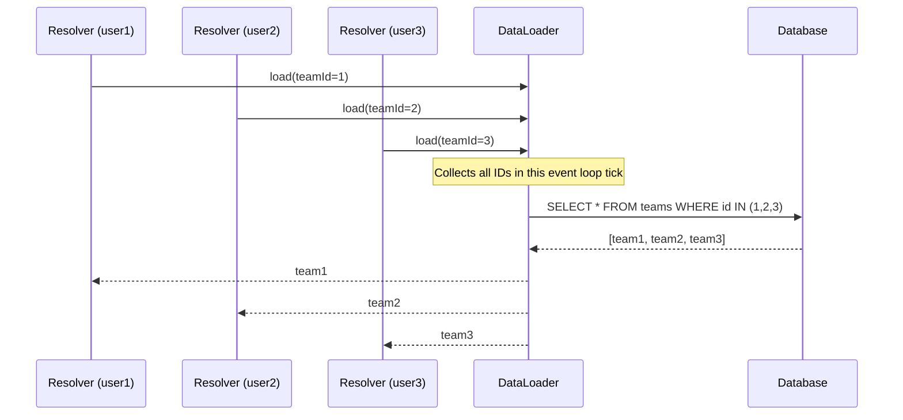
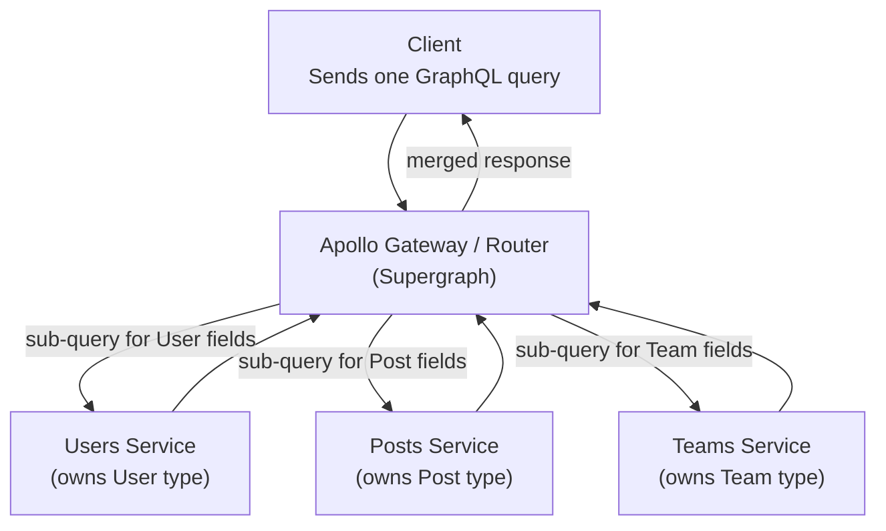

# GraphQL — Interview Reference

---

## What is GraphQL?

GraphQL is a **query language for APIs and a runtime for executing those queries** against your data. The client describes exactly what data it needs — the server returns exactly that, nothing more.

> **One-liner:** GraphQL replaces multiple REST endpoints with a single typed endpoint where the client controls the shape of the response.

---

## Why GraphQL — The REST Problems it Solves

### Over-fetching

```
GET /users/123
→ { id, name, email, address, phone, createdAt, updatedAt, preferences, ... }
// Client only needed: name and email. Got 15 fields.
```

### Under-fetching (N+1 requests)

```
GET /users/123          → { id, name, teamId }
GET /teams/456          → { id, name, managerId }
GET /users/789          → { id, name }   ← manager
// 3 requests to show one user's team info
```

### GraphQL solution

```graphql
query {
  user(id: "123") {
    name
    email
    team {
      name
      manager {
        name
      }
    }
  }
}
# One request. Exactly the fields requested. Server resolves relationships.
```

---

## Core Concepts

### Schema — the contract

```graphql
type User {
  id: ID!           # ! = non-nullable
  name: String!
  email: String!
  team: Team        # nullable — user might have no team
  posts: [Post!]!   # non-nullable list of non-nullable Posts
}

type Team {
  id: ID!
  name: String!
  members: [User!]!
}

type Query {
  user(id: ID!): User
  users(limit: Int = 10, offset: Int = 0): [User!]!
}

type Mutation {
  createUser(input: CreateUserInput!): User!
  updateUser(id: ID!, input: UpdateUserInput!): User!
  deleteUser(id: ID!): Boolean!
}

type Subscription {
  userCreated: User!
  postAdded(userId: ID!): Post!
}

input CreateUserInput {
  name: String!
  email: String!
}
```

### Resolvers — how fields are fetched

```js
const resolvers = {
  Query: {
    user: (parent, { id }, context) => context.db.users.findById(id),
    users: (parent, { limit, offset }, context) =>
      context.db.users.findAll({ limit, offset }),
  },

  User: {
    // This runs FOR EACH User returned — classic N+1 problem!
    team: (user, args, context) => context.db.teams.findById(user.teamId),
    posts: (user, args, context) => context.db.posts.findByUserId(user.id),
  },

  Mutation: {
    createUser: (parent, { input }, context) => context.db.users.create(input),
  },
};
```

**Resolver signature:** `(parent, args, context, info)`
- `parent` — result of the parent resolver
- `args` — arguments from the query
- `context` — shared per-request object (auth user, db connections, DataLoader instances)
- `info` — query AST, requested fields, path

---

## The N+1 Problem — GraphQL's Biggest Pitfall

```graphql
query {
  users {        # 1 query → returns 100 users
    name
    team { name } # 100 queries — one per user! → N+1
  }
}
```

```
DB queries:
  SELECT * FROM users                    -- 1 query
  SELECT * FROM teams WHERE id = 1       -- for user 1
  SELECT * FROM teams WHERE id = 2       -- for user 2
  SELECT * FROM teams WHERE id = 3       -- for user 3
  ... × 100
Total: 101 queries
```

### Solution — DataLoader (batching + caching)

DataLoader collects all IDs requested within a single event loop tick, then fires a single batched query.

```js
import DataLoader from 'dataloader';

// Create per-request (in context factory)
const teamLoader = new DataLoader(async (teamIds) => {
  // Called once with ALL teamIds collected in this tick
  const teams = await db.teams.findByIds(teamIds);
  // Must return results in same order as teamIds
  return teamIds.map(id => teams.find(t => t.id === id));
});

// In resolver — looks like N calls, batched into 1
const resolvers = {
  User: {
    team: (user) => teamLoader.load(user.teamId), // schedules, doesn't fetch yet
  }
};

// What actually happens:
// All 100 user.team resolvers call teamLoader.load(id)
// DataLoader collects all 100 ids in one tick
// Fires: SELECT * FROM teams WHERE id IN (1, 2, 3, ..., 100) — 1 query!
```



**DataLoader also caches within a request** — if two resolvers request the same team, the second call hits the in-memory cache. Clear per-request to avoid stale data between requests.

---

## Caching — GraphQL's Hard Problem

GraphQL uses a **single POST endpoint** — HTTP caching doesn't work.

```
GET /users/123    → CDN caches by URL ✅
POST /graphql     → CDN can't cache POST ❌ (different query bodies, same URL)
```

### Client-side caching (Apollo / urql)

Apollo normalizes the cache by type + ID:

```js
// Query 1: fetch user
{ user(id: "1") { id name email } }
// Cached as: User:1 → { name: "Alice", email: "a@b.com" }

// Query 2: update same user
mutation { updateUser(id: "1", input: { name: "Bob" }) { id name } }
// Apollo automatically updates User:1 in cache → all queries showing user 1 update
```

```js
// Apollo cache config
const client = new ApolloClient({
  cache: new InMemoryCache({
    typePolicies: {
      User: {
        keyFields: ['id'],  // normalize by id
      },
      Query: {
        fields: {
          users: {
            // Merge paginated results instead of overwriting
            keyArgs: false,
            merge(existing = [], incoming) {
              return [...existing, ...incoming];
            }
          }
        }
      }
    }
  })
});
```

### Persisted Queries — restoring HTTP caching

```js
// Client sends a hash of the query instead of the full query
// GET /graphql?operationName=GetUser&extensions={"persistedQuery":{"hash":"abc123"}}

// Server looks up full query by hash → can be cached by CDN (GET request!)
// First request: hash miss → client sends full query → server caches it
// Subsequent: hash hit → CDN serves directly

// Apollo setup
import { createPersistedQueryLink } from '@apollo/client/link/persisted-queries';
const link = createPersistedQueryLink().concat(httpLink);
```

---

## Fragments — Reusable Field Sets

```graphql
fragment UserCard on User {
  id
  name
  avatarUrl
  role
}

query GetTeam($teamId: ID!) {
  team(id: $teamId) {
    name
    members {
      ...UserCard    # reuse the fragment
    }
    manager {
      ...UserCard    # reuse again
    }
  }
}
```

**Co-located fragments (Relay pattern)** — each component declares the data it needs:

```jsx
// UserCard.jsx
const USER_CARD_FRAGMENT = gql`
  fragment UserCard on User {
    id
    name
    avatarUrl
  }
`;

function UserCard({ user }) {
  return <div>{user.name}</div>;
}

// Parent query spreads the fragment — component owns its data requirements
const TEAM_QUERY = gql`
  ${USER_CARD_FRAGMENT}
  query GetTeam($id: ID!) {
    team(id: $id) {
      members { ...UserCard }
    }
  }
`;
```

This is the **Relay compiler pattern** — data requirements live next to the component that uses them. Removes the guessing of what fields each component needs.

---

## Subscriptions — Real-time over WebSocket

```graphql
# Client subscribes
subscription OnPostAdded($userId: ID!) {
  postAdded(userId: $userId) {
    id
    title
    createdAt
  }
}
```

```js
// Server — subscription resolver
const resolvers = {
  Subscription: {
    postAdded: {
      subscribe: (parent, { userId }, { pubsub }) =>
        pubsub.asyncIterator(`POST_ADDED_${userId}`),
    }
  },
  Mutation: {
    createPost: async (parent, { input }, { pubsub, db }) => {
      const post = await db.posts.create(input);
      // Publish to all subscribers of this user's channel
      await pubsub.publish(`POST_ADDED_${input.userId}`, { postAdded: post });
      return post;
    }
  }
};
```

**Transport:** GraphQL subscriptions use WebSocket (via `graphql-ws` protocol, replacing the deprecated `subscriptions-transport-ws`).

At scale: replace in-memory PubSub with Redis PubSub — the subscription server publishes to Redis, all WS server instances subscribed to that channel fan out to connected clients.

---

## Directives

```graphql
query GetUser($id: ID!, $showEmail: Boolean!) {
  user(id: $id) {
    name
    email @include(if: $showEmail)   # field included conditionally
    role @skip(if: $isPublic)        # field skipped conditionally
    avatar @deprecated(reason: "Use avatarUrl instead")
  }
}
```

---

## Error Handling

GraphQL always returns 200 — errors are in the response body alongside data:

```json
{
  "data": {
    "user": {
      "name": "Alice",
      "team": null
    }
  },
  "errors": [
    {
      "message": "Team not found",
      "locations": [{ "line": 4, "column": 5 }],
      "path": ["user", "team"],
      "extensions": { "code": "NOT_FOUND" }
    }
  ]
}
```

**Partial success** — if one resolver fails, other fields still resolve. The error field indicates which paths failed.

---

## Federation — GraphQL at Scale (Multiple Services)

Apollo Federation lets multiple GraphQL services each own part of the schema, composed into one graph.

```graphql
# users-service schema
type User @key(fields: "id") {
  id: ID!
  name: String!
  email: String!
}

# posts-service schema — extends User from another service
type Post {
  id: ID!
  title: String!
  author: User!  # resolved by users-service via federation
}

extend type User @key(fields: "id") {
  id: ID! @external
  posts: [Post!]! # resolved by posts-service
}
```



**The Gateway** composes queries into sub-queries per service, executes them in parallel where possible, merges results, returns one response to the client.

---

## REST vs GraphQL — When to Choose

| | REST | GraphQL |
|---|---|---|
| **HTTP caching** | Native (GET requests, CDN) | Hard (POST, needs persisted queries) |
| **Over-fetching** | Common | Eliminated by design |
| **Multiple resources** | Multiple requests | One query |
| **Schema / type safety** | OpenAPI (optional) | Built-in, enforced |
| **Subscriptions** | SSE or WebSocket (manual) | First-class subscription type |
| **Learning curve** | Low | Higher (schema, resolvers, N+1) |
| **File uploads** | Simple multipart | Awkward (graphql-multipart) |
| **Best for** | Public APIs, simple CRUD, CDN-heavy | Complex data graphs, mobile (bandwidth), micro-services |

---

## Interview Summary

### Key talking points

1. "GraphQL solves over-fetching (get only what you ask for) and under-fetching (one request for nested relationships). The trade-off: you move complexity from the client to the server — resolvers, DataLoader, schema design."

2. "The N+1 problem is GraphQL's most common performance pitfall. If you have a list of 100 users and each user resolver fetches its team individually, that's 101 database queries. DataLoader fixes this by batching all team IDs collected within one event loop tick into a single IN query."

3. "HTTP caching doesn't work for GraphQL because everything goes through one POST endpoint. Client-side normalized caching (Apollo InMemoryCache) compensates — it updates all queries that reference the same entity by type+ID when any mutation touches that entity. Persisted queries restore GET-based CDN caching."

4. "Fragments are the mechanism for co-locating data requirements with components. Each component declares its own fragment; the parent query spreads them all. This eliminates the guessing game of which fields each component needs."

5. "Apollo Federation lets multiple teams own separate schemas (users-service, posts-service) while clients see one unified graph. The Gateway composes sub-queries, executes in parallel where possible, merges results. Teams are fully independent — each service can deploy without touching others."

6. "Subscriptions use WebSocket (graphql-ws protocol). At scale, replace in-process PubSub with Redis PubSub so all Gateway instances can publish to the same channel and fan out to their respective connected clients."
