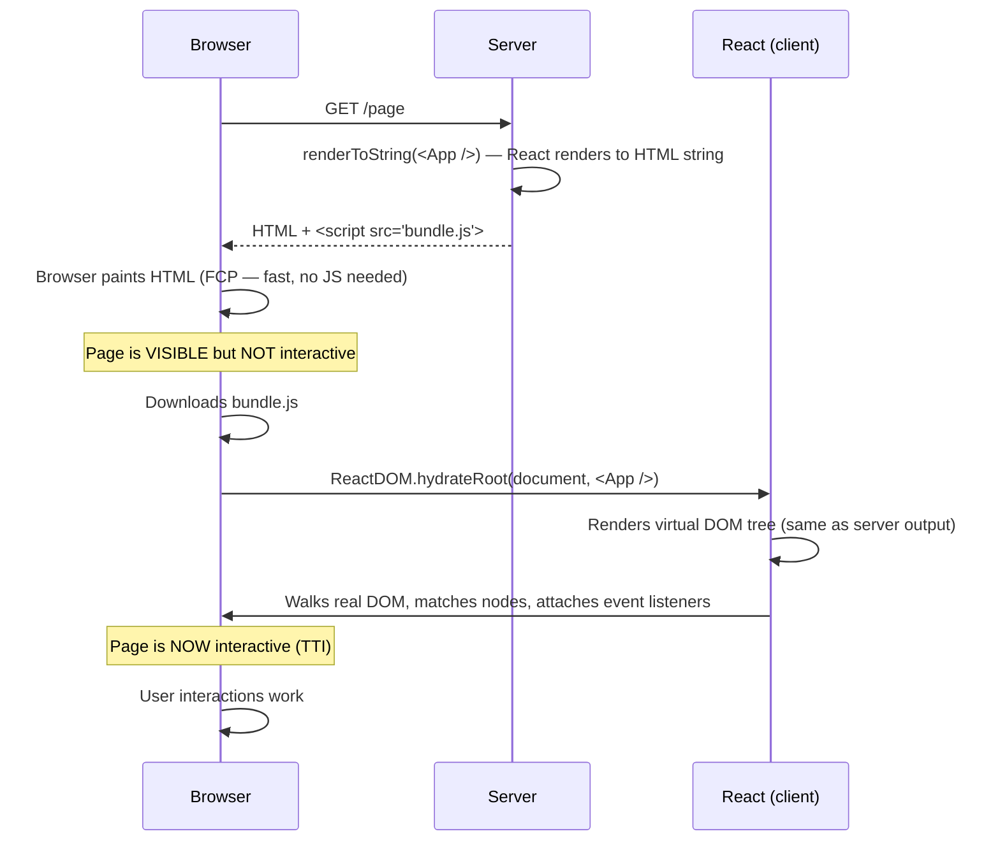
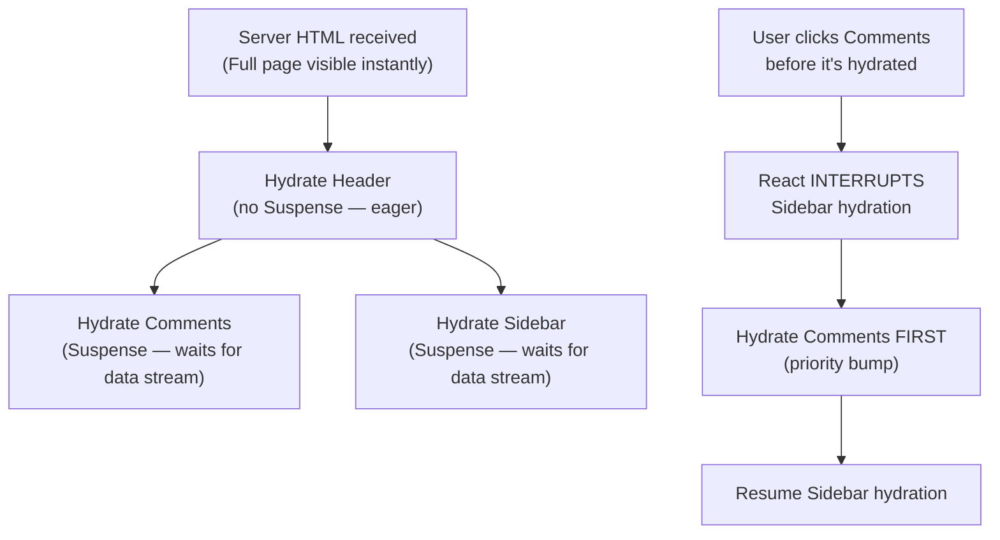
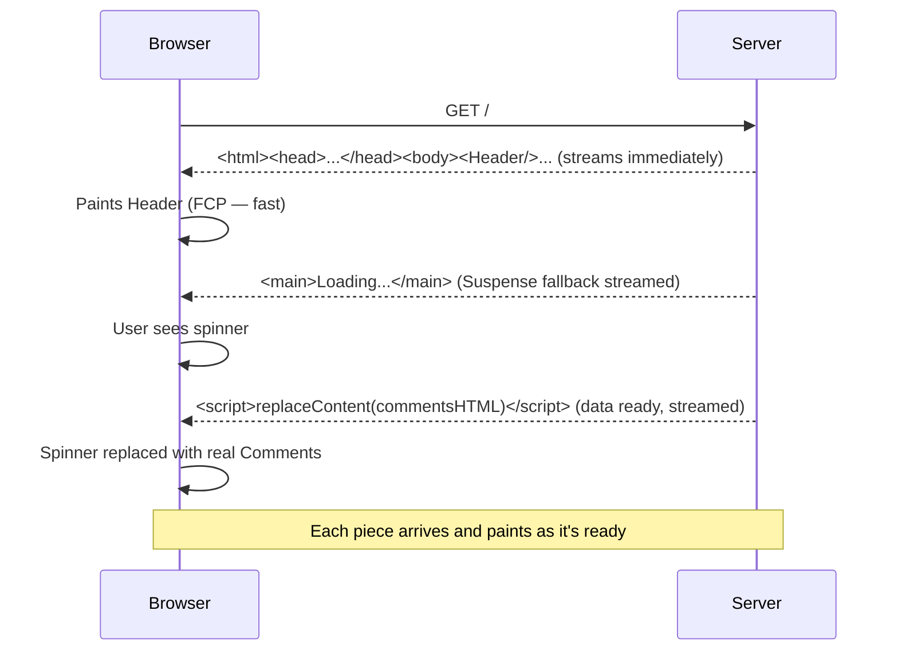
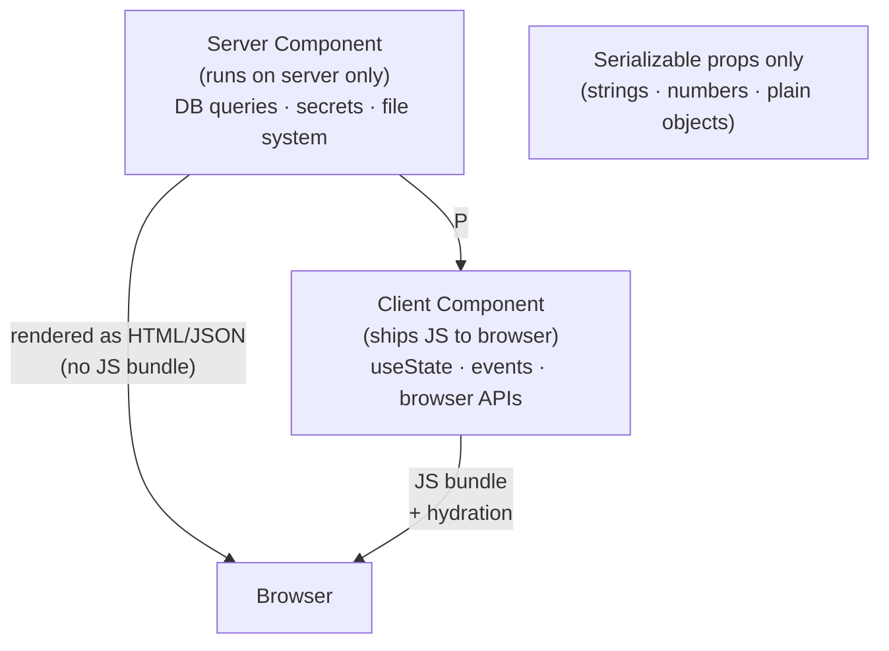

# Hydration — Interview Reference

---

## What is Hydration?

Hydration is the process of **attaching JavaScript event listeners and React state to server-rendered HTML** so a static page becomes interactive.

> **One-liner:** The server sends HTML the browser can paint immediately. React then "hydrates" it — walks the DOM, matches it to the virtual DOM, and attaches event handlers — without re-rendering.

Without hydration: SSR gives you fast first paint but a dead page — no clicks, no state.
Without SSR: you get a blank page until JS downloads and React renders everything client-side.

---

## The Hydration Flow



**The gap between FCP (paint) and TTI (interactive) is the "uncanny valley"** — the page looks complete but buttons don't work.

---

## How React Hydration Works Internally

React does **not** throw away the server HTML and re-render. It reuses the existing DOM nodes.

```
Server HTML:  <div id="root"><button class="btn">Click me</button></div>
React vDOM:   <div><button className="btn">Click me</button></div>

Hydration:
  1. Start at root DOM node
  2. Compare: real DOM node type === React element type? → YES → adopt this node
  3. Set internal fiber references (React's internal pointer) to this real DOM node
  4. Attach event listeners (React uses delegation — one listener at root)
  5. Repeat for every child
```

React uses **one delegated event listener at the root** — not per-element listeners. All events bubble up to the root and React dispatches them to the correct fiber.

---

## Hydration Mismatch

If the server-rendered HTML doesn't match what React expects to render client-side, React **throws a hydration error and re-renders from scratch** — destroying the server HTML and replacing it.

```jsx
// ❌ Mismatch — Date.now() different on server vs client
function Page() {
  return <div>Rendered at: {Date.now()}</div>;
}

// ❌ Mismatch — window/localStorage not available on server
function Page() {
  return <div>{localStorage.getItem('theme')}</div>;
}

// ❌ Mismatch — random IDs
function Item() {
  return <div id={Math.random()}>Item</div>;
}
```

**How React handles mismatches:**
- **React 17 and below:** Silent mismatch → patches individual nodes → inconsistent state
- **React 18:** Throws a hydration error in dev, attempts recovery in prod (re-renders subtree client-side)

**Fixing mismatches:**

```jsx
// Fix 1 — useEffect runs only client-side (after hydration)
function Page() {
  const [time, setTime] = useState(null);
  useEffect(() => setTime(Date.now()), []); // runs after hydration
  return <div>Rendered at: {time ?? 'loading...'}</div>;
}

// Fix 2 — suppressHydrationWarning for intentional differences
function Clock() {
  return <time suppressHydrationWarning>{new Date().toISOString()}</time>;
}

// Fix 3 — stable IDs with useId (React 18)
function Item() {
  const id = useId(); // deterministic, same on server and client
  return <div id={id}>Item</div>;
}
```

---

## Full Hydration vs Selective Hydration

### Full Hydration (traditional)

All components hydrate before any are interactive. The entire JS bundle must download and execute before the first click works.

```
Download 500KB bundle → parse → execute → hydrate entire tree → interactive
Time: ~3-5s on mobile
```

### Selective Hydration (React 18 — Suspense-based)

React can hydrate different parts of the tree independently. Wrapped in `<Suspense>`, a component can:
- Skip hydration initially (show fallback)
- Hydrate when its data is ready
- Be **prioritized** if the user clicks on it

```jsx
// React 18 — each Suspense boundary hydrates independently
function App() {
  return (
    <div>
      <Header />  {/* hydrates first — no Suspense */}
      <Suspense fallback={<Spinner />}>
        <Comments />  {/* hydrates later — waits for its data */}
      </Suspense>
      <Suspense fallback={<Spinner />}>
        <Sidebar />   {/* hydrates independently */}
      </Suspense>
    </div>
  );
}
```

**Priority hydration:** If the user clicks on `<Comments>` before it's hydrated, React interrupts hydration of everything else and hydrates `<Comments>` first to respond to the click.



---

## Streaming SSR

Instead of waiting for the entire page to be ready before sending HTML, the server **streams HTML in chunks** as each part becomes ready.

```js
// React 18 — renderToPipeableStream
import { renderToPipeableStream } from 'react-dom/server';

app.get('/', (req, res) => {
  const { pipe } = renderToPipeableStream(<App />, {
    bootstrapScripts: ['/bundle.js'],
    onShellReady() {
      res.setHeader('Content-Type', 'text/html');
      pipe(res); // start streaming immediately
    }
  });
});
```



**Why this matters:** TTFB (time to first byte) is instant. FCP is fast. Individual sections appear as their data is ready — no single blocking waterfall.

---

## Islands Architecture

> **The idea:** Most of a page is static content. Only isolated "islands" need JavaScript and interactivity. Hydrate only the islands, not the entire page.

```
+------------------------------------------+
|  STATIC HEADER (no JS needed)            |
+------------------------------------------+
|  STATIC ARTICLE BODY (no JS needed)      |
|                                          |
|  ┌──────────────────┐   ┌────────────┐  |
|  │  🏝 ISLAND       │   │ 🏝 ISLAND  │  |
|  │  Comment Form    │   │ Like Btn   │  |
|  │  (JS hydrated)   │   │ (hydrated) │  |
|  └──────────────────┘   └────────────┘  |
+------------------------------------------+
|  STATIC FOOTER (no JS needed)            |
+------------------------------------------+
```

**Frameworks implementing this:**
- **Astro** — islands are explicit `client:*` directives
- **Fresh (Deno)** — islands are components in `/islands/` directory
- **Qwik** — lazy hydration taken to extreme (resumability)

```jsx
// Astro syntax — explicit per-component hydration strategy
<Header />                        // static — no JS shipped
<ArticleBody content={content} /> // static — no JS shipped
<CommentForm client:load />       // hydrate immediately on load
<LikeButton client:visible />     // hydrate when scrolled into view
<Analytics client:idle />         // hydrate when browser is idle
```

**`client:visible`** — uses `IntersectionObserver` to delay hydration until the component enters the viewport. Components below the fold don't hydrate until the user scrolls to them.

---

## React Server Components (RSC)

RSC goes further than SSR — some components **never ship JavaScript to the client at all**.

```jsx
// Server Component — runs only on server, zero JS in bundle
// Can: fetch data, access filesystem, use secrets
// Cannot: useState, useEffect, event handlers, browser APIs
async function ProductPage({ id }) {
  const product = await db.products.findById(id); // direct DB access!
  return (
    <div>
      <h1>{product.name}</h1>
      <AddToCart productId={id} /> {/* Client Component — ships JS */}
    </div>
  );
}

// Client Component — ships JS, runs in browser
'use client';
function AddToCart({ productId }) {
  const [added, setAdded] = useState(false);
  return <button onClick={() => setAdded(true)}>Add to Cart</button>;
}
```

**What ships to the browser:**
- Server Components: **zero JS** — only their rendered HTML/JSON output
- Client Components: **JS bundle** — as before

**The serialization boundary:** Server Components can pass props to Client Components, but only **serializable data** (strings, numbers, objects) — not functions, class instances, or Promises.



---

## Progressive Hydration

Delay hydration of low-priority components until after the critical path is interactive.

```jsx
// Hydrate above-fold content immediately
// Defer below-fold content until idle
function useLazyHydration() {
  const [hydrated, setHydrated] = useState(false);
  useEffect(() => {
    if ('requestIdleCallback' in window) {
      requestIdleCallback(() => setHydrated(true));
    } else {
      setTimeout(() => setHydrated(true), 200);
    }
  }, []);
  return hydrated;
}

function BelowFoldSection({ children }) {
  const hydrated = useLazyHydration();
  if (!hydrated) return <div dangerouslySetInnerHTML={{ __html: serverHTML }} />;
  return children;
}
```

---

## Hydration Strategies Compared

| Strategy | JS shipped | Hydration timing | Use case |
|---|---|---|---|
| CSR | All | On load | Dashboards, auth-gated apps |
| Full SSR | All | Eagerly on load | Marketing, e-commerce |
| Selective hydration | All | Per Suspense boundary, prioritized | Complex pages with slow data |
| Streaming SSR | All | As chunks arrive | Long pages with mixed data latency |
| Islands | Islands only | Per directive (load/visible/idle) | Content-heavy sites |
| RSC | Client components only | On load | Apps with heavy server data needs |
| Progressive | All | Above-fold first, rest idle | Large SPAs |

---

## Interview Summary

### Key talking points

1. "Hydration is React walking the server-rendered DOM and attaching event listeners without re-rendering. React reuses existing DOM nodes — it doesn't throw away the server HTML. The cost is the JS download + parse + React tree walk, which creates the 'uncanny valley' between FCP and TTI."

2. "Hydration mismatches happen when server output doesn't match client render — Date.now(), Math.random(), localStorage reads on the server. React 18 throws an error in dev and re-renders the mismatched subtree client-side. Fix with useEffect for client-only values, or useId for stable IDs."

3. "Selective hydration in React 18 lets Suspense boundaries hydrate independently. If a user clicks a component that hasn't hydrated yet, React prioritizes it — interrupts other hydration work and hydrates the clicked component first. This is huge for perceived interactivity."

4. "Streaming SSR sends HTML before all data is ready. Suspense boundaries stream their fallback first, then stream the real content when data resolves. TTFB is instant. Each section appears as its data is ready — no single blocking waterfall."

5. "Islands architecture is the logical conclusion — only interactive components ship JS. Static content is zero-JS. Astro's `client:visible` hydrates components only when they enter the viewport using IntersectionObserver — below-fold components never hydrate if the user doesn't scroll."

6. "React Server Components never ship JS to the browser at all. They run only on the server, can query databases directly, and serialize their output as HTML/JSON. The client only downloads JS for Client Components marked with 'use client'."
