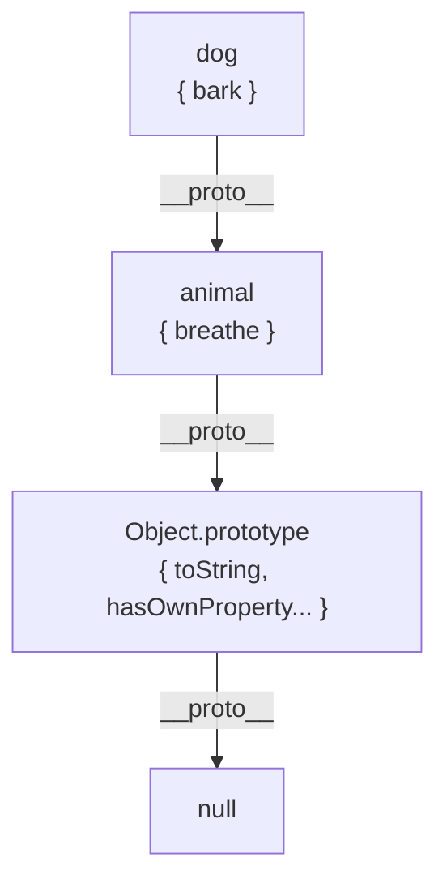
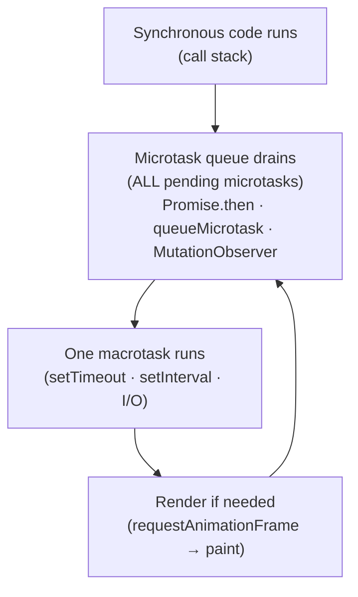
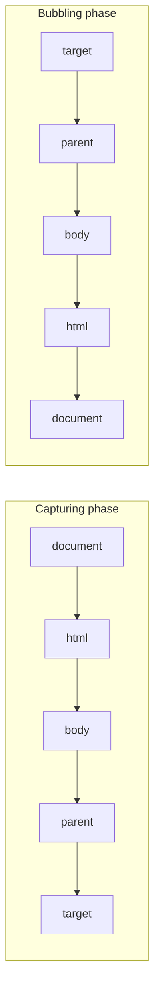

# JavaScript Core — Interview Reference

---

## Closures

A closure is a function that **retains access to its outer scope's variables even after the outer function has returned**.

```js
function makeCounter() {
  let count = 0;          // lives on the heap, not the stack
  return function() {
    return ++count;       // inner function closes over `count`
  };
}

const counter = makeCounter(); // makeCounter's stack frame is gone
counter(); // 1 — but count is still alive, referenced by the closure
counter(); // 2
counter(); // 3
```

**What gets captured:** The variable *binding* (reference), not the value at the time of creation.

```js
// Classic trap — all 3 functions close over the SAME `i` binding
for (var i = 0; i < 3; i++) {
  setTimeout(() => console.log(i), 0); // prints 3, 3, 3
}

// Fix 1 — let creates a new binding per iteration
for (let i = 0; i < 3; i++) {
  setTimeout(() => console.log(i), 0); // prints 0, 1, 2
}

// Fix 2 — IIFE creates a new scope per iteration
for (var i = 0; i < 3; i++) {
  ((j) => setTimeout(() => console.log(j), 0))(i);
}
```

**Why `var` fails:** `var` is function-scoped. All 3 closures share the same `i` — by the time the callbacks run, the loop has finished and `i === 3`. `let` is block-scoped — a new `i` binding is created per iteration.

### Closures and Memory Leaks

```js
function attachHandler() {
  const largeData = new Array(1_000_000).fill('x'); // 8MB
  document.getElementById('btn').addEventListener('click', () => {
    console.log('clicked'); // largeData is captured in closure scope
  });
}
attachHandler();
// btn removed from DOM — but largeData can't be GC'd
// because the event listener holds a reference to the closure
// which holds a reference to largeData
```

Fix: Remove the event listener when the element is removed, or don't capture large data inside event handlers.

---

## `this` Binding — 4 Rules

`this` is determined at **call time**, not definition time (except arrow functions).

### Rule 1 — Default Binding (standalone call)

```js
function greet() { console.log(this); }
greet(); // window (non-strict) | undefined (strict mode)
```

### Rule 2 — Implicit Binding (method call)

```js
const obj = {
  name: 'Alice',
  greet() { console.log(this.name); }
};
obj.greet(); // 'Alice' — `this` = obj (left of the dot)

// The trap — losing implicit binding
const fn = obj.greet;
fn(); // undefined — no obj before the call, falls back to default
```

### Rule 3 — Explicit Binding (call / apply / bind)

```js
function greet(greeting) { console.log(`${greeting}, ${this.name}`); }
const user = { name: 'Bob' };

greet.call(user, 'Hello');       // Hello, Bob — call: args comma-separated
greet.apply(user, ['Hi']);       // Hi, Bob   — apply: args as array
const bound = greet.bind(user);  // bind: returns new function, doesn't call
bound('Hey');                    // Hey, Bob
```

### Rule 4 — `new` Binding (constructor call)

```js
function Person(name) {
  // new does 4 things:
  // 1. Creates a new empty object: {}
  // 2. Sets its __proto__ to Person.prototype
  // 3. Binds `this` to the new object
  // 4. Returns `this` (unless you return another object)
  this.name = name;
}
const alice = new Person('Alice');
alice.name; // 'Alice'
```

### Priority: `new` > explicit > implicit > default

### Arrow Functions — Lexical `this`

Arrow functions have **no own `this`** — they inherit `this` from the enclosing lexical scope at **definition time**.

```js
const obj = {
  name: 'Alice',
  greet: function() {
    // `this` = obj (implicit binding on method call)
    setTimeout(() => {
      console.log(this.name); // 'Alice' — arrow captures enclosing `this`
    }, 100);
  },
  greetBroken: function() {
    setTimeout(function() {
      console.log(this.name); // undefined — regular function, new `this`
    }, 100);
  }
};

// Arrow functions CANNOT be bound
const arrow = () => console.log(this);
arrow.call({ name: 'Bob' }); // still window/undefined — bind/call/apply ignored
```

---

## Prototype Chain

JavaScript has no classes at runtime — only objects linked via `__proto__`.

```js
const animal = { breathe() { return 'breathing'; } };
const dog = Object.create(animal); // dog.__proto__ === animal
dog.bark = function() { return 'woof'; };

dog.bark();    // found on dog directly
dog.breathe(); // not on dog → climb __proto__ → found on animal
dog.toString();// not on dog → not on animal → found on Object.prototype
dog.xyz;       // not found anywhere → undefined (chain ends at null)
```



### `class` is syntactic sugar

```js
class Animal {
  constructor(name) { this.name = name; }
  speak() { return `${this.name} speaks`; }
}

class Dog extends Animal {
  bark() { return 'woof'; }
}

// What actually exists at runtime:
// Dog.prototype.__proto__ === Animal.prototype
// dog.__proto__ === Dog.prototype
```

### `instanceof` — walks the prototype chain

```js
const d = new Dog('Rex');
d instanceof Dog;    // true — Dog.prototype is in d's chain
d instanceof Animal; // true — Animal.prototype is in d's chain
d instanceof Object; // true — Object.prototype is in d's chain
```

### `hasOwnProperty` vs `in`

```js
'bark' in d;             // true — searches entire chain
'speak' in d;            // true — found on Animal.prototype
d.hasOwnProperty('bark');  // true — on d directly
d.hasOwnProperty('speak'); // false — inherited, not own
```

---

## Promise Internals

### The Microtask Queue

Promises don't use the macrotask queue (like `setTimeout`). Resolved `.then` callbacks go into the **microtask queue**, which drains completely before the next macrotask.

```js
console.log('1');

setTimeout(() => console.log('2'), 0);  // macrotask

Promise.resolve().then(() => console.log('3')); // microtask
Promise.resolve().then(() => console.log('4')); // microtask

console.log('5');

// Output: 1, 5, 3, 4, 2
// Execution: sync → microtasks → macrotasks
```



### Promise States

```js
// A Promise is always in one of 3 states:
// pending → fulfilled (resolved with value)
// pending → rejected (rejected with reason)
// Once settled, state never changes

const p = new Promise((resolve, reject) => {
  // executor runs synchronously
  resolve(42); // settled immediately
  resolve(99); // ignored — already settled
  reject('err'); // ignored — already settled
});

p.then(v => console.log(v)); // 42
```

### `async/await` is sugar over Promise + generator

```js
// This:
async function fetchUser(id) {
  const res = await fetch(`/users/${id}`);
  return res.json();
}

// Compiles to roughly:
function fetchUser(id) {
  return fetch(`/users/${id}`)
    .then(res => res.json());
}

// await suspends the async function and schedules the .then callback
// as a microtask — does NOT block the thread
```

### Promise combinators

```js
// All settle to fulfilled — rejects if any rejects
Promise.all([p1, p2, p3]);

// Resolves/rejects with the FIRST settled promise (race)
Promise.race([p1, p2, p3]);

// All settle regardless — never rejects, gives {status, value/reason}
Promise.allSettled([p1, p2, p3]);

// Resolves with FIRST fulfilled — rejects only if ALL reject
Promise.any([p1, p2, p3]);
```

### Unhandled rejection

```js
// Danger — rejected promise with no .catch
const p = Promise.reject(new Error('oops'));
// → UnhandledPromiseRejection warning (crashes Node, silently lost in browser)

// Always handle:
p.catch(err => console.error(err));
// or
try { await p; } catch(err) { console.error(err); }
```

---

## WeakMap and WeakRef

### WeakMap — private data without memory leaks

```js
// Regular Map — key is a strong reference — prevents GC
const map = new Map();
let el = document.getElementById('btn');
map.set(el, { clicks: 0 });
el = null; // el removed from code, but Map still holds reference → NOT GC'd

// WeakMap — key is a weak reference — allows GC
const wm = new WeakMap();
let el = document.getElementById('btn');
wm.set(el, { clicks: 0 });
el = null; // No more strong references → el CAN be GC'd → entry removed from WeakMap
```

**WeakMap constraints:** Keys must be objects (not primitives). Not iterable (no `.keys()`, `.forEach()`). No size.

**Use cases:**
```js
// 1. Private class fields (before # syntax)
const _private = new WeakMap();
class Foo {
  constructor() { _private.set(this, { secret: 42 }); }
  getSecret() { return _private.get(this).secret; }
}

// 2. Caching computed results without preventing GC of the key
const cache = new WeakMap();
function process(obj) {
  if (cache.has(obj)) return cache.get(obj);
  const result = heavyComputation(obj);
  cache.set(obj, result);
  return result;
}
```

### WeakRef — observe without preventing GC

```js
let user = { name: 'Alice' };
const ref = new WeakRef(user);

user = null; // no more strong references

// Later:
const u = ref.deref(); // returns the object if still alive, undefined if GC'd
if (u) {
  console.log(u.name);
} else {
  console.log('user was garbage collected');
}
```

**FinalizationRegistry — cleanup callback when object is GC'd:**

```js
const registry = new FinalizationRegistry((label) => {
  console.log(`${label} was collected`);
});

let obj = { data: 'big array' };
registry.register(obj, 'myObject');
obj = null; // → eventually: "myObject was collected"
```

---

## Event Delegation

Instead of attaching a listener to each of N children, attach **one listener to a parent** and check `event.target`.

```js
// Bad — N listeners, N closures, memory-heavy, breaks on dynamic children
document.querySelectorAll('.btn').forEach(btn => {
  btn.addEventListener('click', handler);
});

// Good — 1 listener, works for dynamically added children too
document.getElementById('list').addEventListener('click', (e) => {
  const btn = e.target.closest('.btn');
  if (!btn) return;
  handler(btn);
});
```

### Bubbling vs Capturing



```js
addEventListener(event, handler, true)  // third arg = true -> capturing
addEventListener(event, handler, false) // default -> bubbling
```

### `stopPropagation` vs `stopImmediatePropagation`

```js
// stopPropagation — stops event from bubbling/capturing further
// but other listeners on THIS element still run
el.addEventListener('click', (e) => {
  e.stopPropagation(); // parent won't receive click
});
el.addEventListener('click', () => console.log('still runs'));

// stopImmediatePropagation — stops all listeners on this element too
el.addEventListener('click', (e) => {
  e.stopImmediatePropagation();
});
el.addEventListener('click', () => console.log('NEVER runs'));
```

---

## Interview Summary

### Key talking points

1. "A closure captures the variable *binding*, not the value. The classic `var` loop trap: all closures share the same `i` binding. `let` creates a new binding per iteration — that's the entire fix."

2. "`this` has 4 rules, checked in priority order: `new` > explicit (call/apply/bind) > implicit (left of dot) > default (global/undefined). Arrow functions break this — they have no own `this`, they inherit from the lexical scope at definition time. You cannot bind an arrow function."

3. "JavaScript has no classes — only objects and prototype chains. `class` is syntax sugar. Property lookup walks `__proto__` until the value is found or `null` is reached. `instanceof` does the same walk."

4. "Promises use the microtask queue, not the macrotask queue. Microtasks drain completely between tasks. That's why `Promise.then` always runs before `setTimeout(0)` — even if the setTimeout was registered first."

5. "`async/await` is syntactic sugar over `.then()` chains. `await` doesn't block the thread — it suspends the async function, schedules continuation as a microtask, and returns control to the event loop."

6. "WeakMap vs Map for caches: Map holds a strong reference to keys — objects you think you've discarded stay in memory. WeakMap holds weak references — GC can collect the key and the entry disappears automatically. Use WeakMap whenever your cache key is an object and you don't control its lifecycle."
