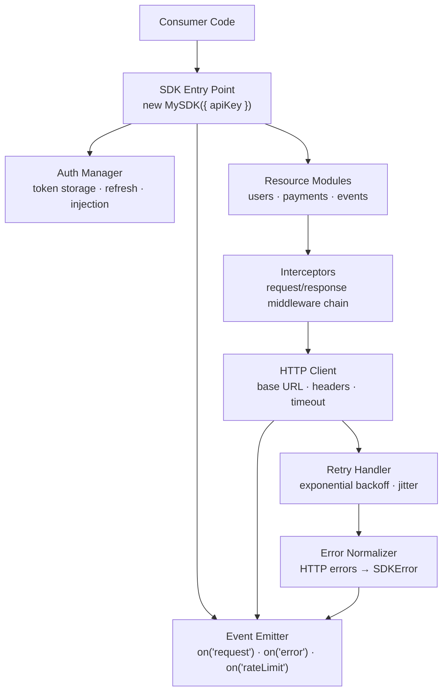
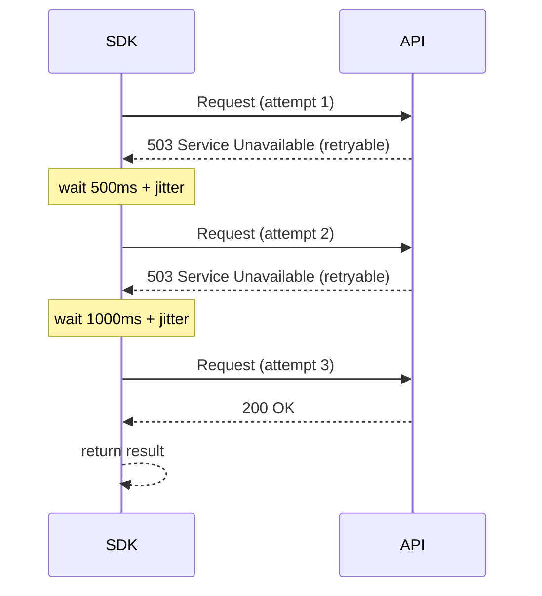

# JavaScript SDK Creation — Interview Reference

---

## What is an SDK?

An SDK (Software Development Kit) is a **packaged, versioned, opinionated interface** that lets consumers interact with your platform, API, or service — without needing to know the underlying implementation details.

> **One-liner:** An SDK hides HTTP, auth, retries, error normalization, and type safety behind a clean API so consumers write business logic, not infrastructure code.

**SDK vs Library vs API Client:**

| | API Client | Library | SDK |
|---|---|---|---|
| **Scope** | Just HTTP calls | Utilities, helpers | Full platform integration |
| **Auth** | Manual | Manual | Built-in, managed |
| **Retries** | Manual | N/A | Built-in |
| **Types** | Maybe | Maybe | First-class |
| **Events/Hooks** | No | No | Yes |
| **Versioning contract** | Loose | Loose | Strict semver |
| **Example** | `fetch('/users')` | lodash | Stripe.js, Sentry, Datadog |

---

## SDK Design Principles

Before writing a line of code, these principles govern every decision:

### 1. Minimal surface area
Every public API you expose is a contract you must maintain forever (or introduce breaking changes). Expose only what consumers need. Hide implementation details behind the interface.

```js
// ❌ Exposes internals — now you can never change httpClient
sdk.httpClient.get('/users');

// ✅ Hides implementation — you can swap axios for fetch internally
sdk.users.list();
```

### 2. Fail loudly at initialization, silently at runtime
Catch configuration errors immediately on setup — not 3 API calls later.

```js
// ❌ Error surfaces when user makes their first call
const sdk = new SDK(); // no apiKey — works fine
sdk.users.list();      // crashes here, far from the misconfiguration

// ✅ Error surfaces at initialization
const sdk = new SDK({ apiKey: '' }); // throws immediately: "apiKey is required"
```

### 3. Progressive disclosure
Simple things should be simple. Complex things should be possible.

```js
// Simple — zero config
const result = await sdk.users.list();

// Advanced — full control
const result = await sdk.users.list({
  filter: { role: 'admin' },
  sort: { field: 'createdAt', order: 'desc' },
  pagination: { cursor: 'abc', limit: 50 },
  timeout: 5000,
  signal: abortController.signal,
});
```

### 4. Predictable error handling
Errors should always be the same type — never raw HTTP responses, never string messages, never unpredictable shapes.

```js
// All SDK errors are SDKError instances
try {
  await sdk.users.get('bad-id');
} catch (err) {
  // Always true — no type guessing
  if (err instanceof SDKError) {
    err.code;     // 'NOT_FOUND'
    err.status;   // 404
    err.message;  // 'User not found'
    err.requestId; // for support/debugging
  }
}
```

---

## SDK Architecture



---

## Package Structure

```
my-sdk/
  src/
    index.ts              ← public entry point (exports only public API)
    sdk.ts                ← main SDK class
    auth/
      AuthManager.ts      ← token storage, refresh, injection
    http/
      HttpClient.ts       ← fetch wrapper, base URL, headers
      RetryHandler.ts     ← exponential backoff
      RateLimiter.ts      ← client-side rate limit tracking
    errors/
      SDKError.ts         ← base error class
      errors.ts           ← typed error subclasses
    resources/
      UsersResource.ts    ← sdk.users.*
      PaymentsResource.ts ← sdk.payments.*
      EventsResource.ts   ← sdk.events.*
    interceptors/
      InterceptorManager.ts
    types/
      index.ts            ← all public types
    utils/
      retry.ts
      pagination.ts
  dist/
    esm/                  ← ES Modules (tree-shakeable)
    cjs/                  ← CommonJS (Node.js)
    umd/                  ← UMD bundle (CDN <script> tag)
    types/                ← TypeScript declarations (.d.ts)
  package.json
  tsconfig.json
  rollup.config.js / tsup.config.ts
```

---

## Initialization — Patterns

### Pattern 1 — Constructor (most common)

```ts
class MySDK {
  private config: Required<SDKConfig>;
  public users: UsersResource;
  public payments: PaymentsResource;

  constructor(config: SDKConfig) {
    this.config = this.validateAndNormalize(config);
    const httpClient = new HttpClient(this.config);
    this.users = new UsersResource(httpClient);
    this.payments = new PaymentsResource(httpClient);
  }

  private validateAndNormalize(config: SDKConfig): Required<SDKConfig> {
    if (!config.apiKey) throw new SDKError('CONFIG_ERROR', 'apiKey is required');
    return {
      apiKey: config.apiKey,
      baseUrl: config.baseUrl ?? 'https://api.example.com/v1',
      timeout: config.timeout ?? 30_000,
      retries: config.retries ?? 3,
      environment: config.environment ?? 'production',
    };
  }
}

// Usage
const sdk = new MySDK({ apiKey: 'sk_live_...' });
await sdk.users.list();
```

### Pattern 2 — Factory Function (functional style, easier to test/mock)

```ts
function createSDK(config: SDKConfig): SDKInstance {
  const validated = validateConfig(config);
  const httpClient = createHttpClient(validated);

  return {
    users: createUsersResource(httpClient),
    payments: createPaymentsResource(httpClient),
  };
}

const sdk = createSDK({ apiKey: 'sk_live_...' });
```

### Pattern 3 — Builder Pattern (complex optional configuration)

```ts
const sdk = new SDKBuilder()
  .setApiKey('sk_live_...')
  .setBaseUrl('https://api.example.com/v1')
  .setRetries(3)
  .setTimeout(5000)
  .addPlugin(loggingPlugin)
  .addPlugin(metricsPlugin)
  .build();
```

**Builder shines when:** Optional config grows large, plugins/middleware need ordered setup, you want to enforce that `build()` must be called last.

### Pattern 4 — Singleton (analytics/monitoring SDKs)

```ts
// Sentry/Segment style — global init, access from anywhere
MySDK.init({ apiKey: 'sk_live_...' });

// Later, anywhere in the app:
MySDK.captureError(new Error('oops'));
MySDK.track('page_view', { path: '/dashboard' });
```

```ts
// Implementation
class MySDK {
  private static instance: MySDK | null = null;

  static init(config: SDKConfig): void {
    if (MySDK.instance) {
      console.warn('MySDK already initialized — ignoring duplicate init');
      return;
    }
    MySDK.instance = new MySDK(config);
  }

  static getInstance(): MySDK {
    if (!MySDK.instance) {
      throw new SDKError('NOT_INITIALIZED', 'Call MySDK.init() before use');
    }
    return MySDK.instance;
  }

  // Proxy static methods to instance
  static track(event: string, props?: Record<string, unknown>): void {
    MySDK.getInstance().track(event, props);
  }
}
```

---

## HTTP Client — Core

```ts
class HttpClient {
  private baseUrl: string;
  private defaultHeaders: Record<string, string>;
  private timeout: number;
  private interceptors: InterceptorManager;

  constructor(config: Required<SDKConfig>) {
    this.baseUrl = config.baseUrl;
    this.timeout = config.timeout;
    this.defaultHeaders = {
      'Authorization': `Bearer ${config.apiKey}`,
      'Content-Type': 'application/json',
      'X-SDK-Version': SDK_VERSION,
      'X-Request-ID': '', // filled per-request
    };
    this.interceptors = new InterceptorManager();
  }

  async request<T>(options: RequestOptions): Promise<T> {
    const requestId = generateRequestId();
    const url = `${this.baseUrl}${options.path}`;

    let config: RequestConfig = {
      method: options.method ?? 'GET',
      url,
      headers: {
        ...this.defaultHeaders,
        'X-Request-ID': requestId,
        ...options.headers,
      },
      body: options.body ? JSON.stringify(options.body) : undefined,
      signal: options.signal,
    };

    // Run request interceptors (e.g. add auth token, log)
    config = await this.interceptors.runRequest(config);

    const controller = new AbortController();
    const timeoutId = setTimeout(() => controller.abort(), this.timeout);

    try {
      const response = await fetch(config.url, {
        method: config.method,
        headers: config.headers,
        body: config.body,
        signal: options.signal
          ? anySignal([options.signal, controller.signal])
          : controller.signal,
      });

      clearTimeout(timeoutId);

      // Run response interceptors
      return await this.interceptors.runResponse<T>(response, config);
    } catch (err) {
      clearTimeout(timeoutId);
      throw this.normalizeError(err, requestId);
    }
  }

  private normalizeError(err: unknown, requestId: string): SDKError {
    if (err instanceof SDKError) return err;
    if (err instanceof DOMException && err.name === 'AbortError') {
      return new SDKError('TIMEOUT', 'Request timed out', { requestId });
    }
    return new SDKError('NETWORK_ERROR', 'Network request failed', { requestId, cause: err });
  }
}
```

---

## Error Handling — Normalized Errors

```ts
// Base error class
class SDKError extends Error {
  readonly code: string;
  readonly status?: number;
  readonly requestId?: string;
  readonly retryable: boolean;

  constructor(code: string, message: string, options: {
    status?: number;
    requestId?: string;
    cause?: unknown;
    retryable?: boolean;
  } = {}) {
    super(message);
    this.name = 'SDKError';
    this.code = code;
    this.status = options.status;
    this.requestId = options.requestId;
    this.retryable = options.retryable ?? false;
    if (options.cause) this.cause = options.cause;
  }
}

// Typed subclasses — consumers can instanceof check
class AuthenticationError extends SDKError {
  constructor(message: string, options?: { requestId?: string }) {
    super('AUTHENTICATION_ERROR', message, { status: 401, ...options });
    this.name = 'AuthenticationError';
  }
}

class RateLimitError extends SDKError {
  readonly retryAfter: number; // seconds

  constructor(retryAfter: number, options?: { requestId?: string }) {
    super('RATE_LIMIT_EXCEEDED', `Rate limit exceeded. Retry after ${retryAfter}s`, {
      status: 429,
      retryable: true,
      ...options
    });
    this.name = 'RateLimitError';
    this.retryAfter = retryAfter;
  }
}

class NotFoundError extends SDKError {
  constructor(resource: string, id: string, options?: { requestId?: string }) {
    super('NOT_FOUND', `${resource} '${id}' not found`, { status: 404, ...options });
    this.name = 'NotFoundError';
  }
}

class ValidationError extends SDKError {
  readonly fields: Record<string, string[]>;

  constructor(fields: Record<string, string[]>, options?: { requestId?: string }) {
    super('VALIDATION_ERROR', 'Validation failed', { status: 422, ...options });
    this.name = 'ValidationError';
    this.fields = fields;
  }
}

// HTTP response → typed error
function parseHttpError(response: Response, body: unknown, requestId: string): SDKError {
  switch (response.status) {
    case 401: return new AuthenticationError('Invalid API key', { requestId });
    case 404: return new NotFoundError('Resource', 'unknown', { requestId });
    case 422: return new ValidationError((body as any).errors ?? {}, { requestId });
    case 429: return new RateLimitError(
      parseInt(response.headers.get('Retry-After') ?? '60'), { requestId }
    );
    default: return new SDKError(
      'API_ERROR',
      (body as any)?.message ?? `HTTP ${response.status}`,
      { status: response.status, requestId }
    );
  }
}
```

---

## Retry Logic — Exponential Backoff with Jitter

```ts
interface RetryConfig {
  maxRetries: number;      // default: 3
  baseDelay: number;       // default: 500ms
  maxDelay: number;        // default: 30_000ms
  jitter: boolean;         // default: true — prevents thundering herd
}

async function withRetry<T>(
  fn: () => Promise<T>,
  config: RetryConfig,
  onRetry?: (attempt: number, error: SDKError, delay: number) => void
): Promise<T> {
  let lastError: SDKError;

  for (let attempt = 0; attempt <= config.maxRetries; attempt++) {
    try {
      return await fn();
    } catch (err) {
      lastError = err instanceof SDKError ? err : new SDKError('UNKNOWN', String(err));

      // Don't retry non-retryable errors
      if (!lastError.retryable || attempt === config.maxRetries) throw lastError;

      // Exponential backoff: 500ms, 1000ms, 2000ms, ...
      const exponential = config.baseDelay * 2 ** attempt;
      const capped = Math.min(exponential, config.maxDelay);

      // Full jitter: random between 0 and capped delay
      // Prevents multiple clients retrying at the same time (thundering herd)
      const delay = config.jitter ? Math.random() * capped : capped;

      onRetry?.(attempt + 1, lastError, delay);
      await sleep(delay);
    }
  }

  throw lastError!;
}

// What's retryable:
// ✅ 429 Too Many Requests (with Retry-After)
// ✅ 503 Service Unavailable
// ✅ Network errors, timeouts
// ❌ 400 Bad Request (fix the request, not retry)
// ❌ 401 Unauthorized (fix auth, not retry)
// ❌ 404 Not Found (resource doesn't exist)
// ❌ 422 Validation Error (fix the data, not retry)
```



---

## Authentication Patterns

### Pattern 1 — Static API Key

```ts
// Inject on every request via header
headers['Authorization'] = `Bearer ${this.config.apiKey}`;
// or
headers['X-API-Key'] = this.config.apiKey;
```

### Pattern 2 — OAuth Token with Auto-Refresh

```ts
class AuthManager {
  private accessToken: string | null = null;
  private refreshToken: string;
  private expiresAt: number = 0;
  private refreshPromise: Promise<string> | null = null;

  async getAccessToken(): Promise<string> {
    // Token valid for 60+ more seconds — use it
    if (this.accessToken && Date.now() < this.expiresAt - 60_000) {
      return this.accessToken;
    }

    // Token expired or expiring soon — refresh
    // Deduplicate concurrent refresh calls (only one refresh in-flight)
    if (!this.refreshPromise) {
      this.refreshPromise = this.doRefresh().finally(() => {
        this.refreshPromise = null;
      });
    }

    return this.refreshPromise;
  }

  private async doRefresh(): Promise<string> {
    const res = await fetch('/oauth/token', {
      method: 'POST',
      body: JSON.stringify({ grant_type: 'refresh_token', refresh_token: this.refreshToken }),
    });

    if (!res.ok) throw new AuthenticationError('Token refresh failed');

    const { access_token, expires_in } = await res.json();
    this.accessToken = access_token;
    this.expiresAt = Date.now() + expires_in * 1000;
    return access_token;
  }
}
```

**The deduplication trick:** If three concurrent requests all find the token expired, without deduplication they'd all fire a refresh. With `this.refreshPromise`, only one refresh fires and all three `await` the same Promise.

### Pattern 3 — JWT with Claim Validation

```ts
function isTokenExpired(jwt: string): boolean {
  try {
    const [, payload] = jwt.split('.');
    const decoded = JSON.parse(atob(payload));
    // exp is in seconds, Date.now() is ms — add 30s buffer
    return decoded.exp * 1000 < Date.now() + 30_000;
  } catch {
    return true; // malformed token — treat as expired
  }
}
```

---

## Interceptors — Middleware Chain

```ts
type RequestInterceptor = (config: RequestConfig) => RequestConfig | Promise<RequestConfig>;
type ResponseInterceptor<T> = (response: Response) => T | Promise<T>;

class InterceptorManager {
  private requestInterceptors: RequestInterceptor[] = [];
  private responseInterceptors: ResponseInterceptor<any>[] = [];

  useRequest(interceptor: RequestInterceptor): () => void {
    this.requestInterceptors.push(interceptor);
    // Return an eject function
    return () => {
      const idx = this.requestInterceptors.indexOf(interceptor);
      if (idx !== -1) this.requestInterceptors.splice(idx, 1);
    };
  }

  useResponse<T>(interceptor: ResponseInterceptor<T>): () => void {
    this.responseInterceptors.push(interceptor);
    return () => {
      const idx = this.responseInterceptors.indexOf(interceptor);
      if (idx !== -1) this.responseInterceptors.splice(idx, 1);
    };
  }

  async runRequest(config: RequestConfig): Promise<RequestConfig> {
    let current = config;
    for (const interceptor of this.requestInterceptors) {
      current = await interceptor(current);
    }
    return current;
  }

  async runResponse<T>(response: Response, config: RequestConfig): Promise<T> {
    // Default: parse JSON and check for errors
    const body = await response.json().catch(() => null);
    if (!response.ok) {
      throw parseHttpError(response, body, config.headers['X-Request-ID']);
    }

    let result: any = body;
    for (const interceptor of this.responseInterceptors) {
      result = await interceptor(result);
    }
    return result as T;
  }
}

// Consumer can add custom interceptors
const sdk = new MySDK({ apiKey: '...' });

// Log all requests
sdk.interceptors.useRequest((config) => {
  console.log(`→ ${config.method} ${config.url}`);
  return config;
});

// Add custom header for all requests
sdk.interceptors.useRequest((config) => ({
  ...config,
  headers: { ...config.headers, 'X-Tenant-ID': getTenantId() }
}));
```

---

## Resource Design — Fluent API

```ts
class UsersResource {
  constructor(private http: HttpClient) {}

  async list(options: ListUsersOptions = {}): Promise<PaginatedResponse<User>> {
    return this.http.request({
      method: 'GET',
      path: '/users',
      params: options,
    });
  }

  async get(id: string): Promise<User> {
    if (!id) throw new SDKError('INVALID_ARGUMENT', 'User id is required');
    return this.http.request({ method: 'GET', path: `/users/${id}` });
  }

  async create(data: CreateUserInput): Promise<User> {
    return this.http.request({ method: 'POST', path: '/users', body: data });
  }

  async update(id: string, data: UpdateUserInput): Promise<User> {
    return this.http.request({ method: 'PATCH', path: `/users/${id}`, body: data });
  }

  async delete(id: string): Promise<void> {
    return this.http.request({ method: 'DELETE', path: `/users/${id}` });
  }

  // Nested resource — sdk.users.sessions.list(userId)
  sessions = new UserSessionsResource(this.http);
}

// Fluent chaining for complex operations
class QueryBuilder<T> {
  private filters: Record<string, unknown> = {};
  private sortField?: string;
  private sortOrder: 'asc' | 'desc' = 'asc';
  private limitValue = 20;

  filter(field: string, value: unknown): this {
    this.filters[field] = value;
    return this;
  }

  sort(field: string, order: 'asc' | 'desc' = 'asc'): this {
    this.sortField = field;
    this.sortOrder = order;
    return this;
  }

  limit(n: number): this {
    this.limitValue = n;
    return this;
  }

  async execute(): Promise<T[]> {
    return this.resource.list({ filters: this.filters, sort: this.sortField, limit: this.limitValue });
  }
}

// Usage
const users = await sdk.users
  .query()
  .filter('role', 'admin')
  .sort('createdAt', 'desc')
  .limit(50)
  .execute();
```

---

## Request Deduplication

If three components mount simultaneously and all call `sdk.users.get('123')`, without deduplication that's 3 identical HTTP requests. The SDK should coalesce them into one.

```ts
class RequestDeduplicator {
  // Map of in-flight requests keyed by a cache key
  private inFlight = new Map<string, Promise<unknown>>();

  async dedupe<T>(key: string, fn: () => Promise<T>): Promise<T> {
    // Already in-flight for this key — return the SAME promise
    if (this.inFlight.has(key)) {
      return this.inFlight.get(key) as Promise<T>;
    }

    // New request — start it, cache the promise
    const promise = fn().finally(() => {
      this.inFlight.delete(key); // clean up when settled
    });

    this.inFlight.set(key, promise);
    return promise;
  }

  // Build cache key from method + URL + sorted params
  static buildKey(method: string, url: string, params?: Record<string, unknown>): string {
    const sorted = params
      ? Object.keys(params).sort().map(k => `${k}=${params[k]}`).join('&')
      : '';
    return `${method}:${url}?${sorted}`;
  }
}

// In HttpClient — wrap GET requests only (mutations are never deduped)
async request<T>(options: RequestOptions): Promise<T> {
  if (options.method === 'GET' || !options.method) {
    const key = RequestDeduplicator.buildKey('GET', options.path, options.params);
    return this.deduplicator.dedupe(key, () => this.doRequest<T>(options));
  }
  return this.doRequest<T>(options);
}
```

```
Without deduplication:
  Component A mounts → GET /users/123 (request 1 fires)
  Component B mounts → GET /users/123 (request 2 fires)  ← redundant
  Component C mounts → GET /users/123 (request 3 fires)  ← redundant
  3 HTTP calls, 3 server hits

With deduplication:
  Component A mounts → GET /users/123 (request fires, Promise cached)
  Component B mounts → GET /users/123 (returns SAME cached Promise)
  Component C mounts → GET /users/123 (returns SAME cached Promise)
  1 HTTP call, 3 components get the result
```

**Only deduplicate idempotent requests (GET, HEAD).** Never deduplicate POST/PATCH/DELETE — two concurrent POSTs are likely intentional (two separate creates).

---

## Idempotency Keys

For state-mutating requests (POST, PATCH), the same request might be sent twice — network timeout causes a retry, but the first request actually succeeded. Without idempotency keys, you create a duplicate record.

```ts
// Stripe pattern — client generates a unique key per logical operation
// Server: "if I've seen this key, return the cached response instead of re-processing"

class HttpClient {
  async request<T>(options: RequestOptions): Promise<T> {
    const config: RequestConfig = {
      method: options.method ?? 'GET',
      headers: { ...this.defaultHeaders },
      // ...
    };

    // Add idempotency key for all mutating requests
    if (['POST', 'PUT', 'PATCH'].includes(config.method)) {
      config.headers['Idempotency-Key'] =
        options.idempotencyKey ?? this.generateIdempotencyKey(options);
    }

    return this.doRequest<T>(config);
  }

  private generateIdempotencyKey(options: RequestOptions): string {
    // Deterministic key based on path + body content
    // Same request retried → same key → server deduplicates
    const content = JSON.stringify({ path: options.path, body: options.body });
    return `sdk-${simpleHash(content)}-${Date.now()}`;
  }
}

// Consumer can supply their own key for business-level idempotency
await sdk.payments.create(
  { amount: 5000, currency: 'usd' },
  { idempotencyKey: `order-${orderId}-payment` } // stable across retries
);
```

**What happens server-side:**
```
First request:  POST /payments  Idempotency-Key: order-123-payment
  → Server processes payment, caches response against key
  → Returns { paymentId: 'pay_abc', status: 'succeeded' }

Retry (network timeout):  POST /payments  Idempotency-Key: order-123-payment
  → Server finds cached response for this key
  → Returns SAME { paymentId: 'pay_abc', status: 'succeeded' } — NO double charge
```

**Key expiry:** Idempotency keys are typically stored for 24h on the server. After that, the same key will create a new resource. This is intentional — same key next day = a new intended operation.

---

## Client-Side Rate Limiting

Prevents the SDK from triggering 429s by enforcing limits before hitting the wire.

```ts
class TokenBucketRateLimiter {
  private tokens: number;
  private lastRefill: number;
  private queue: Array<{ resolve: () => void }> = [];

  constructor(
    private readonly capacity: number,    // max burst
    private readonly refillRate: number,  // tokens per second
  ) {
    this.tokens = capacity;
    this.lastRefill = Date.now();
  }

  async acquire(): Promise<void> {
    this.refill();

    if (this.tokens >= 1) {
      this.tokens -= 1;
      return; // token available — proceed immediately
    }

    // No tokens — queue the request
    return new Promise((resolve) => {
      this.queue.push({ resolve });
    });
  }

  private refill(): void {
    const now = Date.now();
    const elapsed = (now - this.lastRefill) / 1000; // seconds
    const newTokens = elapsed * this.refillRate;
    this.tokens = Math.min(this.capacity, this.tokens + newTokens);
    this.lastRefill = now;

    // Drain queue if tokens available
    while (this.tokens >= 1 && this.queue.length > 0) {
      this.tokens -= 1;
      this.queue.shift()!.resolve();
    }
  }
}

// In HttpClient
const rateLimiter = new TokenBucketRateLimiter(
  10,   // burst: up to 10 concurrent requests
  5,    // sustained: 5 requests/second
);

async request<T>(options: RequestOptions): Promise<T> {
  await rateLimiter.acquire(); // wait for token — never blocks more than necessary
  return this.doRequest<T>(options);
}
```

```
10 requests fire simultaneously:
  Requests 1–10:  tokens available (capacity=10) → all proceed immediately
  Request 11:     no tokens → queued → proceeds after 200ms (1/5 refill rate)
  Request 12:     no tokens → queued → proceeds after 400ms
  ...

Without rate limiter: all 11 hit server → server returns 429 for the excess
With rate limiter:    SDK spaces requests → server never sees burst → no 429
```

---

## Request Cancellation

First-class cancellation via `AbortController` — critical for SPAs where users navigate away before requests complete.

```ts
// Resource methods accept AbortSignal
class UsersResource {
  async list(options: ListUsersOptions & { signal?: AbortSignal } = {}): Promise<PaginatedResponse<User>> {
    return this.http.request({
      method: 'GET',
      path: '/users',
      params: options,
      signal: options.signal,
    });
  }
}

// Pattern 1 — cancel on component unmount (React)
function UsersList() {
  const [users, setUsers] = useState([]);

  useEffect(() => {
    const controller = new AbortController();

    sdk.users.list({ signal: controller.signal })
      .then(setUsers)
      .catch(err => {
        if (err.code === 'ABORTED') return; // intentional cancel — ignore
        reportError(err);
      });

    return () => controller.abort(); // cancel on unmount
  }, []);
}

// Pattern 2 — cancel on route change (React Router)
useEffect(() => {
  const controller = new AbortController();
  loadPageData(controller.signal);
  return () => controller.abort();
}, [location.pathname]);

// Pattern 3 — cancel previous request when new one fires (search input)
class SearchResource {
  private activeController: AbortController | null = null;

  async search(query: string): Promise<SearchResult[]> {
    // Cancel any in-flight search
    this.activeController?.abort();
    this.activeController = new AbortController();

    try {
      return await this.http.request({
        method: 'GET',
        path: '/search',
        params: { q: query },
        signal: this.activeController.signal,
      });
    } finally {
      this.activeController = null;
    }
  }
}

// Usage — search as user types, cancels stale requests
const search = sdk.createSearchResource();
inputEl.addEventListener('input', (e) => {
  search.search(e.target.value); // previous call auto-cancelled
});
```

**In HttpClient — propagate signal + distinguish abort from other errors:**

```ts
async doRequest<T>(config: RequestConfig): Promise<T> {
  try {
    const response = await fetch(config.url, {
      signal: config.signal,
      // ...
    });
    return this.parseResponse<T>(response);
  } catch (err) {
    if (err instanceof DOMException && err.name === 'AbortError') {
      throw new SDKError('ABORTED', 'Request was cancelled', { retryable: false });
    }
    throw this.normalizeError(err);
  }
}
```

---

## Debug Mode

```ts
class MySDK {
  private debugMode = false;

  debug(enabled = true): this {
    this.debugMode = enabled;
    if (enabled) {
      this.setupDebugInterceptors();
    }
    return this; // chainable: new MySDK({...}).debug()
  }

  private setupDebugInterceptors(): void {
    this.interceptors.useRequest((config) => {
      console.group(`[SDK] → ${config.method} ${config.url}`);
      console.log('Headers:', config.headers);
      if (config.body) console.log('Body:', JSON.parse(config.body));
      console.groupEnd();
      config.metadata = { startTime: performance.now() };
      return config;
    });

    this.on('response', ({ status, requestId }) => {
      const duration = performance.now() - (this as any)._lastRequestStart;
      console.log(`[SDK] ← ${status} (${requestId}) in ${duration.toFixed(1)}ms`);
    });

    this.on('retry', ({ attempt, delay, error }) => {
      console.warn(`[SDK] ↻ Retry ${attempt} in ${delay}ms — ${error.code}: ${error.message}`);
    });

    this.on('error', ({ error }) => {
      console.error(`[SDK] ✗ ${error.code}: ${error.message}`, {
        status: error.status,
        requestId: error.requestId,
        retryable: error.retryable,
      });
    });
  }
}

// Usage
const sdk = new MySDK({ apiKey: 'sk_test_...' }).debug();

// Or via environment variable
const sdk = new MySDK({
  apiKey: process.env.API_KEY,
  debug: process.env.NODE_ENV === 'development',
});
```

**Debug output example:**
```
[SDK] → POST https://api.example.com/v1/users
  Headers: { Authorization: 'Bearer sk_...', X-Request-ID: 'req_abc123' }
  Body: { name: 'Alice', email: 'alice@example.com' }

[SDK] ← 422 (req_abc123) in 234.1ms

[SDK] ✗ VALIDATION_ERROR: Validation failed
  { status: 422, requestId: 'req_abc123', retryable: false }
```

**Security note:** Debug mode must NEVER log full API keys or tokens — only the first/last 4 chars:
```ts
const safeKey = `${key.slice(0, 4)}...${key.slice(-4)}`;
// sk_l...k3x9 — useful for debugging, safe to log
```

---

## Pagination

```ts
// Cursor-based pagination helper
async function* paginate<T>(
  fetcher: (cursor?: string) => Promise<PaginatedResponse<T>>,
): AsyncGenerator<T[], void, unknown> {
  let cursor: string | undefined;

  do {
    const page = await fetcher(cursor);
    yield page.data;
    cursor = page.nextCursor;
  } while (cursor);
}

// Usage — iterate all pages
for await (const page of sdk.users.paginate()) {
  for (const user of page) {
    console.log(user.name);
  }
}

// Or collect all into one array
async function collectAll<T>(
  fetcher: (cursor?: string) => Promise<PaginatedResponse<T>>
): Promise<T[]> {
  const all: T[] = [];
  for await (const page of paginate(fetcher)) all.push(...page);
  return all;
}

const allUsers = await collectAll((cursor) => sdk.users.list({ cursor }));
```

---

## Event System

SDKs emit lifecycle events so consumers can observe behavior without monkey-patching.

```ts
type SDKEvents = {
  'request': { method: string; url: string; requestId: string };
  'response': { status: number; requestId: string; duration: number };
  'error': { error: SDKError; requestId: string };
  'retry': { attempt: number; delay: number; error: SDKError };
  'rateLimit': { retryAfter: number };
  'tokenRefresh': { success: boolean };
};

class EventEmitter<Events extends Record<string, unknown>> {
  private listeners = new Map<keyof Events, Set<Function>>();

  on<K extends keyof Events>(event: K, handler: (data: Events[K]) => void): () => void {
    if (!this.listeners.has(event)) this.listeners.set(event, new Set());
    this.listeners.get(event)!.add(handler);
    // Return unsubscribe function
    return () => this.listeners.get(event)?.delete(handler);
  }

  emit<K extends keyof Events>(event: K, data: Events[K]): void {
    this.listeners.get(event)?.forEach(handler => {
      try { handler(data); } catch (e) { console.error('SDK event handler threw:', e); }
    });
  }
}

// Consumer usage
const unsubscribe = sdk.on('retry', ({ attempt, delay, error }) => {
  console.warn(`Retrying (attempt ${attempt}) in ${delay}ms — ${error.message}`);
});

sdk.on('rateLimit', ({ retryAfter }) => {
  showRateLimitBanner(retryAfter);
});

sdk.on('error', ({ error }) => {
  Sentry.captureException(error);
});

// Clean up
unsubscribe();
```

---

## Bundling — Multiple Output Formats

Consumers use SDKs in different environments: Node.js (CommonJS), modern bundlers (ESM), CDN script tags (UMD). Ship all three.

```ts
// tsup.config.ts — simplest way to produce all formats
import { defineConfig } from 'tsup';

export default defineConfig({
  entry: ['src/index.ts'],
  format: ['esm', 'cjs'],          // UMD via separate rollup config
  dts: true,                       // generate .d.ts declarations
  splitting: true,                 // code split for ESM tree shaking
  sourcemap: true,
  clean: true,
  minify: false,                   // let consumer's bundler minify
  external: [],                    // bundle ALL deps — no peer dep surprises
  treeshake: true,
  target: 'es2020',
});
```

```json
// package.json — tell bundlers which file to use
{
  "name": "@company/sdk",
  "version": "1.2.0",
  "main": "./dist/cjs/index.js",         // Node.js / CommonJS
  "module": "./dist/esm/index.js",       // ESM bundlers (webpack, Rollup, Vite)
  "types": "./dist/types/index.d.ts",    // TypeScript
  "exports": {
    ".": {
      "import": "./dist/esm/index.js",   // import MySDK from '@company/sdk'
      "require": "./dist/cjs/index.js",  // const MySDK = require('@company/sdk')
      "types": "./dist/types/index.d.ts"
    }
  },
  "files": ["dist"],                     // only ship dist — not src
  "sideEffects": false                   // enable tree shaking
}
```

### Why `sideEffects: false` matters

```js
// Consumer imports only UsersResource
import { UsersResource } from '@company/sdk';

// Without sideEffects:false — entire SDK bundled (500KB)
// With sideEffects:false — only UsersResource + its deps bundled (~50KB)
```

---

## TypeScript — Type-Safe SDK

### Typed responses with generics

```ts
// Resource methods are fully typed — no `any`
class UsersResource {
  async list(options?: ListUsersOptions): Promise<PaginatedResponse<User>> { ... }
  async get(id: string): Promise<User> { ... }
  async create(data: CreateUserInput): Promise<User> { ... }
}

// Generic HTTP client — preserves response type through the chain
class HttpClient {
  async request<T>(options: RequestOptions): Promise<T> { ... }
}

// Consumer gets full type safety + autocomplete
const user = await sdk.users.get('123');
user.email;    // ✅ string — TypeScript knows the type
user.xyz;      // ❌ TypeScript error — 'xyz' doesn't exist on User
```

### Conditional types for options

```ts
// Different return types based on options
interface ListOptions {
  paginate?: boolean;
}

type ListResult<T, O extends ListOptions> =
  O extends { paginate: true } ? AsyncGenerator<T[]> : T[];

class Resource {
  list<O extends ListOptions>(options?: O): ListResult<User, O> { ... }
}

sdk.users.list({ paginate: true });  // → AsyncGenerator<User[]>
sdk.users.list();                    // → User[]
```

### Branded types for IDs (prevents mixing)

```ts
// Prevents: sdk.payments.get(userId) — passing wrong ID type
type UserId    = string & { readonly __brand: 'UserId' };
type PaymentId = string & { readonly __brand: 'PaymentId' };

function toUserId(id: string): UserId { return id as UserId; }

const userId: UserId = toUserId('usr_123');
const paymentId: PaymentId = toPaymentId('pay_456');

sdk.users.get(userId);      // ✅
sdk.users.get(paymentId);   // ❌ TypeScript error — wrong brand
```

---

## Plugin Architecture

Allow consumers to extend SDK behavior without forking it.

```ts
interface SDKPlugin {
  name: string;
  install: (sdk: MySDK) => void;
}

class MySDK {
  use(plugin: SDKPlugin): this {
    plugin.install(this);
    return this; // chainable
  }
}

// Logging plugin
const loggingPlugin: SDKPlugin = {
  name: 'logging',
  install: (sdk) => {
    sdk.interceptors.useRequest((config) => {
      console.log(`[SDK] → ${config.method} ${config.url}`);
      config.metadata = { startTime: Date.now() };
      return config;
    });

    sdk.on('response', ({ status, duration, requestId }) => {
      console.log(`[SDK] ← ${status} in ${duration}ms (${requestId})`);
    });
  }
};

// Metrics plugin
const metricsPlugin: SDKPlugin = {
  name: 'metrics',
  install: (sdk) => {
    sdk.on('response', ({ status, duration }) => {
      metrics.histogram('sdk.request.duration', duration, { status });
    });
    sdk.on('error', ({ error }) => {
      metrics.increment('sdk.error', { code: error.code });
    });
  }
};

// Usage
const sdk = new MySDK({ apiKey: '...' })
  .use(loggingPlugin)
  .use(metricsPlugin);
```

---

## Browser vs Node Compatibility

```ts
// Detect environment
const isBrowser = typeof window !== 'undefined';
const isNode = typeof process !== 'undefined' && process.versions?.node;

// Use environment-appropriate APIs
class Storage {
  get(key: string): string | null {
    if (isBrowser) return localStorage.getItem(key);
    // Node — use in-memory map or file system
    return this.memoryStore.get(key) ?? null;
  }
}

// fetch: available in browsers + Node 18+, polyfill for Node < 18
const fetchImpl: typeof fetch = isBrowser
  ? window.fetch.bind(window)
  : (globalThis.fetch ?? require('node-fetch'));

// Crypto for request IDs
function generateRequestId(): string {
  if (typeof crypto !== 'undefined' && crypto.randomUUID) {
    return crypto.randomUUID();
  }
  // Fallback for older environments
  return `${Date.now()}-${Math.random().toString(36).slice(2)}`;
}
```

---

## Versioning & Semver Contract

```
MAJOR.MINOR.PATCH

MAJOR — breaking changes:
  - Removed public methods/properties
  - Changed method signatures (new required params)
  - Changed return types
  - Renamed classes/errors

MINOR — backwards-compatible additions:
  - New methods
  - New optional params
  - New event types
  - New resource classes

PATCH — backwards-compatible fixes:
  - Bug fixes
  - Performance improvements
  - Internal refactors
```

### Deprecation pattern (never remove without warning)

```ts
class UsersResource {
  // Old method — deprecated
  /** @deprecated Use list() instead. Will be removed in v3.0 */
  async getAll(): Promise<User[]> {
    console.warn(
      '[SDK deprecation] users.getAll() is deprecated. Use users.list() instead. ' +
      'Will be removed in v3.0.0. See migration guide: https://docs.example.com/migration/v3'
    );
    const result = await this.list();
    return result.data;
  }

  // New method
  async list(options?: ListUsersOptions): Promise<PaginatedResponse<User>> { ... }
}
```

---

## Testing an SDK

### Unit tests — resource methods

```ts
describe('UsersResource', () => {
  let httpClient: jest.Mocked<HttpClient>;
  let users: UsersResource;

  beforeEach(() => {
    httpClient = { request: jest.fn() } as any;
    users = new UsersResource(httpClient);
  });

  it('GET /users with no options', async () => {
    httpClient.request.mockResolvedValue({ data: [mockUser], nextCursor: null });
    const result = await users.list();
    expect(httpClient.request).toHaveBeenCalledWith({
      method: 'GET',
      path: '/users',
      params: {},
    });
    expect(result.data[0]).toEqual(mockUser);
  });

  it('throws SDKError on missing id', async () => {
    await expect(users.get('')).rejects.toThrow(SDKError);
    await expect(users.get('')).rejects.toMatchObject({ code: 'INVALID_ARGUMENT' });
  });
});
```

### Integration tests — real HTTP (MSW)

```ts
import { setupServer } from 'msw/node';
import { rest } from 'msw';

const server = setupServer(
  rest.get('https://api.example.com/v1/users', (req, res, ctx) => {
    return res(ctx.json({ data: [{ id: '1', name: 'Alice' }], nextCursor: null }));
  }),

  rest.get('https://api.example.com/v1/users/bad-id', (req, res, ctx) => {
    return res(ctx.status(404), ctx.json({ message: 'User not found' }));
  }),
);

beforeAll(() => server.listen());
afterEach(() => server.resetHandlers());
afterAll(() => server.close());

it('lists users from real HTTP response', async () => {
  const sdk = new MySDK({ apiKey: 'test' });
  const result = await sdk.users.list();
  expect(result.data[0].name).toBe('Alice');
});

it('throws NotFoundError on 404', async () => {
  const sdk = new MySDK({ apiKey: 'test' });
  await expect(sdk.users.get('bad-id')).rejects.toBeInstanceOf(NotFoundError);
});
```

### Retry tests

```ts
it('retries on 503 and succeeds on third attempt', async () => {
  let attempts = 0;
  server.use(
    rest.get('*/users', (req, res, ctx) => {
      attempts++;
      if (attempts < 3) return res(ctx.status(503));
      return res(ctx.json({ data: [], nextCursor: null }));
    })
  );

  const sdk = new MySDK({ apiKey: 'test', retries: 3 });
  const result = await sdk.users.list();
  expect(attempts).toBe(3);
  expect(result.data).toEqual([]);
});
```

---

## Publishing Checklist

```bash
# 1. Build all formats
npm run build
# → dist/esm/, dist/cjs/, dist/types/

# 2. Verify exports work in both environments
node -e "const sdk = require('./dist/cjs'); console.log(sdk)"
node --input-type=module -e "import sdk from './dist/esm/index.js'; console.log(sdk)"

# 3. Check bundle size
npx size-limit
# or
ls -lh dist/esm/index.js

# 4. Verify TypeScript declarations
npx tsc --noEmit  # no type errors
cat dist/types/index.d.ts  # declarations look right

# 5. Dry run — see what gets published
npm pack --dry-run
# Verify: only dist/ is included, not src/

# 6. Publish
npm version patch  # or minor or major
npm publish --access public
```

---

## Interview Summary

### Key talking points

1. "An SDK is an organizational contract — not just an HTTP client. Every public method you expose is a promise to maintain forever. Design for minimal surface area: expose only what consumers need, hide all implementation details behind the interface."

2. "Error normalization is non-negotiable. Raw HTTP responses, status codes, and string messages force every consumer to re-implement error handling. Typed error classes (`NotFoundError`, `RateLimitError`) with consistent fields (`code`, `status`, `requestId`) mean consumers write `instanceof NotFoundError` once and it works everywhere."

3. "The retry strategy has three critical details: only retry retryable errors (not 4xx), use exponential backoff to avoid overwhelming a recovering server, and add jitter (random delay) to prevent the thundering herd — multiple clients retrying in lockstep at the same interval."

4. "OAuth token refresh deduplication is the subtle bug everyone hits. If three concurrent requests all find the token expired, without deduplication you fire three refresh calls. One Promise stored in `this.refreshPromise`, all three await the same Promise — one refresh, three continuations."

5. "Ship three bundle formats: ESM for tree-shaking in bundlers, CJS for Node.js, and `sideEffects: false` in package.json so bundlers can eliminate unused resources. A consumer importing only `UsersResource` should not bundle `PaymentsResource` or its dependencies."

6. "The interceptor pattern is what separates an SDK from a fetch wrapper. Consumers shouldn't need to subclass or fork to add logging, metrics, auth headers, or tenant IDs. `sdk.interceptors.useRequest()` lets them inject behavior without touching internals."

7. "Versioning discipline: MAJOR for breaking changes (removed methods, changed signatures), MINOR for additions, PATCH for fixes. Never remove without a deprecation cycle — deprecate in v2.x with a console.warn pointing to the migration guide, remove in v3.0."
