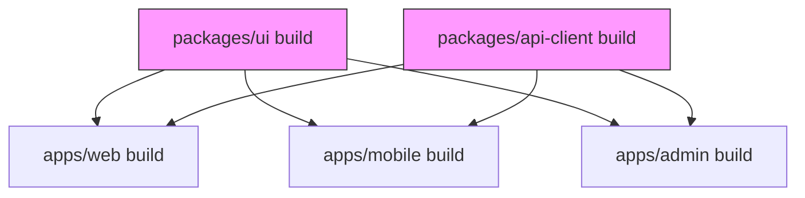
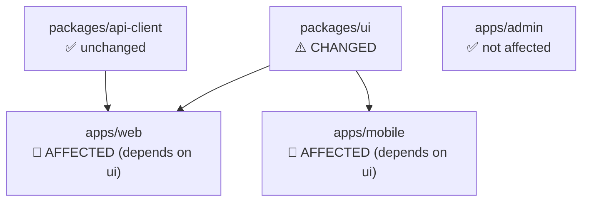
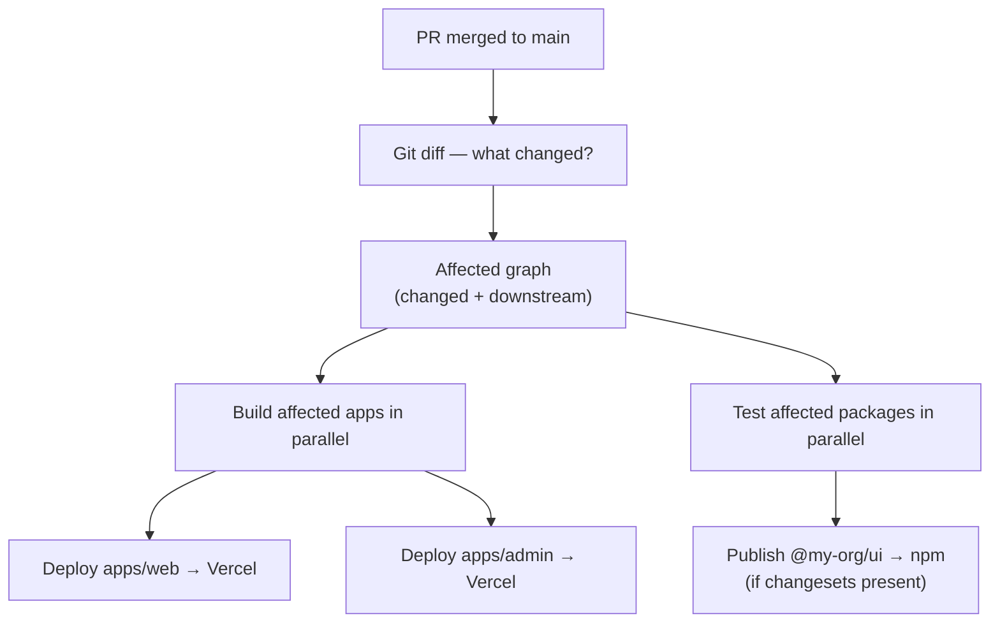

# Monorepo — Interview Reference

---

## What is a Monorepo?

A monorepo is a **single repository containing multiple related packages or applications**, all versioned together.

> **One-liner:** One repo, many packages — shared tooling, atomic changes, coordinated versioning.

```
monorepo/
  apps/
    web/          ← Next.js app
    mobile/       ← React Native app
    admin/        ← Admin dashboard
  packages/
    ui/           ← Shared component library
    utils/        ← Shared utilities
    config/       ← Shared ESLint, TypeScript, Tailwind configs
    api-client/   ← Shared API types and fetch wrappers
```

---

## Monorepo vs Polyrepo

| | Monorepo | Polyrepo |
|---|---|---|
| **Atomic changes** | One PR touches `ui` + `web` + `mobile` | 3 PRs, 3 reviews, 3 deployments, versioning drift |
| **Shared code** | Import directly, no publish needed | Must publish to npm between changes |
| **Tooling** | Configure once (ESLint, TS, test) | Configure per-repo, often drift |
| **CI time** | Slower (bigger repo) but offset by caching | Faster per-repo, but no cross-repo test |
| **Onboarding** | One clone, one `install` | Clone N repos, manage N configs |
| **Team autonomy** | Shared ownership model | Teams fully own their repo |
| **Scale** | Gets complex with 100+ packages | Gets complex with cross-repo coordination |

**When to choose monorepo:** Multiple apps share significant code, one team owns the stack, atomic cross-package changes are frequent.

**When to choose polyrepo:** Teams are fully independent, APIs are stable contracts, different release cycles, different language stacks.

---

## Core Tooling

### Workspace Protocol (npm / yarn / pnpm)

All major package managers support workspaces — they hoist shared dependencies to the root and symlink local packages.

```json
// root package.json
{
  "name": "my-monorepo",
  "workspaces": ["apps/*", "packages/*"]
}
```

```bash
# Install all dependencies across all workspaces
npm install

# Run a script in a specific workspace
npm run build --workspace=apps/web

# Add a dependency to a specific package
npm add react --workspace=apps/web
```

**pnpm workspaces** are preferred in large monorepos — pnpm uses a content-addressable store (hard links) so packages are never duplicated on disk, even across multiple projects.

---

## Turborepo

Turborepo is a **build system with remote caching** for JavaScript monorepos. It understands your task dependency graph and runs tasks in the optimal order with aggressive caching.

```json
// turbo.json
{
  "pipeline": {
    "build": {
      "dependsOn": ["^build"],  // ^ = run build in dependencies first
      "outputs": [".next/**", "dist/**"]
    },
    "lint": {
      "outputs": []
    },
    "test": {
      "dependsOn": ["^build"],
      "outputs": ["coverage/**"]
    },
    "dev": {
      "cache": false,           // never cache dev server
      "persistent": true
    }
  }
}
```

```bash
turbo run build          # builds all packages in dependency order
turbo run build --filter=apps/web  # build only web and its deps
turbo run lint test build          # run multiple tasks
```

### Task Dependency Graph



`^build` means: before building this package, build all its dependencies first. Turborepo runs `ui` and `api-client` builds in parallel, then `web`, `mobile`, and `admin` in parallel after.

### Remote Caching — the killer feature

```bash
# First CI run: tasks execute + outputs cached to Turborepo cloud
turbo run build --token=$TURBO_TOKEN --team=my-org

# Second CI run (nothing changed in packages/ui):
# ui build → CACHE HIT → restored in <1s instead of rebuilding
```

**How caching works:**
- Turborepo hashes: source files + environment variables + task config
- If hash matches a previous run → restore outputs from cache (local or remote)
- If hash differs → run task, store new outputs

```
Without remote cache: CI builds everything every time — 8 min per PR
With remote cache:    CI skips unchanged packages — <1 min per PR for small changes
```

---

## Nx

Nx is a more opinionated build system with generators, executors, and first-class framework support.

```bash
# Create an Nx workspace
npx create-nx-workspace@latest my-org --preset=react

# Generate a new app
nx generate @nx/next:app my-app

# Generate a shared library
nx generate @nx/react:library ui --directory=packages/ui

# Run affected tasks only (changed + downstream)
nx affected --target=test
nx affected --target=build
```

### Affected — only run what changed

```bash
# Turborepo equivalent: --filter=[HEAD^1]
# Nx:
nx affected --target=build --base=main --head=HEAD

# How it works:
# 1. Git diff between base and HEAD → changed files
# 2. Map files to projects (via project graph)
# 3. Run target for changed projects + all projects that depend on them
```



Only `ui`, `web`, `mobile` run their tests. `admin` and `api-client` skip. On a PR touching only `packages/ui`, this saves 60% of CI time.

### Turborepo vs Nx

| | Turborepo | Nx |
|---|---|---|
| **Philosophy** | Minimal, bring your own tools | Opinionated, batteries included |
| **Generators** | No | Yes — scaffold apps, libs, components |
| **Executors** | No — runs npm scripts | Yes — wraps build tools |
| **Remote cache** | Vercel (paid beyond free tier) | Nx Cloud (free tier generous) |
| **Framework support** | Framework agnostic | First-class Next.js, React, Angular, Node |
| **Learning curve** | Low | Higher |
| **Best for** | Teams that want speed without lock-in | Teams that want full scaffolding + governance |

---

## Shared Packages — Patterns

### Pattern 1 — Source sharing (TypeScript paths)

```json
// tsconfig.base.json at root
{
  "compilerOptions": {
    "paths": {
      "@my-org/ui": ["packages/ui/src/index.ts"],
      "@my-org/utils": ["packages/utils/src/index.ts"]
    }
  }
}
```

Each app extends this config. Imports resolve directly to TypeScript source — no build step needed for local development.

### Pattern 2 — Built packages

```json
// packages/ui/package.json
{
  "name": "@my-org/ui",
  "main": "./dist/index.js",
  "types": "./dist/index.d.ts",
  "exports": {
    ".": { "import": "./dist/index.mjs", "require": "./dist/index.js" }
  }
}
```

Each consuming app imports the built output. Requires running `build` on `ui` before consuming apps can build.

**Which to choose:** Source sharing = simpler dev loop, requires TypeScript. Built packages = matches what you'd publish to npm, works with any bundler.

---

## Changesets — Versioning and Publishing

Changesets manages version bumps and changelogs for packages in a monorepo.

```bash
# Developer adds a changeset when making a PR
npx changeset
# → prompts: which packages changed? patch/minor/major? summary?
# → creates .changeset/purple-dogs-fly.md

# In CI on merge to main:
npx changeset version   # bumps package.json versions + updates CHANGELOGs
npx changeset publish   # publishes changed packages to npm
```

```
.changeset/
  purple-dogs-fly.md:
    ---
    "@my-org/ui": minor
    ---
    Added dark mode support to Button component
```

**Without changesets:** Manually bumping versions across interdependent packages causes version drift, missed changelogs, and broken semver contracts.

---

## Shared Config Packages

```
packages/
  config/
    eslint/
      index.js       ← shared ESLint config
    typescript/
      base.json      ← shared tsconfig
    tailwind/
      index.js       ← shared Tailwind preset
```

```js
// packages/config/eslint/index.js
module.exports = {
  extends: ['eslint:recommended', '@typescript-eslint/recommended'],
  rules: { 'no-console': 'warn' }
};

// apps/web/.eslintrc.js
module.exports = {
  extends: ['@my-org/config/eslint']
};
```

One update to the shared ESLint config propagates to all apps — no drift between projects.

---

## CI/CD Strategy

```yaml
# GitHub Actions — only run affected
- name: Run affected tests
  run: npx nx affected --target=test --base=origin/main

- name: Run affected builds
  run: npx nx affected --target=build --base=origin/main

# Turborepo equivalent
- name: Build
  run: npx turbo run build --filter=[origin/main]
```

**Deployment strategy:** Each app in `apps/` deploys independently. CI detects which apps were affected, builds only those, deploys only those.



---

## Interview Summary

### Key talking points

1. "The core monorepo value prop is atomic changes — one PR touches the shared component library and both apps that consume it. In polyrepo, that's three PRs, three reviews, three deployments, with versioning drift in between."

2. "Turborepo's task pipeline understands `^build` — before building this package, build all its dependencies first. Combined with content hashing and remote caching, unchanged packages restore from cache in seconds. On a PR touching one shared package, CI runs only that package and its downstream consumers."

3. "Nx's `affected` command is the same idea — diff from base branch, map to project graph, run targets only for changed + downstream. For large monorepos with 50+ packages, this is the difference between 20-minute CI and 3-minute CI."

4. "Changesets solve the versioning problem. Without it, developers manually bump versions and forget changelogs. With it, developers add a changeset file per PR describing the change level (patch/minor/major). CI runs `changeset version` on merge, bumping all affected package.json versions and updating CHANGELOGs automatically, then publishes."

5. "Shared config packages are the underrated part. One `packages/config/eslint` consumed by all apps — ESLint rules, TypeScript config, Tailwind presets. One PR to update rules propagates everywhere. Polyrepo teams copy-paste configs and they drift within months."
