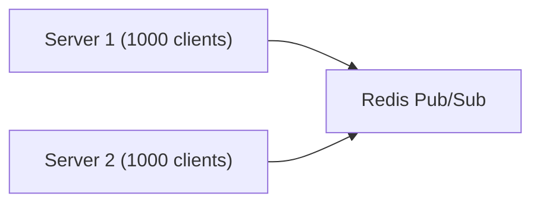
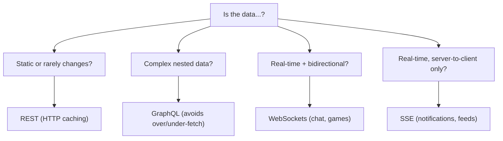
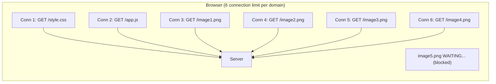
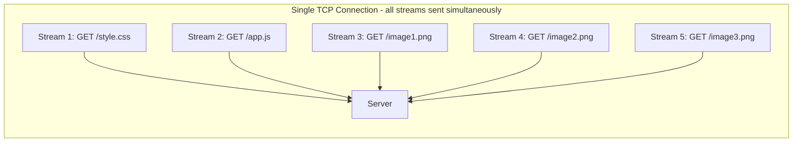
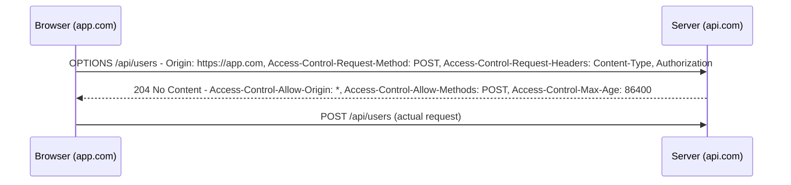
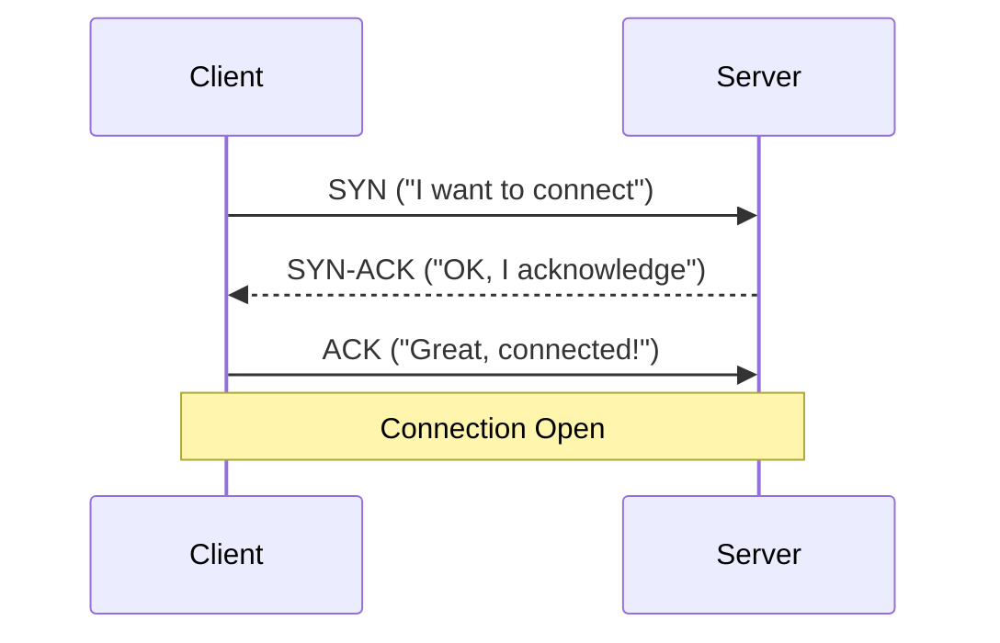
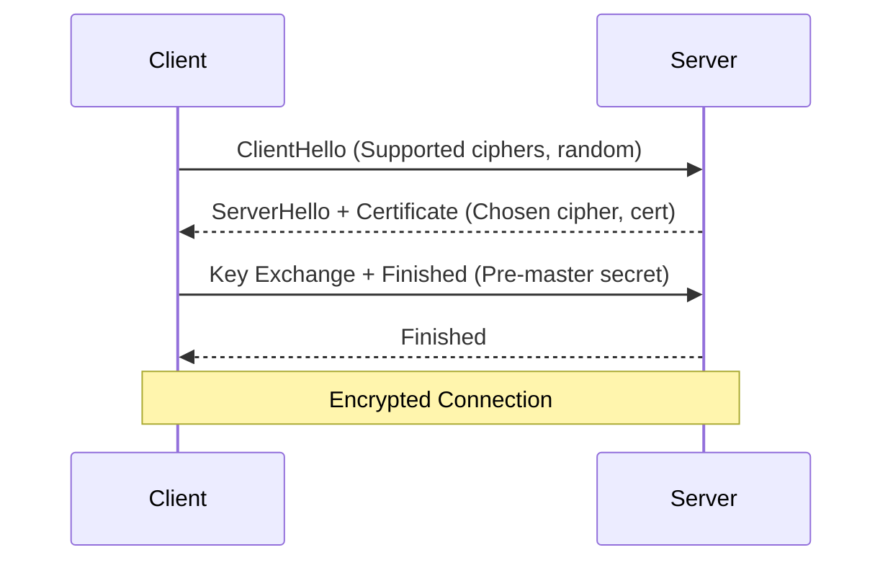

# Network Protocols: A Senior Engineer's Guide

A comprehensive guide to REST, GraphQL, WebSockets, and SSE for system design interviews.

---

## 1. REST (Representational State Transfer)

REST is the foundation of most web communication, built on the **stateless nature of HTTP**.

### Transport Mechanism

Operates primarily over HTTP/1.1 or HTTP/2:

| Version | Behavior |
|---------|----------|
| **HTTP/1.1** | Each request usually requires a new TCP connection (or reuses with overhead) |
| **HTTP/2** | Multiplexes multiple requests over a single connection to reduce latency |

### The "Over-fetching" Problem

A major architectural drawback of REST is that endpoints return a **fixed data structure**.

```
GET /users/1

// You only need the name, but you get everything:
{
  "id": 1,
  "name": "John",
  "email": "john@example.com",
  "address": { ... },
  "orderHistory": [ ... ],  // 50KB of data you don't need
  "preferences": { ... }
}
```

**Result:** Wasting bandwidth and browser memory.

### Caching Strategy (REST's Superpower)

REST is uniquely powerful because it leverages **standard HTTP caching headers**:

| Header | Purpose |
|--------|---------|
| `ETag` | Content fingerprint for conditional requests |
| `Cache-Control` | Tells browser/CDN how long to cache |
| `Last-Modified` | Timestamp-based cache validation |

Browsers and CDNs can **natively cache** REST responses, significantly reducing server load for static or semi-static data.

---

## 2. GraphQL

GraphQL is a **query language for APIs** that provides a complete and understandable description of the data in your API.

### The "Under-fetching" Solution

Unlike REST, which might require three separate calls to get a user, their posts, and their followers, GraphQL fetches all of this in a **single round trip**.

```graphql
# One request, all the data you need
query {
  user(id: 1) {
    name
    posts {
      title
    }
    followers {
      name
    }
  }
}
```

**Critical for mobile:** High latency on cellular networks makes multiple round trips expensive.

### Schema & Type Safety

GraphQL uses a **strongly typed schema**:

```graphql
type User {
  id: ID!
  name: String!
  email: String!
  posts: [Post!]!
}
```

**Benefit:** Tools like `GraphQL Code Generator` automatically create TypeScript interfaces, ensuring the frontend never attempts to access a field that doesn't exist.

### Architectural Cost

Because GraphQL often uses **POST requests** for all queries, native browser caching is much harder.

**Solutions:**
- **Apollo Client** - Sophisticated in-memory cache with normalized data
- **Relay** - Facebook's production-grade caching layer
- **Persisted Queries** - Hash queries to enable GET requests and CDN caching

---

## 3. WebSockets (WS)

WebSockets provide a **persistent, full-duplex (two-way)** communication channel between client and server.

### The Handshake

```
1. Client sends HTTP request with "Upgrade: websocket" header
2. Server responds with "101 Switching Protocols"
3. Protocol switches from HTTP to Binary/Frame-based communication
4. Connection stays open for bidirectional messaging
```

### Framing and Overhead

| Protocol | Header Size per Message |
|----------|------------------------|
| **HTTP** | ~800 bytes (cookies, user-agents, etc.) |
| **WebSocket** | 2-10 bytes (after handshake) |

**Result:** Most efficient protocol for high-frequency data:
- Cursor positions in collaborative docs (Google Docs)
- Rapid price updates (Trading platforms)
- Multiplayer game state

### State Management Challenge

Since the connection is **persistent**, the server must keep a record of every connected client in memory.

**Problem:** Horizontal scaling is difficult.

**Solution:** Use a **Pub/Sub layer** (like Redis) to sync messages across multiple server instances.



---

## 4. SSE (Server-Sent Events)

SSE is a standard that allows servers to **push data to web pages over HTTP**.

### Unidirectional Flow

Unlike WebSockets, SSE is strictly **one-way (Server → Client)**.

```js
// Client
const eventSource = new EventSource('/notifications');

eventSource.onmessage = (event) => {
  console.log('New notification:', event.data);
};

// Server sends updates whenever available
// data: {"type": "new_message", "count": 5}
```

### Native Advantages

| Feature | Benefit |
|---------|---------|
| **Built on HTTP** | Works through most firewalls and proxies without special configuration |
| **Auto-reconnection** | Browser automatically tries to reconnect on disconnect |
| **Last-Event-ID** | Server can "catch up" on missed messages after reconnect |

### Best Use Case

SSE is the **"goldilocks" protocol** for:
- News feeds
- Stock tickers
- Social media notifications
- Live sports scores

**When to use:** User doesn't need to talk back to the server in real-time, but needs to see server updates immediately.

---

## 5. Quick Comparison Table

| Protocol | Statefulness | Browser Caching | Scalability Complexity | Best For |
|----------|--------------|-----------------|----------------------|----------|
| **REST** | Stateless | Excellent (Native) | Low | CRUD operations, Public APIs |
| **GraphQL** | Stateless | Difficult (Requires Library) | Medium | Complex data requirements, Mobile apps |
| **WebSockets** | Stateful | None | High (Requires Pub/Sub) | Real-time bidirectional (Chat, Games) |
| **SSE** | Stateful | Limited | Medium | Server push notifications |

---

## 6. Decision Framework for Interviews



---

## 7. Deep Dive: HTTP/2 and HTTP/3

Understanding the transport layer is crucial for Senior-level discussions.

### HTTP/1.1 Limitations



**Head-of-Line Blocking:** If `style.css` is slow, it blocks its connection.

### HTTP/2 Multiplexing



**Key Features:**
- **Binary Framing:** Headers and body are split into frames
- **Header Compression (HPACK):** Reduces header overhead by 85%
- **Server Push:** Server can send resources before client asks

### HTTP/3 (QUIC)

Built on **UDP** instead of TCP:

| Feature | HTTP/2 (TCP) | HTTP/3 (QUIC) |
|---------|--------------|---------------|
| **Connection Setup** | TCP + TLS = 2-3 RTT | 0-1 RTT (connection ID persists) |
| **Head-of-Line Blocking** | Still exists at TCP level | Eliminated (streams are independent) |
| **Connection Migration** | Breaks on IP change | Survives (uses connection ID, not IP) |

**Mobile Game-Changer:** When user switches from WiFi to cellular, HTTP/3 connection survives.

---

## 8. CORS: The Security Handshake

Cross-Origin Resource Sharing is the browser's security mechanism for cross-domain requests.

### The Preflight Dance



### When Preflight is Triggered

| Request Type | Preflight Required? |
|--------------|---------------------|
| `GET` with standard headers | No (Simple Request) |
| `POST` with `Content-Type: application/json` | **Yes** |
| Any request with `Authorization` header | **Yes** |
| `PUT`, `DELETE`, `PATCH` | **Yes** |

### CORS Headers Reference

```http
# Server response headers
Access-Control-Allow-Origin: https://app.com  # Or * for any
Access-Control-Allow-Methods: GET, POST, PUT
Access-Control-Allow-Headers: Content-Type, Authorization
Access-Control-Allow-Credentials: true  # For cookies
Access-Control-Max-Age: 86400  # Cache preflight for 24 hours
Access-Control-Expose-Headers: X-Custom-Header  # Expose to JS
```

### The Credentials Trap

```js
// Frontend
fetch('https://api.com/data', {
  credentials: 'include'  // Send cookies
});

// Backend MUST respond with:
// Access-Control-Allow-Credentials: true
// Access-Control-Allow-Origin: https://app.com  (NOT *)
```

**Rule:** When `credentials: 'include'`, you **cannot** use `*` for origin.

---

## 9. Request Lifecycle: Under the Hood

### DNS Resolution

```
1. Browser checks local cache
2. OS checks /etc/hosts and its cache
3. Query goes to configured DNS resolver (ISP or 8.8.8.8)
4. Resolver checks its cache
5. If miss: Recursive query to root → TLD → Authoritative NS
6. IP address returned and cached (TTL-based)
```

### TCP Connection Establishment (3-Way Handshake)



**Time Cost:** ~1 RTT (Round Trip Time)

### TLS Handshake (HTTPS)



**Time Cost:** ~2 RTT (TLS 1.2) or ~1 RTT (TLS 1.3)

**Total for new HTTPS connection:** 3-4 RTT before first byte of data!

---

## 10. Interview Tip

> "The protocol choice depends on the data access pattern. For standard CRUD with good caching needs, REST wins. For complex, nested data on mobile, GraphQL reduces round trips. For real-time bidirectional communication, WebSockets are necessary despite the scaling complexity. For simple server-push scenarios, SSE offers the best simplicity-to-functionality ratio. I also consider the transport layer — HTTP/2 for multiplexing, HTTP/3 for mobile users who switch networks. And for cross-origin security, I ensure proper CORS configuration with preflight caching to minimize overhead."
