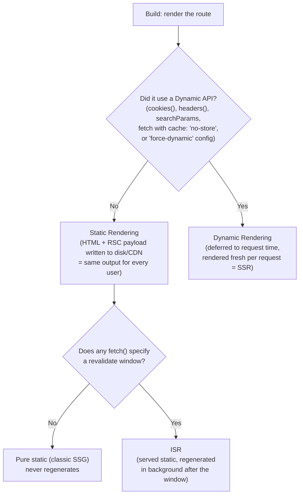

# Next.js Deep Dive: How a Framework Solves Rendering

A senior-level reference for *why* Next.js exists and *how* it concretely implements CSR, SSR, SSG, and ISR — plus React Server Components, streaming, and Partial Prerendering. Pairs with [rendering-spectrum.md](rendering-spectrum.html) (the framework-agnostic theory) and [hydration.md](hydration.html) (the hydration/RSC mechanics) — this doc is about the *implementation*: which file, which config flag, which API call gets you each strategy.

---

## 1. Why Next.js Exists

React is a UI library, not a framework — it renders components, nothing else. Left on its own, a team building a production app has to hand-solve, from scratch:

- **Routing** — React Router or a hand-rolled switch on `window.location`.
- **Code splitting** — manual `React.lazy` + webpack config per route.
- **Data fetching + waterfalls** — `useEffect` fetch-on-mount means the browser downloads JS *first*, then discovers what data it needs, then fetches it — three round trips before anything useful renders.
- **SSR** — wiring `renderToString`, a Node server, and a hydration script by hand (this is a real interview question: "build SSR without Next.js" — it's `express` + `ReactDOMServer.renderToString` + serializing initial state into a `<script>` tag for hydration to pick up).
- **Build-time generation, caching, image optimization, bundling** — all bespoke.

Next.js's pitch: take every one of those cross-cutting concerns and make them a **file-system convention** or a **single config option**, so the rendering strategy becomes a per-route decision instead of an all-or-nothing architectural commitment made on day one. That last part is the actual "why" — a mid-size app almost never wants *one* strategy for every page (see [rendering-spectrum.md §3, the Hybrid Approach](rendering-spectrum.html#3-the-hybrid-approach-the-winning-answer)); it wants SSG for the marketing site, ISR for the product catalog, SSR for checkout, and CSR for the logged-in dashboard — all in one deployable app. Next.js is the framework that makes that mixture cheap to express.

---

## 2. App Router vs Pages Router (know both, use App Router)

| | Pages Router (`pages/`) | App Router (`app/`) |
|---|---|---|
| Default component type | Client (implicitly) | **Server Component** |
| Data fetching API | `getServerSideProps`, `getStaticProps`, `getStaticPaths` | `fetch()` directly inside async Server Components |
| Layouts | Manual, re-rendered per page | Nested `layout.tsx`, persist across navigations |
| Streaming | Not supported | Built-in via Suspense + `loading.tsx` |
| Server Components | No | Yes |
| Status | Legacy, still maintained | Current standard (Next.js 13+) |

The rest of this doc is App Router-first since that's what you'll be asked about in 2025+ interviews, with Pages Router equivalents called out where the mapping matters.

---

## 3. The Core Mechanism: How Next.js Decides Static vs. Dynamic

This is the single most important "how" in this document — almost everything else (SSG, SSR, ISR) is a *consequence* of this decision, not a separate mode you manually pick.

At build time, Next.js renders every route it can. For each route, it asks: **did rendering this route touch anything request-specific?**



- **No dynamic API touched → Static Rendering.** This *is* SSG — the route is rendered once at build time into HTML + an RSC payload, and every request gets the identical, CDN-cached artifact.
- **A dynamic API touched → Dynamic Rendering.** This *is* SSR — Next.js can't precompute the page because the output depends on the incoming request (a cookie, a search param, an explicitly uncached fetch), so it renders on every request, on your server (or Edge runtime).
- **Static + a `revalidate` window → ISR.** The best of both: served instantly from the static cache, but regenerated in the background once the window expires.

The practical upshot: you rarely "choose SSR" as a mode. You write a Server Component that calls `cookies()` or fetches with `cache: 'no-store'`, and Next.js *infers* that the route must be dynamic. This is a very common interview trap: "why did adding one `headers()` call to a layout make my entire static marketing site dynamic?" — because a dynamic API anywhere in a route's render tree opts the whole route out of static rendering.

---

## 4. CSR in Next.js

CSR isn't the default anymore (App Router defaults every component to a Server Component), but you explicitly opt into it with `'use client'`:

```tsx
'use client'
import { useEffect, useState } from 'react'

export default function LiveCartBadge() {
  const [count, setCount] = useState(0)
  useEffect(() => {
    fetch('/api/cart/count').then(r => r.json()).then(d => setCount(d.count))
  }, [])
  return <span>{count}</span>
}
```

**What actually happens:** Next.js still renders this component's initial output on the server (so there's HTML in the initial response — no blank shell), then ships the component's JS to the browser and hydrates it. True zero-server CSR (an empty `<div id="root">` shell) is what you get *without* a framework at all, or with `next/dynamic(() => import(...), { ssr: false })` if you explicitly want to skip server rendering entirely (common for browser-only widgets — charting libraries, `window`-dependent code).

**When to reach for it:** anything that's genuinely per-user, changes on every interaction, and has no SEO value — a live cart count, a notifications dropdown, a websocket-driven ticker. See [rendering-spectrum.md's CSR section](rendering-spectrum.html#csr-client-side-rendering) for the general case for CSR.

---

## 5. SSR in Next.js (Dynamic Rendering)

You get SSR by using any Dynamic API, or explicitly forcing it:

```tsx
// app/dashboard/page.tsx
import { cookies } from 'next/headers'

export const dynamic = 'force-dynamic' // explicit escape hatch, rarely needed —
                                        // using cookies()/headers() below already implies this

export default async function Dashboard() {
  const session = cookies().get('session')
  const user = await fetch(`https://api.example.com/users/${session?.value}`, {
    cache: 'no-store', // don't cache this — it's per-user
  }).then(r => r.json())

  return <h1>Welcome back, {user.name}</h1>
}
```

**Pages Router equivalent:** `getServerSideProps` — runs on every request, return value becomes `props`.

**The bottleneck is unchanged from the general theory:** TTFB is gated on your slowest fetch. Next.js's answer to that specific problem is streaming (§7) rather than making SSR itself faster — you can't out-engineer a slow database call, but you can stop making the user stare at a blank screen while it runs.

---

## 6. SSG in Next.js (Static Rendering)

The *default* for any route that doesn't touch a dynamic API. For dynamic route segments (`[slug]`), you tell Next.js which pages to pre-render at build time with `generateStaticParams`:

```tsx
// app/blog/[slug]/page.tsx
export async function generateStaticParams() {
  const posts = await fetch('https://api.example.com/posts').then(r => r.json())
  return posts.map((post: { slug: string }) => ({ slug: post.slug }))
}

export default async function BlogPost({ params }: { params: { slug: string } }) {
  const post = await fetch(`https://api.example.com/posts/${params.slug}`).then(r => r.json())
  return <article>{post.body}</article>
}
```

**Pages Router equivalent:** `getStaticPaths` (returns the list of params, like `generateStaticParams`) + `getStaticProps` (fetches the data per path).

Every path returned by `generateStaticParams` gets its own pre-rendered HTML + RSC payload at build time — this *is* the "Build Bottleneck" from [rendering-spectrum.md](rendering-spectrum.html#ssg-the-workflow): 100k blog posts means 100k pages rendered before the build finishes. Next.js's answer to that specific scaling wall is ISR.

---

## 7. ISR in Next.js

Two flavors, and the distinction is a favorite interview follow-up:

### Time-based (the classic version)

```tsx
// app/products/[id]/page.tsx
export const revalidate = 3600 // regenerate at most once per hour

export default async function Product({ params }: { params: { id: string } }) {
  const product = await fetch(`https://api.example.com/products/${params.id}`, {
    next: { revalidate: 3600 }, // can also be set per-fetch instead of per-route
  }).then(r => r.json())
  return <ProductView product={product} />
}
```

Behavior matches [rendering-spectrum.md's ISR section](rendering-spectrum.html#isr-incremental-static-regeneration) exactly: the first request after the window expires still gets the **stale** page instantly, while Next.js regenerates in the background; the *next* request gets the fresh version. Nobody blocks on a rebuild.

### On-demand (the version that actually matters in production)

Time-based revalidation means you're always either serving stale data for up to N seconds, or hammering your origin by setting N too low. On-demand ISR fixes this by making revalidation *event-driven* — you tell Next.js exactly when data changed:

```tsx
'use server'
import { revalidatePath, revalidateTag } from 'next/cache'

export async function updateProduct(id: string, data: FormData) {
  await db.products.update(id, data)
  revalidatePath(`/products/${id}`)   // or revalidateTag('products') to bust every
                                       // route that fetched with { next: { tags: ['products'] } }
}
```

This is the pattern worth naming in an interview: **"static by default, invalidated on write, not on a timer."** It gets you SSG's cost profile (nothing regenerates unless data actually changed) with SSR's freshness (the moment a mutation lands, the cache is correct) — without the drawback either pure strategy has on its own.

---

## 8. React Server Components — What Next.js Actually Ships

RSC as a React concept is covered in depth in [hydration.md §"React Server Components (RSC)"](hydration.html#react-server-components-rsc). What's specific to Next.js is that **the App Router makes Server Components the default**, not an opt-in:

```tsx
// app/page.tsx — no directive needed, this IS a Server Component
export default async function Page() {
  const data = await db.query('SELECT * FROM posts') // direct DB access, no API route needed
  return <PostList posts={data} />
}
```

Three things senior candidates should be precise about:

1. **Server Components ship zero JS to the client.** Not "less JS" — literally none of a Server Component's code is in the client bundle. This is the actual performance win, separate from any rendering-strategy question — you could have a fully dynamic (SSR) route that still ships a smaller bundle than a static CSR one, purely because most of its component tree is Server Components.

2. **The output isn't HTML — it's the RSC Payload.** A special serialized format (not JSON, a custom streaming format React invented) describing the rendered tree, with "holes" where Client Components go. On the very first request, Next.js renders that payload down to real HTML (so there's something to paint immediately). On subsequent client-side navigations, the *same* payload format is fetched again and React reconciles it into the existing DOM directly — no full page reload, no re-fetching HTML — which is why App Router navigation feels like an SPA even though every page is server-rendered.

3. **The composition rule that trips people up:** a Client Component (`'use client'`) can't `import` a Server Component — once you cross into client code, everything imported has to be client-safe. But a Client Component *can* accept a Server Component as `children` or another prop, because that tree is rendered by the parent (server) before being handed down:

```tsx
// ❌ Doesn't work — Sidebar is a Server Component, imported inside a Client Component
'use client'
import Sidebar from './Sidebar' // Sidebar does DB queries — can't ship that to the client

// ✅ Works — Server Component passed down as children
'use client'
export default function ClientShell({ children }: { children: React.ReactNode }) {
  const [open, setOpen] = useState(true)
  return <div className={open ? 'expanded' : 'collapsed'}>{children}</div>
}

// app/layout.tsx (a Server Component)
import ClientShell from './ClientShell'
import Sidebar from './Sidebar' // Server Component — fine, rendered on the server first

<ClientShell><Sidebar /></ClientShell>
```

---

## 9. Streaming — Next.js's Answer to the SSR Bottleneck

`loading.tsx` is a file-system convention that wraps a route segment in a Suspense boundary automatically:

```
app/dashboard/
  layout.tsx
  loading.tsx     ← shown instantly while page.tsx's data fetches resolve
  page.tsx        ← async Server Component, awaits slow data
```

Under the hood this is exactly the "Streaming SSR" mechanism from [hydration.md §Streaming SSR](hydration.html#streaming-ssr) — `renderToReadableStream` plus React 18 Suspense — but Next.js turns it into a file you drop in a folder rather than manual boundary wiring. For finer-grained control than "the whole route," wrap individual slow components:

```tsx
export default function Page() {
  return (
    <>
      <ProductInfo />                 {/* fast, renders immediately */}
      <Suspense fallback={<Skeleton />}>
        <Recommendations />            {/* slow ML call — streams in later, doesn't block the rest */}
      </Suspense>
    </>
  )
}
```

This is the concrete implementation of YouTube's "1000 Cuts" partial-hydration idea from [rendering-spectrum.md §5](rendering-spectrum.html#5-the-hydration-problem-senior-level-detail) — each `Suspense` boundary is an independent unit that streams and hydrates on its own schedule instead of blocking on the slowest sibling.

---

## 10. Partial Prerendering (PPR) — Static Shell + Dynamic Holes

[rendering-spectrum.md §8](rendering-spectrum.html#8-real-interview-scenario-ppr-partial-pre-rendering) covers the *why* (static shell instantly, dynamic pieces streamed into reserved holes). Here's the *how*, specific to Next.js:

```tsx
export const experimental_ppr = true

export default function ProductPage({ params }: { params: { id: string } }) {
  return (
    <>
      <ProductShell />                      {/* static — prerendered at build */}
      <Suspense fallback={<StockSkeleton />}>
        <StockLevel id={params.id} />        {/* dynamic hole — reads cookies/live data */}
      </Suspense>
      <Suspense fallback={<CartSkeleton />}>
        <Cart />                             {/* dynamic hole — per-user */}
      </Suspense>
    </>
  )
}
```

At build time, Next.js prerenders the entire tree but *pauses* at each Suspense boundary that contains a Dynamic API — it keeps everything outside those boundaries as a static, CDN-cacheable shell (including the Suspense fallbacks as placeholder HTML). At request time, only the paused boundaries resume rendering — server work is proportional to "how many holes," not "how big is the page." This is why PPR's server cost profile looks like SSG's (see the cost table in [rendering-spectrum.md §6](rendering-spectrum.html#6-scalability-cost-comparison)) even though the page has genuinely dynamic, per-user content.

---

## 11. The Four Caches (the #1 "why isn't my update showing" question)

Next.js's caching is the most-misunderstood part of the framework because there are **four separate caches**, invalidated independently:

| Cache | Scope | Lives for | Invalidated by |
|---|---|---|---|
| **Request Memoization** | One render pass | A single request | Automatic — dedupes identical `fetch()` calls in the same render, no config |
| **Data Cache** | Persistent, server-wide | Across requests & deployments | `revalidate` option, `revalidatePath`/`revalidateTag`, or `cache: 'no-store'` to skip entirely |
| **Full Route Cache** | Persistent (CDN/server) | Across requests, until rebuild/revalidation | Rebuilding, or the route's own `revalidate` window |
| **Router Cache** | In-browser, per client | ~30s (dynamic) to 5min (static), session-scoped | Automatic on navigation, or manually via `router.refresh()` |

The classic bug this table explains: you call `revalidatePath()` after a mutation, the *server's* data is correct, but the user who just submitted the form still sees the old value — because the **Router Cache** (client-side, separate from everything you just invalidated) is still serving its own cached copy of that route segment. Fix: `router.refresh()` alongside the server-side revalidation, or design the mutation as a Server Action (which does this automatically for the calling client).

---

## 12. Server Actions — Removing the Need for an API Layer

`'use server'` marks a function as callable directly from a Client Component, but it never ships to the browser — Next.js compiles the call into a POST request to a hidden, framework-managed endpoint:

```tsx
// actions.ts
'use server'
export async function addToCart(productId: string) {
  await db.cart.add(productId)
  revalidateTag('cart')
}

// CartButton.tsx
'use client'
import { addToCart } from './actions'
export default function CartButton({ id }: { id: string }) {
  return <button onClick={() => addToCart(id)}>Add to cart</button>
}
```

Two things worth naming as senior detail:
- **Progressive enhancement for free:** if used as a `<form action={addToCart}>`, the form works even with JS disabled/not-yet-loaded — the browser does a real form POST, Next.js handles it server-side, no client JS required for the base case.
- **This is why Next.js apps need less client-side data-fetching machinery** (SWR/React Query) than a plain React SPA — mutations go through Server Actions + `revalidateTag`, reads happen directly in Server Components. Client-side fetching libraries are still useful for genuinely client-only, real-time-ish data (§4), just not for the majority-case CRUD flow.

---

## 13. Runtime Choice: Node vs. Edge

| | Node.js runtime (default) | Edge runtime |
|---|---|---|
| APIs available | Full Node API | Web-standard APIs only (`fetch`, `Request`, no `fs`, no most npm packages) |
| Cold start | Slower | Near-instant (V8 isolates, not full containers) |
| Where it runs | Your server/region | Distributed at CDN edge locations, close to the user |
| Set via | Default | `export const runtime = 'edge'` |
| Forced for | — | **Middleware always runs on Edge** |

Middleware (`middleware.ts` at the project root) runs *before* the routing/rendering decision is even made — it's the layer for auth redirects, A/B test bucketing, geolocation-based rewrites. Because it runs on every matched request at the edge, it needs to be fast and side-effect-light; it can read/rewrite the request but shouldn't be doing the actual data fetching.

---

## 14. Interview Scenario: Architecting a Next.js E-Commerce Product Page

Same brief as [rendering-spectrum.md §8](rendering-spectrum.html#8-real-interview-scenario-ppr-partial-pre-rendering) — Microsoft Store-style product page, 10 million users — now expressed as concrete Next.js decisions:

| Concern | Next.js mechanism | Why |
|---|---|---|
| Product title, images, description | Static Rendering, `generateStaticParams` | Same for everyone — build it once, serve from CDN |
| "In stock" count | `Suspense` boundary + PPR hole, or short `revalidate` window | Changes often; a static shell can't show it, but full SSR is overkill for one number |
| Cart contents | Client Component (`'use client'`), or a PPR dynamic hole reading a cookie | Per-user, not SEO-relevant |
| Recommendations (ML) | `Suspense` boundary, streamed in after the shell paints | Slowest data source — must not block LCP of the rest of the page |
| Add-to-cart | Server Action + `revalidateTag('cart')` | Mutation without a hand-written API route; progressive enhancement for free |
| Price change propagation | `revalidatePath('/products/[id]')` called from the admin mutation | On-demand ISR — correct the instant price changes, not up to N seconds later |
| Checkout | `export const dynamic = 'force-dynamic'` (or implied by `cookies()`) | Must be fresh and per-session; no caching layer should touch it |

---

## 15. Common Senior-Level Pitfalls

- **Fetch waterfalls inside Server Components.** `await`-ing sequentially in one component (`const a = await f1(); const b = await f2()`) still blocks in order even though there's no client-side `useEffect` chain. Fix: kick both off before awaiting — `const [a, b] = await Promise.all([f1(), f2()])`.
- **One dynamic API silently making a whole layout dynamic.** A single `cookies()` call in a shared `layout.tsx` opts every page under it out of static rendering — always trace *why* a route became dynamic before assuming it needs to be.
- **Assuming `revalidatePath` fixes what the user sees immediately.** It invalidates the server-side Full Route Cache; the client's Router Cache is separate (§11) and needs its own refresh.
- **Treating Server Components as "no hydration mismatch risk."** Client Components nested inside are still hydrated normally — non-deterministic rendering (`Date.now()`, `Math.random()`, locale-dependent formatting without a fixed locale) inside a Client Component still produces the classic server/client mismatch covered in [hydration.md §Hydration Mismatch](hydration.html#hydration-mismatch).
- **Reaching for `force-dynamic` reflexively** instead of asking whether ISR with a short `revalidate` window (or an on-demand `revalidateTag` on write) would give the same freshness with a fraction of the server cost.

---

## 16. Interview Summary

### Key talking points

1. Next.js doesn't invent new rendering strategies — it makes CSR/SSR/SSG/ISR a **per-route configuration** instead of a whole-app architectural choice, via file conventions and a handful of `fetch`/route-segment options.
2. The static-vs-dynamic decision is **inferred**, not chosen: touching a Dynamic API (`cookies()`, `headers()`, uncached `fetch`) opts a route into per-request (SSR) rendering; otherwise it's static (SSG), optionally with a `revalidate` window (ISR).
3. On-demand ISR (`revalidatePath`/`revalidateTag`) is the production-grade answer to "stale for how long?" — invalidate on write, not on a timer.
4. Server Components are the App Router default and ship **zero JS**; the wire format between server and client is the RSC Payload, not HTML — that's what makes App Router navigations feel like an SPA.
5. Streaming (`loading.tsx`, manual `Suspense`) and PPR are both built on the same primitive: a Suspense boundary marks a "hole" that can resolve independently of the rest of the page.
6. There are **four separate caches** (Request Memoization, Data Cache, Full Route Cache, Router Cache) — most "why isn't this updating" bugs are an invalidation happening in one cache but not another.
7. Server Actions collapse the mutation + revalidation + API-route boilerplate into one `'use server'` function, with progressive enhancement as a side effect.
