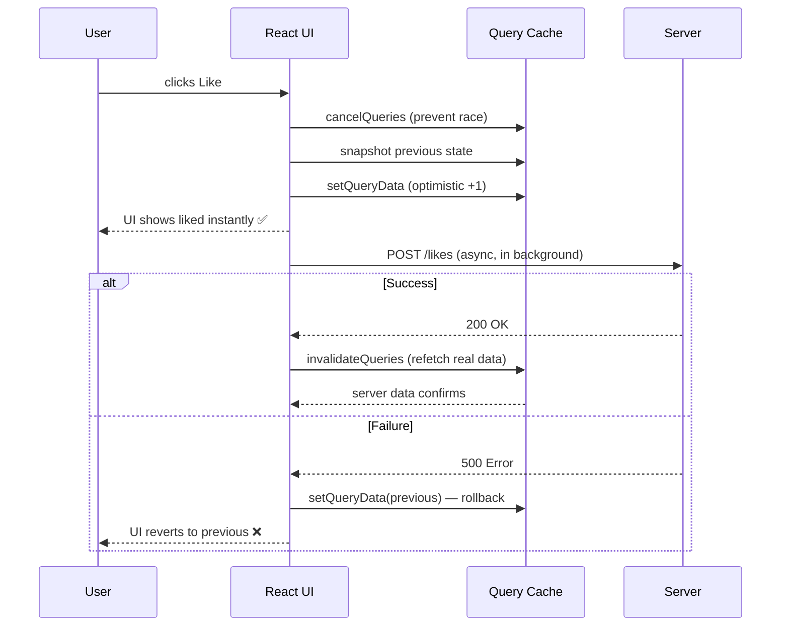

# Optimistic Updates — Interview Reference

---

## What is an Optimistic Update?

Apply a UI change **immediately** (assume success), then confirm or revert based on the server response.

> **One-liner:** Don't wait for the server — update the UI now, rollback if the server disagrees.

**Without optimistic updates:**
```
User clicks "Like" → spinner → wait 500ms → server confirms → UI updates
```
**With optimistic updates:**
```
User clicks "Like" → UI updates instantly → server confirms in background
```

---

## The Core Pattern

Every optimistic update needs three things:

| Step | What happens |
|---|---|
| **1. Snapshot** | Save current state before mutation |
| **2. Apply** | Update UI immediately |
| **3. Rollback** | On error, restore the snapshot |

```js
// Bare React — manual optimistic update
function LikeButton({ postId, initialLikes }) {
  const [likes, setLikes] = useState(initialLikes);
  const [liked, setLiked] = useState(false);

  async function handleLike() {
    // 1. Snapshot current state
    const prevLikes = likes;
    const prevLiked = liked;

    // 2. Apply optimistically
    setLikes(l => l + 1);
    setLiked(true);

    try {
      await api.likePost(postId);
      // server confirmed — nothing to do
    } catch {
      // 3. Rollback on failure
      setLikes(prevLikes);
      setLiked(prevLiked);
    }
  }

  return <button onClick={handleLike}>{liked ? '❤️' : '🤍'} {likes}</button>;
}
```

---

## React Query — Optimistic Updates

React Query handles snapshot, apply, and rollback with `onMutate` / `onError` / `onSettled`.

```js
const queryClient = useQueryClient();

const likeMutation = useMutation({
  mutationFn: (postId) => api.likePost(postId),

  // 1. Before mutation fires — snapshot + apply optimistically
  onMutate: async (postId) => {
    // Cancel any in-flight refetches (prevent overwriting optimistic update)
    await queryClient.cancelQueries({ queryKey: ['post', postId] });

    // Snapshot current value
    const previous = queryClient.getQueryData(['post', postId]);

    // Apply optimistic update to cache
    queryClient.setQueryData(['post', postId], old => ({
      ...old,
      likes: old.likes + 1,
      liked: true,
    }));

    // Return context with snapshot for rollback
    return { previous };
  },

  // 2. On error — rollback to snapshot
  onError: (err, postId, context) => {
    queryClient.setQueryData(['post', postId], context.previous);
  },

  // 3. Always — sync with server truth
  onSettled: (data, error, postId) => {
    queryClient.invalidateQueries({ queryKey: ['post', postId] });
  },
});

// Usage
likeMutation.mutate(postId);
```



---

## List Mutations — Add / Delete / Reorder

### Optimistic Add

```js
const addTodoMutation = useMutation({
  mutationFn: (title) => api.createTodo({ title }),

  onMutate: async (title) => {
    await queryClient.cancelQueries({ queryKey: ['todos'] });
    const previous = queryClient.getQueryData(['todos']);

    // Add a temporary item with a temp ID
    queryClient.setQueryData(['todos'], old => [
      ...old,
      { id: `temp-${Date.now()}`, title, done: false, _isOptimistic: true }
    ]);

    return { previous };
  },

  onError: (err, title, context) => {
    queryClient.setQueryData(['todos'], context.previous);
  },

  onSettled: () => {
    queryClient.invalidateQueries({ queryKey: ['todos'] });
    // Server response replaces temp item with real ID
  },
});
```

### Optimistic Delete

```js
const deleteMutation = useMutation({
  mutationFn: (id) => api.deleteTodo(id),

  onMutate: async (id) => {
    await queryClient.cancelQueries({ queryKey: ['todos'] });
    const previous = queryClient.getQueryData(['todos']);

    // Remove immediately from cache
    queryClient.setQueryData(['todos'], old => old.filter(t => t.id !== id));

    return { previous };
  },

  onError: (err, id, context) => {
    queryClient.setQueryData(['todos'], context.previous); // restore deleted item
  },

  onSettled: () => queryClient.invalidateQueries({ queryKey: ['todos'] }),
});
```

---

## Conflict Resolution — When Server Disagrees

The server is always the source of truth. Three patterns for handling conflicts:

### Pattern 1 — Last Write Wins (simplest)

```js
onSettled: () => {
  // Always refetch — server state replaces optimistic state
  queryClient.invalidateQueries({ queryKey: ['post', postId] });
}
// If two users edit the same post, last server response wins
// Optimistic state is a temporary UX improvement, not a source of truth
```

### Pattern 2 — Merge server + client (for partial updates)

```js
onSuccess: (serverData) => {
  queryClient.setQueryData(['post', postId], old => ({
    ...old,           // keep local state not changed by this mutation
    ...serverData,    // server wins for fields it returned
  }));
}
```

### Pattern 3 — Version-based conflict detection

```js
const updateMutation = useMutation({
  mutationFn: ({ id, changes, version }) =>
    api.update(id, { ...changes, expectedVersion: version }),

  onMutate: async ({ id, changes }) => {
    const previous = queryClient.getQueryData(['item', id]);
    queryClient.setQueryData(['item', id], old => ({ ...old, ...changes }));
    return { previous };
  },

  onError: (err, vars, context) => {
    if (err.status === 409) {
      // Conflict — server has a newer version
      // Rollback and show conflict UI
      queryClient.setQueryData(['item', vars.id], context.previous);
      showConflictDialog();
    } else {
      queryClient.setQueryData(['item', vars.id], context.previous);
    }
  },
});
```

---

## `cancelQueries` — Why It's Critical

Without canceling in-flight refetches, a background refetch can overwrite your optimistic update:

```
T=0ms  User clicks Like → optimistic update: likes=11
T=50ms Background refetch was already in-flight → returns: likes=10
T=50ms React Query receives refetch response → overwrites cache with likes=10
T=50ms UI flickers back to 10 ← optimistic update lost!
```

```js
// cancelQueries sends an abort signal to in-flight fetches
await queryClient.cancelQueries({ queryKey: ['post', postId] });
// Now the in-flight refetch is aborted before our optimistic update
```

---

## useOptimistic — React 19 Built-in

React 19 adds `useOptimistic` — a first-class hook for optimistic state.

```js
import { useOptimistic } from 'react';

function LikeButton({ postId, likes }) {
  const [optimisticLikes, addOptimisticLike] = useOptimistic(
    likes,
    (state, delta) => state + delta // how to apply the optimistic update
  );

  async function handleLike() {
    addOptimisticLike(1); // apply optimistically
    await api.likePost(postId); // server confirms
    // On settle, optimistic state is automatically replaced by server state
  }

  return <button onClick={handleLike}>❤️ {optimisticLikes}</button>;
}
```

`useOptimistic` automatically reverts when the async action settles — the optimistic state exists only for the duration of the transition.

---

## Common Mistakes

```js
// ❌ Forgetting cancelQueries — race condition
onMutate: async (postId) => {
  // No cancelQueries — in-flight refetch can overwrite optimistic update
  const previous = queryClient.getQueryData(['post', postId]);
  queryClient.setQueryData(['post', postId], ...);
  return { previous };
}

// ❌ Not returning context from onMutate — rollback fails
onMutate: async (postId) => {
  const previous = queryClient.getQueryData(['post', postId]);
  queryClient.setQueryData(['post', postId], ...);
  // forgot: return { previous }
  // onError receives context=undefined → rollback crashes
}

// ❌ Skipping onSettled — stale optimistic state lingers
// Always call invalidateQueries in onSettled to sync with server truth
// even on success — the server may have applied additional changes

// ❌ Mutating cached objects directly
queryClient.setQueryData(['todos'], old => {
  old.push(newItem); // mutates old array — React won't re-render
  return old;
});
// Fix:
queryClient.setQueryData(['todos'], old => [...old, newItem]);
```

---

## Interview Summary

### Key talking points

1. "Optimistic updates need three things: snapshot before mutation, apply immediately, rollback on error. That's it. The complexity is all in managing the race conditions."

2. "The most important step people miss is `cancelQueries` before applying the optimistic update. Without it, an in-flight background refetch arrives after your optimistic update and silently overwrites it — the UI flickers back to stale data."

3. "React Query's `onMutate` / `onError` / `onSettled` maps perfectly to snapshot / rollback / sync. `onMutate` fires before the network call, `onError` fires on failure with the context you returned from `onMutate`, `onSettled` fires always to invalidate and sync with server truth."

4. "For lists, optimistic adds use a temporary ID. The real ID arrives from the server via `onSettled` invalidation. Never assume the temp ID is stable — the server's response replaces the temp item."

5. "The server is always the source of truth. Optimistic state is a UX illusion for the duration of the network call. `onSettled` always invalidates — even on success — because the server might have applied side effects you didn't optimistically predict (e.g. running totals, computed fields, audit logs)."

6. "React 19's `useOptimistic` is the native solution — no need for manual snapshot + rollback. The optimistic value automatically reverts to the real value when the async action settles."
