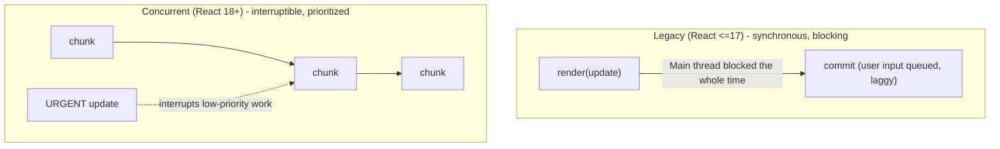
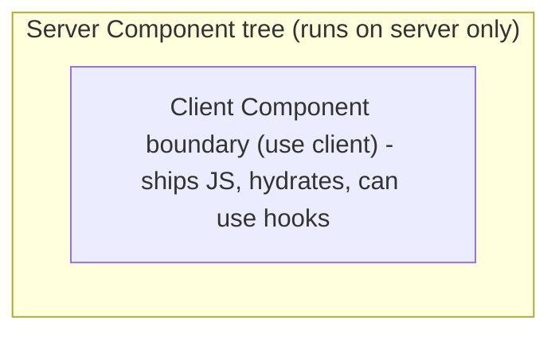
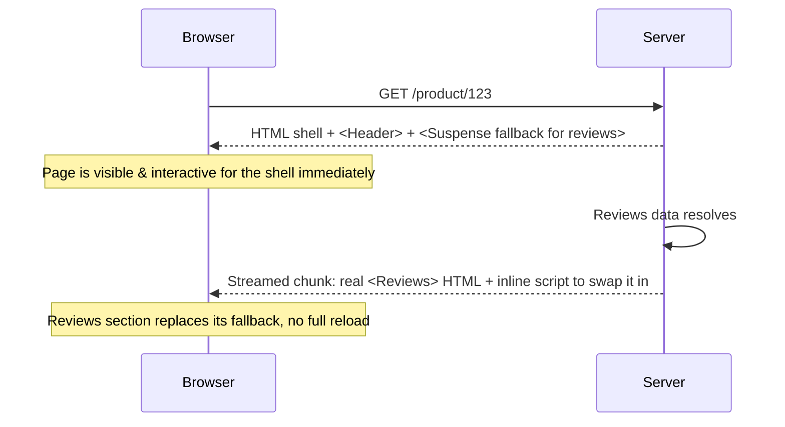

# React 18/19 Advanced Patterns: A Senior Engineer's Guide

Concurrent rendering, streaming, server components, and the compiler — the
React internals and APIs that show up in staff/senior-level interview loops
beyond basic hooks and performance memoization. See `react-performance.md`
for `useTransition`/`useDeferredValue` from a pure optimization angle; this
doc goes deeper into *why* they exist and the model underneath them.

---

## 1. Concurrent Rendering — The Mental Model

Before React 18, rendering was **synchronous and blocking**: once React
started rendering an update, it ran to completion on the main thread,
uninterruptible, even for a slow tree. A large re-render could block user
input for hundreds of milliseconds.



**Concurrent rendering doesn't mean multi-threaded.** JavaScript is still
single-threaded. What changes is that React can:
- Split rendering work into small units and yield back to the browser
  between them (so the main thread stays responsive to input/paint).
- Start rendering an update, **pause it**, and either resume, restart, or
  throw it away entirely if a higher-priority update comes in.
- Prepare multiple versions of the UI in memory without committing them,
  so a slow update never shows a half-finished screen.

This is opt-in per update — you get it by using APIs like `startTransition`,
`useDeferredValue`, or Suspense-driven data fetching. A plain `setState`
call is still treated as urgent/synchronous by default.

**Interview framing:** "Concurrent React lets the renderer treat some
updates as interruptible and lower priority, so urgent updates (typing,
clicks) never wait behind expensive ones (large list re-renders, new route
content)."

---

## 2. The React Scheduler

The Scheduler is the piece that actually decides *when* React does render
work, independent of the reconciler (Fiber) that decides *what* to render.

- React breaks rendering into **units of work** (roughly, one Fiber node at
  a time) and periodically checks whether it should yield back to the
  browser — similar in spirit to `requestIdleCallback`, but React ships its
  own scheduler (`scheduler` package) rather than relying on that browser
  API, because `requestIdleCallback` fires too infrequently and isn't
  available everywhere. Internally it uses a `MessageChannel` postMessage
  trick to schedule a callback for "as soon as possible after the current
  task, but not blocking paint."
- Work is assigned a **priority lane** (an internal bitmask), roughly:

| Lane | Example |
|---|---|
| Immediate/Sync | discrete events like click, keydown |
| User-blocking | continuous events like drag, scroll |
| Normal | data fetch results, network responses |
| Low | `startTransition` updates |
| Idle | analytics, offscreen prerendering |

- Higher-priority work **preempts** lower-priority work already in
  progress — React can throw away a half-finished low-priority render and
  restart it later once the urgent work commits.

**Interview framing:** "React's Scheduler is a cooperative, priority-based
task queue that time-slices rendering work so the browser never goes more
than a few milliseconds without a chance to handle input or paint a frame."

---

## 3. Transition API — `useTransition`

`startTransition` marks a state update as **non-urgent**: React will render
it, but happily interrupt it if something urgent (typing, a click) comes in.

```jsx
function SearchPage() {
  const [query, setQuery] = useState('');
  const [results, setResults] = useState([]);
  const [isPending, startTransition] = useTransition();

  function handleChange(e) {
    const value = e.target.value;
    setQuery(value); // urgent — input must feel instant

    startTransition(() => {
      // non-urgent — can be interrupted by the next keystroke
      setResults(expensiveFilter(allItems, value));
    });
  }

  return (
    <>
      <input value={query} onChange={handleChange} />
      {isPending && <Spinner />}
      <ResultsList items={results} />
    </>
  );
}
```

Without the transition, typing into the input would feel laggy because
React would have to finish re-rendering the (possibly huge) `ResultsList`
before the next keystroke's input update could paint. With it, `query`
updates immediately and `results` updates "when React gets a chance,"
discarding stale in-progress renders if you keep typing.

**Key nuance:** `isPending` reflects whether the transition itself is still
being rendered — it does *not* mean the same as a network loading state.

---

## 4. `useDeferredValue`

Same underlying mechanism as `useTransition`, different shape: instead of
wrapping a *setter call*, you defer a *value* you don't own.

```jsx
function SearchPage({ query }) {
  const deferredQuery = useDeferredValue(query);
  const results = useMemo(
    () => expensiveFilter(allItems, deferredQuery),
    [deferredQuery]
  );

  return <ResultsList items={results} stale={query !== deferredQuery} />;
}
```

Use `useTransition` when **you control the state update** (you're calling
`setState` yourself). Use `useDeferredValue` when you only receive a value
as a prop and can't wrap its setter — e.g. `query` comes from a parent.

Both let React render an old ("stale") version of the deferred part of the
UI while urgent work happens, then catch up in the background.

---

## 5. Suspense

Suspense lets a component **"suspend"** rendering — pause and show a
fallback — while it's waiting for something asynchronous, without manual
`if (loading) return <Spinner />` checks scattered everywhere.

```jsx
<Suspense fallback={<Spinner />}>
  <ProfileDetails />       {/* can suspend */}
  <Suspense fallback={<CommentsSkeleton />}>
    <Comments />           {/* suspends independently, doesn't block ProfileDetails */}
  </Suspense>
</Suspense>
```

Mechanically: a component "suspends" by throwing a Promise during render.
The nearest enclosing `<Suspense>` boundary catches it, shows the fallback,
and re-renders the subtree once the Promise resolves. You rarely throw a
Promise by hand — data-fetching libraries (React Query, Relay) and React
19's `use()` hook do it for you:

```jsx
function ProfileDetails({ userPromise }) {
  const user = use(userPromise); // suspends until userPromise resolves
  return <h1>{user.name}</h1>;
}
```

Originally used for `React.lazy()` code splitting; React 18+ extended it to
data fetching and server rendering (see Streaming SSR below). Nested
boundaries suspend **independently** — one slow section doesn't block
already-ready siblings from showing.

---

## 6. `useSyncExternalStore`

Concurrent rendering can render the same component multiple times, tear
work down, and re-render with a different priority — which is dangerous if
a component reads from a mutable external source (like a third-party store
or `window` value) directly, since the value could change *between* two
renders of the same commit and produce a **tearing** bug (different parts
of the UI showing inconsistent snapshots of the same data at once).

`useSyncExternalStore` exists specifically to let you subscribe to
external, non-React state **safely** under concurrent rendering:

```jsx
function useWindowWidth() {
  return useSyncExternalStore(
    (onStoreChange) => {
      window.addEventListener('resize', onStoreChange);
      return () => window.removeEventListener('resize', onStoreChange);
    },
    () => window.innerWidth,       // getSnapshot (client)
    () => 0                         // getServerSnapshot (SSR fallback)
  );
}
```

React guarantees the value returned is consistent across a single render
pass, even under concurrent/interrupted rendering. This is exactly what
Redux, Zustand, and Jotai use internally to bind their stores to React —
you rarely call it directly unless you're building a state-management
library or bridging non-React state yourself.

---

## 7. `useOptimistic`

A React 19 hook for showing the *expected* result of an async action
immediately, before the server confirms it, then reconciling automatically
once the real result comes back (or reverting on error).

```jsx
function ThreadLikeButton({ postId, likeCount, action }) {
  const [optimisticCount, addOptimisticLike] = useOptimistic(
    likeCount,
    (currentCount, amount) => currentCount + amount
  );

  async function handleLike() {
    addOptimisticLike(1);         // shows instantly
    await action(postId);          // real server mutation
    // on success: real data flows back down and replaces the optimistic value
    // on error: React automatically reverts to the last real state
  }

  return <button onClick={handleLike}>{optimisticCount} likes</button>;
}
```

Before this hook, "optimistic UI" meant hand-rolling your own temporary
state plus manual rollback-on-error logic. `useOptimistic` formalizes that
pattern. It's commonly paired with React 19 **Actions** (`<form action={fn}>`)
and `useActionState`/`useFormStatus` for form submissions, but works with
any async function.

---

## 8. Server Components (RSC)

A component type that renders **only on the server**, ships **zero
JavaScript** to the client for its own code, and can do things Client
Components can't — `await` a database call or read a file directly in the
component body, with no API route in between.

```jsx
// ServerComponent.js — no "use client" directive = Server Component by default
async function ProductPage({ id }) {
  const product = await db.products.findById(id); // direct DB access, server-only
  return (
    <div>
      <h1>{product.name}</h1>
      <AddToCartButton productId={id} /> {/* a Client Component */}
    </div>
  );
}
```

```jsx
// AddToCartButton.js
'use client'; // opts this file INTO the client bundle
export function AddToCartButton({ productId }) {
  const [pending, setPending] = useState(false); // needs interactivity → must be a Client Component
  return <button onClick={() => addToCart(productId)}>Add to cart</button>;
}
```

**The composition rule:** Server Components can render Client Components,
but a Client Component **cannot** directly import a Server Component (once
you're in client-rendered territory, everything under it is client-rendered
too) — the one exception is passing a Server Component in as `children`/props
from above, since it's already been rendered to a serialized description by
the time the client sees it.



Why it matters: no `useState`/`useEffect`/event handlers means smaller
client bundles (the Server Component's code and its dependencies never
ship), and no client-server round trip for data the component needs at
render time. The tradeoff is a new mental model of "which file runs where"
and a build/framework that supports RSC (Next.js App Router is the common
one in interviews).

---

## 9. Streaming SSR

Traditional SSR (`renderToString`) is all-or-nothing: the server renders
the *entire* page to an HTML string, then sends it — if one section is slow
(a slow data fetch), the whole response waits for it.

Streaming SSR (`renderToPipeableStream` / `renderToReadableStream`) sends
HTML in **chunks** as it becomes ready, using Suspense boundaries as the
natural split points:



Paired with **selective hydration**: the browser can start hydrating
(attaching event listeners to) the parts of the page that arrived first and
that the user is interacting with, without waiting for slower Suspense
boundaries further down the page to finish streaming in.

**Interview framing:** "Streaming SSR turns 'wait for the slowest data,
then send everything' into 'send the shell immediately, backfill slow
sections as they resolve' — Suspense boundaries mark where the stream can
be chunked."

---

## 10. Error Boundaries

A component that catches JavaScript errors thrown **during rendering**
anywhere in its child tree, logs them, and shows a fallback UI instead of
unmounting the whole app. Must currently be a **class component** — there
is no hook equivalent as of React 19 (you can use a small library like
`react-error-boundary` for a hook-friendly wrapper around the same class
API).

```jsx
class ErrorBoundary extends React.Component {
  state = { hasError: false };

  static getDerivedStateFromError(error) {
    return { hasError: true }; // render fallback on next render
  }

  componentDidCatch(error, info) {
    logErrorToService(error, info.componentStack); // side effect: report it
  }

  render() {
    if (this.state.hasError) return this.props.fallback;
    return this.props.children;
  }
}
```

**What it catches:** errors thrown during render, in lifecycle methods, and
in constructors of the tree below it.
**What it does NOT catch:** errors in event handlers (use a plain
`try/catch` there), errors in async code (`setTimeout`, promises — same,
`try/catch` or `.catch()`), errors during server-side rendering, and errors
thrown in the boundary component itself.

**Placement strategy:** don't wrap the whole app in one boundary — place
boundaries around independent sections (widgets, routes) so one broken
section degrades gracefully instead of taking down the entire page.

---

## 11. The React Compiler

A build-time tool (previously known as "React Forget") that automatically
memoizes components and values, aiming to make manual `useMemo`,
`useCallback`, and `React.memo` largely unnecessary.

```jsx
// What you write:
function ProductList({ products, filter }) {
  const filtered = products.filter((p) => p.category === filter);
  return filtered.map((p) => <ProductCard key={p.id} product={p} />);
}

// What manual optimization looked like before the compiler:
function ProductList({ products, filter }) {
  const filtered = useMemo(
    () => products.filter((p) => p.category === filter),
    [products, filter]
  );
  return filtered.map((p) => <ProductCard key={p.id} product={p} />);
}
```

With the compiler enabled, you write the first version and it automatically
inserts the memoization the second version does by hand — it statically
analyzes each component/hook function at build time, determines which
values and JSX depend on which inputs, and generates a memo cache
comparable to what `useMemo`/`React.memo` would produce, without you
writing the dependency arrays yourself (and without the classic bug of a
stale or missing dependency array).

**Constraints:** the compiler only optimizes code that follows the [Rules
of React](https://react.dev/reference/rules) (no mutating props/state
during render, no side effects in render, etc.) — code that breaks those
rules is left alone rather than incorrectly optimized. It's a compile step
(via a Babel/SWC plugin), not a runtime library.

**Interview framing:** "The compiler moves memoization from a manual,
error-prone opt-in (remembering `useMemo` everywhere, keeping dependency
arrays correct) to an automatic compile-time analysis — the goal is that
`React.memo`/`useMemo`/`useCallback` become implementation details you
rarely reach for by hand."

---

## 12. Quick Reference

| API / Concept | One-line purpose |
|---|---|
| Concurrent rendering | Interruptible, prioritized rendering instead of blocking, synchronous rendering |
| React Scheduler | Time-slices render work by priority lane so input/paint never waits long |
| `useTransition` | Mark a state update you control as low-priority/interruptible |
| `useDeferredValue` | Defer a value you don't own the setter for |
| `Suspense` | Show a fallback while a subtree "suspends" on async work |
| `useSyncExternalStore` | Tear-free subscription to external (non-React) state |
| `useOptimistic` | Show the expected result of an async action before it's confirmed |
| Server Components | Zero-JS, server-only components; compose with `'use client'` boundaries |
| Streaming SSR | Send HTML in chunks as Suspense boundaries resolve, instead of all-at-once |
| Error Boundaries | Class-only; catch render-phase errors in a subtree, show a fallback |
| React Compiler | Build-time auto-memoization, reduces manual `useMemo`/`useCallback`/`memo` |

## 13. Interview Tip

These topics test whether you understand the **model change**, not just API
syntax: React 18+ shifted from "one synchronous render pass" to "prioritized,
interruptible, potentially-streamed rendering." When asked about any single
API here, anchor your answer in that shift — *what urgency/priority problem
does this API solve* — rather than reciting the hook signature.
