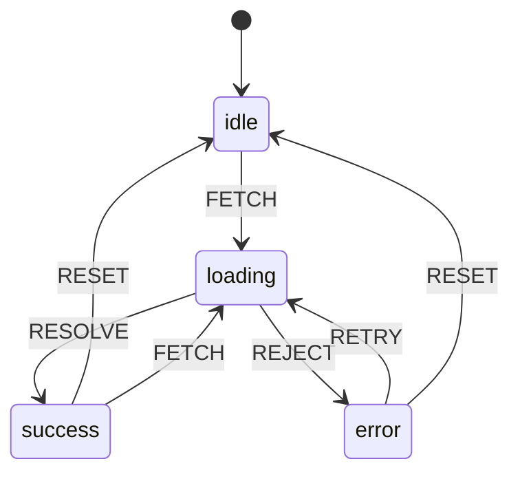
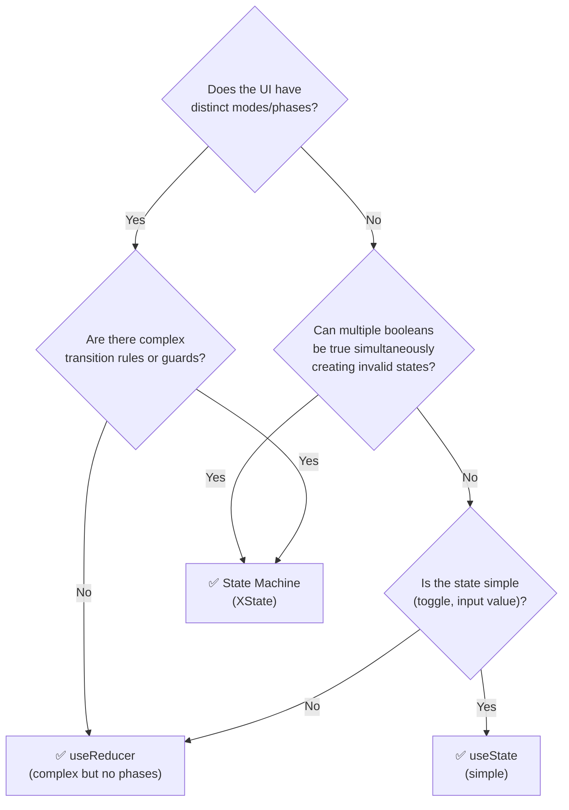

# State Machines — Interview Reference

---

## What is a State Machine?

A state machine is a model that defines:
- A finite set of **states** (what the system can be in)
- **Events** that trigger transitions between states
- **Actions** that run on entry, exit, or transition

> **One-liner:** A state machine makes invalid states impossible by definition — you can only be in one state at a time, and only defined transitions are allowed.

---

## Why State Machines — The Problem They Solve

Complex UI logic with `useState` booleans becomes unmaintainable and allows impossible states:

```js
// ❌ Boolean soup — 2^4 = 16 possible combinations, most invalid
const [isLoading, setIsLoading] = useState(false);
const [isSuccess, setIsSuccess] = useState(false);
const [isError, setIsError] = useState(false);
const [isRetrying, setIsRetrying] = useState(false);

// Can you have isLoading=true AND isSuccess=true? Theoretically yes.
// Can you have isError=true AND isSuccess=true? Theoretically yes.
// These are impossible states but nothing prevents them.

// ✅ State machine — exactly ONE state at a time
type State = 'idle' | 'loading' | 'success' | 'error' | 'retrying';
// You CANNOT be in "loading" and "success" simultaneously.
// Impossible states are literally impossible to represent.
```

**The real cost of invalid states:** Every conditional becomes defensive:

```js
// You start writing this everywhere:
if (isLoading && !isSuccess && !isError) { ... }
if (!isLoading && isSuccess && !isError) { ... }
// This is a state machine implemented badly with booleans.
```

---

## State Machine Anatomy



| Concept | Description | Example |
|---|---|---|
| **State** | What the system is currently doing | `idle`, `loading`, `error` |
| **Event** | Something that happens (user action, API response) | `FETCH`, `RESOLVE`, `REJECT` |
| **Transition** | State change triggered by an event | `loading` + `RESOLVE` → `success` |
| **Action** | Side effect that runs during transition | `fetchData()`, `logError()` |
| **Guard** | Condition that blocks a transition | only `RETRY` if `retryCount < 3` |
| **Context** | Extended state — data alongside the state | `{ data, error, retryCount }` |

---

## XState — Core API

```js
import { createMachine, assign } from 'xstate';

const fetchMachine = createMachine({
  id: 'fetch',
  initial: 'idle',
  context: {
    data: null,
    error: null,
    retryCount: 0,
  },

  states: {
    idle: {
      on: {
        FETCH: 'loading',  // shorthand transition
      }
    },

    loading: {
      invoke: {
        src: 'fetchData',              // service name — defined in options
        onDone: {
          target: 'success',
          actions: assign({ data: (ctx, event) => event.data }) // update context
        },
        onError: {
          target: 'error',
          actions: assign({ error: (ctx, event) => event.data })
        }
      }
    },

    success: {
      on: {
        RESET: { target: 'idle', actions: assign({ data: null }) },
        FETCH: 'loading',
      }
    },

    error: {
      on: {
        RETRY: {
          target: 'loading',
          guard: 'canRetry',           // only if retryCount < 3
          actions: assign({ retryCount: (ctx) => ctx.retryCount + 1 })
        },
        RESET: { target: 'idle', actions: assign({ error: null, retryCount: 0 }) },
      }
    }
  }
}, {
  services: {
    fetchData: async (ctx, event) => {
      const res = await fetch(`/api/${event.id}`);
      if (!res.ok) throw new Error(res.statusText);
      return res.json();
    }
  },
  guards: {
    canRetry: (ctx) => ctx.retryCount < 3,
  }
});
```

### Using in React with `@xstate/react`

```jsx
import { useMachine } from '@xstate/react';

function FetchComponent({ id }) {
  const [state, send] = useMachine(fetchMachine);

  return (
    <div>
      {state.matches('idle') && (
        <button onClick={() => send({ type: 'FETCH', id })}>Load</button>
      )}

      {state.matches('loading') && <Spinner />}

      {state.matches('success') && <Data data={state.context.data} />}

      {state.matches('error') && (
        <div>
          <p>{state.context.error.message}</p>
          {state.context.retryCount < 3 && (
            <button onClick={() => send('RETRY')}>Retry</button>
          )}
          <button onClick={() => send('RESET')}>Reset</button>
        </div>
      )}
    </div>
  );
}
```

---

## Hierarchical States (Nested)

Some states have substates. Instead of flattening everything, nest them:

```js
// Without nesting: loading_initial, loading_polling, loading_cancelling
// With nesting: loading → { initial, polling, cancelling }

const machine = createMachine({
  initial: 'idle',
  states: {
    idle: { on: { START: 'loading' } },

    loading: {
      initial: 'initial',  // default substate
      states: {
        initial: {
          on: { POLL: 'polling', CANCEL: '#machine.cancelled' }
        },
        polling: {
          on: { DONE: '#machine.success', CANCEL: '#machine.cancelled' }
        },
      },
      // Events that apply to ALL substates of loading:
      on: {
        ERROR: 'error'  // works in both loading.initial and loading.polling
      }
    },

    success: {},
    error: {},
    cancelled: {},
  }
});
```

**Why nesting matters:** Without it, you need `loading_polling_error`, `loading_initial_error` — N×M states instead of N+M.

---

## Parallel States

Multiple regions of a system can be in independent states simultaneously.

```js
// A form with independently tracked: validity state + submission state
const formMachine = createMachine({
  type: 'parallel',  // both regions active simultaneously

  states: {
    validation: {
      initial: 'pristine',
      states: {
        pristine: { on: { CHANGE: 'dirty' } },
        dirty: {
          on: {
            VALIDATE_SUCCESS: 'valid',
            VALIDATE_ERROR: 'invalid',
          }
        },
        valid: {},
        invalid: {},
      }
    },

    submission: {
      initial: 'idle',
      states: {
        idle: { on: { SUBMIT: 'submitting' } },
        submitting: {
          on: { SUCCESS: 'submitted', FAILURE: 'idle' }
        },
        submitted: {},
      }
    }
  }
});

// Current state: { validation: 'valid', submission: 'idle' }
// Can check: state.matches({ validation: 'valid', submission: 'idle' })
```

---

## Actor Model

XState v5 introduces the **actor model** — machines can spawn child actors, communicate via messages.

```js
import { createMachine, spawn, send } from 'xstate';

// Child actor — handles one upload
const uploadMachine = createMachine({ /* ... */ });

// Parent actor — manages multiple uploads
const uploadManagerMachine = createMachine({
  context: { uploads: [] },
  states: {
    idle: {
      on: {
        ADD_FILE: {
          actions: assign({
            uploads: (ctx, event) => [
              ...ctx.uploads,
              spawn(uploadMachine, { input: { file: event.file } }) // spawn child
            ]
          })
        }
      }
    }
  }
});
```

Each upload is an independent actor with its own state. The parent tracks the list; each child handles its own lifecycle. No shared state — actors communicate only via events.

---

## When to Use State Machines vs Reducers vs useState



| Use case | Tool |
|---|---|
| Toggle, counter, simple input | `useState` |
| Related state that updates together, no phases | `useReducer` |
| Multi-step form wizard | State machine |
| Fetch with loading/error/retry | State machine |
| WebSocket lifecycle (connecting/connected/reconnecting/closed) | State machine |
| Upload with progress, pause, cancel, retry | State machine |
| Authentication flow (logged-out/logging-in/logged-in/expired) | State machine |
| Shopping cart (complex discounts, validation) | State machine or reducer |

---

## Real-world Example: Multi-step Form

```js
const checkoutMachine = createMachine({
  id: 'checkout',
  initial: 'cart',
  context: {
    cart: [],
    shipping: null,
    payment: null,
    orderId: null,
    error: null,
  },

  states: {
    cart: {
      on: {
        PROCEED: { target: 'shipping', guard: 'cartNotEmpty' }
      }
    },

    shipping: {
      on: {
        BACK: 'cart',
        SUBMIT_SHIPPING: {
          target: 'payment',
          actions: assign({ shipping: (_, e) => e.address })
        }
      }
    },

    payment: {
      on: {
        BACK: 'shipping',
        SUBMIT_PAYMENT: {
          target: 'processing',
          actions: assign({ payment: (_, e) => e.details })
        }
      }
    },

    processing: {
      invoke: {
        src: 'placeOrder',
        onDone: {
          target: 'confirmed',
          actions: assign({ orderId: (_, e) => e.data.orderId })
        },
        onError: {
          target: 'payment',  // go back to payment on failure
          actions: assign({ error: (_, e) => e.data.message })
        }
      }
    },

    confirmed: {
      type: 'final'  // terminal state — no transitions out
    }
  }
}, {
  guards: {
    cartNotEmpty: (ctx) => ctx.cart.length > 0,
  },
  services: {
    placeOrder: async (ctx) => api.orders.create({ ...ctx.shipping, ...ctx.payment })
  }
});
```

**What you get for free from the machine:**
- Back button always works — explicit `BACK` transitions
- Can't reach `payment` without going through `shipping` first
- Can't double-submit — `processing` has no `SUBMIT` transition
- Error handling is a transition to a recoverable state, not a flag

---

## Interview Summary

### Key talking points

1. "State machines make impossible states impossible by definition. You can't be in `loading` and `success` simultaneously — they're mutually exclusive states. Boolean soup (`isLoading`, `isSuccess`, `isError`) allows 2^N combinations, most of which are invalid."

2. "The hierarchy is: `useState` for simple values → `useReducer` for related state with no phases → state machine for anything with distinct lifecycle phases (loading/error/retry, multi-step flows, WebSocket lifecycle)."

3. "XState's `invoke` is the pattern for async — it starts a service (Promise, observable, callback) when the state is entered, routes `onDone` to success and `onError` to failure. No manual try/catch in components."

4. "Guards are the state machine equivalent of business rules. `canRetry: ctx.retryCount < 3` lives in the machine definition, not scattered across components. The UI just sends `RETRY` and the machine decides whether the transition is allowed."

5. "Hierarchical states prevent state explosion. Instead of `loading_polling_error`, `loading_initial_error`, you have `loading` with substates `initial` and `polling`, and `error` handles both. N substates × M contexts = N+M, not N×M."

6. "The actor model is how you scale — each independent thing (each file upload, each WebSocket connection) is its own actor with its own machine. They communicate only via events — no shared mutable state. The parent just tracks the list of actors."
