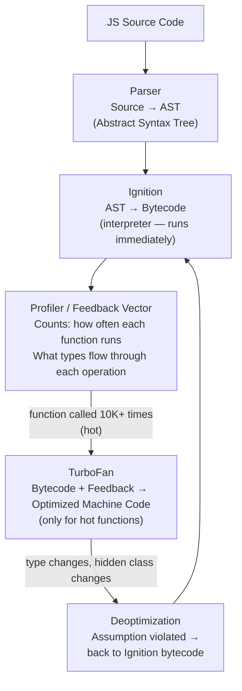
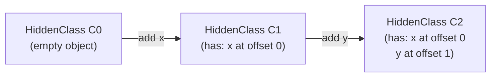
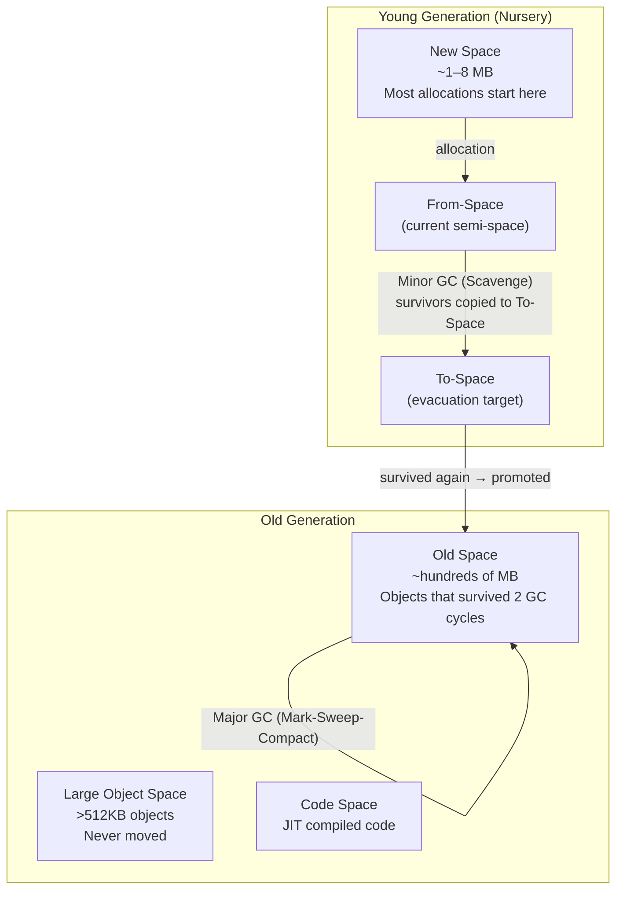

# V8 Internals — Interview Reference

---

## What is V8?

V8 is Google's JavaScript engine — used in Chrome, Node.js, and Deno. It compiles JavaScript to native machine code at runtime using a **multi-tier JIT (Just-In-Time) compilation pipeline**.

> **One-liner:** V8 parses JS into an AST, interprets it via Ignition, profiles hot code, and compiles hot paths to optimized machine code via TurboFan — then deoptimizes back if assumptions break.

---

## The Compilation Pipeline



**Why two tiers?**
- **Ignition** starts executing immediately — no wait for compilation. Bytecode is compact, fast to generate.
- **TurboFan** optimizes only code that actually runs frequently — compiling everything up front would waste time on code that's called once.

---

## Hidden Classes

V8 assigns every object an internal **hidden class** (also called "shape" or "map") to describe its structure — which properties it has and their memory offsets.

```js
// Two objects with same properties added in same order
// → share the same hidden class → fast property access
const a = {};
a.x = 1;
a.y = 2;

const b = {};
b.x = 10;
b.y = 20;
// a and b: same hidden class C2
```



**Every structural change creates a new hidden class transition.**

```js
// These look identical but create DIFFERENT hidden class chains
const a = {};
a.x = 1; a.y = 2; // → C0 → C1(x) → C2(x,y)

const b = {};
b.y = 2; b.x = 1; // → C0 → C3(y) → C4(y,x)

// a and b have DIFFERENT hidden classes
// V8 cannot reuse the same optimized code path for both
```

**What kills hidden class sharing:**

| Anti-pattern | Why it breaks |
|---|---|
| Adding properties in different orders | Creates divergent hidden class chains |
| `delete obj.prop` | Transitions to a "dictionary mode" (slow hash map) |
| Adding properties after construction | Creates new hidden class — old code optimized for old class deoptimizes |
| Mixing types for same property | `obj.x = 1` then `obj.x = 'str'` — two different type shapes |

**Best practice:** Always initialize all properties in the constructor in the same order.

```js
// Good — consistent hidden class for all instances
class Point {
  constructor(x, y) {
    this.x = x; // always added first
    this.y = y; // always added second
  }
}

// Bad — hidden class diverges depending on which branch runs
class Point {
  constructor(x, y, z) {
    this.x = x;
    if (z) this.z = z; // some instances have z, some don't → different shapes
    this.y = y;
  }
}
```

---

## Inline Caching (IC)

When V8 accesses a property (e.g. `obj.x`), it caches the result of the lookup based on the object's hidden class. Next time it sees the same access on an object with the same hidden class, it skips the lookup entirely.

```
obj.x  → first time: look up hidden class, find x at offset 4 → cache it
obj.x  → second time: hidden class same? → YES → read offset 4 directly
```

### IC States — from fast to slow

| State | What it means |
|---|---|
| **Uninitialized** | Never seen a value here yet |
| **Monomorphic** | Always seen the same hidden class → fastest |
| **Polymorphic** | Seen 2-4 different hidden classes → still fast, small dispatch table |
| **Megamorphic** | Seen 5+ different hidden classes → cache abandoned, generic lookup every time |

```js
function getX(obj) { return obj.x; }

getX({ x: 1 });           // monomorphic — shape A
getX({ x: 2 });           // still monomorphic — same shape A
getX({ x: 3, y: 4 });    // polymorphic — shape B added
getX({ x: 5, y: 4, z: 6 }); // polymorphic — shape C
getX({ a: 1 });           // megamorphic — too many shapes → slow path
```

**Real-world impact:** A React `cloneElement` loop over components of different types, or a utility function called with different object shapes, goes megamorphic and is significantly slower than the same loop over same-shaped objects.

---

## Garbage Collection — Generational GC

V8 divides the heap into two generations based on the observation that **most objects die young** (short-lived allocations like temporaries, closures in event handlers).



### Minor GC (Scavenge) — fast, frequent

- Runs when New Space fills up (~every few ms in busy apps)
- Copies live objects from From-Space to To-Space
- Dead objects are simply abandoned — no free-list management
- Objects that survive 2 scavenges are **promoted to Old Space**
- Pause: **< 1ms** — nearly imperceptible

### Major GC (Mark-Sweep-Compact) — slower, less frequent

1. **Mark** — walk all roots (stack, globals), mark reachable objects
2. **Sweep** — reclaim memory of unmarked objects
3. **Compact** — move live objects together to eliminate fragmentation

Pause: can be **10–100ms** in large heaps. V8 mitigates with:
- **Incremental marking** — spread marking work across multiple small pauses
- **Concurrent marking** — mark on background thread while JS runs
- **Parallel compaction** — multiple threads compact simultaneously

### What causes memory leaks in JS

```js
// 1. Forgotten event listeners on long-lived elements
window.addEventListener('resize', () => { /* holds closure */ });
// Fix: removeEventListener when component unmounts

// 2. Closures holding large data
function init() {
  const cache = new Array(1_000_000).fill(0); // 8MB
  return () => cache[0]; // cache can never be GC'd as long as this function lives
}

// 3. Detached DOM nodes still referenced in JS
let ref = document.getElementById('modal');
document.body.removeChild(ref); // removed from DOM
// but `ref` still holds it → entire DOM subtree stays in memory
ref = null; // fix

// 4. Timers never cleared
const id = setInterval(() => { /* holds closure */ }, 1000);
// Fix: clearInterval(id) when done

// 5. Global accidental variables
function foo() {
  bar = 'oops'; // forgot `let` → window.bar → lives forever
}
```

---

## TurboFan Optimizations

When TurboFan compiles a hot function, it makes **speculative optimizations** based on type feedback:

### Speculative optimization

```js
function add(a, b) { return a + b; }

// Called 10,000 times with integers:
add(1, 2); add(3, 4); // ...

// TurboFan specializes: "a and b are always Smi (small integer)"
// Emits a single native ADD instruction — no type checks

// Then:
add('hello', 'world'); // ← type assumption violated!
// → DEOPTIMIZATION: throw away optimized code, back to bytecode
// → Ignition re-profiles → TurboFan re-compiles with wider type assumption
```

### Common deoptimization triggers

| Trigger | Cause |
|---|---|
| Type change | `add(1,2)` → `add('a','b')` — type assumption invalidated |
| Hidden class change | Adding property after optimization lock |
| `arguments` object | Accessing `arguments` in a function forces deopt |
| `try/catch` | Used to prevent optimization of entire function (in older V8) |
| `eval()` | Can introduce new variables — V8 cannot reason about scope |
| `delete` | Transitions object to dictionary mode |

### Check for deoptimizations

```bash
# Node.js — log deoptimizations
node --trace-deopt --trace-opt app.js

# or with v8-natives (in Node with --allow-natives-syntax)
%OptimizeFunctionOnNextCall(myFn);
myFn(1, 2);
%GetOptimizationStatus(myFn); // 1 = optimized, 2 = not optimized
```

---

## Scope and Memory — How V8 Stores Variables

| Variable location | Where stored | Lifecycle |
|---|---|---|
| Local variables (no closure) | Stack frame | Freed when function returns |
| Closed-over variables | Heap (Context object) | Lives as long as any closure referencing it |
| Objects | Heap (New Space or Old Space) | Lives until GC collects |
| Large objects (>512KB) | Large Object Space | Never moved by GC |

```js
function outer() {
  const x = 1;          // x closed over → heap (Context)
  const big = [];       // big closed over → heap (Context, then promoted)
  return function inner() {
    return x + big.length;
  };
}
// outer's stack frame is gone but x and big live on the heap
// inside a Context object pointed to by inner()
```

---

## Practical Patterns — Writing V8-Friendly Code

```js
// ✅ Initialize all properties in constructor — consistent hidden class
class Vec2 {
  constructor(x, y) { this.x = x; this.y = y; }
}

// ❌ Adding properties conditionally — diverging hidden classes
class Vec2 {
  constructor(x, y, label) {
    this.x = x; this.y = y;
    if (label) this.label = label; // two shapes
  }
}

// ✅ Keep function signatures monomorphic — same types each call
function process(item) { return item.value * 2; }
items.forEach(process); // all items have same shape → monomorphic IC

// ❌ Calling same function with wildly different shapes → megamorphic
[{ value: 1 }, { value: '2', unit: 'px' }, { val: 3 }].forEach(process);

// ✅ Avoid delete — use undefined instead
obj.key = undefined; // keeps hidden class intact
// ❌
delete obj.key;      // transitions to dictionary mode

// ✅ Pre-allocate arrays with known size
const arr = new Array(1000); // V8 allocates contiguous block

// ❌ Mixed-type arrays (polymorphic elements) — V8 cannot use fast paths
const arr = [1, 'two', { three: 3 }]; // three different element kinds
```

---

## Interview Summary

### Key talking points

1. "V8 uses a two-tier pipeline. Ignition interprets bytecode immediately — no startup delay. TurboFan compiles only hot functions (called frequently) to optimized machine code. This gives you fast startup AND fast steady-state."

2. "Hidden classes are V8's way of making property access as fast as native struct field access. Every object gets a hidden class based on its shape. Objects with the same properties in the same order share a hidden class and can be optimized together. Adding properties in different orders, or using `delete`, breaks sharing."

3. "Inline caching (IC) caches property lookup results by hidden class. Monomorphic IC — one shape — is fastest. Polymorphic — 2-4 shapes — is still fast. Megamorphic — 5+ shapes — abandons the cache entirely. A utility function called with many different object shapes goes megamorphic and is significantly slower."

4. "V8's GC is generational. New Space is tiny (~a few MB), collected frequently with near-zero pause (Scavenge). Objects that survive two collections promote to Old Space, collected with Mark-Sweep-Compact which is heavier. Concurrent and incremental marking spread the pause across multiple frames."

5. "TurboFan's optimizations are speculative — it assumes types won't change based on profiling. When an assumption is violated (type changes, hidden class changes), it deoptimizes — throws away the compiled code and falls back to bytecode. Repeated deoptimization of a function eventually makes V8 give up on optimizing it."

6. "Common memory leaks: forgotten event listeners holding closures, detached DOM nodes referenced in JS, `setInterval` never cleared, accidental globals (missed `let/const`). The fix is always the same: remove the reference so GC can collect."
