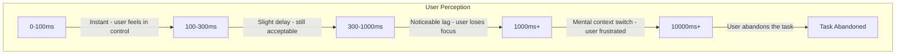
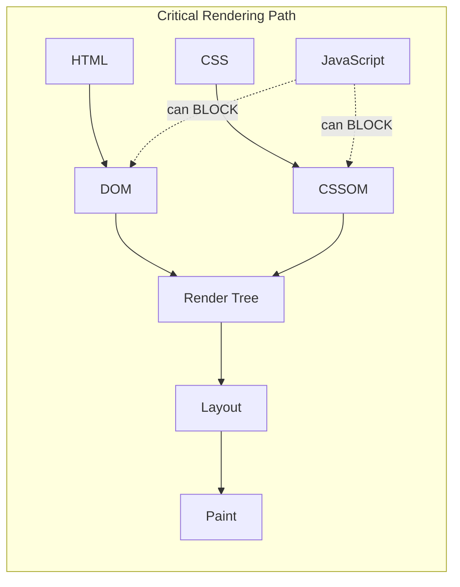
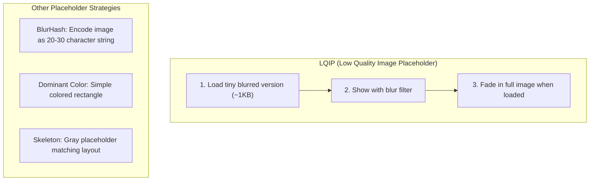
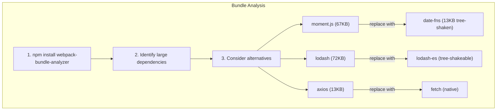
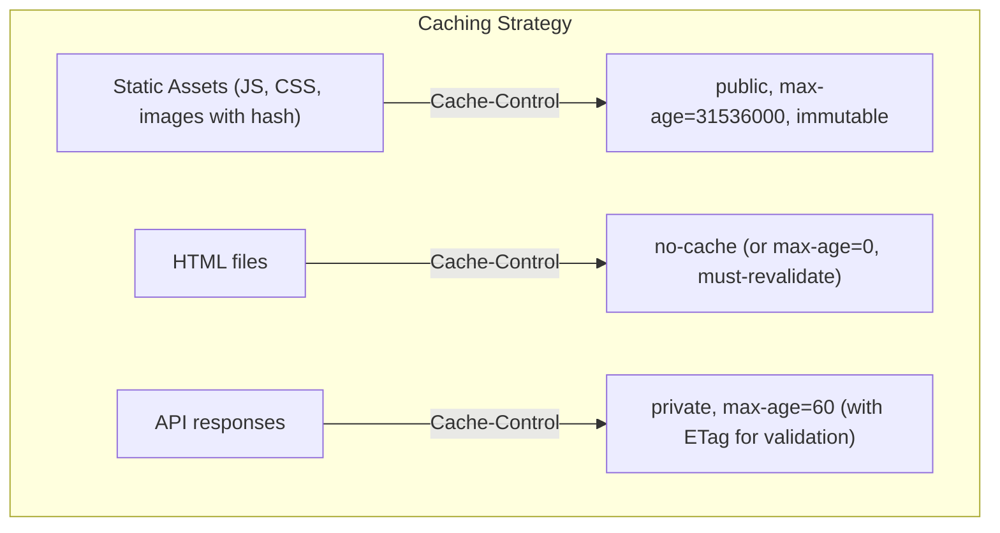
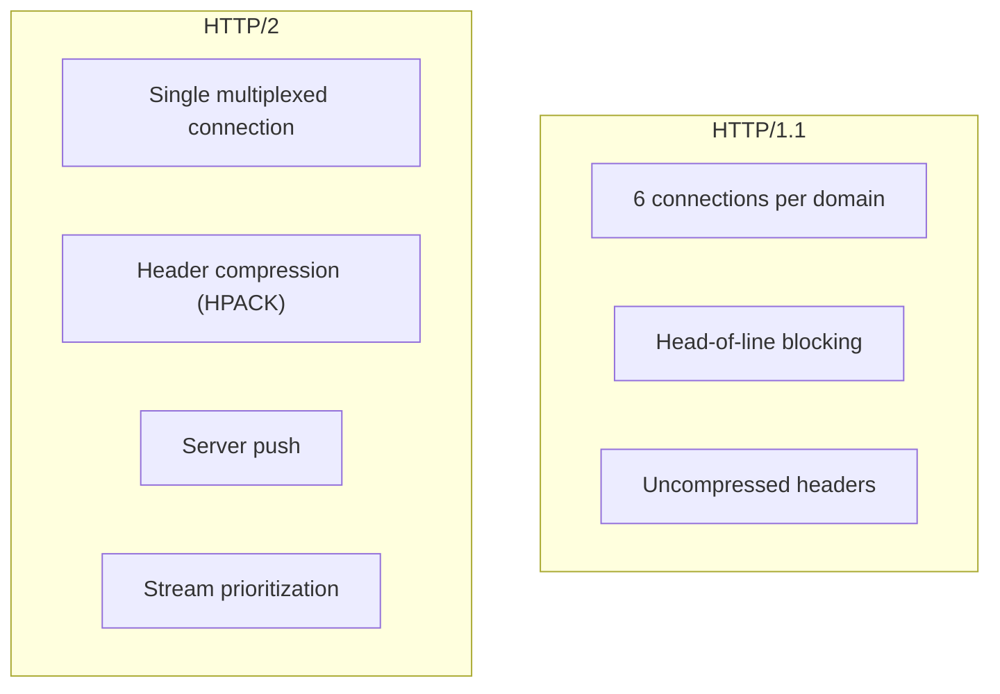
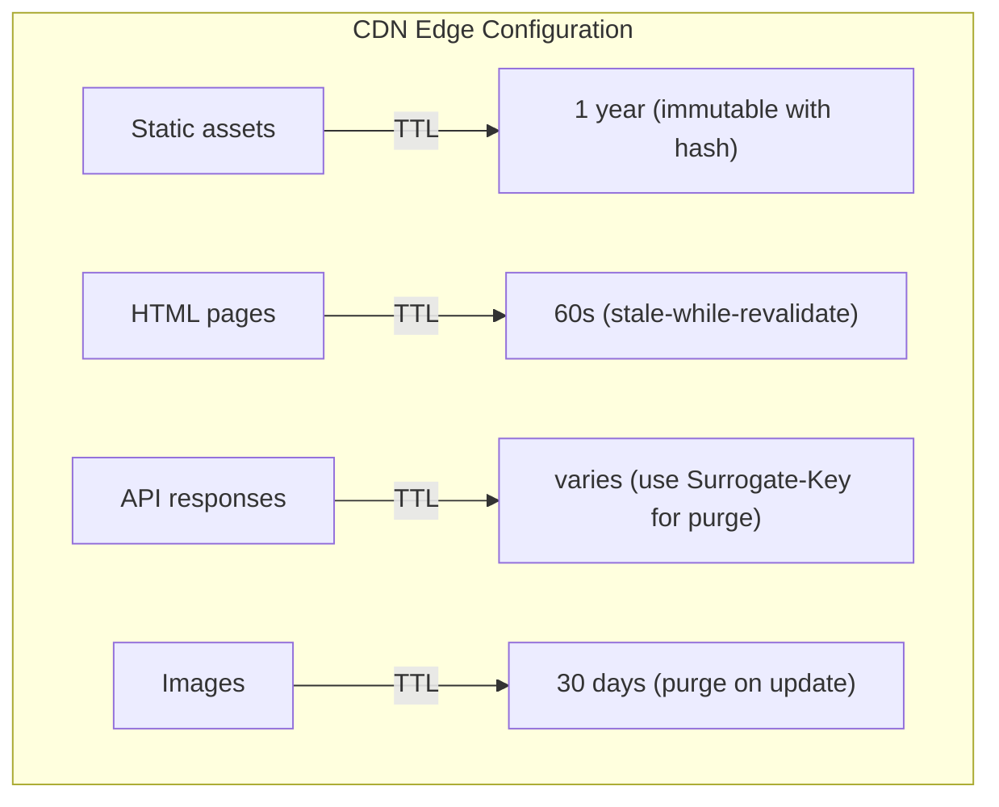
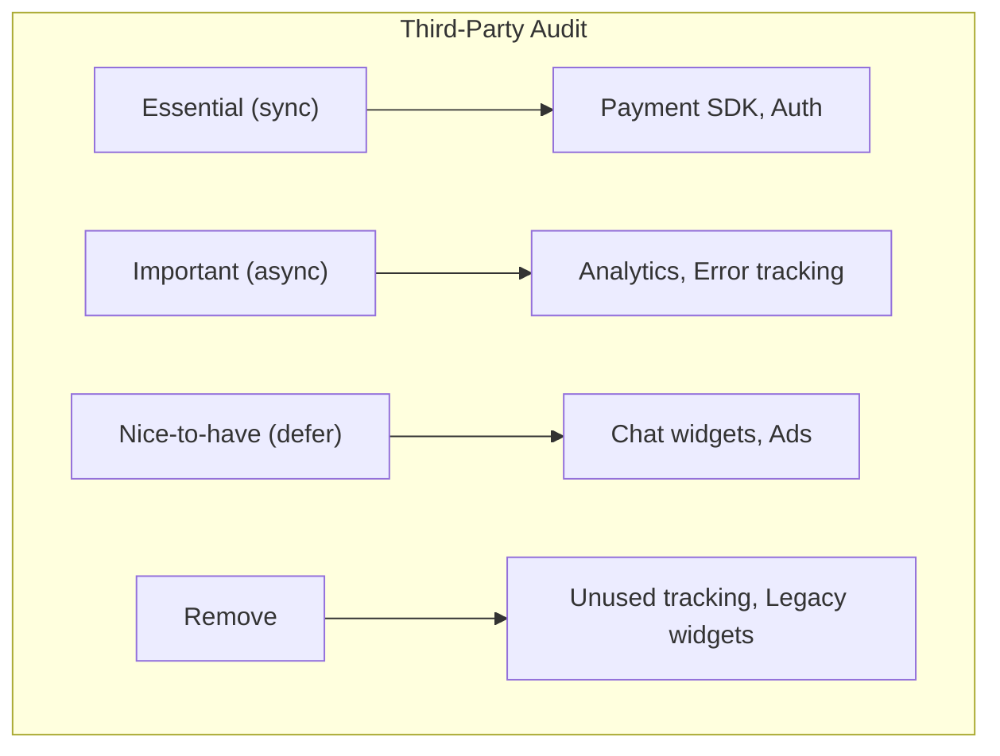

# Website Performance Optimization: A Senior Engineer's Guide

A comprehensive guide to web performance strategies for system design interviews.

---

## 1. The Performance Mental Model



### The Cost of Slow

| Metric | Business Impact |
|--------|-----------------|
| 100ms latency | 1% sales drop (Amazon) |
| 500ms delay | 20% traffic drop (Google) |
| 1s load time | 7% conversion drop |
| 3s+ load time | 53% mobile users abandon |

---

## 2. Critical Rendering Path (CRP)

The sequence of steps the browser takes to convert HTML, CSS, and JS into pixels.



### Optimizing the CRP

| Strategy | Implementation |
|----------|----------------|
| Minimize critical resources | Inline critical CSS, defer non-critical |
| Minimize critical bytes | Minify, compress, remove unused code |
| Minimize critical path length | Reduce round trips, use HTTP/2 |

### Critical CSS Extraction

```html
<head>
  <!-- Inline critical CSS (above-the-fold styles) -->
  <style>
    .header { ... }
    .hero { ... }
  </style>

  <!-- Load rest asynchronously -->
  <link rel="preload" href="styles.css" as="style" onload="this.rel='stylesheet'">
  <noscript><link rel="stylesheet" href="styles.css"></noscript>
</head>
```

---

## 3. Resource Loading Optimization

### Script Loading Strategies

```html
<!-- Blocks parsing (avoid) -->
<script src="app.js"></script>

<!-- Downloads parallel, executes immediately when ready -->
<script src="analytics.js" async></script>

<!-- Downloads parallel, executes after DOM ready, in order -->
<script src="main.js" defer></script>
```

| Attribute | Download | Execution | Use Case |
|-----------|----------|-----------|----------|
| None | Blocking | Immediate | Rarely needed |
| `async` | Parallel | When ready | Analytics, ads |
| `defer` | Parallel | After DOM, in order | App code |

### Resource Hints

```html
<!-- DNS lookup only (cheap) -->
<link rel="dns-prefetch" href="https://api.example.com">

<!-- Full connection setup (DNS + TCP + TLS) -->
<link rel="preconnect" href="https://fonts.googleapis.com">

<!-- Download critical resource NOW -->
<link rel="preload" href="hero.jpg" as="image">
<link rel="preload" href="critical.woff2" as="font" crossorigin>

<!-- Download for next page (low priority) -->
<link rel="prefetch" href="/next-page.js">
```

### Priority Hints (New)

```html
<!-- Raise priority of important image -->


<!-- Lower priority of below-fold image -->


<!-- Lower priority of non-critical script -->
<script src="analytics.js" fetchpriority="low"></script>
```

---

## 4. Image Optimization

Images account for ~50% of page weight on average.

### Modern Formats

| Format | Use Case | Savings vs JPEG |
|--------|----------|-----------------|
| **WebP** | General purpose | 25-35% smaller |
| **AVIF** | Best compression | 50% smaller |
| **SVG** | Icons, logos | Scalable, tiny |

### Responsive Images

```html
<!-- Art direction with picture -->
<picture>
  <source media="(min-width: 1200px)" srcset="hero-large.avif" type="image/avif">
  <source media="(min-width: 1200px)" srcset="hero-large.webp" type="image/webp">
  <source media="(min-width: 800px)" srcset="hero-medium.webp" type="image/webp">
  
</picture>

<!-- Resolution switching with srcset -->

```

### Lazy Loading

```html
<!-- Native lazy loading -->


<!-- Eager load above-fold images -->

```

### Placeholder Strategies



---

## 5. JavaScript Optimization

### Bundle Size Reduction



### Code Splitting

```js
// Route-based splitting
const Dashboard = lazy(() => import('./Dashboard'));
const Settings = lazy(() => import('./Settings'));

// Component-based splitting
const HeavyChart = lazy(() => import('./HeavyChart'));

// Library splitting
const { format } = await import('date-fns');
```

### Tree Shaking

```json
// package.json - Enable tree shaking
{
  "sideEffects": false
}

// Or specify files with side effects
{
  "sideEffects": ["*.css", "*.scss"]
}
```

### Minification & Compression

| Technique | What It Does | Savings |
|-----------|--------------|---------|
| Minification | Remove whitespace, shorten names | 30-50% |
| Gzip | Compress with dictionary | 60-80% |
| Brotli | Better compression | 15-20% smaller than Gzip |

---

## 6. CSS Optimization

### Remove Unused CSS

```bash
# PurgeCSS - Remove unused styles
npx purgecss --css styles.css --content index.html --output dist/
```

### Critical CSS Extraction

```js
// Use critters for automatic critical CSS
// webpack.config.js
const Critters = require('critters-webpack-plugin');

plugins: [
  new Critters({
    preload: 'swap',
    inlineThreshold: 0
  })
]
```

### CSS Containment

```css
/* Tell browser this component is independent */
.card {
  contain: layout style paint;
}

/* Full containment (most aggressive) */
.widget {
  contain: strict;
}
```

### content-visibility (Skip Rendering)

```css
/* Browser skips rendering until scrolled into view */
.below-fold-section {
  content-visibility: auto;
  contain-intrinsic-size: 500px; /* Estimated height */
}
```

---

## 7. Caching Strategy

### Cache Headers



### Service Worker Caching

```js
// Stale-While-Revalidate pattern
self.addEventListener('fetch', event => {
  event.respondWith(
    caches.open('v1').then(cache =>
      cache.match(event.request).then(cached => {
        const fetched = fetch(event.request).then(response => {
          cache.put(event.request, response.clone());
          return response;
        });
        return cached || fetched;
      })
    )
  );
});
```

---

## 8. Network Optimization

### HTTP/2 Benefits



### Reduce Round Trips

| Technique | Savings |
|-----------|---------|
| `preconnect` to API origin | 100-500ms (TCP + TLS) |
| Inline critical CSS/JS | 1 round trip |
| Use CDN (edge locations) | 50-200ms latency |
| HTTP/2 multiplexing | Eliminates connection overhead |

### CDN Configuration



---

## 9. Rendering Optimization

### Avoid Layout Thrashing

```js
// ❌ BAD - Forces multiple reflows
elements.forEach(el => {
  const height = el.offsetHeight;  // Read (forces reflow)
  el.style.height = height + 10 + 'px';  // Write
});

// ✅ GOOD - Batch reads, then batch writes
const heights = elements.map(el => el.offsetHeight);  // All reads
elements.forEach((el, i) => {
  el.style.height = heights[i] + 10 + 'px';  // All writes
});
```

### Use transform Instead of Layout Properties

```css
/* ❌ Triggers layout + paint */
.animate {
  left: 100px;
  top: 100px;
}

/* ✅ Only triggers composite (GPU) */
.animate {
  transform: translate(100px, 100px);
}
```

### will-change Hint

```css
/* Tell browser to prepare for animation */
.card:hover {
  will-change: transform;
}

.card.animating {
  transform: scale(1.1);
}

/* Remove after animation */
.card {
  will-change: auto;
}
```

---

## 10. Third-Party Scripts

Third-party scripts are often the biggest performance killers.

### Audit & Prioritize



### Loading Strategies

```html
<!-- Load after page is interactive -->
<script>
  window.addEventListener('load', () => {
    const script = document.createElement('script');
    script.src = 'https://chat-widget.com/widget.js';
    document.body.appendChild(script);
  });
</script>

<!-- Or use requestIdleCallback -->
<script>
  requestIdleCallback(() => {
    // Load non-critical third-party scripts
  });
</script>
```

### Facade Pattern

```jsx
// Don't load YouTube embed until user clicks
function YouTubeEmbed({ videoId }) {
  const [loaded, setLoaded] = useState(false);

  if (!loaded) {
    return (
      <div
        className="youtube-facade"
        onClick={() => setLoaded(true)}
        style={{ backgroundImage: `url(https://i.ytimg.com/vi/${videoId}/hqdefault.jpg)` }}
      >
        <button>▶ Play</button>
      </div>
    );
  }

  return <iframe src={`https://youtube.com/embed/${videoId}?autoplay=1`} />;
}
```

---

## 11. Monitoring & Measurement

### Real User Monitoring (RUM)

```js
// Collect navigation timing
const navigation = performance.getEntriesByType('navigation')[0];

const metrics = {
  ttfb: navigation.responseStart - navigation.requestStart,
  fcp: performance.getEntriesByName('first-contentful-paint')[0]?.startTime,
  domComplete: navigation.domComplete - navigation.startTime,
  loadComplete: navigation.loadEventEnd - navigation.startTime
};

// Send to analytics
navigator.sendBeacon('/analytics', JSON.stringify(metrics));
```

### Performance Budget

```json
// Example performance budget
{
  "budgets": [
    {
      "resourceType": "script",
      "budget": 300  // KB
    },
    {
      "resourceType": "total",
      "budget": 1000  // KB
    },
    {
      "metric": "first-contentful-paint",
      "budget": 1500  // ms
    },
    {
      "metric": "interactive",
      "budget": 3000  // ms
    }
  ]
}
```

---

## 12. Quick Reference Checklist

| Category | Optimization |
|----------|--------------|
| **HTML** | Minify, inline critical CSS, defer scripts |
| **CSS** | Remove unused, critical CSS, containment |
| **JavaScript** | Code split, tree shake, defer/async |
| **Images** | WebP/AVIF, lazy load, responsive, compression |
| **Fonts** | Preload, font-display: swap, subset |
| **Network** | HTTP/2, CDN, preconnect, compression |
| **Caching** | Long cache + fingerprinting, Service Worker |
| **Third-party** | Audit, defer, facade pattern |

---

## 13. Interview Tip

> "I approach web performance holistically. First, I establish a performance budget and set up monitoring to track Core Web Vitals in production. For the Critical Rendering Path, I inline critical CSS, defer non-essential JavaScript, and use resource hints for key origins. Images get the most attention—I serve WebP/AVIF with responsive srcset and lazy loading. For JavaScript, I code-split by route, tree-shake dependencies, and audit bundle size regularly. Third-party scripts are loaded after the page is interactive or behind facades. The key is measuring real user metrics, not just lab scores—Chrome DevTools is for debugging, but RUM tells the true story."
