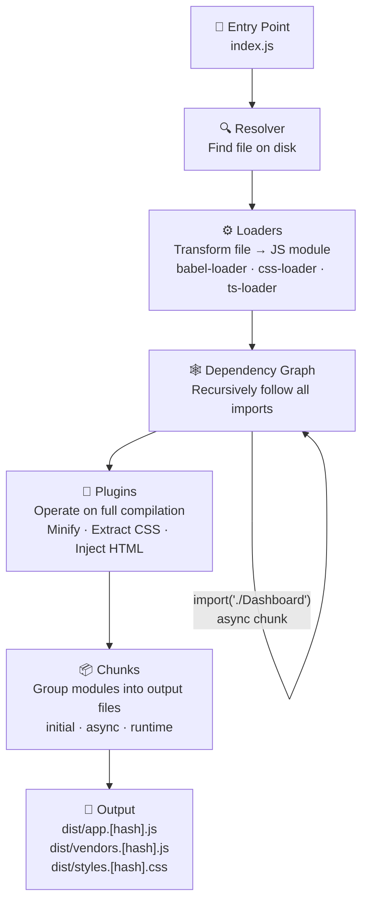
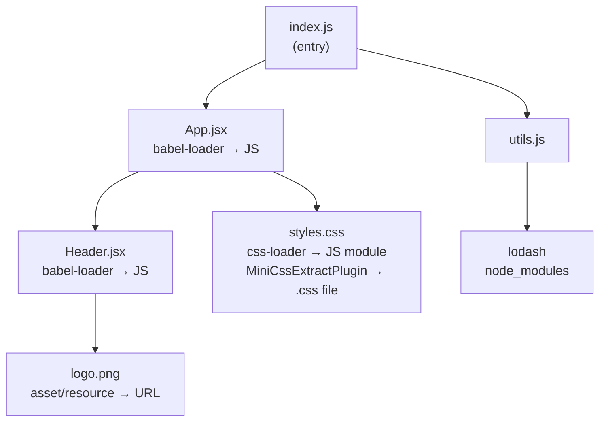
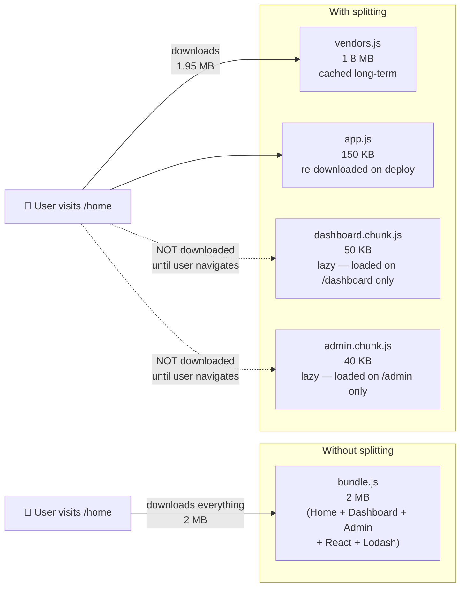
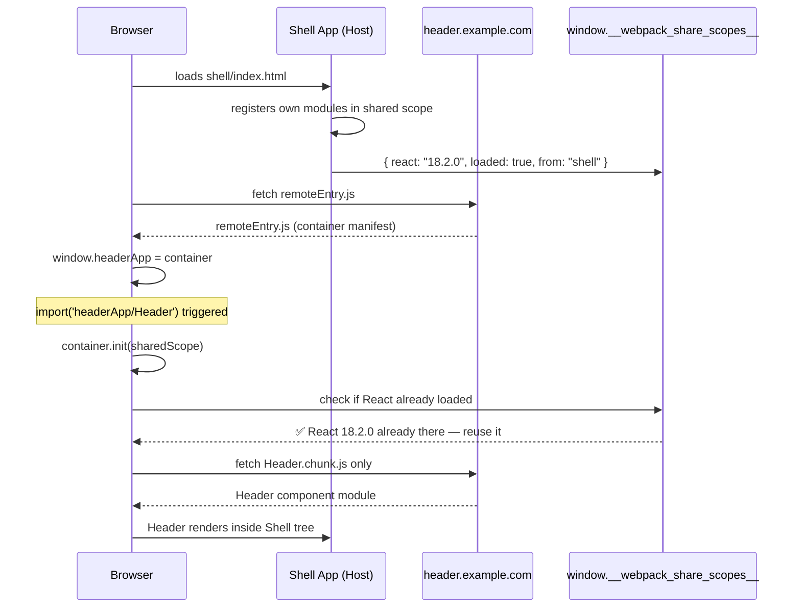
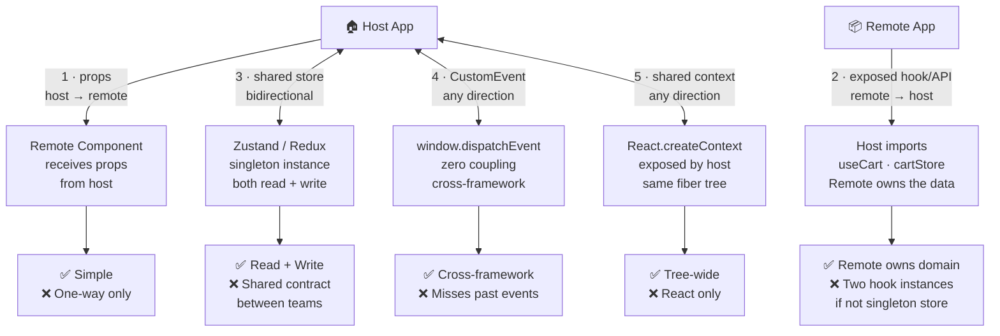

# Webpack — Interview Reference

---

## What is Webpack?

Webpack is a **static module bundler** for JavaScript applications. It takes your source files — JS, CSS, images, fonts — and bundles them into optimized output files the browser can load.

> **One-liner:** Webpack walks your dependency graph, transforms every file type it encounters (via loaders), and emits optimized bundles (via plugins).

---

## Why Do We Need It?

### The Real Root Problem: Browsers Have No Module System

Before ES Modules (ES2015), the browser had **one shared global scope** for all JavaScript. Every `<script>` tag dumped its variables into `window`.

```html
<!-- All three files share window — one global scope -->
<script src="utils.js"></script>    <!-- defines window.helper -->
<script src="lodash.js"></script>   <!-- also defines window._ -->
<script src="app.js"></script>      <!-- must load last or it breaks -->
```

**What this means in practice:**

```js
// utils.js
var data = [];          // window.data — global

// vendor.js (some third-party lib)
var data = 'config';   // window.data — OVERWRITTEN silently

// app.js
console.log(data);     // 'config' — not what you expected
```

- Any script can overwrite any other script's variables — **silent collisions**
- Load order is a runtime contract you must manually maintain
- No way to say "this function belongs to this file only"

**The pre-webpack workaround: IIFE (Immediately Invoked Function Expression)**

```js
// Each file wraps itself in a function to create a private scope
(function() {
  var data = [];   // scoped to this function, NOT window
  window.MyApp = { data };  // expose only what you want to
})();
```

Works but: verbose, manual, no dependency tracking, still relies on load order.

**CommonJS (Node.js) solved this on the server:**

```js
// Node modules have their own scope — no global leak
const data = require('./data');  // isolated
module.exports = { doSomething };
```

But browsers couldn't run `require()` — it's synchronous and browsers load files over the network (async).

**Webpack bridges this gap:**

Webpack brings the CommonJS/ESM module system to the browser. It takes your `import`/`require` calls, resolves the full dependency graph at build time, and emits a single bundle where **each module is wrapped in its own function scope** — no global leaks.

```js
// What you write
import { add } from './math';
export const result = add(1, 2);

// What webpack emits (simplified)
(function(modules) {
  function __webpack_require__(moduleId) {
    var module = { exports: {} };
    modules[moduleId](module, module.exports, __webpack_require__);
    return module.exports;
  }
  __webpack_require__(0); // start from entry
})({
  0: function(module, exports, require) {
    // your index.js — isolated scope
    var math = require(1);
    exports.result = math.add(1, 2);
  },
  1: function(module, exports, require) {
    // your math.js — isolated scope
    exports.add = function(a, b) { return a + b; };
  }
});
```

Each module is a function. Its variables are local to that function. **Zero global scope pollution.** This is what webpack actually compiles your code into.

**What webpack solves:**

| Problem | Webpack solution |
|---|---|
| Global scope collisions | Each module wrapped in its own function scope |
| 50 HTTP requests | Bundle all JS into 1–3 files |
| `require()` in browser | Webpack's runtime implements `__webpack_require__` |
| Non-JS assets (CSS, images) | Loaders transform anything into a module |
| Send only what's needed | Code splitting + lazy loading |
| Unused code in bundle | Tree shaking removes dead code |
| Dev feedback speed | Hot Module Replacement (HMR) |

> **Why not just use native ES Modules in the browser?**
> You can — modern browsers support `<script type="module">`. But: no tree shaking, no code splitting control, no loader pipeline for CSS/images, no HMR, and hundreds of individual network requests in development. Webpack (or Vite) still wins for production apps.

---

## Core Concepts

### 1. Entry

The starting point — webpack builds the dependency graph from here.

```js
entry: './src/index.js'
// or multiple entries
entry: { app: './src/app.js', admin: './src/admin.js' }
```

### 2. Output

Where and how to emit the bundled files.

```js
output: {
  filename: '[name].[contenthash].js',  // cache busting
  path: path.resolve(__dirname, 'dist')
}
```

### 3. Loaders

Webpack only understands JS and JSON by default. **Loaders transform other file types into modules.**

```js
module: {
  rules: [
    { test: /\.jsx?$/, use: 'babel-loader' },   // JSX → JS
    { test: /\.css$/, use: ['style-loader', 'css-loader'] },
    { test: /\.png$/, type: 'asset/resource' }  // images
  ]
}
```

> Loaders run **right to left** in the `use` array — `css-loader` first (resolves imports), then `style-loader` (injects into DOM).

### 4. Plugins

Plugins operate on the **output bundle** — more powerful than loaders.

```js
plugins: [
  new HtmlWebpackPlugin({ template: './index.html' }),  // injects <script> tags
  new MiniCssExtractPlugin({ filename: '[name].css' }), // extracts CSS to file
  new DefinePlugin({ 'process.env.NODE_ENV': '"production"' })
]
```

### 5. Mode

```js
mode: 'development' | 'production' | 'none'
```

| Mode | What it does |
|---|---|
| `development` | Source maps, readable output, HMR enabled |
| `production` | Minification, tree shaking, scope hoisting, content hash |

---

## How Webpack Works — Internally



**Dependency graph example:**



Everything is a module — CSS, images, fonts. Webpack handles them all through loaders.

---

## Chunks & Code Splitting

A **chunk** is a group of modules that get emitted as a single output file.

### Types of Chunks

| Chunk type | Description |
|---|---|
| **Initial chunk** | The main bundle loaded on page start |
| **Async chunk** | Lazy-loaded chunk created by dynamic `import()` |
| **Runtime chunk** | Webpack's internal module loading logic |

### Why Code Splitting?

Without it, 1 giant bundle → user downloads all code upfront even for pages they never visit.



### Dynamic Import (lazy loading)

```js
// Loaded only when user navigates to /dashboard
const Dashboard = React.lazy(() => import('./Dashboard'));
```

Webpack sees `import()` and creates a **separate async chunk** — loaded on demand.

### SplitChunksPlugin (vendor splitting)

```js
optimization: {
  splitChunks: {
    chunks: 'all',         // split async AND initial chunks
    cacheGroups: {
      vendor: {
        test: /node_modules/,
        name: 'vendors',   // react, lodash → vendors.js (cached separately)
      }
    }
  }
}
```

**Why split vendors?** Your app code changes on every deploy. `node_modules` rarely change. Separate chunks → `vendors.js` stays cached in the browser even after app updates.

```
Without splitting:   bundle.js (2MB)  → all users re-download 2MB every deploy
With splitting:      app.js (200KB)   → re-downloaded on deploy
                     vendors.js (1.8MB) → cached long-term (no change)
```

---

## Styles

Three ways to handle CSS:

### 1. style-loader + css-loader (development)

```js
{ test: /\.css$/, use: ['style-loader', 'css-loader'] }
```

- `css-loader`: resolves `@import` and `url()`, converts CSS to JS module
- `style-loader`: injects `<style>` tag into DOM at runtime

**Problem:** CSS is bundled inside JS → flash of unstyled content; no browser caching for CSS separately.

### 2. MiniCssExtractPlugin (production)

```js
{ test: /\.css$/, use: [MiniCssExtractPlugin.loader, 'css-loader'] }
```

Extracts CSS into separate `.css` files → loaded in parallel with JS, browser-cached independently.

### 3. CSS Modules

```js
{ test: /\.css$/, use: ['style-loader', { loader: 'css-loader', options: { modules: true } }] }
```

Locally scoped class names — `styles.button` becomes `_src_Button_button_abc123` — zero global conflicts.

---

## Tree Shaking

Removes **dead code** (exported but never imported) from the final bundle.

```js
// utils.js
export const add = (a, b) => a + b;
export const subtract = (a, b) => a - b; // never used anywhere

// app.js
import { add } from './utils';  // only 'add' imported
```

Webpack in production mode: `subtract` is never imported → **eliminated from bundle**.

**Requirements for tree shaking:**
- ES Modules (`import`/`export`) — NOT CommonJS (`require`)
- `"sideEffects": false` in `package.json` (or list files with side effects)
- `mode: 'production'`

---

## Module Federation

> **Problem it solves:** You have 5 micro-frontends, each a separate webpack build. How do they share React without bundling it 5 times? How can App A expose a `<Header>` component that App B consumes at runtime — without rebuilding either?

Module Federation allows **separate webpack builds to share modules at runtime** — across different deployments.

### Key concepts

| Term | Meaning |
|---|---|
| **Host** | The app that consumes remote modules |
| **Remote** | The app that exposes modules for others to consume |
| **Shared** | Libraries loaded only once (e.g. React, ReactDOM) |
| **Exposes** | What the remote makes available |

### Example

```js
// Remote app (header-app/webpack.config.js)
new ModuleFederationPlugin({
  name: 'headerApp',
  filename: 'remoteEntry.js',       // manifest file — loaded by hosts
  exposes: {
    './Header': './src/Header.jsx', // what we share
  },
  shared: { react: { singleton: true }, 'react-dom': { singleton: true } }
})

// Host app (shell/webpack.config.js)
new ModuleFederationPlugin({
  name: 'shell',
  remotes: {
    headerApp: 'headerApp@https://header.example.com/remoteEntry.js'
  },
  shared: { react: { singleton: true }, 'react-dom': { singleton: true } }
})

// Usage in host
const Header = React.lazy(() => import('headerApp/Header'));
```

**What happens at runtime:**
1. Host loads `remoteEntry.js` from the remote's URL
2. Remote's module map is registered in the browser
3. `import('headerApp/Header')` fetches only that component's chunk
4. React is shared — loaded once, not duplicated across all apps

**Why it matters:**
- Independent deployments — header team deploys without rebuilding shell
- Shared dependencies — React loaded once across all micro-frontends
- Runtime composition — apps can even load different versions of a remote

### The Global Scope Trick — How Module Federation Actually Works

> This is the tricky part interviewers love. Module Federation deliberately uses the browser's global scope to coordinate between independently built apps.

Webpack normally fights against global scope (wraps everything in module functions). But for Module Federation to work across separately deployed apps, it **intentionally uses `window` (globalThis) as a shared registry**.

**Step 1 — Remote registers itself on `window`:**

When the browser loads `remoteEntry.js`, webpack executes:

```js
// remoteEntry.js (auto-generated by webpack)
var headerApp;          // will be assigned to window.headerApp
// ...
self["headerApp"] = __webpack_expose_module__(/* module map */);
```

So `window.headerApp` is now a **container object** with two methods:
- `window.headerApp.init(sharedScope)` — initializes shared modules
- `window.headerApp.get('./Header')` — returns a factory for the Header module

**Step 2 — Host accesses it via the global:**

```js
// Host runtime (simplified)
const container = window['headerApp'];  // global lookup
await container.init(__webpack_share_scopes__.default);
const factory = await container.get('./Header');
const Header = factory();  // actual React component
```

`import('headerApp/Header')` in your code is syntax sugar — webpack compiles it into this global lookup under the hood.

**Step 3 — Shared scope coordinates React (avoiding duplicates):**

```js
// window.__webpack_share_scopes__.default — another global!
{
  "react": {
    "18.2.0": {
      get: () => Promise.resolve(() => require('react')),
      loaded: true,
      from: 'shell'   // which app loaded it first
    }
  }
}
```

When the remote tries to load React, it checks `__webpack_share_scopes__` first. React is already there (loaded by the host) → **reuses it**. This is how one React instance is shared across 5 micro-frontend apps.

**Why this is the trick:**

```
Normal webpack:    window pollution = BAD (modules wrapped in functions)
Module Federation: window pollution = DELIBERATE (cross-app coordination)
```

MF has no choice — two separately built, separately deployed apps have no other shared channel except the browser's global scope. There's no import statement that works across deployment boundaries at runtime. The global registry IS the communication protocol.

**What can go wrong:**
- `window.headerApp` is undefined → `remoteEntry.js` didn't load (network failure, wrong URL)
- React version mismatch → if `singleton: true` is not set, both apps load their own React → hooks break (React requires exactly one instance)
- Init order race → host must `await container.init()` before calling `container.get()` — if you skip the await, you get "cannot read property of undefined"



---

## Passing Data: Host → Remote (Module Federation)

> This is a common interview follow-up: "You've loaded a remote component — how do you pass data to it?"

Module Federation loads remote components lazily at runtime. They are still React components — but the trick is they live in a **different webpack scope** (different build, different `__webpack_require__`). Data passing strategies ranked by use case:

### Strategy 1 — Props (simplest, most natural)

The remote just exposes a React component. The host passes props like any other component.

```jsx
// Remote exposes a normal component
// header-app/src/Header.jsx
export default function Header({ user, onLogout }) {
  return <div>Hello {user.name} <button onClick={onLogout}>Logout</button></div>;
}

// Host uses it with props
const Header = React.lazy(() => import('headerApp/Header'));

function Shell({ user }) {
  return <Header user={user} onLogout={() => logout()} />;
}
```

Works perfectly. The component boundary is normal React — props flow as usual. The webpack complexity is invisible at this level.

**Limitation:** Props only flow down. Remote can't push data back up without callbacks. Fine for display components, limiting for complex state.

---

### Strategy 2 — Exposed API / Hook (remote → host)

The **reverse of props**. Instead of the host pushing data down, the remote exposes its own hooks, functions, or store actions — and the host imports and uses them directly. The remote owns the data; the host just pulls from it.

```js
// cart-app/webpack.config.js — remote exposes its own API surface
new ModuleFederationPlugin({
  name: 'cartApp',
  exposes: {
    './useCart':   './src/hooks/useCart',    // hook
    './cartStore': './src/store/cartStore',  // store actions
  }
})

// cart-app/src/hooks/useCart.js — remote owns this data
export function useCart() {
  const [items, setItems] = useState([]);
  const addItem   = (item) => setItems(prev => [...prev, item]);
  const removeItem = (id)  => setItems(prev => prev.filter(i => i.id !== id));
  return { items, count: items.length, addItem, removeItem };
}
```

```js
// Host imports and uses the remote's hook — host never manages cart state
import { useCart } from 'cartApp/useCart';

function ShellHeader() {
  const { count } = useCart(); // remote owns the data, host just reads
  return <Badge count={count} />;
}

function ProductPage({ productId }) {
  const { addItem } = useCart(); // host calls remote's action
  return <button onClick={() => addItem({ id: productId })}>Add to cart</button>;
}
```

**Why this is genuinely different from props:**
- Data direction is **remote → host** (props is host → remote)
- Remote is the **source of truth** for this domain — host doesn't even hold the state
- Works for **cross-remote** too — Remote A can import Remote B's hook with no host involvement
- Remote team fully owns the API contract; host team just consumes it

**Limitation:** Both apps must share the same React instance (`singleton: true`) for hooks to work. Also, the hook runs in the host's React tree — if the same hook is imported in two places, two separate state instances are created (not one shared cart). Fix: expose a store (Zustand/Redux) instead of a raw hook if shared singleton state is needed.

**Best for:** Feature-team ownership — cart team owns cart state and exposes a clean API; shell team consumes it without caring about implementation.

---

### Strategy 3 — Shared Store (Redux / Zustand via shared modules)

Both host and remote depend on the same state library. You declare it as a **shared singleton** in Module Federation config. Both apps use the exact same store instance at runtime.

```js
// Both host and remote webpack.config.js
new ModuleFederationPlugin({
  shared: {
    'zustand': { singleton: true, requiredVersion: '^4.0.0' },
    './src/store': { singleton: true }  // share the store module itself
  }
})
```

```js
// Remote reads from the shared store directly
import { useStore } from 'zustand';
import { useAppStore } from 'hostApp/store'; // or a shared package

function RemoteCart() {
  const user = useAppStore(state => state.user); // same store the host writes to
  return <div>{user.name}'s cart</div>;
}
```

**Why singleton matters:** Without `singleton: true`, host loads Zustand 4.1, remote loads Zustand 4.2 — two different instances — store reads return nothing. `singleton: true` forces one version to win and both apps use it.

**Best for:** Deeply integrated micro-frontends where the remote genuinely needs global app state (auth, cart, theme).

---

### Strategy 4 — Custom Events (decoupled, cross-framework)

Host and remote communicate through the browser's native `CustomEvent` API on `window`. Zero coupling — works even if remote is Vue and host is React.

```js
// Host dispatches an event when user logs in
window.dispatchEvent(new CustomEvent('app:user-changed', {
  detail: { user: { id: 1, name: 'Alice', role: 'admin' } }
}));

// Remote listens — doesn't know or care who the host is
useEffect(() => {
  const handler = (e) => setUser(e.detail.user);
  window.addEventListener('app:user-changed', handler);
  return () => window.removeEventListener('app:user-changed', handler);
}, []);
```

**Best for:** Loosely coupled apps from different teams, cross-framework communication, fire-and-forget events (user logged out, theme changed, language switched).

**Limitation:** No history — remote mounted after the event fires misses it. Fix: host also writes to `window.__APP_STATE__` as a fallback initial read.

---

### Strategy 5 — Shared Context (React-specific, elegant)

Host exposes a React Context provider as a shared module. Remote consumes it. Both use the same React instance (enforced by `singleton: true`) so context propagates normally.

```js
// host-app/src/UserContext.js (exposed via MF)
export const UserContext = React.createContext(null);
export const UserProvider = ({ children }) => {
  const [user, setUser] = useState(null);
  return <UserContext.Provider value={{ user, setUser }}>{children}</UserContext.Provider>;
};

// host webpack.config.js
exposes: { './UserContext': './src/UserContext' }

// Remote consumes it
import { UserContext } from 'hostApp/UserContext';
const { user } = useContext(UserContext);
```

**Why this works:** Context lives in React's internal fiber tree, not in a module variable. As long as both apps use the same React instance (`singleton: true`), context crosses the module federation boundary transparently.

**Best for:** Auth context, theme context, feature flags — any tree-wide data the host owns that remotes need to read.

---

### Which Pattern When?

| # | Pattern | Direction | Use when | Avoid when |
|---|---|---|---|---|
| 1 | Props | host → remote | Remote is a display component | Remote needs to push data back up |
| 2 | Exposed API / Hook | remote → host | Remote owns the domain (cart, auth) | Hook creates two instances — use store instead |
| 3 | Shared Store | bidirectional | Deep integration, remote needs read+write | Teams shouldn't share state contracts |
| 4 | Custom Events | any direction | Cross-framework, loosely coupled teams | You need synchronous read of current state |
| 5 | Shared Context | any direction | React-only, tree-wide data (auth, theme) | Remote is not React |



---

## Content Hashing & Caching

```js
output: {
  filename: '[name].[contenthash].js'
}
```

- `[contenthash]` changes only when file content changes
- `app.abc123.js` → unchanged → browser uses cache
- `app.def456.js` → content changed → browser re-downloads

Without content hash: every deploy invalidates all caches even if only one file changed.

---

## HMR — Hot Module Replacement

In development, webpack watches for file changes and pushes only the changed module to the browser — without a full page reload.

```
File saved → webpack recompiles changed module →
  WebSocket push to browser → module swapped in memory →
  React state preserved
```

vs. Live Reload: changes any file → full browser refresh → state lost.

---

## Other Important Concepts

### `resolve.alias` — Path Shortcuts

Tired of `../../components/Button`? Alias maps a short name to a path.

```js
resolve: {
  alias: {
    '@components': path.resolve(__dirname, 'src/components'),
    '@utils':      path.resolve(__dirname, 'src/utils'),
  }
}

// Now in any file:
import Button from '@components/Button'; // instead of '../../components/Button'
```

Also configure `resolve.extensions` so you can skip file extensions:
```js
resolve: { extensions: ['.tsx', '.ts', '.jsx', '.js'] }
// import App from './App'  → webpack tries App.tsx, App.ts, App.jsx, App.js
```

---

### `publicPath` — Where Assets Are Served From

Tells webpack the base URL prefix for all asset URLs in the output.

```js
output: {
  publicPath: 'https://cdn.example.com/assets/'
}
// → <script src="https://cdn.example.com/assets/app.abc123.js">
// → background: url('https://cdn.example.com/assets/logo.png')
```

If you deploy to a sub-path: `publicPath: '/my-app/'`. If wrong, lazy-loaded chunks 404 because the browser requests `/chunk.js` instead of `/my-app/chunk.js`. **Module Federation also uses `publicPath`** to build the URL for `remoteEntry.js` — critical to get right.

---

### `devServer` — Local Development

```js
devServer: {
  port: 3000,
  hot: true,              // HMR
  historyApiFallback: true, // SPA: serve index.html for all 404 routes
  proxy: {
    '/api': 'http://localhost:8080'  // proxy API calls to backend
  }
}
```

`historyApiFallback` is critical for React Router — without it, refreshing `/dashboard` returns a 404 because there's no actual file at that path.

---

### Source Maps — Debugging Minified Code

Minified production code is unreadable. Source maps link minified output back to original source.

```js
devtool: 'eval-cheap-module-source-map'  // fast, development only
devtool: 'source-map'                    // separate .map file, production-safe
devtool: false                           // no source maps (fastest build)
```

| `devtool` value | Speed | Use case |
|---|---|---|
| `eval` | Fastest | Dev only, no column info |
| `eval-cheap-module-source-map` | Fast | Dev — good quality, recommended |
| `source-map` | Slow | Production — full, separate `.map` file |
| `hidden-source-map` | Slow | Production — map not linked in bundle (upload to Sentry only) |

`hidden-source-map` is the production best practice: you upload the `.map` to your error tracker (Sentry) but it's never exposed to users in the browser.

---

### Environment Variables

```js
// webpack.config.js
new webpack.DefinePlugin({
  'process.env.API_URL': JSON.stringify(process.env.API_URL),
  'process.env.NODE_ENV': JSON.stringify('production'),
})
```

`DefinePlugin` does **text replacement at build time** — not runtime injection. `process.env.API_URL` in source code is literally replaced with the string value during compilation. Dead code elimination then removes `if (process.env.NODE_ENV === 'development') { ... }` blocks entirely in production.

```js
// Source code
if (process.env.NODE_ENV === 'development') {
  console.log('debug info');  // ← removed entirely in production build
}
```

---

### Webpack 5 Persistent Cache

Build times in large projects can exceed 60 seconds. Webpack 5 introduced filesystem caching — stores the compilation result to disk between builds.

```js
cache: {
  type: 'filesystem',          // persist to disk (vs 'memory' — default)
  buildDependencies: {
    config: [__filename],      // invalidate cache if webpack.config.js changes
  }
}
```

- First build: normal speed (populates cache)
- Subsequent builds: **5–10× faster** — only changed modules are recompiled
- Cache stored in `node_modules/.cache/webpack`

---

### Asset Modules (Webpack 5) — No More url-loader / file-loader

Webpack 5 handles static assets natively without extra loaders.

```js
module: {
  rules: [
    {
      test: /\.(png|jpg|gif|svg)$/,
      type: 'asset',           // auto: inline if <8KB, emit file if >8KB
    },
    {
      test: /\.svg$/,
      type: 'asset/inline',   // always base64 inline (no HTTP request)
    },
    {
      test: /\.(woff2|ttf)$/,
      type: 'asset/resource', // always emit as separate file
    }
  ]
}
```

| Asset type | Behavior |
|---|---|
| `asset/resource` | Emits file, returns URL |
| `asset/inline` | Base64-encodes into bundle (no extra request) |
| `asset/source` | Returns file content as string |
| `asset` | Auto-decides: inline if under `parser.dataUrlCondition.maxSize` |

---

## Webpack vs Alternatives

| Tool | Approach | Best for |
|---|---|---|
| **Webpack** | Full bundler, highly configurable | Large apps, micro-frontends, complex pipelines |
| **Vite** | ESM dev server (no bundle in dev), Rollup for prod | Fast DX, modern projects |
| **Rollup** | Optimized for libraries | Publishing npm packages |
| **esbuild** | Go-based, extremely fast | CI speed, used inside Vite |
| **Parcel** | Zero-config bundler | Small/medium apps |

> Webpack is the most configurable and battle-tested. Vite is winning for new projects due to near-instant dev server. In large enterprises with module federation requirements, webpack remains dominant.

---

## Interview Summary

### One-liner definitions

| Concept | Say this |
|---|---|
| Webpack | "A static module bundler that builds a dependency graph from an entry point and emits optimized chunks via loaders and plugins." |
| Loader | "Transforms a non-JS file type into a JS module webpack can process." |
| Plugin | "Hooks into the compilation lifecycle to perform operations on the output bundle — minification, extraction, injection." |
| Chunk | "A group of modules emitted as a single output file — can be initial (loaded on start) or async (lazy-loaded on demand)." |
| Tree shaking | "Dead code elimination for ES modules — unused exports are removed at build time in production mode." |
| Module Federation | "Allows separate webpack builds to expose and consume modules from each other at runtime — enables true independent micro-frontend deployments." |

### Key talking points

1. "Webpack solves the N-HTTP-requests problem by building a dependency graph and bundling everything. But the real power is code splitting — you only send what the user needs for the current page."

2. "Loaders and plugins are often confused. Loaders transform individual files before they enter the graph. Plugins operate on the entire compilation — they can split chunks, extract CSS, inject HTML, anything."

3. "Tree shaking only works with ES modules because they're statically analyzable. CommonJS `require()` is dynamic — webpack can't know at build time which exports are used."

4. "The vendor split trick is critical for caching. App code changes every deploy, `node_modules` rarely do. Separate chunks = vendors stay cached, only app re-downloads."

5. "Module federation is the webpack answer to micro-frontends. Instead of each app bundling React separately, they share it at runtime. The host loads a `remoteEntry.js` manifest and pulls modules from other deployed apps on demand."

6. "MF deliberately uses `window` as a shared registry — `window.headerApp` is the container. This is the one place webpack intentionally pollutes global scope, because there's no other communication channel between separately deployed builds at runtime."

7. "Data passing in MF has five patterns. Props (host → remote) and Exposed API/Hook (remote → host) are the two direct module patterns — mirror images of each other. Then Shared Store (bidirectional, deep integration), Custom Events (decoupled, cross-framework), and Shared Context (React tree-wide). The key insight with Exposed API: the remote owns the domain data and exposes a clean hook or store — the host just consumes it without holding any of that state itself."

8. "Source maps in production should be `hidden-source-map` — the `.map` file is generated and uploaded to an error tracker like Sentry, but never linked in the bundle. Users can't read your source. Your engineers can debug stack traces."

9. "Webpack 5 persistent cache (`cache: { type: 'filesystem' }`) makes repeat builds 5–10× faster. It's a one-liner that most teams don't know about but should always use in CI."
