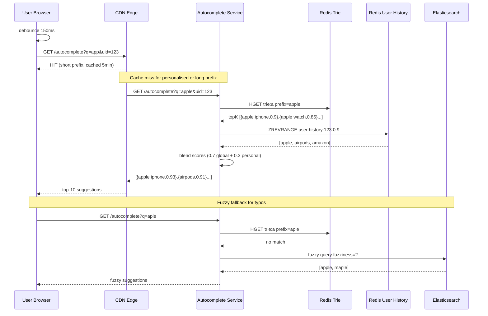
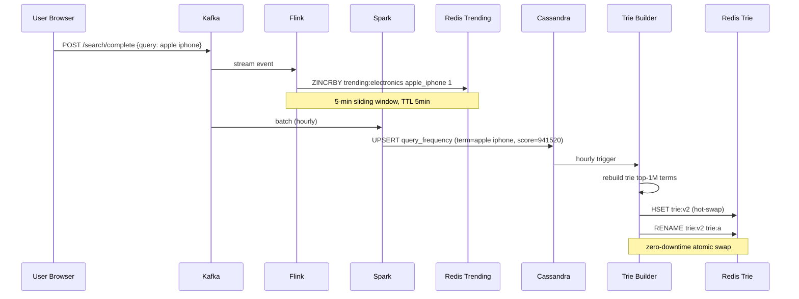
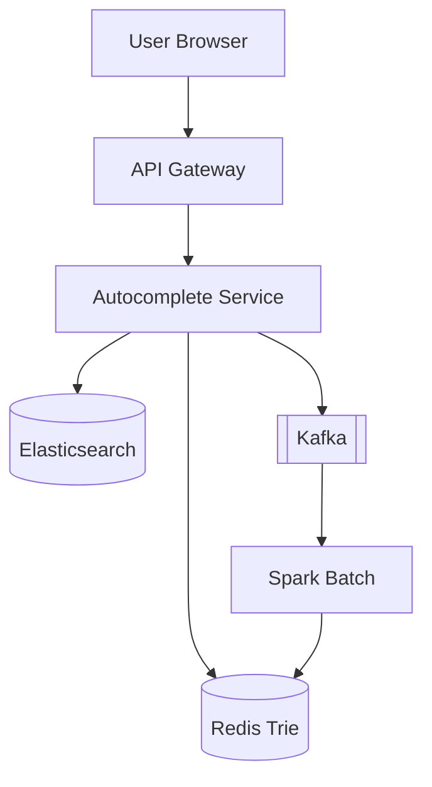
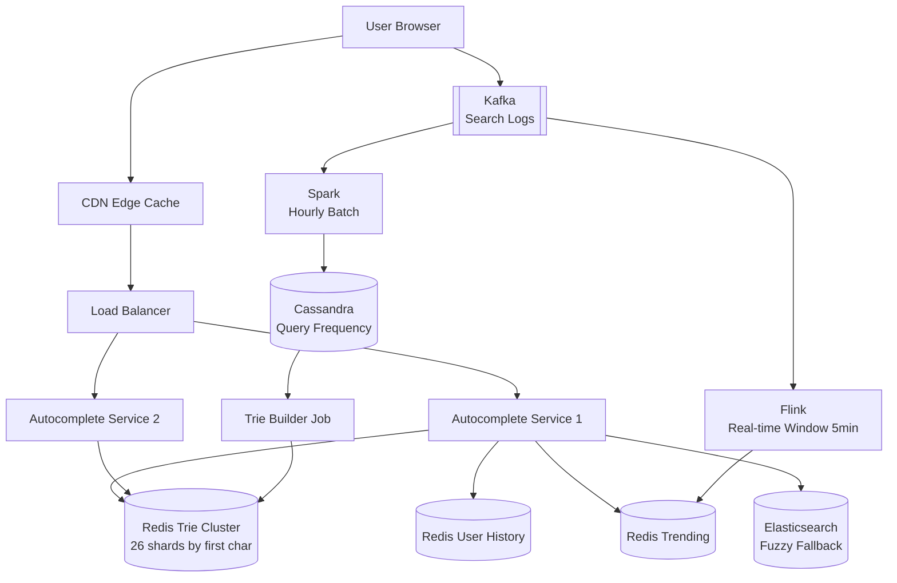

# Search Autocomplete / Typeahead System Design

---

## 1. Problem + Scope

Design a search autocomplete system (Google-scale) that returns top-K query suggestions as the user types, ranked by relevance, recency, and personalization.

> **Core problem:** Return the right top-10 suggestions for any prefix in under 100ms at 700K QPS — every keystroke is a request. The only way to achieve this is **precomputation**. You do not compute suggestions at query time. You precompute them at write time and look them up in O(1).

> **Autocomplete ≠ Search.** Search handles complex queries with heavy computation. Autocomplete is prefix-based, precomputed, and ultra-fast. They are fundamentally different systems sharing only the search box.

**In scope:** Prefix-based suggestions, frequency-weighted ranking, personalization, trending queries, typo tolerance.
**Out of scope:** Full-text search results pages, spell correction as a standalone product, query understanding / NLU.

---

## 2. Assumptions & Scale

| Signal | Number |
|---|---|
| DAU | 500M |
| Searches/user/day | 10 |
| Total searches/day | 5B |
| Avg keystrokes before submit | 4 |
| Autocomplete requests/day | 20B |
| Peak QPS (3× avg) | ~700K QPS |
| Read:Write ratio | 100:1 |
| Unique query terms in trie | Top 1M (covers 95% traffic — Zipf distribution) |
| Trie memory per shard | ~230MB (fits in Redis, 26 shards by first char) |
| Query log storage | 5B × 50 bytes = 250 GB/day (Kafka, 7-day retention = ~1.75 TB) |

**Hardest path:** 700K QPS at sub-100ms p99 — every millisecond counts. The primary bottleneck is the trie lookup tier, not the DB.

**Key implication:** The system is almost entirely read. Every design decision must optimise the read path.

*These numbers drive the following decisions: trie in Redis (not disk), CDN caching of short prefixes, client-side debounce + LRU cache to kill ~40% of network requests before they leave the browser.*

---

## 3. Functional Requirements

- Return top-10 suggestions for any prefix as the user types
- Rank suggestions by: global query frequency × recency × personalization score
- Personalise with user's recent 100 searches (blended with global)
- Serve trending queries (updated hourly from aggregated logs)
- Tolerate 1–2 character typos (fuzzy match via Elasticsearch fallback)
- Return suggestions within **100ms p99**

---

## 4. Non-Functional Requirements

| Property | Requirement | Why |
|---|---|---|
| Availability | 99.99% | Autocomplete is in the critical path of every search |
| Read latency | <100ms p99 | User perceives lag above 100ms, types faster than network round-trip |
| Write latency | Eventual, ~1hr staleness acceptable | Trie rebuilt hourly — trending today, not trending in last keystroke |
| Throughput | 700K read QPS | Must be horizontally scalable |
| Consistency | AP (eventual) | Stale suggestions for 1hr are acceptable; split is not |

### Consistency Model

| Domain | Model | Reason |
|---|---|---|
| Global suggestions | Eventual (hourly) | Frequency counts aggregate over time; hourly refresh is accurate enough |
| Trending queries | Near-real-time (Flink, ~5min) | Trending must reflect recent spikes, not yesterday's data |
| User personalisation | Read-your-writes | User expects their last search to appear in suggestions immediately |

---

## 🧠 Mental Model

**Autocomplete is a precomputed prefix-index system optimized for ultra-low latency reads.**

```
This system trades storage for latency by precomputing top-K suggestions
for every prefix — offline, on a schedule — so that every read is O(1).

Precompute:  "app" → [apple, application, apple watch, ...]
Read:        user types "app" → Redis lookup → return list (1–2ms)

You never compute suggestions at query time. Ever.
```

**Why precomputation is non-negotiable:**
- 700K QPS × every request computes suggestions = impossible
- Trie DFS over subtree of "a" at runtime = traverse millions of nodes per request
- Ranking over 1M terms per keystroke = 700K ranking operations/second

**The solution:** Every trie node stores its top-K pre-ranked suggestions. Writes are expensive and infrequent (hourly batch). Reads are O(prefix_length) and instant.

> [!NOTE]
> Key Insight: Autocomplete systems trade storage for latency by precomputing top suggestions for each prefix. The trie is not a search structure at read time — it's a lookup table.

**This system is one of the most latency-sensitive systems you will design.** The <100ms budget is not a guideline — it's a hard constraint. Users type faster than 100ms between keystrokes. If you miss it, suggestions appear *after* the user has already typed the next character — they feel useless. Every architectural decision flows from this constraint.

Three flows define this system:

1. **Read path (hot):** keystroke → debounce → client LRU cache → CDN edge (short prefixes) → Autocomplete Service → Redis Trie (O(prefix_len) lookup of precomputed topK) → blend user history → return top-10 in <100ms
2. **Write path (precomputation):** search completion → Kafka log → Flink (5min trending) + Spark (hourly batch) → Score Aggregator → Trie Builder (precompute topK at every node) → push to Redis
3. **Fuzzy fallback path:** prefix not in trie (typo) → Elasticsearch query → top-5 typo-tolerant results

```
User types "app"
     |
[Client LRU cache]  hit? → return immediately (0ms)
     |miss
[CDN edge cache]    hit? → return in ~10ms (short prefix = global result)
     |miss
[Autocomplete Service]
     |
  [Redis Trie]      O(prefix_len) lookup → topK list at trie node
     |
  [User History]    Redis: last 100 searches for this userId
     |
  [Score Blender]   global score × 0.7 + personal score × 0.3
     |
  Return top-10 JSON
```

**⚡ Core Design Principles**

| Fast Path | Reliable Path |
|---|---|
| Client LRU cache (0ms, 40% hit rate) | Kafka query log (all searches durably captured) |
| CDN edge cache for 1-3 char prefixes (10ms) | Flink real-time aggregation (5min trending freshness) |
| Redis Trie lookup (1-2ms) | Spark hourly batch (full frequency recompute) |
| Pre-computed topK at each trie node (no DFS) | Trie rebuild job (correctness guarantee) |

---

## 5. API Design

| Endpoint | Method | Params | Response |
|---|---|---|---|
| `/autocomplete` | GET | `q={prefix}&uid={userId}&limit=10&lang=en` | `{ suggestions: [{term, score, type}] }` |
| `/autocomplete/trending` | GET | `category={cat}&region={region}` | Top trending terms |
| `/search/complete` | POST | `{ query, userId, sessionId, ts }` | 200 OK (async log to Kafka) |

**Notes:**
- `uid` is optional — anonymous users get global suggestions only
- Response is ~500 bytes; at 700K QPS = 350 MB/s egress — CDN is required
- `/search/complete` fires-and-forgets after user submits; drives frequency aggregation pipeline

---

## 6. End-to-End Flow

> [!IMPORTANT]
> **Async Aggregation Pipeline — why it's async, not synchronous**
>
> **Search Log Pipeline (Kafka → Flink → Redis)**
> - WHY async: At 700K QPS, synchronously updating trie frequency on every keystroke would lock shared state across shards. Kafka absorbs all search events; Flink + Spark aggregate at their own pace.
> - Delivery: at-least-once (Kafka consumer replay on crash) + idempotency via `(userId, sessionId, query)` deduplication key
> - Retry: exponential backoff + DLQ for failed trie publishes
> - Freshness: Flink window = 5 min (trending), Spark batch = 1 hour (full frequency recompute)
>
> *The aggregation pipeline is a correctness requirement, not a performance optimisation. Without it, high-frequency queries like "apple" never rise above low-frequency queries like "aardvark" — ranking would be meaningless.*

### 6.1 Read Path — User Types "app"

1. User types "a", "ap", "app" — I debounce at **150ms** because sending a request per keystroke at 700K QPS would be 3× heavier; 150ms is below human perception threshold for "instant" feedback.
2. Client checks **LRU cache** (Map, max 200 entries, TTL 5min) — cache key is the prefix. Hit rate ~40% in practice because users repeat common prefixes.
3. Cache miss → HTTP request fires. Short prefixes (1–3 chars: "a", "ap", "app") hit **CDN edge cache** first. I cache these because the top-10 for "app" is identical for 499M out of 500M users — no need to hit origin.
4. Cache miss at CDN → request reaches **Autocomplete Service** (stateless, horizontally scaled behind ALB).
5. Service calls **Redis Trie** with key `trie:{shard}` where shard = first char of prefix. Returns `topK` list pre-stored at the trie node for prefix "app" — **O(prefix_length) lookup, no DFS required**. I chose pre-computed topK at each node because DFS over the subtree of "a" at peak QPS would traverse millions of nodes.
6. Service fetches **user history** from Redis (`user:history:{userId}`, sorted set, last 100 searches) — ~0.5ms.
7. **Score Blender**: `final_score = global_score × 0.7 + personal_score × 0.3`. The trade-off I accept is that personalisation slightly biases away from global relevance, which is acceptable because relevance to this user > global popularity.
8. Return top-10 sorted by final_score. Total latency: <100ms p99.

### 6.2 Write Path — User Completes Search "apple iphone"

1. On search submit, client fires `POST /search/complete` — fire-and-forget, doesn't block the result page load.
2. **Kafka** receives the event: `{userId, query: "apple iphone", ts, sessionId}`. I chose Kafka because at 5B searches/day, any synchronous write to a shared data store would be a bottleneck immediately.
3. **Flink (real-time window):** sliding 5-minute window aggregates frequency counts per term. Updates a **Trending Redis Set** (`trending:{category}`, TTL 5min) with recent spike terms. Deduplication: `(userId, sessionId, query)` composite key — the same user re-searching doesn't double-count.
4. **Spark (hourly batch):** reads 1hr of Kafka logs, recomputes full frequency scores with recency decay (`score = count × e^(-λ×age_hours)`), writes to **Query Frequency Table** (Cassandra, partition key = `term`).
5. **Trie Builder job** (runs hourly): reads top-1M terms by score from Cassandra, rebuilds the in-memory trie, pre-computes topK at every node, publishes to Redis. Hot-swap: publish to `trie:v2`, then atomically rename — zero downtime trie update.

   **Why not real-time trie updates per search?** Updating the trie on every search event means:
   - 5B events/day = 58K trie writes/sec
   - Each write must propagate topK changes up every ancestor node (DFS up the tree)
   - Concurrent writes require distributed locks across shard boundaries
   - Race conditions corrupt topK lists

   Batch rebuild every hour avoids all of this. The trie is immutable between rebuilds — reads are always consistent within a version. Flink trending (5-min window) provides freshness for spike queries without touching the trie.

### 6.3 Fuzzy Fallback — User Types "aple" (typo)

1. Autocomplete Service looks up "aple" in Redis Trie — no match (not in top-1M terms).
2. Falls back to **Elasticsearch** with `fuzzy: { value: "aple", fuzziness: 2 }` — Levenshtein distance ≤ 2. Returns "apple", "maple", "ample".
3. I chose ES as the fuzzy fallback (not primary) because Levenshtein distance queries over 1M terms at 700K QPS would overwhelm even a large ES cluster. The trie handles 95% of traffic; ES handles the long tail.





---

## 7. High-Level Architecture

### Simple Design



### Evolved Design



---

## 8. Data Model

> [!IMPORTANT]
> **Storage Separation**
>
> | What | Where | Why |
> |---|---|---|
> | Trie (top-1M terms + topK at each node) | Redis Cluster (26 shards) | Sub-ms in-memory prefix lookup; never disk |
> | Query frequency scores | Cassandra | Write-heavy (5B events/day aggregated); partition key = term for O(1) lookup |
> | User search history | Redis Sorted Set (score=timestamp) | Sub-ms read, TTL=30d, ZREVRANGE top-100 |
> | Trending terms | Redis Sorted Set (score=count) | TTL=5min, replaced every Flink window |
> | Raw search logs | Kafka (7-day retention) | Source of truth for reprocessing; never query directly |
> | Fuzzy index | Elasticsearch | n-gram tokenisation; never use for prefix queries |

### Trie Node Structure (in Redis Hash)

```
Key:   trie:{first_char}
Field: {prefix}
Value: [{term: "apple iphone", score: 0.93}, {term: "apple watch", 0.85}, ...]
       (topK=10 pre-computed at each node)
```

**Why store topK at every node, not just leaf nodes?**
At 700K QPS you cannot DFS the subtree of "a" (could be 200K nodes). Pre-computing topK at every prefix node costs more write-time memory but makes every read O(prefix_length) — the only viable approach at scale.

### Query Frequency Table (Cassandra)

| Column | Type | Note |
|---|---|---|
| term | text (PK) | partition key |
| global_score | float | frequency × recency decay |
| count_7d | bigint | raw count, last 7 days |
| count_1h | bigint | last hour (for trending signal) |
| updated_at | timestamp | last Spark batch run |

### User Search History (Redis Sorted Set)

```
Key:   user:history:{userId}
Type:  Sorted Set
Score: Unix timestamp
Value: search term
TTL:   30 days
ZREVRANGE user:history:123 0 99  → last 100 searches
```

---

## 9. Deep Dives

### 9.1 Trie vs Elasticsearch — the core data structure decision

**Problem:** We need to return top-10 matching completions for any prefix in <5ms (after CDN). What data structure?

**Naive solution — Elasticsearch only:**
Full ES fuzzy query for every keystroke at 700K QPS → ES cluster needs 100+ nodes → expensive, p99 latency ~50–200ms under load. Doesn't work.

**Naive solution — Pure Trie without topK at nodes:**
Standard trie stores terms at leaf nodes. To find top-10 completions for "app", you DFS the entire subtree of the "p" node — could be 200K nodes for a common prefix. At 700K QPS, each request triggers a massive traversal. System collapses under load.

**Naive solution — Pure Trie in application memory:**
Each Autocomplete Service instance holds the full trie. Problem: 1M terms × average 10 chars × trie node overhead = ~6GB per process. 100 service instances = 600GB RAM wasted.

**Chosen solution — Pre-computed topK Redis Trie (the key insight):**

> [!IMPORTANT]
> Every trie node stores its own top-K pre-ranked suggestions. This is the single most important design decision in this system.
>
> ```
> Node "app" → ["apple", "application", "apple watch", "appstore", ...]
> Node "appl" → ["apple", "application", "apple watch", ...]
> Node "apple" → ["apple", "apple watch", "apple store", ...]
> ```
>
> Reading "apple" = walk 5 nodes, read the pre-stored list at the last node. O(prefix_length). No DFS, no traversal, no computation at read time.
>
> The DFS is done **once, offline, by the Trie Builder** — not at request time.

- Read: `HGET trie:a prefix=apple` → O(prefix_len) lookups. Total: ~1–2ms.
- Write: hourly Trie Builder DFS computes topK bottom-up from leaves to root. Write cost paid offline, once per hour.
- Memory: 1M nodes × (10 suggestions × 50 bytes) = 500MB per shard. 26 shards = 13GB total Redis — manageable.

The trade-off I accept is **1-hour staleness** — a query that goes viral today won't appear in suggestions for up to 1 hour. This is acceptable because autocomplete relevance doesn't require sub-minute freshness; Flink trending layer handles the spike signal separately.

> [!NOTE]
> Key Insight: Store topK at every trie node — not just leaf nodes. Reading "apple" is O(5) lookups, not O(subtree). Trie alone is not enough. Trie + precomputed topK at every internal node is the complete solution.

---

### 9.2 Ranking + Personalisation — frequency × recency × user context

**Problem:** "apple" is searched 10M/day. "apple iphone 15 pro max" is searched 50K/day. But a user in Tokyo who always searches Apple products should see "apple watch" before "amazon prime" — and "apple store tokyo" before "apple store london". How do we rank?

**Personalisation is a real system requirement**, not a nice-to-have. Real systems personalise on:
- **User history** — what this user has searched before
- **Location** — user in Mumbai sees "amazon in" before "amazon us"
- **Context** — time of day (morning news searches vs evening entertainment)
- **Device** — mobile users type shorter queries, get shorter suggestions

**Naive solution:** Order by raw frequency count. No recency, no personalisation. "Donald Trump" stays top forever even if nobody searches it anymore.

**Chosen solution — three-factor score:**

```
global_score  = frequency_score × recency_decay
              = count_7d × e^(-λ × age_days)   where λ = 0.1 (half-life ~7 days)

personal_score = 1.0 if in user's last 100 searches, else 0.0
               (boosted by recency: searches from last 24hr = 2.0)
               (boosted by location match: +0.5 if region matches)

final_score   = global_score × 0.7 + personal_score × 0.3
```

Why 0.7 / 0.3 split? Global relevance dominates — a user who once searched "apple" shouldn't forever see "apple" above all other suggestions. Personal score nudges the ranking without overriding global relevance entirely.

**Where scores are computed:**
- `global_score`: precomputed by Spark batch (hourly), written to Cassandra → Trie Builder stores at every node
- `personal_score`: computed at **request time** from Redis user history (`ZREVRANGE user:history:{userId}`, ~0.5ms) — this is the only runtime computation in the entire read path
- `final_score`: blended in Autocomplete Service per-request, then top-10 selected

**Why personal_score is NOT precomputed:**
Precomputing personalised suggestions per user × per prefix = 500M users × 1M prefixes = 500 trillion entries. Physically impossible. Instead: precompute global topK into the trie, blend personal score at serve-time from a tiny per-user Redis set.

> [!NOTE]
> Key Insight: Precomputation covers 70% of the ranking signal (global score in trie). Personalisation covers the remaining 30% at request time from a 100-item Redis set per user. This is the only architecture that satisfies both latency (<100ms) and personalisation at 500M user scale.

---

### 9.3 CDN Caching for Short Prefixes

**Problem:** 700K QPS, but "a", "ap", "app" are queried by millions of users simultaneously. Origin doesn't need to serve these identically.

**The insight:** Short prefixes (1–3 chars) have **no personalisation** — the suggestions are identical for 99.9% of users. This makes them perfect CDN candidates.

**Strategy:**
- Prefixes of length 1–3: cached at CDN edge, TTL = 5 minutes. No userId in cache key.
- Prefixes of length 4+: pass through to origin (personalisation matters here; `uid` varies).
- Cache key for CDN: `autocomplete:{prefix}:{lang}:{region}` (no user ID).

**Math:** Top-1000 prefixes (3 chars, 26³ = 17,576 possibilities, but top 1000 cover ~80% of traffic) × 10 suggestions × 50 bytes = 500KB per CDN PoP. Fits in L1 edge cache trivially.

I chose TTL=5min (not longer) because Flink trending updates every 5 min — any longer and a viral query wouldn't surface at CDN edges for 10+ minutes.

> [!NOTE]
> Key Insight: CDN caching of 1–3 char prefixes offloads ~40–60% of all autocomplete traffic. The origin never sees "a" or "ap" requests from cold users.

---

### 9.4 Trie Sharding Strategy

**Problem:** The trie is huge — 1M terms, topK at every node, needs to be in-memory for sub-ms reads. Can't fit in one Redis instance. How do we shard without scatter-gather?

**The sharding constraint unique to prefix systems:**
Normal sharding (by hash of key) doesn't work here. A query for "apple" might hash to shard-7, but "appl" hashes to shard-3 and "app" to shard-19. A single prefix traversal would hit all 26 shards — 26× the latency, 26× the network calls.

**Chosen sharding strategy — shard by prefix range:**

```
a–f  → Trie Server 1   (all queries starting with a, b, c, d, e, f)
g–m  → Trie Server 2
n–s  → Trie Server 3
t–z  → Trie Server 4
0–9  → Trie Server 5   (numeric + special)
```

Why prefix-range sharding works:
- Query for "apple" → first char = "a" → always Trie Server 1. One lookup, one shard, zero scatter-gather.
- Trie Builder writes shard-1 only when rebuilding "a"–"f" terms. No cross-shard coordination.
- Can refine to first 2 chars (676 possible shards) for more even load distribution as scale increases.

**Memory per shard:**
- Shard "a–f": ~230K unique terms across 6 chars
- Each trie node: topK list = 10 × 50 bytes = 500 bytes
- Memory: ~115MB per shard (very comfortable for Redis)

**Uneven load:** Shard "s" gets ~4× traffic of shard "z" — "search", "sports", "shop" are common. Solution: read replicas per hot shard.

> [!NOTE]
> Key Insight: Shard by prefix range, not by hash. This is the only sharding strategy that guarantees every prefix query hits exactly one shard with zero cross-shard coordination. Hash-sharding autocomplete trie = scatter-gather nightmare.

---

### 9.5 Fuzzy Matching — Typo Tolerance

**Problem:** User types "aple" (misses second "p"). Trie has no node for "aple". Do we return nothing?

**Naive solution:** Run Levenshtein distance check against all 1M terms in the trie on every request. O(1M × prefix_len) = too slow.

**Chosen solution:** Two-tier fuzzy:
1. **Primary (trie):** exact prefix match — handles 95% of traffic
2. **Fallback (Elasticsearch):** only triggered when trie returns 0 results. ES uses n-gram tokenization (min=2, max=3) for fuzzy prefix matching with `fuzziness: AUTO`.

I chose ES as fuzzy fallback (not primary) because:
- Trie at 700K QPS = 1–2ms; ES fuzzy at 700K QPS = 50–200ms (10-100× slower)
- Only ~5% of queries are typos — sending all traffic through ES is wasteful
- Trade-off I accept: the fuzzy path is slower (~150ms) and serves a minority of traffic

**Elasticsearch index design:**
- n-gram analyzer: tokenizes "apple" into "ap", "app", "appl", "apple", "ppl", "pple", "ple" etc.
- Query: `{ match: { term: { query: "aple", fuzziness: "AUTO" } } }`
- Result: "apple" (edit distance 1), "maple" (edit distance 2)

> [!NOTE]
> Key Insight: Elasticsearch is not the primary autocomplete store — it's the typo fallback. Using ES for all prefix queries at this scale would require 100+ nodes and still lose to a well-designed Redis trie on latency.

---

## 10. Bottlenecks & Scaling

We're designing for **500M DAU**, **700K QPS peak**, **1M trie terms**, **250GB/day** query logs. The primary bottleneck at scale is **trie read throughput** on hot shards (shard "s" sees ~4× average traffic).

**What breaks first at 10× scale (7M QPS):**

| Bottleneck | Problem | Solution |
|---|---|---|
| Redis hot shard ("s", "c") | 4× average QPS on popular first chars | Read replicas per shard (Redis replicas, reads distributed) |
| Trie Builder job | 1M terms × topK DFS in 1hr window | Shard trie builder (parallel per shard), run every 15min |
| Kafka ingest | 50B events/day at 10× | Increase partitions (partition by first char of query), scale consumers |
| Autocomplete Service | Stateless, easily horizontal | Auto-scale on QPS metric; no state to migrate |
| CDN origin shield | More cache misses at 10× unique prefixes | Add origin shield (regional aggregator), longer TTL for 4+ char prefixes |

**Spike scenario:** Google announces an event → "google" prefix suddenly at 10× normal QPS. Mitigation:
1. CDN absorbs: "goo", "goog", "googl" all cached at edge.
2. Redis read replicas for shard "g" handle the residual.
3. Flink detects spike in 5-min window → promotes "google [event term]" to Trending.

**Trie rebuild frequency vs staleness:**

| Rebuild interval | Freshness | CPU cost |
|---|---|---|
| 15 min | Good for trending | High (4× per hour) |
| 1 hour | Acceptable | Moderate |
| 6 hours | Stale for virals | Low |

**Chosen:** 1-hour full rebuild + 5-min Flink trending overlay. Best of both.

---

## 11. Failure Scenarios

| Failure | Impact | Recovery |
|---|---|---|
| Redis Trie shard goes down | Shard's prefix suggestions return empty | Redis Replica promoted (Sentinel/Cluster auto-failover, <30s); fallback to ES for affected prefix during failover |
| Kafka consumer crash | Query logs not aggregated | Consumer restarts, replays from last committed offset (at-least-once). Dedup key `(userId, sessionId, query)` prevents double-counting |
| Trie Builder job fails mid-rebuild | Stale trie, up to 2 hours old | Old trie stays live (never deleted until swap succeeds). Alert fires. Next hourly run retries. |
| Elasticsearch cluster degraded | Fuzzy fallback fails (~5% of queries) | Return empty array for typo queries; autocomplete degrades gracefully — exact matches still work |
| CDN cache poisoning / stale TTL | Users see wrong suggestions for 5min | CDN TTL=5min is low enough to self-heal. For emergency: CDN purge API for specific prefix keys |
| Flink job lag | Trending not updated | Trending TTL expires → Redis returns stale trending → service falls back to global frequency ranking. Alert fires at >10min lag |
| User history Redis OOM | Personalisation disabled | Autocomplete Service detects empty history response → falls back to global suggestions silently |

---

## 12. Trade-offs

### Primary Storage: Redis Trie vs Elasticsearch

| | Redis Trie (chosen) | Elasticsearch |
|---|---|---|
| Read latency | 1–2ms | 20–200ms |
| Prefix lookup | O(prefix_len), exact | O(1) with n-gram, approximate |
| Fuzzy matching | Not supported natively | Native, flexible |
| Memory | ~6.5GB for 1M terms | ~50GB for same (inverted index overhead) |
| Update model | Batch rebuild (hourly) | Near-real-time upsert |
| QPS ceiling | 700K+ (sharded) | ~50K per cluster without heavy hardware |

**Chosen:** Redis Trie for primary, Elasticsearch for fuzzy fallback.

> [!NOTE]
> Key Insight: Elasticsearch is the wrong primary store for autocomplete at Google scale. It's designed for full-text relevance ranking, not millisecond prefix lookup at 700K QPS. Redis Trie wins on latency; ES fills the typo gap.

---

### Trie Update: Real-time vs Batch

| | Real-time (per search event) | Batch Hourly (chosen) |
|---|---|---|
| Freshness | <1sec | ~1hr |
| Write throughput | 5B updates/day → trie write locks | Aggregated, one rebuild/hr |
| Consistency | Complex (concurrent trie mutations) | Simple (immutable rebuild, atomic swap) |
| Risk | Race conditions, partial updates | 1hr staleness |

**Chosen:** Batch rebuild every hour + Flink trending overlay for spikes.

> [!NOTE]
> Key Insight: Real-time trie updates at 5B events/day would require distributed locking on every trie node — a distributed systems nightmare. Batch rebuild with atomic hot-swap is far simpler and correct. Trending Flink layer buys back freshness where it matters.

---

### CDN Caching: Prefix Length Cutoff

| Prefix Length | Personalisation? | Cache at CDN? | Cache hit rate |
|---|---|---|---|
| 1–3 chars | No (results identical for all) | Yes, TTL=5min | ~60% of all traffic |
| 4+ chars | Yes (uid matters) | No (pass through) | N/A |

**Chosen:** Cache only 1–3 char prefixes at CDN edge without uid. 4+ chars go to origin.

> [!NOTE]
> Key Insight: "app" suggestions are the same for 500M users. Caching them at CDN edges with no personalisation collapses 60% of origin traffic to zero cost.

---

### Sync vs Async Aggregation

> [!IMPORTANT]
> The Kafka aggregation pipeline is a **correctness requirement**, not a performance optimisation. Without it:
> - Every one of 5B daily searches would need to update shared frequency state synchronously
> - 700K QPS × trie write lock = instant serialisation bottleneck
> - The trie would never be consistent under concurrent writes
>
> Kafka + batch aggregation decouples write throughput from read performance entirely.

---

## 13. Frontend Notes

*Autocomplete is 90% backend / 10% frontend. The frontend problem is preventing unnecessary requests and making the dropdown feel instant.*

### Debounce — Not Throttle

I debounce at **150ms**, not throttle. Throttle fires at fixed intervals (so "apple" fires for "a","ap","app","appl","apple" regardless). Debounce fires only after the user pauses — "apple" likely fires once at "appl" or "apple". This eliminates ~60% of outbound requests at no perceived cost to the user.

```js
const debouncedFetch = useMemo(
  () => debounce((query) => fetchSuggestions(query), 150),
  []
);
```

### AbortController — Cancel In-Flight Requests

```js
const controllerRef = useRef(null);

const fetchSuggestions = async (query) => {
  controllerRef.current?.abort(); // cancel previous in-flight request
  controllerRef.current = new AbortController();
  const res = await fetch(`/autocomplete?q=${query}`, {
    signal: controllerRef.current.signal
  });
};
```

Without AbortController, a fast typist fires 5 requests in 500ms. Responses arrive out of order. Suggestions flicker. This prevents it.

### Client-Side LRU Cache

```js
const cache = new Map(); // LRU, max 200 entries, TTL 5min

const getFromCache = (prefix) => {
  const entry = cache.get(prefix);
  if (!entry) return null;
  if (Date.now() - entry.ts > 300_000) { cache.delete(prefix); return null; }
  return entry.suggestions;
};
```

User types "apple" → backspaces to "appl" → "apple" again → served from cache in 0ms. Hit rate ~40%.

### Keyboard Navigation

Arrow Up/Down to navigate suggestions, Enter to select, Escape to close. Use `aria-activedescendant` to announce selected item to screen readers. Never use `blur` event to close dropdown — it fires before click, breaking mouse selection. Use `mousedown` with `preventDefault` instead.

---

## Interview Summary

### Key Decisions

| Decision | Problem it solves | Trade-off accepted |
|---|---|---|
| Pre-computed topK at every trie node | 700K QPS read — DFS at request time is O(subtree), unbounded | Higher write-time cost (hourly rebuild DFS) |
| Shard trie by first character | Single Redis node can't serve 700K QPS; avoids cross-shard scatter-gather | Uneven shard load (shard "s" is 4× busiest) |
| CDN cache for 1–3 char prefixes | Short prefixes identical for all users — no need to hit origin | 5-min staleness for trending on short prefixes |
| Kafka + hourly Spark batch | 5B events/day can't be applied synchronously to shared trie state | 1-hour staleness for new trending terms |
| Flink 5-min trending overlay | Viral queries need fresher signal than 1hr | Trending displayed separately, not merged into trie |
| Elasticsearch as fuzzy fallback only | Typos are ~5% of traffic; ES is 100× slower than trie for prefix | Fuzzy fallback is slower (~150ms); acceptable for error path |
| Personalisation: 0.7/0.3 blend | Pure global ranking ignores user intent; pure personal ranking surfaces niche terms | Slight ranking divergence from global relevance |

### Fast Path vs Reliable Path

```
Fast Path (latency-optimised):
  User keystroke
    → 150ms debounce
    → Client LRU cache (0ms, 40% hit)
    → CDN edge cache (10ms, 60% of short-prefix traffic)
    → Redis Trie shard (1-2ms)
    → Personal history blend (0.5ms)
    → Top-10 response

Reliable Path (correctness-guaranteed):
  Search completion event
    → Kafka (durable log, at-least-once)
    → Flink (5min trending freshness)
    → Spark (hourly full frequency recompute)
    → Cassandra (query frequency source of truth)
    → Trie Builder (pre-compute topK)
    → Redis atomic swap (zero-downtime update)
```

### Key Insights Checklist

> [!TIP]
> Say these out loud in the interview:

1. "Autocomplete is not search. Search handles complex queries with heavy computation at request time. Autocomplete is prefix-based and precomputed. They share a search box but nothing else architecturally."
2. "I never compute suggestions at query time. Every prefix has its top-K pre-ranked suggestions stored at the trie node — computed offline by the Trie Builder, once per hour. The read path is pure lookup, zero computation."
3. "I store top-K at every trie node — not just leaf nodes. A standard trie requires DFS over the subtree to find completions: O(subtree size), unbounded. With precomputed topK at every node, reading 'apple' is O(5) lookups. Trie alone is not enough — trie + precomputed topK is the complete solution."
4. "Trie updates are batch, not real-time. Updating the trie per search event means distributed locks, concurrent topK propagation up ancestor nodes, and race conditions. Batch rebuild once an hour eliminates all of that — the trie is immutable between rebuilds."
5. "I shard by prefix range, not by hash. Hash sharding would scatter a single prefix traversal across all 26 shards — 26× latency, 26× network calls. Prefix-range sharding guarantees every query hits exactly one shard."
6. "Personalisation covers 30% of the ranking signal at request time, from a 100-item Redis set per user (~0.5ms). The other 70% is precomputed in the trie. I can't precompute personalised suggestions — 500M users × 1M prefixes = 500 trillion entries."
7. "Short prefixes like 'a', 'ap', 'app' are globally identical for 99.9% of users. CDN caching without a user ID collapses 60% of autocomplete traffic before it ever reaches origin."
8. "I debounce at 150ms on the client. A user typing 'apple' fires 5 potential requests in 300ms. Debounce collapses them to one. The client is the cheapest place to kill unnecessary work at 700K QPS."
