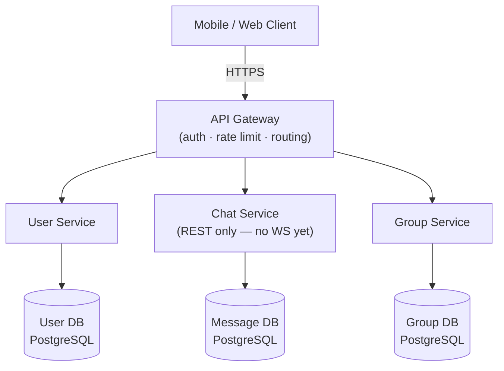
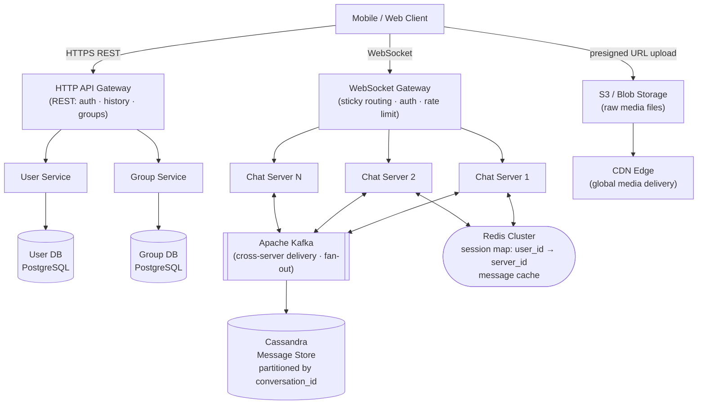
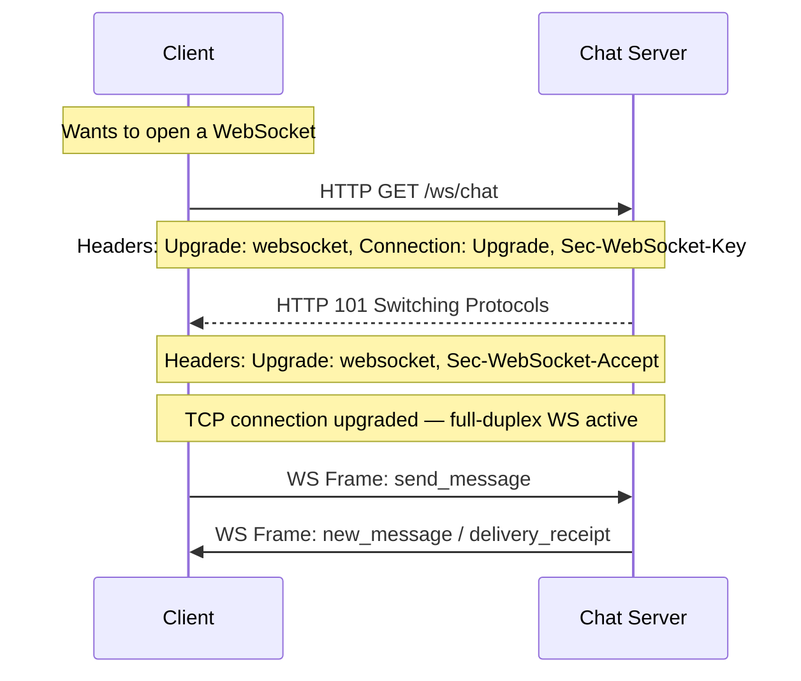
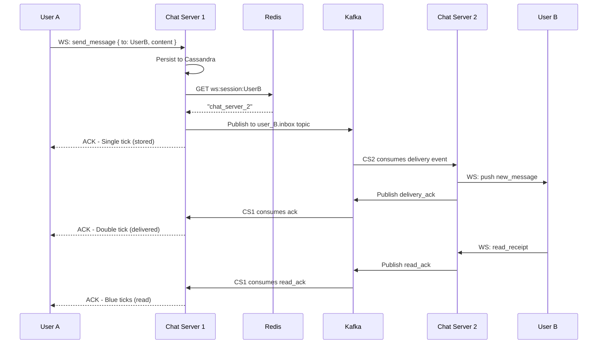
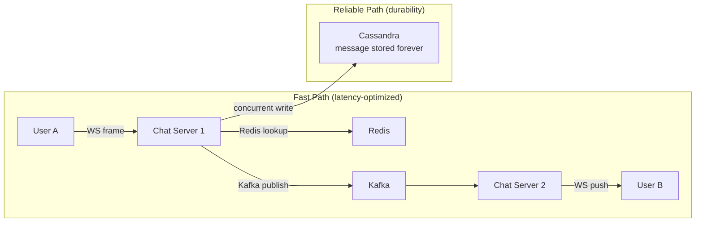
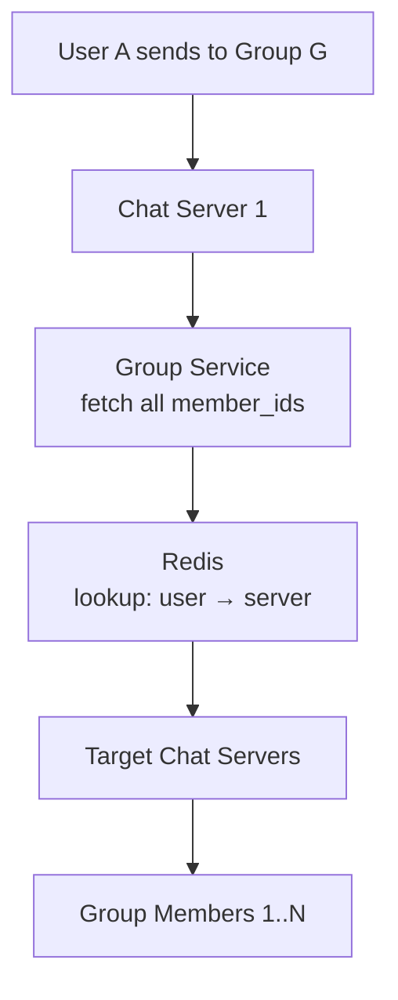
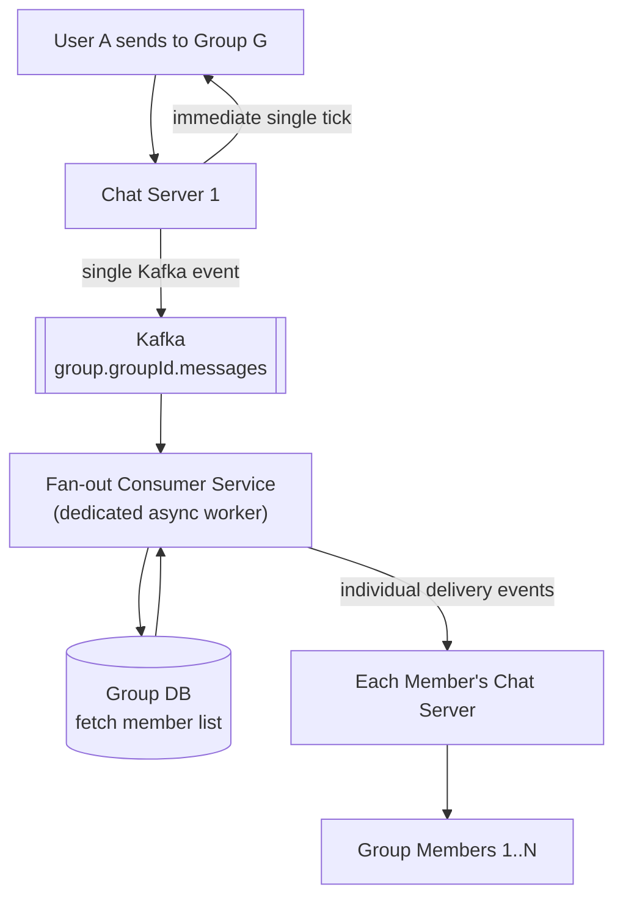
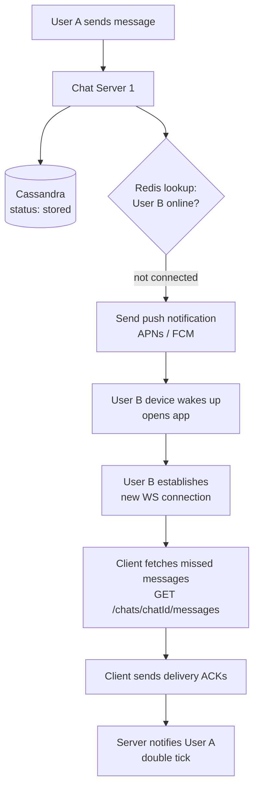
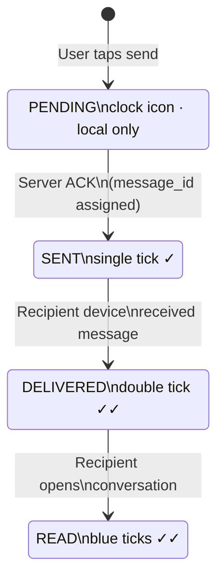
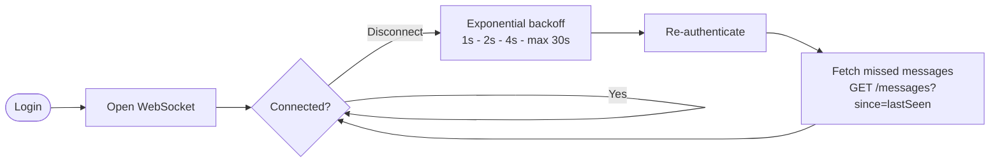

# System Design: Chat Application (WhatsApp / Facebook Messenger)

---

## 1. Problem Statement & Scope

Design a real-time chat application similar to WhatsApp or Facebook Messenger. The system must support one-to-one messaging, group messaging, media sharing, and message status tracking (sent, delivered, read) at massive scale — targeting 1 billion users exchanging 100 billion messages per day.

**In Scope:**
- User registration and authentication (phone-number based)
- One-to-one (1:1) real-time messaging
- Group messaging
- Message history with lazy loading (infinite scroll)
- Media file sharing (images, videos)
- Message status: Sent → Delivered → Read (1 tick, 2 ticks, blue ticks)
- Offline message delivery

**Out of Scope:**
- Voice and video calls
- Stories / Status features
- End-to-end encryption design (acknowledged as a real-world concern, not covered here)
- Payment features

---

## 2. Requirements

### 2.1 Functional Requirements (MVP)

1. **User sign-up / sign-in** — Phone number based registration, similar to WhatsApp. Users receive a JWT token upon successful login.
2. **One-to-one messaging** — Two users can send and receive text messages in real time.
3. **Group messaging** — Users can create groups, add/remove members, and send messages to all members.
4. **Message history** — Users can scroll back through past messages using lazy loading (pagination via offset + limit).
5. **Media file sharing** — Users can send images and videos; media is stored in blob storage (S3) and the URL is stored in the message record.
6. **Message status** — Each message shows delivery state:
   - Single tick: server received and stored the message
   - Double tick: message delivered to the recipient's device
   - Blue ticks: recipient has opened and read the message

### 2.2 Non-Functional Requirements

| Requirement         | Target                                      |
|---------------------|---------------------------------------------|
| Scale               | 1 billion total users                       |
| Message throughput  | 100 billion messages/day (~1.16M msg/sec)   |
| Storage             | ~100 TB/day (text messages alone)           |
| Availability        | High availability (99.99%+)                 |
| Consistency         | Eventual consistency (not a banking system) |
| Latency             | < 300ms end-to-end message delivery         |
| Reliability         | Zero message loss                           |
| CAP theorem choice  | AP (Availability + Partition Tolerance)     |

**Justification for eventual consistency:** A chat app can tolerate a message arriving slightly out of order or a recipient seeing a tick update a second late. We must never drop a message, but we do not need strict linearizability.

---

## 3. Back-of-the-Envelope Estimations

### 3.1 Users and Messages

```
Total users:                    1,000,000,000   (1 billion)
Assume 50% DAU:                   500,000,000   (500 million)
Messages per user per day:               ~100
Total messages per day:       100,000,000,000   (100 billion)

Messages per second (peak, 2x avg):
  100B / 86,400 sec ≈ 1,157,000 msg/sec
  Peak ≈ 2,300,000 msg/sec (2.3 million/sec)
```

### 3.2 Storage

```
Average message size:                    1 KB
Messages per day:                      100 B
Storage per day (text):          100 TB/day
Storage per year (text):      ~36.5 PB/year

Media messages (assume 10% of messages carry media):
  10B media messages/day
  Average media size: 500 KB (thumbnail + compressed video)
  Media storage per day:   ~5 PB/day (served via CDN, object storage)

Total message DB storage per year: ~36.5 PB (text only, before replication)
With 3x replication: ~110 PB/year
```

### 3.3 Bandwidth

```
Ingress (messages sent to system):
  1.16M msg/sec x 1 KB = ~1.16 GB/sec ingress

Egress (messages delivered, avg 1.5 recipients):
  ~1.74 GB/sec egress (text only)

WebSocket connections (active users at peak):
  ~100M concurrent WebSocket connections
```

### 3.4 WebSocket Server Sizing

```
Assumption: 1 Chat Server handles 50,000 concurrent WebSocket connections
Servers needed: 100M / 50,000 = 2,000 Chat Server instances
```

---

## 4. API Design

All REST endpoints go through the HTTP API Gateway. Real-time messaging uses a separate WebSocket endpoint through the WebSocket Gateway.

---

### 4.1 User Endpoints

**Register a new user**
```
POST /api/v1/users/register

Request Body:
{
  "phone": "+14155552671",
  "name": "Alice Smith",
  "metadata": { "device_type": "ios", "app_version": "2.4.1" }
}

Response 201:
{
  "user_id": "usr_8f3k2",
  "name": "Alice Smith",
  "phone": "+14155552671",
  "created_at": "2026-03-28T10:00:00Z"
}
```

**Login**
```
POST /api/v1/users/login

Request Body:
{
  "phone": "+14155552671",
  "otp": "482910"
}

Response 200:
{
  "user_id": "usr_8f3k2",
  "jwt_token": "eyJhbGciOiJIUzI1NiIs...",
  "expires_at": "2026-04-28T10:00:00Z"
}
```

---

### 4.2 Chat Endpoints

**List all chats for a user**
```
GET /api/v1/chats?userId={userId}
Authorization: Bearer <jwt_token>

Response 200:
{
  "chats": [
    {
      "chat_id": "chat_ab12",
      "type": "one_to_one",
      "participant": { "user_id": "usr_9b2k", "name": "Bob" },
      "last_message": "Hey, are you free tonight?",
      "last_message_at": "2026-03-28T09:55:00Z",
      "unread_count": 3
    }
  ]
}
```

**Fetch message history (lazy load / infinite scroll)**
```
GET /api/v1/chats/{chatId}/messages?offset={x}&limit={y}
Authorization: Bearer <jwt_token>

Response 200:
{
  "messages": [
    {
      "message_id": "msg_001",
      "sender_id": "usr_8f3k2",
      "content": "Hey!",
      "media_url": null,
      "status": "read",
      "sent_at": "2026-03-28T09:50:00Z"
    }
  ],
  "next_offset": 20,
  "has_more": true
}
```

---

### 4.3 Group Endpoints

**Create a group**
```
POST /api/v1/groups
Authorization: Bearer <jwt_token>

Request Body:
{
  "name": "Team Alpha",
  "creator_id": "usr_8f3k2",
  "member_ids": ["usr_9b2k", "usr_7c1m"]
}

Response 201:
{
  "group_id": "grp_5x9z",
  "name": "Team Alpha",
  "member_count": 3
}
```

**Add a member**
```
POST /api/v1/groups/{groupId}/members
Authorization: Bearer <jwt_token>

Request Body:
{
  "user_id": "usr_4d8n"
}

Response 200:
{ "message": "Member added successfully" }
```

**Remove a member**
```
DELETE /api/v1/groups/{groupId}/members/{userId}
Authorization: Bearer <jwt_token>

Response 200:
{ "message": "Member removed successfully" }
```

**Group message history**
```
GET /api/v1/groups/{groupId}/messages?offset={x}&limit={y}
Authorization: Bearer <jwt_token>

Response 200: (same structure as chat message history)
```

---

### 4.4 WebSocket Endpoint

**Establish real-time connection**
```
WS /ws/chat
Headers:
  Authorization: Bearer <jwt_token>
  Upgrade: websocket
  Connection: Upgrade
```

Once connected, the client and server exchange JSON frames:

**Send a message (client → server):**
```json
{
  "type": "send_message",
  "chat_id": "chat_ab12",
  "recipient_id": "usr_9b2k",
  "content": "Hello Bob!",
  "media_url": null,
  "client_message_id": "local_uuid_001"
}
```

**Receive a message (server → client):**
```json
{
  "type": "new_message",
  "message_id": "msg_server_001",
  "chat_id": "chat_ab12",
  "sender_id": "usr_8f3k2",
  "content": "Hello Bob!",
  "sent_at": "2026-03-28T10:01:00Z"
}
```

**Delivery receipt (server → sender):**
```json
{
  "type": "delivery_receipt",
  "message_id": "msg_server_001",
  "status": "delivered",
  "delivered_at": "2026-03-28T10:01:01Z"
}
```

**Read receipt (server → sender):**
```json
{
  "type": "read_receipt",
  "message_id": "msg_server_001",
  "status": "read",
  "read_at": "2026-03-28T10:02:00Z"
}
```

---

## 5. System Architecture

### 5.1 Diagram 1 — Simple High-Level Design

A clean starting point: clients talk to an API Gateway, which routes to dedicated services backed by their own databases.



**Limitations of this design:**
- REST polling required for message delivery — wasteful at scale
- Single message DB (Postgres) cannot handle 100B writes/day
- No real-time capability

---

### 5.2 Diagram 2 — Evolved Production Design

We introduce a dedicated WebSocket Gateway, Chat Server fleet, Redis for connection mapping, Kafka for cross-server message routing, Cassandra for message storage, S3 + CDN for media, and a separate Group Service.



**Component responsibilities:**

| Component            | Role                                                                 |
|----------------------|----------------------------------------------------------------------|
| HTTP API Gateway     | REST endpoints for auth, history, group management                   |
| WebSocket Gateway    | Sticky routing, authentication, rate limiting for WS connections     |
| Chat Service         | Manages WebSocket connections, message routing, receipt handling      |
| User Service         | Registration, login, profile management                              |
| Group Service        | Group CRUD, member management, fan-out coordination                  |
| Cassandra            | Primary message store — high write throughput, partition tolerant    |
| PostgreSQL (User DB) | User accounts — relational, easy to query                           |
| PostgreSQL (Group DB)| Group metadata and group_members mapping                             |
| Redis                | WebSocket server mapping (user_id → server_id), session tokens       |
| Kafka                | Cross-server message delivery and async group fan-out                |
| S3 / Blob Storage    | Raw media files (images, videos)                                     |
| CDN                  | Media delivery at edge — low latency downloads globally              |

---

## 6. Deep Dives

In a system design interview, deep dives are where you demonstrate senior-level thinking. The goal is not to list technologies — it is to show that you understand the *problems* each component solves, the *trade-offs* you accept, and *what you would do differently* at different scales. Walk through each component as a decision: "I chose X because of problem Y, and the trade-off I'm accepting is Z."

### 6.1 Deep Dive 1 — WebSocket Connection Management & Sticky Sessions

#### Why WebSocket?

**Setting up the problem:** The naive approach is simple HTTP. The client posts a message, and polls for replies. Let's walk through why each protocol fails at scale before landing on WebSocket.

> **Why WebSocket?** The core problem with HTTP polling: at 1 billion users, even 1 poll per second = 1 billion requests/second just to check for new messages — the vast majority of which return empty responses. This is pure waste. WebSocket maintains a single persistent TCP connection per user. The server pushes messages the instant they arrive. Zero polling overhead. The connection cost is paid once at handshake time.

Before choosing WebSocket, let us consider the alternatives:

| Protocol      | How it works                                       | Problem                                                     |
|---------------|----------------------------------------------------|-------------------------------------------------------------|
| HTTP Polling  | Client polls server every N seconds                | Wasteful, high latency, unnecessary requests                |
| Long Polling  | Client holds connection open, server responds late | Reconnects every ~30 sec, doubles the connection count      |
| SSE           | Server pushes events, client listens               | Unidirectional — client needs a separate POST to send       |
| **WebSocket** | Full-duplex persistent TCP connection              | Single connection handles send and receive — **chosen**     |

WebSocket is the correct choice for a chat application because both client and server need to push data at any time. The connection is established once and reused for the entire session.

#### WebSocket Handshake



After the HTTP 101 response, the TCP connection is "upgraded" and both sides can send frames freely.

#### Sticky Sessions Problem

Each Chat Server holds WebSocket connections **in memory**. User A's connection lives inside Chat Server 1's process. If a subsequent request from User A hits Chat Server 2, there is no connection object there. Therefore:

- The WebSocket Gateway uses **sticky routing** — once a user connects to Chat Server 1, all subsequent WS frames from that user go to Chat Server 1.
- Sticky routing is implemented via consistent hashing on user_id at the WS Gateway level.

#### Connection Mapping in Redis

> **Why Redis?** The problem: every message delivery requires knowing which Chat Server holds the recipient's WebSocket connection. This lookup happens 1.16 million times per second. A database lookup adds 10–50ms of disk I/O per message route decision — that alone blows our 300ms latency budget. Redis answers this in under 1ms from memory, and its TTL feature automatically cleans up stale sessions when a user disconnects.

When User A connects to Chat Server 1, the server writes:

```
Redis Key:   ws:session:usr_8f3k2
Redis Value: chat_server_1
TTL:         30 seconds (refreshed on each heartbeat)
```

Any other Chat Server that needs to deliver a message to User A can look up this key to find the right server.

#### Heartbeat and Reconnection

```
Client sends PING frame every 25 seconds
Chat Server responds with PONG frame
If no PING received in 30s → server closes connection and deletes Redis key
Client detects disconnect → reconnects with exponential backoff
On reconnect → fetches missed messages via REST (GET /chats/{chatId}/messages)
```

#### Database Schema — Session Mapping

Redis handles the live session mapping. No persistent DB needed for this — TTL handles stale sessions automatically.

```
Redis Hash (alternative structure for richer data):
HSET ws:session:usr_8f3k2 server_id "chat_server_1"
                           connected_at "2026-03-28T10:00:00Z"
                           device_id "iphone_14_abc"
EXPIRE ws:session:usr_8f3k2 30
```

---

### 6.2 Deep Dive 2 — Message Delivery Flow (1:1 and Group) + Offline Handling

**Setting up the problem:** A message arrives at Chat Server 1. The recipient is connected to Chat Server 2. Chat Server 1 has no direct reference to the recipient's WebSocket connection object. How do we bridge this gap at 1.16 million messages per second without coupling the servers together? This is the core routing problem.

#### 6.2.1 One-to-One Message Delivery

> **Why Kafka?** The problem: if Chat Server 1 calls Chat Server 2 directly to forward a message (via HTTP or gRPC), what happens when Chat Server 2 is temporarily down or overloaded? The message is silently dropped. Our non-functional requirement is zero message loss. Kafka solves this by acting as a durable log — Chat Server 1 writes to Kafka and gets an acknowledgment; Chat Server 2 consumes at its own pace. If Chat Server 2 crashes, the message waits in Kafka until it recovers. The producer and consumer are fully decoupled.



**Step-by-step:**

1. User A sends a WS frame to Chat Server 1 with message content and recipient_id.
2. Chat Server 1 persists the message to Cassandra immediately. Generates a server-side message_id.
3. Chat Server 1 looks up Redis: `GET ws:session:usr_UserB` → returns `chat_server_2`.
4. Chat Server 1 publishes the message to a Kafka topic (e.g., `user.{userB_id}.inbox`).
5. Chat Server 2 is a Kafka consumer subscribed to User B's inbox topic.
6. Chat Server 1 sends a single-tick ACK back to User A over WS (server has stored the message).
7. Chat Server 2 pushes the message to User B over their active WebSocket connection.
8. Chat Server 2 sends a delivery ACK back through Kafka (or directly via internal gRPC) to Chat Server 1, which forwards a double-tick to User A.

#### 6.2.2 Fast Path vs Reliable Path — A Senior-Level Insight

This is the design decision that separates a robust chat system from a fragile one. There are two distinct concerns in message delivery:

**The Fast Path** — optimized for latency:
User A → Chat Server 1 → Redis lookup → Kafka publish → Chat Server 2 → User B

Everything on this path is designed to be non-blocking. Chat Server 1 does not wait for Chat Server 2 to confirm delivery before responding to User A. The single tick is issued as soon as Cassandra confirms the write. This keeps end-to-end perceived latency under 300ms.

**The Reliable Path** — optimized for durability:
- Message is written to Cassandra **before** any delivery is attempted.
- The Kafka publish and Cassandra write happen **concurrently** (not sequentially).
- If Chat Server 2 is down, the message sits in Kafka. When CS2 recovers, it consumes the backlog and delivers. The message was never lost.
- If the user is offline entirely, the message is in Cassandra. On reconnect, the client fetches it via REST.

**The key insight:** the single tick (stored) means "this message is safe — it will eventually reach you." The double tick (delivered) means "it reached the device." These are separate guarantees, served by separate subsystems. Never conflate them.



---

#### 6.2.3 Group Message Delivery

Group messaging adds a fan-out problem: one message must be delivered to N members.

**For small groups (< 100 members) — synchronous fan-out:**



**For large groups (1000+ members) — asynchronous fan-out:**



The async fan-out approach decouples the sender's acknowledgment from the delivery complexity. User A gets their single tick immediately; the fan-out happens in the background.

#### 6.2.4 Offline Message Handling

When User B is offline (no entry in Redis session map):



**Key insight:** Push notifications are a "wake-up call," not a delivery mechanism. The actual messages are always fetched from Cassandra. This avoids push notification size limits and ordering issues.

#### 6.2.5 Message Storage Schema (Cassandra)

```sql
-- Cassandra table for messages
CREATE TABLE messages (
    conversation_id  UUID,           -- partition key (chat_id or group_id)
    sent_at          TIMESTAMP,      -- clustering key (DESC for recent-first)
    message_id       UUID,
    sender_id        UUID,
    content          TEXT,
    media_url        TEXT,           -- null if text-only
    message_type     TEXT,           -- 'text', 'image', 'video'
    status           TEXT,           -- 'stored', 'delivered', 'read'
    PRIMARY KEY ((conversation_id), sent_at, message_id)
) WITH CLUSTERING ORDER BY (sent_at DESC);
```

**Why Cassandra over PostgreSQL for messages?**

| Dimension             | Cassandra                              | PostgreSQL                         |
|-----------------------|----------------------------------------|------------------------------------|
| Write throughput      | Millions of writes/sec per node        | Thousands of writes/sec per node   |
| Horizontal scaling    | Native, linear scaling                 | Complex sharding required          |
| Single point of fail  | No SPOF, multi-master                  | Primary node is SPOF               |
| Consistency model     | Tunable (eventual default)             | Strong (ACID)                      |
| Message workload fit  | Excellent (append-heavy, partition by  | Poor at this scale                 |
|                       | conversation_id, time-range queries)   |                                    |

At 100B messages/day, Cassandra is the only realistic choice. PostgreSQL would require hundreds of shards with complex routing logic, and still could not match Cassandra's write path performance.

---

### 6.3 Deep Dive 3 — Message Ordering

#### The Problem

Two users send messages at the same millisecond. Which arrives first at Chat Server 1 depends entirely on network jitter — not send time. With Cassandra's eventual consistency across replicas, two different clients reading from different replicas might see the same messages in different order.

Even with a single replica, consider:
- User A sends M1 at T=100ms
- User B sends M2 at T=101ms
- Due to network delay, M2 arrives at Chat Server 1 before M1
- M2 gets written to Cassandra first

Without ordering controls, User A sees: M1, M2. User B sees: M2, M1.

#### Solution 1: TIMEUUID as the Clustering Key

Cassandra's `TIMEUUID` (UUID Type 1) encodes a nanosecond-precision timestamp plus a random component for uniqueness. Using TIMEUUID as the clustering key means messages are stored in time order on disk, and time-range queries (`WHERE sent_at > X`) are efficient.

```sql
PRIMARY KEY ((conversation_id), sent_at, message_id)
-- sent_at is TIMEUUID, not a plain timestamp
-- Guarantees: no two messages share the exact same key
-- Even if two messages arrive at the same nanosecond, the random component differentiates them
```

#### Solution 2: Client-Side Sequence Numbers

Each client maintains a monotonically incrementing `seq` counter per conversation. Every message sent includes `{ seq: 42 }`. When the recipient receives `seq: 44` but has only seen up to `seq: 42`, it knows `seq: 43` is missing and requests a gap fill from the server.

This gives us **causal ordering** at the conversation level without requiring a distributed sequence number generator.

#### Solution 3: Last-Write-Wins with Vector Clocks (Alternative Approach)

For systems requiring stronger ordering guarantees (e.g., collaborative editing), vector clocks can establish a partial order across concurrent events. For a chat app, LWW with TIMEUUID is sufficient — users tolerate minor ordering variations at the millisecond scale.

#### Trade-off Accepted

We do not guarantee global ordering across all conversations or even strict per-conversation ordering under extreme concurrent load. What we guarantee: monotonic reads within a session (you will never see a message disappear after seeing it), and eventual convergence (all replicas will agree on the same order within seconds).

---

### 6.4 Deep Dive 4 (Bonus) — Message Status: Sent / Delivered / Read Receipts

The three-tick system requires careful state tracking and is often tricky at scale.

#### State Machine



#### How Each State Transition Works

**SENT (single tick):**
- Chat Server 1 receives the WS frame from User A.
- Persists to Cassandra with status = `stored`.
- Sends ACK frame back to User A with the server-generated `message_id`.
- Client shows single tick.

**DELIVERED (double tick):**
- Chat Server 2 successfully pushes the message to User B's device over WS.
- Chat Server 2 sends a delivery event back (via Kafka or gRPC) to Chat Server 1.
- Chat Server 1 sends a `delivery_receipt` WS frame to User A.
- Client shows double tick.
- Cassandra message status updated to `delivered`.

**READ (blue ticks):**
- User B opens the conversation in the app.
- Client sends a WS frame: `{ type: "read_receipt", message_ids: [...] }`.
- Chat Server 2 receives this, updates Cassandra status to `read`.
- Chat Server 2 publishes a read event → Chat Server 1 delivers a `read_receipt` frame to User A.
- User A's client shows blue ticks.

**Batch read receipts (Modern Optimization):**
Rather than sending one read receipt per message, the client sends a single receipt with `{ last_read_message_id: "msg_099" }`, implying all messages up to that ID are read. This reduces WS frame volume significantly in active conversations.

#### Read Receipt Privacy

Some applications (like WhatsApp) allow users to disable read receipts. In that case:
- The client does not send read receipt WS frames.
- The server never updates status to `read` for that user.
- The sender never sees blue ticks.

This is a per-user preference stored in the User DB and checked by the Chat Server before forwarding read events.

---

## 7. Trade-offs & Bottlenecks

### 7.1 Cassandra vs MySQL/PostgreSQL for Message Storage

**Decision: Cassandra**

> **Why Cassandra?** The problem: we need to write 1.16 million messages per second, sustained, 24/7. PostgreSQL's write path is limited by its single primary node — even with tuning, a primary handles roughly 50–100K writes/second before degrading. At our scale, we'd need 10–20 PostgreSQL primaries with a complex sharding layer on top. Cassandra's multi-master design eliminates this — every node accepts writes simultaneously. Adding nodes scales write capacity linearly. No shard routing logic needed.

The primary argument is write throughput. At 1.16 million messages per second (average), no single PostgreSQL instance can keep up. Even with read replicas and connection pooling, PostgreSQL's write path is limited to the primary node.

Cassandra's multi-master architecture means every node accepts writes. Adding nodes scales write capacity linearly. The partition key (conversation_id) ensures all messages in a conversation land on the same set of nodes, making range queries efficient.

**Trade-off accepted:** Cassandra does not support joins or transactions. Group membership cannot be stored in Cassandra alongside messages — that is why we use a separate PostgreSQL Group DB. Also, Cassandra's eventual consistency means a brief window where two clients might see slightly different message orderings. For a chat app, this is acceptable.

---

### 7.2 WebSocket vs HTTP Polling vs Long Polling vs SSE

**Decision: WebSocket**

| Option       | Latency         | Server load              | Duplex?       | Verdict           |
|--------------|-----------------|--------------------------|---------------|-------------------|
| HTTP Polling | High (1-10 sec) | Very high (empty polls)  | Yes (ugly)    | Rejected          |
| Long Polling | Medium (~30 sec)| High (reconnect storms)  | Yes (ugly)    | Rejected          |
| SSE          | Low             | Medium                   | No (send via  | Rejected          |
|              |                 |                          | separate POST)|                   |
| WebSocket    | < 50ms          | Low (persistent conn)    | Yes           | **Chosen**        |

For a chat app, full-duplex low-latency communication is non-negotiable. WebSocket is the industry standard for this use case.

**Trade-off accepted:** WebSocket connections are stateful and sticky. This complicates horizontal scaling and load balancing. We solve this with sticky routing in the WS Gateway and the Redis session map.

---

### 7.3 Redis vs Database for Session/Connection Mapping

**Decision: Redis**

The session map (`user_id → server_id`) is read on every message send operation. With 1.16M messages/sec, that is 1.16M Redis lookups per second. Redis handles millions of reads/sec at sub-millisecond latency from memory.

Storing this in PostgreSQL would require disk I/O on every message route decision — latency would be 10-100x higher and the DB would become a bottleneck.

**Trade-off accepted:** Redis is in-memory. A Redis node failure loses session data. We mitigate this with Redis Cluster (multi-node replication) and the TTL mechanism — clients reconnect automatically and re-register their session within seconds.

---

### 7.4 Kafka vs Direct Server-to-Server Calls for Cross-Server Delivery

**Decision: Kafka**

If Chat Server 1 calls Chat Server 2 directly (via gRPC or HTTP) to forward a message, we introduce tight coupling and a failure mode: if Chat Server 2 is temporarily unavailable, the message is dropped.

Kafka decouples the producer (Chat Server 1) from the consumer (Chat Server 2). If Chat Server 2 is down, the message sits in Kafka. When Chat Server 2 recovers, it consumes the backlog. This gives us the zero message loss guarantee.

**Trade-off accepted:** Kafka introduces added latency (typically 5-20ms additional). For our < 300ms target, this is acceptable. Kafka also adds operational complexity — it requires its own cluster, ZooKeeper/KRaft management, and topic partitioning strategy.

**Alternative Approach:** For a smaller system or team, Redis pub/sub can replace Kafka for cross-server message routing. Redis pub/sub is simpler but does not persist messages — if the subscriber is down when the event fires, the message is lost. Kafka's durable log is worth the complexity at our scale.

---

### 7.5 Eventual Consistency Trade-off

The system is designed for AP (Availability + Partition Tolerance) per the CAP theorem.

**What this means in practice:**
- A message may be stored on one Cassandra node and briefly unavailable on replicas during a network partition. A recipient on a different read replica might not immediately see the latest message.
- Read receipts may arrive slightly out of order.
- Two users may briefly see different tick statuses for the same message.

**Why this is acceptable:**
- We are not a banking system. Message ordering within a few milliseconds does not harm the user experience.
- WhatsApp and Facebook Messenger both operate with eventual consistency and users find it acceptable.

**What we never compromise on:**
- Zero message loss: Kafka's durable log and Cassandra's replication factor (typically 3) ensure a message written to the system is never dropped.
- Monotonic reads within a session: A user will never see a message disappear after seeing it (Cassandra's LWW last-write-wins policy handles this cleanly with timestamps as clustering keys).

---

### 7.6 Bottlenecks and How We Mitigate Them

| Bottleneck                         | Mitigation                                                          |
|------------------------------------|---------------------------------------------------------------------|
| WebSocket Gateway becoming SPOF    | Horizontal scaling, multiple WS Gateway nodes behind a TCP LB      |
| Chat Server memory limits          | Limit connections per server, auto-scale fleet, shed connections    |
| Cassandra hot partition            | Good partition key (conversation_id distributes load evenly)        |
| Redis single point of failure      | Redis Cluster with replication and sentinel                         |
| Kafka consumer lag during peak     | Increase partition count, scale consumer fleet, monitor lag         |
| Large group fan-out (1M members)   | Async fan-out service, rate-limited delivery, async Kafka pipeline  |
| Media storage costs                | CDN caching reduces S3 egress, lifecycle policies archive old media |

---

## 8. Summary

This design supports 1 billion users exchanging 100 billion messages per day with end-to-end delivery under 300ms, zero message loss, and high availability.

**Key architectural decisions:**

1. **WebSocket** for real-time bidirectional messaging — the only protocol that efficiently supports chat at scale.
2. **Sticky sessions** with a Redis connection map — solves the stateful WebSocket routing problem without sacrificing horizontal scalability.
3. **Kafka** between Chat Servers — decouples delivery, enables zero message loss, and handles group fan-out asynchronously.
4. **Cassandra** for messages — the only database capable of handling 1M+ writes/sec with linear horizontal scaling and no single point of failure.
5. **PostgreSQL** for Users and Groups — relational data that benefits from joins and ACID guarantees.
6. **S3 + CDN** for media — offloads binary data from the message pipeline, serves content at global edge locations.
7. **Eventual consistency** — deliberately chosen because the use case (chat) does not require strict linearizability, and availability is more important than perfect ordering.

---

---

# Frontend Notes: Chat Application

> Chat is a **backend-heavy system (~85% backend, ~15% frontend)**. In an interview, spend the majority of time on WebSocket routing, message delivery, and Cassandra. The frontend notes below cover the 2–3 frontend concepts that interviewers do ask about.

---

## F1. The Three Frontend Problems Worth Discussing

### 1. WebSocket Client (Singleton + Reconnect)

The WebSocket connection must be a singleton — opened once on login, reused for the entire session.

**Reconnect strategy:**


On reconnect, always fetch missed messages via REST — never rely on the WebSocket to replay what was missed.

**Offline outbox:** When the device is offline, queue outgoing messages in IndexedDB. Drain the queue on reconnect.

---

### 2. Virtual List for Message Rendering

Rendering 10,000+ messages in the DOM causes scroll stuttering and frame drops. Only render the visible window (~15–20 messages) plus a small buffer. Use `react-virtual` or `react-window`.

**Key behaviors:**
- **Sticky scroll**: auto-scroll to bottom when the user is at the bottom. Pause auto-scroll when user scrolls up.
- **Lazy load upward**: fetch older messages when scrolling to the top. Preserve scroll position during DOM update (calculate height delta before/after prepend).

---

### 3. Optimistic UI

Show the message in the UI immediately on send (with a "pending" clock icon). Do not wait for the server ACK. On server ACK, swap the clientMsgId for the server messageId and update the status to single tick.

If the server returns an error, show a retry option. This makes the UI feel instant while the network does its work in the background.

---

## F2. What NOT to Over-Engineer on the Frontend

For a chat app interview, do **not** go deep on:
- State management library choice (Zustand vs Redux) — mention it, don't deep-dive
- Component architecture — not relevant unless specifically asked
- CSS/accessibility — out of scope
- PWA/service workers — mention briefly if asked about offline

The interviewer wants to hear about WebSocket management, message ordering on the client, and how the client handles the reliable/fast path split (optimistic UI = fast path; retry on failure = reliable path).

