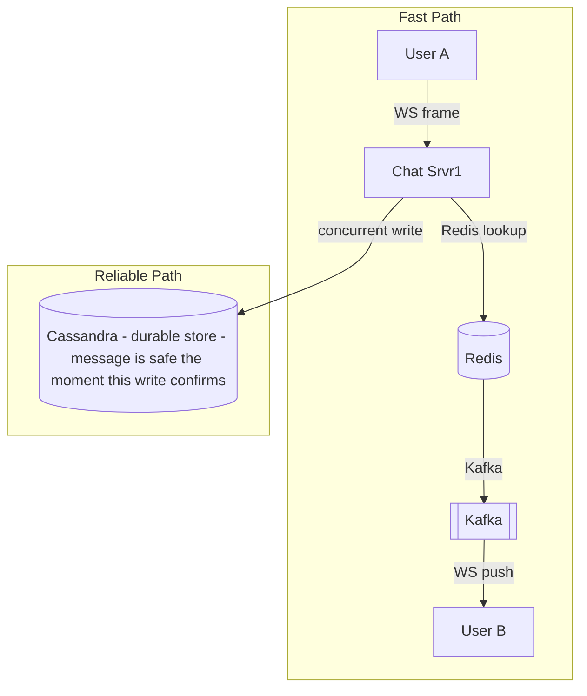
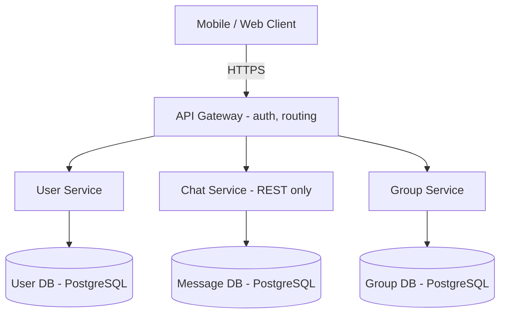
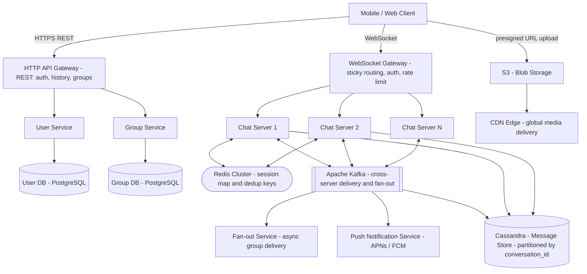
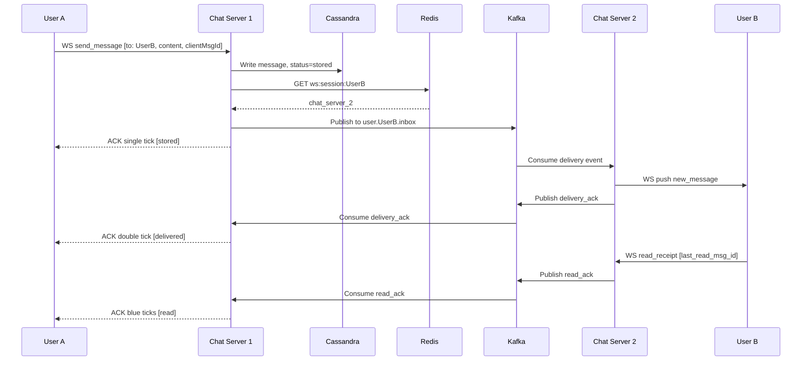
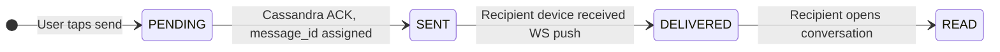
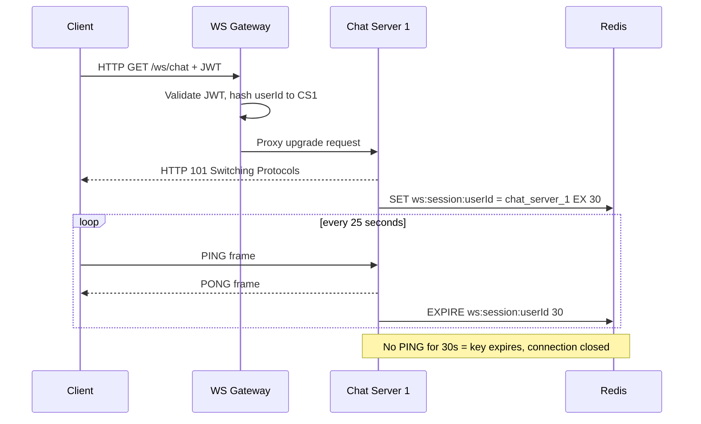
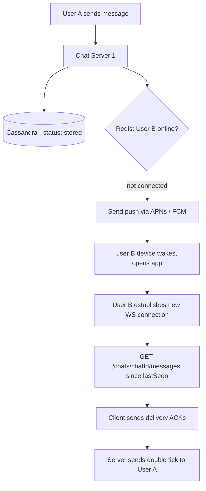
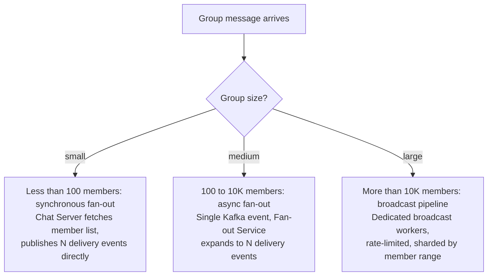

# System Design: Chat Application (WhatsApp / Facebook Messenger)

---

## 1. What Is WhatsApp / Facebook Messenger?

WhatsApp and Messenger are chat apps: someone types a message to a friend or a group, taps send, and it shows up on the other person's phone within a second or two — whether they're across the table or across the world. Under that message sit little checkmarks that quietly tell the sender what happened to it: did it leave my phone, did it reach theirs, did they actually open and read it.

At the scale these apps run at — a billion people, a hundred billion messages exchanged every single day — the hard part was never sending one message. It's doing that instantly, for everyone, on every kind of network, without ever losing a single message, even when the recipient's phone is turned off.

---

## 2. A Day in the Life

Meera is running late and taps out a quick message to Raj: "stuck in traffic, 5 min." The second she hits send, a single grey check appears under it — her message is safely on its way. A moment later a second check joins it — Raj's phone has it now, sitting on his lock screen. She doesn't think about any of this; she just sees two little checks and knows he'll see it.

Raj is on the subway with no signal, so his phone doesn't actually get the message right away. It's fine — Meera's checks stay at two grey ticks, not blue, and neither of them worries about it. A few minutes later, Raj resurfaces, his phone reconnects, and the message lands along with a couple of others he missed underground. He reads it, and back on Meera's screen, the ticks quietly turn blue.

That evening, Meera sends one more message — a reminder about tomorrow's book club — but this time to a group of twelve friends instead of just Raj. She types it once, hits send once, and within a couple of seconds all twelve phones buzz with it, roughly at the same time, without her doing anything differently than she did for Raj's one-on-one message.

Neither Meera nor Raj ever thought about a socket connection, a queue, or a database — from here on, this is how that experience actually gets built.

---

## 3. Requirements — and Why They Matter

**Scope.** In scope: user registration, 1:1 real-time messaging, group messaging (small and large groups), message history with pagination, media sharing, message status (1 tick / 2 ticks / blue ticks), offline message delivery. Out of scope: voice/video calls, Stories/Status features, end-to-end encryption design, payments.

**Functional requirements:**

1. **User registration** — Phone-number-based sign-up; JWT issued on successful OTP verification.
2. **1:1 real-time messaging** — Two users exchange text messages with sub-300ms delivery.
3. **Group messaging** — Create groups, add/remove members, send to all members simultaneously.
4. **Message history** — Scroll back through past messages with lazy-loading pagination.
5. **Media sharing** — Send images and videos; media stored in S3, URL stored in message record.
6. **Message status** — Each message tracks: single tick (stored), double tick (delivered to device), blue ticks (opened by recipient).
7. **Offline delivery** — Messages delivered via push notification (APNs/FCM) when recipient is offline; full history fetched on reconnect.

<details markdown="1">
<summary><strong>Point to Ponder:</strong> Meera and Raj could, in theory, both send a message in the same conversation at the exact same millisecond — how does the system guarantee they both see the two messages in the same order?</summary>

It doesn't use one global counter across every message in the system — a single counter serializing 1.16 million writes a second would itself become the bottleneck. Instead, ordering is scoped to the conversation: each message carries a per-conversation sequence number, and Cassandra's clustering key stores messages in that order. If a client ever sees a gap in the sequence, it explicitly asks for the missing message rather than assuming it never existed. See §8.2 in Deep Dives for the full mechanism.

</details>

**Non-functional requirements — and why each one matters to a real user, not just as a target:**

| Requirement | Target | Why it matters |
|---|---|---|
| Availability | 99.99% uptime | For a huge share of users this app is their only line of contact with family and friends — any downtime is people who simply can't reach each other. |
| Latency | < 300ms end-to-end message delivery | Texting is supposed to feel like a live conversation; a message that takes seconds to land feels broken, not just slow. |
| Consistency | Eventual consistency (AP — availability over strong consistency) | Users barely notice a message rendering a beat late or a tick updating slightly out of order — they absolutely notice a message that never arrives. |
| Durability | Zero message loss | A dropped message might be someone's address, a password reset code, or a plan to meet — there's no such thing as an acceptable message to lose. |
| Throughput | 1.16M msg/sec sustained, 2.3M msg/sec peak | Not a promise to any one user directly — it's the load the system must sustain merely to keep the latency promise above true for everyone at once. |
| Storage | 100 TB/day text; 5 PB/day media | Same idea — this is what "durable and instant for a billion people" costs in raw bytes per day. |
| CAP choice | AP — chat tolerates brief inconsistency; we must never drop a message | This is the single sentence that justifies every consistency decision below it — chat picks availability, deliberately, and only where losing a message is truly impossible does it pick strong consistency instead. |

**Consistency Model:**

| Domain | Model | Justification |
|---|---|---|
| Messages | Eventual (Cassandra quorum) | Slight out-of-order on read is acceptable; loss is not |
| Session map | Eventual (Redis TTL) | Stale entry causes a missed push, not lost message — fallback is pull-on-reconnect |
| Group membership | Strong (PostgreSQL) | Wrong fan-out target list is a correctness bug |
| User accounts | Strong (PostgreSQL) | Auth must be authoritative |

> [!IMPORTANT]
> **CAP Theorem framing:** This isn't one global answer — it's a decision made per component. Messages and presence lean toward availability because a slightly stale or reordered read is harmless and a dropped message is not. Group membership and user accounts lean toward strong consistency because getting either one wrong is a correctness bug, not a UX nuisance — sending a message to a stale member list or letting an unauthenticated user in isn't something eventual consistency can be allowed to shrug off.

<details markdown="1">
<summary><strong>Point to Ponder:</strong> What happens to a message Meera sends to Raj while his phone has no signal at all?</summary>

It isn't held in memory somewhere waiting for him to come back online — it's already durably written to Cassandra the instant Meera hits send, regardless of whether Raj's phone is reachable. The system separately notices he has no active connection, sends a lightweight push notification purely to wake his phone up, and once his app reconnects it pulls everything it missed in one request. The push is a doorbell, never the delivery itself. See §8.3 in Deep Dives for the full three-stage fallback.

</details>

---

## 4. Scale, From First Principles

Before designing anything, it's worth asking: at 1 billion total users, how much traffic does this system actually have to survive every single second — and what does that force onto the architecture before a single technology gets chosen?

**How many messages does the system handle per second?** Start from the user base and work down to a rate:
```
Total users:                    1,000,000,000   (1 billion)
DAU (50% of total):               500,000,000   (500 million)
Messages per user per day:               ~100
Total messages per day:       100,000,000,000   (100 billion)

Average throughput:  100B / 86,400 sec  ~  1,157,000 msg/sec
Peak throughput (2x avg):               ~  2,300,000 msg/sec
```
1.16 million writes a second, sustained, all day — that number alone rules out a single relational primary for message storage before any other requirement is even considered.

**What does that throughput mean for the delivery pipeline?** Kafka has to move every one of those messages between servers, and a single partition tops out around 50,000 messages/sec:
```
Kafka partitions needed (1 partition = ~50K msg/sec):
  2.3M / 50K = ~46 partitions minimum
```
46 partitions at peak is a modest number — the throughput math is what justifies Kafka's presence in the design at all, not the partition count itself.

**How many people are actually connected live at once?** Real-time delivery means holding an open connection to everyone who might receive a message right now:
```
WebSocket connections at peak:
  Assume 10% DAU online simultaneously = 50M concurrent WS connections
  Chat Server handles 50K connections each -> 1,000 Chat Server instances
```
50 million simultaneous open connections is the number that rules out HTTP polling outright — see the protocol comparison in §8.1 — and it's also what turns "how many chat servers do we need" into a straightforward division problem: 1,000 instances, each holding its slice of those 50 million sockets.

**What does storing every message forever actually cost?** Every message is roughly 1KB of text:
```
Storage (text, avg 1 KB/message):
  100B messages/day x 1 KB = 100 TB/day
  100 TB/day x 365 = ~36.5 PB/year
  With 3x Cassandra replication: ~110 PB/year
```
100 terabytes a day, before replication, is squarely in "no single database server" territory — it's a distributed, horizontally-scaled store or nothing.

**What about the media people actually send — photos and videos?** Roughly a tenth of all messages carry an attachment, and those attachments are much bigger than a text message:
```
Media (10% of messages, avg 500 KB):
  10B media/day x 500 KB = ~5 PB/day (S3 + CDN)
```
5 petabytes a day of binary blobs is not a database problem at all — it's an object-storage-and-CDN problem, which is exactly why media never touches the message database directly; only its URL does.

**And how much memory does knowing who's online right now actually take?** This is the one number in this whole exercise that turns out to be small:
```
Redis session map memory:
  50M active users x ~100 bytes/entry = ~5 GB -- fits in a single Redis node
```
5 GB is nothing — it comfortably fits a single Redis node, let alone a cluster, which is exactly why session routing can be "just" a Redis lookup rather than its own distributed subsystem.

> [!NOTE]
> **Key Insight:** These numbers drive every decision below. 1.16M writes/sec breaks PostgreSQL. 50M concurrent connections require sticky sessions. 5 GB session map fits comfortably in Redis Cluster. Always show the math before naming a technology.

These numbers — 1.16M msg/sec, 50M concurrent connections, 100TB/day of text alone — are what drive the following decisions, in order: Cassandra over SQL for messages, Kafka over direct server calls for cross-server delivery, Redis for session routing, and WebSocket over polling for the connection itself.

---

## 5. High-Level Architecture

Remember Meera's message to Raj from the story above — here's what actually happens underneath it, and underneath every message like it.

Chat systems run **two independent flows concurrently**: a fast path and a reliable path. The fast path (WebSocket + Redis + Kafka) races to get Meera's message onto Raj's screen as quickly as possible. The reliable path (a Cassandra write) makes the message durable the instant it lands, regardless of whether the fast path succeeds, fails, or takes a detour through a push notification because Raj is on the subway. Production chat is the careful orchestration of both paths — never conflating them.



> [!IMPORTANT]
> **Single tick != Double tick.** Single tick = Cassandra confirmed (reliable path). Double tick = WebSocket push succeeded (fast path). These are separate guarantees from separate subsystems. The fast path can fail. The reliable path must not.

### Core Design Principles

| Path | Optimized For | Mechanism |
|---|---|---|
| Fast Path | Latency (< 300ms) | WS frame -> Chat Server -> Redis lookup -> Kafka publish -> Chat Server -> WS push |
| Reliable Path | Durability (zero loss) | Chat Server -> Cassandra write (concurrent, non-blocking, replicated) |

> [!NOTE]
> **Key Insight:** Both paths run concurrently on every message send — not sequentially. The single tick fires when Cassandra ACKs, regardless of fast path outcome. This is what makes zero message loss possible while keeping latency low.

<details markdown="1">
<summary><strong>Point to Ponder:</strong> Why don't the two paths just run one after the other — write to Cassandra, wait for confirmation, then push over WebSocket?</summary>

Because that would tie Raj's real-time delivery latency to Cassandra's write latency on every single message, even though the two guarantees don't actually depend on each other — durability doesn't need the WebSocket push to succeed, and the push doesn't need to wait for a durable write to be useful. Running them concurrently means the single tick fires the moment Cassandra ACKs, and the double tick fires independently the moment the push lands — whichever happens to finish first, without either one blocking the other.

</details>

### Simple Design (starting point)



**Limitations:** REST polling wastes bandwidth. Single PostgreSQL message DB cannot handle 100B writes/day. No real-time push capability.

### Evolved Production Design



| Component | Role |
|---|---|
| WebSocket Gateway | Sticky routing, auth, rate limiting for all WS connections |
| Chat Server fleet | Holds WS connections, routes messages, handles receipts |
| Redis Cluster | Session map (user -> server), dedup key store |
| Kafka | Durable cross-server delivery log; group fan-out pipeline |
| Cassandra | Primary message store — high write throughput, partitioned by conversation |
| PostgreSQL (User/Group) | Relational data requiring joins or transactions |
| Fan-out Service | Async worker that expands group events into per-member deliveries |
| Push Notification Service | Sends APNs/FCM wake-up when recipient has no active WS |
| S3 + CDN | Raw media storage and global edge delivery |

<details markdown="1">
<summary><strong>Point to Ponder:</strong> Meera's book club message goes to 12 people at once — what if it were a 10,000-member community group instead? Does it still go through the same path?</summary>

Not identically — the fan-out mechanism itself changes with group size, and the Fan-out Service pictured above exists specifically for the middle tier of that range. Small groups fan out synchronously, mid-size groups go through the async Fan-out Service shown here, and very large groups get routed to a dedicated, rate-limited broadcast pipeline instead. See §9 Bottlenecks & Scaling for the exact thresholds and why they exist.

</details>

### The Full Sequence

The diagrams above show the components; this shows the actual message sequence between them for a 1:1 message like Meera's — the send, the fast-path push, and the read receipt flowing back:

1. Meera's app sends the message over her existing WebSocket connection to Chat Server 1.
2. Chat Server 1 immediately writes the message to Cassandra. The message is now durable — single tick appears on Meera's screen.
3. Chat Server 1 checks Redis for Raj's session: which server is he connected to?
4. Redis returns "Chat Server 2." Server 1 publishes the message to Kafka on Raj's inbox topic.
5. Chat Server 2 consumes the Kafka event and pushes the message to Raj over his open WebSocket — double tick appears.
6. When Raj opens the chat, his app sends a read receipt, which flows back through Kafka to Server 1 and on to Meera — blue ticks appear.



### Message Status State Machine

Every tick Meera sees maps directly onto one of four states a message moves through, each transition driven by an ACK flowing back from the recipient through Kafka to the sender's server:

1. PENDING — message is in the client's outbox, not yet sent.
2. SENT — Cassandra has acknowledged the write. One grey tick.
3. DELIVERED — recipient's device received the WebSocket push. Two grey ticks.
4. READ — recipient opened the conversation. Two blue ticks.



---

## 6. API Design

The API splits by what a client needs at each moment of the journey, not by actor the way a ride-booking or marketplace API might — there's really only one kind of user here, so the split instead runs along sync-vs-async lines: REST handles anything that needs a definite answer right now (register, log in, load history, create a group), while the WebSocket connection carries everything that happens continuously and asynchronously after that.

| Method | Path | Description |
|---|---|---|
| POST | /api/v1/auth/register | Register user, returns JWT |
| POST | /api/v1/auth/login | Login, returns JWT + session |
| GET | /api/v1/conversations | List conversations with last message + unread count |
| GET | /api/v1/conversations/{id}/messages?before=&limit= | Paginated message history (cursor-based) |
| POST | /api/v1/conversations/{id}/messages | Send message, returns {message_id, status: SENT} |
| POST | /api/v1/conversations/group | Create group with {name, member_ids} |

The one design choice worth naming explicitly: the send-message endpoint above is not where delivery and read status come from. It returns `SENT` immediately and nothing more — `DELIVERED` and `READ` arrive later over the WebSocket (`/ws`), asynchronously, exactly as traced through §5's Full Sequence and Message Status State Machine. Folding delivery/read status into the REST response would mean holding that HTTP request open until Raj's phone actually acknowledges it — which could be instantly, or could be however long he's underground.

---

## 7. Data Model

Eight entities live in this system, and grouping them by how they're actually used — rather than as one flat list — makes the storage choices close to self-explanatory.

**The one entity that dwarfs everything else in write volume gets its own store.** Messages arrive at 1.16 million writes a second, sustained — no relational primary survives that, and messages don't need joins anyway, since a conversation's history is read as one contiguous range, not assembled from multiple tables. Cassandra partitions messages by `conversation_id`, so every message in a single chat co-locates on the same nodes, and the clustering key (`client_seq DESC, message_id`) keeps them in the exact order §8.2 relies on for correct rendering.

**The ephemeral, fast-path data lives in Redis, because none of it needs to survive a crash.** A WebSocket session entry (`ws:session:user_id`) only matters for as long as the connection is open — if it's lost, the client simply reconnects and a new one is written, so a 30-second TTL is a feature, not a risk. Presence (`presence:user_id`) follows the identical pattern for the identical reason: high-frequency heartbeat writes, natural expiry, no cleanup job required. Dedup keys (`dedup:client_msg_id`) round out this group for a different but related reason — they exist purely to convert Kafka's at-least-once delivery into effectively-once at the application layer, and a 24-hour TTL is far longer than any realistic retry window, so they too can simply expire rather than being explicitly deleted.

**The durable, relational data lives in PostgreSQL, because getting it wrong is a correctness bug, not a UX nuisance.** User accounts need to be authoritative for auth — there's no "eventually correct" version of who's allowed to log in. Groups and group membership need real joins and transactional add/remove — fanning a message out to a stale or partially-updated member list is exactly the kind of bug that eventual consistency is not allowed to produce.

**Media itself never touches either database — it's a blob, so it goes to blob storage.** Media objects live in S3, addressed by `media/conv_id/msg_id/filename`, with presigned URLs letting clients upload directly without routing gigabytes of binary data through a Chat Server, and a CDN in front serving reads at the edge.

| Entity | Storage | Key Columns |
|---|---|---|
| messages | Cassandra | partition: conversation_id; cluster: client_seq DESC, message_id; cols: sender_id, content, media_url, status, sent_at |
| users | PostgreSQL | user_id PK, phone, display_name, created_at |
| groups | PostgreSQL | group_id PK, name, owner_id, created_at |
| group_members | PostgreSQL | group_id + user_id composite PK, joined_at, role |
| ws_sessions | Redis | key: ws:session:user_id, value: chat_server_id, TTL: 30s |
| presence | Redis | key: presence:user_id, value: last_seen_ts, TTL: 60s |
| dedup_keys | Redis | key: dedup:client_msg_id, value: 1, TTL: 24h |
| media_objects | S3 | object key: media/conv_id/msg_id/filename |

---

## 8. Deep Dives

### 8.1 WebSocket + Sticky Sessions

Here's the problem: at 500 million daily active users, the system needs to push messages to clients the instant they arrive, not whenever the client happens to check back in. HTTP polling is the obvious first idea, so it's worth seeing exactly why it fails at this scale before reaching for anything else.

| Protocol | Mechanism | Problem at scale |
|---|---|---|
| HTTP Polling | Client polls every N seconds | 500M users x 1 poll/sec = 500M requests/sec, mostly empty |
| Long Polling | Client holds connection, server replies late | Reconnects every ~30s, doubles effective connection count |
| SSE | Server pushes events, unidirectional | Client still needs a separate POST to send — not full-duplex |
| WebSocket | Full-duplex persistent TCP | One connection per user; server pushes only when there is data |

It really is just arithmetic: 500 million users each polling once a second is 500 million requests a second, the overwhelming majority of which return nothing, because most people aren't receiving a message in any given second. Long Polling looks like a fix at first glance — the server holds the request open instead of replying immediately — but the connection still can't stay open forever, so it's forced to reconnect roughly every 30 seconds; at 500 million users, that reconnect churn alone roughly doubles the number of connections the fleet has to accept and tear down. SSE fixes the polling-frequency problem by letting the server push events over one long-lived connection, but the connection is one-directional by design — the client still needs a separate HTTP request every time it sends a message, so it never actually becomes the single full-duplex channel this system needs. WebSocket is what closes both gaps at once: one persistent, bidirectional connection per user, with zero wasted requests, and the server writes to it only when there's actually something to deliver.

Making that connection persistent, though, introduces a problem HTTP never had: each Chat Server holds WebSocket connection objects in memory, so if Meera is connected to Chat Server 1 and a load balancer routes her next frame to Chat Server 2 instead, there's no connection object there to receive it — the frame has nowhere to go. The fix is a WebSocket Gateway that uses consistent hashing on `user_id`, so every frame from a given user is always routed to the same server, deterministically, without needing to look anything up first.

Redis is what makes that routing work for everyone *else* trying to reach that user. The moment Meera connects to Chat Server 1, it writes `ws:session:{user_id} = chat_server_1` with a 30-second TTL. From then on, any Chat Server that needs to route a message to her does a single Redis `GET` — sub-millisecond, served entirely from memory. Every 25 seconds, a heartbeat refreshes that TTL; if 25 seconds pass with no heartbeat, the key simply expires on its own, and the connection is treated as gone without anyone having to notice and clean it up explicitly.



> [!NOTE]
> **Key Insight:** Presence is ephemeral -> Redis with TTL is ideal. DB creates write amplification for data with a natural expiry. Redis TTL handles cleanup automatically — no cron job needed.

---

### 8.2 Message Ordering

This is the hardest correctness problem this system has to solve, precisely because of the trade-off §3 already committed to: messages are stored with eventual consistency, not strong consistency, which means it's entirely possible for two Cassandra replicas to briefly disagree about what order two messages arrived in. If Meera and a friend both send a message into the same conversation within the same millisecond, network jitter alone can mean either one reaches the Chat Server first — and without a deliberate mechanism, different clients could end up seeing them in different orders on screen.

**What this has to prevent:** two people never see the same conversation rendered in two different orders, a client never silently drops a message because it arrived "out of turn," and none of this can come at the cost of the 1.16 million writes/sec the system has to sustain.

**The obvious fix doesn't survive the throughput requirement.** A single global sequence counter — one atomic counter incremented for every message in the entire system, across every conversation — would guarantee a strict global order. But every one of those 1.16 million writes a second would have to serialize through that one counter to get a number, turning the single most scalable part of the design (Cassandra's ability to add nodes for more write capacity) into a system bottlenecked on one node. Global ordering, at this throughput, is a distributed-counter bottleneck by construction — not a detail to optimize around later, a reason to not do it at all.

**The actual mechanism scopes ordering down to the one place it's actually needed: a single conversation.** Two pieces do this work together. First, Cassandra's `TIMEUUID` clustering key encodes a nanosecond-precision timestamp plus a random component for uniqueness, so messages land on disk already time-ordered even when two writes hit the same nanosecond. Second, and more importantly for what a client actually sees, each client tracks its own monotonically increasing `client_seq` per conversation, and stamps every outgoing message with `{conversation_id, client_seq}`. Cassandra's primary key is `((conversation_id), client_seq, message_id)` — every message in one conversation partitions together and clusters in exact sequence order. That sequence number is also what lets a client detect a gap on its own: if it receives `seq=44` while the last one it saw was `seq=42`, it knows immediately that `43` is missing and can ask for it directly, rather than silently rendering an incomplete conversation:

```
Client sees seq=44, last_seen=42
  -> gap detected: seq=43 missing
  -> GET /chats/{id}/messages?from_seq=43&limit=5
  -> gap filled, conversation renders complete and in order
```

The trade-off this accepts, explicitly: the system guarantees monotonic ordering within a conversation and eventual convergence across replicas of that conversation — it does not guarantee any ordering relationship *between* different conversations, and it doesn't need to, since nobody is comparing the timestamp of a message in one chat against a message in an entirely different one.

> [!IMPORTANT]
> **Ordering is per-conversation, not global.** A global sequence number at 1.16M msg/sec is a distributed counter bottleneck — a single serialization point. Scoping ordering to `conversation_id` gives strong enough guarantees for chat at zero added cost, because the partition key already co-locates all messages for a conversation.

> [!NOTE]
> **Two different mechanisms, two different jobs.** `TIMEUUID` is what keeps writes on disk correctly ordered even when Cassandra's own replicas briefly disagree — it's a storage-layer guarantee, invisible to the client. `client_seq` is the client-facing one: it's what a client actually reads to detect a gap and request a replay, and it's assigned by the client itself, not derived from wall-clock time at all.

---

### 8.3 Offline Delivery and Push Fallback

Here's the problem: Raj's phone has no WebSocket connection at all — Redis has no session entry for him. Chat Server 1 has a message to deliver and nowhere to push it. The system still has to get that message to him eventually, and Meera still needs to eventually see double ticks, without either of them doing anything differently than they would for an online recipient.

The naive options both fail in an obvious way: dropping the message because the recipient is offline loses data outright, and retrying indefinitely in memory just trades a dropped message for a slow memory leak every time someone stays offline for an extended stretch — neither is acceptable at any scale, let alone a billion users.

The actual mechanism is three stages, and the first one is already done by the time this problem is even detected: the message is already sitting in Cassandra, written by the reliable path the instant Meera hit send, regardless of Raj's connection state. Losing it was never on the table.

Stage two is where the offline case actually diverges from the online one. Chat Server 1 checks Redis, finds no session entry for Raj, and publishes a push event to Kafka instead of a delivery event. The Push Notification Service consumes it and sends an APNs (iOS) or FCM (Android) notification — deliberately minimal, just a sender name and preview text, not the message itself. That's a design choice, not a shortcut: push payloads are capped in size and carry no ordering guarantee, so shipping the actual message content through APNs/FCM would mean losing exactly the ordering guarantee §8.2 just went to such lengths to build.

Stage three is the pull. When Raj's device wakes up and the app reopens, it re-establishes its WebSocket connection and immediately calls `GET /chats/{id}/messages?since={last_seen_msg_id}` — fetching everything it missed in one request, from the same durable Cassandra store, rather than trusting whatever pushes may or may not have arrived. The client ACKs each message it receives, and those ACKs are what finally flip Meera's ticks from single to double.



The trade-off accepted here is that push notifications are best-effort — the OS can throttle or drop them, especially under low-battery power saving — but that's tolerable precisely because the push was never the delivery mechanism to begin with. Worst case, Raj sees the message the next time he opens the app rather than the moment it's sent; the message itself was never at risk.

> [!NOTE]
> **Key Insight:** Push notification = wake-up call, not delivery vehicle. APNs/FCM have a 4KB payload limit and no ordering guarantee. Cassandra has neither. The reliable path (Cassandra) is the delivery vehicle; push is just the notification.

---

## 9. Bottlenecks & Scaling

At 10x today's scale — 11.6 million messages/sec, 500 million concurrent WebSocket connections — five parts of this design hit a ceiling, and each one breaks for a different underlying reason.

The Chat Server fleet is the most direct one: 1,000 servers each holding 50,000 connections is a memory-per-server ceiling, not a CPU one, and it's solved the same way it was built in the first place — reduce connections per server, auto-scale the fleet horizontally, and let the WebSocket Gateway's consistent hashing keep the load spread evenly rather than piling onto whichever servers happen to be handling active conversations. Kafka's ~46 partitions, sized for 2.3 million messages/sec, hits a subtler ceiling: consumer lag starts growing and delivery latency climbs well before the partitions themselves run out of capacity, so the fix is simply increasing partition count linearly alongside the consumer fleet, keeping the two in lockstep. Cassandra scales its write path linearly by adding nodes — that part doesn't break — but a viral group conversation can create a hot partition, since every message for one `conversation_id` still lands on the same set of nodes; sharding the partition key into `(conversation_id, bucket)`, bucketed by day or hour, bounds how large any single partition can ever grow, no matter how active the conversation gets. Redis's session map, sitting at roughly 5GB for 50 million users today, simply grows to about 50GB at 500 million — still comfortably inside what a Redis Cluster holds, and since the workload is read-heavy, adding read replicas absorbs the growth without adding write contention. And group fan-out is the one that breaks by a completely different mechanism: the async Fan-out Service that works fine for ordinary groups turns a single message into 10 million Kafka events the moment a group has 10 million members — the fix isn't scaling that service harder, it's routing large groups to a dedicated, rate-limited broadcast pipeline instead of asking the general-purpose fan-out path to absorb a load it was never sized for.

That last point is really a difference in strategy by group size, not just scale, and it's worth showing as its own decision tree:



> [!NOTE]
> **Key Insight:** Fan-out strategy is a function of group size — the threshold is tuneable. Small group = synchronous is fine (bounded work). Large group = synchronous blocks the sender and overloads the Chat Server. The threshold (100 members) is an engineering decision, not a fixed rule.

---

### 9.1 Failure Scenarios

Every failure here recovers differently depending on whether what failed was holding ephemeral connection state or durable message data.

The connection-layer failures are the mildest, because nothing durable was ever at risk. A WebSocket dropping from a flaky client network just means the client reconnects with exponential backoff — 1s, 2s, 4s, up to a 30-second cap — and fetches whatever it missed over REST once it's back. A Chat Server crashing outright takes every WebSocket connection it was holding down with it, but clients simply reconnect to a different server, the now-stale Redis session key expires on its own after its 30-second TTL, and any Kafka messages that were still in flight to that server get redelivered to another consumer in the same group. A Redis node failing is handled the same way one layer down — Redis Cluster redirects lookups to a replica, and in the rare case Redis is fully unavailable, the Chat Server falls back to broadcasting the message via Kafka to every server rather than doing a targeted lookup, trading efficiency for correctness rather than dropping anything.

The durable-pipeline failures recover more slowly, but recover completely, because Cassandra already has the message before any of them can happen. A Kafka outage pauses cross-server delivery and group fan-out entirely, but every message it would have carried is already sitting in Cassandra — the reliable path ran before the Kafka publish ever happened — so delivery simply resumes once Kafka recovers, and reconnecting clients pull straight from Cassandra in the meantime. A single Cassandra node failing is absorbed structurally: replication factor 3 plus quorum writes tolerate one node down without any visible effect, and the coordinator just retries against a healthy replica. A full Cassandra outage is the one scenario where a write can actually fail — the Chat Server returns an explicit error to the client, which shows a send failure with a retry option, so the failure is visible and recoverable rather than a message silently vanishing. And if the Fan-out Service itself crashes mid-job, its Kafka offset was never committed, so on restart it simply replays from the last committed offset — the Redis dedup keys from §9.2 below prevent that replay from delivering the same message twice.

One failure is deliberately low-stakes by design: if push notification delivery itself fails, the recipient simply isn't woken up early — but the message is already durably in Cassandra, so they see it the next time they open the app, and nothing is actually lost.

---

### 9.2 Trade-offs

### WebSocket vs HTTP Polling

The two protocols mostly differ in what they cost per user, multiplied across 500 million of them. WebSocket delivers push in under 50ms and holds one persistent connection per user, with the server writing to it only when there's data — full-duplex, so the same connection carries offers and acknowledgments in either direction. HTTP polling instead costs a request every 1-10 seconds per user regardless of whether anything happened, which at this scale means hundreds of millions of empty requests a second and a server load WebSocket never generates. What polling has going for it is that it's stateless and trivially horizontal to scale, where WebSocket's persistent connections require the sticky-session machinery from §8.1.

**Chosen: WebSocket** — At 500M DAU polling generates hundreds of millions of empty requests/sec. The trade-off I accept is stateful connections requiring sticky sessions, which is solved by the Redis session map.

> [!NOTE]
> **Key Insight:** WebSocket vs HTTP is a math problem. 500M users x 1 poll/sec = 500M empty requests/sec. WebSocket reduces polling to zero — server pushes only when there is data.

---

### Cassandra vs SQL for Messages

The two data stores diverge most sharply on write throughput: Cassandra sustains millions of writes per second per node and scales by adding nodes with no resharding required, where PostgreSQL tops out around 100,000 writes/sec on a single primary and, past that, needs vertical scaling first and then a manual, complex sharding effort. That gap comes at a cost — Cassandra gives up joins and transactions entirely and only offers tunable eventual consistency, where PostgreSQL's ACID guarantees and joins are first-class. Messages themselves are append-heavy, time-series data naturally partitioned by `conversation_id`, which is exactly the shape Cassandra is built for and exactly the shape that would force PostgreSQL into hundreds of shards to reach this scale at all.

**Chosen: Cassandra for messages, PostgreSQL for users and groups** — 1.16M writes/sec exceeds PostgreSQL's ceiling. The trade-off I accept is no joins and eventual consistency — acceptable for chat where message tables need no relational queries.

> [!NOTE]
> **Key Insight:** Cassandra vs SQL is a write throughput calculation, not a preference. Use PostgreSQL where you need joins. Use Cassandra where you need raw write scale.

---

### At-Least-Once vs Exactly-Once Delivery

Kafka's default at-least-once delivery retries on consumer crash, adds no extra latency, and is simple to reason about — its only real cost is a rare duplicate, and only when a crash happens mid-acknowledgment. Kafka transactions can upgrade that to genuine exactly-once delivery via two-phase commit, eliminating duplicates entirely, but at the cost of 20-100ms of added latency per message and the operational complexity of distributed transactions — a heavy price for a problem that, in practice, is both rare and cheap to solve a different way.

**Chosen: At-least-once + application-layer dedup** — Every message carries a `client_message_id` (UUID from sender). Before delivery, Chat Server checks `Redis: GET dedup:{client_message_id}`. If seen, discard. If new, deliver and set key with 24h TTL. This makes Kafka at-least-once behave as effectively-once at near-zero cost.

> [!NOTE]
> **Key Insight:** Exactly-once delivery in distributed systems is expensive. At-least-once + a Redis dedup key gives effectively-once delivery at near-zero cost. The queue is mandatory for correctness, not performance.

---

### Kafka vs Direct Server-to-Server Calls

A direct gRPC or HTTP call from Chat Server 1 to Chat Server 2 is lower latency and simpler on paper, but it only works if Server 2 happens to be up and reachable at the exact moment Server 1 calls it — and it ties the two servers together, since Server 1 has to know Server 2's address, and fan-out to a group means calling every member's server explicitly. Kafka gives up that raw latency — adding 5-20ms for the write-then-consume round trip — in exchange for a durable log that survives Server 2 being down entirely, full decoupling between producer and consumer, and a fan-out story that's just "publish once, N consumers read it" instead of N explicit calls.

**Chosen: Kafka** — Direct server calls create a silent message drop risk on any recipient server failure. The trade-off is +5-20ms latency, well within our 300ms budget.

> [!IMPORTANT]
> **The queue is a correctness requirement, not a performance optimization.** Without Kafka, any server crash between receive and forward = silent message loss. With Kafka, zero message loss is a guarantee, not a hope.

---

## 10. Evaluation: Did We Meet the Requirements?

Seven non-functional requirements were set out in §3. Here's how the design actually satisfies each one — not just what was promised, but the specific mechanism doing the work.

**Availability (99.99% uptime):** No single component failure takes the whole system down — §9.1's Failure Scenarios walk through Chat Server crashes, Redis node loss, Kafka outages, and Cassandra node failures, and in every one of them either the reliable path (Cassandra) already has the message, or clients reconnect and self-heal via TTL expiry and Kafka consumer group rebalancing.

**Latency (< 300ms end-to-end):** The fast path never waits on a durable write — WS frame → Chat Server → Redis session lookup → Kafka publish → WS push is a handful of in-memory hops, each sub-millisecond to low-single-digit milliseconds, exactly as walked through in §5's Full Sequence.

**Consistency (eventual, AP over CP):** This is the one requirement the design deliberately doesn't try to make strong everywhere — §3's Consistency Model keeps messages and presence eventual because a stale read is harmless, while keeping group membership and user accounts strongly consistent in PostgreSQL because getting either wrong is an actual correctness bug, not a UX nuisance.

**Durability (zero message loss):** Every message is written to Cassandra (3x replicated) before anything else happens — not after the WebSocket push succeeds, concurrently with it. §8.3 shows that this holds even when the recipient is entirely offline: the message was already durable before the system even noticed there was no one to push it to.

**Throughput (1.16M sustained / 2.3M peak msg/sec) and Storage (100TB/day text, 5PB/day media):** These aren't retrofitted onto the design — they're the numbers from §4 that ruled out PostgreSQL and a single-node store before Cassandra, Kafka, and S3 were ever chosen. The architecture exists because of these numbers, not despite them.

**CAP choice (AP, with per-component exceptions):** Stated explicitly in §3's CAP callout and enforced consistently everywhere else in the design — the system never claims to be one or the other everywhere, only availability-first by default with named, deliberate exceptions.

| Requirement | Mechanism |
|---|---|
| Availability 99.99% | Ephemeral state self-heals via TTL; durable state survives via Kafka retention + Cassandra replication |
| Latency < 300ms | In-memory fast path: WS → Chat Server → Redis → Kafka → WS, no disk-backed DB on the critical hop |
| Consistency — eventual (AP), strong where it matters | Cassandra quorum for messages; PostgreSQL ACID for accounts and group membership |
| Durability — zero message loss | Cassandra write (3x replication) happens concurrently with, not after, the fast-path push |
| Throughput 1.16M/2.3M msg/sec, Storage 100TB+5PB/day | Architectural constraints that selected Cassandra, Kafka, and S3 up front (§4) |
| CAP choice — AP by default, CP where correctness demands it | Explicit per-component consistency model (§3), not one global answer |

---

## 11. Conclusion

This design treats chat as two concurrent systems sharing one conversation: a fast path racing to get a message onto a screen in under 300ms, and a reliable path making sure that same message can never simply vanish — regardless of whether the fast path succeeds, degrades into a push notification, or waits patiently for a phone to resurface from underground. The hardest problem wasn't moving messages quickly; it was guaranteeing that a billion people, sending a hundred billion messages a day under only eventual consistency, never see their own conversations arrive out of order or disappear — solved not with a single global lock or counter, but by scoping every guarantee to exactly the boundary where it's actually needed: per-conversation ordering, per-session routing, per-recipient delivery. Every other decision in this system — Cassandra over SQL, Kafka over direct calls, Redis for session routing, WebSocket over polling — falls out of protecting that one distinction between what can be lost for a moment and what must never be lost at all.

---

## 12. Interview Summary

### Key Decisions

| Decision | Problem it solves | Trade-off accepted |
|---|---|---|
| WebSocket + sticky sessions | HTTP polling = 500M empty requests/sec. WS = 1 persistent connection per user, real-time push. | Stateful connections require sticky sessions. Solved by Redis session map. |
| Redis for session routing | 1.16M route lookups/sec. DB disk I/O = 10-50ms each = latency budget blown. Redis = < 1ms in-memory. | In-memory is volatile. Redis Cluster + TTL auto-reconnect mitigates failure. |
| Kafka between servers | Direct server-to-server calls = silent message drop on recipient crash. Kafka = durable log, consumer recovers and replays. | Added 5-20ms latency. Worth it for zero message loss guarantee. |
| Cassandra for messages | 1.16M writes/sec sustained. PostgreSQL primary tops at ~100K/sec. Cassandra multi-master scales linearly. | No joins, eventual consistency. PostgreSQL handles relational User/Group data. |
| At-least-once + Redis dedup | Exactly-once (2PC) adds 20-100ms latency and high complexity. At-least-once + dedup key = effectively-once at low cost. | 24h dedup TTL. Duplicates beyond that window are practically impossible. |

---

### Fast Path vs Reliable Path

```
Fast Path   (latency):    WS -> Chat Server -> Redis -> Kafka -> Chat Server -> WS
Reliable Path (durability): Chat Server -> Cassandra   (concurrent, non-blocking)

Single tick  = Cassandra confirmed.   This message will NEVER be lost.
Double tick  = WS push confirmed.     This message reached the device.

These are different guarantees from different subsystems -- never conflate them.
```

---

### Message Ordering in One Paragraph

Ordering is **scoped per conversation, not global**. The Cassandra partition key is `conversation_id` — all messages in a chat land on the same nodes, making range queries fast. The clustering key is `(client_seq, message_id)` — messages are stored in per-chat sequence order. Clients track `last_seq_seen` per chat and request gap fills when a sequence number jumps. A global sequence counter at 1.16M msg/sec would be a distributed counter bottleneck. Per-conversation counters are free because the partition key already scopes the space.

---

### Key Insights Checklist

> [!IMPORTANT]
> These are the lines that make an interviewer lean forward. Say them out loud.

- **"The queue is mandatory for correctness, not performance."** Without Kafka, any server crash between receive and forward = silent message loss.
- **"Single tick and double tick are served by different subsystems."** Cassandra guarantees storage. WebSocket guarantees delivery. The fast path can fail; the reliable path must not.
- **"Ordering is per-conversation. A global sequence number is a distributed counter bottleneck at this scale."**
- **"Presence data is ephemeral. Storing it in a DB creates unnecessary write amplification — Redis with TTL is correct because the data has a natural expiry."**
- **"We chose AP over CP deliberately. Chat tolerates eventual consistency. Always justify your CAP choice with the specific failure mode you are accepting."**
- **"Push notification is a wake-up call, not a delivery vehicle. The reliable path is Cassandra; push is just the doorbell."**
