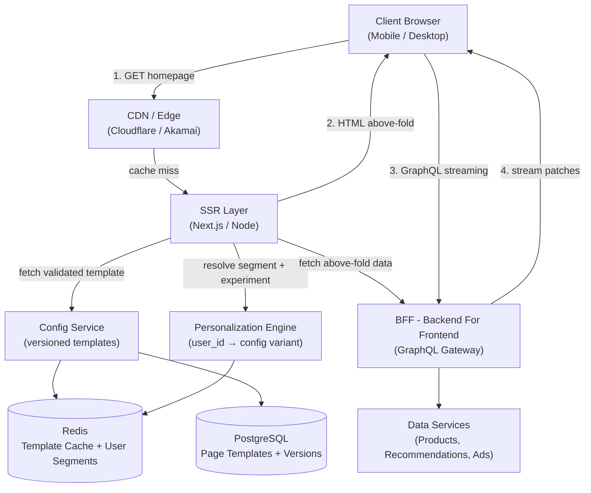
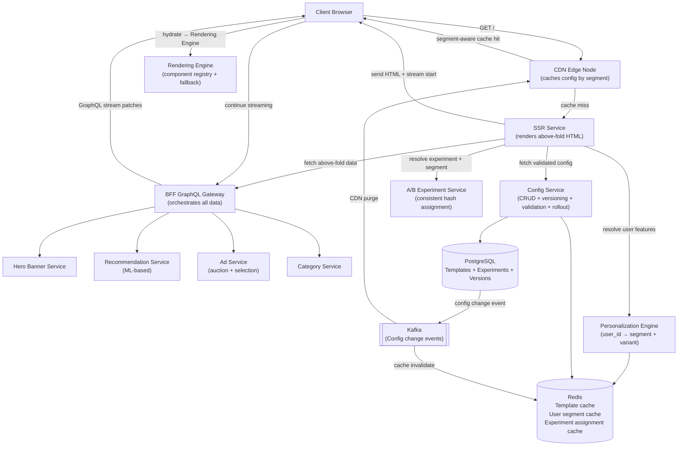
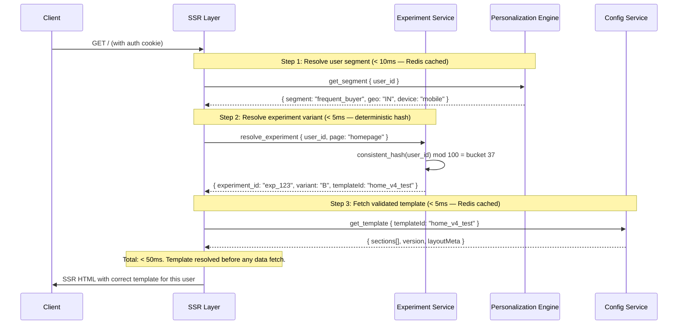

# System Design: Config-Driven Homepage (Amazon / eBay / Flipkart)

---

## 🧠 Mental Model

> **A homepage is not rendered by code. It is assembled dynamically from configuration, data, and experiments at runtime.**

Three systems collaborate to produce what the user sees:

| Layer | System | Responsibility |
|---|---|---|
| **What to show** | Config Service | Which sections, in what order, with what layout — versioned, validated, rolled out |
| **For whom to show it** | Personalization Engine | user_id → correct config variant based on history, geo, device, experiments |
| **How to show it** | Rendering Engine | config type → React component, with fallback and lazy loading |

This separation enables:
- A/B testing layouts without code deploys
- Personalization without frontend changes
- Progressive loading without API coordination
- Business teams controlling page structure without engineers

The system runs two paths:

- **Fast path**: CDN serves cached config → SSR renders above-the-fold → client hydrates → streams below-the-fold data
- **Reliable path**: Personalization + experiment assignment → correct template version per user cohort → consistent experience across sessions

```
                    ┌─────────────────────────────────────────────────────────────┐
                    │                      FAST PATH                               │
  ┌────────┐  req   │  ┌──────────┐  template  ┌──────────┐  SSR HTML            │
  │ Client │ ──────►│  │   CDN    │ ──────────►│ SSR Layer│ ──────────► browser  │
  └────────┘        │  └──────────┘  (cached)  └──────┬───┘  (above fold ready) │
                    │                                  │ stream below-fold        │
                    └──────────────────────────────────┼─────────────────────────┘
                                                       │ GraphQL @defer patches
                    ┌──────────────────────────────────▼─────────────────────────┐
                    │                    RELIABLE PATH                             │
                    │  Personalization Engine → correct template for this user    │
                    │  Config Service → versioned, validated template JSON        │
                    │  Rendering Engine → config type → React component           │
                    └─────────────────────────────────────────────────────────────┘
```

### ⚡ Core Design Principle

| Principle | Decision | Why |
|---|---|---|
| Config is a system | Versioned, validated, staged rollout — not just a JSON blob | Business teams change layouts 5-10x/week; bad config = production incident |
| Layout before data | Template JSON with fixed heights arrives first | Prevents CLS (Cumulative Layout Shift) — skeleton fills reserved space |
| Config in CDN | Page templates cached at edge, TTL 5 min | Config is cohort-static; CDN absorbs 90% of traffic |
| Data via GraphQL streaming | `@defer` for below-fold sections, `@stream` for list items | Critical path (above fold) renders immediately; rest loads progressively |
| SSR for above-the-fold | Server renders hero + critical sections, sends HTML | FCP and LCP under 1s; no blank screen on slow networks |
| Personalization on server | User cohort + experiment resolved before template sent | Client receives one correct template — no client-side conditional rendering |
| Rendering Engine | Frontend map of `type → React component` with fallback | Decouples backend config from frontend render logic; unknown types never crash |

---

## 1. Problem Statement & Scope

Design a configurable homepage platform (like Amazon/Flipkart) where:
- UI is driven by backend configuration (Server-Driven UI)
- Different users see different layouts (cohorts, A/B experiments)
- Data is fetched dynamically and personalized
- Page loads fast (FCP < 1s, LCP < 2.5s, CLS < 0.1)
- Business teams can change page layout without code deploys

**In scope:**
- Config Service (versioning, validation, rollout)
- Personalization Engine (segment resolution, experiment assignment)
- Rendering Engine (component registry, fallback, lazy loading)
- BFF (Backend For Frontend) data aggregation
- SSR + GraphQL streaming pipeline
- CDN/edge caching strategy

**Out of scope:**
- Product catalog service internals
- Recommendation ML model training
- Ads auction engine
- User authentication (assumed available)

---

## 2. Requirements

### Functional Requirements

1. **Config-driven layout** — backend sends template JSON defining sections, types, and order
2. **Personalization** — different users (cohorts, geographies, device types) see different templates
3. **A/B testing** — experiment variants without code deploys
4. **Progressive loading** — above-the-fold renders immediately; below-fold loads streaming
5. **Skeleton placeholders** — reserved layout space prevents CLS during data loading
6. **Business team control** — non-engineers can modify homepage layout via config dashboard
7. **Config rollout** — new templates staged (canary → 10% → 100%) with instant rollback

### Non-Functional Requirements

| Requirement | Target | Reasoning |
|---|---|---|
| Scale | 100M DAU, ~11,500 req/sec peak | Amazon-scale; CDN absorbs majority |
| FCP (First Contentful Paint) | < 1s | User sees content immediately |
| LCP (Largest Contentful Paint) | < 2.5s | Google Core Web Vital threshold |
| CLS (Cumulative Layout Shift) | < 0.1 | Layout must not jump when data loads |
| TTI (Time to Interactive) | < 3s | Page is responsive to user within 3s |
| Config availability | 99.99% | CDN fallback; stale config is better than no config |
| Personalization latency | < 50ms | Must not block critical path |

> [!NOTE]
> **Key Insight:** This is primarily a performance problem, not a storage problem. The challenge is not storing page configs — it is delivering them fast enough that the user sees content in < 1s on a slow 3G connection. Every architectural decision (CDN, SSR, @defer, fixed heights) exists to improve one of the Core Web Vitals.

---

## 3. Back-of-Envelope Estimations

```
Users:
  100M DAU
  Average 10 homepage loads/day per user → 1B page loads/day

Traffic:
  1B ÷ 86,400s = ~11,574 req/sec average
  Peak (2×): ~23,000 req/sec

CDN cache hit ratio:
  Config template: ~90% cache hit (mostly static, TTL 5 min)
  Server-side hits: ~2,300 req/sec after CDN

Data per page:
  ~5-8 data sources fetched in parallel (hero, recommendations, ads, categories, etc.)
  Each data source: ~10-50 KB
  Total per page: ~200 KB

Bandwidth:
  23,000 req/sec × 200 KB = ~4.6 GB/sec at peak (mostly CDN + S3)
  Application server: ~2,300 req/sec × 50 KB metadata = ~115 MB/sec

Config storage:
  10,000 templates (device × locale × experiment variants)
  Each template: ~5 KB
  Total: ~50 MB — fits entirely in Redis

Config versions per template:
  ~20 versions kept (rolling window) → ~1 GB PostgreSQL — trivial
```

---

## 4. API Design

### Config + Data (Combined — BFF GraphQL)

```
POST /graphql
  Headers: Authorization: Bearer {user_token}
           X-Device-Type: mobile | desktop | tablet
           X-Locale: en-IN | en-US
  Body:    { query: GetHomepage, variables: { userId, device, locale } }
  Response: Multipart HTTP (streaming) — see Section 6.3

GET /v1/homepage/config
  Headers: X-Device-Type, X-Locale, X-User-Segment
  Response: { templateId, version, sections[] }
  Purpose:  Config-only endpoint (for clients that separate config from data fetch)
  Cache:    CDN TTL 5 min (Vary: X-Device-Type, X-Locale, X-User-Segment)
```

### Config Management (Internal / Admin)

```
POST /admin/v1/templates
  Body:    { templateId, sections[], targetCohort, experimentId }
  Purpose: Create new template version (status: DRAFT)

POST /admin/v1/templates/{templateId}/validate
  Purpose: Run schema + component registry validation before publish
  Response: { valid: true } | { valid: false, errors: [...] }

POST /admin/v1/templates/{templateId}/publish
  Body:    { rolloutPercent: 10, targetCohort }
  Purpose: Stage rollout — start with 10%, expand to 100%

POST /admin/v1/templates/{templateId}/rollback
  Purpose: Instantly revert to previous live version

GET  /admin/v1/templates/{templateId}/versions
  Response: List of versions with status: DRAFT | STAGED | LIVE | DEPRECATED

POST /admin/v1/experiments
  Body:    { name, variants: [{ templateId, trafficPercent }], startAt, endAt }
  Purpose: Create A/B experiment assigning users to template variants
```

---

## 5. Architecture

### Simple High-Level Design



### Evolved Design (with A/B Testing + Edge Personalization + Streaming)



---

## 6. Deep Dives

### 6.1 Config Service — A First-Class System

> **Here's the problem we're solving: a homepage layout change sounds simple — "move this section up." But done wrong, it causes production incidents. Bad config = blank sections for millions of users. The Config Service is not a database for JSON blobs. It is a system with versioning, validation, and controlled rollout.**

Config has its own lifecycle:

```
DRAFT → REVIEW → STAGED (canary) → LIVE → DEPRECATED
```

**The template JSON schema:**

```json
{
  "templateId": "home_v3_mobile",
  "version": "v3",
  "status": "LIVE",
  "targetCohort": "in_mobile_new_user",
  "createdBy": "pm-team",
  "publishedAt": "2024-01-15T10:00:00Z",
  "sections": [
    {
      "id": "hero",
      "type": "HeroBanner",
      "position": 1,
      "layoutMeta": {
        "aboveTheFold": true,
        "height": 400,
        "width": "100%",
        "skeleton": "hero"
      },
      "dataSource": {
        "type": "graphql",
        "field": "hero"
      }
    },
    {
      "id": "recommendations",
      "type": "RecommendationCarousel",
      "position": 2,
      "layoutMeta": {
        "aboveTheFold": false,
        "height": 300,
        "skeleton": "carousel"
      },
      "dataSource": {
        "type": "graphql",
        "field": "recommendations"
      }
    },
    {
      "id": "ads_slot_1",
      "type": "AdBanner",
      "position": 3,
      "layoutMeta": {
        "height": 250,
        "reserved": true
      },
      "dataSource": {
        "type": "graphql",
        "field": "ads"
      }
    }
  ]
}
```

**Config validation (runs on every publish attempt):**

Before any template can go live, the Config Service runs these checks:

| Validation Rule | Why It Matters | Error if violated |
|---|---|---|
| All sections have `layoutMeta.height` | Missing height = CLS in production | Block publish |
| All `type` values exist in component registry | Unknown type = blank section rendered | Block publish |
| All `dataSource.field` values are valid GraphQL fields | Bad field = no data for section | Block publish |
| No two sections have the same `position` | Ordering conflict = unpredictable layout | Block publish |
| `targetCohort` exists in Personalization Service | Invalid cohort = template never served | Warn, allow publish |

```
PM creates template → POST /admin/v1/templates (status: DRAFT)
PM clicks "Validate"  → POST /admin/v1/templates/{id}/validate
  Config Service checks all 5 rules
  Returns: { valid: true } or { valid: false, errors: ["type 'FlashSale' not in registry"] }
PM clicks "Publish"   → POST /admin/v1/templates/{id}/publish { rolloutPercent: 10 }
  Config Service sets status: STAGED, serves to 10% of target cohort
  Config Service publishes Kafka event: { type: "config_staged", templateId, cohorts[] }
  Monitoring: track error rate, CLS metrics for 10% cohort
PM expands to 100%    → POST /admin/v1/templates/{id}/publish { rolloutPercent: 100 }
  Config Service sets status: LIVE, previous version → DEPRECATED
```

**Config versioning — why we keep history:**

```
home_v3_mobile:
  v1 → DEPRECATED (2024-01-01) — original layout
  v2 → DEPRECATED (2024-01-10) — added flash sale section
  v3 → LIVE       (2024-01-15) — A/B test variant B layout

Rollback: POST /admin/v1/templates/home_v3_mobile/rollback
  → v2 instantly becomes LIVE
  → Kafka event → CDN purge + Redis invalidation
  → All edge nodes serve v2 within 30s
```

> [!IMPORTANT]
> **Config Service is a production system, not a feature.** Every section must be validated before publish. A template with `"type": "FlashSaleTimer"` that the Rendering Engine doesn't know about will render a blank section for every user in that cohort. Config validation at publish time is cheaper than a production incident at 11,500 req/sec.

> [!NOTE]
> **Key Insight:** Config versioning is not for history — it is for rollback speed. When a bad template goes live, rollback must be instant. Keeping the previous LIVE version in PostgreSQL (and cached in Redis) means rollback is a status flip, not a re-deploy.

---

### 6.2 Rendering Engine — Config to Component

> **Here's the problem: the backend sends `"type": "HeroBanner"` in the config JSON. How does the frontend know what to render? And what happens when it receives a type it has never seen?**

The Rendering Engine is the contract between backend config and frontend components:

```
Config JSON
  section.type = "HeroBanner"
       │
       ▼
  Component Registry
  { "HeroBanner": HeroBannerComponent, ... }
       │
       ▼
  Component Instance
  <HeroBannerComponent data={...} layoutMeta={...} />
       │
       ▼
  Rendered Output (or Skeleton → Fallback → Error boundary)
```

**Component Registry:**

```javascript
// Maps config type → React component
// New component types require a frontend deploy
// New layout changes (order, height, cohort) do NOT require a deploy
const componentRegistry = {
  "HeroBanner":             HeroBannerComponent,
  "RecommendationCarousel": RecommendationCarousel,
  "AdBanner":               AdBanner,
  "CategoryGrid":           CategoryGrid,
  "FlashSaleTimer":         FlashSaleTimer,
  "SearchBar":              SearchBarComponent,
  "NavigationBar":          NavigationBar,
};
```

**Rendering Engine with fallback handling:**

```javascript
function SectionRenderer({ section, data }) {
  const Component = componentRegistry[section.type];

  // Unknown component type — backend sent a type this client doesn't support
  // Happens during gradual rollout of new component types
  if (!Component) {
    console.warn(`Unknown section type: ${section.type}`);
    // Render empty space at reserved height — no CLS, no crash
    return <div style={{ height: section.layoutMeta.height }} aria-hidden />;
  }

  // Fixed height from layoutMeta prevents CLS
  return (
    <div style={{ height: section.layoutMeta.height, minHeight: section.layoutMeta.height }}>
      <ErrorBoundary
        fallback={<SectionError height={section.layoutMeta.height} />}
      >
        {!data ? (
          // Skeleton fills reserved space while data loads
          <Skeleton type={section.layoutMeta.skeleton} />
        ) : (
          <Component {...data} layoutMeta={section.layoutMeta} />
        )}
      </ErrorBoundary>
    </div>
  );
}
```

**Lazy loading — above-fold vs below-fold:**

```javascript
// Above-fold components: eagerly loaded in main bundle (must be ready at FCP)
import HeroBannerComponent from './HeroBanner';
import NavigationBar from './NavigationBar';

// Below-fold components: lazy loaded (not needed until user scrolls)
const RecommendationCarousel = React.lazy(() => import('./RecommendationCarousel'));
const AdBanner               = React.lazy(() => import('./AdBanner'));
const FlashSaleTimer         = React.lazy(() => import('./FlashSaleTimer'));

// Intersection Observer triggers lazy load when section enters viewport
function LazySection({ section, data }) {
  const [inView, setInView] = React.useState(false);
  const ref = React.useRef(null);

  React.useEffect(() => {
    const observer = new IntersectionObserver(
      ([entry]) => { if (entry.isIntersecting) setInView(true); },
      { rootMargin: "200px" } // pre-load 200px before visible
    );
    if (ref.current) observer.observe(ref.current);
    return () => observer.disconnect();
  }, []);

  return (
    <div ref={ref}>
      {inView
        ? <React.Suspense fallback={<Skeleton type={section.layoutMeta.skeleton} />}>
            <SectionRenderer section={section} data={data} />
          </React.Suspense>
        : <Skeleton type={section.layoutMeta.skeleton} height={section.layoutMeta.height} />
      }
    </div>
  );
}
```

**Three failure modes the Rendering Engine must handle:**

| Failure | What happens | Recovery |
|---|---|---|
| Unknown `section.type` | Not in registry (new type, old client) | Render empty reserved space — no crash, no CLS |
| Component throws (runtime error) | ErrorBoundary catches | Show error state at reserved height |
| Data timeout (section data never arrives) | Skeleton remains visible indefinitely | Show "refresh" prompt after 5s timeout |

> [!NOTE]
> **Key Insight:** The component registry is a versioning boundary. Backend config and frontend components must be deployed independently. Unknown types must degrade gracefully — not crash. This means a new `"FlashSaleTimer"` section can be added to config during a gradual rollout; old clients ignore it gracefully while new clients render it.

---

### 6.3 GraphQL Streaming (@defer + @stream)

> **The problem: above-the-fold data should arrive in < 200ms. Below-the-fold data (recommendations, ads) takes 500ms+. A single blocking request would delay everything.**

**The GraphQL query with streaming directives:**

```graphql
query GetHomepage($userId: ID!, $device: DeviceType!, $locale: String!) {
  userContext(userId: $userId) {
    userId
    segment { id type }
    location { country }
  }

  homepageTemplate(device: $device, locale: $locale) {
    templateId
    sections {
      id
      type

      # Above-the-fold: NO @defer — must arrive in first response
      hero {
        headline
        imageUrl
        ctaText
        ctaUrl
      }

      # Below-fold: @defer — arrives as a separate patch
      recommendations @defer(label: "rec-section") {
        items @stream(initialCount: 2) {
          id
          title
          imageUrl
          price
          rating
        }
      }

      # Ads: deferred, non-blocking
      ads @defer(label: "ads-section") {
        placements {
          slotId
          imageUrl
          clickUrl
        }
      }
    }
  }
}
```

**Initial response (fast — < 200ms):**

```json
{
  "data": {
    "homepageTemplate": {
      "sections": [
        { "id": "hero", "hero": { "headline": "Welcome Back", "imageUrl": "..." } },
        { "id": "recommendations", "recommendations": null },
        { "id": "ads_slot_1", "ads": null }
      ]
    }
  },
  "hasNext": true
}
```

**Incremental patch (arrives 300–500ms later):**

```json
{
  "incremental": [
    {
      "path": ["homepageTemplate", "sections", 1, "recommendations"],
      "data": {
        "items": [
          { "id": "p1", "title": "iPhone 15", "price": 79999 },
          { "id": "p2", "title": "Samsung S24", "price": 69999 }
        ]
      }
    }
  ],
  "hasNext": false
}
```

**Client streaming handler:**

```javascript
async function fetchHomepage(query, variables, onUpdate) {
  const response = await fetch("/graphql", {
    method: "POST",
    headers: { "Content-Type": "application/json" },
    body: JSON.stringify({ query, variables })
  });

  const reader = response.body.getReader();
  const decoder = new TextDecoder();
  let result = {};

  while (true) {
    const { done, value } = await reader.read();
    if (done) break;

    const chunk = JSON.parse(decoder.decode(value));

    if (chunk.data) {
      result = { ...result, ...chunk.data };
    }

    if (chunk.incremental) {
      chunk.incremental.forEach(patch => {
        applyPatch(result, patch.path, patch.data);
      });
    }

    onUpdate({ ...result });  // re-render with latest state
  }
}

function applyPatch(obj, path, value) {
  let ref = obj;
  for (let i = 0; i < path.length - 1; i++) {
    ref = ref[path[i]];
  }
  ref[path[path.length - 1]] = value;
}
```

> [!NOTE]
> **Key Insight:** `@defer` gives you the best of both worlds — one HTTP connection (no request waterfall), but progressive rendering. The above-fold hero renders in < 200ms. The below-fold carousel renders at 400ms when its data arrives. Without `@defer`, you wait for the slowest data source (500ms) before rendering anything.

---

### 6.4 Personalization Engine

> **Here's the problem: Amazon has 300M+ customers. A first-time mobile user in rural India should see a different homepage than a Prime power buyer in New York. But the system cannot run ML inference per request — that's 11,500 req/sec of real-time ML. The Personalization Engine solves this by resolving users to cohorts, and cohorts to templates.**

**Input → Output:**

```
Input:  user_id = "u_abc123"
Output: config variant = { templateId: "home_v4_test", experimentVariant: "B" }
```

**The four signals that shape personalization:**

| Signal | Source | What it determines |
|---|---|---|
| **User history** | ML model (purchase/browse data) | Segment: `new_user`, `frequent_buyer`, `lapsed`, `deal_hunter` |
| **Location** | IP → geo lookup | Region, currency, promotions, language |
| **Device** | User-Agent header | `mobile`, `desktop`, `tablet` → different layout templates |
| **Experiments** | Experiment Service | Active A/B variant for this user |

**Personalization resolution pipeline:**



**Segment resolution — how users are bucketed:**

```
User signals → ML model → Segment

new_user:        < 3 purchases, registered < 30 days
frequent_buyer:  >= 10 purchases/month, high GMV
lapsed:          no purchase in 90 days
deal_hunter:     high click-through on sale sections
prime_member:    Prime subscription active
geo_IN_mobile:   India + mobile device (explicit geo template)

Priority: experiment override > user segment > geo + device > default
```

**Why this priority matters:**

```
User is: frequent_buyer (segment)
         geo: IN, device: mobile
         Active experiment: exp_123 variant B

Resolution:
  1. experiment override exists → use templateId from experiment (exp wins)
  2. No experiment override → use frequent_buyer IN mobile template
  3. No segment template → use generic IN mobile template
  4. No geo template → use global default

Result: user always gets the most specific match, never a blank page
```

**Consistent hashing for A/B experiments:**

```
user_id = "u_abc123"
bucket  = consistent_hash("u_abc123") mod 100 = 37

Experiment config:
  variant_A: buckets 0-49   → templateId: "home_v3_control"
  variant_B: buckets 50-79  → templateId: "home_v4_test"
  variant_C: buckets 80-99  → templateId: "home_v5_test2"

User in bucket 37 → always sees variant_A across all sessions
```

**Why consistent hashing matters:**

```
Without consistent hash:
  User refreshes page → different random bucket → different template each time
  → User experience is inconsistent
  → A/B test results are polluted (same user counted in both variants)

With consistent hash:
  User always maps to same bucket
  → Consistent experience
  → Clean experiment data
```

> [!IMPORTANT]
> **Personalization must resolve in < 50ms.** If the segment lookup blocks the critical path, FCP degrades. The segment result is cached in Redis with TTL 10 min per user. On cache miss, the fallback is the default template — never block page render waiting for ML inference. The ML model runs offline (batch job), not per request.

> [!NOTE]
> **Key Insight:** The Personalization Engine is not an ML system at request time — it is a lookup system. ML runs offline to assign users to segments. The engine just maps user_id → segment → templateId in < 50ms using Redis. Real-time ML inference per homepage request would add 200-500ms latency — unacceptable for FCP < 1s.

---

### 6.5 SSR + Streaming Performance Pipeline

> **The performance problem: a user on 3G in India opens Amazon. If we wait for all data before sending HTML, FCP is 3–5 seconds. With SSR + streaming, FCP is under 1 second.**

**The rendering pipeline:**

```
1. Request arrives at SSR layer
2. Resolve experiment + cohort (< 50ms, Redis cached)
3. Fetch validated template config (< 5ms, Redis cached)
4. Fetch above-fold data in parallel (hero, user name, nav) (< 150ms)
5. Server renders HTML with above-fold content + skeleton placeholders for below-fold
6. Send HTML to client → FCP achieved (< 400ms total)
7. Client receives HTML, browser parses and renders
8. Client JS hydrates React components via Rendering Engine
9. Client opens GraphQL streaming connection
10. Below-fold patches arrive (recommendations, ads) → React fills skeletons
```

**React component renderer with skeleton:**

```javascript
function SectionRenderer({ section, data }) {
  const Component = componentRegistry[section.type];

  if (!Component) {
    return <div style={{ height: section.layoutMeta.height }} aria-hidden />;
  }

  // Fixed height from layoutMeta prevents CLS
  return (
    <div style={{ height: section.layoutMeta.height, minHeight: section.layoutMeta.height }}>
      {!data ? (
        // Skeleton fills reserved space while data loads
        <Skeleton type={section.layoutMeta.skeleton} />
      ) : (
        <Component {...data} />
      )}
    </div>
  );
}
```

**Core Web Vitals targets and mechanisms:**

| Metric | Target | Mechanism |
|---|---|---|
| FCP | < 1s | SSR sends HTML with above-fold content immediately |
| LCP | < 2.5s | Hero image URL in first SSR response; preloaded via `<link rel="preload">` |
| CLS | < 0.1 | Fixed `height` in `layoutMeta`; skeleton fills reserved space |
| TTI | < 3s | Critical JS bundle < 100KB; hydration deferred for below-fold |
| INP | < 200ms | Below-fold rendered with `requestIdleCallback` after hydration |

> [!NOTE]
> **Key Insight:** CLS is zero if and only if every section has a fixed height in the template JSON. The skeleton and the real component occupy the same pixel space. This is the most important constraint in the entire template schema — a backend developer changing a section's height must know it will cause visual shift on millions of clients.

---

### 6.6 Edge Caching Strategy

> **The problem: 11,500 req/sec for a homepage that is 90% identical across users (except personalization). Hitting the origin for every request wastes compute.**

**What to cache and where:**

| Content | Cache layer | TTL | Cache key |
|---|---|---|---|
| Template JSON (per cohort) | CDN edge node | 5 min | `device + locale + segment` |
| Hero banner image | CDN | 1 hour | URL hash |
| Non-personalized section data (categories, nav) | CDN | 5 min | `locale + device` |
| User-specific data (recommendations, cart) | Not cached | — | Never cached at CDN |
| Experiment assignment | Redis | 10 min | `user_id + experiment_id` |
| User segment | Redis | 10 min | `user_id` |

**Cache invalidation on config change:**

```
Business team updates template → Config Service writes to PostgreSQL
  → Publishes event to Kafka: { type: "config_changed", templateId, cohorts[] }
  → CDN invalidation worker: purge edge nodes for affected cohorts (< 30s)
  → Redis invalidation: DEL template:{cohort}:{device} (immediate)

Worst case: user sees stale template for CDN TTL (5 min)
This is acceptable — layout changes are not time-critical
```

> [!NOTE]
> **Key Insight:** Personalized data (recommendations, ads, cart) must never be cached at CDN. CDN cache keys can only vary by coarse dimensions (device, locale, segment). User-specific data is fetched server-side and streamed separately. The split between "cacheable template" and "non-cacheable data" is the fundamental architecture of this system.

---

## 7. ⚖️ Key Trade-offs

### Trade-off 1: Server-Driven UI vs Hardcoded UI

| Dimension | Server-Driven UI (chosen) | Hardcoded Frontend |
|---|---|---|
| Layout changes | Config update — no deploy | Frontend code change + deploy |
| A/B testing | Template variants — instant | Feature flags in code |
| Performance | Extra config fetch (~5ms Redis) | No overhead |
| Debugging complexity | Higher — layout from server | Lower — layout in code |
| Client flexibility | Limited by component registry | Full control |

**Chosen: Server-Driven UI.**
Business velocity is the primary reason — product teams change homepage layouts 5–10 times per week at Amazon scale. Requiring an engineer and a deploy for each layout change is not viable. The trade-off we accept is debugging complexity (hard to predict what a user sees without knowing their cohort/experiment), which is mitigated by a config dashboard that shows the template for any user segment.

> [!NOTE]
> **Key Insight:** Server-Driven UI shifts ownership of the page from engineering to product. The trade-off is that the frontend becomes a rendering substrate — it must handle any layout the backend sends, including layouts it has never seen. The Rendering Engine's fallback handling is what makes this safe.

---

### Trade-off 2: Flexibility vs Complexity (Config Schema)

| Dimension | Rich Config (high flexibility) | Lean Config (low flexibility) |
|---|---|---|
| Config size | ~20 KB per template | ~2–5 KB per template |
| Layout control | Per-section fine-grained (margins, fonts, colors) | Structure only (sections, order, height) |
| Config fetch latency | Higher — more to transfer and parse | Lower — fast CDN delivery |
| Frontend coupling | Frontend must implement every config field | Frontend implements section-level contract |
| Business team power | Can control visual details without deploy | Can control structure, not style |

**Chosen: Lean config (~5 KB) containing layout structure only.**
Config controls *what* appears and *in what order*. Styling stays in the component implementation — not in the config. The trade-off we accept is that visual style changes (font size, colors) still require a frontend deploy. This is correct: config schema changes are risky (they affect every user in a cohort). Style changes belong in component code where engineers control them.

> [!NOTE]
> **Key Insight:** Config schema is a production contract, not a design file. Every field you add to config is a field every client must parse and validate. Lean config = fewer fields = fewer validation failures = fewer production incidents. Put styling in components, structure in config.

---

### Trade-off 3: Backend-Driven vs Frontend Control

| Dimension | Backend-Driven (chosen) | Frontend Control |
|---|---|---|
| Who owns page layout | Product/PM team | Frontend engineering |
| Iteration speed | Config update → live in < 30s | Code change + review + deploy |
| Type safety | Config schema + codegen (generated types) | Native TypeScript throughout |
| Unknown types | Must degrade gracefully (fallback in Rendering Engine) | Compile-time error catches unknowns |
| Rollback | Instant — revert config version | Full revert deploy |
| Experimentation | Backend controls variant assignment | Frontend feature flags per-engineer |

**Chosen: Backend-driven.**
The primary driver is product iteration speed. At Amazon scale, a PM should be able to run a homepage A/B test on Monday, see results Wednesday, and ship to 100% on Friday — without touching code. The trade-off we accept is that the frontend is a dumb rendering substrate: it cannot make layout assumptions. Every component must be defensively written — handle missing data, unknown section types, and config version mismatches.

> [!NOTE]
> **Key Insight:** Backend-driven UI is a product velocity decision, not a technical one. The engineering cost is a more defensive Rendering Engine. The business benefit is shipping layout experiments 10x faster than code-driven alternatives.

---

### Trade-off 4: Config Size vs Latency

| Dimension | Fat Config per request | Lean Config + CDN |
|---|---|---|
| Config delivery | Inline in HTML (zero extra RTT) | Separate CDN fetch (~5ms) |
| Payload size | +20 KB in every HTML response | Separate cacheable asset |
| Caching | Cannot cache — personalized HTML | CDN caches config by cohort |
| Cache invalidation | Not applicable | Kafka → CDN purge on change |
| Mobile impact | Larger initial HTML parse | Parallel fetch, cached after first load |

**Chosen: Lean config fetched separately from CDN.**
Inlining config in every HTML response prevents CDN caching of the config itself. Cohort templates are mostly static — the same `home_v3_mobile` template serves millions of `frequent_buyer_IN` users. CDN caching at cohort granularity achieves 90% hit rate and saves ~23,000 server calls/sec at peak. The 5ms extra RTT is negligible compared to the infrastructure savings.

---

### Trade-off 5: GraphQL Streaming vs Multiple REST Requests

| Dimension | GraphQL @defer/@stream (chosen) | Multiple REST requests |
|---|---|---|
| Connections | 1 HTTP connection | 5–8 parallel HTTP connections |
| Progressive render | Native — each @defer patch updates UI | Manual — each response triggers re-render |
| Request waterfall | None — single connection | Possible if requests are sequential |
| Browser overhead | Lower (1 connection) | Higher (connection limits per host) |
| Implementation complexity | Higher (streaming client, patch merge) | Lower (simple fetch) |

**Chosen: GraphQL streaming with @defer.**
One connection with progressive patches is strictly better for mobile (where connection setup is expensive). The trade-off we accept is client-side complexity — the streaming handler and patch merge logic. This is abstracted into a reusable hook used by all clients.

---

### Trade-off 6: SSR vs Pure CSR vs Static Generation

| Dimension | SSR + Streaming (chosen) | Pure CSR | Static (SSG) |
|---|---|---|---|
| FCP | < 1s (HTML from server) | 2–4s (JS loads first) | < 500ms (pre-built HTML) |
| Personalization | Per-request on server | Client-side after JS load | Not possible |
| A/B testing | Server-resolved | Client-resolved (CLS risk) | Not possible |
| Infrastructure cost | Server compute per request | CDN only | CDN only |
| Stale risk | None | None | Yes — rebuild on content change |

**Chosen: SSR + GraphQL streaming.**
Pure CSR means a blank screen until JS loads — unacceptable for FCP. Static generation cannot personalize per user. SSR resolves personalization server-side and streams progressively, combining the best of both. The trade-off we accept is server compute cost (~2,300 req/sec after CDN), which is justified by the FCP and personalization requirements.

> [!NOTE]
> **Key Insight:** Static generation works for marketing pages. It cannot work for a homepage that must show "Hello, [Name]" or "You have 3 items in your cart." SSR is not optional when personalization is a requirement — it is the only architecture that achieves both fast FCP and correct user-specific content.

---

### Trade-off 7: Cohort-Level CDN Caching vs User-Level Caching

| Dimension | Cohort-level (chosen) | User-level |
|---|---|---|
| Cache hit ratio | High — cohort shared across millions | Low — each user is unique |
| Personalization granularity | Segment-level (e.g., "frequent_buyer_IN") | Per-user |
| CDN storage | Small — N cohort × M device templates | Unbounded |
| Staleness | 5 min TTL — same for all users in cohort | Per-user TTL |

**Chosen: Cohort-level CDN caching.**
User-level CDN caching is not feasible — it requires the CDN to store billions of entries with effectively zero cache hit improvement (each user's page is unique). Cohort-level caching achieves 90% cache hit ratio because 80% of users share a cohort template. Truly user-specific data (recommendations, cart) bypasses the CDN entirely and is streamed server-side.

---

## 8. Interview Summary

### Decision Table

| Decision | Problem It Solves | Trade-off Accepted |
|---|---|---|
| Server-Driven UI (config JSON) | Layout changes without code deploys | Debugging complexity; component registry must be maintained |
| Config Service with validation + versioning | Bad config = production incident for millions; rollback must be instant | Config schema is a production contract — schema changes require care |
| Rendering Engine with fallback | Unknown component types must not crash the page | Frontend is a dumb rendering substrate; must handle any type gracefully |
| Personalization Engine (user_id → cohort → template) | 300M users, different layouts — resolved in < 50ms | ML runs offline; real-time signal = cache miss → fallback to default |
| Consistent hash for A/B | User must see same variant every session; experiment data must be clean | Cannot change experiment boundaries while it runs |
| Fixed `height` in layoutMeta | CLS = 0 — no layout shift when data loads | Backend must know pixel heights; inflexible for responsive design |
| CDN caches config by cohort | 90% traffic absorbed at edge | Personalization only at cohort granularity, not per-user |
| GraphQL @defer for below-fold | Above-fold renders in < 200ms; rest streams in | Complex streaming client; patch merge logic |
| Kafka for cache invalidation | Config change propagates to CDN + Redis within 30s | Up to 5 min stale for CDN TTL window |

### Mental Model Summary

A config-driven homepage is assembled from three systems at runtime. The **Config Service** holds versioned, validated templates — it is not a JSON blob store, it is a production system with schema validation and staged rollout. The **Personalization Engine** maps user_id → segment → experiment variant → templateId in under 50ms using Redis, with ML running offline in batch. The **Rendering Engine** maps `section.type → React component` on the client, with graceful fallback for unknown types. **GraphQL streaming** (@defer) delivers above-fold data in the first response (<200ms) and below-fold data as patches. **SSR** resolves personalization server-side, sends HTML immediately for FCP < 1s, then the client hydrates and continues streaming. **Cohort-level CDN caching** absorbs 90% of traffic.

### Key Insights Checklist

- **A homepage is assembled, not rendered.** Config decides structure. Personalization Engine decides which config. Rendering Engine decides how to paint it. No single system owns the page.
- **Config is a first-class system.** Every template is versioned, validated before publish, and staged gradually. A bad template at 11,500 req/sec is a production incident — schema validation at publish time is cheaper than a rollback drill.
- **The Rendering Engine must handle unknowns.** Config and client are deployed independently. Unknown `section.type` must degrade gracefully — empty reserved space, never a crash. This is what makes config and frontend truly decoupled.
- **Personalization is a lookup, not inference.** ML runs offline. At request time, Personalization Engine maps user_id → Redis → segment → templateId in < 50ms. Real-time ML inference per request would blow the FCP budget.
- **Layout before data — always.** The template JSON with fixed section heights must arrive before any data. CLS = 0 requires every skeleton to occupy the same pixel space as the real component.
- **@defer is not optional for performance.** Without it, the page waits for the slowest data source before rendering anything. With @defer, above-fold renders in < 200ms and below-fold fills in progressively.
- **CDN caches cohorts, not users.** User-level CDN caching has near-zero hit rate. Cohort-level (device + locale + segment) achieves 90% hit rate. Truly personalized data bypasses CDN entirely.

---

## 9. Frontend Notes

**Frontend / Backend split: 50% backend, 50% frontend.** The Config Service, Personalization Engine, and BFF aggregation are the backend core. But the Rendering Engine, SSR pipeline, streaming client, skeleton management, and hydration are equally critical and equally interview-worthy.

| Concept | What to say in an interview |
|---|---|
| **Component Registry** | A frontend map of `section.type → React component`. Backend sends `"type": "HeroBanner"` in config; client looks up the component. New component types require a frontend deploy; layout changes do not. Unknown types must degrade gracefully. |
| **Rendering Engine fallback** | If `section.type` is not in the registry, render empty reserved space (not a crash). If the component throws, ErrorBoundary catches it and shows a section-level error state. This decoupling is what makes independent deploy safe. |
| **Skeleton Placeholders** | Every section renders a skeleton at the exact pixel height from `layoutMeta.height` before data arrives. This is what achieves CLS < 0.1. The skeleton and the real component must occupy identical space. |
| **Lazy loading below-fold** | Above-fold components eagerly bundled. Below-fold: `React.lazy()` + `Suspense` + `IntersectionObserver` with 200px rootMargin. Reduces initial bundle by ~40%; components load as user scrolls toward them. |
| **GraphQL Streaming Client** | Single `fetch()` call reads a streaming multipart HTTP response. Each `chunk.incremental` patch is applied to the result tree via path-based merge. React re-renders incrementally — only patched sections update. |
| **React Hydration** | SSR sends HTML with above-fold content rendered. Client JS hydrates (attaches event handlers) without re-rendering. Below-fold sections start with skeleton HTML from SSR; streaming patches trigger React state updates to replace skeletons. |
| **requestIdleCallback for below-fold** | Below-fold hydration deferred to idle time. Above-fold hydration runs immediately. This keeps TTI < 3s even on low-end devices. |
