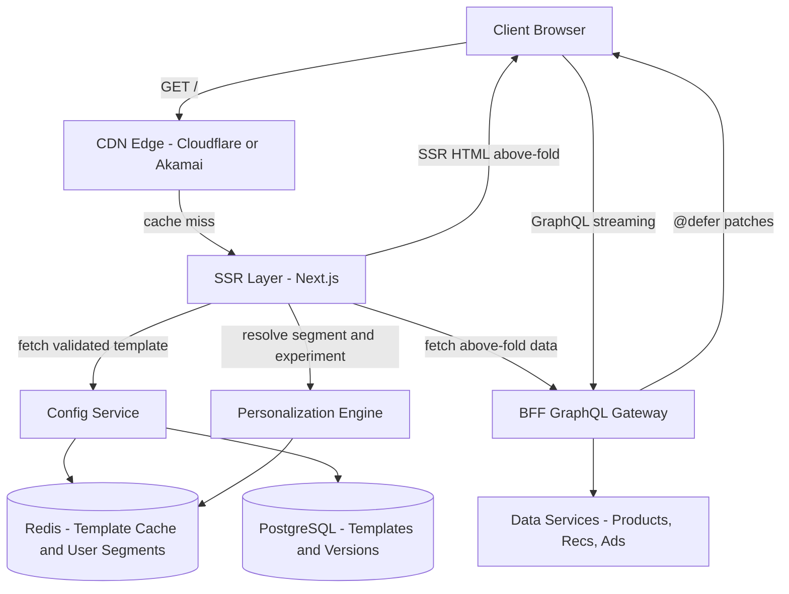
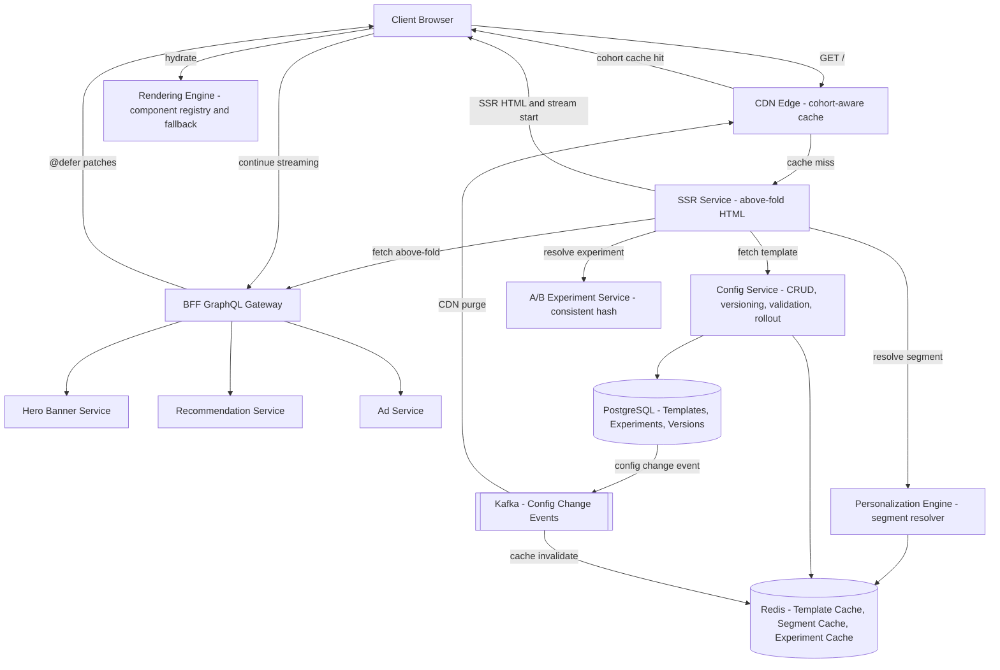
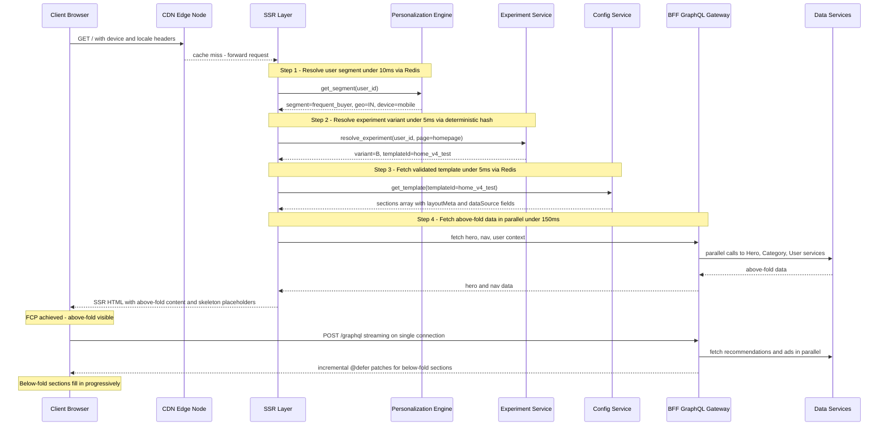
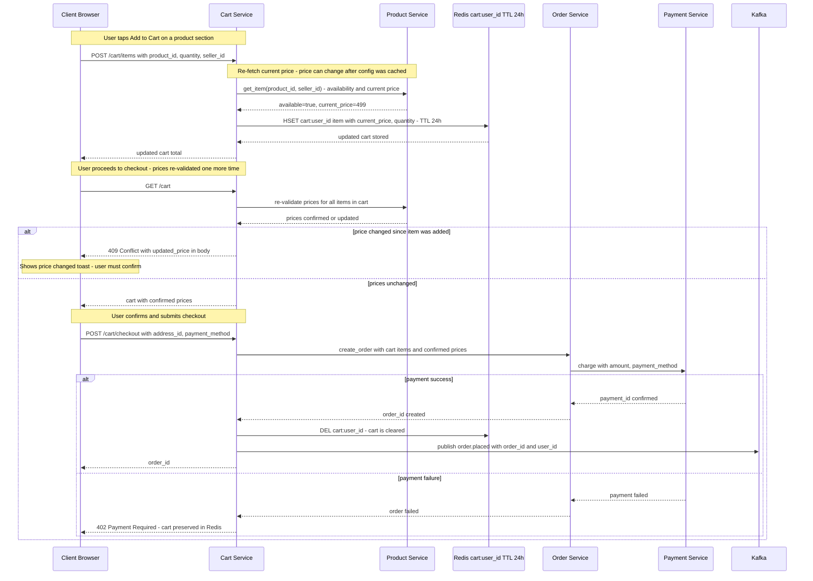
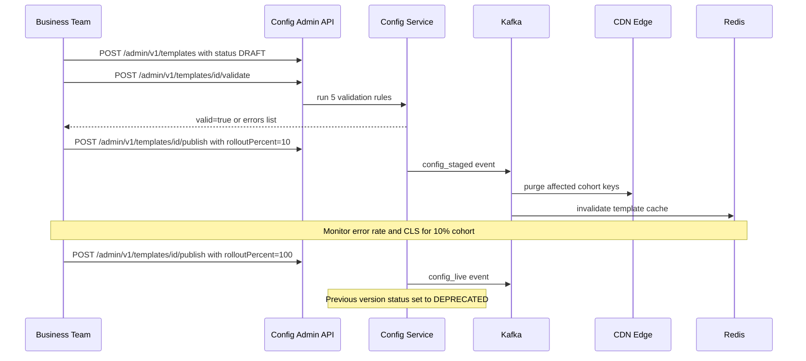
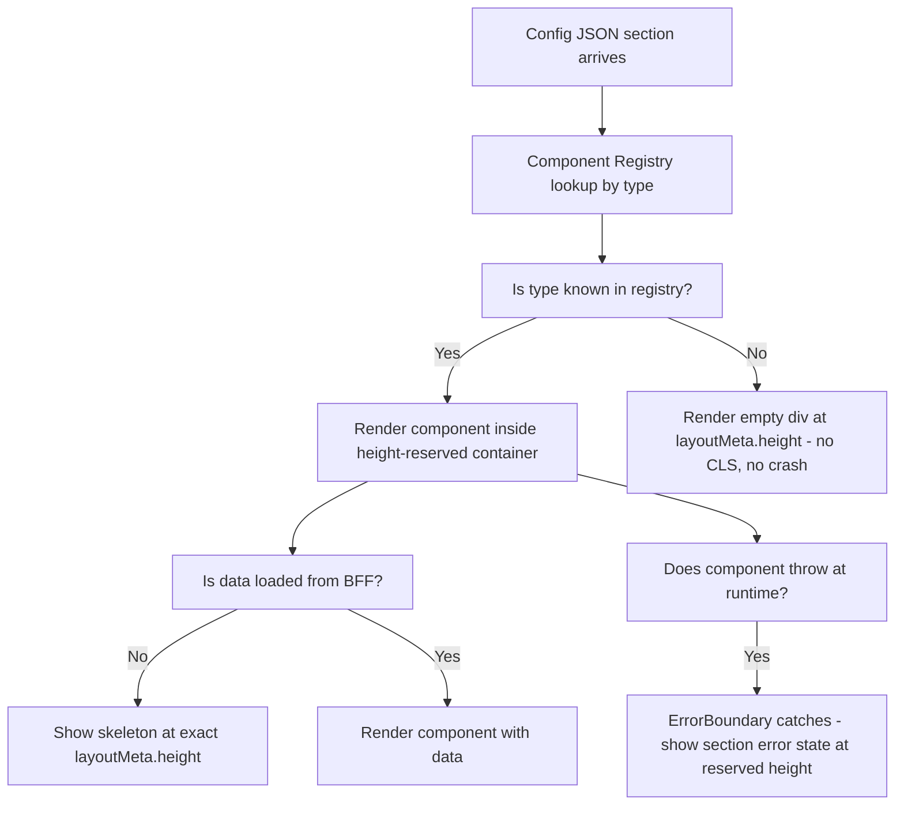
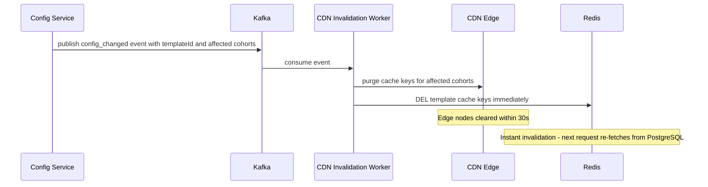

# System Design: Config-Driven Homepage (Amazon / Flipkart / eBay)

---

## 1. What Is a Config-Driven Homepage?

Amazon and Flipkart's homepages don't look the same to everyone who opens them. A frequent shopper on mobile in India sees a different arrangement of banners, categories, and recommendations than a first-time visitor on a laptop in another country — and which arrangement each of them gets is decided entirely by a configuration file the backend sends down, not by code baked into the app. That matters because business teams change what's on the homepage five to ten times a week, and none of those changes should require an engineer to write code and ship a new app release.

The hard part isn't deciding what to show — it's showing it fast. The page still has to feel instant: content visible in under a second, the largest piece of content painted within a couple of seconds, and nothing on the page jumping around as the rest of it loads in. Everything in this design exists in service of making a page that's assembled at request time feel just as fast and stable as one that was hardcoded months in advance.

---

## 2. A Day in the Life

Ananya opens the app on her phone during her evening commute in Mumbai. She doesn't type anything or wait for a login screen — the page just appears, and it already seems to know her. She's a frequent shopper, always on mobile, always browsing from India, and the homepage in front of her is arranged around that: a hero banner she's likely to actually tap, categories she actually shops in, laid out in an order a brand-new visitor's page wouldn't share.

The top of the page — hero banner, navigation, categories — shows up almost instantly, with a few gray placeholder boxes already sitting exactly where content hasn't arrived yet. Nothing shifts or jumps as the rest of the page keeps loading; the boxes are already the right size, so when the real recommendations and ads slide into them a moment later, it looks like they'd been there the whole time.

She spots a pair of shoes she likes and taps to add them to her cart. The app doesn't just trust the price it showed her on the homepage — quietly, in the background, it double-checks that price against the real source of truth before the item actually lands in her cart, in case something changed since that section of the page was cached. A minute later she heads to checkout. The app checks the price one more time; nothing's changed, so she confirms her address and payment method, and a few seconds later her order is placed.

What Ananya never sees: that the exact layout she got — which sections, in what order, at what size — was published by a product team through a dashboard, not shipped in an app update; that a different shopper opening the same app at the very same moment might see a deliberately different arrangement, as part of an experiment neither of them knows they're in; and that if the price of those shoes had ticked up in the seconds between her adding them and confirming checkout, the app would have stopped her cold and asked her to confirm the new price before charging her anything. Everything from here on is how that experience actually gets built.

---

## 3. Requirements — and Why They Matter

**Scope.** In scope: Config Service (versioning, validation, staged rollout), Personalization Engine (segment resolution, experiment assignment), Rendering Engine (component registry, fallback, lazy loading), BFF data aggregation, SSR + GraphQL streaming pipeline, CDN/edge caching strategy. Out of scope: product catalog service internals, recommendation ML model training, ads auction engine, user authentication.

**Functional requirements:**

1. **Config-driven layout** — backend sends template JSON defining sections, types, and order; clients render without knowing the layout at build time
2. **Personalization** — different users (cohorts, geo, device) see different templates resolved server-side before the first byte is sent
3. **A/B testing** — experiment variants assigned consistently per user without code deploys or frontend changes
4. **Progressive loading** — above-fold renders immediately; below-fold sections stream in as data arrives
5. **Skeleton placeholders** — every section reserves fixed pixel space before data loads, preventing layout shift
6. **Business team control** — non-engineers modify homepage layout via config dashboard; no engineer required for layout changes
7. **Config rollout** — new templates staged (canary to 10% to 100%) with instant rollback capability

<details markdown="1">
<summary><strong>Point to Ponder:</strong> What happens if the Personalization Engine can't resolve a user's segment in time — or at all?</summary>

It doesn't block the page. A segment lookup is a Redis read with a 10-minute TTL, and on a cache miss the system falls back to the default segment rather than waiting on anything slower. If the Personalization Engine is unavailable entirely, the design goes one step further and falls back to a global default template — no personalization, but never a blank page either. See §9 Bottlenecks & Scaling and §7 Data Model for the fallback mechanics.

</details>

<details markdown="1">
<summary><strong>Point to Ponder:</strong> What if a business team publishes a config with a mistake in it — how far does the damage spread before anyone can stop it?</summary>

Not to everyone at once. A new template is validated against five schema rules before it can publish at all, and even a template that passes validation only goes live to a 10% canary cohort first, not the full 23,000 requests/sec of peak traffic. If something's still wrong, rollback is a status flip in PostgreSQL propagated via Kafka to a CDN purge — no re-upload, no re-deploy — completing in under 30 seconds. See §8.1 Deep Dives for the full lifecycle.

</details>

**Non-functional requirements — and why each one matters to a real user, not just as a target:**

| Requirement | Target | Why it matters |
|---|---|---|
| Throughput | 23,000 req/sec peak | This is Amazon-scale traffic, and it's precisely why the CDN has to absorb 90% of it — nothing downstream of the CDN could survive that number arriving directly. |
| FCP (First Contentful Paint) | Under 1s | A user staring at a blank screen for more than a second reads the app as broken, not loading — SSR plus CDN delivery exists specifically to put something on screen before that patience runs out. |
| LCP (Largest Contentful Paint) | Under 2.5s | This is Google's own Core Web Vital threshold — miss it and the page is penalized in search ranking on top of feeling slow to the person using it. |
| CLS (Cumulative Layout Shift) | Under 0.1 | Nothing is more disorienting than tapping something and having the page jump because content above it just finished loading — fixed heights in config and skeletons that reserve that exact space are what keep the page still. |
| TTI (Time to Interactive) | Under 3s | A page can look ready before it's actually usable — taps do nothing until the JS has parsed, which is why the critical bundle is capped under 100 KB and everything else waits for deferred hydration. |
| Config availability | 99.99% | If the Config Service simply vanishes, every user gets a blank homepage — a stale-config CDN fallback exists so an outage degrades to "slightly out of date," never to nothing loading at all. |
| Personalization latency | Under 50ms | Personalization has to resolve before the page can start rendering at all — any slower, and the feature meant to make the page feel relevant becomes the reason it feels slow. |
| Config propagation | Under 30s after publish | Every second an old config keeps serving after a fix or a rollback is a second more users see the broken layout — this is the ceiling on how long that window is allowed to stay open. |

> [!NOTE]
> **Key Insight:** This is primarily a performance problem, not a storage problem. The challenge is not storing page configs — it is delivering them fast enough that the user sees content in under 1s on a slow connection. Every architectural decision (CDN, SSR, @defer, fixed heights) targets one of the Core Web Vitals above.

---

## 4. Scale, From First Principles

Before designing anything, it's worth working out how many people are actually hitting this system, and what that implies for every layer underneath.

**Start with the users.** 100 million daily active users, each opening the homepage an average of 10 times a day, works out to:
```
100M DAU x 10 loads/day = 1B page loads/day
```

**What does that mean per second?** Spread evenly across a day:
```
1B / 86,400s = ~11,574 req/sec average
Peak (2x average): ~23,000 req/sec
```
23,000 requests per second at peak is the number every downstream component has to survive — and it's also the number that rules out hitting an origin server for every single request.

**How much of that actually reaches the origin?** The CDN is cohort-static — a template only varies by device, locale, and segment, not by individual user — so it caches well: about a 90% hit ratio, with a 5-minute TTL. That leaves:
```
Origin hits after CDN: ~2,300 req/sec
```
Ten times less traffic than the raw peak. This single number is why personalization and config-fetching only need to be fast enough for 2,300 requests per second, not 23,000 — the CDN has already done most of the work by the time a request reaches the application tier.

**How much data is actually moving per page?** Each homepage pulls from 5-8 data sources in parallel — hero banner, recommendations, ads, categories — each roughly 10-50 KB, for a total of about 200 KB per page.

**What does that add up to at peak?**
```
Bandwidth at peak: 23,000 req/sec x 200 KB = ~4.6 GB/sec (mostly CDN + S3)
App servers only: ~2,300 req/sec x 50 KB = ~115 MB/sec
```
The gap between those two numbers — 4.6 GB/sec at the edge versus 115 MB/sec at the app tier — is the whole argument for pushing as much as possible into the CDN in the first place.

**And what about the config itself, the thing business teams are actually editing?** There are roughly 10,000 templates in total (every combination of device x locale x segment x variant), each about 5 KB, for a total of about 50 MB — small enough to fit entirely in Redis. Add roughly 20 historical versions per template for rollback, and that's about 1 GB in PostgreSQL — trivial by database standards.

Taken together, these numbers are what drive every major decision in this design: the CDN has to absorb 90% of traffic because nothing else can take 23,000 req/sec directly; personalization must resolve in under 50ms because it sits in front of every request that does reach the origin; config has to fit entirely in Redis because 50 MB is cheap enough to keep in memory outright; and SSR has to get above-fold content out the door in under 400ms because that's what a sub-1-second FCP actually requires once network time is subtracted.

---

## 5. High-Level Architecture

Remember Ananya's homepage load and her trip to checkout from the story above — here's what actually happens underneath.

A homepage in this design is not rendered by code — it is assembled dynamically, at request time, from configuration, data, and experiment assignments. Three systems collaborate to produce what a user actually sees. The Config Service decides *what* to show: which sections, in what order, with what layout — versioned, validated, and rolled out gradually rather than published all at once. The Personalization Engine decides *for whom*: it maps a user to a segment, an experiment variant, and ultimately a specific templateId, all in under 50ms. The Rendering Engine decides *how*: it maps each section's declared type to an actual React component, and — critically — has a defined fallback for a type it's never seen before, instead of crashing.

```
                    +-------------------------------------------------------------+
                    |                       FAST PATH                             |
  +--------+  req   |  +----------+  template  +----------+  SSR HTML            |
  | Client | ------>|  |   CDN    | ---------->| SSR Layer| ---------> browser   |
  +--------+        |  +----------+  (cached)  +----------+  (above fold ready)  |
                    |                                  |  stream below-fold       |
                    +----------------------------------|--------------------------+
                                                       |  GraphQL @defer patches
                    +----------------------------------v--------------------------+
                    |                    RELIABLE PATH                            |
                    |  Personalization Engine --> correct template for this user  |
                    |  Config Service --> versioned, validated template JSON      |
                    |  Rendering Engine --> section.type --> React component      |
                    +-------------------------------------------------------------+
```

| Path | Optimized For | Mechanism |
|---|---|---|
| Fast Path | Latency (FCP under 1s) | CDN serves cached config by cohort; SSR renders above-fold HTML immediately |
| Reliable Path | Correctness and consistency | Config validated before publish; experiment assignment via consistent hash; stale-config fallback always available |
| Progressive Path | Perceived performance | GraphQL @defer streams below-fold data as patches after above-fold renders |

<details markdown="1">
<summary><strong>Point to Ponder:</strong> Why does the system resolve who the user is before it ever asks the Config Service for a template, rather than the other way around?</summary>

Because the template to fetch isn't known until personalization has already happened — the Experiment Service's resolution step returns both the variant *and* the templateId (`variant=B, templateId=home_v4_test`) in one response. The Config Service is being asked for a specific, already-determined template, not "the homepage" in the abstract. Resolving the user first is what makes the Config Service lookup a simple key fetch instead of its own decision-making step.

</details>

### From Simple to Evolved

The architecture starts simple and adds A/B testing, edge personalization, and streaming as the system matures — here's both versions.

### Simple Design



### Evolved Design - A/B Testing + Edge Personalization + Streaming



### Page Load Sequence

The diagrams above show the components; this shows the actual message sequence behind Ananya's page load, end to end. A CDN cache miss forwards the request to SSR, which resolves her segment via the Personalization Engine (under 10ms, from Redis: frequent buyer, mobile, India), then resolves her experiment variant via the Experiment Service (under 5ms, a deterministic hash that returns both the variant and the templateId to fetch), then pulls that exact template from the Config Service (also Redis-backed). SSR fetches above-the-fold data through the BFF in parallel — target under 150ms — and returns fully rendered HTML for everything above the fold; that's the moment First Contentful Paint is achieved. Everything below the fold then streams in progressively over GraphQL as the browser requests it.



### Add to Cart & Checkout Sequence

This is the mechanism behind the moment in Ananya's story where the app "quietly double-checks the price." Adding an item never trusts whatever price the homepage config showed — the Cart Service re-fetches the current price and availability from the Product Service before writing anything, because that homepage section could have been cached minutes or hours earlier. The cart itself lives in Redis (`cart:{user_id}`, 24-hour TTL) rather than a database, since carts are ephemeral and high-write. At checkout, prices are re-validated one final time: if anything changed, the client gets a 409 Conflict with the updated price and has to explicitly confirm before proceeding. Once confirmed, checkout becomes a synchronous chain — Cart Service to Order Service to Payment Service — that blocks until payment is confirmed. On success, the Redis cart is cleared, an `order.placed` event is published to Kafka, and the order ID is returned. On failure, a 402 is returned and the Redis cart is deliberately preserved, so the user can retry without re-adding items.



> [!NOTE]
> **Key Insight:** Price re-validation at checkout is mandatory, not optional — the config-driven homepage may have shown a price from a cached section. The cart checkout is the system boundary where the design must read fresh from the source of truth, not from the config cache.

---

## 6. API Design

The API surface below doesn't split by resource so much as by *who's calling and why*. A shopper reading the homepage needs something fundamentally different from a shopper mutating a cart, and both are different again from a business team publishing a new layout: the first is read-heavy and cache-friendly, cart operations are synchronous and can never serve stale data, and the config-publish endpoint is deliberately gated behind validation and staged rollout instead of taking effect the instant it's called.

| Method | Path | Description |
|---|---|---|
| GET | /api/v1/homepage?user_id=&platform=&version= | Fetch personalized page config — returns ordered section list with component types and data |
| GET | /api/v1/config/{page_id}?experiment_id= | Fetch specific page config for A/B experiment variant |
| POST | /api/v1/cart/items | Add item {product_id, quantity, seller_id} |
| GET | /api/v1/cart | Fetch current cart with prices re-validated |
| POST | /api/v1/cart/checkout | Convert cart to order, returns {order_id} |
| POST | /api/v1/config (admin) | Publish new page config version |

> [!NOTE]
> `GET /homepage` is the most architecturally interesting endpoint — it drives the entire server-driven UI pattern. The response is a config payload (section types + data URLs), not HTML or components. The client renders whatever sections the server returns, which means new section types can be deployed without app updates.

---

## 7. Data Model

Seven pieces of data live in this system, and grouping them by how they're actually used makes the storage choices fall out almost on their own.

**The durable, system-of-record data lives in PostgreSQL, because it's what must survive a restart and stay auditable.** Page Template (`template_id, version, status, cohort, sections JSON, created_at`) needs ACID guarantees and a real version history — every past version has to stay retrievable, not just the live one — and the whole table stays around 1 GB, trivial at that scale. Experiment Config (`experiment_id, buckets JSON, variant → templateId mapping, status`) belongs there too, because bucket boundaries rarely change and the mapping has to be durable, not something that can quietly vanish on a cache eviction. The Config Audit Log (`template_id, version, actor, action, timestamp`) is append-only by design, kept for compliance and for reconstructing exactly what happened during a rollback investigation.

**The ephemeral, fast-path data lives in Redis, and all three entries here share the same 10-minute TTL for the same reason: none of them is a source of truth, they're all warm caches in front of something durable or something computed elsewhere.** Template Cache (`template:{templateId}:{version} → sections JSON`) exists purely for speed — reads under 5ms, the entire 50 MB dataset fits in memory, and it's invalidated immediately on publish or rollback. User Segment (`segment:{user_id} → segment, geo, device`) is ephemeral because the segment itself is assigned offline by an ML job; a cache miss just falls back to a default segment rather than blocking on anything. Experiment Assignment (`exp:{user_id}:{experiment_id} → variant, templateId`) is the same story from a different angle: because the assignment is a deterministic hash of the user_id, there's no persistent state that actually needs storing — Redis here is a warm cache layer, not the record of truth.

**The seventh entity isn't a backend store at all.** The Section Render Registry — a `type → React component reference` map — lives entirely in memory on the frontend, updated whenever the client itself deploys. It's the client-side half of the Rendering Engine's fallback contract: when a section's type isn't in this map, the client falls through to reserved empty space instead of crashing (see §8.2).

| Entity | Storage | Key Columns |
|---|---|---|
| Page Template | PostgreSQL | template_id, version, status, cohort, sections JSON, created_at |
| Template Cache | Redis | template:{templateId}:{version} → sections JSON, TTL 10 min |
| User Segment | Redis | segment:{user_id} → segment, geo, device, TTL 10 min |
| Experiment Assignment | Redis | exp:{user_id}:{experiment_id} → variant and templateId, TTL 10 min |
| Experiment Config | PostgreSQL | experiment_id, buckets JSON, variant → templateId mapping, status |
| Config Audit Log | PostgreSQL | template_id, version, actor, action, timestamp |
| Section Render Registry | In-memory on frontend | type → React component reference |

> [!NOTE]
> **Key Insight:** Config versioning is not for history — it is for rollback speed. Rollback must be instant: a status flip in PostgreSQL, a Redis key delete, and a Kafka event to purge CDN. No re-upload, no re-deploy. Keeping the previous LIVE version in Redis means rollback completes in under 30 seconds.

---

## 8. Deep Dives

### 8.1 Config Schema Design + A/B Testing

A homepage layout change sounds trivial — "move the carousel above the banner" — but done wrong it's a production incident, not a UI tweak. At 11,500 requests per second, a bad config doesn't cause one broken page; it causes a blank section for millions of users, all at once, the instant it goes live. That's the reason the Config Service can't be treated as a place that just stores whatever JSON a product team uploads — it has to behave like a production system in its own right, with schema validation and a rollout process that can be halted partway through.

Every template moves through a fixed lifecycle before it's ever live for everyone:
```
DRAFT --> REVIEW --> STAGED (canary, 10%) --> LIVE (100%) --> DEPRECATED
```

Each section inside that template JSON carries seven fields, and the ones most likely to get skipped in a rushed edit are exactly the ones that matter most. Every section needs a `type`, which is how the Rendering Engine on the client knows which React component to mount, and a `position`, because two sections claiming the same position is an ordering conflict that blocks the whole publish outright. The field most likely to be forgotten is `layoutMeta.height` — a fixed pixel height — because a section missing it is precisely what causes layout shift in production, the exact CLS problem this whole design exists to avoid. A `layoutMeta.aboveTheFold` flag decides whether a section must be ready in the initial SSR response or can stream in later, and `dataSource.field` names which GraphQL field feeds it data — get that field wrong and the section renders with no data at all. The only genuinely optional field is `targetCohort`: leave it off and the section shows to everyone.

None of that matters unless it's actually checked before anything ships. Five validation rules run at publish time, and four of them block the publish outright rather than just warning: every section must declare a `layoutMeta.height` (a missing height causes CLS), every `type` must already exist in the component registry (an unknown type renders a blank section), every `dataSource.field` must resolve to a real GraphQL field (a bad field means no data reaches the section), and no two sections may share a `position` (an unresolvable ordering conflict). The fifth rule — that a declared `targetCohort` must exist in the Personalization Service — is deliberately only a warning, not a block, because a section quietly failing to reach one cohort isn't the same severity of failure as breaking the page for everyone.

Even a template that passes every rule doesn't go straight to all 23,000 requests per second. It publishes first to a 10% canary, giving the business team a window to watch error rate and CLS on a bounded slice of traffic before committing to the rest:



The other half of this deep dive is a completely different problem: once a user has been bucketed into an A/B variant, they have to stay in it. Without that guarantee, refreshing the page could flip a user between variant A and variant B on every load, which pollutes the experiment's data and confuses the UX at the same time. The fix doesn't store any per-user state at all — it hashes the user consistently:

```
bucket = consistent_hash(user_id) mod 100

Experiment: variant_A = buckets 0-49, variant_B = buckets 50-99
User "u_abc123" always hashes to bucket 37 -- always variant_A
```

User `u_abc123` always lands on bucket 37, which always sits inside the 0-49 range, so that user is permanently `variant_A` — the hash function itself is the persistent record, with nothing to write, expire, or lose.

> [!IMPORTANT]
> **Config Service is a production system, not a feature.** A template with type "FlashSaleTimer" that the Rendering Engine does not know about will render a blank section for every user in that cohort. Schema validation at publish time is far cheaper than a rollback drill at 11,500 req/sec.

---

### 8.2 Server-Driven UI Rendering Pipeline

Here's the problem: the backend sends `"type": "HeroBanner"` in the config JSON, and the client has to render it without knowing the full list of possible types at build time — because new types get added to config on the business team's schedule, not the frontend's release schedule. A client hardcoded to a fixed set of known types would crash, or render nothing useful, the moment it receives a type it's never seen.

The Rendering Engine handles this with a registry lookup rather than a hardcoded switch: when a section arrives, it looks up `section.type` in the component registry. If the type is known, the matching component renders inside a container already sized to `layoutMeta.height` — showing a skeleton at that exact height until its data arrives from the BFF, then swapping to the real component once it has. If the type isn't known, the client doesn't guess or crash — it renders an empty div at the declared height and moves on, so the rest of the page is unaffected. A second failure mode is handled the same defensive way: every section is wrapped in its own ErrorBoundary, so a component that throws at runtime shows a section-level error state at its reserved height rather than taking the whole page down. A third failure mode is data simply never arriving — the skeleton stays visible past a threshold, and after 5 seconds the section shows a refresh prompt with section-level retry, rather than hanging forever.



Not every section needs to be ready at the same moment, either. Above-fold components — HeroBanner, NavigationBar — are eagerly bundled, since they must be available at FCP. Below-fold components are loaded lazily instead, behind Suspense and an IntersectionObserver with a 200px rootMargin that starts pre-loading a section just before it scrolls into view. That single change cuts the initial JS bundle by roughly 40%, because none of the below-fold component code has to ship before the page is interactive.

> [!NOTE]
> **Key Insight:** The component registry is a versioning boundary. Config and frontend components deploy independently. Unknown types must degrade gracefully — not crash. A new section type can be added to config during gradual rollout; old clients ignore it cleanly while new clients render it.

---

### 8.3 Config Caching + Invalidation

Here's the problem: 11,500 requests per second for a homepage that's roughly 90% identical across every user in the same cohort. Hitting the origin for every one of those config fetches wastes compute and adds latency for no benefit, since the vast majority of those requests would get back the exact same bytes.

The fix layers different TTLs onto different kinds of content, based on how often each one actually changes and how personal it is. Template JSON is cached at the CDN edge for 5 minutes, keyed by device + locale + segment — coarse enough to actually cache well. Hero banner images, which change far less often than layout, get a full hour at the CDN. Non-personalized section data like navigation and categories gets the same 5-minute CDN treatment as templates. User-specific data — recommendations, cart contents — is never cached at the CDN at all; it's fetched and streamed fresh, every time. Experiment assignment and user segment both live in Redis with a 10-minute TTL, the same figures already covered in the Data Model above.

When a config actually changes, invalidation has to reach both layers — CDN and Redis — quickly and in the right order:



That purge itself creates its own smaller problem: when a popular config key expires or gets purged, thousands of requests can hit the origin at the same instant — a cache stampede. The mitigation is a Redis mutex: the first request to arrive acquires a short-lived lock and repopulates the cache, while every other request either serves the stale value it already has (if one exists) or waits under 100ms for the lock to release, rather than every one of them independently hammering PostgreSQL.

> [!NOTE]
> **Key Insight:** Personalized data (recs, ads, cart) must never be cached at CDN. CDN keys can only vary by coarse dimensions. User-specific data is always fetched and streamed server-side. The split between "cacheable template" and "non-cacheable data" is the fundamental architecture of this system.

---

## 9. Bottlenecks & Scaling

Three places in this design are the first to feel pressure as traffic grows, and each needs a different kind of fix.

The first is the cache stampede already introduced in §8.3: a popular config key expiring or being purged right after a publish means thousands of SSR requests miss Redis at the same moment and hit PostgreSQL simultaneously. The Redis mutex lock is what prevents the pile-up — one request repopulates the cache while the rest wait briefly or serve a slightly stale value — and in steady state after warmup, config reads never reach PostgreSQL at all.

The second is personalization at scale. Once SSR traffic (2,300 requests per second after the CDN has already absorbed the rest, per §4) needs a segment resolved for every single request, a cold ML inference per request would blow straight through the 50ms budget before it even started. The fix is to never run inference on the request path at all — ML assigns segments offline in a nightly batch job that writes `user_id → segment` into Redis with a 10-minute TTL, so at request time the Personalization Engine is doing nothing more than a Redis lookup, under 5ms. A cache miss falls back immediately to the default template rather than waiting on anything — blocking the render would cost more than a moment of unpersonalized content ever would.

The third is config propagation latency during a rollback. Trigger a rollback, and CDN edge nodes can keep serving the bad config for up to 5 minutes — the length of the CDN's own TTL window — while users keep seeing the broken layout. Kafka-driven CDN purge targets a 30-second SLA to close that gap, and for a genuinely urgent rollback, a "purge all" command bypasses the TTL and clears every edge node immediately instead of waiting for the normal propagation path. Accepting up to 5 minutes of staleness for ordinary changes is a deliberate trade: the 90% CDN cache hit rate that staleness buys is worth it, since most layout changes simply aren't time-critical for the person looking at the page.

> [!TIP]
> In an interview: say "I would reduce CDN TTL from 5 min to 30s for experiment-related templates to tighten the A/B invalidation window, at the cost of a ~20% increase in origin requests for experiment cohorts." This shows you understand the TTL vs freshness trade-off precisely.

---

### 9.1 Failure Scenarios

Every piece of this system can fail independently, and the recovery story groups naturally by how far the blast radius reaches.

The upstream services each have a defined fallback rather than an outright failure. If the Config Service goes down, in-flight SSR requests still get a stale CDN-cached config (within its 5-minute TTL), and the Redis TTL itself extends to 30 minutes as a circuit breaker to buy more time. If the Personalization Engine becomes unavailable, the system can't resolve a segment — so it falls back to the global default template rather than showing nothing. If SSR itself goes down, there's no fresh server-rendered HTML, so the CDN serves the last-known-good HTML from its own stale cache (5 minutes), and the client has a minimal fallback layout it can render on its own if even that's unavailable.

The infrastructure layer degrades rather than stopping outright. If Redis goes fully down, every SSR request falls through to PostgreSQL directly — which can absorb the resulting ~2,300 req/sec burst, so the page still loads, just slower. If a Kafka partition lags, CDN invalidation slows down and stale config can be served at the edge beyond its normal TTL window — contained because that TTL is only 5 minutes to begin with, and a manual purge command exists for emergencies that can't wait.

The remaining failures are contained to a single section or a single cohort rather than the whole page. If a below-fold data service like Recs or Ads times out, that section's skeleton just persists and the client shows a retry prompt after 5 seconds — the above-fold content is entirely unaffected. If a config publish slips through with a bad schema, the damage is bounded to the 10% canary cohort by the staged rollout itself; it's detected via an error-rate spike (CLS over 0.1, or a blank-section rate) and rolled back the same way as any other rollback — status flip to Kafka to CDN purge, inside 30 seconds. And if the frontend hits a rendering crash on a type it doesn't recognize, the Rendering Engine's own fallback handles it — empty reserved space at the declared height, with the ErrorBoundary catching any runtime error a known component throws.

---

### 9.2 Trade-offs

### Server-Driven UI vs Client-Driven (Hardcoded) UI

The two approaches trade off almost everywhere except raw performance. A layout change is a config update with no deploy under server-driven UI, versus a frontend code change and a deploy under a hardcoded approach. A/B testing follows the same split — instant template variants versus feature flags baked into code. Server-driven UI does pay a small performance cost that hardcoded doesn't: roughly 5ms for the extra Redis config fetch on every request, against effectively zero overhead for a client that already knows its own layout. Debugging complexity runs the other way — a hardcoded frontend is easier to reason about because the layout is visible directly in the code, while a server-driven layout only reveals itself at runtime. And a server-driven client has a structural requirement a hardcoded one doesn't: it must handle section types it's never seen gracefully, where a hardcoded client only ever needs to render types it already knows about.

**Chosen:** Server-Driven UI. Business velocity is the deciding factor — product teams change homepage layouts 5-10 times a week at Amazon scale, and requiring an engineer and a deploy for each one simply isn't viable. The debugging-complexity cost is accepted and mitigated with a config dashboard that shows the resolved template for any given user segment.

> [!NOTE]
> **Key Insight:** Server-Driven UI shifts page ownership from engineering to product. The frontend becomes a rendering substrate — it must handle any layout the backend sends, including layouts it has never seen. The Rendering Engine's fallback handling is what makes this safe.

---

### CDN vs Redis for Config Delivery

The two stores are strong at opposite things. Geographic latency favors the CDN heavily — under 10ms from an edge node, versus 50-100ms for a cross-region Redis read. Cache hit ratio nominally favors Redis — 100% if the keys are actually populated, against the CDN's 90% for cohort-static templates — but that comparison only holds if Redis is warm to begin with. Invalidation control is more precise on the Redis side, an instant `DEL`, versus a Kafka-driven purge on a 30-second SLA for the CDN. Cost at 23,000 req/sec favors the CDN clearly, since the edge absorbs the bulk of traffic before it ever reaches a server that's billed by compute; a Redis cluster carrying that same full load costs more. And for genuinely user-specific data, the comparison flips entirely — the CDN isn't suitable at all, while Redis is the natural fit.

**Chosen:** CDN for cohort-level templates, Redis for user-specific segments and experiment assignments — split by who the data varies by, not by which store is abstractly "better," since neither one is a good fit for both jobs at once.

> [!NOTE]
> **Key Insight:** CDN caches cohorts, not users. User-level CDN caching has near-zero hit rate at scale — every user would be a unique cache key. Cohort-level (device + locale + segment) is what actually gets to 90% hit rate. Truly personalized data (recs, cart) bypasses the CDN entirely and streams server-side instead.

---

### Static Sections vs Dynamic Sections

A fully static homepage is faster in the narrowest sense — no config fetch at all, versus roughly 5ms for a Redis lookup under the dynamic approach. Everything else favors dynamic: A/B testing requires an actual code change under static sections, versus an instant config-variant swap under dynamic ones; business control requires engineering involvement for static sections, versus a business team acting through a dashboard for dynamic ones; and deployment coupling ties layout to the frontend's own release cycle under static sections, versus letting the Config Service own layout independently under dynamic ones. The one place static genuinely wins beyond raw speed is incident risk — a static, hardcoded layout is inherently low-risk because it's a known quantity, where a dynamic config needs schema validation specifically to prevent a bad publish from becoming an incident.

**Chosen:** Fully dynamic, config-driven sections. At Amazon scale, "static sections require an engineer" is itself a bottleneck that blocks product velocity. The incident risk that dynamic config introduces is mitigated by schema validation at publish time (§8.1) rather than by avoiding config-driven UI altogether.

---

## 10. Evaluation: Did We Meet the Requirements?

Eight non-functional requirements were set out in §3. Here's how the design actually satisfies each one — the specific mechanism doing the work, not just the target restated.

**Throughput (23,000 req/sec peak):** The CDN absorbs 90% of that traffic before it ever reaches an origin server, leaving only about 2,300 req/sec for the application tier to actually handle (§4 Scale) — the number that made everything downstream tractable in the first place.

**FCP under 1s:** SSR renders and returns above-fold HTML synchronously, before any below-fold data has even been requested, and for 90% of traffic the CDN is serving that content from the edge rather than from origin at all — together, pixels land on screen almost immediately.

**LCP under 2.5s:** The hero banner — typically the largest content element on the page — is part of the same above-fold SSR payload, and is additionally cached at the CDN for a full hour, so it's never competing with any of the streamed below-fold data for the "largest paint" moment.

**CLS under 0.1:** `layoutMeta.height` is a required, publish-blocking field on every section (§8.1), and skeleton placeholders occupy that exact reserved height until real data arrives (§8.2) — nothing on the page ever resizes once it's already rendered.

**TTI under 3s:** Only above-fold components (HeroBanner, NavigationBar) are eagerly bundled; everything below the fold lazy-loads behind an IntersectionObserver, cutting the initial JS bundle by roughly 40% and letting the page become interactive before the rest of the code has even shipped to the client.

**Config availability 99.99%:** Fallbacks stack at every layer — the CDN serves stale config if the Config Service is down, Redis's own TTL extends to 30 minutes as a circuit breaker, and the Personalization Engine falls back to a global default template on any failure — so no single failure produces a blank page.

**Personalization latency under 50ms:** ML inference never runs on the request path at all; it runs offline in a nightly batch job, and the request-time cost is a single Redis lookup under 5ms — an order of magnitude inside budget.

**Config propagation under 30s:** Every config change fires a Kafka event that drives both a CDN purge and a Redis invalidation, with a "purge all" override available for a critical rollback that can't afford to wait even that long.

| Requirement | Mechanism |
|---|---|
| Throughput 23K req/sec | CDN absorbs 90% of traffic; origin only sees ~2,300 req/sec |
| FCP under 1s | Synchronous SSR of above-fold HTML + CDN edge delivery |
| LCP under 2.5s | Hero banner in above-fold SSR payload, cached 1hr at CDN |
| CLS under 0.1 | Publish-blocking layoutMeta.height + exact-height skeletons |
| TTI under 3s | Eager above-fold bundle only; lazy below-fold via IntersectionObserver |
| Config availability 99.99% | Stacked fallbacks: stale CDN config, extended Redis TTL, default template |
| Personalization latency under 50ms | Offline ML + single Redis lookup at request time |
| Config propagation under 30s | Kafka-driven CDN purge + Redis invalidation, "purge all" override |

---

## 11. Conclusion

This design treats a homepage as three decisions layered on top of each other rather than one page one team owns: what to show (the Config Service), who sees which version of it (the Personalization Engine and A/B assignment), and how it actually gets painted (the Rendering Engine and its fallback handling). The hardest problem wasn't any single piece of infrastructure — it was making config safe enough to hand to a non-engineer, five to ten times a week, without a bad publish turning into an incident at 23,000 requests per second. Every other decision here — CDN over Redis-only delivery, cohort-level caching over per-user, offline ML over live inference, graceful fallback over a hard crash on an unknown type — exists to make that one thing true.

---

## 12. Interview Summary

### Key Decisions

| Decision | Problem It Solves | Trade-off Accepted |
|---|---|---|
| Server-Driven UI with config JSON | Layout changes without code deploys | Debugging complexity; component registry must be maintained |
| Config Service with validation and versioning | Bad config = production incident; rollback must be instant | Config schema is a production contract — additions require care |
| Rendering Engine with graceful fallback | Unknown component types must not crash | Frontend is a dumb rendering substrate; must handle any type |
| Personalization Engine via Redis lookup | 100M users, segment resolution in under 50ms | ML runs offline; cache miss falls back to default template |
| Consistent hash for A/B | User sees same variant every session; clean experiment data | Cannot change experiment bucket boundaries while it runs |
| Fixed layoutMeta.height in every section | CLS = 0 — no layout shift when data loads | Backend must know pixel heights; inflexible for fluid responsive design |
| Cohort-level CDN caching | 90% traffic absorbed at edge | Personalization only at cohort granularity, not per-user |
| GraphQL @defer for below-fold | Above-fold renders in under 200ms; rest streams progressively | Complex streaming client; patch merge logic required |
| Kafka for cache invalidation | Config change propagates to CDN + Redis within 30s | Up to 5 min stale during CDN TTL window |

### Fast Path vs Reliable Path

```
FAST PATH (optimized for FCP under 1s):
  Client --> CDN edge (cohort cache hit) --> SSR HTML delivered
  CDN hit: 90% of requests never reach origin
  Remaining 10%: SSR resolves segment (Redis under 10ms) + template (Redis under 5ms)
               + fetches above-fold data (parallel, under 150ms)
               --> HTML sent --> FCP under 400ms total

RELIABLE PATH (optimized for correctness):
  Config validated before publish (5 schema rules block bad templates)
  Experiment assignment via consistent hash -- same bucket every session
  Personalization fallback: cache miss --> global default (never blank page)
  Config rollback: status flip --> Kafka --> CDN purge --> 30s propagation
  Rendering Engine fallback: unknown type --> reserved empty space (no crash)
```

### Key Insights Checklist

- **A homepage is assembled, not rendered.** Config decides structure. Personalization Engine decides which config. Rendering Engine decides how to paint it. No single system owns the page.
- **Config is a first-class production system.** Every template is versioned, validated before publish, and staged gradually. A bad template at 11,500 req/sec is a production incident — schema validation at publish time is cheaper than a rollback drill.
- **The Rendering Engine must handle unknowns.** Config and client deploy independently. Unknown section.type must degrade gracefully — empty reserved space, never a crash. This is what makes config and frontend truly decoupled.
- **Personalization is a lookup, not inference.** ML runs offline. At request time, the engine maps user_id to Redis to segment to templateId in under 50ms. Real-time ML inference per request would blow the FCP budget.
- **Layout before data — always.** Template JSON with fixed section heights must arrive before any data. CLS = 0 requires every skeleton to occupy the same pixel space as the real component.
- **CDN caches cohorts, not users.** User-level CDN caching has near-zero hit rate. Cohort-level (device + locale + segment) achieves 90% hit rate. Truly personalized data bypasses CDN entirely.
