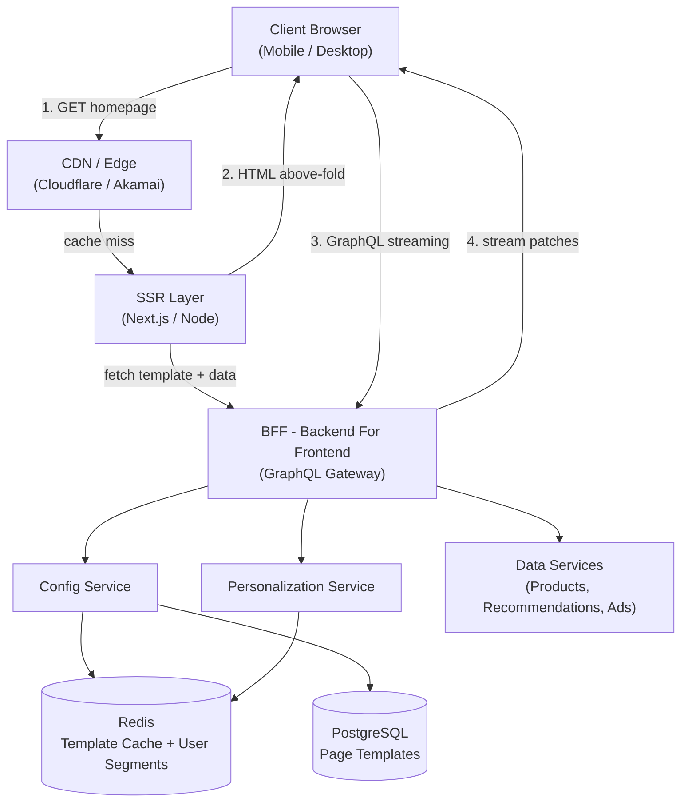
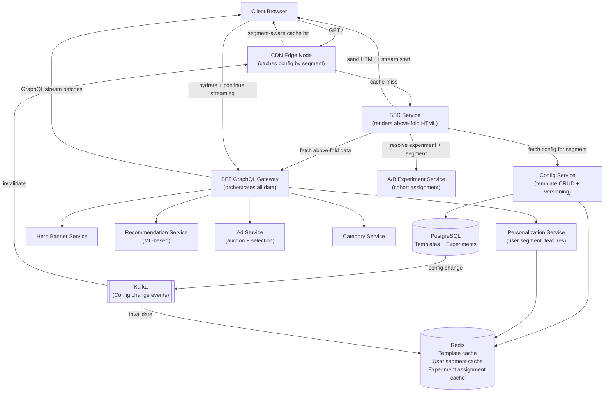
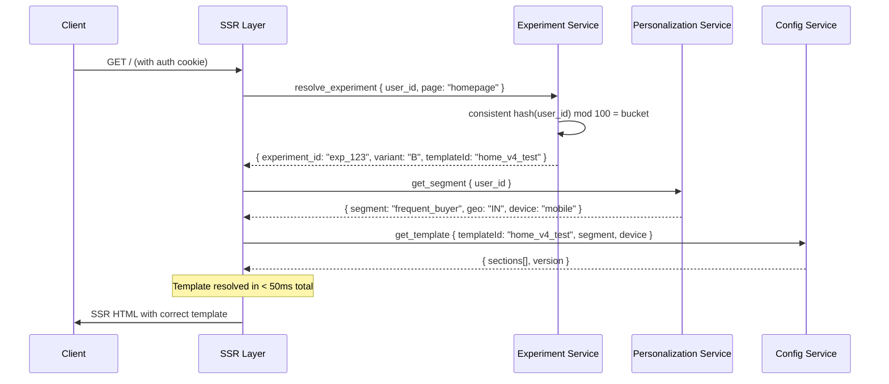

# System Design: Config-Driven Homepage (Amazon / eBay / Flipkart)

---

## 🧠 Mental Model

> **A config-driven homepage is not a static page. It is a rendering pipeline where the backend decides what to show and the frontend decides how to show it.**

The key insight: **separate "what to render" from "how to render it" from "what data to fill".**

| Layer | Responsibility | Changes when |
|---|---|---|
| **Config** | Which sections appear, in what order, with what layout | A/B test changes or business decision |
| **Data** | What content fills each section | Every page load (personalized) |
| **Component Registry** | How each section type renders | Frontend deploy only |

This separation enables:
- A/B testing layouts without code deploys
- Personalization without frontend changes
- Progressive loading without API coordination
- Business teams controlling page structure without engineers

The system runs two paths:

- **Fast path**: CDN serves cached config → SSR renders above-the-fold → client hydrates → streams below-the-fold data
- **Reliable path**: Personalization + experiment assignment → correct template version per user cohort

```
                    ┌─────────────────────────────────────────────────────────────┐
                    │                      FAST PATH                               │
  ┌────────┐  req   │  ┌──────────┐  template  ┌──────────┐  SSR HTML            │
  │ Client │ ──────►│  │   CDN    │ ──────────►│ SSR Layer│ ──────────► browser  │
  └────────┘        │  └──────────┘  (cached)  └──────┬───┘  (above fold ready) │
                    │                                  │ stream below-fold        │
                    └──────────────────────────────────┼─────────────────────────┘
                                                       │ GraphQL @defer patches
                    ┌──────────────────────────────────▼─────────────────────────┐
                    │                    RELIABLE PATH                             │
                    │  Personalization Service → correct template for this user   │
                    │  BFF (parallel data fetch) → fills sections with data       │
                    │  A/B Test Service → experiment variant assignment            │
                    └─────────────────────────────────────────────────────────────┘
```

### ⚡ Core Design Principle

| Principle | Decision | Why |
|---|---|---|
| Layout before data | Template JSON with fixed heights arrives first | Prevents CLS (Cumulative Layout Shift) — skeleton fills reserved space |
| Config in CDN | Page templates cached at edge, TTL 5 min | Config is mostly static; CDN absorbs 90% of traffic |
| Data via GraphQL streaming | `@defer` for below-fold sections, `@stream` for list items | Critical path (above fold) renders immediately; rest loads progressively |
| SSR for above-the-fold | Server renders hero + critical sections, sends HTML | FCP and LCP under 1s; no blank screen on slow networks |
| Personalization on server | User cohort + experiment resolved before template sent | Client receives one correct template — no client-side conditional rendering |
| Component Registry | Frontend map of `type → React component` | Decouples backend config from frontend render logic |

---

## 1. Problem Statement & Scope

Design a configurable homepage platform (like Amazon/Flipkart) where:
- UI is driven by backend configuration (Server-Driven UI)
- Different users see different layouts (cohorts, A/B experiments)
- Data is fetched dynamically and personalized
- Page loads fast (FCP < 1s, LCP < 2.5s, CLS < 0.1)
- Business teams can change page layout without code deploys

**In scope:**
- Config service for page templates (sections, order, layout metadata)
- Personalization and A/B experiment assignment
- BFF (Backend For Frontend) data aggregation
- SSR + GraphQL streaming pipeline
- CDN/edge caching strategy
- Client-side streaming + rendering

**Out of scope:**
- Product catalog service internals
- Recommendation ML model training
- Ads auction engine
- User authentication (assumed available)

---

## 2. Requirements

### Functional Requirements

1. **Config-driven layout** — backend sends template JSON defining sections, types, and order
2. **Personalization** — different users (cohorts, geographies) see different templates
3. **A/B testing** — experiment variants without code deploys
4. **Progressive loading** — above-the-fold renders immediately; below-fold loads streaming
5. **Skeleton placeholders** — reserved layout space prevents CLS during data loading
6. **Business team control** — non-engineers can modify homepage layout via config dashboard

### Non-Functional Requirements

| Requirement | Target | Reasoning |
|---|---|---|
| Scale | 100M DAU, ~11,500 req/sec peak | Amazon-scale; CDN absorbs majority |
| FCP (First Contentful Paint) | < 1s | User sees content immediately |
| LCP (Largest Contentful Paint) | < 2.5s | Google Core Web Vital threshold |
| CLS (Cumulative Layout Shift) | < 0.1 | Layout must not jump when data loads |
| TTI (Time to Interactive) | < 3s | Page is responsive to user within 3s |
| Config availability | 99.99% | CDN fallback; stale config is better than no config |
| Personalization latency | < 50ms | Must not block critical path |

> [!NOTE]
> **Key Insight:** This is primarily a performance problem, not a storage problem. The challenge is not storing page configs — it is delivering them fast enough that the user sees content in < 1s on a slow 3G connection. Every architectural decision (CDN, SSR, @defer, fixed heights) exists to improve one of the Core Web Vitals.

---

## 3. Back-of-Envelope Estimations

```
Users:
  100M DAU
  Average 10 homepage loads/day per user → 1B page loads/day

Traffic:
  1B ÷ 86,400s = ~11,574 req/sec average
  Peak (2×): ~23,000 req/sec

CDN cache hit ratio:
  Config template: ~90% cache hit (mostly static, TTL 5 min)
  Server-side hits: ~2,300 req/sec after CDN

Data per page:
  ~5-8 data sources fetched in parallel (hero, recommendations, ads, categories, etc.)
  Each data source: ~10-50 KB
  Total per page: ~200 KB

Bandwidth:
  23,000 req/sec × 200 KB = ~4.6 GB/sec at peak (mostly CDN + S3)
  Application server: ~2,300 req/sec × 50 KB metadata = ~115 MB/sec

Config storage:
  10,000 templates (device × locale × experiment variants)
  Each template: ~5 KB
  Total: ~50 MB — fits entirely in Redis
```

---

## 4. API Design

### Config + Data (Combined — BFF GraphQL)

```
POST /graphql
  Headers: Authorization: Bearer {user_token}
           X-Device-Type: mobile | desktop | tablet
           X-Locale: en-IN | en-US
  Body:    { query: GetHomepage, variables: { userId, device, locale } }
  Response: Multipart HTTP (streaming) — see Section 6.2

GET /v1/homepage/config
  Headers: X-Device-Type, X-Locale, X-User-Segment
  Response: { templateId, version, sections[] }
  Purpose:  Config-only endpoint (for clients that separate config from data fetch)
  Cache:    CDN TTL 5 min (Vary: X-Device-Type, X-Locale, X-User-Segment)
```

### Config Management (Internal / Admin)

```
POST /admin/v1/templates
  Body:    { templateId, sections[], targetCohort, experimentId }
  Purpose: Create or update a page template

GET  /admin/v1/templates/{templateId}/versions
  Response: List of versions with publish status

POST /admin/v1/experiments
  Body:    { name, variants: [{ templateId, trafficPercent }], startAt, endAt }
  Purpose: Create A/B experiment assigning users to template variants
```

---

## 5. Architecture

### Simple High-Level Design



### Evolved Design (with A/B Testing + Edge Personalization + Streaming)



---

## 6. Deep Dives

### 6.1 Config Template System

> **The template JSON is the contract between backend and frontend. The backend decides structure; the frontend decides rendering.**

```json
{
  "templateId": "home_v3_mobile",
  "version": "v3",
  "targetCohort": "in_mobile_new_user",
  "sections": [
    {
      "id": "hero",
      "type": "HeroBanner",
      "position": 1,
      "layoutMeta": {
        "aboveTheFold": true,
        "height": 400,
        "width": "100%",
        "skeleton": "hero"
      },
      "dataSource": {
        "type": "graphql",
        "field": "hero"
      }
    },
    {
      "id": "recommendations",
      "type": "RecommendationCarousel",
      "position": 2,
      "layoutMeta": {
        "aboveTheFold": false,
        "height": 300,
        "skeleton": "carousel"
      },
      "dataSource": {
        "type": "graphql",
        "field": "recommendations"
      }
    },
    {
      "id": "ads_slot_1",
      "type": "AdBanner",
      "position": 3,
      "layoutMeta": {
        "height": 250,
        "reserved": true
      },
      "dataSource": {
        "type": "graphql",
        "field": "ads"
      }
    }
  ]
}
```

**Why `layoutMeta.height` is critical:**

```
Without fixed height:
  Page renders: Hero visible
  Data loads:   Recommendations section appears
  Result:       Hero shifts down → CLS spike → Google penalizes ranking

With fixed height:
  Page renders: Hero visible + 300px skeleton below
  Data loads:   Recommendations fills the skeleton
  Result:       No layout shift → CLS = 0
```

**Config versioning and rollout:**

| Operation | What happens |
|---|---|
| Create new template | Saved to PostgreSQL, not live yet |
| Publish template | Set as active for target cohort; Kafka event invalidates CDN + Redis |
| A/B variant | Experiment service assigns users; each bucket gets a different templateId |
| Rollback | Set previous version as active; takes effect within CDN TTL (5 min) |

> [!NOTE]
> **Key Insight:** The template JSON must contain `layoutMeta.height` for every section — this is the CLS contract. The frontend must reserve that exact pixel space before data arrives. A skeleton fills it. This is what makes the page "feel instant" even when data is still loading.

---

### 6.2 GraphQL Streaming (@defer + @stream)

> **The problem: above-the-fold data should arrive in < 200ms. Below-the-fold data (recommendations, ads) takes 500ms+. A single blocking request would delay everything.**

**The GraphQL query with streaming directives:**

```graphql
query GetHomepage($userId: ID!, $device: DeviceType!, $locale: String!) {
  userContext(userId: $userId) {
    userId
    segment { id type }
    location { country }
  }

  homepageTemplate(device: $device, locale: $locale) {
    templateId
    sections {
      id
      type

      # Above-the-fold: NO @defer — must arrive in first response
      hero {
        headline
        imageUrl
        ctaText
        ctaUrl
      }

      # Below-fold: @defer — arrives as a separate patch
      recommendations @defer(label: "rec-section") {
        items @stream(initialCount: 2) {
          id
          title
          imageUrl
          price
          rating
        }
      }

      # Ads: deferred, non-blocking
      ads @defer(label: "ads-section") {
        placements {
          slotId
          imageUrl
          clickUrl
        }
      }
    }
  }
}
```

**Initial response (fast — < 200ms):**

```json
{
  "data": {
    "homepageTemplate": {
      "sections": [
        { "id": "hero", "hero": { "headline": "Welcome Back", "imageUrl": "..." } },
        { "id": "recommendations", "recommendations": null },
        { "id": "ads_slot_1", "ads": null }
      ]
    }
  },
  "hasNext": true
}
```

**Incremental patch (arrives 300–500ms later):**

```json
{
  "incremental": [
    {
      "path": ["homepageTemplate", "sections", 1, "recommendations"],
      "data": {
        "items": [
          { "id": "p1", "title": "iPhone 15", "price": 79999 },
          { "id": "p2", "title": "Samsung S24", "price": 69999 }
        ]
      }
    }
  ],
  "hasNext": false
}
```

**Client streaming handler:**

```javascript
async function fetchHomepage(query, variables, onUpdate) {
  const response = await fetch("/graphql", {
    method: "POST",
    headers: { "Content-Type": "application/json" },
    body: JSON.stringify({ query, variables })
  });

  const reader = response.body.getReader();
  const decoder = new TextDecoder();
  let result = {};

  while (true) {
    const { done, value } = await reader.read();
    if (done) break;

    const chunk = JSON.parse(decoder.decode(value));

    if (chunk.data) {
      result = { ...result, ...chunk.data };
    }

    if (chunk.incremental) {
      chunk.incremental.forEach(patch => {
        applyPatch(result, patch.path, patch.data);
      });
    }

    onUpdate({ ...result });  // re-render with latest state
  }
}

function applyPatch(obj, path, value) {
  let ref = obj;
  for (let i = 0; i < path.length - 1; i++) {
    ref = ref[path[i]];
  }
  ref[path[path.length - 1]] = value;
}
```

> [!NOTE]
> **Key Insight:** `@defer` gives you the best of both worlds — one HTTP connection (no request waterfall), but progressive rendering. The above-fold hero renders in < 200ms. The below-fold carousel renders at 400ms when its data arrives. Without `@defer`, you wait for the slowest data source (500ms) before rendering anything.

---

### 6.3 Personalization and A/B Testing

> **The same URL renders differently for a new user vs a power buyer vs a user in a different geography — without any client-side conditional logic.**

**Cohort resolution pipeline (runs before template lookup):**



**Experiment assignment (consistent hashing):**

```
user_id = "u_abc123"
bucket  = consistent_hash("u_abc123") mod 100 = 37

Experiment config:
  variant_A: buckets 0-49   → templateId: "home_v3_control"
  variant_B: buckets 50-79  → templateId: "home_v4_test"
  variant_C: buckets 80-99  → templateId: "home_v5_test2"

User in bucket 37 → always sees variant_A (consistent across sessions)
```

**Why consistent hashing matters:**

```
Without consistent hash:
  User refreshes page → different random bucket → different template each time
  → User experience is inconsistent
  → A/B test results are polluted (same user counted in both variants)

With consistent hash:
  User always maps to same bucket
  → Consistent experience
  → Clean experiment data
```

> [!IMPORTANT]
> **Personalization must resolve in < 50ms.** If the segment lookup blocks the critical path, FCP degrades. The segment result is cached in Redis with TTL 10 min per user. On cache miss, the fallback is the default template — never block page render waiting for ML inference.

> [!NOTE]
> **Key Insight:** A/B testing in config-driven UI is fundamentally different from feature flags. Feature flags gate code paths. Config-driven A/B testing changes the entire layout structure — which sections exist, in what order, with what components — without touching code. This is why product teams love Server-Driven UI: they own the experiment.

---

### 6.4 SSR + Streaming Performance Pipeline

> **The performance problem: a user on 3G in India opens Amazon. If we wait for all data before sending HTML, FCP is 3–5 seconds. With SSR + streaming, FCP is under 1 second.**

**The rendering pipeline:**

```
1. Request arrives at SSR layer
2. Resolve experiment + cohort (< 50ms, Redis cached)
3. Fetch template config (< 5ms, Redis cached)
4. Fetch above-fold data in parallel (hero, user name, nav) (< 150ms)
5. Server renders HTML with above-fold content + skeleton placeholders for below-fold
6. Send HTML to client → FCP achieved (< 400ms total)
7. Client receives HTML, browser parses and renders
8. Client JS hydrates React components
9. Client opens GraphQL streaming connection
10. Below-fold patches arrive (recommendations, ads) → React fills skeletons
```

**React component renderer with skeleton:**

```javascript
function SectionRenderer({ section, data }) {
  const Component = registry[section.type];

  // Fixed height from layoutMeta prevents CLS
  return (
    <div style={{ height: section.layoutMeta.height, minHeight: section.layoutMeta.height }}>
      {!data ? (
        // Skeleton fills reserved space while data loads
        <Skeleton type={section.layoutMeta.skeleton} />
      ) : (
        <Component {...data} />
      )}
    </div>
  );
}

// Component registry: maps config type → React component
const registry = {
  "HeroBanner":            HeroBannerComponent,
  "RecommendationCarousel": RecommendationCarousel,
  "AdBanner":              AdBanner,
  "CategoryGrid":          CategoryGrid,
  "FlashSaleTimer":        FlashSaleTimer,
};
```

**Core Web Vitals targets and mechanisms:**

| Metric | Target | Mechanism |
|---|---|---|
| FCP | < 1s | SSR sends HTML with above-fold content immediately |
| LCP | < 2.5s | Hero image URL in first SSR response; preloaded via `<link rel="preload">` |
| CLS | < 0.1 | Fixed `height` in `layoutMeta`; skeleton fills reserved space |
| TTI | < 3s | Critical JS bundle < 100KB; hydration deferred for below-fold |
| INP | < 200ms | Below-fold rendered with `requestIdleCallback` after hydration |

> [!NOTE]
> **Key Insight:** CLS is zero if and only if every section has a fixed height in the template JSON. The skeleton and the real component occupy the same pixel space. This is the most important constraint in the entire template schema — a backend developer changing a section's height must know it will cause visual shift on millions of clients.

---

### 6.5 Edge Caching Strategy

> **The problem: 11,500 req/sec for a homepage that is 90% identical across users (except personalization). Hitting the origin for every request wastes compute.**

**What to cache and where:**

| Content | Cache layer | TTL | Cache key |
|---|---|---|---|
| Template JSON (per cohort) | CDN edge node | 5 min | `device + locale + segment` |
| Hero banner image | CDN | 1 hour | URL hash |
| Non-personalized section data (categories, nav) | CDN | 5 min | `locale + device` |
| User-specific data (recommendations, cart) | Not cached | — | Never cached at CDN |
| Experiment assignment | Redis | 10 min | `user_id + experiment_id` |
| User segment | Redis | 10 min | `user_id` |

**Cache invalidation on config change:**

```
Business team updates template → Config Service writes to PostgreSQL
  → Publishes event to Kafka: { type: "config_changed", templateId, cohorts[] }
  → CDN invalidation worker: purge edge nodes for affected cohorts (< 30s)
  → Redis invalidation: DEL template:{cohort}:{device} (immediate)

Worst case: user sees stale template for CDN TTL (5 min)
This is acceptable — layout changes are not time-critical
```

> [!NOTE]
> **Key Insight:** Personalized data (recommendations, ads, cart) must never be cached at CDN. CDN cache keys can only vary by coarse dimensions (device, locale, segment). User-specific data is fetched server-side and streamed separately. The split between "cacheable template" and "non-cacheable data" is the fundamental architecture of this system.

---

## 7. ⚖️ Key Trade-offs

### Trade-off 1: Server-Driven UI vs Hardcoded UI

| Dimension | Server-Driven UI (chosen) | Hardcoded Frontend |
|---|---|---|
| Layout changes | Config update — no deploy | Frontend code change + deploy |
| A/B testing | Template variants — instant | Feature flags in code |
| Performance | Extra config fetch (~5ms Redis) | No overhead |
| Debugging complexity | Higher — layout from server | Lower — layout in code |
| Client flexibility | Limited by component registry | Full control |

**Chosen: Server-Driven UI.**
Business velocity is the primary reason — product teams change homepage layouts 5–10 times per week at Amazon scale. Requiring an engineer and a deploy for each layout change is not viable. The trade-off we accept is debugging complexity (hard to predict what a user sees without knowing their cohort/experiment), which is mitigated by a config dashboard that shows the template for any user segment.

---

### Trade-off 2: GraphQL Streaming vs Multiple REST Requests

| Dimension | GraphQL @defer/@stream (chosen) | Multiple REST requests |
|---|---|---|
| Connections | 1 HTTP connection | 5–8 parallel HTTP connections |
| Progressive render | Native — each @defer patch updates UI | Manual — each response triggers re-render |
| Request waterfall | None — single connection | Possible if requests are sequential |
| Browser overhead | Lower (1 connection) | Higher (connection limits per host) |
| Implementation complexity | Higher (streaming client, patch merge) | Lower (simple fetch) |

**Chosen: GraphQL streaming with @defer.**
One connection with progressive patches is strictly better for mobile (where connection setup is expensive). The trade-off we accept is client-side complexity — the streaming handler and patch merge logic. This is abstracted into a reusable hook used by all clients.

---

### Trade-off 3: SSR vs Pure CSR vs Static Generation

| Dimension | SSR + Streaming (chosen) | Pure CSR | Static (SSG) |
|---|---|---|---|
| FCP | < 1s (HTML from server) | 2–4s (JS loads first) | < 500ms (pre-built HTML) |
| Personalization | Per-request on server | Client-side after JS load | Not possible |
| A/B testing | Server-resolved | Client-resolved (CLS risk) | Not possible |
| Infrastructure cost | Server compute per request | CDN only | CDN only |
| Stale risk | None | None | Yes — rebuild on content change |

**Chosen: SSR + GraphQL streaming.**
Pure CSR means a blank screen until JS loads — unacceptable for FCP. Static generation cannot personalize per user. SSR resolves personalization server-side and streams progressively, combining the best of both. The trade-off we accept is server compute cost (~2,300 req/sec after CDN), which is justified by the FCP and personalization requirements.

> [!NOTE]
> **Key Insight:** Static generation works for marketing pages. It cannot work for a homepage that must show "Hello, [Name]" or "You have 3 items in your cart." SSR is not optional when personalization is a requirement — it is the only architecture that achieves both fast FCP and correct user-specific content.

---

### Trade-off 4: Cohort-Level CDN Caching vs User-Level Caching

| Dimension | Cohort-level (chosen) | User-level |
|---|---|---|
| Cache hit ratio | High — cohort shared across millions | Low — each user is unique |
| Personalization granularity | Segment-level (e.g., "frequent_buyer_IN") | Per-user |
| CDN storage | Small — N cohort × M device templates | Unbounded |
| Staleness | 5 min TTL — same for all users in cohort | Per-user TTL |

**Chosen: Cohort-level CDN caching.**
User-level CDN caching is not feasible — it requires the CDN to store billions of entries with effectively zero cache hit improvement (each user's page is unique). Cohort-level caching achieves 90% cache hit ratio because 80% of users share a cohort template. Truly user-specific data (recommendations, cart) bypasses the CDN entirely and is streamed server-side.

---

## 8. Interview Summary

### Decision Table

| Decision | Problem It Solves | Trade-off Accepted |
|---|---|---|
| Server-Driven UI (config JSON) | Layout changes without code deploys | Debugging complexity; component registry must be maintained |
| Fixed `height` in layoutMeta | CLS = 0 — no layout shift when data loads | Backend must know pixel heights; inflexible for responsive design |
| CDN caches config by cohort | 90% traffic absorbed at edge | Personalization only at cohort granularity, not per-user |
| GraphQL @defer for below-fold | Above-fold renders in < 200ms; rest streams in | Complex streaming client; patch merge logic |
| SSR for above-fold | FCP < 1s; server resolves personalization | Server compute per request |
| Redis for segments + templates | < 1ms cohort resolution; does not block critical path | Non-durable; Redis restart loses cached segments (immediate rebuild) |
| Consistent hash for A/B | User always sees same variant; clean experiment data | Cannot change experiment while it runs (hash must be stable) |
| Kafka for cache invalidation | Config change propagates to CDN + Redis within 30s | Up to 5 min stale for CDN TTL window |

### Mental Model Summary

A config-driven homepage separates structure from data from rendering. The backend sends a **template JSON** that defines which sections exist, in what order, and with what reserved pixel height — before any data arrives. The frontend uses a **component registry** to map section types to React components. **GraphQL streaming** (@defer) delivers above-fold data in the first response (<200ms) and below-fold data as patches (300–500ms). **SSR** resolves personalization and experiment assignment server-side, sends HTML immediately for FCP < 1s, then the client hydrates and continues streaming. **Cohort-level CDN caching** absorbs 90% of traffic. Business teams control layout via a config dashboard — no code deploys needed.

### Key Insights Checklist

- **Layout before data — always.** The template JSON with fixed section heights must arrive before any data. This is the only way to achieve CLS < 0.1. The skeleton fills the reserved space. When data loads, it replaces the skeleton without shifting anything.
- **@defer is not optional for performance.** Without it, the page waits for the slowest data source (recommendations at 500ms) before rendering anything. With @defer, above-fold renders in < 200ms and below-fold fills in as data arrives — one HTTP connection, progressive updates.
- **Personalization resolves on the server, not the client.** Client-side personalization (show different components based on a JS flag) causes CLS and layout jitter. Server-side resolution means the client receives exactly one correct template — no conditional rendering needed.
- **Consistent hashing for A/B experiments.** The user must always see the same variant. `consistent_hash(user_id) mod 100` gives a stable bucket. Random assignment per request pollutes experiment data and creates inconsistent user experience.
- **CDN caches cohorts, not users.** User-level CDN caching has near-zero hit rate. Cohort-level (device + locale + segment) achieves 90% hit rate. Truly personalized data (cart, recommendations) bypasses CDN entirely — served via streaming from the BFF.
- **Config change propagates via event, not polling.** On template update, Kafka event triggers CDN purge + Redis invalidation. Within 30 seconds, all edge nodes serve the new template. No cache stampede — CDN nodes refill lazily on next request per cohort.

---

## 9. Frontend Notes

**Frontend / Backend split: 50% backend, 50% frontend.** The config service, personalization, A/B testing, and BFF aggregation are the backend core. But the rendering pipeline — SSR, streaming client, component registry, skeleton management, hydration — is equally critical and equally interview-worthy.

| Concept | What to say in an interview |
|---|---|
| **Component Registry** | A frontend map of `section.type → React component`. Backend sends `"type": "HeroBanner"` in config; client looks up the component. New component types require a frontend deploy; layout changes do not. This is the decoupling contract. |
| **Skeleton Placeholders** | Every section renders a skeleton at the exact pixel height from `layoutMeta.height` before data arrives. This is what achieves CLS < 0.1. The skeleton and the real component must occupy identical space. |
| **GraphQL Streaming Client** | Single `fetch()` call reads a streaming multipart HTTP response. Each `chunk.incremental` patch is applied to the result tree via path-based merge. React re-renders incrementally — only patched sections update. |
| **React Hydration** | SSR sends HTML with above-fold content rendered. Client JS hydrates (attaches event handlers) without re-rendering. Below-fold sections start with skeleton HTML from SSR; streaming patches trigger React state updates to replace skeletons. |
| **EventSource (Legacy)** | Older approach — SSE over GET for streaming updates. Limitation: server-to-client only (cannot send variables). Replaced by multipart HTTP fetch for GraphQL streaming. Mention only for context if asked. |
| **requestIdleCallback for below-fold** | Below-fold hydration deferred to idle time. Above-fold hydration runs immediately. This keeps TTI < 3s even on low-end devices. |
