# Facebook — Social Media Platform System Design

> **Frontend / Backend Split:** 60% backend · 40% frontend
> Feed generation, fan-out, and content pipeline dominate the design. Frontend deserves equal depth for infinite scroll, virtual list, and optimistic engagement UI.

---

## 1. What Is Facebook?

Facebook is a social media platform where people create accounts, post text, photos, and videos, and follow other people whose posts they want to see. When someone opens the app, they see a personalised feed — new activity from the accounts they follow, mixed together and ranked, not just a raw list of everything that happened. They can like anything in that feed, comment on it, and keep scrolling for as long as they want without ever hitting a "load more" button.

At the scale a platform like this operates — hundreds of millions of people opening the app every single day — the hard part isn't storing one photo or one caption. It's making sure that a single post, the moment it's created, ends up showing up quickly in the personalised feeds of everyone who follows that person, no matter whether that person has twelve followers or twelve million, without slowing the app down for anyone else in the process.

---

## 2. A Day in the Life

Maya is back from a weekend trip and opens Facebook to share a photo. She types a short caption, attaches a photo, and taps "Post." The app doesn't make her wait — her post shows up on her own profile almost instantly, and she moves on with her day.

A few minutes later, across the country, her friend Diego opens the app on his lunch break to see what he missed. He hasn't done anything to "refresh" or "sync" anything — he just opens the app, and there in his personalised feed, mixed in with posts from a dozen other friends and pages he follows, is Maya's trip photo. He taps the heart to like it, then types a quick comment: "This looks incredible!"

Maya doesn't have to refresh her screen to find out either — a small notification appears telling her Diego liked and commented on her post. She replies with a laughing emoji, and Diego sees her reply appear a moment later, right where he left the conversation.

That evening, Maya opens her own feed and scrolls — friends' updates, a video from a page she follows, more photos from people she knows — and the feed just keeps going the further down she scrolls, no pause, no "page 2," no sign that new content is being fetched behind the scenes at all.

Neither Maya nor Diego ever thinks about a database, a queue, or a ranking model. From where they're sitting, a photo posted by one person just appears — quickly, and in the right order — in the feeds of everyone who follows them, gets liked, gets commented on, and the feed never runs dry. Everything from here on is how that seemingly simple "post and scroll" interaction actually gets built — and why it's one of the harder systems this platform runs.

---

## 3. Requirements — and Why They Matter

**Scope.** In scope: user onboarding, post creation (text + media), follow/unfollow, like/comment, personalised feed generation. Out of scope: Stories, Messenger/chat (separate system), video encoding pipeline (follows OTT platform design), friend-of-friend suggestions, ads ranking.

**Functional requirements:**

1. Users can register, log in, and manage their profile
2. Users can create posts (text, image, video)
3. Users can follow and unfollow other users
4. Users can like and comment on posts
5. Users see a personalised feed of posts from people they follow
6. Feed supports infinite scroll (pagination via cursor)
7. Users are notified when their post is blocked by content moderation

<details markdown="1">
<summary><strong>Point to Ponder:</strong> When someone with ten million followers posts something, does that update ten million feeds at once?</summary>

No — and this is exactly the fork the design has to make per post. A regular user's post triggers **push fan-out**: the system pre-writes the post into every follower's feed the moment it's created. But once a poster crosses roughly 1,000 followers, the system flips to a **pull model** instead — the post is written once, and each follower's feed merges it in on demand when they open the app. The threshold is what keeps a ten-million-follower post from becoming ten million writes in seconds. See §8.1 for the full push-vs-pull mechanism.

</details>

<details markdown="1">
<summary><strong>Point to Ponder:</strong> If two people post at exactly the same moment, do both posts appear to every follower at exactly the same time?</summary>

No — feed generation is only eventually consistent. A new post may take anywhere from a few seconds to a couple of minutes to actually land in every follower's feed, and that delay is an accepted trade, not a bug. What's *not* allowed to be eventually consistent is the post itself being lost or double-written, or a login token being wrong — those stay strongly consistent. See the Consistency Model below, and §4 for why instant consistency for every follower isn't affordable at this scale.

</details>

**Non-functional requirements — and why each one matters to a real user, not just as a target:**

| Requirement | Target | Why it matters |
|---|---|---|
| Feed load latency | < 200ms (p99) | A feed that hesitates to load reads as a broken app, not a slow one — users don't wait, they just leave and check something else. |
| Post upload latency | < 500ms for text/image | The moment right after tapping "Post" is when a user is most likely to notice lag — a stall here reads as "did it actually work?" |
| Availability | 99.99% (AP system) | A social feed people check dozens of times a day has to just be there every time; a platform that's frequently down loses the habit that makes it a daily habit at all. |
| Consistency | Eventual — new posts may take seconds to minutes to appear in all feeds | Nobody notices a post arriving a minute late in a friend's feed; everybody notices a post that silently vanished or double-posted. |
| Durability | Zero post loss after write acknowledgement | A lost photo or caption isn't a stale page — it's someone's memory of a trip, permanently gone, after the app already told them it was saved. |
| Read/Write ratio | ~5:1 (read-heavy but write fan-out amplifies writes 200×) | This ratio is the whole reason the backend doesn't behave like a "mostly reads" system even though usage looks read-heavy — one write turns into hundreds once fan-out happens, and every later decision has to answer to that. |

**Consistency Model:**

| Domain | Model | Reason |
|---|---|---|
| Feed generation | Eventual | It's OK if a new post appears in your feed after 1–2 minutes |
| Post storage | Strong (within shard) | A post must not be lost or double-written |
| Like counts | Eventual | Approximate counts (±10) are acceptable |
| Comment ordering | Eventual + client-side seq | Comments within a post should appear in order |
| User authentication | Strong | Auth tokens must be consistent |

---

## 4. Scale, From First Principles

Before designing anything, it's worth working out what actually has to happen every second, and letting those numbers rule technologies in or out before a single component gets picked.

**Starting assumptions:**

```
Daily Active Users (DAU):        500M
Avg posts per user per day:      1 (40% include media)
Feed reads per user per day:     5 sessions
Likes + comments per user/day:   10 interactions
Avg text post size:              1 KB
Avg media file size:             1 MB (image), 100 MB (video)
Avg followers per user:          200
```

**How many post writes per second does that create?** 500 million users each posting roughly once a day, spread across a 24-hour day, works out to:

```
500M posts/day / 86,400s ≈ 5,800 posts/sec baseline
```

That's the everyday number. A major event — a holiday, breaking news, a viral moment — pushes traffic to roughly 10× baseline:

```
5,800/sec x 10 ≈ 58,000 posts/sec peak
```

**How many times a second does someone open their feed?** With 500M users averaging 5 sessions a day:

```
500M x 5 / 86,400s ≈ 29,000 feed reads/sec baseline
```

**How many engagement events (likes + comments) per second?** At 10 interactions per user per day across 500M users, this settles around:

```
500M x 10 / 86,400s ≈ 57,000 engagement writes/sec (peak)
```

Three very different numbers so far — 5,800, 29,000, 57,000 — and none of them is actually the hardest one. **The real problem is what happens after a post is written.** The average user has 200 followers, and every post has to reach every one of them:

```
500M posts/day x 200 followers = 100B feed update writes/day
100B / 86,400s ≈ 1.16M feed writes/sec peak
```

That single number — 1.16M feed writes per second — is the single hardest problem this design has to solve. It's not a baseline usage number at all; it's 200× write amplification created purely by the fact that one post has to be reflected in 200 other people's feeds. No other number in this system comes close.

**What about storage?** Text is cheap: 500M posts/day × 1KB averages out to about 500GB/day of text storage. Media is not: at 1MB per image and 100MB per video, with 40% of posts including media, daily media storage lands around 200TB/day — all of it destined for object storage and a CDN, never a database.

**What does the feed cache itself cost to hold in memory?** If Redis stores just the post ID for each of a user's most recent 100 feed entries, at 8 bytes per ID:

```
500M users x 100 posts x 8B ≈ 400 GB (Feed Cache)
```

The same calculation applies to the Post Materialization Cache — the "latest 100 posts" cache that backs both celebrity pull and backfill — landing at roughly the same 400GB.

These numbers are what drive every major decision in this design: Cassandra for write-heavy post/comment storage (no relational primary survives 58,000 writes/sec, let alone 1.16M), Redis for the feed cache (memory-only, no disk I/O, because 400GB in RAM is affordable but a disk-backed store handling 1.16M writes/sec is not), Kafka as a fan-out buffer to absorb burst writes without losing them, and a hybrid push/pull fan-out to keep that 1.16M number from turning into a catastrophe the moment someone with ten million followers posts.

---

## 5. High-Level Architecture

Underneath Maya tapping "Post" and Diego seeing it appear, Facebook is fundamentally a **read-heavy, write-amplified** system — every post write eventually triggers thousands of feed updates, while every feed read has to feel instant. Three flows run underneath that single "post and scroll" interaction:

1. **Write path** — Post created → Kafka buffer → Content moderation → Post DB + S3 → fan-out updates all follower feeds
2. **Read path** — User opens app → Feed Cache hit (Redis, pre-computed) → instant response; backfill kicks in before the user scrolls to the bottom
3. **Engagement path** — Like/comment → Kafka buffer → Engagement consumer → Cassandra (comments) + PostgreSQL (likes)

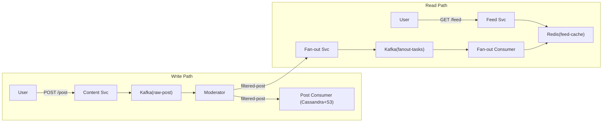

Each of those three flows is optimised for a different thing, because they have different jobs: the fast path (a feed read) is optimised purely for latency, so it skips the database entirely and serves from a pre-computed Redis cache; the reliable path (a post write) is optimised for durability and moderation, so it goes through a Kafka buffer and only commits once it's guaranteed; and there's a third, narrower path just for celebrities, optimised purely for write efficiency — it skips push fan-out altogether and lets followers pull a celebrity's posts on demand from a materialisation cache instead of paying the fan-out cost up front.

> [!IMPORTANT]
> **Facebook is a queue-first, event-driven system across three independent Kafka pipelines:**
>
> | Pipeline | Kafka Topic | Why async |
> |---|---|---|
> | Post write + moderation | `raw-post` → `filtered-post` → `blocked-post` | Moderation is 500ms AI/ML — cannot block the write response |
> | Feed generation (fan-out) | `fan-out-tasks` | 1.16M feed writes/sec — must be buffered and consumed independently |
> | Notifications + analytics | `notifications`, `analytics-events` | Decoupled from delivery; analytics must never slow down the user path |
>
> **Retry:** exponential backoff on consumer failure; Fan-out Consumer resumes from Kafka offset.
> **Idempotency:** `post_id` + `follower_id` dedup in Redis sorted set prevents double-insertion to feeds.
> **Delivery guarantee:** at-least-once (Kafka default) + idempotent consumers = effectively-once.

### From Simple to Evolved

### Simple Design

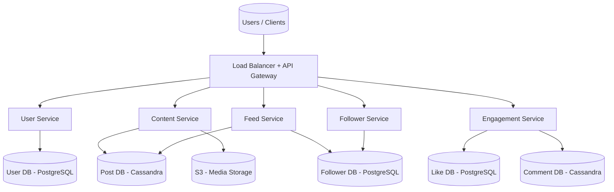

### Evolved Design (Production Scale)

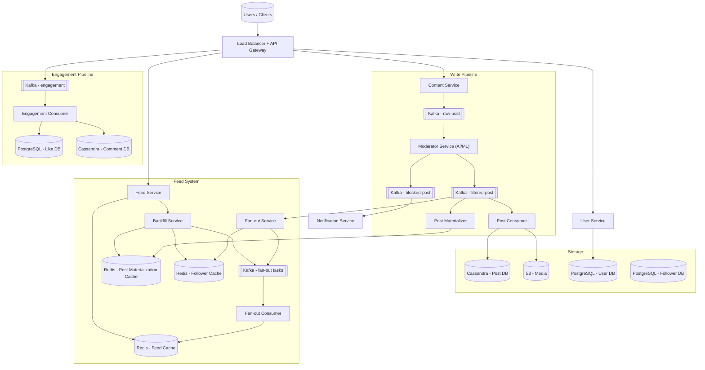

### The Write Path, Step by Step

When Maya taps "Post," the API Gateway authenticates her JWT and routes the request to the Content Service, which publishes it to the Kafka `raw-post` topic immediately and returns `202 Accepted` with a `post_id` in under 50ms. That's a deliberate async choice: synchronous moderation at 58,000 posts/sec would require 29,000 concurrent AI/ML calls in flight at once — architecturally infeasible — so the write response and the moderation decision are decoupled from the start.

From there, the Moderator Service consumes `raw-post`, runs its AI/ML classifier (an image hash check plus a text policy check), and routes the event onward: valid posts go to `filtered-post`, blocked posts go to `blocked-post` where the Notification Service picks them up and alerts the user.

Two consumers then read `filtered-post` in parallel. The Post Consumer writes the post's metadata to Cassandra's Post DB (partitioned by `post_id`) and, if there's media, uploads the bytes to S3 — metadata and media are deliberately split across two stores, since a database is the wrong place for a 100MB video file and S3 is the wrong place for a queryable field. At the same time, the Fan-out Service checks the poster's follower count: under 1,000 followers, it reads the Follower Cache and enqueues `(follower_id, post_id)` pairs onto the `fan-out-tasks` Kafka topic (the push model); at or above 1,000 followers, it skips fan-out entirely and just writes the `post_id` to the poster's Post Materialization Cache instead (the pull model — full mechanism in §8.1).

For push posts, the Fan-out Consumer processes each `fan-out-tasks` entry with a Redis `ZINCRBY` on the follower's feed sorted set, scored by post timestamp — which is what keeps every feed time-ordered without any separate sorting step at read time. In parallel with all of this, the Post Materializer writes the poster's `post_id` into their own "latest 100 posts" Redis cache regardless of follower count, since that same cache doubles as both the celebrity-pull source and the backfill source described below.

<details markdown="1">
<summary><strong>Point to Ponder:</strong> Why does the Fan-out Service consume the same Kafka event as the Post Consumer, instead of waiting for the post to be saved to Cassandra first?</summary>

Because the two are independent consumers reading the same `filtered-post` event in parallel, not a sequence, as just described above. Fan-out doesn't need the post to already be durably stored to start pushing it into follower feeds — it only needs the event. Decoupling the two means a slow Cassandra write never delays feed fan-out, and a fan-out backlog never delays the durable write. Each pipeline scales, and fails, independently.

</details>

### The Read Path, Step by Step

When a user opens the app, the Feed Service runs a single `ZREVRANGE user:feed:{userId} 0 49` against Redis — an O(1) lookup that returns 50 post IDs in under a millisecond. It then batch-hydrates those IDs with a single `MGET` against the Post Cache (falling back to Cassandra's Post DB), resolving media through CDN URLs rather than ever streaming raw bytes from S3, and returns the full ranked feed in under 200ms total.

If the user follows any celebrities, the Backfill Service merges their posts in: it reads celebrity `post_id`s from the Post Materialization Cache, merges them with the regular pre-computed feed, and re-sorts by timestamp before returning a single unified feed. And once the user is roughly 80% through the current batch of 50 posts — detected via an Intersection Observer on the client — the next 50 are pre-fetched in the background, so infinite scroll never shows a spinner unless the network itself is slow.

If any of this fails, the system degrades rather than breaks: on a fan-out failure, the Kafka consumer simply retries from its last offset and the feed lags by seconds; on a Redis miss, the Backfill Service regenerates from the Post Materialization Cache; and on a full Redis node failure, the system falls through to Cassandra with a slower backfill path.

### The Message Sequence

The diagrams above show the components; these show the actual message sequence between them, end to end.

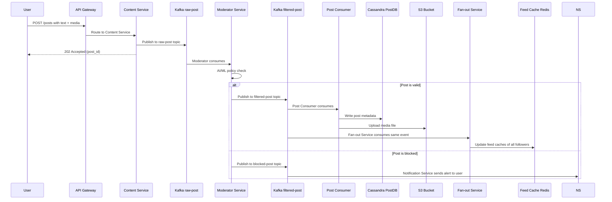

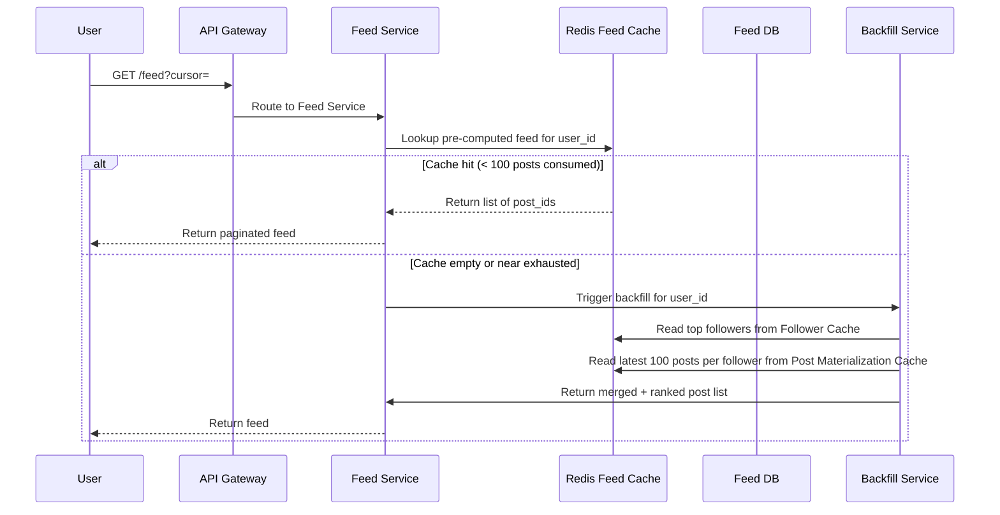

<details markdown="1">
<summary><strong>Point to Ponder:</strong> What happens if the Fan-out Consumer crashes partway through updating follower feeds?</summary>

Kafka's at-least-once delivery means the consumer simply resumes from its last committed offset once it restarts — no follower feed update is permanently lost, just delayed. The risk that creates is a follower feed getting the same post inserted twice on redelivery; that's what the `post_id` + `follower_id` dedup entry in a Redis sorted set is for, guaranteeing the reprocessed write is a harmless no-op rather than a duplicate.

</details>

---

## 6. API Design

Every client here is the same kind of actor — a user — so unlike a two-sided marketplace the API doesn't split by actor. It splits by the resource each endpoint touches: identity, posts, feed, engagement, and the social graph.

**Auth & Profile**

| Method | Path | Description |
|---|---|---|
| POST | `/api/v1/auth/register` | Register new user (returns JWT) |
| POST | `/api/v1/auth/login` | Login, returns JWT |
| GET | `/api/v1/users/:userId` | Get user profile metadata |
| PUT | `/api/v1/users/:userId` | Update profile metadata |

**Posts**

| Method | Path | Description |
|---|---|---|
| POST | `/api/v1/posts` | Create a post (text/media); returns post_id |
| GET | `/api/v1/posts/:postId` | Get post metadata + media URL |
| DELETE | `/api/v1/posts/:postId` | Delete a post |

**Feed**

| Method | Path | Description |
|---|---|---|
| GET | `/api/v1/feed?cursor=&limit=50` | Get personalised feed (cursor-based pagination) |
| GET | `/api/v1/users/:userId/posts?cursor=` | Get all posts by a user |

**Engagement**

| Method | Path | Description |
|---|---|---|
| POST | `/api/v1/posts/:postId/like` | Like a post |
| DELETE | `/api/v1/posts/:postId/like` | Unlike a post |
| POST | `/api/v1/posts/:postId/comments` | Add a comment |
| GET | `/api/v1/posts/:postId/comments?cursor=` | Get comments (paginated) |

**Social Graph**

| Method | Path | Description |
|---|---|---|
| POST | `/api/v1/follow/:targetUserId` | Follow a user |
| DELETE | `/api/v1/follow/:targetUserId` | Unfollow a user |

Two design choices here aren't obvious from the table alone. First, `POST /posts` is asynchronous by design — it returns `202 Accepted` with a `post_id` before moderation has even run, for exactly the reasoning in §5: waiting on a 500ms AI/ML call synchronously doesn't survive 58,000 posts/sec. Second, the feed endpoint takes a `cursor`, not a page number.

> [!NOTE]
> **Key Insight:** Feed API uses cursor-based pagination, not offset. Offset = re-scan from top on every page. Cursor = O(1) resume from last seen post. Critical at 500M users.

---

## 7. Data Model

Eight pieces of data live in this system, and they fall cleanly into three groups once you ask how each one is actually used, rather than treating them as a single undifferentiated list.

**Durable, relational data that changes rarely and must always be correct lives in PostgreSQL.** User accounts need ACID guarantees for auth correctness — a corrupted password hash or a partially-applied profile update is not acceptable. The Follower relationship is simple enough (`follower_id` → `following_id`, with a pending/active status) that a plain relational table with no joins beats reaching for a graph database, unless friend-of-friend recommendations are added later. Likes are lower-volume than comments and need relational dedup checks (has this user already liked this post?), so they get the same treatment.

**Write-heavy content that gets appended constantly lives in Cassandra.** Posts arrive at up to 58,000 writes/sec at peak — no single-primary relational database survives that — so Cassandra's multi-master writes and wide rows carry the Post table, with `post_id` as the partition key for natural distribution across the cluster and efficient timeline queries. Comments follow the same reasoning, but with one extra trick: using a `TIMEUUID` as the clustering key means comments come back time-ordered per post automatically, without a separate `ORDER BY` at read time.

**Everything ephemeral and fast-path lives in Redis, because none of it needs to survive a crash.** The Feed Cache holds each user's pre-computed feed as a sorted set of post IDs scored by timestamp, with a 24-hour TTL and a cap of 100 entries per user — losing it just means a slightly slower backfill, never lost data. The Post Materialization Cache holds the same "latest 100 posts" shape per user, and exists specifically so scroll-exhaustion backfill never has to fall all the way back to a database scan. And the Follower Cache holds a pre-ranked list of each user's top followers (ranked by ML on interaction frequency), which is what lets fan-out target roughly 200 active connections instead of scanning a full 10,000-friend follower list on every post.

> [!NOTE]
> **Key Insight:** Feed Cache stores post_ids only (8 bytes each), not full post objects. Full hydration happens in a single batch `MGET` from Post DB or a separate post cache. This keeps Redis memory at ~400 GB instead of 40 TB.

| Entity | Storage | Key Columns |
|---|---|---|
| User | PostgreSQL | user_id, username, email, password_hash, phone, created_at |
| Post | Cassandra | post_id (UUID), user_id, post_type, content_text, media_url, thumbnail_url, like_count, comment_count, created_at |
| Follower | PostgreSQL | follow_id, follower_id, following_id, status (pending/active), created_at |
| Comment | Cassandra | comment_id (TIMEUUID), post_id (partition key), user_id, content, like_count, created_at |
| Like | PostgreSQL | like_id, post_id, comment_id (nullable), user_id, reaction_type, created_at |
| Feed Cache | Redis | user_id → sorted set of post_ids (score = timestamp) |
| Post Materialization Cache | Redis | user_id → sorted set of post_ids (latest 100) |
| Follower Cache | Redis | user_id → list of top_follower_ids (ML-ranked) |

---

## 8. Deep Dives

### 8.1 Feed Generation: Push vs Pull vs Hybrid

**Here's the problem this deep dive is really about.** The news feed is Facebook's single most important feature, and it has to load in under 200ms for 500 million daily active users. Computing it fresh every time someone opens the app is too slow — nobody waits multiple seconds for a feed. Writing it to every follower's feed the instant a post is created is too expensive — that's the 1.16M-writes/sec number from §4, and it gets far worse for one specific kind of user. This is the question inside the question: neither the "always compute at read time" model nor the "always push at write time" model survives on its own.

**What has to be guarded against.** Two failure modes define the design space here. The first is the celebrity write storm: if one account has 10 million followers, a single post under a pure push model becomes 10 million feed writes in seconds — the exact kind of spike that can take down a Redis cluster. The second is slow reads: a pure pull model that computes everyone's feed fresh at read time means every single feed open pays the cost of scanning and ranking, which at 500M DAU turns "open the app" into a multi-second wait.

**Why the pure models each fail.** Push — fan-out on write — gives the best possible read latency, because the feed is already sitting pre-computed in Redis by the time anyone opens the app: under 200ms, every time. But it pays for that with write cost that scales with follower count: 5,800 posts/sec × 200 average followers is already 1.16M writes/sec, and for a celebrity post that multiplier is catastrophic rather than just expensive — one post, ten million writes, in seconds. Pull — fan-out on read — is the mirror image: write cost is trivial, since a post is written to the Post DB exactly once no matter how many followers the author has, and there's no celebrity problem at all because nothing fans out. But reads become the bottleneck: computing a feed from scratch at request time takes 2–10 seconds, which is far outside the 200ms budget, and every read pays that cost repeatedly for content that barely changed since the last time the same user checked.

Neither pure model is acceptable in isolation, which is why the actual answer is a **hybrid**: push for regular users, pull for celebrities — a threshold, currently 1,000 followers, decides which path a given poster's content takes. Regular users get push fan-out and its sub-200ms read latency, since their write cost is bounded and manageable. Users above the threshold skip fan-out entirely and get pulled on demand, which caps the celebrity write-storm problem at exactly one write per post, no matter how many followers they have — at the cost of a small amount of read-time merging work for anyone who follows them.

> [!NOTE]
> **Key Insight:** Push = low read latency but high write cost. Pull = scalable writes but slow reads. Hybrid = the only answer that works at 500M DAU. Knowing all three models and when each breaks is what staff-level candidates say.

**How push actually works, for regular users under 1,000 followers.** When a user posts, the Fan-out Service — reading the `filtered-post` Kafka topic — fetches that user's top followers from the Follower Cache (pre-ranked by interaction frequency, not just a raw follower list) and publishes `(follower_id, post_id)` pairs onto the `fan-out-tasks` Kafka topic. The Fan-out Consumer processes those tasks with a Redis `ZINCRBY user:feed:{followerId} {timestamp} {post_id}` for each one — so the follower's feed is already pre-computed and sitting in Redis before they ever open the app. When that follower does open the app, the Feed Service issues one `ZREVRANGE user:feed:{userId} 0 49` — an O(1) lookup — and batch-hydrates the results from the Post Cache, returning the full feed in under 200ms:

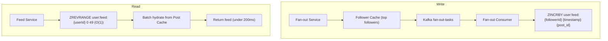

**How pull actually works, for celebrities at or above 1,000 followers.** When a celebrity posts, the Fan-out Service skips fan-out entirely — no `fan-out-tasks` are published, no follower feeds are touched. The Post Materializer instead writes the `post_id` into that celebrity's Post Materialization Cache in Redis, TTL-bounded, holding their latest 100 posts. When a follower of that celebrity opens the app, the Feed Service checks the Follower Cache to identify which of their followees are celebrities, the Backfill Service pulls each celebrity's recent `post_id`s from their Post Materialization Cache, and the result is merged with the follower's own pre-computed regular feed and re-sorted by timestamp before being returned:

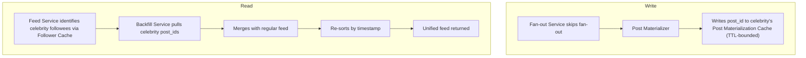

**Trade-off accepted:** celebrity posts may appear 1–3 seconds later than regular posts, since the pull-side merge adds latency that push-side fan-out doesn't have. That's acceptable — the eventual consistency SLA already covers a wider window than this.

> [!NOTE]
> **Key Insight:** The celebrity threshold (1,000 followers) is a business tuning parameter, not an engineering constant. Facebook likely uses a much higher threshold and factors in engagement velocity, not just follower count. Say "the threshold is tuneable based on write amplification observed in production."

---

### 8.2 Feed Ranking (Facebook Feed Is Not Chronological)

**Here's the problem.** A user follows 500 people. In the last hour, those 500 people collectively published 300 posts. Nobody wants to see all 300 — the feed shows 50. Which 50? Chronological order is the obvious answer, and it's also a bad one: a post from a user's best friend from two hours ago is often more relevant than a brand's post from two minutes ago. Recency is a poor proxy for what someone actually wants to see.

**Why the naive solution fails.** Sorting is straightforward to build — `ZREVRANGE user:feed:{userId} 0 49` returns the 50 most recent posts with no extra machinery. The problem shows up the moment engagement is measured: a viral post from a close friend gets buried below noise from accounts the user barely interacts with, simply because the noise happened to post more recently. Engagement collapses, because "most recent" and "most wanted" are two different orderings that only coincidentally agree.

**The chosen solution is a two-stage pipeline: candidate generation, then ML ranking.**

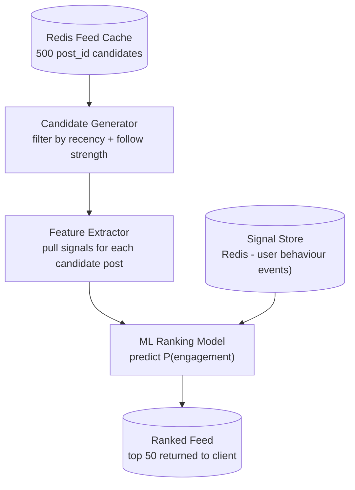

Stage one is a fast filter with no ML at all: starting from roughly 500 candidate `post_id`s already sitting in the Redis Feed Cache from fan-out, lightweight rules drop anything older than 7 days and weight up posts from users the viewer has actually interacted with in the last 30 days. That narrows 500 candidates down to around 200 — cheap, and enough to make the expensive stage tractable.

Stage two runs an ML model over those 200 survivors, predicting, for each one, the probability the viewer will like it, comment on it, share it, or click it. The features feeding that prediction fall into four categories, and losing any one of them would blind the model to a real signal: post features (post age, media type — video, image, or text — like count, and comment velocity, meaning likes per minute since posting); author features (the poster's relationship to the viewer — close friend, page, or group — and the poster's own recent engagement rate); user behaviour signals (the viewer's past interactions with this specific poster, the content types the viewer historically engages with, and time of day — mobile mornings skew toward short text, evenings toward video); and contextual signals (device type, network speed — nobody wants a video ranked first on a slow connection — and how long the viewer's session has run so far). Each candidate gets a score between 0.0 and 1.0 representing predicted engagement probability, and the top 50 scores become the feed.

Fitting this into the request path end to end:

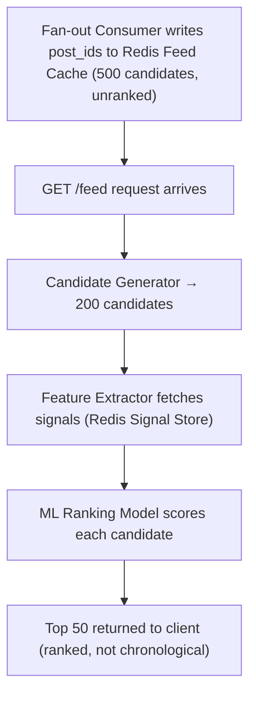

None of those signals are computed live. User behaviour events — likes, comments, shares, dwell time — stream into the Kafka `analytics-events` topic, and a signal aggregator continuously writes pre-computed user-author interaction scores into a Redis Signal Store. By the time a ranking request arrives, the Feature Extractor is doing plain O(1) Redis lookups, not database queries — because the alternative doesn't scale: 29,000 feed requests/sec × 200 candidates × 10 signals per candidate works out to 58 million database lookups per second if computed live, which is simply impossible without pre-computing the signals ahead of time.

**Trade-off accepted:** ML ranking adds 20–50ms to feed load time compared to a pure Redis sorted-set read. That's an intentional cost — a relevant feed drives roughly 3× more engagement than a strictly chronological one, so the latency is worth paying.

> [!NOTE]
> **Key Insight:** Facebook feed ranking is a candidate generation + ML scoring pipeline, not a sort. Sorting is O(N log N) on every request. Candidate generation narrows to 200, ML scores 200 candidates in parallel — it's O(200) per request regardless of how many posts exist. This is why it can run in < 50ms at scale.

---

### 8.3 Content Moderation Pipeline

**Here's the problem.** At 58,000 posts/sec peak, synchronous content moderation would block the write path outright. A 500ms AI/ML model call per post, multiplied across 58,000 posts/sec, is 29,000 concurrent model calls in flight at any instant — synchronous moderation simply isn't possible at that concurrency.

**Why the naive solution fails.**

```
POST /post → Content Service → call Moderator API → wait 500ms → write to DB → 202 Accepted
```

This collapses under its own weight: the Moderator API becomes a hard bottleneck the write path can't get past, post latency grows past 500ms as load increases, and — worse — any outage in the moderation service becomes a complete post-creation outage, since there's no path to accepting a post without first waiting on moderation.

**The chosen solution decouples the write from the moderation decision entirely**, using the same async Kafka pipeline already introduced in §5: the Content Service writes the raw post to the `raw-post` topic and immediately returns `202 Accepted` with the `post_id`, in under 50ms; the Moderator Service consumes `raw-post` asynchronously and runs its AI/ML classifier; the result routes to `filtered-post` if valid or `blocked-post` if it violates policy; the Post Consumer writes valid posts to Cassandra and S3; and the Notification Service alerts the user if their post was blocked.

**Trade-off accepted:** a post is not immediately visible to others the instant `202 Accepted` comes back — it takes a few seconds to clear moderation and appear in feeds. The poster sees a local optimistic preview in their own client UI in the meantime, which is acceptable given the eventual consistency SLA already governing the rest of the feed.

> [!NOTE]
> **Key Insight:** The Kafka buffer is a correctness requirement, not a performance optimisation. Without it, a Moderator outage loses posts entirely. With Kafka, posts are durable in the log and moderation resumes when the service recovers.

---

## 9. Bottlenecks, Failure Scenarios & Trade-offs

### 9.1 Bottlenecks & Scaling

The scale this design targets is worth stating up front, since every bottleneck below is measured against it: 1B+ registered users, 500M DAU; 5,800 post writes/sec at baseline, climbing to 58,000/sec at 10× peak during major events; 29,000 feed read requests/sec, each one returning 50 post IDs that get batch-hydrated from Cassandra; 57,000 engagement writes/sec (likes plus comments), Kafka-buffered and eventually consistent; and 200TB/day of media storage, all of it served through a CDN plus S3, never streamed from origin.

The hardest number in that list is the 1.16M feed writes/sec created by fan-out (§4) — and it's the first thing that actually breaks, because a single Redis node tops out around 500,000 writes/sec. That ceiling is exactly why Redis Cluster, partitioned by `user_id` via consistent hashing, isn't an optimisation here — it's a requirement from day one.

Storing the feed cache itself is the next constraint: at 500M users each holding 100 posts, storing post IDs only (8 bytes each, ≈400GB total, per §4) rather than full post objects is what keeps this affordable, and sharding Redis by a `user_id` consistent hash spreads that load across the cluster. Cassandra's Post DB write throughput hits its own limit around the 58,000 posts/sec peak; horizontal scaling, partitioning by `post_id`, and a replication factor of 3 are what keep it ahead of that number. Fan-out write amplification resurfaces as a bottleneck specifically for celebrities with millions of followers — which is exactly why the hybrid push/pull split from §8.1, with its 1,000-follower threshold, exists in the first place. During a viral post spike, the `fan-out-tasks` Kafka topic itself can lag; the fix is auto-scaling the Fan-out Consumer group against 100-plus partitions on that topic rather than a fixed consumer count. And Follower DB reads have their own fan-out problem — looking up which of a user's 10,000 friends to notify on every post — solved the same way as feed reads: the Follower Cache in Redis pre-computes each user's top followers, so the full Follower DB in PostgreSQL only gets queried on a cache miss.

Sharding follows the natural partition key of each store: the Post DB shards by `post_id` UUID, which distributes naturally since IDs aren't correlated with any hot user; the Feed Cache shards by `user_id % N_shards` consistent hashing; and the User DB shards by `user_id` range, with read replicas absorbing profile reads so they never compete with writes.

The CDN carries the weight the databases never see: all media — images and video thumbnails alike — is served from CDN edge nodes, with signed S3 URLs on a 1-hour TTL for anything private. Profile pictures and post thumbnails are cached at the edge with an expected hit rate above 90%, which is what keeps 200TB/day of media traffic from ever reaching the origin servers at all.

---

### 9.2 Failure Scenarios

Recovery here splits cleanly along one line: what failed was holding *ephemeral* state, or what failed was holding *durable* state — and the two recover in completely different ways.

**Ephemeral, fast-path failures self-heal without any data actually being lost, because nothing durable was ever at risk.** When the Redis Feed Cache node itself fails, users are served a stale or empty feed momentarily, but the Backfill Service triggers on the resulting cache miss and regenerates the feed from the Post Materialization Cache. A closely related case — feed generation stalling because the Fan-out Consumer is down — falls back the same way: the Feed Service detects the stale cache once its TTL is exceeded and switches to an on-demand pull from the Post Materialization Cache and Cassandra, functional but slower (500ms instead of 200ms), with fan-out resuming from its last Kafka offset once the consumer recovers. A plain Redis Feed Cache miss — cold start, TTL expiry, node restart — degrades the same way, falling through to the Post Materialization Cache and then Cassandra if that also misses, with feed load dropping to 500–800ms until the cache is re-warmed by the next fan-out write. And a Kafka fan-out lag during a viral post spike just means follower feeds go stale for seconds to minutes — no data is lost, since the events are durably sitting in the Kafka log the whole time, and the client shows a "refresh for new posts" pill once a WebSocket signal indicates new content is available.

**Durable-state failures recover more slowly, but nothing is silently dropped.** A Cassandra Post DB node failing causes a write latency spike and some temporarily degraded reads, but replication factor 3 means automatic failover to a replica handles it, and Kafka retains any unwritten posts until the service resumes. A Kafka broker failure delays post events and fan-out, but replication across 3 brokers with in-sync replicas (ISR) ensures no message is actually lost, just delayed. An S3 outage fails media uploads specifically: the Content Service returns an error, the text post's metadata is still saved, and the user is prompted to retry the media portion separately rather than losing the whole post.

**A smaller set of service-level failures each have their own narrow recovery path.** A Fan-out Consumer crashing mid-write can leave some follower feeds not yet updated; Kafka's at-least-once delivery means the consumer resumes from its last committed offset, and idempotent writes to the Redis sorted set (the same `post_id` + `follower_id` dedup from §5) prevent any duplicate insertion once it catches up. A Moderator Service outage causes posts to pile up unprocessed in the `raw-post` topic — Kafka retains them, the Moderator Service catches up once it restarts, and in the meantime users simply see "Post is being reviewed" in the UI rather than an error. And an API Gateway overload, which would otherwise make every service unreachable at once, is contained with rate limiting at the gateway, a circuit breaker pattern, and horizontal scale-out behind the load balancer.

---

### 9.3 Trade-offs

### Fan-out Strategy: Push vs Pull vs Hybrid

The comparison across all three fan-out models, side by side: push gives low read latency (feed pre-computed, under 200ms) at the cost of high write cost (1.16M writes/sec at 200× fan-out) and a celebrity problem that outright breaks the system (10M writes from a single post); pull flips every one of those — low write cost (a single write per post), no celebrity issue at all, but high read latency (2–10 seconds) since nothing is pre-computed; and the hybrid lands in between on every dimension it can — low read latency for regular users, medium write cost since fan-out only happens under the 1,000-follower threshold, and the celebrity problem solved outright since celebrities skip push entirely. Storage follows the same pattern (high for push, low for pull, medium for hybrid), and so does freshness (eventual for push, always fresh for pull, eventual for regular users and fresh for celebrities under the hybrid).

**Chosen:** Hybrid — push for regular users, pull for celebrities, exactly as detailed in §8.1.

---

### Post Database: Cassandra vs PostgreSQL

The two databases pull in opposite directions on every dimension that matters here. On write throughput, Cassandra's multi-master design handles 1M+ writes/sec where a single-primary PostgreSQL setup tops out around 50–100K/sec — the gap that matters directly, since posts alone peak at 58,000/sec. On read patterns, it's PostgreSQL that wins for joins and aggregations, while Cassandra is built for fast partition-key lookups and little else. Schema flexibility favors Cassandra's wide rows, which suit time-series post data naturally, against PostgreSQL's more rigid schema. Consistency runs the other way: Cassandra offers only eventual, tunable-quorum consistency, while PostgreSQL gives full ACID guarantees. And operationally, Cassandra's cluster tuning is genuinely more complex to run than PostgreSQL's simpler single-primary operations.

**Chosen:** Cassandra for the Post DB and Comment DB, since write-heavy workloads dominate both. PostgreSQL for the User DB and Like DB, where relational consistency actually matters more than raw write throughput.

> [!NOTE]
> **Key Insight:** Cassandra is not always "more scalable." It's optimised for write-heavy workloads with known partition key access patterns. For ad-hoc queries or joins, PostgreSQL wins. Use the right tool per access pattern.

---

### Feed Cache Invalidation: TTL vs Event-Driven

A pure TTL expiry accepts some staleness — up to the full TTL window — in exchange for real simplicity, with the only stampede risk being popular users' caches all expiring around the same time. Event-driven invalidation flips that trade: staleness drops to a minimum, but at the cost of real complexity (every cache key touching a given user has to be tracked) and an extra write on every single post-follower pair, plus its own stampede risk clustered around post deletion or edit events rather than expiry.

**Chosen:** TTL (24h) as the default, with event-driven invalidation layered on top only for the critical case — post deletion. TTL alone is sufficient for the eventual consistency SLA already accepted elsewhere in this design; event-driven invalidation is reserved specifically for deleted or edited posts, where serving stale content isn't just late, it's wrong.

> [!NOTE]
> **Key Insight:** Cache invalidation is only worth the complexity when serving stale data has real user impact. Serving a post 2 minutes late = fine. Serving a deleted post = unacceptable. Invalidate selectively.

---

### Content Moderation: Synchronous vs Asynchronous

Synchronous moderation costs 500ms or more of post upload latency and ties post creation's fate directly to the moderator's uptime — an outage there means post creation itself fails. The asynchronous Kafka pipeline collapses that latency to under 50ms (`202 Accepted` returns immediately) and decouples the two failure domains entirely — a moderator outage just means posts queue up, not that they're lost — at the cost of the user seeing their post visible only after a 2–5 second delay, and a meaningfully more complex pipeline to build and run (Kafka plus moderator plus consumer, versus one synchronous call).

**Chosen:** the asynchronous Kafka pipeline. At 58,000 posts/sec, synchronous moderation isn't a design preference to weigh against alternatives — it's architecturally infeasible outright. The optimistic local preview in the client is what hides the resulting delay from the user.

> [!NOTE]
> **Key Insight:** The Kafka buffer turns a synchronous dependency into a durable contract. The Moderator Service can be deployed, updated, or restarted without dropping a single post.

---

## Frontend Design (40% of this system)

The frontend of a social feed is a performance engineering problem. The challenge isn't rendering posts — it's rendering thousands of posts at 60fps without memory leaks, blank flashes, or layout shifts. This is where frontend candidates differentiate.

### Infinite Scroll + Feed Pagination

The feed scrolls indefinitely, and neither of the two obvious approaches survives that for long: loading every post the user might ever reach up front means unbounded memory growth, and polling on a timer for new posts wastes requests whether or not anything actually changed.

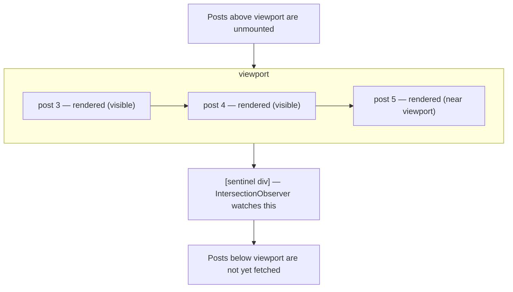

The fix has four pieces working together. Pagination is cursor-based — `GET /feed?cursor={lastPostId}&limit=50` — for the same reason the backend chose it in §6: offset pagination re-scans from page one on every request, while a cursor resumes in O(1) from the last post actually seen. An `IntersectionObserver` watches a sentinel element placed a few posts from the bottom of the loaded list, firing `GET /feed?cursor=` for the next page once the user is three posts from running out. That next page is pre-fetched while the user is still reading the current one, so there's no spinner and no blank gap when they reach the bottom. And new posts are appended to the feed array rather than triggering a full re-render — the list only ever grows, it's never replaced.

### Virtual List (DOM Virtualisation)

After ten minutes of scrolling, a user may have loaded 500 posts. At roughly 15 DOM elements per post, rendering all of them at once means 7,500 active DOM nodes — and frame rate drops, memory spikes, and the tab can crash outright on a mid-range mobile device.

```
Total posts in state:  [1...500]
DOM nodes rendered:    [posts 47–62] ← only 15 nodes exist at any time
Posts above viewport:  height placeholder div (maintains scroll position)
Posts below viewport:  height placeholder div
```

The fix is to render only what's actually visible: tracking `scrollTop` to calculate which post indices currently fall in the viewport (`index = scrollTop / avgPostHeight`), rendering only those posts plus a small buffer of 3 on either side, and replacing every off-screen post with a height-preserving placeholder div so the scroll position never jumps. The payoff is concrete — 15 DOM nodes instead of 7,500 is the difference between 60fps and 8fps on a mid-range Android device.

### Skeleton Loading (Prevent CLS)

Posts load at different speeds, and without a placeholder, content jumps around as each one arrives — Cumulative Layout Shift, which Google uses as a Core Web Vital ranking signal, not just a cosmetic annoyance.

```jsx
// While post is loading:
<div className="post-skeleton">
  <div className="skeleton-avatar" />    // same size as real avatar
  <div className="skeleton-text" />      // same line-height as real text
  <div className="skeleton-image" />     // same aspect ratio as real image
</div>
```

The fix is a skeleton with dimensions identical to the real post it stands in for, so nothing shifts once content actually arrives — an animated shimmer (a CSS gradient sweep) signals "loading" without needing a spinner, and reserving the exact height for media up front (`aspect-ratio: 16/9` on the image container) prevents the layout jump that happens when an image pops in after the fact.

### CDN for Media

Serving images and video from origin servers at 500M DAU means 200TB/day of media bandwidth funneled through a handful of data centres — and for users far from those data centres, that's seconds of latency on every single image.

The fix routes every media URL to a CDN edge node rather than S3 directly — `https://cdn.facebook.com/images/{post_id}/thumb.jpg` — with pre-signed S3 URLs never exposed to clients at all; the CDN fetches from S3 once on first request and caches at the edge from then on. Thumbnails load low-res first (around 50KB) and swap to high-res only on click or fullscreen, and video follows the same pattern — a first-frame thumbnail loads as a plain image, with the actual video loading only on play intent, detected via `IntersectionObserver`. The target cache hit rate is above 95% for profile pictures and above 85% for post images.

### Client-Side Feed Cache (Redux + IndexedDB)

A user scrolls 50 posts, navigates to a profile, then hits back — and without a client-side cache, the feed re-fetches from the server on return, which reads as slow even though nothing actually changed.

```
Redux store (in-memory, fast):
  feedSlice: { posts: [...], cursor: "abc123", hasMore: true }

IndexedDB (persisted across sessions):
  key: "feed_cache_userId"
  value: { posts: first 100, timestamp: Date.now() }
```

The fix layers two caches with different lifetimes. On app open, the feed renders from IndexedDB immediately — effectively 0ms — while a fresh copy is fetched from the API in the background; if the fresh response differs from the cached one, new posts animate in at the top rather than replacing the list outright. On back navigation, scroll position restores from Redux, so the user returns to exactly where they left off. The cache's TTL is 5 minutes — inside that window it's stale-while-revalidate, and after it a full refresh happens. Redux specifically, rather than local component state, is what lets this feed state survive a component unmounting during navigation in the first place.

### Optimistic UI for Engagement

A like button that waits on a round trip before updating — press, then a 200ms wait, then the counter moves — feels laggy, and at 57,000 likes/sec system-wide, that lag compounds into a broadly sluggish-feeling app.

```
User clicks Like:
  1. Instantly increment local like count (Redux dispatch)
  2. Show filled heart icon immediately
  3. POST /posts/:postId/like in background
  4a. Server responds 200 → no-op (local state is already correct)
  4b. Server responds 429/500 → revert to pre-click state + show error toast
```

The fix updates the UI before the server confirms anything: the like count increments and the heart fills instantly, the request fires in the background, and a success response is a silent no-op since the UI was already right. The rare failure case reverts to the pre-click state and shows an error toast. This works because the assumption is almost always correct — over 95% of like requests succeed — so the user perceives zero latency nearly every time, and reverting on the rare error is a small, uncommon cost against that.

### WebSocket for New Post Notifications

New posts from friends can arrive while a user is already looking at their feed, and without any real-time signal, they simply miss them until the next full refresh.

The fix keeps a single WebSocket connection open to the Notification Service per session. On a new-post event, a small "5 new posts — click to refresh" pill appears at the top of the feed — deliberately not auto-injecting the new posts directly, since that would shift the layout out from under someone actively reading. Clicking the pill prepends the new posts and scrolls to top. And when the WebSocket disconnects, as it does whenever a mobile app is backgrounded, it reconnects silently once the app comes back to the foreground.

---

## 10. Evaluation: Did We Meet the Requirements?

Six non-functional requirements were set out in §3. Here's how the design actually satisfies each one — not just what was promised, but the specific mechanism doing the work.

**Feed load latency (< 200ms p99):** The read path never touches a disk-backed database on the hot path — `ZREVRANGE` runs against an in-memory Redis sorted set, hydration is a single batch `MGET`, and celebrity backfill merges in parallel rather than blocking. Every hop is sub-millisecond to low-single-digit milliseconds, which is what makes the 200ms budget achievable at all (§5, §8.1).

**Post upload latency (< 500ms text/image):** The write path returns `202 Accepted` in under 50ms by publishing to Kafka and deferring moderation entirely — the async pipeline in §8.3 exists specifically because synchronous moderation at 58,000 posts/sec blows well past this budget.

**Availability (99.99%, AP system):** No single component failure takes down the whole platform, because the ephemeral and durable halves of the system fail — and recover — independently (§9.2). A Redis node loss degrades feed freshness without losing data; a Kafka broker loss delays events without dropping them; nothing has to be simultaneously up for the system to keep serving traffic.

**Consistency (eventual, with strong pockets):** This isn't uniform, and that's deliberate. Feed generation, like counts, and comment ordering are allowed to be eventually consistent because a user won't notice a post arriving a minute late — but post storage and user authentication stay strongly consistent, because those are exactly the two things that must never be silently wrong.

**Durability (zero post loss after acknowledgement):** Every write that matters passes through Kafka before it's considered durable — replicated, at-least-once delivery means a broker or consumer failure delays a write, but the retained log guarantees it's never silently dropped (§9.2).

**Read/write ratio (~5:1 nominal, 200× amplified by fan-out):** This requirement wasn't "met" after the fact — it's the number that selected the entire architecture up front. Every major choice in this design — Cassandra over a single-primary relational database, Redis holding only IDs, the hybrid push/pull split — exists because of the 1.16M-writes/sec reality hiding behind what looks like a read-heavy workload (§4).

| Requirement | Technique |
|---|---|
| Feed load latency < 200ms | Pre-computed Redis Feed Cache, O(1) ZREVRANGE, batch MGET hydration |
| Post upload latency < 500ms | Async Kafka write path, 202 Accepted before moderation runs |
| Availability 99.99% | Independent failure domains for ephemeral vs. durable state; Redis/Kafka replication and failover |
| Consistency (eventual + strong pockets) | Eventual for feed/likes/comments; strong for post storage and auth |
| Durability (zero post loss) | Kafka replication + at-least-once delivery + retained log on failure |
| Read/write ratio (5:1 nominal, 200× amplified) | Hybrid push/pull fan-out, Cassandra for write-heavy storage |

---

## 11. Conclusion

This design treats Facebook's feed as two amplifying problems wearing one UI: a single post write that has to fan out to hundreds of followers' feeds without becoming a write storm, and a personalised ranking problem that only looks like a sorted list from the outside. The hardest problem wasn't storing a post — it was deciding, per user, whether to pay the fan-out cost at write time or defer it to read time, and building a ranking pipeline that scores candidates instead of just sorting them by recency. Every other decision in this design — Cassandra over PostgreSQL for posts and comments, Kafka as the buffer between every stage of the write path, Redis holding nothing but IDs instead of full objects — falls out of respecting those two numbers: 1.16 million feed writes per second, and a feed that has to feel personal while still returning in under 200 milliseconds.

---

## 12. Interview Summary

### Key Decisions

| Decision | Problem it solves | Trade-off accepted |
|---|---|---|
| Kafka for post write pipeline | Async moderation without blocking write path | Post not immediately visible (eventual, 2–5 sec delay) |
| Redis Feed Cache (pre-computed) | Feed load in < 200ms for 500M users | Write amplification 200× per post; requires Fan-out infrastructure |
| Hybrid fan-out (push for regular, pull for celebrities) | Avoid 10M write-storm on celebrity post | Celebrity posts may appear seconds later than regular-user posts |
| Cassandra for posts + comments | 58K writes/sec post ingestion; 57K engagement writes/sec | No ACID guarantees; eventual consistency for like counts |
| Post Materialization Cache (Redis, 100 posts/user) | Backfill at scroll exhaustion without DB scan | Redis memory cost ~400GB; must be kept warm by Post Materializer Service |
| ML ranking (candidate gen + model scoring) | Chronological feed drives 3× less engagement than ranked feed | +20–50ms latency per feed request; requires pre-computed signal store in Redis |

### Fast Path vs Reliable Path

```mermaid
graph TD
    subgraph "Fast Path (feed read)"
        FUser["User"] --> FGateway["API Gateway"] --> FFeedSvc["Feed Service"] --> FRedisCache["Redis Feed Cache"]
        FRedisCache --> FPostIds["Return post_ids"] --> FHydrate["Hydrate"] --> FDone["200ms - done"]
    end
    subgraph "Reliable Path (post write)"
        RUser["User"] --> RGateway["API Gateway"] --> RContentSvc["Content Service"] --> RKafkaRaw["Kafka(raw-post) - durable"]
        RKafkaRaw --> RModerator["Moderator Service"] --> RKafkaFiltered["Kafka(filtered-post) - durable"]
        RKafkaFiltered --> RPostConsumer["Post Consumer"] --> RCassandra["Cassandra - replicated, RF=3 - done"]
    end
```

### Key Insights Checklist *(say these out loud in the interview)*

- "The news feed is the core engineering problem of Facebook. Push model gives low read latency but costs 1.16M writes/sec in fan-out. Pull model is cheap to write but takes 10 seconds to read. Neither works alone — the hybrid is the only answer at this scale."
- "Feed is pre-computed at write time. When a user opens the app, their feed is already sitting in a Redis sorted set. The read path is a single ZREVRANGE — O(1). Without this, a 10K-friend user's feed load would take 10 seconds."
- "The celebrity threshold is tuneable — it's a business parameter, not an engineering constant. I'd set it based on write amplification observed in production, not a fixed number."
- "Facebook runs three independent Kafka pipelines: post write + moderation, feed fan-out, and notifications/analytics. Each scales independently. Coupling any two of these would create a shared bottleneck."
- "Feed Cache stores post_ids only — 8 bytes each. Full hydration is a batch MGET. This keeps Redis at 400GB instead of 40TB. The post content lives in Cassandra, not the feed cache."
- "Virtual list is not optional on a social feed. 500 loaded posts = 7,500 active DOM nodes = 8fps on Android. With virtualisation: 15 nodes rendered at any time = 60fps. This is the difference between 'it works' and 'it ships'."
- "Skeleton loading prevents CLS. If image containers don't reserve height before the image loads, content shifts when it arrives. Google measures this as a Core Web Vital. Reserve exact dimensions with aspect-ratio CSS."
- "Optimistic UI for likes is the right default assumption — 95%+ of requests succeed. Show the update immediately, revert on error. Users perceive zero latency. Waiting for server confirmation is the wrong mental model for engagement actions."
- "Facebook feed is NOT chronological. It's a two-stage pipeline: candidate generation narrows 500 posts to 200, then an ML model scores each candidate on P(engagement). Chronological is the naive answer — a ranked feed drives 3× more engagement."
- "ML ranking signals are pre-computed, not fetched at request time. 29K feed requests/sec × 200 candidates × 10 signals = 58M DB lookups/sec if computed live. Pre-compute user-author interaction scores into Redis — request time is O(1) lookups."
