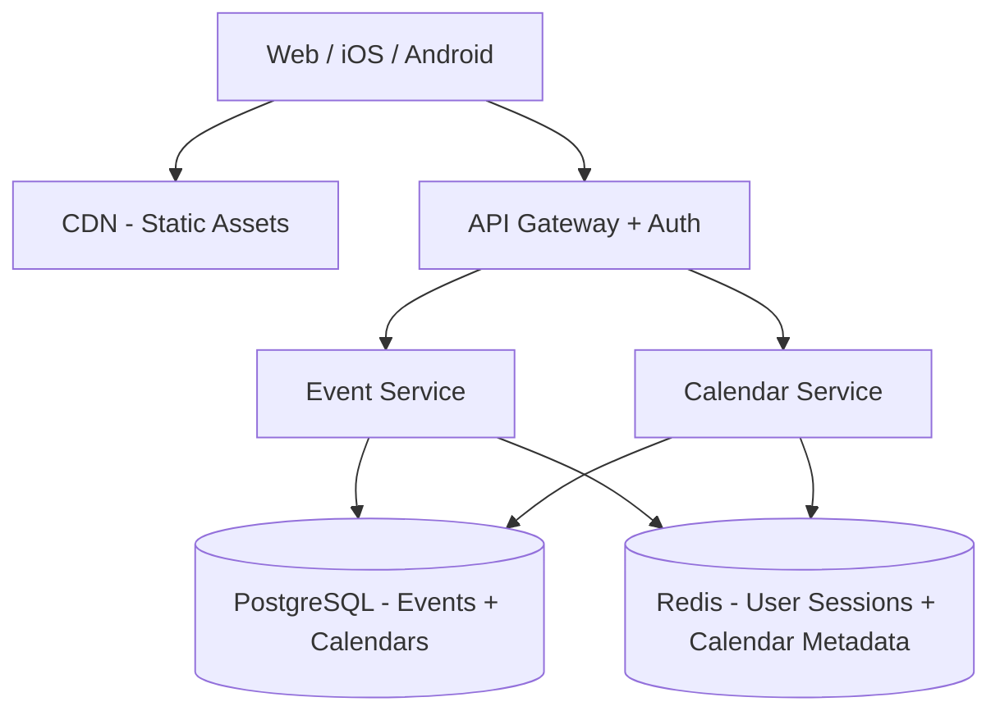
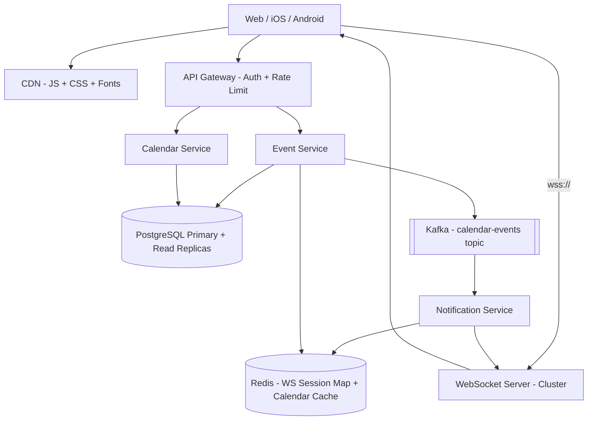
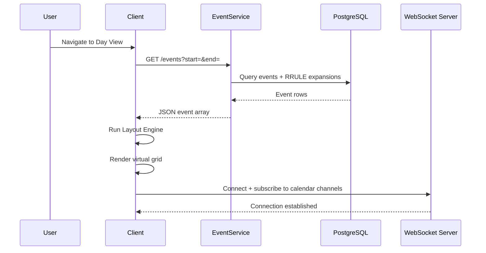
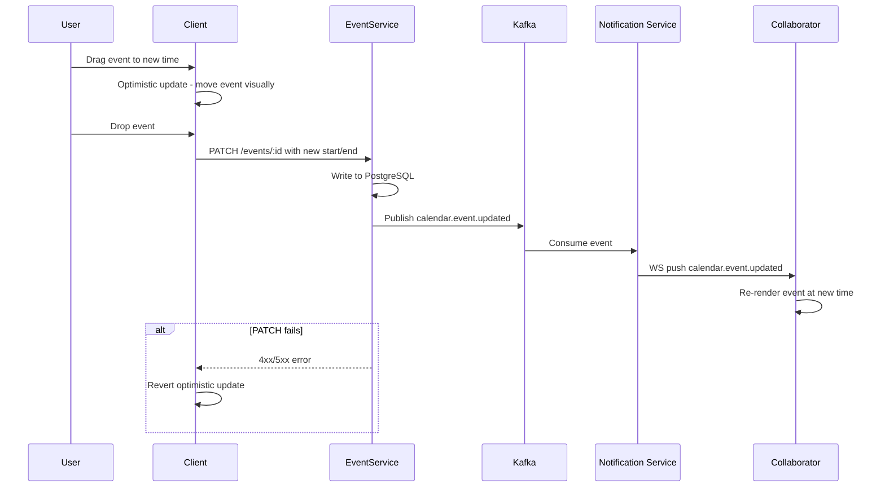
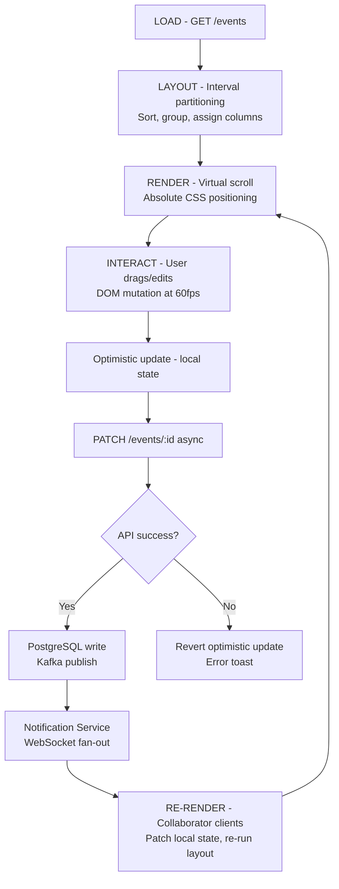
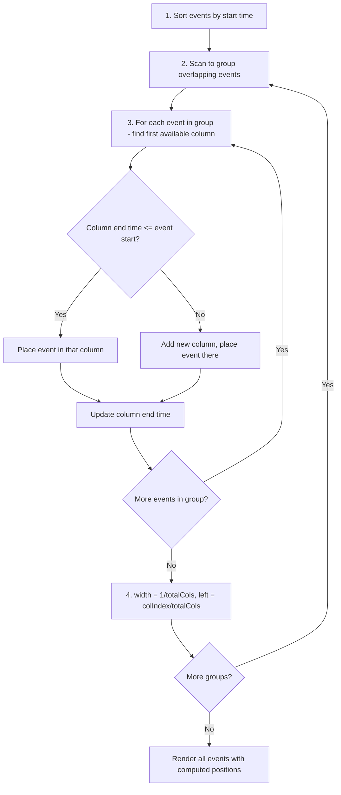
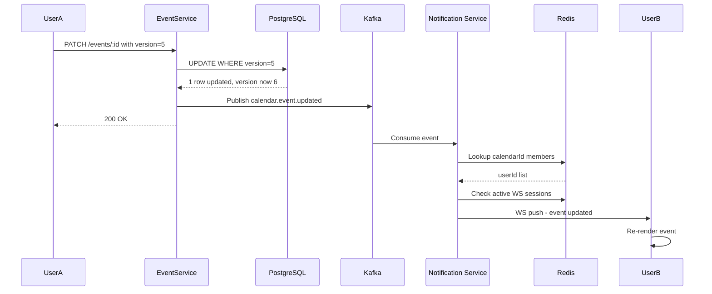

# Google Calendar — Day View

> **Frontend / Backend Split: 40% Backend · 60% Frontend**
> Google Calendar Day View is frontend-heavy — but the backend is non-trivial. The frontend solves: virtual scrolling a 24-hour grid, drag-and-drop with snapping, overlapping event layout (interval partitioning), and RRULE expansion. The backend solves: ACID event storage, conflict resolution for concurrent edits, and fan-out notifications to shared calendar members. Both sections get full coverage.

---

## 1. What Is Google Calendar Day View?

Google Calendar's Day View is the screen you land on when you want to see one specific day up close: a 24-hour grid running top to bottom, with every meeting and reminder drawn in its actual time slot, so a glance tells you you're free at 2pm and slammed from 9 to 11. You create an event by clicking and dragging across the hours you want to block off, move an existing event by dragging it, resize it by dragging its edge, and delete it when it's no longer needed. Some events repeat — a standup every weekday, a rent reminder every month — and the grid has to show the right occurrence on the right day without anyone having created a thousand separate copies of it behind the scenes. And because calendars are usually shared — a team calendar, a family calendar — when one person moves a meeting, everyone else looking at that same calendar needs to see it move too, within about a second.

At the scale this runs at, the hard part isn't drawing boxes on a grid — it's making all of that feel instantaneous and correct at once: instant enough that dragging a box never stutters, and correct enough that two people editing the same shared meeting at the same moment never silently clobber each other.

---

## 2. A Day in the Life

Ananya opens Monday's Day View at 8am, coffee in hand. The grid shows her recurring 9:30 standup, a couple of meetings already on the books, and a wide-open stretch from 1 to 5. She clicks at 2pm and drags down to 3:30, and a new "Design Review" block appears under her cursor as she goes — she doesn't fill in a form first, she just draws the time she wants.

A few minutes later she realizes the review needs more room. She grabs the bottom edge of the block and drags it further down; the block grows in real time, snapping cleanly to the quarter-hour instead of landing on some odd time like 3:22. The moment she lets go, the block is just... there, sitting at its new size. No spinner, no "saving," nothing to wait for.

Then she spots a conflict: her 9:30 standup overlaps a client call that just got scheduled. She drags the standup 15 minutes later. Because it's a recurring meeting, the app asks whether she means to move just today's occurrence or every future Monday — she picks "just this one," and only today's box shifts; next Monday's standup stays exactly where it was.

Across the office, her teammate Rohit has the same shared "Product Team" calendar open. He never touched anything — but the instant Ananya drops the Design Review block, it simply appears on his screen too, sitting in the 2–3:30 slot as if it had always been there.

Later, Ananya's laptop briefly drops its wifi mid-drag while she's resizing another event. It doesn't hang or vanish into some broken half-state — a small "failed to save" toast appears and the event snaps back to where it was before she started. She reconnects, drags again, and it sticks the second time.

By lunch she's rearranged half her day, split off one occurrence of a recurring meeting from the rest of the series, and never once thought about a database, a queue, or a WebSocket — she was just moving boxes around on a grid, and Rohit's grid stayed in sync with hers the whole time. Everything from here on is how that experience actually gets built.

---

## 3. Requirements — and Why They Matter

**Scope.** In scope: Day view grid, event CRUD, drag & resize, recurring events (RRULE), overlapping event layout, real-time collaboration on shared calendars, all-day events, timezone rendering. Out of scope: meeting room booking, Google Meet integration, calendar migration/import, Google Tasks integration.

**Functional requirements:**

1. Display a 24-hour time grid for a selected date, showing every event the user has that day
2. Create events by clicking and dragging across a range of the grid
3. Edit events: drag to move (reschedule), drag an edge to resize (change duration)
4. Delete events
5. Handle overlapping events — render them side-by-side instead of stacked and hidden
6. Support recurring events defined by RRULE (daily, weekly, monthly, custom), including editing just one occurrence versus all future ones
7. Show all-day events in a dedicated strip at the top of the grid
8. Render events from multiple calendars at once, color-coded by calendar
9. Real-time sync: a collaborator's edit to a shared event shows up in every other viewer's grid within 1 second
10. Timezone-aware rendering: store events in UTC, display them in each viewer's local timezone

<details markdown="1">
<summary><strong>Point to Ponder:</strong> Requirement 5 says overlapping events render "side-by-side" — but what actually decides how many columns to split them into, and how wide each one is?</summary>

It isn't a fixed number of columns waiting to be filled in — the width is computed fresh for every cluster of overlapping events, based on the maximum number of events that are simultaneously active at any single instant inside that cluster. Three events overlapping at once get 33% width each; two get 50% each. This is the classic interval-partitioning problem (the same one behind "minimum machines needed to run overlapping jobs without collision"), and it runs entirely client-side. See §8.1 Deep Dives for the full algorithm.

</details>

**Non-functional requirements — and why each one matters to a real user, not just as a target:**

| Requirement | Target | Why it matters |
|---|---|---|
| Initial load latency | < 500ms (events visible) | A day view that takes a visible beat to populate feels like the app forgot your schedule — trust in "this is accurate" starts eroding before a single event has even rendered. |
| Drag & resize frame rate | 60 fps (no jank) | A calendar box that stutters or lags behind the cursor while being dragged feels physically broken in a way a slow API response doesn't — it's the one interaction users judge instantly, by feel. |
| Real-time update latency | < 1 second for shared calendars | If Rohit's grid updates half a minute after Ananya moves a meeting, the two of them can genuinely double-book the same slot before either one realizes there's a conflict. |
| Availability | 99.9% | A calendar that's unreachable right before a meeting isn't a minor inconvenience — it's the one moment someone actually needs to check whether they're free or already double-booked. |
| Consistency | Eventual for real-time; strong for event creation/deletion | Real-time sync can afford to lag a beat without anyone noticing, but two people must never both be told they successfully booked the same slot — that has to be provably correct, not eventually correct. |
| Offline | Read-only view from local cache; writes queued | Losing connectivity shouldn't mean losing access to "what's on my calendar today" — and a change made offline shouldn't just be silently dropped once the network comes back. |

**Consistency Model by domain:**

| Domain | Model | Justification |
|---|---|---|
| Event CRUD | Strong (PostgreSQL) | Prevents double-booking, attendee confusion |
| Real-time collaboration | Eventual (WebSocket + Kafka) | 1-second delay acceptable; last-write-wins |
| RRULE expansion | Computed on read | Recurrences are derived — no consistency issue to solve |

<details markdown="1">
<summary><strong>Point to Ponder:</strong> Ananya and Rohit both have the shared "Product Team" calendar open. What actually happens if they both edit the same event at the exact same moment?</summary>

The system doesn't let the second write silently overwrite the first without anyone noticing. Every event carries a version number, and an update has to say which version it started from — if that version has already moved on by the time the write lands, the write is rejected with a conflict rather than silently applied, and the losing client is told to refresh and try again. See §8.5 Deep Dives for the full mechanism.

</details>

---

## 4. Scale, From First Principles

Before designing anything, it's worth asking what the raw numbers actually demand, rather than treating "real-time" and "500 million users" as slogans.

**Starting assumptions:**
```
Daily Active Users:                500M
Avg events visible in day view:    10-20 per user
Peak concurrent users:             50M
Event reads (day view load):       3-5 API calls
Peak event writes:                 10M updates/min
WebSocket connections (shared):    ~5M concurrent
```

**How many writes per second does "10M updates/min" at peak actually mean?** Divide by 60 seconds and it's about 167,000 writes per second. That number is small enough to matter: a well-provisioned PostgreSQL cluster with read replicas handles 167K writes/sec without needing anything exotic. There's no case here for a NoSQL store, either — calendar events are inherently relational (an event belongs to a calendar, a calendar has members with roles, an event has attendees), and those multi-table relationships are exactly what ACID transactions and joins are built for. The genuinely hard problem at this scale isn't the write itself — it's what happens after the write, when a shared-calendar edit has to fan out to every collaborator watching that calendar.

**What does storing a year of events for every user actually cost?** At roughly 10,000 events per user per year, and about 1KB per event, that's 10MB of event data per user per year — and multiplied across 500 million users, 5 petabytes total. That's a large absolute number, but it's a solved, boring problem: shard the storage, replicate it, let it grow. It's nowhere near as sharp a constraint as the 167K writes/sec figure above, which is exactly why this design spends far more effort on the write and fan-out path than on raw storage capacity.

**What does "real-time for shared calendars" cost in open connections?** Roughly 5 million concurrent WebSocket connections at peak — every client with a shared calendar open needs a live channel waiting for updates. That number is what rules out anything that isn't a horizontally-scaled, stateless-by-design WebSocket server cluster with a session map living somewhere shared (not in any one server's memory), since no single server is going to hold 5 million open sockets.

These numbers are what drive every major decision in the sections ahead: PostgreSQL for ACID event storage (167K writes/sec doesn't need anything more exotic), Redis for WebSocket session routing (5M connections can't live in any one server's memory), and Kafka for fan-out notifications to shared calendar members (the actual hard problem once a write lands).

---

## 5. High-Level Architecture

Remember Ananya dragging her Design Review block into existence, and Rohit's screen updating without him touching anything — here's what's actually running underneath both of those moments.

Google Calendar Day View is really three flows sharing the same underlying data. The **load flow** runs once, when a user opens a date: the client fetches that day's events, and a client-side layout engine works out overlaps, column positions, and widths before anything gets drawn. The **edit flow** runs every time a user drags, resizes, or clicks: the change is applied to the screen immediately, and only afterward does an API call go out to actually persist it. The **real-time flow** is what makes Rohit's screen move without him doing anything: once a collaborator's edit is durably saved, it gets published to every other client watching that same calendar over an open WebSocket connection.

```
User navigates to Day View
         │
         ▼
   Fetch /events?date=X
         │
    ┌────┴────────────────────────────┐
    │  LAYOUT ENGINE (client-side)    │
    │  1. Sort events by start time   │
    │  2. Detect overlapping groups   │
    │  3. Assign columns + widths     │
    └────┬────────────────────────────┘
         │
         ▼
   Render 24h grid with positioned events
         │
    User drags event
         │
    ┌────┴──────────────────────────────┐
    │  DRAG ENGINE                      │
    │  1. Snap to 15-min increments     │
    │  2. Optimistic update (local)     │
    │  3. PATCH /events/:id on drop     │
    │  4. WS broadcast to collaborators │
    └───────────────────────────────────┘
```

| Path | Optimized For | Mechanism |
|---|---|---|
| Fast Path | Perceived latency | Optimistic UI — event moves instantly on drag; API fires async |
| Reliable Path | Correctness | If PATCH fails, revert optimistic update + show error toast |

<details markdown="1">
<summary><strong>Point to Ponder:</strong> Why does the client compute overlap columns and widths itself, instead of asking the server to return events pre-positioned?</summary>

Because that computation is pure CPU work over data the client already has — no network round-trip could make it faster than just doing it locally, and running it on the server would mean every day-view load pays for a computation the client can do itself in well under a millisecond. It also means the server's job stays simple: return raw start/end times and let each client (web, iOS, Android) implement its own layout strategy independently, instead of every platform being locked to whatever layout format the server decided to hand back. See §8.1 Deep Dives.

</details>

> [!NOTE]
> **Key Insight:** The WebSocket server is stateless fan-out — it doesn't store event data, and the Event Service never calls a WebSocket server directly. Kafka sits between them so the write path never has to wait on how many collaborators need notifying.

### From Simple to Evolved

The architecture starts as a straightforward CRUD service and grows real-time collaboration and scale-out on top — here's both versions.

**Simple Design**



**Evolved Design (with Real-Time + Scale)**



### The Full Sequence

The diagrams above show the components; the sequences below show the actual message flow through them, for the two moments Ananya's story hinged on — opening the day view, and dragging an event — plus the complete cycle that ties both together.

**Opening the day view.** The client requests `GET /api/v1/events?calendarId=primary&start=&end=` for the selected date. The Event Service queries PostgreSQL for the base events plus any RRULE exceptions that fall on that day, and for each recurring event it expands the RRULE server-side into a concrete occurrence for that specific day — the client never has to know a series is recurring at all, it just receives event objects. That response lands in under 500ms, and only then does the client run its layout engine (sort → group overlaps → assign columns) and render the visible portion of the 24-hour grid via virtual scrolling, positioning each event absolutely with `top = (startMinutes / 1440) * gridHeight` and `height = (durationMinutes / 1440) * gridHeight`. Once the grid is up, the client opens a WebSocket connection and subscribes to the calendars it needs live updates for.



**Dragging an event.** The moment Ananya starts dragging, the client applies an optimistic update — the event follows her cursor immediately, with its original time held in memory in case the change needs to be rolled back. As it moves, the position snaps to the nearest 15-minute increment. On drop, the client computes the final start/end times and fires `PATCH /api/v1/events/:id`. The Event Service writes to PostgreSQL — creating a recurrence-exception row instead of touching the base event if this was a single occurrence of a recurring series — then publishes `calendar.event.updated` to Kafka. The Notification Service consumes that event, looks up every WebSocket connection subscribed to the calendar, and pushes the update, so Rohit's client re-renders the moved event without him doing anything. If the PATCH fails instead — a network error, a version conflict — the client reverts its optimistic update and shows an error toast, and the event snaps back to where it started.



Put those two sequences together and there's one continuous cycle running underneath the whole day view: load once, lay out and render locally, let every interaction update the screen optimistically, sync the actual write asynchronously, and re-render incrementally for anyone else watching — never a full page reload at any point in that loop.



> [!IMPORTANT]
> Each phase of that cycle — load, layout, render, interact, sync, re-render — is independent and can fail gracefully without breaking the others. A failed sync reverts one event, not the whole grid; a dropped WebSocket connection loses live updates, not the ability to load and browse the calendar at all.

---

## 6. API Design

The API splits along the same two axes as the architecture above: a REST surface for the request/response actions (fetch, create, edit, delete), and a WebSocket channel for the one thing that's inherently push-based — telling a client something changed without it having to ask.

**Calendar APIs**

| Method | Path | Description |
|---|---|---|
| GET | `/api/v1/events?calendarId=&start=&end=` | Fetch events for a date range. Returns expanded recurrences. |
| POST | `/api/v1/events` | Create event. Returns event with server-assigned ID (idempotency key in body). |
| PATCH | `/api/v1/events/:id` | Partial update — move/resize uses this. Supports `start`, `end`, `recurrenceAction`. |
| DELETE | `/api/v1/events/:id?recurrenceAction=` | Delete single instance or all/future recurrences. |
| GET | `/api/v1/calendars` | List user's calendars (own + shared). Used to set color coding. |

**WebSocket**

| Event | Direction | Payload |
|---|---|---|
| `calendar.event.updated` | Server → Client | `{ eventId, calendarId, changes, updatedBy }` |
| `calendar.event.deleted` | Server → Client | `{ eventId, calendarId, recurrenceAction }` |

The one field in that table that isn't self-explanatory is `recurrenceAction` on PATCH and DELETE. It exists because editing a recurring event isn't really "update this row" — it's a choice between three fundamentally different operations: `THIS` modifies or deletes only today's occurrence (creating a recurrence-exception record), `THIS_AND_FOLLOWING` splits the series in two at this point, and `ALL` rewrites the base event's rule entirely. Exposing that as an explicit query parameter, rather than trying to infer intent from the payload, is what lets the client ask Ananya the "just this one, or all future standups?" question up front and send back an unambiguous answer instead of the server having to guess.

---

## 7. Data Model

Six kinds of data live in this system, and they split cleanly into two groups by one question: does losing this data for a few seconds matter, or does it matter forever?

**Everything that must never be lost lives in PostgreSQL.** Events, recurrence exceptions, calendars, and calendar membership are all relational by nature — an event belongs to a calendar, a calendar has members with roles, and a write that changes an event's attendees has to respect those members' permissions. That's exactly the shape ACID transactions and foreign-key joins exist for, and it's what makes double-booking structurally impossible rather than merely unlikely. Recurrence exceptions get their own table rather than living inline on the event, specifically so a single edited occurrence doesn't require touching — or duplicating — the base recurring event at all; the exception just overrides what the RRULE would otherwise generate for that one date.

**Everything ephemeral, fast-path, and safely disposable lives in Redis.** The WebSocket session map (`calendarId → [connectionId, ...]`) only needs to survive as long as the connection itself does — there's no reason to persist it anywhere durable, and a Redis lookup during fan-out is the only kind of lookup fast enough not to become the bottleneck when hundreds of collaborators need notifying at once. Calendar metadata (name, color, sharing list) gets a 5-minute TTL cache in front of PostgreSQL for the same underlying reason as the WS session map: it's read on every single day-view load, so shaving that lookup down to an in-memory hit — even one that's occasionally 5 minutes stale — measurably reduces load on the database that's actually the source of truth.

| Entity | Storage | Key Columns |
|---|---|---|
| Event | PostgreSQL | `event_id`, `calendar_id`, `owner_id`, `title`, `start_utc`, `end_utc`, `rrule`, `is_all_day` |
| Recurrence Exception | PostgreSQL | `event_id`, `original_date`, `new_start_utc`, `new_end_utc`, `is_deleted` |
| Calendar | PostgreSQL | `calendar_id`, `owner_id`, `name`, `color`, `timezone` |
| Calendar Members | PostgreSQL | `calendar_id`, `user_id`, `role` (owner/editor/viewer) |
| WS Session Map | Redis | `calendarId → [connectionId, ...]` (TTL = connection lifetime) |
| Calendar Metadata Cache | Redis | `userId:calendars → JSON` (TTL = 5min) |

> [!NOTE]
> **Key Insight:** Recurring events are stored as a **rule + exceptions model**, not pre-expanded rows. Pre-expanding 10 years of a weekly event into one row per occurrence would mean roughly 520 rows for that single event — multiplied across 500 million users, a storage explosion for no benefit, since the vast majority of those rows would never once be read.

---

## 8. Deep Dives

### 8.1 Layout Algorithm — Interval Partitioning

Here's the problem being solved: multiple events on the same day can have overlapping time ranges, and rendering them stacked — one behind another — makes the hidden ones unreadable and unclickable. What's needed is an algorithm that places overlapping events side-by-side with widths that make all of them visible and tappable at once.

The naive approach — just render every event at full width — doesn't survive contact with a single overlap. Two events covering the same 30 minutes end up drawn on top of each other, and whichever one paints last wins the pixel; the other is invisible until the user happens to know to look for it.

This is actually a well-known problem wearing a calendar UI's clothes: it's interval partitioning, the same problem as scheduling jobs across the minimum number of machines such that no two overlapping jobs share one. The minimum number of "machines" — columns, in this case — needed at any point is exactly the maximum number of events overlapping at that instant, which is also exactly the number the width calculation has to divide by.

The mechanism starts by sorting every event for the day by `start_utc`, which matters because everything downstream is a greedy, single-pass algorithm, and greedy column assignment is only provably correct if events are processed in chronological order. Scanning that sorted list, the algorithm tracks a running `groupEndTime` — the latest end time seen so far in the current cluster of overlapping events. As long as the next event starts before that time, it belongs to the same cluster; the moment an event starts at or after `groupEndTime`, the current cluster is settled, its columns and widths get finalized, and a fresh cluster begins. Within a cluster, each event is placed greedily: scan the existing columns left to right, and drop the event into the first one whose last-placed event has already ended by the time this one starts; if none qualifies, open a new column. Once every event in the cluster has a column, the math is simple — an event's width is 1 divided by however many columns the cluster ended up needing, and its horizontal offset is its column index divided by that same count. Three events overlapping at once each get 33% width, sitting at 0%, 33%, and 66% from the left.

```
1. Sort events by start_utc ascending
2. Scan and group overlapping events via a running groupEndTime
3. Within each group: place each event in the first column whose last event has already ended
4. width = 1 / totalColumns, left offset = columnIndex / totalColumns
```

The whole thing runs in O(n log n) for the sort plus O(n·c) for placement, where c is the maximum number of events overlapping at any single instant — for real calendars, where c rarely exceeds 5, that's effectively O(n). The one thing this greedy approach doesn't guarantee is the mathematically minimum number of columns for adversarial input, which is NP-hard for general interval graphs — but calendar data isn't adversarial, it's human-scheduled, and for small c the greedy result matches the optimal one anyway.



> [!NOTE]
> **Key Insight:** Event layout is the interval partitioning problem. The minimum number of columns needed equals the maximum depth of overlapping events at any single point in time. This is computed entirely client-side in O(n log n) — the backend only ever returns raw start/end times.

---

### 8.2 Drag & Drop with 15-Minute Snapping

Here's the problem: dragging on a continuous pixel grid gives sub-second precision, but calendar events are meaningfully scheduled in increments — 15 minutes, 30 minutes. Letting an event land at an arbitrary time like 10:03 AM just creates visual and scheduling noise. The interaction needs to snap to 15-minute increments in real time, while still running at 60fps.

The obvious way to build this — recompute the time from the cursor's Y position on every mouse or touch move, round to the nearest 15 minutes, and re-render — falls apart on the numbers. A drag generates 60 to 120 mousemove events per second, and if each one triggers a React re-render, that re-render cost becomes the bottleneck long before anything visual goes wrong; the frame rate drops and the drag starts to feel sticky.

The fix is to stop asking React to do anything during the drag at all. While the event is being dragged, its position is updated by directly mutating the DOM element's `transform: translateY(px)` — bypassing React's reconciliation entirely, which is what makes 60fps achievable with zero re-renders in the first place. The snap math runs in the raw event handler, outside React: `snappedY = Math.round(rawY / snapInterval) * snapInterval`, where `snapInterval = gridHeight / 96` (96 being 4 slots per hour across 24 hours). Only on drop does React re-enter the picture — a single state update fires with the new time, applied optimistically so the event appears to have already moved, while the actual `PATCH` call goes out asynchronously in the background and reverts the state if it fails.

Deliberately mutating the DOM like this breaks React's usual virtual-DOM contract — for the duration of the drag, the dragged event's on-screen position and React's internal model of it are out of sync. That's acceptable specifically because the window is bounded and self-correcting: it lasts only as long as the drag itself, gets reconciled the instant the user drops, and there's no alternative that hits 60fps while re-rendering through React on every single pixel of motion.

> [!NOTE]
> **Key Insight:** Drag-and-drop at 60fps means decoupling visual feedback (DOM mutation) from data update (React state) — commit once on drop, not on every pixel moved.

---

### 8.3 Recurring Events — RRULE Expansion

Here's the problem: a "weekly team standup every Monday" is logically one event, but it has to appear on every Monday the day view is opened. Storing it efficiently, and handling edits that apply to only one occurrence versus all future ones, is harder than it first looks.

Pre-expanding and storing one database row per occurrence doesn't survive the arithmetic. A weekly event running for two years is 104 rows — manageable for one user in isolation. But at 500 million users, each averaging around 20 recurring events, expanded across roughly 52 occurrences a year, that's 500M × 20 × 52 — 520 billion rows, for data that's almost entirely redundant with a single rule.

The actual mechanism stores exactly one row per recurring series, holding the RRULE string in RFC 5545 format (e.g. `RRULE:FREQ=WEEKLY;BYDAY=MO`), and defers expansion to read time. When a day view loads via `GET /events?start=&end=`, the Event Service calls an RRULE library to expand only the occurrences that fall inside the requested window — for a single day, that's at most one or two occurrences, not the whole series. An edit to just one occurrence — "move today's standup 15 minutes, but not next week's" — gets stored as a row in a separate `recurrence_exceptions` table, keyed by `original_date` with the modified fields; the expansion logic checks that table on every read and substitutes the exception in place of whatever the raw rule would have generated. A "this and all future" edit is handled by splitting the series: the original event's `UNTIL` gets set to the day before the change, and a new base event starts from that date forward carrying the updated rule — two rows representing what's logically one series with a kink in it.

Pushing expansion into the service layer rather than the database means every single day-view load runs the RRULE library — at 50 million concurrent users, that's roughly 50 million expansions a second. What makes that acceptable is that each expansion is bounded by the width of the query window, not by how long the series has existed: a decade-old daily standup and a series created yesterday both cost the same microseconds to expand for a single day's view.

> [!NOTE]
> **Key Insight:** Expansion cost depends only on the width of the query window, never on how far back the series started or how far into the future it repeats — which is exactly what keeps 50M concurrent expansions a second cheap instead of scaling with series history.

---

### 8.4 Timezone Rendering

Here's the problem: a user in New York creates an event at 9 AM EST. A colleague in London views the same shared event and needs to see it at 2 PM GMT — the stored time has to be unambiguous no matter who reads it or where they are.

The solution keeps all of that ambiguity out of storage entirely. Every event's `start_utc` and `end_utc` are `TIMESTAMPTZ` columns holding UTC, full stop — the database never represents a time in any timezone but that one. Each calendar carries an IANA timezone string (e.g. `America/New_York`), and each user has a profile timezone of their own. On read, the client receives the raw UTC value and renders it locally via `Intl.DateTimeFormat` using the viewer's own timezone — the day view's grid itself is drawn in the viewer's timezone, not the timezone the event happened to be created in. Recurring events add one more wrinkle: DST transitions mean a "9 AM every Monday" meeting has to stay at 9 AM local time as clocks shift, not drift to a fixed UTC offset, which is exactly the kind of DST-aware calculation the RRULE library handles at expansion time.

> [!NOTE]
> **Key Insight:** Store UTC, render local. The database never knows about timezones at all — display, including DST, is entirely a client-side concern.

---

### 8.5 Backend: Consistency, Conflict Resolution & Notification Fan-Out

Three backend responsibilities are easy to underestimate in a system that looks, from the frontend, like it's mostly about dragging boxes: keeping writes ACID so attendee data never corrupts, resolving concurrent edits without silently discarding one of them, and fanning out notifications efficiently when a shared calendar changes.

Consistency comes first, and it's the reason this design reaches for PostgreSQL rather than a NoSQL store. An event belongs to a calendar, a calendar has members with roles, an event has attendees — and a write that adds an attendee has to also check that user's permission level against the calendar's membership table in the same transaction. Those cross-table constraints need ACID guarantees, not eventual consistency, and at 167K writes/sec (§4) a PostgreSQL cluster sharded by `user_id` absorbs that easily, since cross-user queries never happen in the first place — a user only ever reads their own calendars and the ones explicitly shared with them.

Conflict resolution is the second responsibility, and it's specifically about what happens when Ananya and Rohit (§3's Point to Ponder) both edit the same shared event at once — one changing the title, the other the time, at the same instant. Without anything guarding against it, whichever `PATCH` lands second would silently win, and neither of them would know their collaborator's change had been overwritten. The fix is optimistic locking via a `version` integer on every event row: a `PATCH` must include the version the client last saw, and the update runs as `UPDATE events SET ..., version = version+1 WHERE event_id = :id AND version = :clientVersion`. If zero rows update, the version has already moved — the server returns `409 Conflict`, and the losing client fetches the latest state and shows the user what changed before letting them retry. For calendar events specifically — unlike, say, a collaboratively edited document — this is a reasonable bar: two people rarely edit the exact same 30-minute meeting in the same instant, so optimistic locking buys correctness without needing the complexity of a full operational-transform or CRDT scheme.

Notification fan-out is the third, and the one that scales the worst if handled naively. A company-wide "All Hands" calendar with 5,000 members means a single edit has to reach up to 5,000 active WebSocket connections — doing that synchronously inside the write path would mean the Event Service blocks on however many collaborators happen to be subscribed. Instead, the Event Service writes to PostgreSQL, publishes `{ eventId, calendarId, changes }` to the `calendar-events` Kafka topic, and returns `200 OK` to the editor immediately — the write is done as far as the client is concerned. The Notification Service, a separate process entirely, consumes from Kafka at its own pace, looks up `calendarId → [userId, ...]` from the Calendar Members table (cached in Redis with a 10-minute TTL so this lookup doesn't hit PostgreSQL on every event), and for each member checks whether they have an active session via `ws-sessions:{userId}` in Redis before routing the push to the correct WebSocket server node. Members with no active session simply don't get a push — they'll pick up the change on their next day-view load instead.



> [!NOTE]
> **Key Insight:** These three responsibilities — ACID storage, optimistic-lock conflict resolution, and Kafka-buffered fan-out — are what let a single edit to a 5,000-member calendar return `200 OK` to the editor before a single WebSocket push has actually gone out.

---

## 9. Bottlenecks & Scaling

Every component here has a point where it stops fitting the traffic in front of it — and because the write path, the fan-out path, and the read path are three genuinely separate flows, each one hits its ceiling independently.

The Event Service's write path is the first thing to break at 10x scale, going from 167K to roughly 1.67M writes/sec, well past what a single PostgreSQL primary can sustain — a single primary caps out somewhere around 50–100K writes/sec. Because events are never queried cross-user, sharding by `user_id` (or `calendar_id`) is a clean fix with no awkward cross-shard joins to worry about: each shard becomes its own independent PostgreSQL primary with two read replicas.

RRULE fan-out for shared calendars is the second wall, and it hits hardest on the largest calendars — editing a recurring event with 500 attendees means the Notification Service has to push to 500 WebSocket connections from one write. The fix scales the same lever twice: the Kafka topic gets partitioned by `calendar_id` so each Notification Service instance only ever handles a slice of the total load, and the WebSocket server cluster uses Redis pub/sub to route each message to whichever specific node is actually holding that connection.

The day-view cache is the third pressure point, and it's a read-volume problem rather than a write one: 50 million concurrent users, each pulling roughly 3–5 API calls per load, works out to 150–250 million reads a second. Caching recent day views in Redis — key `events:{userId}:{date}`, TTL 5 minutes — absorbs the overwhelming majority of that without touching PostgreSQL. Invalidation stays simple because it has to: when an event is written, every affected user's date key gets invalidated directly, which is workable precisely because events are rarely shared with more than a handful of people.

None of this touches static asset delivery, which scales independently through the CDN: JS, CSS, and fonts are served from edge nodes, giving a roughly 200ms first load, with a service worker cache making every subsequent load near-instant.

---

### 9.1 Failure Scenarios

Failures split cleanly along the same line the architecture already draws between ephemeral and durable state — what lives in Redis or Kafka recovers fast because nothing there was ever the only copy of anything; what lives in PostgreSQL recovers more carefully, because it has to.

On the ephemeral side, a WebSocket server node failing takes down real-time updates for roughly one node's share of the total connections — but because the WS session map lives in Redis rather than in any one server's memory, an affected client just reconnects with exponential backoff and re-establishes its subscription against a different node. Kafka consumer lag behaves similarly: real-time updates get delayed anywhere from seconds to minutes while a backpressure alert triggers the consumer to auto-scale, but because events stay durable in Kafka the whole time, nothing is actually lost — only delayed.

On the durable side, a PostgreSQL primary failing stops writes but not reads — reads keep serving from a replica while automatic failover (Patroni, or RDS Multi-AZ) promotes a new primary, so the read path is never actually interrupted.

Two failure modes are specific to the interaction layer rather than any single backend component. A `PATCH` failing right after a drag-and-drop leaves the event visually moved on screen but not actually saved — the client's optimistic update reverts, and the user sees "Failed to save — changes reverted" rather than a silently wrong calendar. And clock skew between two clients editing concurrently is resolved the same way §8.5's version field resolves any other concurrent edit: last-write-wins by server timestamp, which is an acceptable trade specifically because true simultaneous edits to the same shared event are rare in practice.

Last, a CDN outage affects delivery, not correctness — the initial load fails or slows down, but the API Gateway can serve static assets as a fallback, slower but functional, rather than the app becoming entirely unreachable.

---

### 9.2 Trade-offs

### Optimistic UI vs. Confirmed Update

The two differ most in what the user actually experiences waiting for a response. Optimistic UI shows the change instantly — 0ms perceived latency — at the cost of an occasional jarring revert if the underlying write fails, and it requires real rollback logic to make that revert clean. Waiting for server confirmation avoids that risk entirely — there's never a visual inconsistency to correct — but it means every drag pays the full round-trip, 100–300ms, which reads as laggy, especially on a mobile connection.

**Chosen:** Optimistic UI. Calendar event writes rarely fail, so the 0ms-versus-200ms latency gain is worth paying for across every drag, on every connection quality, at this scale.

> [!NOTE]
> **Key Insight:** Optimistic UI is only viable when the failure rate is genuinely low and rollback is well-defined. Event drag-and-drop fails under 0.1% of the time — which is exactly the condition that makes it the right default here rather than a risky shortcut.

---

### WebSocket vs. Polling for Real-Time Sync

Polling at any interval short enough to feel "real-time" runs into an arithmetic wall at this scale: 500 million users each polling once a second is 500 million requests a second, the overwhelming majority of which return "nothing changed." WebSocket sidesteps that entirely by only sending a frame when something actually changes, which is also what gets real-time latency under 100ms instead of the 1–30 second range polling is stuck with. The costs run the other direction: a WebSocket connection is persistent and stateful, meaning it needs sticky routing to keep each client pinned to the server holding its socket, where a polling request can land on any stateless server with no coordination at all.

**Chosen:** WebSocket — the 1-second real-time requirement from §3 is the actual UX bar, and no polling interval gets there without generating a request storm along the way.

> [!NOTE]
> **Key Insight:** Polling's cost scales with the number of users, whether or not anything changed for them. A pushed update's cost scales with the number of things that actually changed. At 500M users, that's the difference between a design that works and one that doesn't.

---

### Recurring Event Storage: Pre-Expand vs. Rule + Expand

Pre-expanding rows makes reads trivially simple — a plain range query over rows that already exist — at the cost of storage that grows with `n × recurrences`. Even a modest 2-year window means somewhere between 52 rows per event (weekly) and 730 (daily) — and stretched out to 10 years, as §7 already showed, that's ~520 rows for a single weekly event alone, times 500 million users. Storing the rule and expanding on read keeps storage at O(n) — one row per series, no matter how long it's been running — but trades that for a real cost on every read: an RRULE library call instead of a plain query. The two approaches also diverge on edits: pre-expanded rows update a single row for a one-off exception but touch many rows for "change all future occurrences"; the rule-based model handles a one-off with an exception-table lookup and "all future" by writing a new `UNTIL` plus a fresh rule row — bounded work either way.

**Chosen:** rule + expand on read. The storage difference is overwhelming at 500 million users, and — as §8.3 already showed — the read-time cost of expanding a single day's window is bounded and cheap regardless of how long the series has existed, so the one cost this approach does pay never actually grows with scale.

> [!NOTE]
> **Key Insight:** The read cost for a single day view is nearly identical either way — at most a couple of occurrences either come pre-computed or get computed on the fly. It's the write and storage cost that diverges radically, which is why that's the dimension this decision actually turns on.

---

## 10. Evaluation: Did We Meet the Requirements?

Six non-functional requirements were set out in §3. Here's how the design actually satisfies each one — not just the promise restated, but the specific mechanism doing the work.

**Initial load latency (< 500ms):** The day view's `GET /events` query runs against PostgreSQL once, returning raw event data plus server-expanded RRULE occurrences for that single day only — never the full history of a recurring series (§8.3) — and layout/rendering happen entirely client-side afterward, off the network critical path (§5).

**Drag & resize frame rate (60fps):** The drag interaction never touches React state mid-drag at all — it mutates the DOM's `transform` directly and commits to React once, on drop (§8.2). There's no re-render loop for a frame rate to compete against.

**Real-time update latency (< 1 second):** A collaborator's edit flows PostgreSQL write → Kafka publish → Notification Service consume → WebSocket push, with every hop sub-second and the Event Service never blocking on how many collaborators are subscribed (§8.5).

**Availability (99.9%):** PostgreSQL failover (Patroni/RDS Multi-AZ) keeps reads uninterrupted through a primary failure, and a WebSocket node failing loses live updates only for its own share of connections, not the app as a whole, since session state lives in Redis rather than any one server (§9.1).

**Consistency (strong for CRUD, eventual for real-time):** The optimistic-locking `version` field (§8.5) makes event creation and deletion strongly consistent — no double-booking is structurally possible — while real-time propagation is allowed to lag by up to a second via Kafka, which is the one place this design deliberately isn't strongly consistent, because nothing requires it to be.

**Offline (read-only cache, queued writes):** A cached local copy of the day view keeps the grid viewable with no connection, and a write attempted offline queues rather than silently failing — the same optimistic-update-plus-revert mechanism that recovers from a failed `PATCH` (§9.1) is what makes a queued write safe to retry once connectivity returns.

| Requirement | Mechanism |
|---|---|
| Initial load latency < 500ms | Single PostgreSQL query, single-day RRULE expansion, client-side layout |
| Drag & resize 60fps | DOM `transform` mutation during drag; one React commit on drop |
| Real-time update < 1s | PostgreSQL → Kafka → Notification Service → WebSocket push |
| Availability 99.9% | PostgreSQL failover; Redis-backed WS session map survives node loss |
| Consistency — strong CRUD / eventual real-time | Optimistic-lock `version` field for writes; Kafka lag for propagation |
| Offline read-only + queued writes | Local cache for reads; optimistic-update/revert mechanism for queued writes |

---

## 11. Conclusion

This design treats the Day View as two things happening at once behind one grid: a frontend that has to feel instantaneous — laying out overlaps, snapping drags, rendering 60fps — using nothing but data it already has locally, and a backend whose actual job is narrower than it looks: keep writes ACID, resolve concurrent edits without silently dropping one, and get a change to every collaborator in under a second without ever making the editor wait for that fan-out to finish. Neither half was the hard part in isolation — interval partitioning and optimistic locking are each well-understood on their own. The hard part was keeping them from leaking into each other: the frontend never waits on the backend to feel fast, and the backend never lets frontend-speed assumptions compromise correctness. Every other decision in this design — Redis for what's disposable, PostgreSQL for what isn't, Kafka in between — falls out of drawing that line correctly.

---

## 12. Interview Summary

### Key Decisions

| Decision | Problem it solves | Trade-off accepted |
|---|---|---|
| Optimistic UI for drag & drop | Instant visual feedback; 60fps drag | Must implement rollback on API failure |
| DOM mutation during drag (not React state) | 60fps without re-render bottleneck | DOM temporarily out of sync with React virtual DOM |
| RRULE rule + expand on read | O(n) storage instead of O(n × recurrences) | RRULE expansion logic in service layer on every read |
| WebSocket over polling | < 1s real-time updates | Stateful server cluster; Redis routing needed |
| UTC storage + client-side timezone render | Single source of truth; no timezone bugs | Client must handle DST-aware display logic |
| PostgreSQL with sharding | ACID for event CRUD; prevents double-booking | Shard key must be chosen carefully (user_id) |

### Fast Path vs. Reliable Path

```
FAST PATH (optimized for perceived latency)
  User drags event
      │
      ▼
  DOM translate (60fps, no React re-render)
      │
  User drops
      │
      ▼
  React state update → event renders at new time immediately
      │
  PATCH /events/:id fires async (non-blocking)


RELIABLE PATH (optimized for correctness)
  If PATCH succeeds → collaborators receive WS push → re-render
  If PATCH fails   → revert React state → event snaps back → error toast
```

### Key Insights Checklist

- "Drag at 60fps requires bypassing React. I mutate the DOM directly during drag, commit once on drop. DOM and React are briefly out of sync — that's acceptable because the window is bounded and intentional."
- "Recurring events are a storage problem in disguise. Store the RRULE rule, not the expanded instances. One row per series. Expansion is O(1) per day-view load."
- "WebSocket vs polling is a math problem. 500M users × 1 poll/sec = 500M empty requests/sec. Pushed updates from WebSocket cost nothing when nothing changes."
- "Optimistic UI only works when failure rate is low and rollback is well-defined. Calendar drag-and-drop fails < 0.1% of the time — making it the ideal use case."
- "All times stored in UTC. The DB has no concept of timezone. DST is a client-side rendering concern, not a persistence concern."
- "Overlapping event layout is a greedy column-packing algorithm — runs client-side in O(n log n). The API returns raw times; the client computes visual positions. This lets mobile and web implement different strategies independently."
