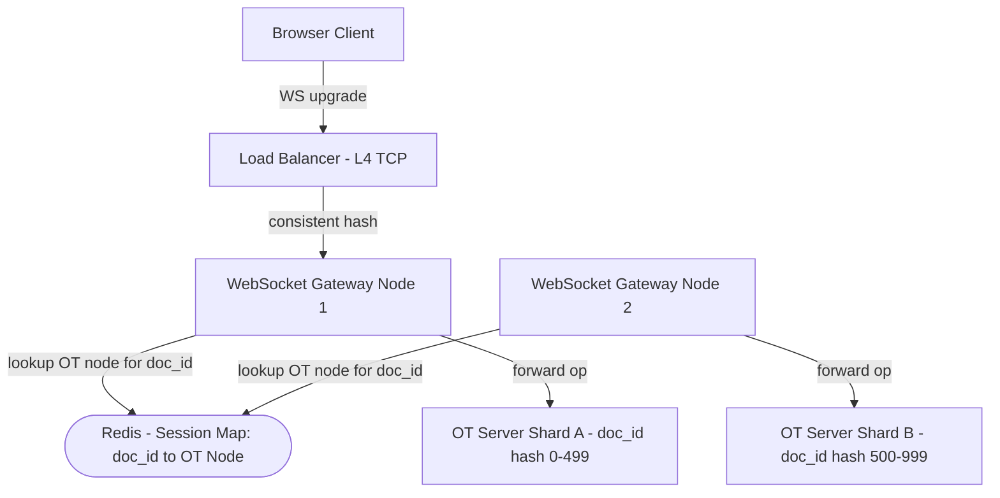
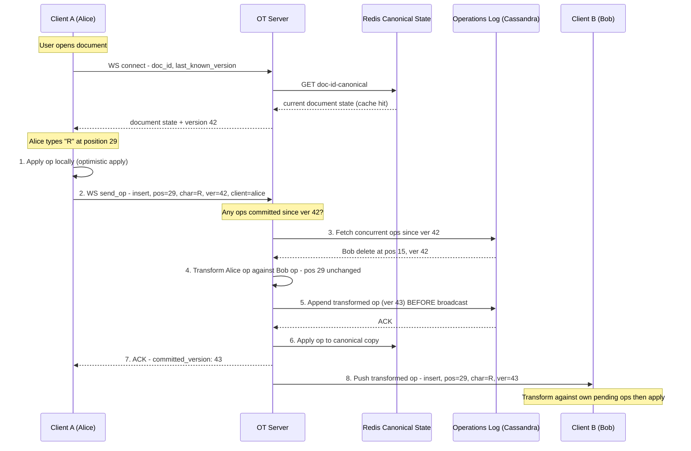
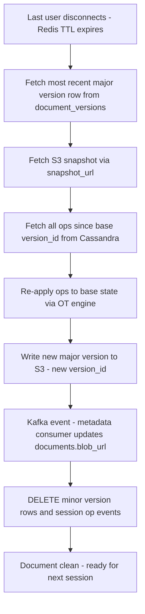

# System Design: Google Docs (Real-time Collaborative Editor)

---

## 1. What Is Google Docs?

Google Docs is a word processor that lives entirely in the browser: you open a document, start typing, and share a link so someone else can open that exact same document and start typing too — at the same time, in the same paragraph, if that's where the work happens to be. Everyone looking at the document sees everyone else's changes appear almost as fast as they're typed, along with a small colored cursor showing where each person is currently working. There's no "save" button to remember and no version-conflict dialog to resolve by hand — the document simply stays in sync for whoever has it open, whether that's two people or twenty.

---

## 2. A Day in the Life

Maya is drafting a project proposal and shares the link with Devesh so he can fill in the budget section. The moment he opens it, a small colored cursor labeled "Devesh" appears near the bottom of the page — he's in, and she can see exactly where he's about to start typing.

Maya keeps writing the opening paragraph while Devesh fills in numbers in the budget table below, and each of them watches the other's words appear letter by letter, without either one clicking refresh or worrying about whose turn it is to save.

At one point, they both go to fix the same sentence within a second of each other — Maya deletes a word near the front of the line while Devesh, editing from his laptop, inserts a word right where Maya just deleted. Neither of them notices anything odd about it: a second later, both of their screens show the exact same corrected sentence, as if only one of them had touched it.

Devesh then boards a flight and switches to airplane mode, but he keeps drafting the budget notes anyway — the app doesn't stop him just because there's no signal. An hour later he lands, his phone reconnects, and everything he wrote in the air quietly folds itself into the document alongside whatever Maya added while he was gone, with nothing lost on either side.

That evening, Maya notices she accidentally deleted an entire paragraph earlier in the day. She opens "Version History," finds the document exactly as it looked an hour before the mistake, restores it, and keeps editing from there.

Neither of them ever thought about a socket connection, a conflict, or a database — from here on, this is how that experience actually gets built.

---

## 3. Requirements — and Why They Matter

**Scope.** In scope: CRUD documents, real-time collaborative editing, cursor and presence tracking, document versioning and restore, offline editing with reconnect sync. Out of scope: comments and suggestions (separate service), permissions/sharing UI (IAM service), Spreadsheets and Slides (different data models).

**Functional requirements:**

1. **CRUD Documents** — create, open, rename, and delete documents
2. **Real-time collaborative editing** — all collaborators see changes within 100ms end-to-end
3. **Conflict resolution** — concurrent edits from multiple users must converge to the same document
4. **Cursor and presence** — see each collaborator's cursor position and online status
5. **Document versioning** — view history, restore to any prior named or auto-saved version
6. **Offline editing** — buffer local operations while offline, sync and reconcile on reconnect

<details markdown="1">
<summary><strong>Point to Ponder:</strong> Maya and Devesh both fix the exact same sentence within the same second — how does the document not end up scrambled?</summary>

Neither edit is thrown away, and neither one silently overwrites the other. The server treats Devesh's edit as having been generated *against* the document as it stood before Maya's edit landed, and mathematically adjusts — "transforms" — his edit's position to account for hers before applying it. If Maya deletes a character earlier in the line, every operation that was aimed at a position after that character gets shifted to compensate, so it still lands where the person intended, on the document as it actually exists now. See §8 Deep Dives for the full transform walkthrough, including the case where a naive merge (no transform at all) produces two different final documents on two different screens.

</details>

**Non-functional requirements — and why each one matters to a real user, not just as a target:**

| Requirement | Target | Why it matters |
|---|---|---|
| Edit propagation latency | < 100ms end-to-end | If Devesh's keystroke takes noticeably longer than that to reach Maya's screen, collaborative editing stops feeling like working in the same room and starts feeling like watching a delayed broadcast. |
| Availability | 99.99% for solo editing; CP (strong convergence) for collaborative | Typing alone should never be blocked by anything — but the moment a second person is in the document, showing "reconnecting" is better than silently letting two people's screens quietly become two different documents. |
| Durability | Zero data loss — ops appended to log before ACK | Losing even one keystroke of Maya's proposal because a server happened to crash at the wrong instant is not an acceptable failure mode for a writing tool. |
| Write throughput | 5 million ops/sec at peak | Not a promise to any one user directly — it's the load the system must sustain merely to keep the 100ms latency promise true across a million people typing at once. |
| Concurrent active editors | 1 million | Same idea: this is what "real-time collaboration for everyone editing right now" costs in raw concurrent load. |
| Storage retention | 30 days raw ops; indefinite snapshots in S3 | This is what makes Maya's "restore to an hour ago" actually possible — recent history has to be replayable, and named versions have to survive forever. |

**Consistency Model:**

| Domain | Model | Mechanism |
|---|---|---|
| Operations log | Linearizable (per document) | Single OT Server node owns each doc's session |
| Document state across clients | Eventual + strongly convergent | OT transforms ensure all clients converge |
| Cursor / presence | Ephemeral, eventual | Redis TTL; clients re-send on reconnect |
| Metadata (title, permissions) | Strong (ACID) | PostgreSQL with transactions |

> [!NOTE]
> **Key Insight:** Google Docs makes a deliberate CAP choice. Solo editing: AP (availability — your edits always go through). Collaborative editing: CP — all collaborators must converge to the same state; the OT server is the single serialization point. If it is unreachable, clients buffer locally and display "reconnecting" rather than allowing irreconcilable divergence.

<details markdown="1">
<summary><strong>Point to Ponder:</strong> Devesh drafts for a full hour with zero signal at all, not just a brief drop — does the server still transform his hundreds of buffered operations against everyone else's, one at a time, the instant he reconnects?</summary>

It has to, and this is exactly where Operational Transformation stops being a clean fit — OT was designed around a server that's reachable, reconciling a handful of concurrent operations, not an hour of accumulated offline edits arriving all at once. Long offline windows are the scenario CRDTs are actually built for: peer-to-peer merge by design, with no central server required to reconcile anything. The honest answer for Google Docs is that OT handles the real-time hot path (Maya and Devesh both online, editing live), while long offline reconciliation and non-text structured data lean on CRDT-style merge instead — two different tools for two different shapes of the same underlying problem. See §8.1 in Deep Dives for why OT and CRDT solve the same problem in fundamentally different ways.

</details>

---

## 4. Scale, From First Principles

Before designing anything, it's worth asking: with a billion documents in existence, how many of them are actually being edited at once, and what does that force onto the architecture before any technology gets named?

**How many documents are actively being edited right now?** Start from the total and estimate the active slice:
```
Total documents:              1 billion
Concurrent active editors:    1 million   (~0.1% of documents active at any time)
```
Only a tenth of a percent of all documents have someone typing in them at any given moment — but a tenth of a percent of a billion is still a million people, all of whom need sub-100ms propagation at the same time.

**How many operations does that generate per second?** A person editing text produces roughly one keystroke every 200 milliseconds:
```
Operations per editor per second:   5    (1 keystroke per 200ms)
Peak operations/sec:  1M editors x 5 ops/sec  =  5 million ops/sec
```
Five million operations a second, sustained at peak, is the number that rules out a naive "write every keystroke to a relational table" design before anything else is even considered.

**What does that mean for the operations log?** Each operation is small — type, position, character, version, client ID — roughly 200 bytes:
```
Write throughput:  5M ops/sec x 200 bytes  ~  1 GB/sec
```
A gigabyte a second of append-only writes, every second, all day, is squarely Cassandra territory: LSM-tree storage engines are built exactly for high-throughput sequential appends, and 1 GB/sec sustained is the kind of number that pushes a design toward that shape of database before considering anything else. That 1 GB/sec is the peak, not the steady-state — it works out to roughly 86 TB/day if sustained at peak all day, but the real average, once you account for traffic that isn't always at maximum, is closer to 10 TB/day. Either number is well past what a single database server holds, and retaining 30 days of raw operations at that rate works out to roughly 300 TB of hot storage — everything older than that gets compacted into snapshots and pushed to S3, since nobody needs millisecond-fresh access to a keystroke from three weeks ago.

**How many persistent connections does real-time collaboration require?** Every active editor needs an open channel to receive other people's edits the instant they happen:
```
WebSocket connections:  1 million   (one persistent connection per active editor)
```
At 64 KB of RAM per connection, that's roughly 64 GB of RAM spread across the WebSocket gateway fleet — a manageable number, but only if connections are sharded sensibly. Sharding by `doc_id` means every client editing a given document lands on the same OT Server node, which turns out to matter for a reason that goes well beyond load balancing (more on that in §5).

**What does holding the live document in memory actually cost?** A typical rich-text document snapshot is around 50 KB:
```
Redis canonical state:  50 KB x 1M active documents  =  ~50 GB hot
Redis cursor entries:   1 KB x 1M active documents    =  ~1 GB (negligible)
```
Fifty gigabytes comfortably fits inside a 256 GB Redis cluster, which is exactly why the design can afford to keep every actively-edited document's full current state in memory rather than reconstructing it from the operations log on every access.

These numbers are what drive three decisions before a single component gets drawn: Cassandra for the append-only, high-throughput operations log; Redis for in-memory canonical document state and ephemeral cursors; and sticky WebSocket routing so that OT has a single, unambiguous ordering point per document.

---

## 5. High-Level Architecture

Remember Maya and Devesh editing the same sentence a second apart from the story above — here's what actually happens underneath that.

> **Google Docs is not syncing text. It is syncing operations across distributed clients.**

This is the insight that unlocks the entire design. When Devesh types "R" at position 29, his client does not send the document — it sends `{ type: "insert", pos: 29, char: "R", version: 42, client_id: "devesh" }`. The document itself is a *materialized view* of a sequence of operations, not the source of truth. The operations log is the source of truth. Two people editing the same position at the same millisecond will produce divergent documents unless something transforms one operation against the other before applying it — the entire architecture exists to make that transformation correct, fast, and durable, all at once.

```
                    +----------------------------------------------------------+
                    |                      FAST PATH                            |
  +--------+  op    |  +----------+  transform  +----------+  broadcast        |
  | UserA  | ------>|  |OT Server | ----------->|OT Server | -------> peers    |
  +--------+        |  +-----+----+             +----------+                   |
   (optimistic      |        | concurrent ops                                  |
    local apply)    +--------+-------------------------------------------------+
                             | append (before broadcast, before client ACK)
                    +--------v-------------------------------------------------+
                    |                   RELIABLE PATH                           |
                    |              +-----------------+                          |
                    |              | Operations Log  |  <- every op stored     |
                    |              |   (Cassandra)   |     before ACK sent     |
                    |              +-----------------+                          |
                    +----------------------------------------------------------+
```

### Core Design Principles

| Path | Optimized For | Mechanism |
|---|---|---|
| Fast Path | Latency | Optimistic local apply → WebSocket to OT Server → transform → broadcast to peers |
| Reliable Path | Durability | Append to Cassandra ops log BEFORE ACK is sent to client |
| Canonical State | Instant join | Redis holds live document in memory — new joiner gets current state without op replay |
| Long-term Storage | Cost + versioning | S3 snapshots every N ops; old ops compacted after 30 days |

Both paths run on every single keystroke, not one after the other — the fast path is what makes typing feel instant, and the reliable path is what guarantees nothing is ever lost, and neither one waits for the other to finish.

<details markdown="1">
<summary><strong>Point to Ponder:</strong> When Devesh joins a document that Maya has already been editing for ten minutes, does his client have to replay everything that happened before he arrived?</summary>

No — that would mean replaying potentially thousands of accumulated operations on every single join, which gets slower the longer a session runs and the more popular a document is. Instead, the OT Server keeps a live, continuously-updated copy of the document's current state in Redis. A new joiner reads that copy directly and gets the current document instantly, with zero operations replayed. See §8.2 in Deep Dives for the full mechanism, including what happens the very first time anyone opens a document that has no warm Redis copy yet.

</details>

### From Simple to Evolved

The architecture starts as a single OT Server layer and evolves sticky routing as the fleet grows — here's both versions.

### Simple Design


### Evolved Architecture: Sticky WebSocket Routing

As the fleet grows past a single OT Server, every client editing a given document still has to land on the same node — a session map takes over that job explicitly instead of leaving it to whichever node the load balancer happens to pick:



> [!NOTE]
> **Key Insight:** OT requires all operations for a document to pass through a single server — this is a correctness requirement, not a scaling limitation. Without a single ordering point, two OT servers could transform the same pair of concurrent ops in different orders, producing permanently divergent documents. The session map in Redis routes every client for a given doc_id to the same OT Server node.

### The Full Sequence

The diagrams above show the components; here's the actual message sequence between them, walking through exactly the kind of near-simultaneous edit Maya and Devesh hit in the story.

When Devesh's client connects, it sends the `doc_id` and the last version number it knows about. The OT Server checks Redis for the canonical document state first — on a cache hit, Devesh gets the current document instantly without the server ever touching Cassandra. When Devesh types "R" at position 29, his client applies the change to its own screen immediately, before the server has seen it at all — this optimistic local apply is what makes typing feel instant rather than waiting on a round trip. His client then sends the operation to the server tagged with the version it was generated against: `{insert, position: 29, char: "R", based_on_version: 42}` — that version tag is what lets the server figure out exactly which operations Devesh's client didn't know about yet. The server checks whether anything has been committed since version 42, and finds that it has: Maya deleted a character at position 15 a moment earlier. It transforms Devesh's operation against Maya's — position 29 is still valid after a deletion at 15, so the operation stays as-is (had Maya deleted at position 20 instead, Devesh's position would have shifted down to 28 to account for the character that's no longer there). Before broadcasting anything to anyone, the server appends the transformed operation to Cassandra — if the server crashed at this exact instant, the operation would still be safe, recoverable on reconnect. It then updates the Redis canonical copy, so the next person who opens this document gets the latest state without any replay, and only after both of those are done does it ACK Devesh with the newly committed version number (43), letting his client promote that operation from "pending" to "committed." Finally, the server broadcasts the transformed operation to Maya's client, which applies it on top of whatever she's typed since. Both of their screens now show the identical document — even though they were typing into it at the same time.

The same sequence, compressed to one line:

```
Client → apply locally → send op → OT Server → transform against concurrent ops
       → append to log → broadcast transformed op → other clients apply
```



---

## 6. API Design

The API splits along the same fast-path/reliable-path line as the architecture itself: REST handles document lifecycle — creating, loading, sharing, and versioning a document, all things that have a definite answer right now — while every actual edit operation travels over a single persistent WebSocket connection instead.

| Method | Path | Description |
|---|---|---|
| POST | /api/v1/documents | Create new document, returns {doc_id} |
| GET | /api/v1/documents/{id} | Load document metadata + latest snapshot URL |
| POST | /api/v1/documents/{id}/share | Share with {user_id, permission: viewer/editor} |
| GET | /api/v1/documents/{id}/versions | List versions (major snapshots) |
| POST | /api/v1/documents/{id}/versions/{v}/restore | Restore to a previous version |
| WS | /ws/documents/{id} | Real-time collaboration channel |

The one design choice worth naming explicitly: nothing about an edit — insert, delete, or format — ever travels as a REST call or as a full document replacement. Every one of those goes over the WebSocket as a small delta operation, exactly like the `{insert, pos: 29, char: "R"}` operation traced through §5. Sending the whole document on every keystroke would make the 100ms latency budget impossible to hit at a million concurrent editors; sending only the delta is what makes the fast path fast.

---

## 7. Data Model

Nine different pieces of data live in this system, and grouping them by how they're actually used makes the storage choices close to self-explanatory.

**The relational, low-write-frequency data lives in PostgreSQL, because it needs joins and ACID transactions.** A document's ownership, title, and permission list change rarely, but when they change, they need to change correctly and atomically — a partially-applied permission grant is a security bug, not a UX nuisance. `documents` holds the metadata itself, including the `blob_url` pointing at the latest S3 snapshot, which gets updated by the reconciliation job (§8.3) after each editing session ends, not on every keystroke. `document_collaborators` sits alongside it specifically because "which documents are shared with me" is a JOIN across both tables, and permission changes (adding or removing an editor) need to be atomic — there's no acceptable "eventually correct" version of who is allowed to edit a document right now.

**The append-only, high-throughput data lives in Cassandra, because 5 million operations a second rules out anything else.** `document_operations` and `document_versions` share the same partition key — `doc_id` — specifically so that a single document's operations and its version history co-locate on the same set of nodes: replaying a document's history never means scattering reads across the cluster. Cassandra's LSM-tree write path is what actually absorbs 5M writes/sec in the first place — appends flow straight into a memtable and flush to disk in batches, with no row-level locking to contend with. The `is_major` flag on `document_versions` is the reconciliation job's own output marker: rows with `is_major = false` are intermediate auto-saves written every 10-20 seconds during a live session, while a single `is_major = true` row gets produced when the last collaborator disconnects, at which point every minor version for that session is deleted. Storage this way grows with editing *sessions*, not with keystrokes.

**Redis holds four different flavors of ephemeral state, and conflating any of them would cause the wrong eviction or TTL policy.** `doc:{doc_id}:canonical` is the live, full document state that the OT engine actually operates on — refreshed on every op, with a 30-minute TTL, and its eviction is what triggers the reconciliation job (§8.3). `cursor:{doc_id}` is presence data — who's editing where — with a deliberately short 30-second TTL, since a stale cursor is harmless and natural expiry handles a disconnect without anyone writing cleanup code. `session:{doc_id}` is the sticky-routing lookup from §5's evolved architecture: which OT node currently owns this document, read on every incoming connection. And `dedup:{client_id}:{client_seq}` exists purely to catch duplicate at-least-once deliveries — an O(1) existence check on the critical path, with a 1-hour TTL that's far longer than any realistic retry window.

**S3 holds the durable, immutable snapshots, because that's what a document actually is at rest.** Each snapshot is keyed as `doc_id/version_id/snapshot.bin`, served through a CDN for fast initial loads on large documents. Minor-version snapshot files get deleted once the reconciliation job produces a major version for that session; major versions are kept indefinitely, since a named or auto-saved version is exactly what "Version History" restores from.

| Entity | Storage | Key Columns |
|---|---|---|
| documents | PostgreSQL | doc_id (PK), owner_id, title, blob_url, current_version, created_at, is_deleted |
| document_collaborators | PostgreSQL | doc_id (FK), user_id (FK), permission, granted_at |
| document_operations | Cassandra (partition: doc_id; cluster: version_id ASC) | op_type, position, content, user_id, client_id, client_seq, timestamp |
| document_versions | Cassandra (partition: doc_id; cluster: version_id ASC) | snapshot_url, created_by, label, is_major, created_at |
| doc:{doc_id}:canonical | Redis (String, TTL 30 min) | Full serialized document state |
| cursor:{doc_id} | Redis (Hash, TTL 30s) | user_id → position, color, timestamp |
| session:{doc_id} | Redis (String, session-scoped) | OT node address |
| dedup:{client_id}:{client_seq} | Redis (String, TTL 1h) | exists flag |
| Document snapshots | S3 | doc_id/version_id/snapshot.bin |

---

## 8. Deep Dives

### 8.1 OT vs CRDT: Making Concurrent Edits Converge

**What this actually has to solve:** two clients generate operations concurrently against the same document state, and without deliberate reconciliation, they diverge permanently — not "eventually consistent and briefly different," but permanently different documents that never converge on their own.

Watch it happen with the simplest possible example. Start with a two-character document, "BC". Maya inserts "A" at position 0, producing "ABC" on her screen. Devesh, at the same moment, inserts "D" at position 2, producing "BCD" on his screen. If the server applies both operations naively — Maya's first, then Devesh's raw `insert("D", pos=2)` on top of it — it gets "ABDC". But Devesh's own screen, having applied his op to his own "BCD", already shows "ABCD" once Maya's op arrives on his side. Two collaborators, two different final documents, from what looked like two harmless, independent edits.

**What has to be prevented, specifically:** two clients ending up with different final text after editing concurrently; a position that was valid when an operation was generated becoming wrong by the time it's actually applied; and, for any approach that avoids a central authority, deleted content disappearing before every peer has actually seen the deletion.

Two fundamentally different mechanisms fix this, and it's worth understanding why each one works before comparing them.

**Operational Transformation (OT)** keeps a single server as the ordering authority for each document. When Devesh's operation arrives, the server checks what's committed since the version he generated it against, and transforms his position against every one of those operations before applying it. In the example above: Maya's insert at position 0 means every position at or after 0 shifts right by one. Devesh's `insert("D", pos=2)` becomes `insert("D", pos=3)` — and now both clients converge on "ABCD". The transform is what makes this correct, and a single server is what makes the transform well-defined: if two different OT servers transformed the same pair of concurrent operations in different orders, they'd produce two different — and equally "correct" — results, which is exactly the divergence problem all over again. That single-ordering-point requirement isn't a weakness to work around; it's the mechanism's whole reason for existing, and it costs nothing extra here since a central server already exists for auth and versioning anyway.

**CRDT with fractional indexing** solves the same problem by removing the need for a server to arbitrate at all. Instead of integer positions, every character gets a fractional position chosen in the gap between its neighbors, and merging two documents is just sorting all characters by that position value. Take the same "BC" document: B sits at 0.50, C at 0.75. Maya inserts "A" before B, and it gets position 0.25 — squarely between 0 and 0.50. Devesh inserts "D" after C, getting position 0.875 — between 0.75 and 1.0. Neither insert needed to know about the other at the moment it happened. Merge the two by sorting on position value, and the result is A(0.25), B(0.50), C(0.75), D(0.875) — "ABCD," with zero server coordination required at any point.

CRDT's genuine cost shows up on deletion, not insertion. Characters can't simply vanish from the structure the instant they're deleted, because a peer who was offline might still generate an operation that anchors to that now-gone character's identity — if Maya deletes B while Devesh, still offline, later types something anchored to "right after B," that anchor has to resolve to *somewhere*. The fix is a tombstone: B stays in the structure, invisible in the rendered text, until every peer has confirmed the deletion, at which point it can finally be garbage-collected. A heavily-edited document accumulates these tombstones and needs periodic compaction to keep the structure from growing forever. OT has no equivalent problem, precisely because it has no equivalent flexibility: the server is always the authority, so a deletion is final the instant it commits — there's no peer that could still be holding a stale reference to it, because there's no peer operating independently of the server in the first place.

Laid side by side, every dimension trades one mechanism's strength for the other's:

| Dimension | OT | CRDT |
|---|---|---|
| Server required | Yes — single ordering point per document | No — peers merge independently |
| Conflict resolution | Transform function adjusts integer positions | Operations anchor by unique id — no transform needed |
| Offline editing | Hard — server reconciliation on reconnect | Native — peers merge op sets in any order |
| Deletion | Final immediately | Tombstone until all peers confirm |
| Compaction overhead | None | Required — tombstone GC |
| Data structures | Linear text | Arbitrary — JSON trees, vector shapes |
| Used by | Google Docs (historically), Notion | VS Code Live Share (Yjs), Figma, Automerge |

That last row matters as much as any of the technical ones: OT's transform math is built around linear text positions, which is exactly what a document body is — but it doesn't generalize cleanly to arbitrary structures like a JSON tree or a vector shape, where CRDT's identity-anchored approach fits naturally instead.

**Chosen: OT** for the real-time hot path. Beyond fitting the fast-path architecture, a central server here is already mandatory for other reasons entirely — §9.2's Trade-offs discussion spells out exactly which ones — so OT's single-ordering-point requirement rides along on infrastructure that has to exist regardless, rather than adding anything of its own. The cost accepted is the offline-editing weakness named in the table above: an hour of offline edits, as in Devesh's flight from the Day in the Life story, genuinely doesn't fit the "server reconciles a few concurrent ops" model OT was designed around.

> [!NOTE]
> **Key Insight:** OT vs CRDT is a topology choice, not a quality comparison. OT is right when a central server already exists and offline windows are short. CRDT's advantage — no server, offline-native — only matters when peer-to-peer or long offline windows are a genuine requirement. For Google Docs: OT for the real-time hot path; CRDT-style merge for long offline reconciliation and structured non-text data.

---

### 8.2 Redis Dual Role: Canonical State + Presence

**Here's the problem we're solving:** when Devesh joins a document that Maya has been editing for ten minutes, the S3 snapshot is already stale — the operations log has three thousand events since it was written. Replaying three thousand operations to reconstruct current state on every new join takes seconds, which is unacceptable at the scale this system runs at.

**Solution:** on first access, the OT Server loads the S3 snapshot into Redis under `doc:{doc_id}:canonical`. Every committed operation after that gets applied to the Redis copy in memory, immediately. Any new joiner reads that Redis copy directly and gets the current state instantly — no operation replay, ever.

```
1. First user opens document
   -> GET doc:{doc_id}:canonical -> cache miss
   -> Fetch latest snapshot from S3 -> load into Redis
   -> Set TTL = 30 min (refreshed on each op)

2. User edits
   -> Op arrives -> OT Server transforms -> appends to Cassandra
   -> OT Server applies op to Redis canonical copy
   -> OT Server broadcasts to all connected peers

3. Second user joins mid-session
   -> GET doc:{doc_id}:canonical -> cache hit (instant)
   -> Return current state directly from Redis
   -> No S3 fetch, no op replay, no latency spike

4. Auto-save (every 10-20 seconds)
   -> Serialize Redis canonical copy -> write to S3 as minor version (is_major = false)
   -> Refresh TTL on Redis key

5. Last user disconnects
   -> Redis canonical TTL expires or is set short
   -> Reconciliation job fires (see Deep Dive 8.3)
   -> Redis key deleted
```


Redis is holding two fundamentally different things here, and losing either one has a different blast radius. `doc:{id}:canonical` is the live document content — hot, session-scoped, and its eviction is what triggers reconciliation, but losing it is entirely recoverable: reload the S3 snapshot and replay at most 10-20 seconds of operations from Cassandra, since that's the longest gap the auto-save cadence ever leaves. `cursor:{id}` is ephemeral user state on a 30-second TTL — safe to lose outright on a Redis failover, since clients simply re-send their cursor position on the next keystroke.

> [!NOTE]
> **Key Insight:** Redis is not just a cache here — it is the active working surface for collaborative editing. The OT engine operates on the Redis copy, not on S3. S3 is the durable checkpoint. Redis is the whiteboard everyone is writing on right now.

---

### 8.3 Session-End Reconciliation Job + Versioning

**Here's the problem we're solving:** auto-save runs every 10-20 seconds during a live session, which means a single busy document can accumulate hundreds of minor versions and millions of individual operation events. Left uncleaned, storage grows with every keystroke ever typed, not with every editing session — which is the wrong shape of growth entirely.

**The reconciliation job** fires the instant the last WebSocket connection for a `doc_id` closes — the same moment the Redis canonical TTL from §8.2 would otherwise expire. It fetches the most recent major version row, retrieves that row's S3 snapshot as a base, and pulls every operation committed since that version from Cassandra. It replays all of those operations on top of the base state through the same OT engine that applied them live, producing one final document state, which gets written to S3 as a brand-new major version. A Kafka event tells the metadata consumer to update `documents.blob_url` and `documents.current_version` in PostgreSQL, and only then does the job delete every minor-version row and every operation row that belonged to this session:

```
Trigger: last WebSocket connection closes for doc_id

Step 1: Fetch base major version row from document_versions
        (most recent row where is_major = true)
Step 2: Fetch its S3 snapshot using snapshot_url from that row
Step 3: Fetch all document_operations since that version_id from Cassandra
Step 4: Re-apply every op to base state -> produce final document state
Step 5: Write final state as new S3 file, record new row in document_versions
        with is_major = true (e.g. new version_id for this session)
Step 6: Publish Kafka event -> metadata consumer updates documents.blob_url
        and documents.current_version in PostgreSQL
Step 7: DELETE all document_versions rows with is_major = false for this session
Step 8: DELETE all document_operations rows for ops in this session

Net result: session collapses into one committed major version.
            S3 is clean; ops log is clean; metadata points to latest file.
```



Maya's "restore to an hour ago" from the Day in the Life story runs the same replay logic in reverse: given a target version V, find the largest major-version row at or before V, fetch its snapshot, fetch every operation between that snapshot and V, and apply them in order. It's the identical mechanism the reconciliation job already uses to collapse a session — just stopped partway through instead of run to completion.

Without this job, every document would accumulate unbounded minor versions in S3 and an unbounded number of operation events in Cassandra forever. The job keeps storage cost linear with the number of editing *sessions*, not the number of keystrokes ever typed — the same "buffer and merge" shape as LSM-tree compaction, paying the merge cost once, at the session boundary, rather than on every write.

> [!NOTE]
> **Key Insight:** Versioning is event sourcing. The operations log is the event store; snapshots are materialized views. Restore = nearest major snapshot + operation replay. The reconciliation job is the session boundary — it converts the live in-progress Redis state into durable committed history in S3.

---

## 9. Bottlenecks, Failure Scenarios & Trade-offs

A viral document — a public sign-up sheet, a shared exam — can pull in thousands of concurrent editors, and every one of them funnels through the single OT Server node that owns that document's session: at 5 operations per second per editor, a thousand simultaneous editors alone is 5,000 operations per second flowing through one process. The good news is that the OT Server is CPU-bound on transform logic rather than I/O-bound, so a larger CPU buys real headroom before anything else needs to change; on top of that, rate-limiting clients to something like 10 ops/sec each catches essentially nobody in normal use, and decoupling cursor updates from op processing — debounced at 50ms before they're even sent to the server — keeps presence traffic from competing with the operations that actually matter. For the genuinely extreme case, a massive shared spreadsheet, partitioning by section or tab gives each piece its own OT Server node rather than asking one node to own the whole document. In practice this ceiling matters less than it sounds: real-time collaborative editing with 1,000-plus concurrent editors on one document is rare, and when it does happen the system degrades cursor fidelity first and ops second — it never loses data, it just throttles how smooth the experience looks under extreme load.

Sticky routing — every client for a given `doc_id` reaching the same OT node — is what makes the single-ordering-point requirement work at all, but it also means taking an OT node down for maintenance forces every active session on it to migrate or reconnect. The fix is to drain rather than kill: send a "server shutting down, please reconnect" frame to every connected client first, let the load balancer route the reconnections to a healthy node, and let that new node pull state back from Cassandra and S3 within seconds.

Cassandra's write path is the third pressure point, since 5 million operations a second is the primary sustained load this whole system carries. The LSM-tree write pattern — memtable first, flushed to SSTables in batches — is built for exactly this, but compaction can still cause write stalls at this volume. Partitioning by `doc_id` scopes each partition's compaction work to just that document's operations rather than the whole cluster; `LeveledCompactionStrategy` suits the read-heavy version-restore path while `SizeTieredCompactionStrategy` suits write-heavy live sessions; a 30-day TTL on operation rows means Cassandra tombstone-deletes expired ops automatically during compaction, with no separate cleanup job; and beyond all of that, the cluster scales horizontally in the ordinary way — add nodes, rebalance tokens, increase vnodes.

---

### 9.1 Failure Scenarios

Every recovery story here splits along the same line the whole architecture does: what failed was either holding ephemeral session state, or it was holding something durable — and the two recover completely differently.

**OT Server and session-state failures recover fast, because nothing durable was actually lost.** If an OT Server node crashes mid-session, active editors simply lose their WebSocket connection; any operation genuinely in flight may not have committed yet, but clients reconnect to a fresh OT node that loads state straight from Cassandra and S3, and any uncommitted operation gets retried by the client — at-least-once delivery, deduplicated via `client_id` + `client_seq`, so a retry never double-applies. A narrower version of the same failure — the server crashes *after* writing to Cassandra but *before* broadcasting — looks like a committed operation the peers never received, but it's recoverable the same way: on reconnect, the server sends every operation since the client's last known version, and the missed one is simply included. If the Redis canonical copy itself is lost to a failover, new joiners briefly can't get an instant document state and any operations that hadn't yet been persisted to the canonical copy are gone from it — but recovery is just reloading the S3 snapshot and replaying at most 10-20 seconds of operations from Cassandra, since that's the widest gap the auto-save cadence ever leaves; cursors, being ephemeral by design, simply get re-sent by clients on their next keystroke.

**Storage-tier failures recover more slowly, but recover completely, because the durable log was written before anything else could go wrong.** A Cassandra node failure can degrade write quorum and spike read latency briefly, but replication factor 3 with quorum writes makes a single node's loss transparent, with operations buffering briefly in OT Server memory while it's absorbed. An S3 outage fails the initial document load and any new snapshot write, but live editing itself continues untouched — the operations log in Cassandra was never S3-dependent — while reads fall back to a stale CDN-cached snapshot and pending snapshot writes queue in Kafka for retry once S3 recovers. A Kafka outage pauses the snapshot pipeline specifically, since Cassandra holds the operations log independently of Kafka; the Snapshot Worker simply retries once Kafka comes back, with no data loss, only a delay in compaction.

**Client-side and background-job failures are the lowest-stakes of all, because they were designed to be recoverable by construction.** A client going offline just buffers its edits locally while its peers don't receive them; on reconnect, it sends its last known version, the server pushes everything it missed, and the client transforms its own buffered offline operations against the server's before flushing them in. And if the reconciliation job itself fails partway through, minor versions and operation events simply accumulate a little longer than intended — the job is idempotent, so it just retries at the next trigger, with the only cost being a temporary storage overhead, never a lost document.

---

### 9.2 Trade-offs

**OT vs CRDT for conflict resolution.** §8.1 walks through the full mechanism; the short version is a topology trade — OT needs one ordering server per document but costs nothing extra when a server already exists, while CRDT removes the server requirement at the cost of tombstones and compaction overhead.

**Chosen: OT** — a central server is already required here for access control, versioning, and billing, so OT's single-ordering-point requirement isn't an added constraint, it's reusing infrastructure that has to exist regardless. See §8.1 for why this specifically breaks down on long offline windows.

**Cassandra vs SQL for the operations log.** The two databases diverge hardest on write throughput: Cassandra sustains multi-million writes per second with linear horizontal scaling via its append-only LSM-tree design, while a single PostgreSQL primary tops out somewhere around 50,000-100,000 writes per second, with row-level locking and B-tree write amplification working against it well before that ceiling. What PostgreSQL keeps that Cassandra gives up is full SQL joins and aggregations, plus true ACID transactions instead of Cassandra's tunable, quorum-based consistency — the operations log doesn't need either of those, since it's write-once and read back sequentially by `(doc_id, version range)`, never joined against anything.

**Chosen: Cassandra** for the operations log — 5 million writes/sec is an order of magnitude beyond a single PostgreSQL primary's ceiling, and partitioning by `doc_id` colocates every operation for a document, which is exactly what fast sequential replay needs. The log is append-only and never requires a transaction, so ACID was never on the table for it in the first place.

> [!NOTE]
> **Key Insight:** Cassandra for the ops log is a write-throughput decision; PostgreSQL for document metadata is a correctness decision. Putting metadata in Cassandra would sacrifice the transactions safe permission changes need; putting the ops log in PostgreSQL would create a write bottleneck at 5M/sec. Use each database for what it's actually designed for.

**WebSocket vs SSE vs HTTP long-polling for the live editing channel.** The three differ mostly in direction and cost. WebSocket is fully bidirectional over one persistent connection — lowest latency, no HTTP overhead per message. SSE pushes server-to-client over a similarly persistent connection, but it's one-directional by design, so a client still needs a separate HTTP request every time it sends an operation. Long-polling simulates bidirectional communication with two separate connections, and pays a new HTTP request's worth of overhead on every single message, which is the highest latency of the three. WebSocket is also the only one of the three that's inherently stateful — it needs sticky routing, where SSE and long-polling are both stateless.

**Chosen: WebSocket** — collaborative editing requires both the client pushing operations and the server pushing transformed operations back to every peer, over the same channel, continuously. True bidirectional communication isn't a nice-to-have here; SSE and long-polling would both need a second channel bolted on for the client-to-server direction, adding exactly the connection overhead and complexity WebSocket avoids by default.

> [!IMPORTANT]
> **Key Insight:** The WebSocket sticky-routing requirement is a direct consequence of OT's single-ordering-point requirement — not a weakness of WebSocket itself. The infrastructure complexity is unavoidable given the correctness constraint already established in §5 and §8.1.

**Redis vs Cassandra for canonical document state.** Redis answers both reads and writes in sub-millisecond time, entirely in memory, while Cassandra's disk-backed LSM-tree path costs 1-5ms per read or write. Redis's durability is periodic AOF/RDB snapshotting — a small data-loss window on failure — versus Cassandra's fully durable, multi-replica storage. Redis also has native TTL-based session lifecycle management, where Cassandra would need an explicit cleanup job to age anything out. The memory cost of holding every active document's ~50 KB state in Redis across a million documents works out to roughly 50 GB — trivial for a dedicated cluster, where Cassandra's disk-based model has no such memory ceiling to begin with.

**Chosen: Redis** for canonical document state. The decisive factor is that the OT Server may read and re-apply this state thousands of times a second on a single hot document, and Cassandra's 1-5ms per read simply doesn't fit inside that budget the way Redis's sub-millisecond reads do. The durability window this trades away — at most 10-20 seconds of operations lost on a Redis failover — is fully recoverable from the Cassandra ops log, which is why it's an acceptable trade rather than a real risk.

> [!NOTE]
> **Key Insight:** At 5,000 operations/sec on a genuinely hot document, even Cassandra's 1-5ms per read would add 5-25 seconds of accumulated latency every single second — nowhere close to fitting inside a 100ms end-to-end budget. Redis's sub-millisecond reads are what keep the OT Server's critical path survivable at all.

---

## 10. Evaluation: Did We Meet the Requirements?

Six non-functional requirements were set out in §3. Here's how the design actually satisfies each one — not just what was promised, but the specific mechanism doing the work.

**Edit propagation latency (< 100ms end-to-end):** the fast path never touches a disk-backed database on its critical hop — optimistic local apply happens in zero time on the client, the transform runs against an in-memory Redis canonical copy (§8.2), and broadcasting to peers is a WebSocket push, not a poll. Every hop in §5's Full Sequence is sub-millisecond to low-single-digit milliseconds.

**Availability (99.99% solo; CP for collaborative):** solo editing is never blocked by anything, since a client applies its own keystrokes locally regardless of server reachability. Collaborative editing deliberately gives up availability the moment the OT Server is unreachable — clients buffer locally and show "reconnecting" rather than risk two people's screens silently becoming two different documents, exactly the CAP trade-off named in §3.

**Durability (zero data loss):** every operation is appended to the Cassandra ops log before the server ever broadcasts it or ACKs the sender (§5's Full Sequence, step 5). §9.1's Failure Scenarios show this holds even when the OT Server crashes at the worst possible instant — the operation is already durable, or it wasn't ACKed yet and the client retries it.

**Write throughput (5M ops/sec) and concurrent active editors (1M):** these aren't separately "achieved" after the fact — they're the numbers from §4 that ruled out a naive relational write path and selected Cassandra's append-only log and Redis's in-memory canonical state before either component was chosen. The architecture exists because of these numbers, not despite them.

**Storage retention (30 days raw; indefinite snapshots):** this is exactly what makes Maya's version restore possible. The 30-day Cassandra retention window is enough to replay any recent session, and the reconciliation job (§8.3) converts every session into a permanent major snapshot in S3 before that window closes — nothing that matters gets deleted, only the redundant minor versions and stale operation events that already served their purpose.

| Requirement | Mechanism |
|---|---|
| Edit propagation latency < 100ms | In-memory Redis canonical state + WebSocket broadcast, no disk-backed DB on the fast path |
| Availability — 99.99% solo / CP collaborative | Solo edits apply locally unconditionally; collaborative sync fails closed to "reconnecting" rather than diverging |
| Durability — zero data loss | Cassandra append-before-ACK on every operation; retried on crash via client_id + client_seq dedup |
| 5M ops/sec, 1M concurrent editors | Architectural constraints that selected Cassandra + Redis + WebSocket up front (§4) |
| 30-day retention + indefinite snapshots | Reconciliation job (§8.3) converts session history into permanent S3 majors before the Cassandra window closes |

---

## 11. Conclusion

This design treats a document not as a block of text to be kept in sync, but as a sequence of operations to be kept correctly ordered — the document itself is just whatever those operations produce when replayed. The hardest problem was never storage or bandwidth; it was making sure two people editing the same sentence at the same instant always converge on the same result, without a separate lock service and without losing a single keystroke along the way. Operational Transformation's single ordering point solves the convergence problem; Cassandra's append-before-broadcast solves the durability problem; Redis's canonical copy solves the "how does the next person join instantly" problem; and the reconciliation job solves the one problem none of the others touch — keeping storage bounded by sessions instead of by keystrokes, forever. Every other decision in this system falls out of getting those four pieces to work together without any of them blocking the others.

---

## 12. Interview Summary

### Key Decisions

| Decision | Problem It Solves | Trade-off Accepted |
|---|---|---|
| Delta operations, not file replacement | Catastrophic bandwidth at 1M editors; concurrent write data loss | Requires conflict resolution algorithm (OT/CRDT) |
| Operational Transformation | Concurrent edits produce divergent documents | Single central ordering server per document required |
| WebSocket, not HTTP | Server must push transformed ops to all peers in real time | Sticky routing required; stateful infrastructure |
| Cassandra for operations log | 5M writes/sec; append-only; partition by doc_id for replay | Eventual consistency on reads; no transactions |
| Redis canonical copy (session-scoped) | New joiners get current state instantly; no op replay | Small data loss window on Redis failover — recoverable from ops log |
| Redis cursors with TTL | Cursor data is ephemeral; DB writes would be wasteful | Not durable — cursor state lost on Redis failover (non-event) |
| Session-end reconciliation job | Prevents unbounded growth of minor versions and op events | Runs async — small window where intermediate state is Redis-only |
| S3 + CDN for snapshots | Fast initial load for large documents; globally cached | Eventual consistency between snapshot and live ops |
| Optimistic local apply | Users must feel keystrokes are instant — under 1ms perceived latency | Client must handle rollback on server rejection (under 0.01% of ops) |

### Fast Path vs Reliable Path

```
FAST PATH (optimized for latency):
  User types -> apply locally (0ms) -> WebSocket to OT Server (~20ms)
  -> transform against concurrent ops -> broadcast to peers (~50ms)
  -> peer applies -> end-to-end < 100ms

RELIABLE PATH (optimized for durability):
  OT Server receives op -> append to Cassandra ops log BEFORE broadcast
  -> if server crashes after write, op is in log
  -> on reconnect: client sends last_known_version -> server replays missed ops
  -> document converges — zero data loss
```

### Key Insights Checklist

- **OT requires a single central server per document** — correctness requirement, not a scaling weakness. Two ordering points would transform the same concurrent ops in different orders, producing permanently divergent documents.
- **The client applies keystrokes locally before the server ACK** — this optimistic apply is what makes Google Docs feel instant. Server transforms and confirms asynchronously; client reconciles silently.
- **Redis serves two roles: live canonical state AND ephemeral cursors** — `doc:{id}:canonical` is the active working surface for the OT engine (session-scoped, triggers reconciliation on eviction). `cursor:{id}` is ephemeral (30s TTL, safe to lose).
- **document_versions uses doc_id as partition key and version_id as clustering key** — is_major = true rows are session-end checkpoints; is_major = false rows are intermediate auto-saves deleted by the reconciliation job. This keeps version history reads co-located with ops in Cassandra.
- **The reconciliation job is the session boundary** — collapses all intermediate minor versions and op events into one final major S3 version when the last user disconnects. Storage grows with sessions, not keystrokes.
- **OT for the hot path, CRDT for the cold path** — OT is right for real-time editing with a central server. CRDT is right for long offline windows and non-text structured data. Production systems at Google's scale likely use both.
- **CRDT's hidden cost is tombstoning** — deleted characters stay in the structure until every peer confirms the deletion. OT has no tombstoning because the server is always the authority — deletion is final immediately.
- **Versioning = event sourcing** — the ops log is the event store; snapshots are materialized views. Restore = nearest major snapshot + op replay forward to the target version.
