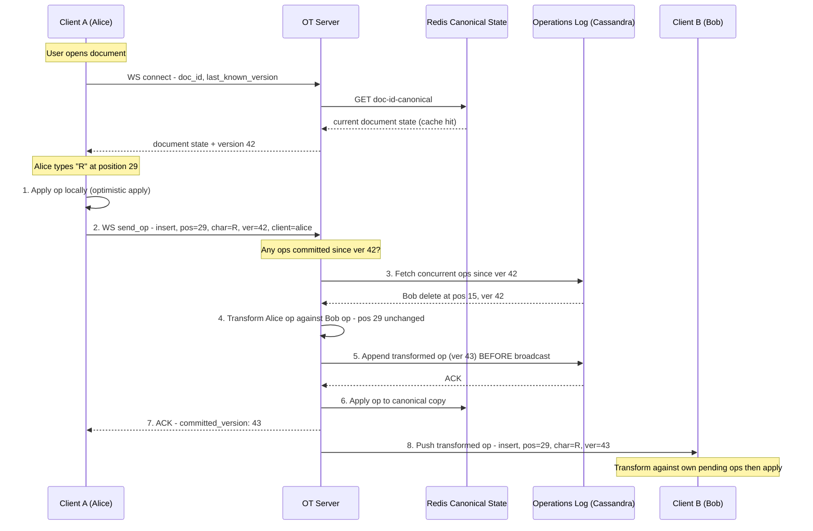
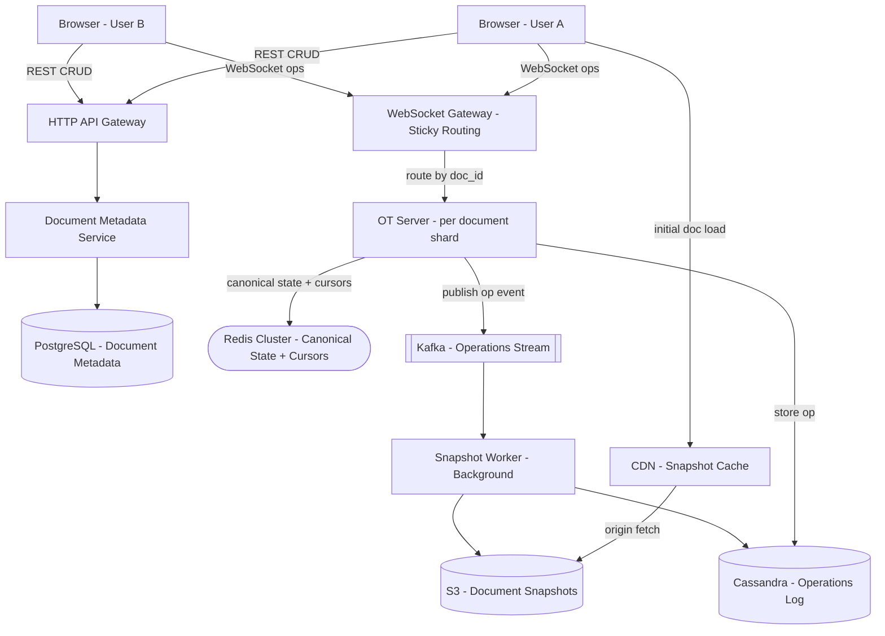
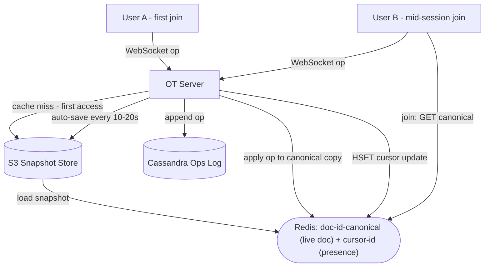
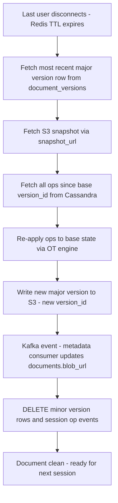

# System Design: Google Docs (Real-time Collaborative Editor)

---

## 1. Problem + Scope

Google Docs allows multiple users to edit the same document simultaneously in real time. Changes made by one user must appear in every other user's browser within 100ms. The system handles billions of documents, millions of concurrent editors, and guarantees zero data loss through an immutable operations log.

**In scope:** CRUD documents, real-time collaborative editing, cursor and presence tracking, document versioning and restore, offline editing with reconnect sync.

**Out of scope:** Comments and suggestions (separate service), permissions/sharing UI (IAM service), Spreadsheets and Slides (different data models).

---

## 2. Assumptions & Scale

| Parameter | Value | Reasoning |
|---|---|---|
| Total documents | 1 billion | Given |
| Concurrent active editors | 1 million | ~0.1% of documents active at any time |
| Operations per editor per second | 5 | 1 keystroke per 200ms |
| Peak operations/sec | 5 million | 1M editors x 5 ops/sec |
| Operation payload size | ~200 bytes | type + position + char + version + client_id |
| Operations write throughput | ~1 GB/sec | 5M ops x 200 bytes |
| Average document snapshot size | ~50 KB | Typical rich-text document |
| WebSocket connections | 1 million | One persistent connection per active editor |
| Redis cursor entries | 1 million keys | One HSET per active document, TTL = 30s |

**Cassandra sizing (operations log):**
- 1 GB/sec peak write throughput → ~86 TB/day at peak; real average ~10 TB/day
- Retain raw ops for 30 days → ~300 TB hot storage
- Ops older than 30 days compacted into snapshots → S3 cold storage

**WebSocket gateway sizing:**
- 64 KB RAM per connection → 1M connections → ~64 GB RAM across gateway fleet
- Horizontal scaling: shard by doc_id so all clients for one document land on one OT Server node

**Redis sizing:**
- `doc:{id}:canonical` per active document: ~50 KB x 1M active = ~50 GB hot (manageable with 256 GB Redis cluster)
- `cursor:{id}` per active document: ~1 KB x 1M = ~1 GB (negligible)

*These numbers drive three key decisions: Cassandra for append-only high-throughput ops log, Redis for in-memory canonical state and ephemeral cursors, and sticky WebSocket routing so OT has a single ordering point per document.*

---

## 3. Functional Requirements

1. **CRUD Documents** — create, open, rename, and delete documents
2. **Real-time collaborative editing** — all collaborators see changes within 100ms end-to-end
3. **Conflict resolution** — concurrent edits from multiple users must converge to the same document
4. **Cursor and presence** — see each collaborator's cursor position and online status
5. **Document versioning** — view history, restore to any prior named or auto-saved version
6. **Offline editing** — buffer local operations while offline, sync and reconcile on reconnect

---

## 4. Non-Functional Requirements

| Requirement | Target |
|---|---|
| Edit propagation latency | < 100ms end-to-end |
| Availability | 99.99% for solo editing; CP (strong convergence) for collaborative |
| Durability | Zero data loss — ops appended to log before ACK |
| Write throughput | 5 million ops/sec at peak |
| Concurrent active editors | 1 million |
| Storage retention | 30 days raw ops; indefinite snapshots in S3 |

### Consistency Model

| Domain | Model | Mechanism |
|---|---|---|
| Operations log | Linearizable (per document) | Single OT Server node owns each doc's session |
| Document state across clients | Eventual + strongly convergent | OT transforms ensure all clients converge |
| Cursor / presence | Ephemeral, eventual | Redis TTL; clients re-send on reconnect |
| Metadata (title, permissions) | Strong (ACID) | PostgreSQL with transactions |

> [!NOTE]
> **Key Insight:** Google Docs makes a deliberate CAP choice. Solo editing: AP (availability — your edits always go through). Collaborative editing: CP — all collaborators must converge to the same state; the OT server is the single serialization point. If it is unreachable, clients buffer locally and display "reconnecting" rather than allowing irreconcilable divergence.

---

## 5. Mental Model

> **Google Docs is not syncing text. It is syncing operations across distributed clients.**

This is the insight that unlocks the entire design. When Alice types "R" at position 29, Google Docs does not send the document. It sends `{ type: "insert", pos: 29, char: "R", version: 42, client_id: "alice" }`. The document is a *materialized view* of a sequence of operations — not the source of truth. The operations log is.

Two users editing the same position at the same millisecond will produce divergent documents unless a conflict resolution algorithm (OT or CRDT) transforms one operation against the other before applying. The entire architecture is organized around making that transformation **correct**, **fast**, and **durable**.

```
                    +----------------------------------------------------------+
                    |                      FAST PATH                            |
  +--------+  op    |  +----------+  transform  +----------+  broadcast        |
  | UserA  | ------>|  |OT Server | ----------->|OT Server | -------> peers    |
  +--------+        |  +-----+----+             +----------+                   |
   (optimistic      |        | concurrent ops                                  |
    local apply)    +--------+-------------------------------------------------+
                             | append (before broadcast, before client ACK)
                    +--------v-------------------------------------------------+
                    |                   RELIABLE PATH                           |
                    |              +-----------------+                          |
                    |              | Operations Log  |  <- every op stored     |
                    |              |   (Cassandra)   |     before ACK sent     |
                    |              +-----------------+                          |
                    +----------------------------------------------------------+
```

### Core Design Principles

| Path | Optimized For | Mechanism |
|---|---|---|
| Fast Path | Latency | Optimistic local apply → WebSocket to OT Server → transform → broadcast to peers |
| Reliable Path | Durability | Append to Cassandra ops log BEFORE ACK is sent to client |
| Canonical State | Instant join | Redis holds live document in memory — new joiner gets current state without op replay |
| Long-term Storage | Cost + versioning | S3 snapshots every N ops; old ops compacted after 30 days |

---

## 6. API Design

| Method | Path | Description |
|---|---|---|
| POST | /api/v1/documents | Create new document, returns {doc_id} |
| GET | /api/v1/documents/{id} | Load document metadata + latest snapshot URL |
| POST | /api/v1/documents/{id}/share | Share with {user_id, permission: viewer/editor} |
| GET | /api/v1/documents/{id}/versions | List versions (major snapshots) |
| POST | /api/v1/documents/{id}/versions/{v}/restore | Restore to a previous version |
| WS | /ws/documents/{id} | Real-time collaboration channel |

> [!NOTE]
> The WebSocket connection is the core of the system — REST APIs handle document lifecycle (create, share, version history). All edit operations (insert, delete, format) travel exclusively over WebSocket as delta operations, never full document replacement.

---

## 7. End-to-End Flow

> [!IMPORTANT]
> This is the flow interviewers want you to walk through. Every step has a purpose — know WHY each step exists.

**The one-line flow:**
```
Client → apply locally → send op → OT Server → transform against concurrent ops
       → append to log → broadcast transformed op → other clients apply
```

**The story in plain English:**

1. Alice opens a document — her client connects via WebSocket, sending the doc_id and her last known version number.
2. The OT Server checks Redis for the canonical document state. Cache hit — Alice gets the current document instantly without hitting Cassandra.
3. Alice types "R" at position 29. Her client applies the change locally first — this is what makes editing feel instant. No waiting for the server.
4. The client sends the operation to the server: {insert, position: 29, char: "R", based_on_version: 42}.
5. The server checks: has anything been committed since version 42? Yes — Bob deleted a character at position 15.
6. The server transforms Alice's operation against Bob's: position 29 is still valid after a deletion at 15, so the op stays as-is. (If Bob had deleted at position 20, Alice's position would shift to 28.)
7. Before broadcasting to anyone, the server appends the transformed op to Cassandra. If the server crashes right now, no operation is lost.
8. Server updates the Redis canonical copy — the next person who joins gets the latest state instantly.
9. Server ACKs Alice with the new committed version (43). Her client promotes the op from "pending" to "committed".
10. Server broadcasts the transformed op to Bob's client. Bob applies it on top of his own pending ops.
11. Both clients now show identical documents — even though they were editing simultaneously.



| Step | What happens | Why it must happen this way |
|---|---|---|
| 1. Local apply | Client applies op to local doc without waiting | Makes editing feel instant — zero perceived latency |
| 2. Send op | Op sent with client_version (version when op was generated) | Server needs the version gap to know which ops to transform against |
| 3. Fetch concurrent ops | Server retrieves all ops since client_version | These are ops the client did NOT know about when generating its op |
| 4. Transform | OT adjusts positions against each concurrent op | Without this, positions become wrong and documents diverge |
| 5. Append to log | Cassandra write BEFORE broadcasting | Op survives server crash — clients fetch on reconnect |
| 6. Update Redis | Apply op to canonical copy | Next joiner gets current state instantly |
| 7. ACK to sender | Confirm committed version | Client promotes pending op to committed — can generate next op correctly |
| 8. Broadcast | Push transformed op to all peers | Peers apply the server-transformed version, not raw client version |

---

## 8. High-Level Architecture



### Evolved Architecture: Sticky WebSocket Routing


> [!NOTE]
> **Key Insight:** OT requires all operations for a document to pass through a single server — this is a correctness requirement, not a scaling limitation. Without a single ordering point, two OT servers could transform the same pair of concurrent ops in different orders, producing permanently divergent documents. The session map in Redis routes every client for a given doc_id to the same OT Server node.

---

## 9. Data Model

### PostgreSQL — Document Metadata

PostgreSQL holds relational, low-write-frequency data that requires ACID transactions and JOIN support.

| Entity | Key Columns | Why this store |
|---|---|---|
| documents | doc_id (PK), owner_id, title, blob_url (latest S3 snapshot URL), current_version, created_at, is_deleted | ACID for ownership and permissions; low write frequency; blob_url updated by reconciliation job after each session |
| document_collaborators | doc_id (FK), user_id (FK), permission (viewer/editor/owner), granted_at | Relational; permission changes must be atomic; "shared with me" requires JOIN across both tables |

### Cassandra — Operations Log + Versions

Cassandra holds append-only, high-throughput data partitioned by doc_id. Two column families share the same partition key so ops and version history are co-located on the same nodes.

| Entity | Partition Key | Clustering Key | Key Columns | Why this store |
|---|---|---|---|---|
| document_operations | doc_id | version_id (ASC) | op_type, position, content, user_id, client_id, client_seq, timestamp | Append-only, 5M writes/sec; LSM-tree optimized; partition by doc_id colocates all ops for replay |
| document_versions | doc_id | version_id (ASC) | snapshot_url, created_by, label, is_major (boolean), created_at | Same partition key as ops — version history reads are co-located; is_major distinguishes session-end major versions from auto-save minor versions |

> [!NOTE]
> **Key Insight:** The is_major flag in document_versions is the reconciliation job's output marker. Minor versions (is_major = false) are intermediate auto-saves written every 10-20 seconds during a session. When the last user disconnects, the reconciliation job produces one new major version (is_major = true) and deletes all minor version rows for that session. Storage grows with sessions, not keystrokes.

### Redis — Live Session State

Redis holds two fundamentally different types of data. Conflating them would cause incorrect eviction and TTL policies.

| Key Pattern | Type | TTL | Contents | Role |
|---|---|---|---|---|
| doc:{doc_id}:canonical | String | 30 min (refreshed on each op) | Full serialized document state | Active working surface for OT engine; loaded from S3 on first access; triggers reconciliation on eviction |
| cursor:{doc_id} | Hash | 30s | user_id → position, color, timestamp | Ephemeral presence; natural expiry handles disconnect without explicit cleanup |
| session:{doc_id} | String | Session-scoped | OT node address | Sub-ms routing lookup for sticky WebSocket routing |
| dedup:{client_id}:{client_seq} | String | 1h | exists flag | At-least-once delivery; O(1) duplicate detection on the critical path |

### S3 — Document Snapshots

S3 holds immutable binary snapshots keyed as `doc_id/version_id/snapshot.bin`. Snapshots are served via CDN for fast initial document load. Old minor-version snapshot files are deleted after the reconciliation job produces a major version. Major versions are retained indefinitely for version history restore.

---

## 10. Deep Dives

### 10.1 OT vs CRDT with Fractional Indexing

**Here's the problem we're solving:** Two clients generate operations concurrently against the same document state. Without reconciliation, they diverge permanently.

```
Initial document: "BC"

Alice: insert "A" at position 0  -> local state: "ABC"
Bob:   insert "D" at position 2  -> local state: "BCD"

Naive merge (apply both without transformation):
  Server applies Alice first: "ABC"
  Server applies Bob's op (D at pos 2): "ABDC"   <- Alice sees "ABDC"
  Bob applied D to "BCD" then gets Alice's op  ->  Bob sees "ABCD"
  DIVERGED.
```

#### Operational Transformation (OT)

The OT server is the single ordering point. When Bob's op arrives, the server checks: which ops committed since Bob's last known version? It transforms Bob's position against Alice's insert:

```
Alice inserted at pos 0 -> all positions at or after 0 shift right by 1
Bob's insert("D", pos=2) -> becomes insert("D", pos=3)
Both converge to: "ABCD"  OK
```

OT requires a central server to impose the commit order. This is a correctness requirement — if two servers transformed the same op pair in different orders, they'd produce different results. The single OT Server node per document is not a weakness when you already need a central server for auth and versioning.

#### CRDT with Fractional Indexing (Interview Mental Model)

CRDT avoids integer positions entirely. Each character gets a fractional position chosen in the gap between neighbors. Merge = sort by position value. No server coordination needed.

```
Initial document: "BC"
  B is assigned position 0.50
  C is assigned position 0.75

Alice inserts "A" before B:
  A gets position 0.25  (between 0 and 0.50)
  Alice's state: A(0.25) -> B(0.50) -> C(0.75)

Bob inserts "D" after C:
  D gets position 0.875 (between 0.75 and 1.0)
  Bob's state: B(0.50) -> C(0.75) -> D(0.875)

Merge: sort all characters by position value
  A(0.25) -> B(0.50) -> C(0.75) -> D(0.875)
  Rendered: "ABCD"  OK  No server needed.
```

**The tombstone cost:** Deleted characters cannot be physically removed from a CRDT. If Alice deletes B and Bob (offline) types "X" after B, Bob's op anchors to B's id. If B was removed, Bob's op cannot be placed. Solution: B becomes a tombstone — invisible but still in the structure. Heavily-edited documents accumulate tombstones requiring periodic compaction. OT has no tombstoning because the server is always the authority — deletion is final immediately.

| Dimension | OT | CRDT |
|---|---|---|
| Server required | Yes — single ordering point per document | No — peers merge independently |
| Conflict resolution | Transform function adjusts integer positions | Operations anchor by unique id — no transform needed |
| Offline editing | Hard — server reconciliation on reconnect | Native — peers merge op sets in any order |
| Deletion | Final immediately | Tombstone until all peers confirm |
| Compaction overhead | None | Required — tombstone GC |
| Data structures | Linear text | Arbitrary — JSON trees, vector shapes |
| Used by | Google Docs (historically), Notion | VS Code Live Share (Yjs), Figma |

**Chosen: OT** — central server already exists; lower complexity; fast path fits the architecture.

> [!NOTE]
> **Key Insight:** OT vs CRDT is a topology choice, not a quality comparison. OT is right when a central server already exists and offline windows are short. CRDT's advantage (no server, offline-native) only matters when you genuinely need peer-to-peer or long offline windows. For Google Docs: OT for the real-time hot path; CRDT (or CRDT-style merge) for long offline reconciliation and structured non-text data.

---

### 10.2 Redis Dual Role: Canonical State + Presence

**Here's the problem we're solving:** When User B joins a document that User A has been editing for 10 minutes, the S3 snapshot is stale. The ops log has 3,000 events since then. Replaying 3,000 ops to reconstruct current state on every new join takes seconds — unacceptable at scale.

**Solution:** On first access, the OT Server loads the S3 snapshot into Redis under `doc:{doc_id}:canonical`. Every committed op is applied to the Redis copy in-memory. Any new joiner gets the Redis copy instantly — no op replay.

```
1. First user opens document
   -> GET doc:{doc_id}:canonical -> cache miss
   -> Fetch latest snapshot from S3 -> load into Redis
   -> Set TTL = 30 min (refreshed on each op)

2. User edits
   -> Op arrives -> OT Server transforms -> appends to Cassandra
   -> OT Server applies op to Redis canonical copy
   -> OT Server broadcasts to all connected peers

3. Second user joins mid-session
   -> GET doc:{doc_id}:canonical -> cache hit (instant)
   -> Return current state directly from Redis
   -> No S3 fetch, no op replay, no latency spike

4. Auto-save (every 10-20 seconds)
   -> Serialize Redis canonical copy -> write to S3 as minor version (is_major = false)
   -> Refresh TTL on Redis key

5. Last user disconnects
   -> Redis canonical TTL expires or is set short
   -> Reconciliation job fires (see Deep Dive 10.3)
   -> Redis key deleted
```



> [!IMPORTANT]
> Redis holds two fundamentally different types of data: `doc:{id}:canonical` is the live document content — hot, session-scoped, evicted at session end, triggers reconciliation on eviction. `cursor:{id}` is ephemeral user state — 30-second TTL, safe to lose on Redis failover (clients re-send on next keystroke). Losing the canonical copy is recoverable — reload S3 + replay at most 10-20 seconds of ops.

> [!NOTE]
> **Key Insight:** Redis is not just a cache here — it is the active working surface for collaborative editing. The OT engine operates on the Redis copy, not on S3. S3 is the durable checkpoint. Redis is the whiteboard everyone is writing on right now.

---

### 10.3 Session-End Reconciliation Job + Versioning

**Here's the problem we're solving:** Auto-save runs every 10-20 seconds during an editing session, producing hundreds of minor versions and millions of stored op events for a busy document. Left uncleaned, storage grows with every keystroke, not every session.

**The reconciliation job** fires when the last WebSocket connection for a doc_id closes (Redis canonical TTL expires):

```
Trigger: last WebSocket connection closes for doc_id

Step 1: Fetch base major version row from document_versions
        (most recent row where is_major = true)
Step 2: Fetch its S3 snapshot using snapshot_url from that row
Step 3: Fetch all document_operations since that version_id from Cassandra
Step 4: Re-apply every op to base state -> produce final document state
Step 5: Write final state as new S3 file, record new row in document_versions
        with is_major = true (e.g. new version_id for this session)
Step 6: Publish Kafka event -> metadata consumer updates documents.blob_url
        and documents.current_version in PostgreSQL
Step 7: DELETE all document_versions rows with is_major = false for this session
Step 8: DELETE all document_operations rows for ops in this session

Net result: session collapses into one committed major version.
            S3 is clean; ops log is clean; metadata points to latest file.
```



**Version restore algorithm:**
1. User requests restore to version V
2. Query document_versions: find the row with the largest version_id where is_major = true AND version_id <= V
3. Fetch that row's snapshot_url and retrieve from S3 (via CDN if recent)
4. Fetch all document_operations where version_id > snapshot version_id AND version_id <= V from Cassandra
5. Apply each op in order to the snapshot base state
6. Return reconstructed document

> [!IMPORTANT]
> **Why this matters for the interview:** Without the reconciliation job, every document accumulates unbounded minor versions in S3 and unbounded op events in Cassandra. The job keeps storage costs linear with the number of editing sessions, not the number of keystrokes. It is the same "buffer and merge" pattern as LSM-tree compaction — pay the merge cost once at session end.

> [!NOTE]
> **Key Insight:** Versioning is event sourcing. The operations log is the event store; snapshots are materialized views. Restore = nearest major snapshot + operation replay. The reconciliation job is the session boundary — it converts the live in-progress Redis state into durable committed history in S3.

---

## 11. Bottlenecks & Scaling

### Hot Document Problem

A single viral document (e.g., a public sign-up sheet or a shared exam) can attract thousands of concurrent editors. One OT Server node owns that document's session. At 5 ops/sec per editor, 1,000 editors = 5,000 ops/sec flowing through one process.

**Mitigations:**
- OT Server is CPU-bound on transform logic, not I/O-bound — vertical scaling (large CPU) buys headroom
- Rate limit ops per client per second (e.g., 10 ops/sec max) — most users never hit this
- Cursor updates are decoupled from op processing; debounce at 50ms before sending to server
- For truly massive documents (e.g., shared spreadsheets), partition by section/tab — each section gets its own OT Server node

> [!NOTE]
> **Key Insight:** The hot doc problem is bounded in practice. Real-time collaborative editing at 1,000+ concurrent editors is unusual. Google Docs degrades gracefully — cursor updates are dropped before ops, and ops are rate-limited. The system never loses data; it throttles visual fidelity under extreme load.

### WebSocket Sticky Routing at Scale

Sticky routing (all clients for doc_id X must reach the same OT node) limits horizontal scaling. The session map in Redis maps each doc_id to an OT node address. When an OT node is taken down for maintenance, all active sessions must be migrated or clients must reconnect.

**Mitigation:** Drain traffic before shutdown — send a "server shutting down, please reconnect" frame to all clients. Clients reconnect; load balancer routes to a healthy node; new OT node loads state from Cassandra + S3 within seconds.

### Cassandra Write Throughput

At 5M ops/sec, Cassandra is the primary write bottleneck. Cassandra's LSM-tree is designed for this pattern — writes go to memtable first, flushed to SSTables in batches. But at this volume, compaction can cause write stalls.

**Mitigation:**
- Partition by doc_id — each partition's ops are colocated; compaction is scoped
- Tune compaction strategy: LeveledCompactionStrategy for read-heavy version restore; SizeTieredCompactionStrategy for write-heavy live sessions
- Set TTL on op rows (30 days) — Cassandra tombstone-deletes expired ops during compaction automatically
- Scale Cassandra cluster horizontally: add nodes, rebalance tokens, increase vnodes

---

## 12. Failure Scenarios

| Failure | Impact | Recovery |
|---|---|---|
| OT Server node crashes mid-session | Active editors lose WebSocket connection; in-flight op may not have been committed | Clients reconnect — new OT node loads state from Cassandra + S3. Uncommitted ops are retried by client (at-least-once + dedup via client_id + client_seq) |
| OT Server crashes after Cassandra write, before broadcast | Op committed but peers never received it | On reconnect, server sends all ops since client's last_known_version — missed op is included |
| Redis canonical copy lost (Redis failover) | New joiners cannot get instant state; in-flight ops lost from canonical copy | Reload S3 snapshot + replay at most 10-20 seconds of ops from Cassandra. Cursors re-sent by clients on next keystroke |
| Cassandra node failure | Write quorum may degrade; read latency spikes | Cassandra replication factor 3 + quorum writes; one node failure is transparent. Ops buffer in OT Server memory briefly |
| S3 outage | Initial document load fails; snapshot writes fail | Serve stale CDN-cached snapshot for reads; queue snapshot writes in Kafka — retry when S3 recovers. Live editing continues (ops log is not S3-dependent) |
| Kafka outage | Snapshot pipeline pauses | Snapshot Worker retries on Kafka recovery. Operations log in Cassandra is unaffected — no data loss, only delayed snapshot compaction |
| Client offline (network drop) | Local edits buffered, peers do not receive ops | On reconnect: client sends last_known_version; server pushes all missed ops; client transforms buffered offline ops against server ops and flushes |
| Reconciliation job fails | Minor versions and op events accumulate; storage grows | Job is idempotent — retry at next trigger. Worst case: storage overhead until next successful run. No data loss |

---

## 13. Trade-offs

### OT vs CRDT

| Dimension | OT | CRDT |
|---|---|---|
| Server required | Yes — single central ordering server per document | No — peers merge independently |
| Conflict resolution | Transform function adjusts integer positions | Operations anchor by unique id — no transform needed |
| Offline editing | Hard — server reconciliation required on reconnect | Native — any peer merges any op set in any order |
| Deletion semantics | Final immediately | Tombstone until all peers confirm — compaction required |
| Data structures | Linear text only | Arbitrary — JSON trees, vector shapes |
| Used by | Google Docs (historically), Notion | VS Code Live Share (Yjs), Figma, Automerge |

**Chosen: OT** — a central server is already required for access control, versioning, and billing. OT's single-ordering-point requirement is not an additional constraint. CRDT's primary advantage (no server) is irrelevant when the central server already exists.

> [!NOTE]
> **Key Insight:** OT vs CRDT is a topology decision. OT is right when a central server already exists and offline windows are short. CRDT is right for peer-to-peer, long offline windows, or non-text structured data. Production systems at Google's scale likely use both: OT for the real-time hot path, CRDT-style merge for long offline reconciliation.

---

### Cassandra vs SQL for Operations Log

| Dimension | Cassandra | PostgreSQL |
|---|---|---|
| Write throughput | Multi-million writes/sec, linear horizontal scale | ~50-100K writes/sec ceiling on a single primary |
| Write model | Append-only, LSM-tree — ideal for this pattern | Row-level locking, B-tree — write amplification at scale |
| Query pattern | Sequential reads by (doc_id, version range) | Same, but with index scan overhead |
| Consistency | Tunable (quorum for ops log) | Strong ACID |
| Joins / aggregations | Not supported natively | Full SQL support |

**Chosen: Cassandra** — 5M writes/sec is an order of magnitude beyond what a single PostgreSQL primary can sustain. Partition by doc_id colocates all ops for a document, enabling fast sequential replay. The ops log is append-only and never requires transactions — no ACID needed.

> [!NOTE]
> **Key Insight:** Cassandra for the ops log is a write throughput decision. PostgreSQL for document metadata is a correctness decision. Using Cassandra for metadata (permissions, ownership) would sacrifice the transactions needed for safe permission changes. Using PostgreSQL for the ops log would create a write bottleneck at 5M/sec. Use each database for what it is designed for.

---

### WebSocket vs SSE vs HTTP Long-Polling

| Dimension | WebSocket | SSE | Long-Polling |
|---|---|---|---|
| Direction | Bidirectional | Server-to-client only | Simulated bidirectional (2 connections) |
| Latency | Lowest — persistent connection, no HTTP overhead | Low for server push | High — new HTTP request per message |
| Infrastructure | Sticky routing required; stateful | Stateless | Stateless |
| Client-to-server ops | Native over same connection | Separate HTTP requests | Separate HTTP requests |

**Chosen: WebSocket** — collaborative editing requires both the client pushing operations AND the server pushing transforms to all peers. True bidirectional communication is mandatory. SSE and long-polling require a second channel for client-to-server ops, adding connection overhead and complexity.

> [!NOTE]
> **Key Insight:** The WebSocket sticky routing requirement is a direct consequence of OT's single-ordering-point requirement — not a weakness of WebSocket. The infrastructure complexity is unavoidable given the correctness constraint.

---

### Redis vs Cassandra for Canonical Document State

| Dimension | Redis | Cassandra |
|---|---|---|
| Read latency | Sub-millisecond (in-memory) | 1-5ms (disk + LSM) |
| Write latency | Sub-millisecond | 1-5ms |
| Durability | Periodic AOF/RDB snapshot — small data loss window | Durable, multi-replica |
| Session lifecycle management | Native TTL — eviction triggers reconciliation | Requires explicit cleanup jobs |
| Memory cost | ~50 KB per active document x 1M docs = ~50 GB | Disk-based — no memory constraint |

**Chosen: Redis** — the canonical document state must be readable in sub-millisecond for every op the OT Server processes (potentially thousands per second per document). Cassandra at 1-5ms read latency would add unacceptable overhead to the transform-and-apply critical path. The small durability window (at most 10-20 seconds of ops to replay on Redis failover) is acceptable given the full ops log in Cassandra.

> [!NOTE]
> **Key Insight:** Redis for canonical state is a latency budget decision. At 5,000 ops/sec on a hot document, 1-5ms per read to Cassandra = 5-25 seconds of latency accumulating per second. Redis sub-millisecond reads keep the OT Server's critical path under 100ms end-to-end.

---

## 14. Interview Summary

### Key Decisions

| Decision | Problem It Solves | Trade-off Accepted |
|---|---|---|
| Delta operations, not file replacement | Catastrophic bandwidth at 1M editors; concurrent write data loss | Requires conflict resolution algorithm (OT/CRDT) |
| Operational Transformation | Concurrent edits produce divergent documents | Single central ordering server per document required |
| WebSocket, not HTTP | Server must push transformed ops to all peers in real time | Sticky routing required; stateful infrastructure |
| Cassandra for operations log | 5M writes/sec; append-only; partition by doc_id for replay | Eventual consistency on reads; no transactions |
| Redis canonical copy (session-scoped) | New joiners get current state instantly; no op replay | Small data loss window on Redis failover — recoverable from ops log |
| Redis cursors with TTL | Cursor data is ephemeral; DB writes would be wasteful | Not durable — cursor state lost on Redis failover (non-event) |
| Session-end reconciliation job | Prevents unbounded growth of minor versions and op events | Runs async — small window where intermediate state is Redis-only |
| S3 + CDN for snapshots | Fast initial load for large documents; globally cached | Eventual consistency between snapshot and live ops |
| Optimistic local apply | Users must feel keystrokes are instant — under 1ms perceived latency | Client must handle rollback on server rejection (under 0.01% of ops) |

### Fast Path vs Reliable Path

```
FAST PATH (optimized for latency):
  User types -> apply locally (0ms) -> WebSocket to OT Server (~20ms)
  -> transform against concurrent ops -> broadcast to peers (~50ms)
  -> peer applies -> end-to-end < 100ms

RELIABLE PATH (optimized for durability):
  OT Server receives op -> append to Cassandra ops log BEFORE broadcast
  -> if server crashes after write, op is in log
  -> on reconnect: client sends last_known_version -> server replays missed ops
  -> document converges — zero data loss
```

### Key Insights Checklist

- **OT requires a single central server per document** — correctness requirement, not a scaling weakness. Two ordering points would transform the same concurrent ops in different orders, producing permanently divergent documents.
- **The client applies keystrokes locally before the server ACK** — this optimistic apply is what makes Google Docs feel instant. Server transforms and confirms asynchronously; client reconciles silently.
- **Redis serves two roles: live canonical state AND ephemeral cursors** — `doc:{id}:canonical` is the active working surface for the OT engine (session-scoped, triggers reconciliation on eviction). `cursor:{id}` is ephemeral (30s TTL, safe to lose).
- **document_versions uses doc_id as partition key and version_id as clustering key** — is_major = true rows are session-end checkpoints; is_major = false rows are intermediate auto-saves deleted by the reconciliation job. This keeps version history reads co-located with ops in Cassandra.
- **The reconciliation job is the session boundary** — collapses all intermediate minor versions and op events into one final major S3 version when the last user disconnects. Storage grows with sessions, not keystrokes.
- **OT for the hot path, CRDT for the cold path** — OT is right for real-time editing with a central server. CRDT is right for long offline windows and non-text structured data. Production systems at Google's scale likely use both.
- **CRDT's hidden cost is tombstoning** — deleted characters stay in the structure until every peer confirms the deletion. OT has no tombstoning because the server is always the authority — deletion is final immediately.
- **Versioning = event sourcing** — the ops log is the event store; snapshots are materialized views. Restore = nearest major snapshot + op replay forward to the target version.
