# System Design: Google Docs (Real-time Collaborative Editor)

---

## 🧠 Mental Model

> **Google Docs is not syncing text. It is syncing operations across distributed clients.**

This is the insight that unlocks the entire design. When Alice types "R" at position 29, Google Docs does not send the document. It sends `{ type: "insert", pos: 29, char: "R", version: 42, client_id: "alice" }`. The document is a *materialized view* of a sequence of operations — not the source of truth. The operations log is.

Two users editing the same position at the same millisecond will produce divergent documents unless a conflict resolution algorithm (OT or CRDT) transforms one operation against the other before applying. The entire architecture is organized around making that transformation **correct**, **fast**, and **durable**. Everything else — WebSocket, Cassandra, Redis, S3 — serves those three requirements.

The system runs two paths concurrently:
- **Fast path**: apply locally → send to OT Server → transform → broadcast to peers (optimizes latency)
- **Reliable path**: append to Operations Log before ACK (optimizes durability)

```
                    ┌──────────────────────────────────────────────────────────┐
                    │                      FAST PATH                            │
  ┌────────┐  op    │  ┌──────────┐  transform  ┌──────────┐  broadcast       │
  │ UserA  │ ──────►│  │OT Server │ ───────────►│OT Server │ ──────► peers    │
  └────────┘        │  └──────┬───┘             └──────────┘                  │
   (optimistic      │         │ concurrent ops                                 │
    local apply)    └─────────┼───────────────────────────────────────────────┘
                              │ append (before broadcast, before client ACK)
                    ┌─────────▼───────────────────────────────────────────────┐
                    │                   RELIABLE PATH                           │
                    │              ┌─────────────────┐                         │
                    │              │ Operations Log   │  <- every op stored    │
                    │              │   (Cassandra)    │     before ACK sent    │
                    │              └─────────────────┘                         │
                    └─────────────────────────────────────────────────────────┘
```

### ⚡ Core Design Principle

| Principle | Decision | Why |
|---|---|---|
| Conflict resolution | Operational Transformation (OT) | Central server already required; OT maps naturally |
| Operation granularity | Delta (insert/delete + position) | Full file replacement causes last-writer-wins data loss |
| Transport | WebSocket (persistent, bidirectional) | HTTP request-response cannot push server-initiated ops |
| Durability | Append-only Operations Log in Cassandra | Event sourcing — replay any version from any point |
| Latency | Optimistic local apply before server ACK | Visual responsiveness over consistency for text editing |
| Ephemeral state | Redis with TTL for cursors and presence | Cursor data expires naturally; storing in DB adds write amplification |

---

## 1. Problem Statement & Scope

Google Docs allows multiple users to edit the same document simultaneously in real time. Changes made by one user appear in every other user's browser within milliseconds. The system must handle billions of documents, millions of concurrent editors, and guarantee zero data loss.

**In scope:**
- Create, read, update, delete documents
- Single-user and multi-user real-time collaborative editing
- Cursor positions and presence for all active collaborators
- Document versioning — save snapshots, restore to any version
- Offline editing with automatic sync on reconnect

**Out of scope:**
- Comments and suggestions (separate service)
- Permissions and sharing UI (separate IAM service)
- Spreadsheets and Slides (different data models)

---

## 2. Requirements

### Functional Requirements

1. **CRUD Documents** — create, open, rename, and delete documents
2. **Real-time collaborative editing** — all collaborators see changes within 100ms
3. **Cursor and presence** — see where each collaborator's cursor is and who is online
4. **Document versioning** — view history, restore to any prior version
5. **Offline editing** — buffer local operations while offline, sync on reconnect

### Non-Functional Requirements

| Requirement | Target |
|---|---|
| Concurrent active editors | 1 million |
| Total documents | 1 billion |
| Edit propagation latency | < 100ms end-to-end |
| Data durability | Zero data loss (operations log is source of truth) |
| Availability | 99.99% for solo editing; strong consistency for collaborative editing |
| Throughput | 5 million operations/sec at peak |

### CAP Discussion

> [!NOTE]
> **Key Insight:** Google Docs makes a deliberate CAP choice that varies by editing mode. Solo editing: AP (availability over consistency — your edits always go through even if a replica is stale). Collaborative editing: CP (consistency over availability — all collaborators must converge to the same document state; the OT server is the single ordering point).

For collaborative editing, the OT server acts as the serialization point. If it is unreachable, clients buffer locally and display a "reconnecting" state rather than allowing divergent edits that cannot be reconciled.

---

## 3. Back-of-the-Envelope Estimations

| Parameter | Value | Reasoning |
|---|---|---|
| Total documents | 1 billion | Given |
| Concurrent active editors | 1 million | 1% of documents active at any time |
| Operations per editor per second | 5 | 1 keystroke per 200ms |
| Peak operations/sec | 5 million | 1M x 5 |
| Operation payload size | ~200 bytes | Delta: type + position + char + version + client_id |
| Operations write throughput | ~1 GB/sec | 5M x 200B |
| Snapshot frequency | Every 100 ops | Background compaction |
| Average document snapshot size | ~50 KB | Typical rich-text document |
| Snapshot storage per day | ~500 GB | 1M active docs x 1 snapshot/day x 50KB |
| WebSocket connections | 1 million | One persistent connection per active editor |
| Redis cursor entries | 1 million keys | One HSET per active document, TTL = 30s |

**Cassandra sizing for operations log:**
- 1 GB/sec write throughput -> 86 TB/day at peak (real average ~10x lower -> ~10 TB/day)
- Retain raw operations for 30 days -> ~300 TB hot storage
- Older operations compacted into snapshots -> S3 for cold storage

**WebSocket gateway sizing:**
- Each WebSocket connection consumes ~64 KB memory at the server
- 1 million connections -> ~64 GB RAM across gateway fleet
- Horizontal scaling: shard by doc_id

---

## 4. API Design

### REST API (Document Lifecycle)

```
POST   /api/v1/documents
       Body:     { title, owner_id }
       Response: { doc_id, created_at, blob_url }
       Purpose:  Create a new empty document

GET    /api/v1/documents/{doc_id}
       Response: { metadata, content_url, current_version }
       Purpose:  Fetch document metadata and URL of latest snapshot (served via CDN)

DELETE /api/v1/documents/{doc_id}
       Purpose:  Soft-delete; moves to trash, not immediately purged

GET    /api/v1/documents/{doc_id}/versions
       Response: [{ version_id, created_at, snapshot_url, op_count }]
       Purpose:  List all named versions and auto-snapshots

POST   /api/v1/documents/{doc_id}/versions
       Body:     { label }
       Purpose:  Create a manual named snapshot at current state
```

### WebSocket API (Real-time Editing Session)

```
WS     /ws/documents/{doc_id}/edit
       Auth: Bearer token (validated on handshake upgrade)
       Sticky routing: client must reconnect to same OT Server node for the document

Client -> Server (operation):
  {
    type:      "operation",
    op: {
      type:      "insert" | "delete",
      pos:       29,
      char:      "R",
      version:   142,
      client_id: "uuid"
    }
  }

Client -> Server (cursor):
  {
    type:      "cursor",
    pos:       29,
    selection: { start: 29, end: 35 }
  }

Server -> Client (transformed operation broadcast):
  {
    type:              "operation",
    op:                { ...original_op },
    transformed_op:    { type: "insert", pos: 30, char: "R" },
    committed_version: 143
  }

Server -> Client (remote cursor):
  {
    type:    "cursor",
    user_id: "alice",
    pos:     15,
    color:   "#FF6B6B"
  }

Server -> Client (presence):
  {
    type:    "presence",
    user_id: "bob",
    status:  "online" | "idle" | "offline"
  }
```

> [!NOTE]
> **Key Insight:** The `version` field in the operation is the client's local version when the op was generated, not the server's committed version. The OT server uses this gap (client version vs. server version) to determine which concurrent operations must be transformed against.

---

## 5. System Architecture

### High-Level Architecture

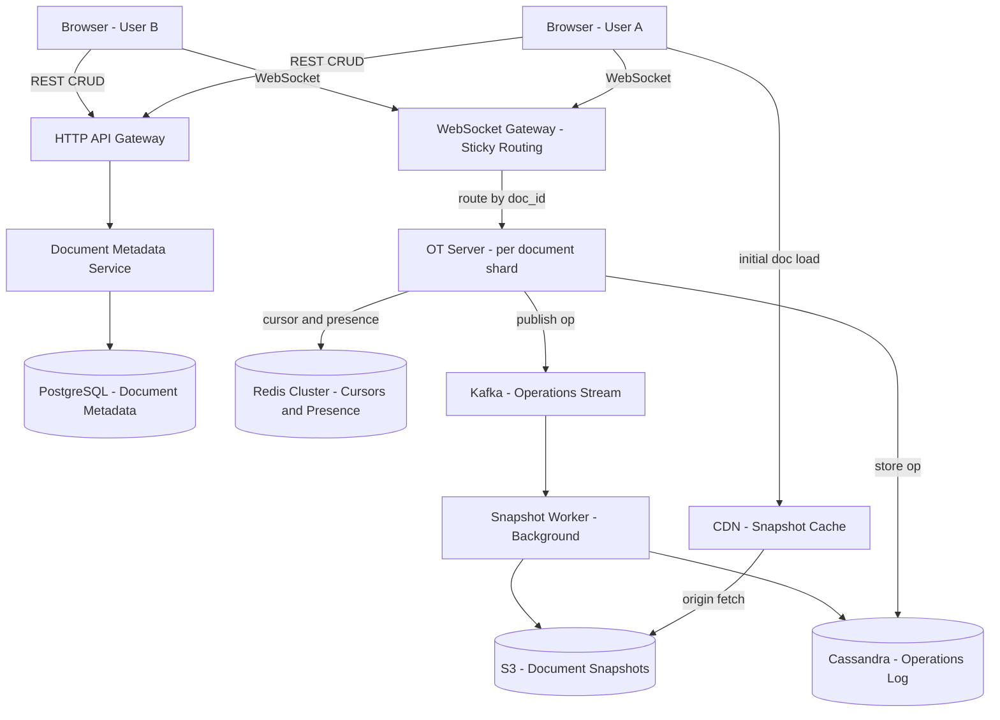

### Evolved Architecture: WebSocket Sticky Routing

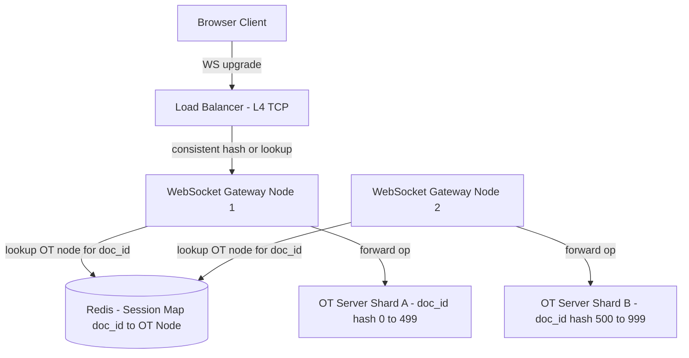

> [!NOTE]
> **Key Insight:** OT requires all operations for a document to pass through a single server — this is a correctness requirement, not a scaling limitation. Without a single ordering point, two OT servers could transform the same pair of concurrent operations in different orders, producing divergent documents. The session map in Redis routes every client for a given doc_id to the same OT Server node.

---

## 6. Operation Data Flow

> [!IMPORTANT]
> This is the flow interviewers want to hear you walk through. Every step has a purpose — know WHY each step exists.

### 🔄 Complete Operation Lifecycle

```
Step 1: Local Apply (client)
Step 2: Send to server (WebSocket)
Step 3: Transform on server (OT Engine)
Step 4: Append to Operations Log (Cassandra)
Step 5: Broadcast transformed op to all peers (WebSocket)
Step 6: Peers apply transformed op to their local doc
```

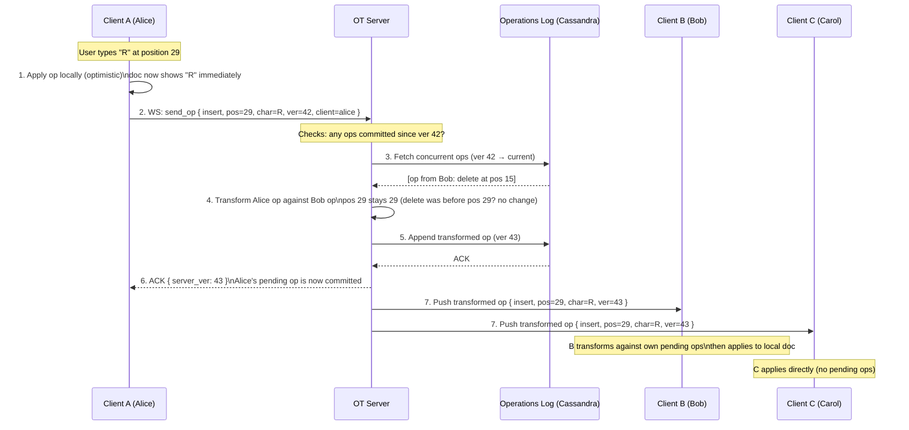

### Step-by-Step WHY

| Step | What happens | Why it must happen this way |
|------|-------------|----------------------------|
| 1. Local apply | Client applies op to local doc without waiting | Makes editing feel instant — zero perceived latency |
| 2. Send to OT Server | Op sent with `client_version` (doc version when op was generated) | Server needs the version gap to know which concurrent ops to transform against |
| 3. Fetch concurrent ops | Server retrieves all ops committed since `client_version` | These are the ops the client did NOT know about when it generated its op |
| 4. Transform | OT function adjusts positions against each concurrent op | Without this, positions become wrong → documents diverge |
| 5. Append to log | Store BEFORE broadcasting | If server crashes after write but before broadcast, the op is in the log — clients fetch on reconnect |
| 6. ACK to sender | Confirm the op's committed version | Client replaces pending op with committed version — can now generate next op correctly |
| 7. Broadcast to peers | Push transformed op to all connected clients | Peers apply the server-transformed version, not the raw client version |

> [!NOTE]
> **Key Insight:** The `client_version` is the crucial field. It tells the server "when I generated this op, I had seen operations up to version N." The server's job is to transform the op against everything that happened between version N and now. This is the entire OT algorithm in one sentence.

---

## 6b. Separation of Concerns

The system has three distinct layers. Keeping them separate is what makes the design scalable and debuggable.

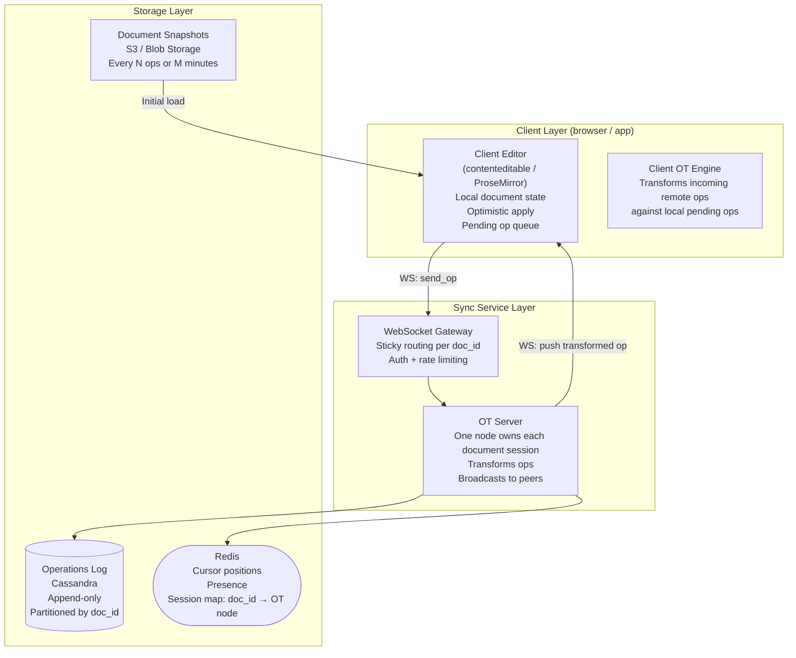

| Layer | Component | Responsibility | Why separated |
|---|---|---|---|
| Client | Editor | Local document model, keystrokes, rendering | Must be fast — no server round-trip |
| Client | Client OT Engine | Transform incoming remote ops against pending local ops | Client has unACKed ops the server hasn't seen yet |
| Sync | WebSocket Gateway | Auth, sticky routing, connection lifecycle | Stateless routing layer — separate from OT logic |
| Sync | OT Server | Canonical transformation and ordering point | Stateful per-document — must not be distributed |
| Storage | Operations Log | Durable, replayable event source | Decoupled from serving layer — allows versioning/audit |
| Storage | Snapshots | Fast initial load | Log replay from op 1 is too slow for large documents |
| Storage | Redis | Ephemeral state (cursors, presence, session map) | High-frequency writes with natural expiry — wrong fit for DB |

> [!NOTE]
> **Key Insight:** The Client OT Engine and the Server OT Engine are both necessary. The server transforms incoming ops against other clients' concurrent ops. The client transforms incoming remote ops against its own locally-pending (unACKed) ops. Neither can be skipped. Remove the client engine and cursor positions break whenever you have network lag.

---

## 6c. Consistency Model

### Eventual Consistency + Strong Convergence

Google Docs is an **eventually consistent** system with a **strong convergence** guarantee.

| Property | Definition | Google Docs guarantee |
|---|---|---|
| Eventual consistency | All replicas will agree on the same state... eventually | Yes — given no new ops, all clients converge |
| Strong convergence | If two replicas have applied the same set of ops (in any order), they are in the same state | Yes — OT's transformation property ensures this |
| Linearizability | Every op appears to execute atomically at a single point in time | No — not required for a text editor |
| Causal consistency | If op A happened before op B (as seen by the client), all clients see A before B | Yes — client version numbers enforce causal ordering |

```
Eventual consistency in practice:
  Alice:  "Hello"  →  "Hello World"  →  "Hello World!"
  Bob:     "Hello"  →  "Hello !"      →  "Hello World!"
                                               ↑
                              Both converge here after transformation
```

**Strong convergence is what OT (and CRDT) provide.** It means:
- Two clients applying the same set of operations will always reach the same final document state
- The ORDER in which concurrent ops are applied does not matter — transformation corrects positions
- This holds even with network delays, reordering, or reconnection

> [!NOTE]
> **Key Insight:** Google Docs does NOT guarantee that Alice and Bob see the same document at the same millisecond — that would require linearizability, which is prohibitively expensive at this scale. It guarantees that they converge to the same document. The gap is usually < 100ms and invisible to users.

---

## 6d. Edge Cases

### Out-of-Order Operations

**Problem:** Network reordering means op at version 44 arrives before op at version 43.

**Solution:** The OT server enforces ordering at the log level. Every op gets a monotonically increasing server version on commit. Clients buffer ops received out of order and apply them in version order.

```
Client receives: [ver=44 op], [ver=43 op]
                      ↓
Buffer: { 43: pending, 44: pending }
Wait for ver 43 → apply 43 → apply 44
```

> [!NOTE]
> **Key Insight:** The server version number is the total ordering mechanism. It converts the partial order (concurrent client ops) into a total order (globally committed sequence). Without it, clients would need vector clocks to detect ordering, which is far more complex.

---

### Duplicate Operations (At-Least-Once Delivery)

**Problem:** Client sends op, server commits and appends to log, but crashes before sending ACK. Client retries — duplicate op arrives.

**Solution:** Each op carries `(client_id, client_seq)`. OT Server checks Redis before processing:

```
GET dedup:{client_id}:{client_seq}
  → exists:  duplicate — return previously committed server_version, drop op
  → missing: process normally, SET dedup:{client_id}:{client_seq} {server_ver} EX 3600
```

---

### Network Delay and Reconnection

**Problem:** Client loses connection for 30 seconds. Misses 150 ops from other users. On reconnect, their local document is stale.

**Solution: Operation log catch-up**

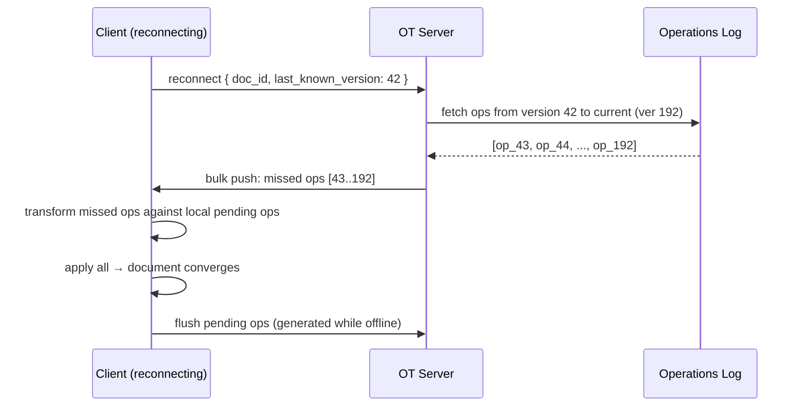

> [!NOTE]
> **Key Insight:** The Operations Log is not just for versioning — it is the reconnection mechanism. Every client disconnect/reconnect is handled identically: fetch ops since `last_known_version` from Cassandra, transform against local pending ops, apply. This also handles the offline editing case (F2 in the Frontend section).

---

## 7. Deep Dives

### 6.1 The Three Approaches to Collaborative Editing

This is the most important section of the design. Three approaches exist, and two of them fail at scale or correctness.

---

#### Approach 1: File Replacement (Brute Force)

**Idea:** On every keystroke, serialize the entire document, send it to the server, server overwrites storage, broadcasts new document to all clients.

**Problems:**

(a) **Payload is enormous.** A 100 KB document sends 100 KB per keystroke. At 5 ops/sec per user x 1M users = 500 GB/sec of document content transfer. Catastrophic.

(b) **Concurrent writes cause silent data loss.** Alice and Bob both read version N, both write version N+1 with their own changes. Bob's write overwrites Alice's. Last writer wins — Alice's work silently disappears.

(c) **DOM re-render cost.** The client must diff the entire document on every update to determine what changed for DOM patching.

**Verdict: Rejected.**

---

#### Approach 2: Locking Protocol

**Idea:** Prevent concurrent edits by serializing access.

**Pessimistic locking:** A user acquires an exclusive lock on the document before editing. Others see a read-only view until the lock is released.
- Problem: Completely incompatible with real-time collaboration. If Alice locks a document for 2 minutes of typing, Bob is frozen.

**Optimistic locking:** Users edit freely, but on commit the server checks if the base version is still current. If another write happened, the commit is rejected and the user must manually merge.
- Problem: Acceptable for code (Git), but unacceptable for a text editor. Users cannot be asked to resolve merge conflicts for every paragraph.

**Verdict: Rejected for real-time collaborative editing.**

---

#### Approach 3: Delta-Based with Conflict Resolution (OT or CRDT)

**Idea:**
1. Send only the operation delta: `{ type: "insert", pos: 29, char: "R" }` — not the whole file.
2. Use a persistent WebSocket for low-latency bidirectional messaging.
3. Use a conflict resolution algorithm (OT or CRDT) to reconcile concurrent operations before applying them.

**The Alice/Bob Problem — Why Naive Delta Merge Fails:**

```
Initial document: "BC"

Alice: insert "A" at position 0  ->  her local state: "ABC"
Bob:   insert "D" at position 2  ->  his local state:  "BCD"

Naive server merge (apply both without transformation):
  Server applies Alice's op first: "ABC"
  Server applies Bob's op (D at pos 2): "ABDC"   <- Alice sees "ABDC"
  Bob applied D to "BCD" then receives Alice's op  -> Bob sees "ABCD"

Alice sees "ABDC", Bob sees "ABCD" -- DIVERGED. Documents are inconsistent.
```

**With OT (Operational Transformation):**
- Bob's op `insert("D", pos=2)` was generated against version "BC" (before Alice's insert)
- The server knows Alice's op happened first (committed at version 1)
- The OT server transforms Bob's op: Alice inserted at pos 0, which shifts all positions right by 1 — Bob's pos 2 becomes pos 3
- Transformed op: `insert("D", pos=3)`
- Both Alice and Bob converge to: "ABCD" ✓

**Verdict: CHOSEN.** Delta-based operations with OT conflict resolution.

---

### 6.2 OT vs CRDT — The Core Algorithm Choice

Both OT and CRDT solve the concurrent edit problem. They take fundamentally different approaches.

#### OT (Operational Transformation)

- The server maintains a canonical operation history for the document
- When a client op arrives, the server checks: which ops were committed since the client's last known version?
- The transformation function adjusts the incoming op's position against each concurrent op
- All operations for a document must pass through a single server (the ordering point)

**Transformation rules (simplified):**

| Concurrent ops | Rule |
|---|---|
| Insert(A) vs Insert(B), A <= B | B becomes B + 1 |
| Insert(A) vs Insert(B), A > B | B stays B |
| Insert(A) vs Delete(B), A <= B | B becomes B + 1 |
| Delete(A) vs Delete(B), A < B | B becomes B - 1 |
| Delete(A) vs Delete(B), A >= B | B stays B |

#### CRDT (Conflict-free Replicated Data Type)

- Position is encoded as a fractional index (e.g., 0.25, 0.75) rather than an integer
- Insert between two positions by choosing a fractional value between them
- Merge is deterministic: sort all elements by their fractional position
- No central server required — any peer can merge independently

**The Alice/Bob example with CRDT:**

```
Initial state:
  "B" at position 0.50
  "C" at position 0.75

Alice inserts "A" between 0 and "B": position = 0.25  ->  A(0.25) B(0.50) C(0.75)
Bob inserts "D" between "C" and 1.0: position = 0.875 ->  B(0.50) C(0.75) D(0.875)

Merge: sort by position value
  A(0.25)  B(0.50)  C(0.75)  D(0.875)  =  "ABCD"

Both clients converge to "ABCD" without any central server. Correct.
```

#### OT vs CRDT Comparison

| Dimension | OT | CRDT |
|---|---|---|
| Server topology | Requires single central ordering server | Works peer-to-peer or distributed |
| Conflict resolution | Transform function (complex to implement correctly) | Sort by fractional position (simpler merge) |
| Offline editing | Difficult — must reconcile with server on reconnect | Native — any peer can merge independently |
| Position explosion | Not a problem | Fractional indices grow unbounded (mitigated by compaction) |
| Correctness surface | Large — all op-type combinations must be handled | Smaller — merge is a sort |
| Used by | Google Docs, Notion | Figma (Logoot), Liveblocks, Yjs, Automerge |

**Chosen for this design: OT**

> [!NOTE]
> **Key Insight:** OT vs CRDT is not about which is "better" — it is about topology. If your system already requires a central server (for access control, versioning, billing, and audit logs), then OT is the correct choice. CRDT's primary advantage — no central server — becomes irrelevant in a system that already has one. Adding CRDT's complexity (position explosion, compaction, fractional index management) for an advantage you do not need is wasteful.

---

### 6.3 Fast Path vs Reliable Path

Every operation in Google Docs travels both paths simultaneously.

#### Fast Path (Latency-Optimized)

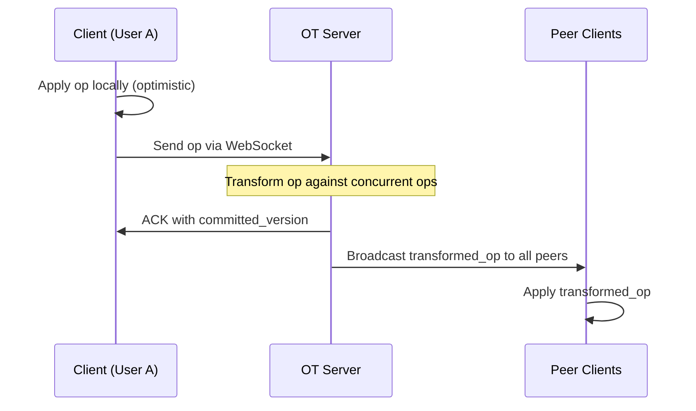

The client applies the operation to its local document model **before** the operation reaches the server. The user sees their keystroke reflected in the UI with zero network latency. If the server later transforms the operation, the client reconciles silently.

> [!NOTE]
> **Key Insight:** The client applies the operation locally BEFORE the server ACK. This is what makes Google Docs feel instant. In a chat app, the message is stored server-side first. In a text editor, visual latency matters more than consistency — you must feel that your keystroke registered immediately.

#### Reliable Path (Durability-Optimized)

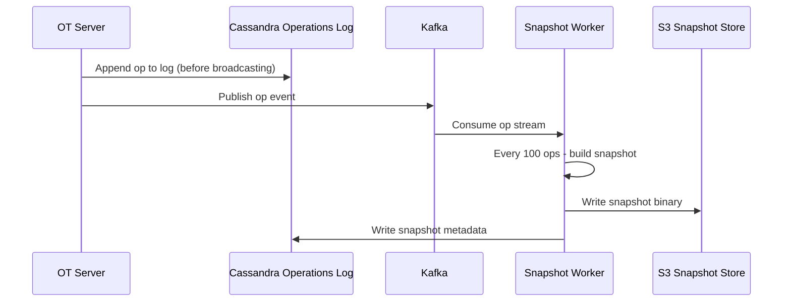

The OT Server writes the operation to Cassandra **before** broadcasting to peers. If the server crashes mid-broadcast, operations are never lost — they are replayed from the log on reconnect. The Kafka stream drives background snapshot creation without blocking the critical path.

**Reconnect flow:**
1. Client reconnects with `last_applied_version = 142`
2. Server queries Cassandra: all ops for doc_id X where version > 142
3. Server sends missed operations to client
4. Client applies them in order, transforming against any pending local ops

**Key difference from chat systems:** In Google Docs, the CLIENT applies the operation before the server ACK. In a chat app, the server stores the message first. This reflects the priority difference — in docs, visual latency matters more than consistency; in chat, message durability matters more than render speed.

---

### 6.4 Versioning (Operations Log + Snapshots = Event Sourcing)

> [!NOTE]
> **Key Insight:** Google Docs versioning is identical to the Event Sourcing pattern. The Operations Log is the event store. Document snapshots are materialized views. To reconstruct any historical state: fetch the nearest snapshot before the target version, then replay operations forward.

#### Operations Log Schema (Cassandra)

```
Table: document_operations

Partition key:  doc_id          UUID
Clustering key: version         BIGINT  (ascending)

Columns:
  op_type     TEXT        -- "insert" | "delete"
  position    INT
  content     TEXT        -- character(s) inserted
  user_id     UUID
  client_id   UUID
  timestamp   TIMESTAMP
```

**Why Cassandra?**
- **Append-only write pattern** — operations are never updated, only inserted. Cassandra's LSM-tree is optimized for append-heavy workloads.
- **Partition by doc_id** — all operations for a document are co-located on the same partition, enabling fast sequential reads for replay.
- **High write throughput** — Cassandra handles millions of writes/sec natively with tunable consistency.

#### Snapshot Lifecycle

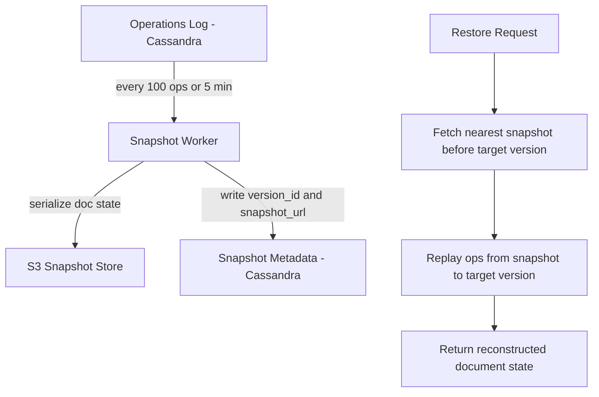

#### Version Restore Algorithm

```
1. User requests restore to version V
2. Query: SELECT MAX(snapshot_version) WHERE doc_id = X AND snapshot_version <= V
3. Fetch snapshot binary from S3 (via CDN if recent)
4. Query: SELECT op FROM document_operations
          WHERE doc_id = X
            AND version > snapshot_version
            AND version <= V
5. Apply each operation in order to the snapshot base state
6. Return reconstructed document
```

**Storage optimization:** Raw operations are retained for 30 days. After 30 days, old operations are compacted — the snapshot becomes the source of truth and individual ops are deleted. Users can still view the version (via snapshot) but cannot replay individual keystrokes.

---

### 6.5 Cursor and Presence

Cursor state is ephemeral — it has a natural expiry when the user stops moving or disconnects. Storing cursor positions in a relational database would add unnecessary write amplification for data that expires within seconds.

#### Cursor Flow

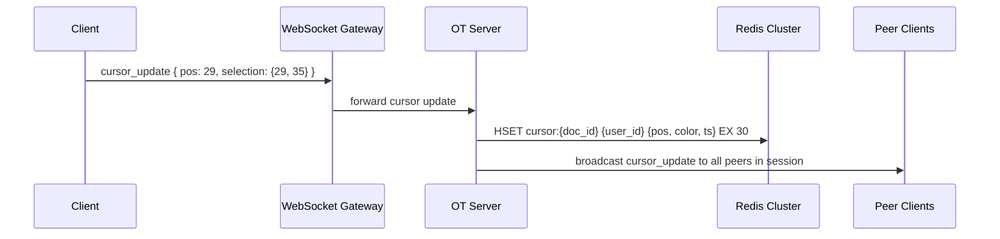

#### Redis Cursor Schema

```
Key:   cursor:{doc_id}
Type:  Hash
Field: {user_id}
Value: { pos: 29, selection: {start: 29, end: 35}, color: "#FF6B6B", ts: 1709123456 }
TTL:   30 seconds (refreshed on each cursor update)
```

> [!NOTE]
> **Key Insight:** Presence is ephemeral — Redis with TTL handles cleanup automatically. When a user disconnects without sending an explicit "offline" event (e.g., browser tab killed), the TTL ensures the cursor entry expires within 30 seconds. Storing cursor/presence state in PostgreSQL would require a background cleanup job to purge stale rows. Redis TTL is the correct primitive for data with natural expiry.

#### Presence State Machine

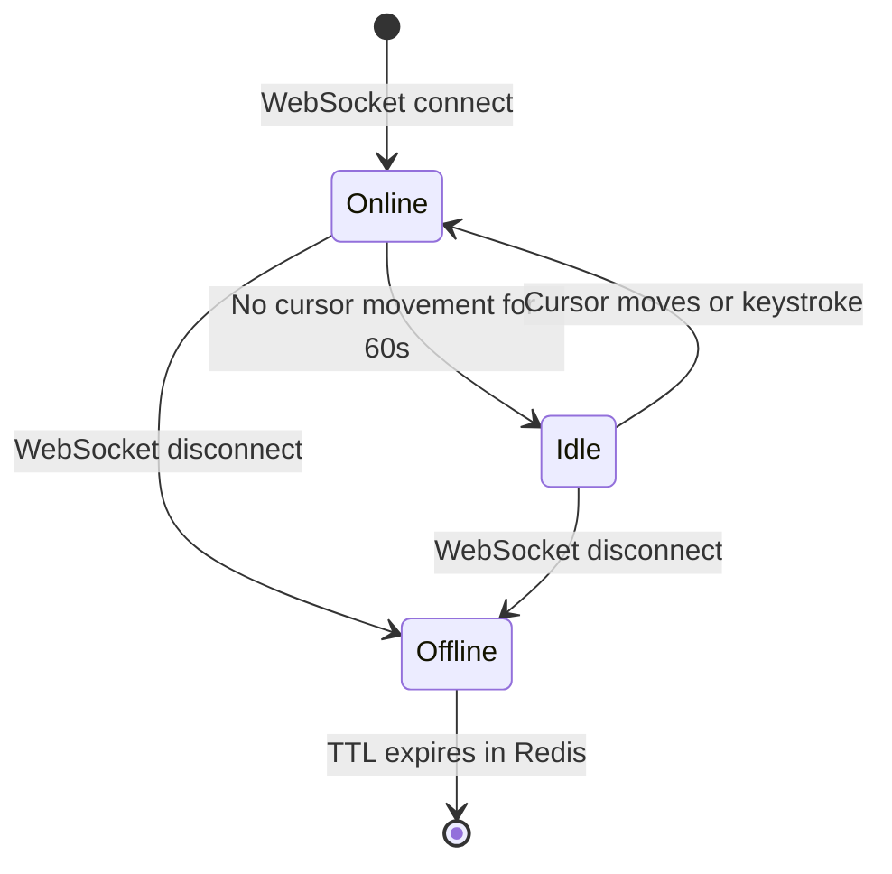

---

## 7. ⚖️ Key Trade-offs

### Trade-off 1: OT vs CRDT

| Dimension | OT | CRDT |
|---|---|---|
| Central server required | Yes | No |
| Implementation complexity | High — transform all op-type combinations | Medium — position explosion mitigation |
| Offline support | Difficult — server reconciliation needed | Native — peers merge independently |
| Integration with central auth/versioning | Natural fit | Requires retrofitting |

**Chosen: OT.**
One-line reason: a central server is already required for access control, versioning, and billing — OT's single-ordering-point requirement is not an additional constraint.

#### When to use OT vs When to use CRDT

| Signal | Choose OT | Choose CRDT |
|---|---|---|
| Server topology | You already have a central server (auth, billing, audit) | Peer-to-peer or multi-master without a single owner |
| Offline support | Short offline windows; reconnect to reconcile | Long offline or mesh networks (mobile, local-first apps) |
| Team size building it | Small team, correctness over flexibility | Large infra team with bandwidth to maintain CRDT compaction |
| Data model | Linear text (Google Docs, Notion, code editors) | Arbitrary data structures (Figma shapes, JSON trees) |
| Real-world example | Google Docs, Notion, Quip | Figma, Liveblocks, Yjs, Automerge |

> [!IMPORTANT]
> **When to use which — the one-line rule:**
> OT = simpler but centralized. CRDT = scalable but complex.
> If you already have a central server, OT's centralization is not a cost — it is free. Add CRDT only when peer-to-peer or multi-master is a genuine requirement.

> [!NOTE]
> **Key Insight:** CRDT's "no central server" advantage is only valuable in a truly peer-to-peer system. Google Docs is not peer-to-peer — it has accounts, permissions, and audit logs. The central server exists regardless. OT is simpler to reason about and operationally maintain when a central ordering point already exists.

---

### Trade-off 2: WebSocket vs HTTP Long-Polling vs SSE

| Dimension | WebSocket | Long-Polling | SSE |
|---|---|---|---|
| Bidirectional | Yes | Simulated (2 connections) | No (server-to-client only) |
| Latency | Lowest — persistent connection | High — new HTTP request per message | Low — persistent, but client cannot push |
| Infrastructure complexity | Sticky routing required; stateful | Stateless — any node | Stateless |
| Real-time op delivery | Native | Possible but wasteful | Cannot receive client ops |

**Chosen: WebSocket.**
One-line reason: collaborative editing requires both the client pushing operations and the server pushing transforms — true bidirectional communication is mandatory.

> [!NOTE]
> **Key Insight:** The WebSocket sticky routing requirement (each client for a doc_id must connect to the same OT Server node) is a direct consequence of OT's single-ordering-point requirement. It is not a weakness of WebSocket — it is the architecture expressing the correctness constraint of OT.

---

### Trade-off 3: Delta Operations vs Full Document Replacement

| Dimension | Delta Operations | Full Document Replacement |
|---|---|---|
| Payload size | ~200 bytes per op | ~50 KB per keystroke |
| Concurrent edit safety | OT/CRDT ensures convergence | Last-writer-wins — silent data loss |
| Network throughput at 1M editors | ~1 GB/sec (manageable) | ~250 TB/sec (catastrophic) |
| Reconnect catch-up | Replay missed ops from log | Fetch current document snapshot |

**Chosen: Delta operations.**
One-line reason: full document replacement causes both catastrophic bandwidth usage and silent data loss under concurrent edits.

---

### Trade-off 4: At-Least-Once vs Exactly-Once Delivery

| Dimension | At-Least-Once | Exactly-Once |
|---|---|---|
| Complexity | Low | High — requires distributed transactions |
| Risk | Duplicate operations (detectable) | None |
| Mitigation | Idempotency via client_id + version dedup | Not needed |
| Latency impact | Minimal | Adds 2PC overhead on critical path |

**Chosen: At-least-once with idempotency.**
One-line reason: exactly-once delivery requires 2PC or Saga patterns that add latency on the critical edit path. Deduplicating by `(client_id, version)` on the OT server catches all duplicates at negligible cost.

> [!NOTE]
> **Key Insight:** At-least-once delivery is safe in OT because each operation carries a `version` and `client_id`. The OT server detects and drops duplicates in O(1) using a Redis SET with TTL. The operations log in Cassandra provides the durable deduplication record for longer windows.

---

## 8. Interview Summary

### Decision Table

| Decision | Problem It Solves | Trade-off Accepted |
|---|---|---|
| Delta operations (not file replacement) | Catastrophic bandwidth; concurrent write data loss | Requires conflict resolution algorithm |
| Operational Transformation (OT) | Concurrent edits produce divergent documents | Requires single central ordering server per document |
| WebSocket (not HTTP) | Server must push transformed ops to all peers | Sticky routing required; stateful infrastructure |
| Cassandra for operations log | 5M writes/sec; append-only; partition by doc_id | Eventual consistency on reads (acceptable for log replay) |
| Redis for cursors/presence with TTL | Cursor data is ephemeral; DB writes would be wasteful | Not durable — cursor state lost on Redis failover (acceptable) |
| S3 + CDN for document snapshots | Fast initial load for large documents; CDN caches globally | Eventual consistency between snapshot and live ops |
| Optimistic local apply | Users must feel keystrokes are instant | Client must handle rollback if server rejects op (rare) |
| Kafka for snapshot pipeline | Decouple snapshot creation from OT critical path | Small lag between committed ops and snapshot availability |

### Mental Model Summary

Google Docs is a two-path system. The **fast path** optimistically applies every keystroke locally, ships it over a persistent WebSocket to an OT Server that transforms it against any concurrent operations, then fans it out to all collaborators. The **reliable path** appends every operation to an immutable Cassandra log before the ACK is sent, enabling replay, versioning, and reconnect recovery. The hardest problem is concurrent edit reconciliation: OT requires a single central server to serialize operations and apply transformation functions that adjust character positions across all concurrent operations. Cursor positions are ephemeral and stored in Redis with TTL. Document history is event-sourced: snapshot + operation replay reconstructs any historical state.

### Key Insights Checklist

- **OT requires a single central server per document** — this is a correctness requirement (consistent operation ordering), not an architectural weakness. Without it, two nodes could transform the same pair of concurrent ops in different orders, producing permanently divergent documents.
- **The client applies keystrokes locally before the server ACK** — this optimistic apply is what makes Google Docs feel instant. The server transforms and confirms asynchronously; the client reconciles silently.
- **CRDT's "no central server" advantage is irrelevant here** — Google Docs already has a central server for auth, versioning, and billing. OT is the correct choice when a central ordering point already exists.
- **Cursor data belongs in Redis, not a database** — it is ephemeral, high-frequency, and has a natural TTL. Storing it in PostgreSQL or Cassandra would add write amplification for data that expires in 30 seconds anyway.
- **Versioning is event sourcing** — the operations log is the event store; snapshots are materialized views. Restore = nearest snapshot + operation replay. This pattern provides both durable history and efficient current-state access.

---

# Frontend Notes: Google Docs

**Complexity split: Backend 65%, Frontend 35%**

The backend carries the majority of the design weight: OT engine correctness, operations log durability, WebSocket fan-out, and snapshot management. However, the frontend in Google Docs is significantly more complex than a typical web application. The client runs a partial OT engine, manages an optimistic local document model, handles offline buffering, and renders collaborative cursors in real time. These are non-trivial engineering problems that warrant dedicated discussion in a system design interview.

---

## F1: Client-Side OT (The Hardest Frontend Problem)

The client is not a passive receiver of server operations. It runs its own OT transformation engine to reconcile incoming remote operations against locally pending (not-yet-ACKed) operations.

**Why this is necessary:**

Suppose the client sends op A to the server. While waiting for the ACK, the user types op B locally. Before the server ACKs A, a remote op C arrives from another collaborator. C was generated against the server's state before A was committed. But locally, the document already has A and B applied. The client must transform C against both A and B before applying it — otherwise C will be applied at the wrong position.

**Client OT State Machine:**

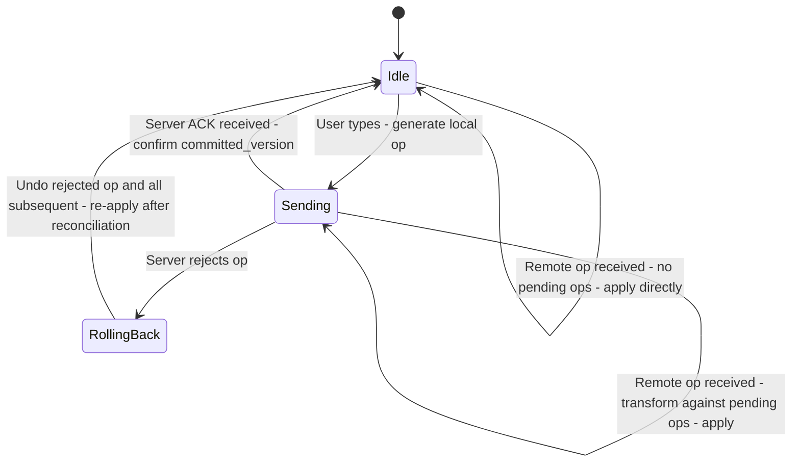

**State variables maintained by the client:**

```
local_doc:       Current in-memory document model (all local ops applied)
committed_doc:   Last server-confirmed document state
pending_ops:     Queue of ops sent but not yet ACKed by server
buffered_ops:    Ops typed while previous op is in-flight
local_version:   Client's current version count
server_version:  Last confirmed server version
```

**Incoming remote op processing:**

```
function applyRemoteOp(remote_op):
    // remote_op was generated against server_version V
    // pending_ops contains all local ops with version > V
    transformed = remote_op
    for each pending_op in pending_ops:
        transformed = transform(transformed, pending_op)
    apply(transformed, local_doc)
    // adjust all collaborator cursors for this operation
    for each cursor in remote_cursors:
        cursor.pos = transformPosition(cursor.pos, transformed)
```

> [!NOTE]
> **Key Insight:** The client OT engine transforms incoming remote ops against the client's pending (unACKed) local ops — not against all local ops. Only unACKed ops are "invisible" to the server. ACKed ops are already reflected in the server's state and thus in the remote op's base version.

---

## F2: Offline Editing

Google Docs supports continued editing when the network is unavailable. The client buffers operations locally and synchronizes on reconnect.

**Offline flow:**

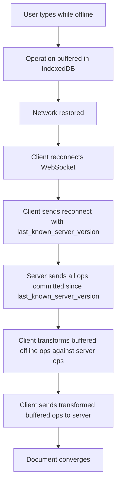

**IndexedDB schema for offline buffer:**

```
Store: offline_ops
  doc_id:     String
  op:         Object (full operation delta)
  local_seq:  Number (local ordering)
  timestamp:  Number
```

**Reconnect reconciliation:** On reconnect, the server may have received operations from other collaborators during the offline period. The client's buffered ops must be transformed against all server ops that committed during the offline window. This is the same transform logic as online — the only difference is that the gap between `last_known_server_version` and `current_server_version` may be large.

> [!NOTE]
> **Key Insight:** Offline editing is where CRDT has a natural advantage — CRDTs merge offline changes without a server round-trip. With OT, the server must be involved in reconciling offline ops. For Google Docs (which already has a central server), this is acceptable. The reconnect transform is the same algorithm as normal online operation, just with a larger operation gap.

---

## F3: Cursor Rendering

Rendering collaborative cursors involves three problems: position tracking, color assignment, and position adjustment when remote operations arrive.

**Color assignment:** On WebSocket session join, the server assigns a unique color per `(user_id, doc_id, session)`. The color is consistent across all clients in the session — all users see Alice's cursor as the same color.

**Cursor DOM rendering:**

```
- Each collaborator's cursor is an absolutely-positioned CSS pseudo-element
- Cursor position = character offset in the ProseMirror / Quill document model
- Name label floats above the cursor line (CSS tooltip, hidden after 3s of inactivity)
- Selection ranges rendered as semi-transparent background color fills
```

**Cursor position adjustment on remote op:**

```
function adjustCursorsForOp(op, cursors):
    for each (user_id, cursor) in cursors:
        if op.type == "insert" and cursor.pos >= op.pos:
            cursor.pos += 1
        if op.type == "delete" and cursor.pos > op.pos:
            cursor.pos -= 1
        if op.type == "delete" and cursor.pos == op.pos:
            cursor.pos = op.pos   // cursor collapses to deletion point
```

**Debouncing:** Cursor position updates are debounced to 50ms before sending to the server. At 5 collaborators each moving cursors continuously, this keeps cursor broadcast traffic under 100 messages/sec — negligible compared to operation traffic.

---

## F4: Optimistic UI and Rollback

**Optimistic apply** means the client mutates the local document model immediately on every keystroke, without waiting for the server to ACK the operation. The user sees their change reflected in under 1ms (local JS execution) rather than in 50-100ms (network round-trip).

**Rollback (rare):**

The server can reject an operation if:
- The operation's base version is too old (client was offline too long and the transform gap is unresolvable)
- The user lost editing permission mid-session
- A server-side validation failure (e.g., document size limit exceeded)

On rejection:

```
1. Remove rejected op from pending_ops
2. Undo all local ops applied after the rejected op (in reverse order)
3. Apply the server's authoritative state
4. Re-apply any subsequent buffered ops that are still valid
5. Display subtle "sync error" indicator if reconciliation fails
```

In practice, rollback is extremely rare (less than 0.01% of operations). The architecture optimizes for the 99.99% case where the op is accepted and the ACK arrives within 100ms.

> [!NOTE]
> **Key Insight:** Optimistic UI requires a local undo stack that is separate from the user-facing Ctrl+Z undo history. The internal rollback stack tracks unACKed ops for reconciliation purposes. The user-facing undo history tracks logical editing intent. Conflating them would cause Ctrl+Z to undo server reconciliation adjustments that the user never consciously made.
