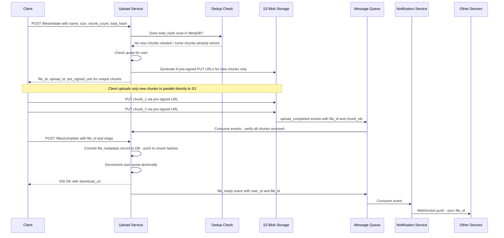
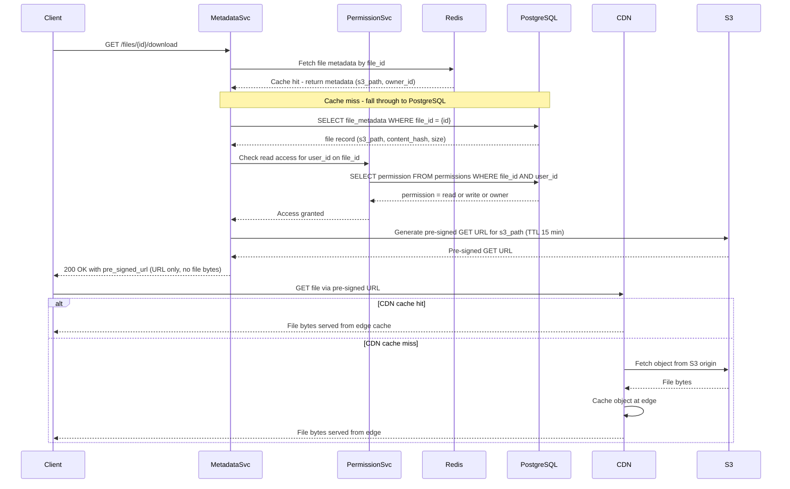
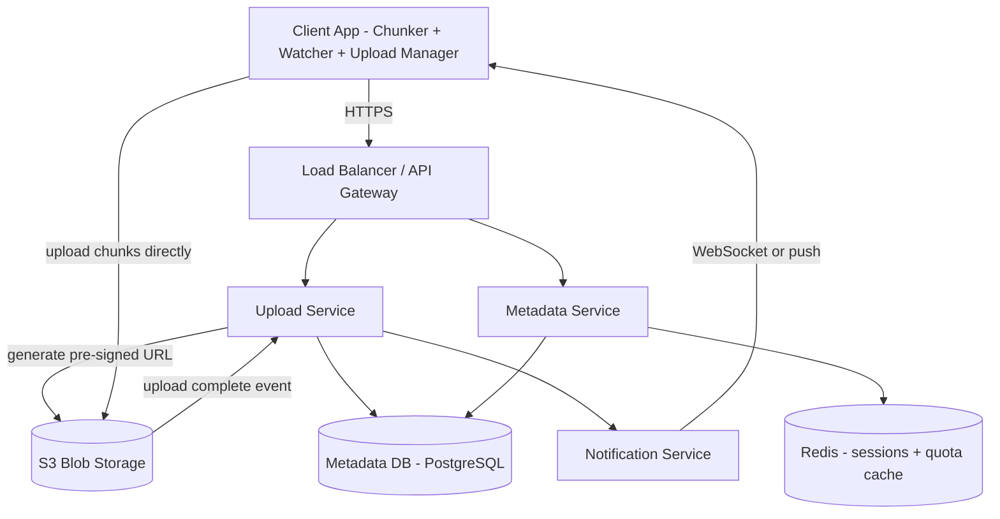
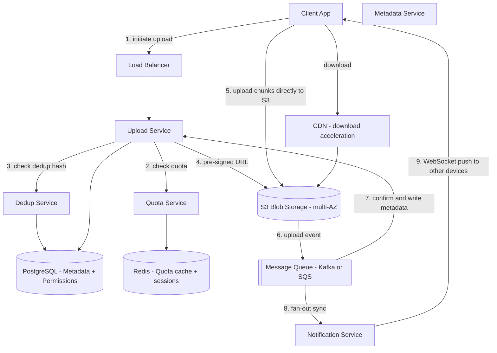

# System Design: Cloud Storage (Google Drive / Dropbox)

---

## 1. Problem + Scope

Design a cloud storage platform (Google Drive / Dropbox) supporting file upload, download, sync across devices, folder management, and sharing with permissions — at 50 million DAU storing 10 billion files.

**In Scope:** File and folder upload/download, auto-sync across devices, directory structure (create/delete/rename/move), file sharing with read/write permissions, storage quota per user, chunk-level deduplication.

**Out of Scope:** Real-time collaborative editing (separate system — see google-docs.md), video transcoding, full-text search within documents, virus scanning internals, mobile offline-first CRDT sync.

---

## 2. Assumptions & Scale

```
Active users:           50 million DAU
Files per user:         ~200 average
Total files:            10 billion
Daily uploads:          50 million files/day
Average file size:      500 KB
Large files (>10 MB):   5% of uploads = 2.5 million/day

Storage:
  New data/day:   50M files x 500KB = 25 TB/day
  After dedup:    ~60% unique (Dropbox reports ~70% dedup ratio)
                  -> ~15 TB/day net new storage
  5-year total:   15 TB x 365 x 5 = ~27 PB

Upload throughput:
  50M uploads/day / 86,400s = ~580 uploads/sec average
  Peak (10x):              ~5,800 uploads/sec

Metadata reads (folder browsing):
  50M DAU x 20 opens/day = 1B reads/day = ~11,500 reads/sec

Chunk operations:
  Large file (1 GB) = 1 GB / 5 MB chunk = 200 chunks
  5,800 uploads/sec x ~5 chunks avg = ~29,000 chunk uploads/sec
  -> S3 must handle ~29K PUT requests/sec

Sync notifications:
  50M uploads/day -> fan-out to avg 3 devices = 150M notifications/day
  -> ~1,700 WebSocket pushes/sec (manageable with pub/sub)
```

These numbers drive the following decisions: pre-signed URLs (cannot proxy 25 TB/day), chunk-level dedup (must reduce 27 PB over 5 years), PostgreSQL sharding (580 writes/sec, well within range but metadata is relational), and WebSocket + message queue for sync (1,700 pushes/sec is lightweight but must survive upload service restarts).

---

## 3. Functional Requirements

1. User creates an account and gets a storage quota (e.g., 15 GB free)
2. Upload files and folders of any size, including multi-GB videos
3. Download files from any device and location
4. Auto-sync: all connected devices update within 2 seconds when any device changes a file
5. Share files and folders with other users; assign read or write permission
6. Directory operations: create, rename, delete, and move folders and files
7. Resume interrupted uploads — a failed chunk does not restart the whole file
8. Storage deduplication — identical content stored only once regardless of who uploaded it

---

## 4. Non-Functional Requirements

| Requirement | Target |
|---|---|
| Availability | 99.99% — prefer AP over CP for upload and sync |
| Durability | 99.999999999% (11 nines) — replicated across AZs in S3 |
| Upload latency | Bounded by client bandwidth — backend adds less than 100ms overhead |
| Sync latency | Less than 2 seconds after upload completes |
| Metadata read latency | Less than 50ms p99 for folder listing |
| Consistency — metadata | Strong (ACID) for quota enforcement and permission checks |
| Consistency — sync | Eventual — 1–2 second lag between devices is acceptable |
| Large file support | Files up to 15 GB via chunked multipart upload |
| Storage efficiency | Chunk-level dedup targeting 60–70% reduction |

### Consistency Model

| Domain | Model | Reason |
|---|---|---|
| Quota enforcement | Strong (ACID) | User must never exceed quota; two concurrent uploads need serialization |
| Permission checks | Strong (ACID) | Access control must be correct at all times |
| Folder listing | Eventual (read replica) | 1–2s stale list is invisible to users |
| Cross-device sync | Eventual | Notification-driven pull; brief lag acceptable |

> [!IMPORTANT]
> **CAP framing:** Upload and sync prefer availability — a 1–2 second sync lag is acceptable. Quota and permission operations prefer consistency — a user must never exceed quota or access a file they were not granted permission to.

---

## 🧠 Mental Model

A cloud storage system is not just a file store — it continuously syncs file state across distributed clients, ensuring changes propagate reliably and efficiently. Three flows define everything: upload (client chunks file → pre-signed URL → S3 directly), metadata management (DB tracks what exists, not the bytes), and sync (S3 event → notification service → WebSocket push to other devices). The file bytes and the file record travel completely separate paths.

> **Google Drive is not a filesystem. It is a metadata store with a blob storage backend.**

A "folder" is not a directory — it is a row in a database with `type = folder`. Moving a file is not moving bytes — it is changing a `parent_id` field. The actual bytes live in S3, addressed by a content hash.

```
                    +-----------------------------------------------------+
                    |                    FAST PATH                        |
  +--------+  chunk |  +----------------+   pre-signed URL               |
  | Client | ------>|  | Upload Service | ---------------------> S3/Blob |
  |(Chunker|        |  +-------+--------+   client uploads directly      |
  |+Watcher|        +----------|-----------------------------------------+
  +--------+                   | metadata write (before ACK)
                    +----------v-----------------------------------------+
                    |                  RELIABLE PATH                      |
                    |  Metadata DB (file record, hash, parent_id, quota)  |
                    |  Notification Service --> sync other devices        |
                    +-----------------------------------------------------+
```

### ⚡ Core Design Principles

| Path | Optimized For | Mechanism |
|---|---|---|
| Fast Path — upload | Throughput | Pre-signed URL; client uploads chunks directly to S3; backend touches zero bytes |
| Reliable Path — metadata | Durability + Correctness | DB write before upload confirmed; quota enforced atomically |
| Dedup Path — storage | Efficiency | SHA-256 chunk hash = content-addressable key; second upload = metadata pointer only |
| Sync Path — devices | Near-real-time | S3 event → MQ → Notification Service → WebSocket push; pull-on-notification |

> [!IMPORTANT]
> **File data never touches the application server.** The backend only handles metadata and issues pre-signed tokens. File bytes go client → S3 directly. This is the architectural decision that makes Google Drive scale — the upload bottleneck is the client's bandwidth and S3 throughput, not application server capacity.

> [!NOTE]
> **Key Insight:** Deduplication works at the chunk level, not the file level. If you upload the same 10 GB video twice, only one copy of each chunk is stored. The second upload is just a metadata pointer — no bytes transferred. This is why Dropbox could serve billions of files at a fraction of expected storage cost.

---

## 6. API Design

| Method | Path | Description |
|---|---|---|
| POST | /api/v1/files/upload/init | Initiate chunked upload, returns {upload_id, pre_signed_urls[]} |
| POST | /api/v1/files/upload/complete | Confirm all chunks uploaded, triggers processing |
| GET | /api/v1/files/{id}/download | Returns pre-signed S3 download URL (not the file bytes) |
| GET | /api/v1/folders/{id}/children | List folder contents with metadata |
| POST | /api/v1/files/{id}/share | Share with {email, permission: viewer/editor} |
| GET | /api/v1/files/{id}/versions | List file version history |

> [!NOTE]
> The most architecturally interesting endpoints are upload/init and download — neither passes file bytes through the app server. Upload/init returns pre-signed S3 URLs so the client uploads directly to S3. Download returns a pre-signed URL the client fetches directly from CDN. The app server only handles metadata.

---

## 7. End-to-End Flow

### 7.1 Upload Flow

File upload with pre-signed URL and chunk deduplication — the happy path from client to sync.

**The story in plain English:**

1. Client initiates upload by calling `POST /files/upload/init` with the file name, size, and a SHA-256 hash of the entire file.
2. Upload Service checks if this exact file (by hash) already exists in storage — chunk-level deduplication. If another user already uploaded the same file, we skip uploading those chunks entirely.
3. For chunks that don't exist yet, the server generates pre-signed S3 PUT URLs — one per chunk — and returns them to the client.
4. The client uploads each chunk directly to S3 in parallel. The app server never touches file bytes. This is how you scale uploads without server bottleneck.
5. Once all chunks are uploaded, the client calls `POST /files/upload/complete` with the file_id and chunk ETags.
6. Upload Service commits the file metadata record to PostgreSQL — pointing to the chunk hashes in S3, not the file bytes directly.
7. A `file_ready` event is published to Kafka. Notification Service consumes it and pushes a sync event to the user's other devices via WebSocket.



> [!NOTE]
> **Key Insight:** The 3-step upload (initiate → upload to S3 → complete) is the correct pattern for large files. The backend never touches file bytes — it only creates pre-signed URLs and records metadata on completion. This is how you scale to 5,800 uploads/sec without application server bottleneck.

---

### 7.2 Download Flow

File download with permission check and pre-signed CDN/S3 URL — the client fetches bytes directly, never through the app server.

**The story in plain English:**

1. User clicks a file — client calls `GET /files/{id}/download`.
2. Metadata Service checks Redis cache for file metadata (name, size, S3 location). Cache hit returns in < 1ms. Cache miss falls back to PostgreSQL.
3. Permission Service checks that this user has at least read access to the file (via the permissions table).
4. Metadata Service generates a pre-signed S3/CDN GET URL with a short TTL (15 minutes) and returns it to the client.
5. Client fetches the file directly from the CDN edge node — the app server is completely out of the data path.
6. CDN cache hit: file served from edge in milliseconds. Cache miss: CDN fetches from S3 origin, caches at edge for future requests.
   The app server never touches file bytes in either direction — upload or download.



> [!NOTE]
> **Key Insight:** The app server never touches file bytes in either direction — upload bytes go Client → S3 directly via pre-signed PUT, download bytes go S3/CDN → Client directly via pre-signed GET. The app server is purely a metadata and URL-signing service.

---

## 8. High-Level Architecture

### Simple Design



### Evolved Design — with CDN, Dedup, Sync Queue



---

## 9. Data Model

| Entity | Storage | Key Columns | Why this store |
|---|---|---|---|
| file_metadata | PostgreSQL | file_id UUID PK, name, type, parent_id FK, owner_id, size_bytes, content_hash, s3_path, created_at, modified_at, deleted_at | Relational — parent-child folder hierarchy, soft deletes, O(1) rename and move via single field update |
| chunks | PostgreSQL | chunk_hash SHA-256 PK, s3_path, size_bytes, ref_count, created_at | Content-addressable: hash IS the key; ref_count enables garbage collection of orphaned chunks |
| file_chunks | PostgreSQL | file_id FK, chunk_index, chunk_hash FK | Join table mapping a file to its ordered list of chunk hashes; enables partial dedup per file |
| permissions | PostgreSQL | file_id FK, user_id FK, permission enum read/write/owner, granted_at — PK is file_id + user_id | ACID required — permission checks must be strongly consistent; JOIN with file_metadata is natural SQL |
| sync_state | Redis | user_id → set of device_ws_ids, TTL 30min | Ephemeral — tracks which WebSocket connections belong to a user; TTL handles disconnects automatically |
| quota_cache | Redis | user_id → bytes_used, TTL 60s | Write-through cache — quota checks hit Redis first; DB is source of truth but 60s stale acceptable |
| user_sessions | Redis | session_token → user_id, TTL 24h | Session data is ephemeral and high-read; Redis sub-millisecond lookup vs 10–50ms DB I/O |

> [!NOTE]
> **Key Insight:** The `chunks` table makes the hash the primary key — the content IS the address. Deduplication, integrity checking, and content-addressable retrieval are all solved by the same SHA-256 hash. No separate dedup service state is needed.

---

## 10. Deep Dives

### 10.1 Pre-Signed URL Upload Flow

Here is the problem: at peak load, 5,800 uploads/sec at ~2.5 MB/chunk means 14.5 GB/sec of file data in flight. Routing this through application servers would require provisioning server capacity for a problem that is purely about moving bytes from one place to another.

**Naive solution:** Client POSTs file bytes to `/files/upload` → server streams to S3. This fails because: (1) server holds the TCP connection open for the entire upload duration — 200 MB file on a slow connection = 30+ seconds of connection held, (2) 25 TB/day through app servers = bandwidth cost and compute cost that scales linearly with file size, not with request count.

**Chosen solution — 3-step pre-signed URL flow:**

1. Client calls `POST /files/initiate` with file metadata and chunk hashes. Backend checks quota and dedup, then asks S3 to generate pre-signed PUT URLs — time-limited tokens (15 min) scoped to exactly one S3 object each.
2. Client uploads each chunk byte-for-byte directly to S3 using the pre-signed URL. Backend is not involved. S3 validates the token and stores the chunk.
3. Client calls `POST /files/complete` with file_id and chunk ETags. Backend writes the metadata record to PostgreSQL and decrements quota atomically.

**Trade-off accepted:** Client must implement a 3-step upload flow instead of a simple POST. This is acceptable because the client SDK abstracts the flow — users never see it — and the alternative (proxying 25 TB/day) is not an optimization problem but a physics problem.

> [!IMPORTANT]
> **Pre-signed URLs are not just an optimization — they are the only architecture that scales.** Proxying 25 TB/day of file uploads through application servers cannot be fixed with more hardware; it requires re-routing the data path entirely.

> [!TIP]
> In the interview, say: "I chose pre-signed URLs over proxied upload because routing 14.5 GB/sec through application servers creates a bottleneck that cannot be horizontally scaled away — you would need servers sized for bandwidth, not compute. The trade-off I accept is a 3-step client flow, which is hidden inside the SDK."

---

### 10.2 Chunk-Level Deduplication via SHA-256

Here is the problem: 50 million uploads/day at 500 KB average = 25 TB/day of raw data. Many of those uploads share content — video edits share 90% of frames, document revisions share most paragraphs, backup tools re-upload unchanged files.

**Naive solution — file-level dedup:** Hash the whole file, check if hash exists. If yes, skip upload. This catches only exact duplicates — roughly 30% of uploads. Two versions of the same video (one with added intro) share no file hash even though they share 95% of bytes.

**Chosen solution — chunk-level content-addressable storage:**

Every file is split into 5 MB chunks before upload. Each chunk is hashed with SHA-256 (collision probability negligible). When the client calls `POST /files/initiate`, it sends the hash list for all chunks. The Upload Service queries the `chunks` table: which hashes already exist? For existing hashes, no pre-signed URL is issued — the file_chunks join table simply references the existing chunk. The client only uploads genuinely new chunks.

The file_metadata record becomes a list of chunk_hashes in order: `[hash_A, hash_B, hash_C]`. To reconstruct the file on download, the client (or CDN) fetches chunks in order and concatenates.

**Trade-off accepted:** Higher metadata DB size — ~100 bytes/chunk record × 200 chunks/file × 10B files = roughly 200 TB of chunk metadata. This is a known, bounded cost. Chunk metadata is small and amenable to compression. The storage savings (60–70% reduction on 27 PB over 5 years) vastly outweigh the metadata overhead.

> [!NOTE]
> **Key Insight:** Chunk hashes are content-addressable. The hash IS the storage address. Two users uploading the same popular movie share all 200 chunks — only one copy on disk. Storage cost is amortized across all users. This is the reason Dropbox could undercut competitors on price.

---

### 10.3 Sync Conflict Resolution

Here is the problem: Device A and Device B both edit the same file while offline. Both upload when they reconnect. The server sees two uploads targeting the same file_id with the same base version but different content hashes. One of them must win — but silently discarding the other is data loss.

**Naive solution — last-write-wins:** The second upload overwrites the first. Simple to implement. Silently destroys data whenever two devices are offline simultaneously.

**Chosen solution — conflict copy preservation:**

Each file carries a `version` field incremented on every write. On `POST /files/complete`, the Upload Service checks: does the `base_version` in the request match the current version in DB? If yes, it is a clean update — increment version and commit. If no, there is a conflict.

On conflict, the server does not reject the upload. Instead it creates a second file_metadata record named `file (Device B conflict copy YYYY-MM-DD).ext`, pointing to Device B's chunk hashes. Both versions survive. The user sees both in the folder and can manually resolve.

**Trade-off accepted:** Users must occasionally resolve conflicts manually. This is acceptable because: (1) conflicts only happen when two devices edit the same file offline simultaneously — rare in practice, (2) the alternative (silent data loss or distributed locks requiring both devices online) is worse. The conflict copy UI is a familiar pattern — users understand it.

> [!NOTE]
> **Key Insight:** Sync is pull-on-notification, not push. The notification tells the device "something changed." The device decides what to download. This prevents wasting bandwidth pushing large files to mobile devices on limited storage or slow connections.

---

## 11. Bottlenecks & Scaling

**Bottleneck 1: Metadata DB read throughput (11,500 reads/sec for folder listing)**

What breaks first: a single PostgreSQL primary cannot serve 11,500 read requests/sec at p99 less than 50ms while also handling 580 writes/sec for uploads.

Solution: Add read replicas for folder listing queries. Route all write operations (upload initiate, complete, quota update, permission change) to primary. Route all read operations (folder listing, file metadata fetch, permission check for download) to read replicas. Shard by `owner_id` — all files for one user land on the same shard, keeping parent-child queries local. Add Redis cache for hot folders (team shared drives with many readers).

**Bottleneck 2: Notification service fan-out (1,700 WebSocket pushes/sec)**

What breaks first: a single notification service node cannot maintain WebSocket connections for 50M DAU. At 50 million users × 3 devices each = 150M persistent connections.

Solution: Horizontal scaling of notification service nodes. Redis stores the mapping of user_id → set of device WebSocket connection IDs (with TTL for cleanup). Each notification service node holds a subset of connections. When a sync event arrives for user_id X, the service looks up X's device connection IDs in Redis and routes to the correct node. Nodes communicate via internal pub/sub.

**Bottleneck 3: Chunk metadata lookup for dedup (29,000 chunk operations/sec)**

What breaks first: checking 29K chunk hashes/sec against PostgreSQL for dedup will saturate the DB before the upload pipeline.

Solution: Bloom filter in Redis for chunk hashes. Before hitting PostgreSQL, check the Bloom filter — if the hash is definitely not present, skip the DB lookup entirely. Bloom filters have false positives (say "exists" when it does not) but never false negatives. A false positive causes an unnecessary DB lookup — not a correctness problem. A 1% false positive rate reduces DB load by ~70% for a working set that is mostly new content.

> [!TIP]
> Mention the Bloom filter dedup optimization in interviews — it is a senior-level detail that shows you have thought about the hot path. Say: "I would put a Bloom filter in Redis in front of the chunk hash DB lookup. False positives are acceptable — they just cause an extra DB read. False negatives would break dedup correctness, but Bloom filters never produce false negatives."

---

## 12. Failure Scenarios

| Failure | Impact | Recovery |
|---|---|---|
| DB primary fails | Writes blocked — upload complete, quota update, permission change fail | PostgreSQL replica auto-promoted (RDS Multi-AZ, ~30s failover); upload service retries commit with exponential backoff |
| S3 availability event | Upload chunks fail mid-flight | Client retries failed chunks individually via new pre-signed URLs; already-uploaded chunks are not re-sent (idempotent by hash) |
| Message queue outage | S3 upload complete events lost — sync notifications not sent | Polling fallback: upload service polls S3 for pending events on recovery; clients re-sync on reconnect by comparing local version vs server version |
| Notification service crash | Connected devices stop receiving WebSocket pushes | Clients fall back to polling `/files/changes?since=timestamp` every 30s; WebSocket reconnects on next heartbeat |
| Redis quota cache failure | Quota checks fall through to PostgreSQL directly | Latency increases for upload initiate; correctness unaffected — PostgreSQL is source of truth; Redis rebuilt on restart |
| Network partition — client offline | Local changes not uploaded | Client queues pending changes locally; uploads in order on reconnect; conflict detection handles simultaneous edits |
| Chunk dedup race — two users upload same new chunk simultaneously | Both pass Bloom filter, both write to DB | PostgreSQL unique constraint on `chunk_hash` PK causes one INSERT to fail; second writer treats it as success (chunk already stored) — idempotent |

---

## 13. Trade-offs

### Pre-Signed URL vs Proxy Upload

| Dimension | Pre-Signed URL — direct to S3 | Proxied Upload — via app server |
|---|---|---|
| App server load | Zero — no bytes transit servers | 14.5 GB/sec through servers at peak |
| Throughput ceiling | S3 capacity — effectively unlimited | Application server bandwidth |
| Upload latency | Client to S3 directly — 1 hop | Client to server to S3 — 2 hops |
| Security | URL expires in 15 min, scoped to one object | Server controls all access |
| Client complexity | 3-step flow — initiate, upload, complete | Simple POST |

**Chosen:** Pre-signed URLs. We never proxy file bytes through application servers. The trade-off we accept is a 3-step client upload flow, which is acceptable because the client SDK abstracts this entirely.

> [!NOTE]
> **Key Insight:** Pre-signed URLs are not just an optimization — they are the only architecture that scales. Proxying 25 TB/day of file uploads is not a latency problem; it is a physics problem.

---

### Chunk-Level Dedup vs File-Level Dedup

| Dimension | Chunk-level — 5 MB blocks | File-level — whole file hash |
|---|---|---|
| Dedup ratio | 60–70% — partial content shared | 30% — exact duplicates only |
| Metadata overhead | N chunk records per file | 1 record per file |
| Partial upload resume | Resume from last successful chunk | Must restart entire file |
| Bandwidth savings | Upload only unique chunks | Upload whole file or nothing |
| Implementation complexity | Higher — chunk hash lookup per chunk | Lower — single hash check |

**Chosen:** Chunk-level deduplication. Most storage savings come from shared partial content — video edits, document revisions, backup files with unchanged blocks. File-level dedup only catches exact duplicates. The trade-off we accept is higher metadata DB size (~200 TB of chunk records at scale), which is a known, bounded cost.

> [!NOTE]
> **Key Insight:** Chunk-level dedup is the reason Dropbox could undercut competitors on price. Two users uploading the same popular video share all 200 chunks — only one copy on disk. Storage cost is amortized across all users.

---

### PostgreSQL vs NoSQL for Metadata

| Dimension | PostgreSQL — chosen | Cassandra or DynamoDB |
|---|---|---|
| Directory hierarchy queries | Natural — adjacency list, recursive CTE | Requires denormalization or multiple reads |
| Permission joins | Native — JOIN file_metadata and permissions | Requires denormalization or application-side join |
| Quota aggregation | SUM query on owner_id — native SQL | Requires counter table or external aggregation |
| Consistency | Strong — ACID transactions | Eventual by default |
| Write throughput | ~100K writes/sec sharded by owner_id | Multi-million writes/sec |
| Operational complexity | Moderate | Higher |

**Chosen:** PostgreSQL with sharding by owner_id. Metadata is fundamentally relational — files have parents, permissions have users, users have quotas. Write volume (~580 uploads/sec) is well within sharded PostgreSQL capacity. The trade-off we accept is sharding complexity, which is acceptable because correctness of permission checks and quota enforcement requires ACID guarantees that NoSQL cannot provide cheaply.

> [!NOTE]
> **Key Insight:** The metadata for a storage system is fundamentally relational. Parent-child folder relationships, permission joins, and quota aggregation are natural SQL. NoSQL requires denormalization to express the same relationships — you trade write throughput you do not need for query complexity you must now manage yourself.

---

## Interview Summary

### Key Decisions

| Decision | Problem It Solves | Trade-off Accepted |
|---|---|---|
| Pre-signed URLs — not proxied | 25 TB/day of file bytes bypasses application servers | 3-step client upload flow; client SDK complexity |
| Chunk-level dedup via SHA-256 | 60–70% storage savings; partial upload resume | Chunk metadata overhead in PostgreSQL |
| Metadata DB — not filesystem | O(1) rename and move; clean permission joins; natural quota aggregation | PostgreSQL sharding complexity at scale |
| Eventual consistency for sync | High availability; devices sync independently; simple architecture | 1–2 second lag before new file appears on other devices |
| Message queue for S3 to sync | Reliable handoff from upload complete to notification — survives service restarts | 200–500ms additional sync latency |
| CDN for downloads | Sub-50ms download globally for popular shared files | CDN egress cost |

### Fast Path vs Reliable Path

```
Fast Path   (throughput):  Client chunks file locally
                           -> Client uploads chunks directly to S3 via pre-signed URL
                           -> S3 emits event to Message Queue

Reliable Path (durability): Metadata DB write before upload confirmed
                            -> Quota enforced atomically on /files/complete
                            -> Notification fan-out only after metadata committed

File bytes  = fast path only  (S3-native, CDN-accelerated on download)
File record = reliable path   (PostgreSQL, ACID, quota-enforced)
Sync signal = reliable path   (MQ -> Notification Service -> WebSocket)
```

### Key Insights Checklist

> [!IMPORTANT]
> These are the lines that make an interviewer lean forward. Know them cold.

- **"A folder in Google Drive is not a directory — it is a metadata row."** Moving a file is changing a `parent_id` field. Rename is changing a `name` field. No bytes move. O(1) regardless of folder size.
- **"File bytes never touch the application server."** Pre-signed URLs send data client to S3 directly. The backend handles only metadata and issues tokens. This is the only architecture that scales to 25 TB/day.
- **"Deduplication works at the chunk level."** Two uploads sharing the same video clip share storage. The second upload is a metadata pointer — no bytes transferred. This is why Dropbox could undercut storage costs.
- **"Chunking is not just for large files — it enables deduplication, parallel upload, and partial retry."** A 1 GB file in 5 MB chunks uploads 200 chunks in parallel and resumes from any failed chunk.
- **"Sync is pull-on-notification, not push."** The notification says 'something changed.' The device decides what to download. This avoids pushing large files to mobile devices on limited storage.
- **"Metadata is relational — use a relational DB."** Parent-child folders, permission joins, quota aggregation are natural SQL. NoSQL requires denormalization to express the same relationships and you trade write throughput you do not need for query complexity you must now manage.
