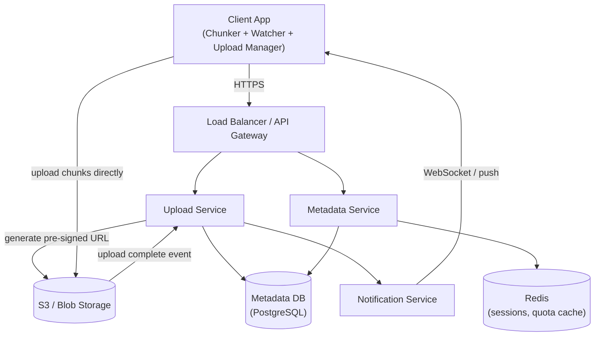
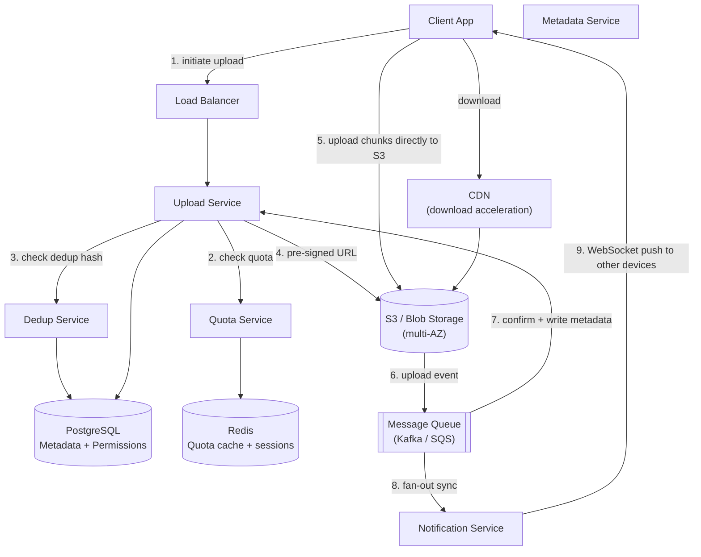
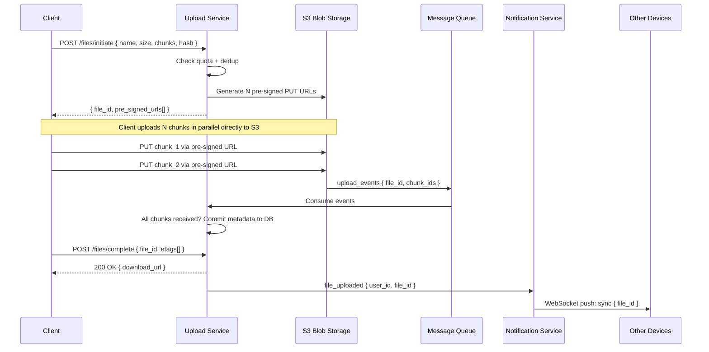

# System Design: Cloud Storage (Google Drive / Dropbox)

> Designing Google Drive is not about storing files — it’s about syncing state across distributed clients at scale.

---

## 🧠 Mental Model

A cloud storage system is not just storing files.

It is continuously syncing file state across distributed clients, ensuring changes propagate reliably and efficiently.

> **Google Drive is not a filesystem. It is a metadata store with a blob storage backend.**

A "folder" in Google Drive is not a directory — it is a row in a database with `type = "folder"`. Moving a file is not moving bytes on disk — it is changing a `parent_id` field in a metadata record. The actual file bytes live in S3 (or equivalent blob storage), addressed by a content hash. The metadata DB is the source of truth for _what exists_. The blob store is the source of truth for _what the bytes are_.

The system runs two paths:

- **Fast path**: Client chunks the file → uploads directly to S3 via pre-signed URL (bypasses backend) → S3 notifies backend on completion
- **Reliable path**: Metadata written to DB before upload confirmed → quota enforced → sync notification sent to other devices

```
                    ┌─────────────────────────────────────────────────────┐
                    │                    FAST PATH                          │
  ┌────────┐  chunk │  ┌────────────────┐   pre-signed URL                 │
  │ Client │ ──────►│  │ Upload Service │ ──────────────────► S3 / Blob    │
  │(Chunker│        │  └───────┬────────┘        client uploads directly   │
  │+Watcher│        └──────────│──────────────────────────────────────────┘
  └────────┘                   │ metadata write (before ACK)
                    ┌──────────▼──────────────────────────────────────────┐
                    │                  RELIABLE PATH                        │
                    │  Metadata DB (file record, hash, parent_id, quota)   │
                    │  Notification Service → sync other devices           │
                    └─────────────────────────────────────────────────────┘
```

## ⚡ Core Design Principle

| Principle                    | Mechanism                                                   | Optimizes for                             | Can fail?                                     |
| ---------------------------- | ----------------------------------------------------------- | ----------------------------------------- | --------------------------------------------- |
| **Fast Path — upload**       | Pre-signed URL → client uploads directly to S3              | Throughput (large files bypass backend)   | Yes — client retries failed chunks            |
| **Reliable Path — metadata** | DB write before upload confirmed; quota enforced atomically | Durability + correctness                  | No — must not confirm upload without metadata |
| **File = content hash**      | SHA-256 hash of chunk → deduplication key                   | Storage efficiency (zero duplicate bytes) | No — same hash = same bytes, guaranteed       |
| **Folder = metadata row**    | `type = "folder"`, `parent_id` field                        | Simplicity; O(1) move/rename              | No — metadata only                            |
| **Sync via notification**    | S3 event → Notification Service → WebSocket/push to devices | Near-real-time sync across devices        | Yes — at-least-once + idempotent apply        |

> [!IMPORTANT]
> **File data never touches the application server.** The backend only handles metadata. File bytes go client → S3 directly via pre-signed URL. This is the architectural decision that makes Google Drive scale — the upload bottleneck is the client's bandwidth and S3 throughput, not application server capacity.

> [!NOTE]
> **Key Insight:** Deduplication works at the chunk level, not the file level. If you upload the same 10GB video twice, only one copy of each chunk is stored. The second upload is just a metadata pointer — no bytes transferred. This is why Dropbox could serve billions of files with a fraction of the expected storage cost.

---

## 🔄 Sync Engine (Core System)

The sync engine is the heart of the system.

Whenever a file changes:

1. Client detects change (file watcher)
2. File is chunked
3. Only delta is sent to server
4. Server stores new version
5. Event is pushed to other clients
6. Clients fetch and apply updates

👉 Key Insight:
This is not a storage problem — it is a synchronization problem across distributed clients.

## 💻 Client Architecture

A significant part of the system runs on the client.

Client responsibilities:

- Detect file changes (watcher)
- Split files into chunks
- Maintain local metadata
- Sync with server asynchronously

👉 Key Insight:
Client is not passive — it actively participates in synchronization.

> See "Frontend Notes" section for deeper breakdown of Chunker, Watcher, and Upload Manager.

## 1. Problem Statement & Scope

Design a cloud storage platform (Google Drive / Dropbox) supporting file upload, download, sync across devices, folder management, and sharing with permissions — at millions of users storing billions of files.

**In Scope:** File/folder upload and download, auto-sync across devices, directory structure (create/delete/rename/move), file sharing with read/write permissions, storage quota per user.

**Out of Scope:** Real-time collaborative editing (separate system — see google-docs.md), video transcoding, full-text search within documents, virus scanning internals.

---

## 2. Requirements

### Functional

1. User creates account; gets storage quota (e.g., 15 GB free)
2. Upload files and folders of any size (including multi-GB videos)
3. Download files from any device, anywhere
4. Auto-sync: all connected devices update when a change occurs on any device
5. Share files/folders with other users; assign read or write permission
6. Directory operations: create, rename, delete, move folders and files

### Non-Functional

| Requirement            | Target                                   | Reasoning                                                          |
| ---------------------- | ---------------------------------------- | ------------------------------------------------------------------ |
| Scale                  | Millions of users, billions of files     | Mandates blob storage + sharded metadata DB                        |
| Availability           | High — prefer AP over CP for upload/sync | User cannot upload if service is down; brief sync delay acceptable |
| Consistency (metadata) | Eventual consistency for sync            | A 1–2 second sync lag is invisible to users                        |
| Durability             | 99.999999999% (11 nines)                 | Uploaded files must never be lost — replicated across AZs          |
| Large file support     | Files up to 10–15 GB                     | Requires chunked upload, not single HTTP request                   |
| Sync latency           | < 2 seconds after upload completes       | Devices should feel "live"                                         |

> [!IMPORTANT]
> **CAP framing:** Upload and sync prefer **availability** — it is acceptable for a newly uploaded file to take 1–2 seconds to appear on other devices. Metadata operations (quota enforcement, permission changes) prefer **consistency** — a user must never exceed quota or access a file they were not given permission to.

---

## 3. Back-of-Envelope Estimations

```
Inputs:
  Active users:             50 million
  Files per user:           ~200 files average
  Total files:              10 billion
  Daily uploads:            50 million files/day
  Average file size:        500 KB
  Large files (>10 MB):     5% of uploads = 2.5 million/day

Storage:
  New data/day:    50M files × 500KB average = 25 TB/day
  After dedup:     ~60% unique data (Dropbox reports ~70% dedup ratio)
                   → ~15 TB/day net new storage
  5-year total:    15 TB × 365 × 5 = ~27 PB

Upload throughput:
  50M uploads/day ÷ 86,400s = ~580 uploads/sec average
  Peak (10× average):        ~5,800 uploads/sec

Metadata reads (browsing):
  50M DAU × 20 folder opens/day = 1B metadata reads/day = ~11,500 reads/sec

Chunk operations:
  Large file (1GB) = 1GB / 5MB per chunk = 200 chunks
  5,800 uploads/sec × ~5 chunks avg = ~29,000 chunk uploads/sec
  → S3 must handle ~29K PUT requests/sec (within S3 limits per account)

Sync notifications:
  50M uploads/day → 50M sync events → fan-out to avg 3 devices = 150M notifications/day
  → ~1,700 WebSocket pushes/sec (low — manageable with pub/sub)
```

---

## 4. API Design

### Folder Management

| Method   | Endpoint                 | Request                               | Response                                              |
| -------- | ------------------------ | ------------------------------------- | ----------------------------------------------------- |
| `POST`   | `/folders`               | `{ name, parent_id, type: "folder" }` | `{ folder_id, metadata }`                             |
| `GET`    | `/folders/{id}`          | —                                     | `{ folder_id, name, owner, permissions, created_at }` |
| `GET`    | `/folders/{id}/contents` | `?page, page_size`                    | `[{ id, name, type, size, modified_at }]`             |
| `PATCH`  | `/folders/{id}`          | `{ name?, parent_id? }`               | `{ updated_metadata }`                                |
| `DELETE` | `/folders/{id}`          | —                                     | `{ status: "deleted" }`                               |

### File Upload (3-step multipart)

| Method | Endpoint                   | Request                                              | Response                                                   |
| ------ | -------------------------- | ---------------------------------------------------- | ---------------------------------------------------------- |
| `POST` | `/files/initiate`          | `{ name, size, parent_id, chunk_count, total_hash }` | `{ file_id, upload_id, pre_signed_urls: [url_per_chunk] }` |
| `PUT`  | S3 pre-signed URL (direct) | `chunk bytes`                                        | `{ etag }` (from S3)                                       |
| `POST` | `/files/complete`          | `{ file_id, upload_id, chunk_etags[] }`              | `{ file_id, download_url }`                                |

### File Operations

| Method   | Endpoint                  | Request                           | Response                                 |
| -------- | ------------------------- | --------------------------------- | ---------------------------------------- | ---------------- |
| `GET`    | `/files/{id}`             | —                                 | `{ metadata + pre_signed_download_url }` |
| `DELETE` | `/files/{id}`             | —                                 | `{ status: "deleted" }`                  |
| `POST`   | `/files/{id}/share`       | `{ user_email, permission: "read" | "write" }`                               | `{ share_link }` |
| `GET`    | `/files/{id}/permissions` | —                                 | `[{ user, permission }]`                 |

> [!NOTE]
> **Key Insight:** The 3-step upload (initiate → upload to S3 → complete) is the correct pattern for large files. The backend never touches file bytes — it only creates pre-signed URLs and records metadata on completion. This is how you scale to 5,800 uploads/sec without application server bottleneck.

---

## 5. Architecture Diagrams

### Simple High-Level Design



### Evolved Design (with CDN + Dedup + Sync)



---

## 6. Deep Dives

### 6.1 File Upload Pipeline

> **The upload bottleneck is the client's bandwidth — not the server. The backend's job is to stay out of the way.**

The entire upload design is built around one principle: **file bytes must never transit the application server**. Pre-signed URLs send bytes directly to S3. The backend handles only metadata and coordination.

#### Step-by-Step Upload Flow

| Step | Who                            | What                                                  | Why                                                                      |
| ---- | ------------------------------ | ----------------------------------------------------- | ------------------------------------------------------------------------ |
| 1    | Client (Chunker)               | Split file into 5MB chunks; hash each chunk (SHA-256) | Enables deduplication + parallel upload + partial retry                  |
| 2    | Client → Upload Service        | `POST /files/initiate` with total_hash + chunk_count  | Backend reserves upload slot, checks quota, checks dedup                 |
| 3    | Upload Service → Dedup Service | Does total_hash exist in MetaDB?                      | If yes: skip all uploads, just create metadata pointer                   |
| 4    | Upload Service → S3            | Generate N pre-signed PUT URLs (one per chunk)        | Client will upload directly; backend stays out of data path              |
| 5    | Upload Service → Client        | Return `{ file_id, upload_id, pre_signed_urls[] }`    | Client now has everything needed to upload without further backend calls |
| 6    | Client → S3                    | PUT each chunk to its pre-signed URL (parallel)       | N chunks upload simultaneously → N× faster than sequential               |
| 7    | S3 → Message Queue             | `upload_completed` event per chunk                    | Reliable handoff; backend not holding connection open                    |
| 8    | Upload Service (consumer)      | Verify all chunks received; commit metadata to DB     | Atomic: either all chunks committed or none                              |
| 9    | Upload Service → Quota Service | Decrement available quota for user                    | Enforced after upload, not before — prevents TOCTOU race                 |
| 10   | Notification Service           | Fan-out sync event to user's other devices            | Devices learn a new file exists; download on demand                      |



> [!IMPORTANT]
> **Pre-signed URLs are the key architectural decision.** Without them, every file upload transits your application servers — 25TB/day of file bytes. With pre-signed URLs, the application server touches zero file bytes. It only issues tokens. This is the correct design for any system that stores large user-generated content.

#### Chunk Size Trade-off

| Chunk size | Pros                                          | Cons                                       |
| ---------- | --------------------------------------------- | ------------------------------------------ |
| 1 MB       | More granular retry; better dedup ratio       | More API calls (metadata overhead)         |
| 5 MB       | Balance of retry granularity and API overhead | Standard — used by S3 multipart minimum    |
| 50 MB      | Fewer API calls                               | Large retry unit; bad on flaky connections |

**Chosen: 5 MB chunks.** Matches S3 multipart minimum, provides reasonable retry granularity on slow connections, and limits chunk metadata DB entries to ~200 per 1GB file.

---

### 6.2 Deduplication

> **Deduplication works at the chunk level, not the file level. Two files sharing 80% of their content share 80% of their storage.**

```
Upload flow with dedup:

Client sends: { file_hash: "sha256_abc123", chunks: [hash1, hash2, hash3] }

Upload Service checks MetaDB:
  chunk hash1 → exists at s3://bucket/chunks/hash1  → skip upload
  chunk hash2 → exists at s3://bucket/chunks/hash2  → skip upload
  chunk hash3 → NOT found                           → generate pre-signed URL

Client uploads only chunk3.
Metadata record points to: [hash1_path, hash2_path, hash3_path]

Storage saved: 2/3 chunks = 66% storage and bandwidth savings
```

**Dedup ratio in practice:**

- File-level dedup: ~30% of uploads are exact duplicates (same file uploaded again)
- Chunk-level dedup: ~60–70% reduction (files sharing partial content: video edits, document revisions)
- Dropbox reportedly achieves ~60% storage savings through chunk-level dedup

> [!NOTE]
> **Key Insight:** Chunk hashes are content-addressable. The hash IS the storage address. This means deduplication, integrity checking, and content-addressable retrieval are all solved by the same SHA-256 hash — no separate dedup service state.

---

### 6.3 Directory Structure (Metadata as JSON)

> **A folder is not a directory. It is a metadata row. Moving a file is an O(1) database update, not a filesystem operation.**

**Schema:**

```sql
-- Single table for both files and folders
CREATE TABLE file_metadata (
  file_id       UUID PRIMARY KEY,
  name          VARCHAR(255),
  type          ENUM('file', 'folder'),
  parent_id     UUID REFERENCES file_metadata(file_id),  -- NULL = root
  owner_id      UUID REFERENCES users(user_id),
  size_bytes    BIGINT,
  content_hash  VARCHAR(64),          -- SHA-256, NULL for folders
  s3_path       TEXT,                 -- NULL for folders
  created_at    TIMESTAMP,
  modified_at   TIMESTAMP
);

CREATE TABLE permissions (
  file_id       UUID REFERENCES file_metadata(file_id),
  user_id       UUID REFERENCES users(user_id),
  permission    ENUM('read', 'write', 'owner'),
  PRIMARY KEY (file_id, user_id)
);
```

**Operations map to simple SQL:**

| User action          | What actually happens                                                     |
| -------------------- | ------------------------------------------------------------------------- |
| Create folder        | `INSERT INTO file_metadata (type='folder', parent_id=X)`                  |
| Rename file          | `UPDATE file_metadata SET name='new_name' WHERE file_id=Y`                |
| Move file            | `UPDATE file_metadata SET parent_id=Z WHERE file_id=Y`                    |
| Delete folder        | `UPDATE file_metadata SET deleted_at=NOW() WHERE file_id=X` (soft delete) |
| List folder contents | `SELECT * FROM file_metadata WHERE parent_id=X AND deleted_at IS NULL`    |

> [!NOTE]
> **Key Insight:** Google Drive does not manage a real filesystem. Every "folder operation" is a metadata DB update. This means rename and move are O(1) operations regardless of folder size. A folder with 10,000 files is moved by changing one `parent_id` value.

---

### 6.4 Sync Mechanism

**Here is the problem:** When Device A uploads a file, Devices B and C (same account) must learn about it within 2 seconds — without polling.

**The sync pipeline:**

```
Device A uploads → S3 event → Notification Service
                                     │
                              Lookup: which devices are connected for this user_id?
                              (Redis session map: user_id → [device_ws_connection_1, device_ws_connection_2])
                                     │
                              WebSocket push to Device B: { event: "file_added", file_id }
                              Push notification to Device C (offline): FCM/APNs
                                     │
                   Device B/C receive event → GET /files/{file_id} → download if needed
```

**Client-side Watcher component:**

```
Local filesystem monitor (inotify on Linux, FSEvents on macOS, FileSystemWatcher on Windows)
  → File created / modified / deleted → debounce 500ms
  → Hash changed? (compare with last known hash)
    → Yes: trigger upload pipeline
    → No:  skip (content identical, only access time changed)
```

## 🧠 Conflict Resolution

**Conflict resolution (two devices edit same file offline):**

```
Device A edits file.txt offline → uploads v2 when reconnected
Device B edits file.txt offline → uploads v2' when reconnected

Server receives both:
  → Both have same parent version (v1)
  → Create conflict copy: "file (Device B's conflicted copy).txt"
  → Both versions preserved; user decides which to keep
```

> [!NOTE]
> **Key Insight:** Sync is pull-on-notification, not push. The notification tells the device "something changed." The device decides what to download. This prevents wasting bandwidth pushing files the device doesn't need (large video files on a mobile device with limited storage).

---

### 6.5 Fast Path vs Reliable Path

|               | Fast Path                     | Reliable Path                          |
| ------------- | ----------------------------- | -------------------------------------- |
| **What**      | File bytes → S3 (direct)      | Metadata → PostgreSQL; quota → Redis   |
| **Mechanism** | Pre-signed URL + S3 multipart | DB write before confirming upload      |
| **Can fail?** | Yes — client retries chunks   | No — must not confirm without metadata |
| **Latency**   | Bounded by client bandwidth   | < 20ms (DB write)                      |

---

## 7. ⚖️ Key Trade-offs

> [!TIP]
> Every decision follows: **I chose X over Y because [reason at this scale]. The trade-off I accept is [downside], acceptable because [justification].**

---

### Trade-off 1: Pre-Signed URLs vs Proxied Upload

Here is the problem: 5,800 upload requests/sec at an average of 2.5 MB/chunk = 14.5 GB/sec of file data. Routing this through application servers would require massive server capacity for a problem that is purely about moving bytes.

| Dimension          | Pre-Signed URL (direct to S3)              | Proxied Upload (via app server) |
| ------------------ | ------------------------------------------ | ------------------------------- |
| App server load    | Zero — no bytes transit servers            | 14.5 GB/sec through servers     |
| Throughput ceiling | S3 capacity (effectively unlimited)        | Application server bandwidth    |
| Latency            | Client → S3 directly (1 hop)               | Client → Server → S3 (2 hops)   |
| Security           | URL expires in 15min; scoped to one object | Server controls all access      |
| Complexity         | Client must handle pre-signed URL flow     | Simpler client, complex server  |

**Chosen: Pre-signed URLs.**

We never proxy file bytes through application servers. File data goes client → S3 directly. The trade-off we accept is client complexity (3-step upload flow), which is acceptable because the client SDK abstracts this — users never see it.

> [!NOTE]
> **Key Insight:** Pre-signed URLs are not just an optimization — they are the only architecture that scales. Proxying 25 TB/day of file uploads through application servers is not a latency problem; it is a physics problem.

---

### Trade-off 2: Chunk-Level vs File-Level Deduplication

| Dimension                 | Chunk-level (5MB blocks)          | File-level (whole file hash) |
| ------------------------- | --------------------------------- | ---------------------------- |
| Dedup ratio               | 60–70% (partial content shared)   | 30% (exact duplicates only)  |
| Metadata overhead         | N chunk records per file          | 1 record per file            |
| Partial upload support    | Resume from last successful chunk | Must restart entire file     |
| Implementation complexity | Higher — chunk hash lookup        | Lower — single hash check    |

**Chosen: Chunk-level deduplication.**

We deduplicate at the chunk level because most storage savings come from shared partial content — video edits, document revisions, backup files. File-level dedup only catches exact duplicates. The trade-off we accept is higher metadata DB size (chunk records), which is acceptable because chunk metadata is tiny (~100 bytes/chunk × 200 chunks/file × 10B files = ~200 TB metadata — a known, bounded cost).

> [!NOTE]
> **Key Insight:** Chunk-level dedup is the reason Dropbox could undercut competitors on price. Two users uploading the same popular movie share all 200 chunks — only one copy on disk. Storage cost is amortized across all users.

---

### Trade-off 3: PostgreSQL vs NoSQL for Metadata

| Dimension                   | PostgreSQL (chosen)                       | Cassandra / DynamoDB                       |
| --------------------------- | ----------------------------------------- | ------------------------------------------ |
| Directory hierarchy queries | Natural — recursive CTE or adjacency list | Complex — requires denormalization         |
| Permission joins            | Native — permissions table JOIN           | Requires denormalization or multiple reads |
| Consistency                 | Strong (ACID)                             | Eventual                                   |
| Write throughput            | ~100K writes/sec (sharded)                | Multi-million writes/sec                   |
| Operational complexity      | Moderate                                  | Higher                                     |

**Chosen: PostgreSQL with sharding by owner_id.**

Metadata is relational — files have parents, permissions have users, users have quotas. These relationships are expressed naturally in SQL. Write volume (~580 uploads/sec) is well within sharded PostgreSQL capacity. The trade-off we accept is higher operational complexity than a single NoSQL table, which is acceptable because correctness of permission checks and quota enforcement requires ACID guarantees.

> [!NOTE]
> **Key Insight:** The metadata for a storage system is fundamentally relational — parent-child folder relationships, permission joins, quota aggregation. NoSQL adds complexity to express these relationships that SQL gives you for free.

---

### Trade-off 4: Eventual Consistency vs Strong Consistency for Sync

| Dimension      | Eventual (chosen for sync)        | Strong consistency            |
| -------------- | --------------------------------- | ----------------------------- |
| Sync latency   | 1–2 seconds                       | Near-zero                     |
| Implementation | Notification + pull               | Distributed lock / consensus  |
| Availability   | High — devices sync independently | Lower — requires coordination |
| User impact    | 1-2s lag before new file appears  | Immediate                     |

**Chosen: Eventual consistency for sync, strong consistency for metadata.**

A 1–2 second sync delay between devices is invisible to users. We accept this for dramatically simpler architecture. The trade-off we accept is brief inconsistency (Device B sees stale folder contents for 1–2s), which is acceptable because this is a background sync, not a real-time collaboration system. For collaborative editing, see google-docs.md.

> [!NOTE]
> **Key Insight:** Google Drive is eventually consistent by design — it is not Google Docs. The sync notification arrives within 2 seconds. The 2-second window is not a bug; it is the architectural trade-off that makes global availability possible.

---

### Trade-off 5: CDN vs Direct S3 for Downloads

| Dimension           | CDN (CloudFront / Akamai)     | Direct S3            |
| ------------------- | ----------------------------- | -------------------- |
| Download latency    | < 50ms (edge node)            | 50–300ms (S3 region) |
| Cost                | Higher (CDN fees)             | Lower per-GB         |
| Cache hit ratio     | High for popular shared files | No caching           |
| Global availability | Edge nodes in 200+ locations  | Regional             |

**Chosen: CDN for downloads, direct S3 for uploads.**

Downloads benefit from CDN because popular files (shared documents, team assets) are accessed by many users — cache hit ratio is high. Uploads are unique per user — CDN caching provides no benefit. The trade-off we accept is CDN cost for download traffic, which is offset by reduced S3 egress costs and dramatically better user experience globally.

---

## 8. 🏁 Interview Summary

> [!TIP]
> When the interviewer says "walk me through your Google Drive design," hit these points in order.

### The 6 Decisions That Define This System

| Decision                      | Problem It Solves                                     | Trade-off Accepted                               |
| ----------------------------- | ----------------------------------------------------- | ------------------------------------------------ |
| Pre-signed URLs (not proxied) | 25 TB/day of file bytes bypasses application servers  | 3-step client upload flow; client SDK complexity |
| Chunk-level dedup (SHA-256)   | 60–70% storage savings; partial upload resume         | Chunk metadata overhead in DB                    |
| Metadata DB, not filesystem   | O(1) rename/move; clean permission joins              | PostgreSQL sharding complexity                   |
| Eventual consistency for sync | High availability; simple architecture                | 1–2s sync lag between devices                    |
| CDN for downloads             | Sub-50ms download globally for popular files          | CDN cost for egress                              |
| Message queue for S3 → sync   | Reliable handoff from upload complete to notification | 200–500ms additional sync latency                |

### Fast Path vs Reliable Path

```
Fast Path   (throughput): Client → S3 directly via pre-signed URL
                          → S3 event → Message Queue

Reliable Path (safety):   Metadata DB write before upload confirmed
                          → Quota enforced atomically
                          → Notification fan-out after metadata committed

File bytes  = fast path only (S3-native, CDN-accelerated)
File record = reliable path (PostgreSQL, ACID, quota-enforced)
```

### Key Insights Checklist

> [!IMPORTANT]
> These are the lines that make an interviewer lean forward. Know them cold.

- **"A folder in Google Drive is not a directory — it is a metadata row."** Moving a file is changing a `parent_id` field. Rename is changing a `name` field. No bytes move. O(1) regardless of folder size.
- **"File bytes never touch the application server."** Pre-signed URLs send data client → S3 directly. The backend handles only metadata. This is the only architecture that scales to 25 TB/day without massive server capacity.
- **"Deduplication works at the chunk level."** Two uploads sharing the same video clip share storage. The second upload is a metadata pointer — no bytes transferred. This is why Dropbox could undercut storage costs.
- **"Chunking is not just for large files — it enables deduplication, parallel upload, and partial retry."** A 1GB file in 5MB chunks uploads 200× in parallel and resumes from any failed chunk.
- **"Sync is pull-on-notification, not push."** The notification says "something changed." The device decides what to download. Avoids pushing large files to mobile devices with limited storage.
- **"Metadata is relational — use a relational DB."** Parent-child folders, permission joins, quota aggregation are natural SQL. NoSQL requires denormalization to express the same relationships.

---

## 9. Frontend Notes

**Frontend / Backend split: 70% backend, 30% frontend.** The upload pipeline, sync, and storage are the interview core. But the client components deserve mention — they do real work.

| Concept                    | What to say in an interview                                                                                                                                                                                                                            |
| -------------------------- | ------------------------------------------------------------------------------------------------------------------------------------------------------------------------------------------------------------------------------------------------------ |
| **Chunker**                | Client splits files into 5MB chunks; hashes each chunk (SHA-256). Small files (< 5MB) bypass chunking. Large files split and uploaded in parallel — 10 concurrent chunk uploads = 10× faster than sequential.                                          |
| **Watcher**                | OS-native filesystem monitor (inotify/FSEvents). Detects creates, modifies, deletes. Debounces 500ms to avoid thrashing on rapid changes. Compares content hash with last known state — skips unchanged files even if access time changed.             |
| **Upload Manager**         | Orchestrates 3-step upload: initiate → parallel chunk uploads → complete. Handles retry on failed chunks (not full file retry). Maintains local state: which chunks are uploaded, which are pending. Resumes interrupted uploads from last checkpoint. |
| **Conflict resolution UI** | When offline edits conflict: creates "file (Device X's conflicted copy)" — user sees both versions and chooses. No silent data loss.                                                                                                                   |

## 🚀 60-sec Overview

- Files → stored in blob storage (S3)
- Metadata → stored in DB (PostgreSQL)
- Upload → direct via pre-signed URLs
- Sync → notification + pull model
- Dedup → chunk-level hashing

👉 System = sync engine + metadata DB + blob storage
