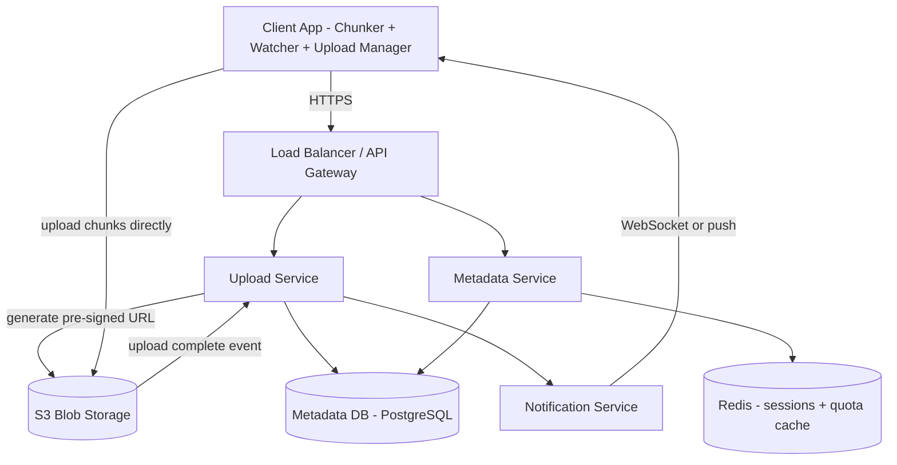
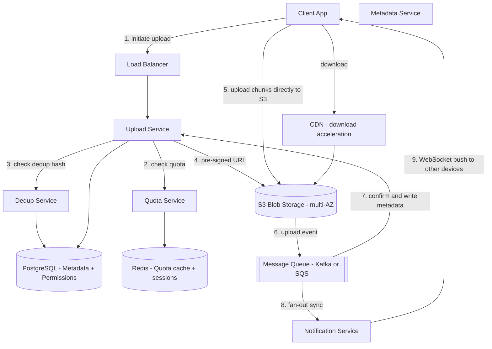
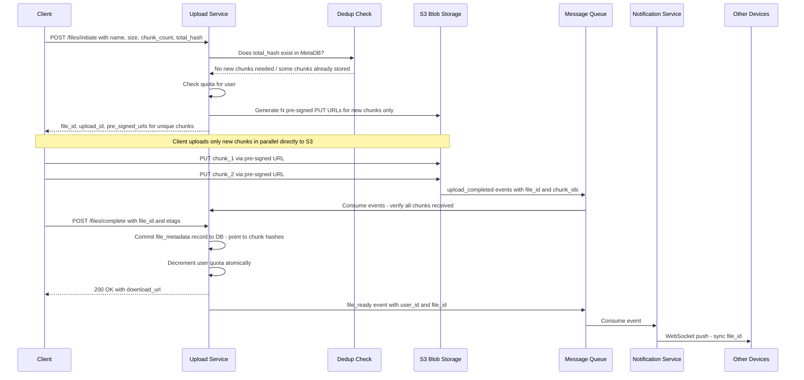
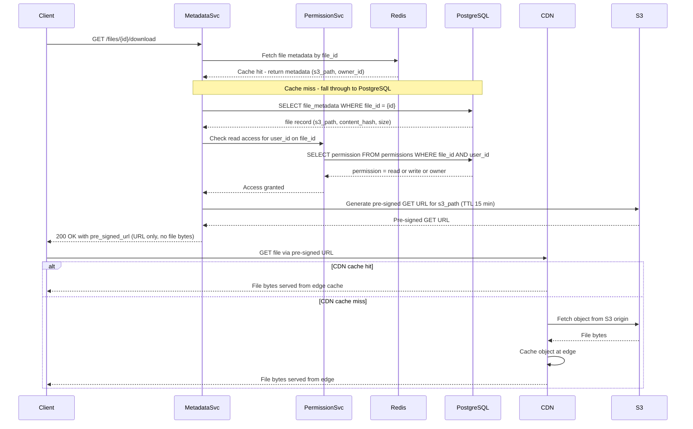

# System Design: Cloud Storage (Google Drive / Dropbox)

---

## 1. What Is Google Drive / Dropbox?

Google Drive and Dropbox are cloud storage platforms: a user uploads files and folders from any device, and those files stay backed up, organized, and automatically kept in sync across every other device signed into the same account. Files can be shared with other people, either to just view or to edit, and everyone sees the same up-to-date folder structure no matter which device they last touched it from.

At the scale these platforms run at — tens of millions of people opening the app every day, storing billions of files between them — the hard part isn't storing a file once. It's storing an enormous number of files cheaply, many of which are near-identical to something someone else already uploaded, moving very large files in and out quickly, and making sure every device a user owns agrees on the current state of their folders within a couple of seconds of any change.

---

## 2. A Day in the Life

Maya is a photographer. She gets home from a wedding shoot, plugs in her camera, and drags a folder of 800 RAW photos into her Drive folder on her laptop. A progress bar creeps upward; halfway through, her laptop's Wi-Fi drops for a few seconds while she moves rooms. When it reconnects, the upload picks up from where it left off instead of starting the whole folder over.

By the time she's back at her desk with coffee, she checks her phone — the same 800 photos are already showing up in the Drive app there too, no action needed. A minute earlier, before the reconnect, none of them had synced yet; now they're just there.

She shares the folder with her editor, Sam, giving him edit access so he can rename and cull the bad shots. That evening, both of them happen to be offline at the same time — Maya on a flight, Sam on the subway — and both rename the same photo differently before reconnecting. Neither edit is silently thrown away: Maya sees her version, plus a second copy labeled with Sam's edit and a timestamp, so she can tell at a glance what happened and pick the one she wants.

A week later, Maya accidentally uploads the same photo folder a second time from an old backup drive, expecting it to eat into her storage quota all over again. It doesn't — the system recognizes the content is identical to what's already stored and doesn't actually copy any of it twice.

None of this — the resume, the sub-two-second sync, the conflict copy, the storage that didn't double — required Maya to think about a server, a database, or a queue. Everything from here on is how that experience actually gets built.

---

## 3. Requirements — and Why They Matter

**Scope.** In scope: file and folder upload/download, auto-sync across devices, directory structure (create/delete/rename/move), file sharing with read/write permissions, storage quota per user, chunk-level deduplication. Out of scope: real-time collaborative editing (a separate system), video transcoding, full-text search within documents, virus-scanning internals, mobile offline-first CRDT sync.

**Functional requirements:**

1. User creates an account and gets a storage quota (e.g., 15 GB free)
2. Upload files and folders of any size, including multi-GB videos
3. Download files from any device and location
4. Auto-sync: all connected devices update within 2 seconds when any device changes a file
5. Share files and folders with other users; assign read or write permission
6. Directory operations: create, rename, delete, and move folders and files
7. Resume interrupted uploads — a failed chunk does not restart the whole file
8. Storage deduplication — identical content stored only once regardless of who uploaded it

<details markdown="1">
<summary><strong>Point to Ponder:</strong> Maya and Sam were both offline and both renamed the same photo — what actually happens when their devices reconnect?</summary>

The server doesn't just let the second upload silently overwrite the first — that would quietly destroy one of their edits. Instead, each file carries a version number; if the version a device is trying to commit doesn't match the version currently on the server, the server treats it as a conflict and creates a second file record — a "conflict copy" — instead of rejecting or overwriting anything. Both versions survive, and the person resolves it manually. See §8.3 Deep Dives for the full mechanism.

</details>

<details markdown="1">
<summary><strong>Point to Ponder:</strong> Maya re-uploaded the same 800 photos from an old backup — does the system store them twice?</summary>

No — uploads are deduplicated at the chunk level, not the whole-file level. Every file is split into 5 MB chunks and each chunk is hashed with SHA-256 before upload; if a chunk's hash already exists in storage, the client never uploads it again, it just gets a metadata pointer to the existing copy. See §8.2 Deep Dives for why this beats whole-file dedup.

</details>

**Non-functional requirements — and why each one matters to a real user, not just as a target:**

| Requirement | Target | Why it matters |
|---|---|---|
| Availability | 99.99% — prefer AP over CP for upload and sync | A user who can't upload a file right before a deadline, or can't reach synced files while traveling, experiences that as the product being broken. |
| Durability | 99.999999999% (11 nines) — replicated across AZs in S3 | Losing a file a user trusted the platform to keep — years of photos, a finished thesis — isn't a bug, it's a small disaster for that person. |
| Upload latency | Bounded by client bandwidth — backend adds less than 100ms overhead | If the backend itself is the slow part of an upload, users notice, because everything else about upload speed is already out of the product's control. |
| Sync latency | Less than 2 seconds after upload completes | A file that shows up on the laptop but not yet on the phone makes a user distrust whether "sync" actually works at all. |
| Metadata read latency | Less than 50ms p99 for folder listing | Opening a folder and waiting for the list to populate feels broken in a way that's disproportionate to how little data is actually being fetched. |
| Consistency — metadata | Strong (ACID) for quota enforcement and permission checks | A user who's told they're under quota but actually isn't, or who can see a file they were never granted access to, is a correctness bug with real consequences. |
| Consistency — sync | Eventual — 1–2 second lag between devices is acceptable | Waiting a couple of seconds for a change to appear on another device is invisible to a human; forcing every device to agree instantly would cost far more than the delay is worth. |
| Large file support | Files up to 15 GB via chunked multipart upload | Video creators and anyone backing up large archives are locked out of the product entirely if big files simply can't go up. |
| Storage efficiency | Chunk-level dedup targeting 60–70% reduction | Invisible to any single user, but it's what keeps a free 15 GB tier economically possible at 10 billion files platform-wide. |

### Consistency Model

| Domain | Model | Reason |
|---|---|---|
| Quota enforcement | Strong (ACID) | User must never exceed quota; two concurrent uploads need serialization |
| Permission checks | Strong (ACID) | Access control must be correct at all times |
| Folder listing | Eventual (read replica) | 1–2s stale list is invisible to users |
| Cross-device sync | Eventual | Notification-driven pull; brief lag acceptable |

> [!IMPORTANT]
> **CAP framing:** Upload and sync prefer availability — a 1–2 second sync lag is acceptable. Quota and permission operations prefer consistency — a user must never exceed quota or access a file they were not granted permission to.

---

## 4. Scale, From First Principles

Before designing anything, it's worth asking: how many users, files, and bytes are actually moving through this system — and what does that imply for the technology choices ahead?

**Starting assumptions:**
```
Active users:           50 million DAU
Files per user:         ~200 average
Total files:            10 billion
Daily uploads:          50 million files/day
Average file size:      500 KB
Large files (>10 MB):   5% of uploads = 2.5 million/day
```

**How much new data actually needs to be stored?** 50 million uploads a day at 500 KB average works out to:
```
50M files/day x 500KB = 25 TB/day of raw uploaded data
```
Not all of that is genuinely new content, though — much of it overlaps with something already stored (repeated backups, revised documents, edited videos that share most of their frames). Dropbox has reported dedup ratios around 70%; assuming a comparable ~60% of uploaded bytes are unique after chunk-level dedup:
```
25 TB/day x 60% unique -> ~15 TB/day net new storage
15 TB/day x 365 x 5 years -> ~27 PB after five years
```
That 27 PB figure — and the fact that a meaningful share of it can be avoided entirely through dedup — is what makes chunk-level content-addressable storage worth the complexity, rather than a nice-to-have optimization.

**How many uploads per second does the backend need to handle?**
```
50M uploads/day / 86,400s = ~580 uploads/sec average
Peak (10x average):       ~5,800 uploads/sec
```
At 5,800 uploads/sec, if the backend itself were streaming those file bytes through application servers rather than handing the client a direct path to storage, that's gigabytes of raw bandwidth every second an app server fleet would have to absorb — a bandwidth problem, not a compute problem, and the kind that no amount of horizontal scaling fixes cheaply. That's the number that rules out proxied uploads before anything else about the design is decided.

**What does that mean at the chunk level?** Large files upload in 5 MB pieces:
```
1 GB file / 5 MB per chunk = 200 chunks
5,800 uploads/sec x ~5 chunks avg = ~29,000 chunk uploads/sec
-> S3 must sustain ~29K PUT requests/sec, and dedup lookups must clear that same 29K/sec
```
That chunk-operations number is what turns dedup from "check a hash" into a scaling problem in its own right — checking 29,000 hashes a second against a relational table is its own bottleneck, addressed later in Bottlenecks & Scaling.

**How many metadata reads does folder browsing generate?** Every DAU opens folders repeatedly through the day:
```
50M DAU x 20 opens/day = 1B reads/day = ~11,500 reads/sec
```
That read volume, sustained against a sub-50ms p99 target, is what rules out serving every folder listing straight from a single primary database.

**How much sync traffic does one upload generate?** A file changed on one device has to notify every other device signed into that account:
```
50M uploads/day -> fan-out to avg 3 devices = 150M notifications/day
150M / 86,400s -> ~1,700 WebSocket pushes/sec
```
1,700 pushes/sec is light compared to the upload and metadata numbers above — the sync problem here isn't throughput, it's holding open enough persistent connections to reach every device at all (more on that in Bottlenecks & Scaling).

These numbers are what drive every major decision in this design: pre-signed URLs instead of proxying file bytes (25 TB/day cannot go through app servers), chunk-level dedup instead of whole-file dedup (a meaningful share of 27 PB over five years is avoidable), PostgreSQL with sharding for metadata (580 writes/sec is well within reach, and metadata is fundamentally relational), and a message queue plus WebSocket for sync (1,700 pushes/sec is lightweight, but the pipeline still has to survive a service restart without losing a notification).

---

## 5. High-Level Architecture

Remember Maya's photo upload and the near-instant sync to her phone from the story above — here's what actually happens underneath.

A cloud storage system isn't really a file store in the way a hard drive is — it's a metadata store with a blob-storage backend that continuously keeps distributed clients in agreement about what exists. Three flows define everything that happens: **upload** (the client splits a file into chunks and pushes them straight to blob storage using a temporary signed URL), **metadata management** (a database tracks what exists — names, folders, ownership, permissions — without ever touching the actual bytes), and **sync** (a storage-layer event triggers a notification, which pushes to every other device over an open connection). The file's bytes and the file's record travel down completely separate paths, and only meet again at the very end, when a client reconstructs a file from its metadata.

Google Drive is not a filesystem — it's a metadata store with a blob storage backend. A "folder" is not a directory on disk, it's a row in a database with `type = folder`. Moving a file doesn't move any bytes, it just changes a `parent_id` field on that row. The actual bytes live in an object store, addressed not by a path but by a content hash.

```
                    +-----------------------------------------------------+
                    |                    FAST PATH                        |
  +--------+  chunk |  +----------------+   pre-signed URL               |
  | Client | ------>|  | Upload Service | ---------------------> S3/Blob |
  |(Chunker|        |  +-------+--------+   client uploads directly      |
  |+Watcher|        +----------|-----------------------------------------+
  +--------+                   | metadata write (before ACK)
                    +----------v-----------------------------------------+
                    |                  RELIABLE PATH                      |
                    |  Metadata DB (file record, hash, parent_id, quota)  |
                    |  Notification Service --> sync other devices        |
                    +-----------------------------------------------------+
```

### Core Design Principles

| Path | Optimized For | Mechanism |
|---|---|---|
| Fast Path — upload | Throughput | Pre-signed URL; client uploads chunks directly to S3; backend touches zero bytes |
| Reliable Path — metadata | Durability + Correctness | DB write before upload confirmed; quota enforced atomically |
| Dedup Path — storage | Efficiency | SHA-256 chunk hash = content-addressable key; second upload = metadata pointer only |
| Sync Path — devices | Near-real-time | S3 event → MQ → Notification Service → WebSocket push; pull-on-notification |

> [!IMPORTANT]
> **File data never touches the application server.** The backend only handles metadata and issues pre-signed tokens. File bytes go client → S3 directly. This is the architectural decision that makes this design scale — the upload bottleneck is the client's bandwidth and S3's throughput, not application server capacity.

> [!NOTE]
> **Key Insight:** Deduplication works at the chunk level, not the file level. If you upload the same 10 GB video twice, only one copy of each chunk is stored. The second upload is just a metadata pointer — no bytes transferred. This is why Dropbox could serve billions of files at a fraction of the expected storage cost.

<details markdown="1">
<summary><strong>Point to Ponder:</strong> If a folder holds thousands of files, does renaming or moving it mean touching every file inside?</summary>

No — because a folder is just a metadata row, not a real container. Files reference their parent folder by a `parent_id` field, not the other way around, so renaming or moving a folder is a single field update on that one row. Every file inside still resolves to the same parent, without any of their own records changing. See §7 Data Model for the full entity layout.

</details>

### From Simple to Evolved

The architecture starts as a small set of services and grows a dedup service, a quota service, and a message queue as the system matures — here's both versions.

### Simple Design



### Evolved Design — with CDN, Dedup, Sync Queue



### The Upload Path, Step by Step

The two diagrams above show the components; this is the actual sequence between them when Maya drags her photo folder in.

The client kicks things off by calling `POST /files/upload/init` with the file's name, size, and a SHA-256 hash of its full content and of each chunk. The Upload Service's first move isn't to start accepting bytes — it's to check whether this content, or parts of it, already exist in storage, since there's no point issuing an upload slot for a chunk that's already sitting in S3 under someone else's file. For whatever chunks genuinely are new, it checks the user's quota, then asks S3 to mint a pre-signed PUT URL for each one — a short-lived, single-object upload token — and hands the whole batch back to the client in one response. The client uploads only those new chunks, in parallel, straight to S3; the app server is never in that data path at all, which is the whole point (§8.1 goes deeper on why). Once every chunk lands, the client calls `POST /files/upload/complete` with the file's ID and each chunk's ETag, and only then does the Upload Service commit the file's metadata record to PostgreSQL — pointing at the chunk hashes, never at the bytes directly — and atomically decrement the user's quota. The last step happens without the client waiting on it: a `file_ready` event goes onto the message queue, the Notification Service consumes it, and every other device signed into that account gets a WebSocket push telling it something changed.



> [!NOTE]
> **Key Insight:** The 3-step upload (initiate → upload to S3 → complete) is the correct pattern for large files. The backend never touches file bytes — it only creates pre-signed URLs and records metadata on completion. This is how the design reaches 5,800 uploads/sec without an application-server bottleneck.

### The Download Path, Step by Step

Download is the mirror image, with one extra check upload doesn't need: permission.

A click on a file calls `GET /files/{id}/download`. The Metadata Service looks for that file's record in Redis first — name, size, S3 location — and only falls through to PostgreSQL on a cache miss, since this is a read path that has to clear in under 50ms at p99. Before handing back anything, though, the Permission Service checks that the requesting user actually has at least read access to this specific file — a step upload skips entirely, because uploading only ever requires access to your own quota, not someone else's file. Once access is confirmed, the Metadata Service asks S3 (or the CDN in front of it) to mint a short-lived pre-signed GET URL — 15 minutes, same pattern as the upload side — and returns just that URL to the client. From there the app server is completely out of the picture: the client fetches the file directly from a CDN edge node, which either already has it cached and serves it in milliseconds, or fetches it once from S3 origin and caches it there for the next request.



> [!NOTE]
> **Key Insight:** The app server never touches file bytes in either direction — upload bytes go Client → S3 directly via pre-signed PUT, download bytes go S3/CDN → Client directly via pre-signed GET. The app server is purely a metadata and URL-signing service.

---

## 6. API Design

Unlike a system split by actor (rider vs. driver), this API is single-actor — every caller is just "a client acting on behalf of a signed-in user" — so the surface splits by *what's being done to a file* instead: initiating and completing an upload, fetching a download link, browsing a folder, changing sharing, and looking at version history.

| Method | Path | Description |
|---|---|---|
| POST | /api/v1/files/upload/init | Initiate chunked upload, returns {upload_id, pre_signed_urls[]} |
| POST | /api/v1/files/upload/complete | Confirm all chunks uploaded, triggers processing |
| GET | /api/v1/files/{id}/download | Returns pre-signed S3 download URL (not the file bytes) |
| GET | /api/v1/folders/{id}/children | List folder contents with metadata |
| POST | /api/v1/files/{id}/share | Share with {email, permission: viewer/editor} |
| GET | /api/v1/files/{id}/versions | List file version history |

The two design choices that aren't self-evident from the table: upload is deliberately split into `init` and `complete` rather than a single call, because the actual byte transfer happens outside this API entirely, client to S3 (§5) — `init` and `complete` are just the bookends the backend needs to check quota and dedup beforehand and commit metadata afterward. And `download` returns a URL, not a stream — the endpoint's whole job is a permission check and a signed token, never the file itself, which is what keeps large-file downloads from ever touching an application server (§5's Download Path).

---

## 7. Data Model

Seven different pieces of data live in this system, and grouping them by how they're actually used makes the storage choices close to self-evident.

**The durable, structural data lives in PostgreSQL, because it's relational by nature.** `file_metadata` is the backbone — every file or folder is a row, and the parent-child folder hierarchy is expressed with nothing more than a `parent_id` foreign key, which is exactly what makes rename and move O(1): one field update, not a bulk rewrite of everything "inside" a folder. `chunks` is the content-addressable table that makes deduplication possible in the first place — its primary key is literally the SHA-256 hash of the chunk's bytes, so "does this content already exist" is a single indexed lookup, and a `ref_count` column tracks how many files currently point at a given chunk, so orphaned chunks (every file referencing them deleted) can eventually be garbage-collected instead of sitting in S3 forever. `file_chunks` is the join table connecting the two — an ordered list of chunk hashes per file, which is what lets a file share *some* of its chunks with another file without either one being a full duplicate. `permissions` rounds out the group: it needs the same ACID guarantees as the others because a wrong answer here is a security bug, not just a stale read, and it joins naturally against `file_metadata` in plain SQL.

**The ephemeral, fast-path data lives in Redis, because none of it needs to survive a restart to remain correct.** `sync_state` maps a user to the set of WebSocket connection IDs currently open across their devices, with a 30-minute TTL — if a device disconnects and never reconnects, this entry simply expires instead of needing a cleanup job to notice. `quota_cache` holds each user's current bytes-used with a 60-second TTL, read on every upload so quota checks don't hit PostgreSQL on the hot path — PostgreSQL stays the source of truth underneath it, and 60 seconds of staleness on a quota check is invisible to a user who isn't uploading at the exact instant they cross their limit. `user_sessions` is the same shape for the same reason: a session lookup happens on nearly every request, so a sub-millisecond Redis read in place of a 10–50ms database round-trip is the difference that matters at this request volume.

| Entity | Storage | Key Columns |
|---|---|---|
| file_metadata | PostgreSQL | file_id UUID PK, name, type, parent_id FK, owner_id, size_bytes, content_hash, s3_path, created_at, modified_at, deleted_at |
| chunks | PostgreSQL | chunk_hash SHA-256 PK, s3_path, size_bytes, ref_count, created_at |
| file_chunks | PostgreSQL | file_id FK, chunk_index, chunk_hash FK |
| permissions | PostgreSQL | file_id FK, user_id FK, permission enum read/write/owner, granted_at — PK is file_id + user_id |
| sync_state | Redis | user_id → set of device_ws_ids, TTL 30min |
| quota_cache | Redis | user_id → bytes_used, TTL 60s |
| user_sessions | Redis | session_token → user_id, TTL 24h |

> [!NOTE]
> **Key Insight:** The `chunks` table makes the hash the primary key — the content IS the address. Deduplication, integrity checking, and content-addressable retrieval are all solved by the same SHA-256 hash. No separate dedup service state is needed.

---

## 8. Deep Dives

### 8.1 Pre-Signed URL Upload Flow

Here's the problem: at peak load, this system needs to absorb 5,800 uploads a second, each one made of roughly 2.5 MB chunks — which works out to 14.5 GB of file data in flight at any given moment. Whatever handles that has to move bytes from a client to permanent storage without becoming the thing that limits how fast uploads can happen.

The obvious approach doesn't survive contact with that number. Have the client `POST` its file bytes straight to the application server, and let the server stream them on to S3. That fails for two separate reasons: the server has to hold a TCP connection open for the entire upload — a 200 MB file on a slow connection means 30-plus seconds of one connection doing nothing but babysitting a byte stream — and the aggregate bandwidth of 25 TB a day flowing through app servers scales the compute and network cost of the fleet linearly with how much data users upload, not with how many requests they make. Provisioning for that is provisioning for a physics problem, not a request-volume problem.

The actual flow sidesteps the app server from the byte-transfer step entirely, in three calls. The client first calls `POST /files/initiate` with the file's metadata and its chunk hashes; the backend checks the user's quota and whether those hashes already exist (deduplication, covered next), then asks S3 to generate pre-signed PUT URLs — tokens that are time-limited to 15 minutes and scoped to exactly one S3 object each, so a leaked URL can't be used to write anywhere else or after it expires. The client then uploads each chunk directly to S3 using its own pre-signed URL, entirely outside the backend's involvement — S3 itself validates the token and stores the chunk. Only at the end does the client call `POST /files/complete` with the file ID and each chunk's ETag, at which point the backend writes the metadata record to PostgreSQL and decrements quota atomically. The trade this makes is real: the client has to implement a three-step flow instead of one simple `POST`. That's acceptable because the client SDK hides all three steps behind a single call for the app developer — nobody hand-rolls this per feature — and the alternative, proxying 25 TB a day, isn't something more hardware fixes.

> [!IMPORTANT]
> **Pre-signed URLs are not just an optimization — they are the only architecture that scales.** Proxying 25 TB/day of file uploads through application servers cannot be fixed with more hardware; it requires re-routing the data path entirely.

> [!TIP]
> In the interview, say: "I chose pre-signed URLs over proxied upload because routing 14.5 GB/sec through application servers creates a bottleneck that cannot be horizontally scaled away — you would need servers sized for bandwidth, not compute. The trade-off I accept is a 3-step client flow, which is hidden inside the SDK."

---

### 8.2 Chunk-Level Deduplication via Content-Addressable Storage

This is the single idea most responsible for making cloud storage at this scale affordable, so it's worth walking through in full — what it protects against, its own moving pieces, and exactly how a chunk goes from "bytes on a client" to "either stored once or not stored at all."

Here's the problem it exists to solve: 50 million uploads a day at 500 KB average is 25 TB of raw data hitting the system daily, and a large share of that isn't actually new. Video edits share 90% of their frames with the original. Document revisions share most of their paragraphs. Backup tools re-upload files that haven't changed at all since last time. Storing every one of those uploads as a fresh, independent blob means paying full storage cost for content that, byte for byte, mostly already exists somewhere on the platform.

The obvious fix — hash the whole file, and skip the upload if that hash already exists — catches only exact duplicates, which turns out to be about 30% of uploads. It's the wrong granularity: two versions of the same video, one with a new intro spliced on, share 95% of their bytes but produce two completely different whole-file hashes, so file-level dedup sees them as entirely unrelated and stores both in full.

What actually needs to prevent this is dedup at a finer grain than "the whole file," able to recognize that two files share *some* content even when they don't share *all* of it, without needing to compare files to each other directly — comparing every new upload against every existing file would itself never scale. The mechanism that satisfies both constraints is content-addressable chunk storage. Every file is split into fixed 5 MB chunks before upload, and each chunk gets its own SHA-256 hash — a hash collision at that size is negligible enough to treat as never happening in practice. That hash *is* the chunk's address: it becomes the primary key of the `chunks` table (§7 Data Model), so "does this content already exist" is never a content comparison, it's an indexed key lookup. When a client calls `POST /files/initiate`, it sends the hash list for every chunk in the file up front. The Upload Service checks that list against the `chunks` table — and at the scale this runs at (§4's ~29,000 chunk operations/sec), that check goes through a Bloom filter in Redis first, so that "definitely new" chunks skip the database lookup entirely and only genuinely ambiguous ones pay for a real query (the scaling numbers for that are in §9 Bottlenecks & Scaling). For every hash that's already known, no pre-signed URL gets issued at all — the file's `file_chunks` join-table entry just points at the existing chunk, and zero bytes cross the network for it. Only the chunks that are genuinely new get a pre-signed URL and actually travel from client to S3.

The result is that a file's identity in the metadata layer becomes nothing more than an ordered list of chunk hashes — `[hash_A, hash_B, hash_C]` — and reconstructing the file for download is just fetching those chunks in order and concatenating them back together. The `ref_count` column on the `chunks` table is what makes this safe to garbage-collect later: every file that references a chunk increments it, every deletion decrements it, and only a chunk whose count drops to zero — meaning no file anywhere still needs it — becomes eligible for actual removal from S3. Nothing gets deleted just because one user deleted their copy of it.

The cost of all this is metadata, not bytes: roughly 100 bytes per chunk record, times 200 chunks in an average large file, times 10 billion files, is on the order of 200 TB of chunk metadata — a known, bounded number, and one that compresses well, unlike the raw file bytes it's tracking. Weighed against a 60–70% reduction on a 27 PB five-year storage projection (§4), that metadata overhead isn't a close call.

> [!NOTE]
> **Key Insight:** Chunk hashes are content-addressable — the hash IS the storage address. Two users uploading the same popular movie share all 200 chunks; only one copy exists on disk, and storage cost is amortized across every user who happens to upload the same content. This is the reason Dropbox could undercut competitors on price.

---

### 8.3 Sync Conflict Resolution

Here's the problem: Maya and Sam, from the story at the start of this doc, are both offline at the same time and both rename the same photo. Both devices upload their change the moment they reconnect. The server ends up with two uploads targeting the same file, both claiming the same starting point, but disagreeing about what it should become — and one of them has to give way, but silently discarding either one is data loss for a real person.

The obvious answer, last-write-wins, is simple to implement — whichever upload's request lands second on the server just overwrites the first — but it's silently destructive exactly in the case that matters most: any time two devices happened to be offline and editing at once, which is rare but not exotic (a flight, a subway, a bad hotel Wi-Fi), someone's edit vanishes with no warning and no way to recover it.

The mechanism that avoids that outcome relies on a version number carried on every file, incremented on every successful write. When a client calls `POST /files/complete`, it includes the `base_version` it started editing from, and the Upload Service compares that against the version currently on record. If they match, nothing conflicted — this is just a normal update, and the version increments and commits as usual. If they don't match, someone else committed a change to this file since this client last saw it, and that's the conflict case. Rather than reject the upload outright, the server creates a second `file_metadata` record — named something like `file (Sam's conflict copy YYYY-MM-DD).ext` — pointing at the second device's chunk hashes, and leaves both records in place. Both versions are visible in the folder afterward, and the person resolves it by hand, the same familiar pattern most sync tools already use.

The trade-off this accepts is that users occasionally have to resolve something manually — a small burden, but a bounded and rare one, since it only triggers when two devices genuinely edit the same file offline at the same time. The alternative — either silently picking a winner or requiring both devices to be online and coordinate through a distributed lock before either can save — is worse on both counts: one loses data outright, the other makes offline editing not really work at all.

> [!NOTE]
> **Key Insight:** Sync is pull-on-notification, not push. The notification tells the device "something changed" — the device decides what to actually download. This is what stops the system from wasting bandwidth pushing large files to a mobile device that's on a slow connection or nearly out of storage.

---

## 9. Bottlenecks & Scaling

Every component in this design has a point where it stops being the right shape for the traffic ahead of it. Here's what gives first as the system scales further, and what actually changes when it does.

Metadata reads are the first thing to strain — folder browsing alone generates about 11,500 reads a second (§4), and a single PostgreSQL primary can't sustain that at a sub-50ms p99 while also absorbing the roughly 580 writes a second coming from uploads. The fix routes around the primary rather than scaling it up: all writes — upload initiate, upload complete, quota updates, permission changes — go to the primary, while every read — folder listings, metadata fetches, permission checks for downloads — goes to read replicas instead. Sharding by `owner_id` keeps a user's whole folder tree on one shard, so a parent-child query never has to reach across shards, and a Redis cache in front of the busiest folders (shared team drives with many simultaneous readers) absorbs the read pattern that would otherwise hit the replicas hardest.

The Notification Service hits a different kind of ceiling: at 50 million users with an average of 3 devices each, that's up to 150 million persistent WebSocket connections if every device were online simultaneously — far more than any single node can hold open. The fix is horizontal: each notification node holds a subset of those connections, and Redis stores the mapping from a user's ID to the set of device connection IDs currently open, with a TTL that cleans up disconnects automatically. When a sync event for a given user arrives, the responsible node looks up that user's connection IDs in Redis and routes the push to whichever node actually holds them, coordinating between nodes over an internal pub/sub channel.

The dedup lookup from §8.2 has its own bottleneck once chunk operations reach their projected ~29,000 a second — checking every one of those hashes against PostgreSQL directly would saturate the database well before the upload pipeline itself became the limit. A Bloom filter sitting in front of that lookup in Redis is what actually absorbs the volume: it can say "definitely not present" with certainty and skip the database entirely, or say "maybe present," in which case — and only in which case — the real lookup happens. A false positive here just costs one unnecessary database read, never a correctness problem, because Bloom filters never produce false negatives; at a 1% false-positive rate, that cuts database load by roughly 70% for a chunk stream that's mostly genuinely new content.

> [!TIP]
> Mention the Bloom filter dedup optimization in interviews — it is a senior-level detail that shows you have thought about the hot path. Say: "I would put a Bloom filter in Redis in front of the chunk hash DB lookup. False positives are acceptable — they just cause an extra DB read. False negatives would break dedup correctness, but Bloom filters never produce false negatives."

Caching also does a lot of quiet work outside these three: `quota_cache` and `user_sessions` (§7 Data Model) both take reads off PostgreSQL's hot path the same way; and one thing that's deliberately *not* part of this scaling story is routing dynamic API calls through a CDN — a CDN accelerates static assets and file downloads (§5), but the metadata calls and upload/complete requests that actually run this system still have to reach origin every time.

---

### 9.1 Failure Scenarios

Every piece of this system can fail independently, and which pieces are affected — and how badly — depends on whether what failed was durable metadata, in-flight bytes, or the sync signal connecting devices.

On the durable-metadata side, a PostgreSQL primary failing blocks writes entirely — upload completion, quota updates, permission changes all stall — until RDS Multi-AZ auto-promotes a replica, roughly a 30-second failover, after which the upload service retries the stalled commits with exponential backoff. A Redis quota-cache failure is a much smaller version of the same story: quota checks simply fall through to PostgreSQL directly, correctness is untouched since PostgreSQL was always the source of truth, and the cache rebuilds itself once Redis is back — the only cost is higher latency during the gap, not incorrect answers.

On the byte-transfer side, an S3 availability event fails chunks mid-upload, but nothing has to restart from zero: the client retries only the chunks that actually failed, using freshly issued pre-signed URLs, and any chunk that already made it to S3 is never re-sent, because the upload is idempotent by content hash. A subtler version of the same race can happen at the dedup layer itself — two users uploading the same brand-new chunk at almost the same instant can both pass the Bloom filter's "maybe new" check and both attempt to write it. PostgreSQL's unique constraint on `chunk_hash` as the primary key resolves this without any extra coordination: one `INSERT` succeeds, the second fails on the constraint, and the second writer just treats that failure as success — the chunk is stored either way, exactly once.

On the sync side, a message-queue outage means S3's upload-complete events never make it to the notification pipeline, so devices stop hearing about changes — but nothing is silently lost, because the upload service polls S3 directly for pending events once the queue recovers, and clients independently re-sync on reconnect by comparing their local file versions against the server's. A Notification Service crash is narrower still: connected devices simply stop receiving pushes and fall back to polling `/files/changes?since=timestamp` every 30 seconds until their WebSocket reconnects on the next heartbeat.

And the one failure that isn't really a backend failure at all: a client going offline. Its pending local changes just queue up locally, upload in order once the connection returns, and the version-based conflict detection from §8.3 handles whatever collided while it was gone.

---

### 9.2 Trade-offs

Three decisions in this design carry a real trade-off rather than an obvious right answer — worth naming each explicitly, since a design that never admits a trade-off usually hasn't actually made one.

### Pre-Signed URL vs Proxy Upload

Routing file bytes through the application server would put the server in full control of every access decision on the way through, and it means a client only ever has to make one simple `POST` — no multi-step flow to implement. But that control costs throughput: the app server fleet would have to absorb the full 14.5 GB/sec of peak upload traffic (§8.1), which caps out at whatever bandwidth the server fleet itself can provision, and every upload takes two network hops (client to server, server to S3) instead of one. Pre-signed URLs give up direct server control over the transfer — access is enforced by a time-scoped (15-minute), single-object token instead of a server checking every byte — in exchange for zero app-server load and a throughput ceiling that's effectively S3's capacity rather than the app fleet's.

**Chosen:** Pre-signed URLs. File bytes never transit application servers. The trade-off accepted is a 3-step client upload flow, which is acceptable because the client SDK abstracts it entirely — no app developer hand-rolls the three calls themselves.

> [!NOTE]
> **Key Insight:** Pre-signed URLs are not just an optimization — they are the only architecture that scales. Proxying 25 TB/day of file uploads is not a latency problem; it is a physics problem.

---

### Chunk-Level Dedup vs File-Level Dedup

File-level dedup — hashing the whole file and checking for an exact match — is the simpler of the two to build: one hash check per upload, one metadata record per file, and lower implementation complexity overall. But it only catches exact duplicates, roughly 30% of uploads, because a single changed byte anywhere in the file produces a completely different whole-file hash — bandwidth savings only happen on an exact repeat, otherwise it's upload the whole file or nothing. Chunk-level dedup catches the much larger category of *partial* overlap — video edits, document revisions, unchanged backup files — pushing the dedup ratio to 60–70% and saving bandwidth on every upload that overlaps with existing content, not just exact repeats. As a side effect it makes resumable upload possible for free, since a failed upload only has to retry the specific chunks that didn't make it, instead of restarting the entire file. What it costs is one metadata record per chunk instead of one per file, and a hash lookup per chunk instead of a single check — genuinely higher implementation complexity.

**Chosen:** Chunk-level deduplication. Most of the storage savings in this system come from shared *partial* content, not exact duplicates, so file-level dedup would leave most of the achievable savings on the table. The trade-off accepted is a larger metadata footprint — roughly 200 TB of chunk records at full scale (§8.2) — which is a known, bounded cost.

> [!NOTE]
> **Key Insight:** Chunk-level dedup is the reason Dropbox could undercut competitors on price. Two users uploading the same popular video share all 200 chunks — only one copy on disk. Storage cost is amortized across all users.

---

### PostgreSQL vs NoSQL for Metadata

A wide-column store like Cassandra or DynamoDB wins decisively on raw write throughput — multi-million writes per second against PostgreSQL's roughly 100,000 per second per shard — and operationally, running a NoSQL cluster at scale is generally simpler than managing PostgreSQL sharding. But this system's actual write volume, ~580 uploads a second (§4), is nowhere near either ceiling, which makes that throughput advantage moot here. What NoSQL gives up in exchange matters more at this system's actual shape: directory hierarchy queries — "list everything under this folder" — are a natural recursive query against an adjacency list in PostgreSQL, but require denormalization or multiple round-trips in a wide-column store; permission checks need a real `JOIN` between files and permissions, which PostgreSQL does natively and NoSQL has to fake at the application layer; and quota aggregation is a `SUM` query PostgreSQL can run directly, where NoSQL needs a separate counter table or an external aggregation step. PostgreSQL is also strongly consistent by default, which is exactly what permission checks and quota enforcement require — NoSQL's eventual-consistency default would need to be fought against for the two places in this system where staleness is actually unacceptable.

**Chosen:** PostgreSQL, sharded by `owner_id`. Metadata here is fundamentally relational — files have parents, permissions have users, users have quotas — and the write volume this system actually sees never approaches the throughput NoSQL would be needed for. The trade-off accepted is sharding complexity, which is worth it because ACID guarantees are what permission and quota correctness actually require, not something NoSQL provides cheaply.

> [!NOTE]
> **Key Insight:** The metadata for a storage system is fundamentally relational. Parent-child folder relationships, permission joins, and quota aggregation are natural SQL. NoSQL requires denormalization to express the same relationships — trading write throughput this system doesn't need for query complexity it would then have to manage itself.

---

## 10. Evaluation: Did We Meet the Requirements?

Nine non-functional requirements were set out in §3. Here's how the design actually satisfies each one — not just what was promised, but the specific mechanism doing the work.

**Availability (99.99%) and durability (11 nines):** These are handled by two different layers on purpose. Availability comes from choosing AP over CP wherever a user is actively interacting with the system — read replicas keep folder browsing up even during a primary failover, and a Redis outage degrades quota checks to a slower PostgreSQL fallback rather than blocking uploads outright (§9.1 Failure Scenarios). Durability is a property of S3 itself — multi-AZ replication — combined with the fact that a file's bytes are never held anywhere in this design except in permanent storage; there's no in-flight buffer that could lose a completed upload.

**Upload latency (client-bandwidth-bound) and large file support (up to 15 GB):** Both fall out of the same decision — pre-signed URLs mean the backend's only job is issuing a token and writing a metadata row, so the backend's own overhead never scales with file size, only the client's own upload speed does. Chunked multipart upload is what makes a 15 GB file tractable at all: it's never one request, it's up to thousands of independent 5 MB chunk uploads, each of which can retry on its own without touching the others.

**Sync latency (<2s) and sync consistency (eventual):** The notification pipeline is deliberately push-then-pull rather than push-with-payload — a device gets told *that* something changed over WebSocket, then decides what to actually fetch, which keeps the notification itself small and fast regardless of the underlying file's size. The 1–2 second lag this allows is the same bound accepted in §3's non-functional requirements, not a shortfall against them.

**Metadata read latency (<50ms p99) and metadata consistency (strong/ACID):** These look like they'd conflict — fast reads versus strict correctness — but they apply to different data. Folder listings are read-replica served, eventually consistent, and fast because they never touch the primary. Quota checks and permission checks are the two places this design refuses to be eventually consistent (§3's Consistency Model), and both stay fast anyway because they're backed by a Redis cache in front of PostgreSQL, not because consistency was traded away.

**Storage efficiency (60–70% dedup):** This is the one requirement that isn't really "achieved" after the fact — it's the number that selected chunk-level content-addressable storage over file-level dedup in the first place (§8.2), the same way §4's throughput numbers selected pre-signed URLs over proxying before any component was built.

| Requirement | Mechanism |
|---|---|
| Availability 99.99% | AP-favoring design; read replicas; graceful Redis-failure fallback |
| Durability 11 nines | S3 multi-AZ replication; bytes only ever live in permanent storage |
| Upload latency | Pre-signed URLs — backend overhead independent of file size |
| Large file support (15 GB) | Chunked multipart upload — independent, retryable 5 MB chunks |
| Sync latency < 2s | Push-notification-then-pull, not payload-carrying push |
| Sync consistency — eventual | Notification-driven; devices reconcile on their own schedule |
| Metadata read < 50ms p99 | Redis cache + PostgreSQL read replicas |
| Metadata consistency — strong | ACID transactions on quota and permission writes |
| Storage efficiency 60–70% | Chunk-level content-addressable dedup (§8.2) |

---

## 11. Conclusion

This design treats cloud storage as two things pretending to be one product: a metadata system that has to be exactly right — who owns what, who can access it, how much space they've used — and a bytes system that has to stay nowhere near the application server at all. The hardest problem wasn't storing files; it was recognizing that most "new" uploads aren't actually new content, and building a content-addressable chunk layer that turns that overlap into a 60–70% storage saving without ever comparing files to each other directly. Every other decision in this design — pre-signed URLs instead of proxying, PostgreSQL for structure instead of NoSQL, pull-on-notification instead of push-with-payload — follows from keeping bytes, metadata, and the sync signal connecting devices as three separate concerns that only ever meet at the edges.

---

## 12. Interview Summary

### Key Decisions

| Decision | Problem It Solves | Trade-off Accepted |
|---|---|---|
| Pre-signed URLs — not proxied | 25 TB/day of file bytes bypasses application servers | 3-step client upload flow; client SDK complexity |
| Chunk-level dedup via SHA-256 | 60–70% storage savings; partial upload resume | Chunk metadata overhead in PostgreSQL |
| Metadata DB — not filesystem | O(1) rename and move; clean permission joins; natural quota aggregation | PostgreSQL sharding complexity at scale |
| Eventual consistency for sync | High availability; devices sync independently; simple architecture | 1–2 second lag before new file appears on other devices |
| Message queue for S3 to sync | Reliable handoff from upload complete to notification — survives service restarts | 200–500ms additional sync latency |
| CDN for downloads | Sub-50ms download globally for popular shared files | CDN egress cost |

### Fast Path vs Reliable Path

```
Fast Path   (throughput):  Client chunks file locally
                           -> Client uploads chunks directly to S3 via pre-signed URL
                           -> S3 emits event to Message Queue

Reliable Path (durability): Metadata DB write before upload confirmed
                            -> Quota enforced atomically on /files/complete
                            -> Notification fan-out only after metadata committed

File bytes  = fast path only  (S3-native, CDN-accelerated on download)
File record = reliable path   (PostgreSQL, ACID, quota-enforced)
Sync signal = reliable path   (MQ -> Notification Service -> WebSocket)
```

### Key Insights Checklist

> [!IMPORTANT]
> These are the lines that make an interviewer lean forward. Know them cold.

- **"A folder in Google Drive is not a directory — it is a metadata row."** Moving a file is changing a `parent_id` field. Rename is changing a `name` field. No bytes move. O(1) regardless of folder size.
- **"File bytes never touch the application server."** Pre-signed URLs send data client to S3 directly. The backend handles only metadata and issues tokens. This is the only architecture that scales to 25 TB/day.
- **"Deduplication works at the chunk level."** Two uploads sharing the same video clip share storage. The second upload is a metadata pointer — no bytes transferred. This is why Dropbox could undercut storage costs.
- **"Chunking is not just for large files — it enables deduplication, parallel upload, and partial retry."** A 1 GB file in 5 MB chunks uploads 200 chunks in parallel and resumes from any failed chunk.
- **"Sync is pull-on-notification, not push."** The notification says 'something changed.' The device decides what to download. This avoids pushing large files to mobile devices on limited storage.
- **"Metadata is relational — use a relational DB."** Parent-child folders, permission joins, quota aggregation are natural SQL. NoSQL requires denormalization to express the same relationships and you trade write throughput you do not need for query complexity you must now manage.
</content>
