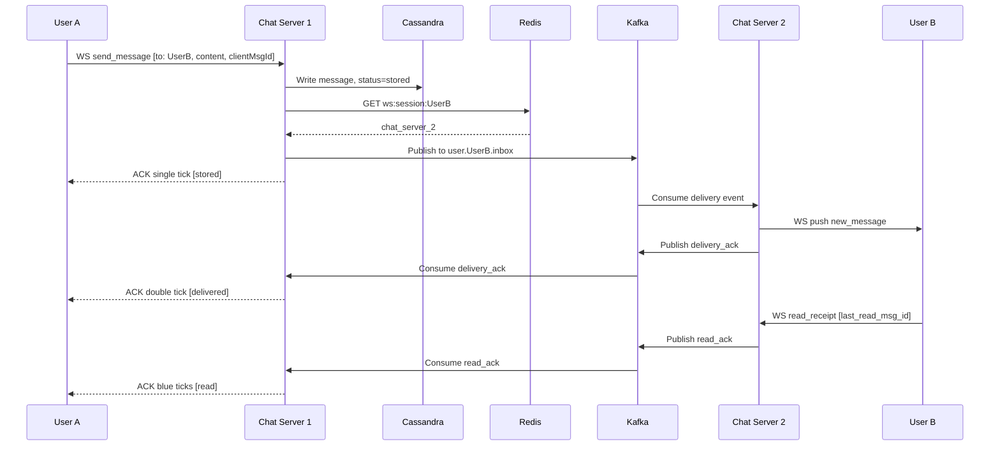
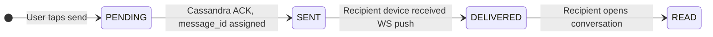
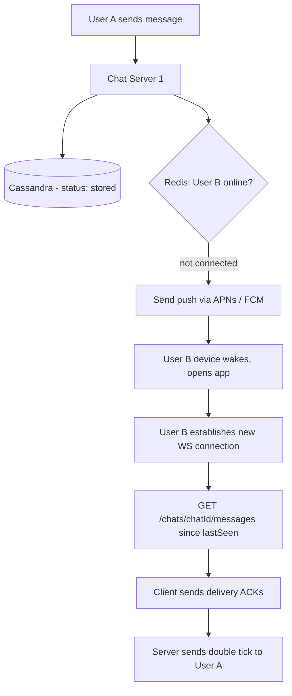
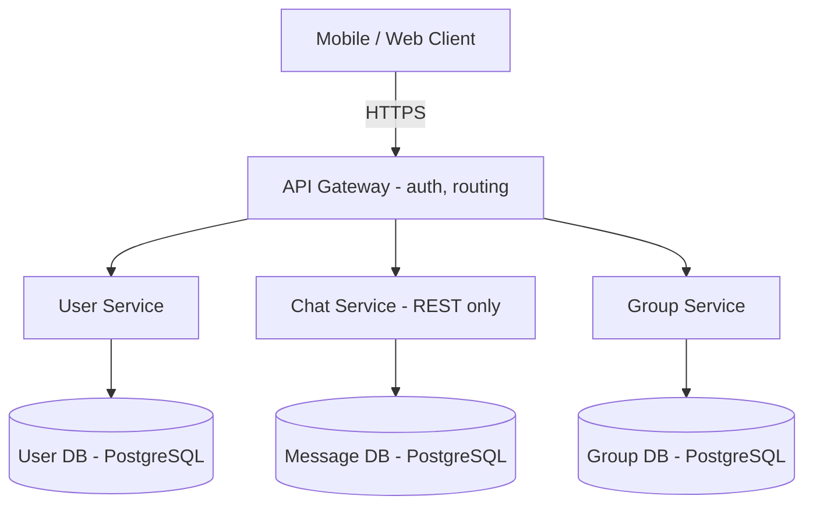
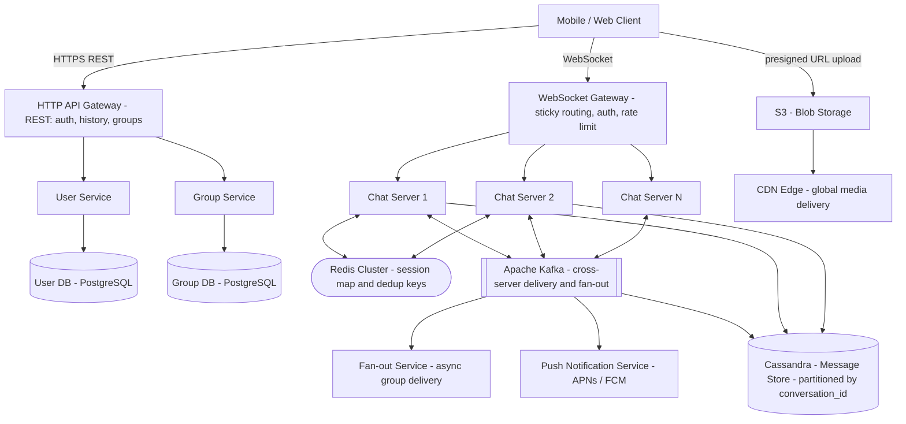
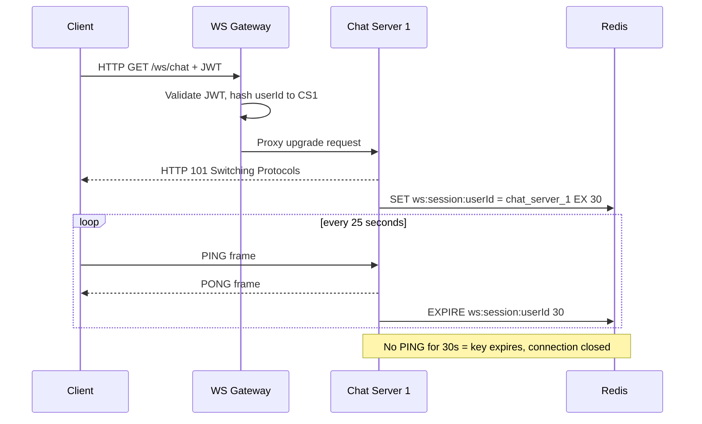
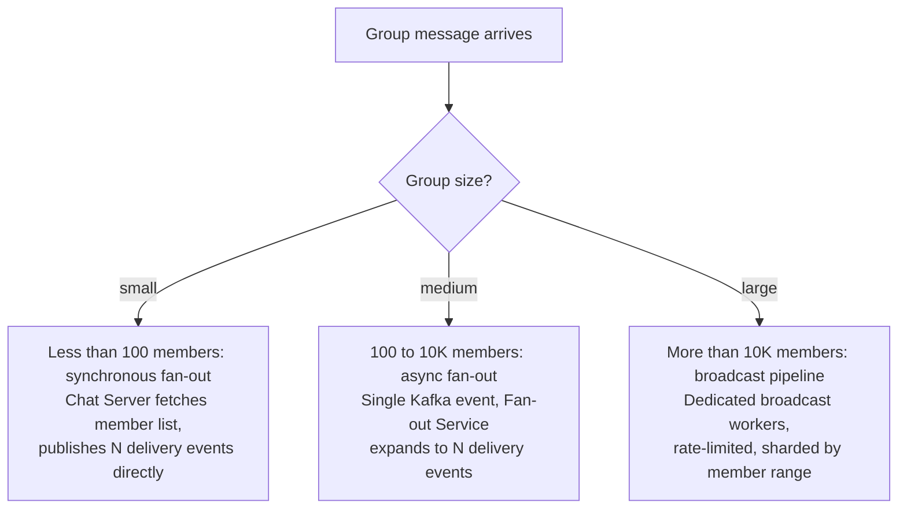

# System Design: Chat Application (WhatsApp / Facebook Messenger)

---

## 1. Problem + Scope

Design a real-time chat application at WhatsApp scale — 1 billion users, 100 billion messages/day. The system must support 1:1 messaging, group messaging, media sharing, and message status tracking (sent, delivered, read) with zero message loss and sub-300ms end-to-end latency.

**In Scope:** user registration, 1:1 real-time messaging, group messaging (small and large groups), message history with pagination, media sharing, message status (1 tick / 2 ticks / blue ticks), offline message delivery.

**Out of Scope:** voice/video calls, Stories/Status features, end-to-end encryption design, payments.

---

## 2. Assumptions & Scale

```
Total users:                    1,000,000,000   (1 billion)
DAU (50% of total):               500,000,000   (500 million)
Messages per user per day:               ~100
Total messages per day:       100,000,000,000   (100 billion)

Average throughput:  100B / 86,400 sec  ~  1,157,000 msg/sec
Peak throughput (2x avg):               ~  2,300,000 msg/sec

Kafka partitions needed (1 partition = ~50K msg/sec):
  2.3M / 50K = ~46 partitions minimum

WebSocket connections at peak:
  Assume 10% DAU online simultaneously = 50M concurrent WS connections
  Chat Server handles 50K connections each -> 1,000 Chat Server instances

Storage (text, avg 1 KB/message):
  100B messages/day x 1 KB = 100 TB/day
  100 TB/day x 365 = ~36.5 PB/year
  With 3x Cassandra replication: ~110 PB/year

Media (10% of messages, avg 500 KB):
  10B media/day x 500 KB = ~5 PB/day (S3 + CDN)

Redis session map memory:
  50M active users x ~100 bytes/entry = ~5 GB -- fits in a single Redis node
```

> [!NOTE]
> **Key Insight:** These numbers drive every decision below. 1.16M writes/sec breaks PostgreSQL. 50M concurrent connections require sticky sessions. 5 GB session map fits comfortably in Redis Cluster. Always show the math before naming a technology.

*These numbers drive the following decisions: Cassandra over SQL, Kafka over direct calls, Redis for session routing, WebSocket over polling.*

---

## 3. Functional Requirements

1. **User registration** — Phone-number-based sign-up; JWT issued on successful OTP verification.
2. **1:1 real-time messaging** — Two users exchange text messages with sub-300ms delivery.
3. **Group messaging** — Create groups, add/remove members, send to all members simultaneously.
4. **Message history** — Scroll back through past messages with lazy-loading pagination.
5. **Media sharing** — Send images and videos; media stored in S3, URL stored in message record.
6. **Message status** — Each message tracks: single tick (stored), double tick (delivered to device), blue ticks (opened by recipient).
7. **Offline delivery** — Messages delivered via push notification (APNs/FCM) when recipient is offline; full history fetched on reconnect.

---

## 4. Non-Functional Requirements

| Requirement | Target |
|---|---|
| Availability | 99.99% uptime |
| Latency | < 300ms end-to-end message delivery |
| Consistency | Eventual consistency (AP — availability over strong consistency) |
| Durability | Zero message loss |
| Throughput | 1.16M msg/sec sustained, 2.3M msg/sec peak |
| Storage | 100 TB/day text; 5 PB/day media |
| CAP choice | AP — chat tolerates brief inconsistency; we must never drop a message |

**Consistency Model:**

| Domain | Model | Justification |
|---|---|---|
| Messages | Eventual (Cassandra quorum) | Slight out-of-order on read is acceptable; loss is not |
| Session map | Eventual (Redis TTL) | Stale entry causes a missed push, not lost message — fallback is pull-on-reconnect |
| Group membership | Strong (PostgreSQL) | Wrong fan-out target list is a correctness bug |
| User accounts | Strong (PostgreSQL) | Auth must be authoritative |

---

## 5. 🧠 Mental Model

Chat systems run **two independent flows concurrently**: a fast path and a reliable path. The fast path (WebSocket + Redis + Kafka) races to deliver a message instantly. The reliable path (Cassandra write) ensures the message is durable the moment it lands. Production chat is the careful orchestration of both — never conflating them.

```
                        +-----------------------------------------------------+
                        |                    FAST PATH                         |
   +--------+  WS frame |  +------------+  Redis  +------+  Kafka  +--------+ |  WS push  +--------+
   | User A | --------->|  | Chat Srvr1 | ------> |Redis | ------> | Kafka  | | --------->| User B |
   +--------+           |  +-----+------+  lookup +------+         +----+---+ |           +--------+
                        +--------|--------------------------------------------+
                                 | concurrent write
                        +--------v--------------------------------------------+
                        |                  RELIABLE PATH                       |
                        |              +-----------------+                     |
                        |              |    Cassandra    |  <- message is safe |
                        |              | (durable store) |    the moment this  |
                        |              +-----------------+    write confirms   |
                        +-----------------------------------------------------+
```

> [!IMPORTANT]
> **Single tick != Double tick.** Single tick = Cassandra confirmed (reliable path). Double tick = WebSocket push succeeded (fast path). These are separate guarantees from separate subsystems. The fast path can fail. The reliable path must not.

### Core Design Principles

| Path | Optimized For | Mechanism |
|---|---|---|
| Fast Path | Latency (< 300ms) | WS frame -> Chat Server -> Redis lookup -> Kafka publish -> Chat Server -> WS push |
| Reliable Path | Durability (zero loss) | Chat Server -> Cassandra write (concurrent, non-blocking, replicated) |

> [!NOTE]
> **Key Insight:** Both paths run concurrently on every message send — not sequentially. The single tick fires when Cassandra ACKs, regardless of fast path outcome. This is what makes zero message loss possible while keeping latency low.

---

## 6. API Design

| Method | Path | Description |
|---|---|---|
| POST | /api/v1/auth/register | Register user, returns JWT |
| POST | /api/v1/auth/login | Login, returns JWT + session |
| GET | /api/v1/conversations | List conversations with last message + unread count |
| GET | /api/v1/conversations/{id}/messages?before=&limit= | Paginated message history (cursor-based) |
| POST | /api/v1/conversations/{id}/messages | Send message, returns {message_id, status: SENT} |
| POST | /api/v1/conversations/group | Create group with {name, member_ids} |

> [!NOTE]
> **WebSocket (/ws) is used for real-time delivery** — the REST APIs above are for initial load and history. The message send endpoint returns `SENT` immediately; `DELIVERED` and `READ` come back asynchronously over WebSocket.

---

## 7. End-to-End Flow

### 7.1 Message Send and Delivery (1:1)



### 7.2 Read Receipt State Machine



### 7.3 Offline Delivery / Push Fallback



> [!NOTE]
> **Key Insight:** Push notification = wake-up call, not delivery vehicle. APNs/FCM have payload size limits and no ordering guarantee. Cassandra has neither. Always treat push as a signal to pull, not as the delivery mechanism itself.

---

## 8. High-Level Architecture

### Simple Design (starting point)



**Limitations:** REST polling wastes bandwidth. Single PostgreSQL message DB cannot handle 100B writes/day. No real-time push capability.

---

### Evolved Production Design



| Component | Role |
|---|---|
| WebSocket Gateway | Sticky routing, auth, rate limiting for all WS connections |
| Chat Server fleet | Holds WS connections, routes messages, handles receipts |
| Redis Cluster | Session map (user -> server), dedup key store |
| Kafka | Durable cross-server delivery log; group fan-out pipeline |
| Cassandra | Primary message store — high write throughput, partitioned by conversation |
| PostgreSQL (User/Group) | Relational data requiring joins or transactions |
| Fan-out Service | Async worker that expands group events into per-member deliveries |
| Push Notification Service | Sends APNs/FCM wake-up when recipient has no active WS |
| S3 + CDN | Raw media storage and global edge delivery |

---

## 9. Data Model

| Entity | Storage | Key Columns | Why this store |
|---|---|---|---|
| messages | Cassandra | partition: conversation_id; cluster: client_seq DESC, message_id; cols: sender_id, content, media_url, status, sent_at | 1.16M writes/sec exceeds PostgreSQL ceiling. Partition by conversation co-locates all messages for fast range reads. No joins needed. |
| users | PostgreSQL | user_id PK, phone, display_name, created_at | Low write rate. Needs relational integrity. Auth must be authoritative. |
| groups | PostgreSQL | group_id PK, name, owner_id, created_at | Relational — group_members is a join table; membership queries need joins. |
| group_members | PostgreSQL | group_id + user_id composite PK, joined_at, role | Foreign key relationships to users and groups. Transactional add/remove. |
| ws_sessions | Redis | key: ws:session:user_id, value: chat_server_id, TTL: 30s | Ephemeral — expires on disconnect. 1.16M lookups/sec needs < 1ms. DB disk I/O would blow latency budget. |
| presence | Redis | key: presence:user_id, value: last_seen_ts, TTL: 60s | Same as session — ephemeral, high-frequency writes (every heartbeat). TTL auto-cleans on disconnect. |
| dedup_keys | Redis | key: dedup:client_msg_id, value: 1, TTL: 24h | Converts at-least-once Kafka delivery into effectively-once at app layer. |
| media_objects | S3 | object key: media/conv_id/msg_id/filename | Binary blobs; S3 = unlimited scale, presigned URLs for direct client upload. CDN serves reads. |

---

## 10. Deep Dives

### 10.1 WebSocket + Sticky Sessions

**Here's the problem we're solving:** At 500M DAU we need to push messages to clients in real time. HTTP polling is the naive solution. Let's show why it fails.

| Protocol | Mechanism | Problem at scale |
|---|---|---|
| HTTP Polling | Client polls every N seconds | 500M users x 1 poll/sec = 500M requests/sec, mostly empty |
| Long Polling | Client holds connection, server replies late | Reconnects every ~30s, doubles effective connection count |
| SSE | Server pushes events, unidirectional | Client still needs a separate POST to send — not full-duplex |
| WebSocket | Full-duplex persistent TCP | One connection per user; server pushes only when there is data |

**Why WebSocket wins:** It is a math problem. 500M users x 1 poll/sec = 500M wasted requests/sec. WebSocket reduces that to zero. One persistent connection, server pushes on arrival.

**Sticky sessions problem:** Each Chat Server holds WS connection objects in memory. If User A is on Chat Server 1 and a load balancer routes their next frame to Chat Server 2, there is no connection object there. Solution: WebSocket Gateway uses consistent hashing on `user_id` to always route to the same server.

**Redis for connection routing:** When User A connects to Chat Server 1, it writes `ws:session:{user_id} = chat_server_1` with a 30s TTL. Any Chat Server routing a message to User A does a single Redis GET — sub-1ms from memory. On heartbeat (every 25s), the Chat Server refreshes the TTL. On disconnect or missed heartbeat, the key expires automatically.



> [!NOTE]
> **Key Insight:** Presence is ephemeral -> Redis with TTL is ideal. DB creates write amplification for data with a natural expiry. Redis TTL handles cleanup automatically — no cron job needed.

---

### 10.2 Message Ordering

**Here's the problem we're solving:** Two users send messages at the same millisecond. Network jitter means either could arrive at the Chat Server first. With Cassandra's eventual consistency, two replicas could briefly serve different orderings to different clients. How do we guarantee users see messages in the correct order?

**Naive solution and why it fails:** A global sequence counter (single atomic counter across all messages) would force every write to serialize through one node — a bottleneck at 1.16M msg/sec. That bottleneck defeats horizontal scaling.

**Chosen solution:**

1. **TIMEUUID clustering key** — Cassandra's TIMEUUID encodes nanosecond-precision timestamp plus a random component for uniqueness. Messages stored by TIMEUUID are naturally time-ordered on disk, making range reads efficient even with concurrent writes at the same nanosecond.

2. **Per-conversation sequence numbers** — Each client tracks a monotonically increasing `client_seq` per conversation. Every outgoing message includes `{conversation_id, client_seq}`. Cassandra primary key: `PRIMARY KEY ((conversation_id), client_seq, message_id)`. If a client receives `seq=44` when `last_seen=42`, it knows seq 43 is missing and issues a gap-fill: `GET /chats/{id}/messages?from_seq=43&limit=5`.

**Trade-off accepted:** We guarantee monotonic reads within a session and per-conversation eventual convergence. We do not guarantee strict global ordering across conversations — and do not need it.

> [!IMPORTANT]
> **Ordering is per-conversation, not global.** A global sequence number at 1.16M msg/sec is a distributed counter bottleneck — a single serialization point. Scoping ordering to `conversation_id` gives strong enough guarantees for chat at zero added cost, because the partition key already co-locates all messages for a conversation.

> [!NOTE]
> **Key Insight:** Global ordering at scale = distributed counter bottleneck. Scope ordering to partition key. Per-conversation ordering is all a chat app needs and it comes for free from the Cassandra partition design.

---

### 10.3 Offline Delivery and Push Fallback

**Here's the problem we're solving:** User B is offline — no entry in the Redis session map. Chat Server has a message to deliver but no WebSocket connection to push to. We still need User B to receive the message, and we need User A to eventually see double ticks.

**Naive solution and why it fails:** Drop the message if the user is offline, or retry infinitely in memory. Either drops messages or leaks memory during extended offline periods.

**Chosen solution — two-stage fallback:**

Stage 1 — Durable persistence: The message is already in Cassandra from the reliable path. It will not be lost regardless of what happens next.

Stage 2 — Push notification as wake-up: Chat Server detects no Redis session entry for User B. It publishes a push event to Kafka, consumed by the Push Notification Service, which sends an APNs (iOS) or FCM (Android) notification. This is a wake-up signal — payload is minimal (sender name, preview text), not the full message.

Stage 3 — Pull on reconnect: User B's device wakes and opens the app. The app re-establishes the WebSocket connection, then immediately fetches missed messages: `GET /chats/{id}/messages?since={last_seen_msg_id}`. Client ACKs receipt, triggering double-tick back to User A.

**Trade-off accepted:** Push notifications are best-effort (OS may throttle or drop them on low-battery mode). The message is always in Cassandra — worst case the user sees it when they next open the app. We accept this graceful degradation over message loss.

> [!NOTE]
> **Key Insight:** Push notification = wake-up call, not delivery vehicle. APNs/FCM have a 4KB payload limit and no ordering guarantee. Cassandra has neither. The reliable path (Cassandra) is the delivery vehicle; push is just the notification.

---

## 11. Bottlenecks & Scaling

**What breaks first at 10x scale (10x = 11.6M msg/sec, 500M concurrent WS connections):**

| Component | Current ceiling | What breaks at 10x | Fix |
|---|---|---|---|
| Chat Server fleet | 1K servers x 50K connections | Memory per server becomes the limit | Reduce connections per server, auto-scale horizontally; WS Gateway consistent hashing distributes evenly |
| Kafka throughput | ~46 partitions for 2.3M/sec | Consumer lag grows, delivery latency climbs | Increase partition count linearly; scale consumer fleet in parallel |
| Cassandra write path | Linear scale by adding nodes | Hot partitions on viral conversations | Shard partition key: (conversation_id, bucket) where bucket = day or hour; limits max partition size |
| Redis session map | ~5 GB for 50M users | ~50 GB at 500M — still fits in Redis Cluster | Add Redis Cluster nodes; session map is read-heavy so read replicas help |
| Fan-out for large groups | Async fan-out service | 10M-member broadcast = 10M Kafka events per message | Tiered fan-out: small groups direct, large groups use a dedicated broadcast pipeline with rate limiting |

**Fan-out strategy by group size:**



> [!NOTE]
> **Key Insight:** Fan-out strategy is a function of group size — the threshold is tuneable. Small group = synchronous is fine (bounded work). Large group = synchronous blocks the sender and overloads the Chat Server. The threshold (100 members) is an engineering decision, not a fixed rule.

---

## 12. Failure Scenarios

| Failure | Impact | Recovery |
|---|---|---|
| WebSocket drop (client network) | Client loses real-time push | Client reconnects with exponential backoff (1s, 2s, 4s, max 30s); fetches missed messages via REST on reconnect |
| Chat Server crash | All WS connections on that server drop | Clients reconnect to another server; Redis session key expires (30s TTL); in-flight Kafka messages are redelivered to another consumer in the group |
| Kafka outage | Cross-server delivery pauses; no fan-out | Messages already in Cassandra (reliable path ran before Kafka publish); delivery resumes when Kafka recovers; clients pull from Cassandra on reconnect |
| Cassandra node failure | Writes/reads may miss one replica | Cassandra replication factor 3 + quorum writes — tolerates 1 node failure; coordinator retries to healthy replica automatically |
| Cassandra full outage | Message writes fail | Chat Server returns error to client; client shows send failure with retry option; no silent message loss |
| Redis node failure | Session map lookups fail for affected keys | Redis Cluster redirects to replica; on total Redis failure, Chat Server falls back to delivering via Kafka to all servers (broadcast fan-out at cost of efficiency) |
| Push notification failure | User not woken when offline | Message is in Cassandra; user sees it on next app open; no data loss |
| Fan-out service crash | Group messages not fanned out | Kafka offset not committed; on restart, Fan-out Service replays from last committed offset; idempotent delivery via Redis dedup keys prevents duplicates |

---

## 13. Trade-offs

### WebSocket vs HTTP Polling

| Dimension | WebSocket | HTTP Polling |
|---|---|---|
| Latency | < 50ms push | 1-10s polling delay |
| Server load | Low — 1 persistent conn/user | Very high — 500M empty requests/sec |
| Complexity | Stateful, requires sticky sessions | Stateless, horizontally trivial |
| Direction | Full-duplex | Half-duplex (client initiates only) |

**Chosen: WebSocket** — At 500M DAU polling generates hundreds of millions of empty requests/sec. The trade-off I accept is stateful connections requiring sticky sessions, which is solved by the Redis session map.

> [!NOTE]
> **Key Insight:** WebSocket vs HTTP is a math problem. 500M users x 1 poll/sec = 500M empty requests/sec. WebSocket reduces polling to zero — server pushes only when there is data.

---

### Cassandra vs SQL for Messages

| Dimension | Cassandra | PostgreSQL |
|---|---|---|
| Write throughput | Millions/sec per node, linear scaling | ~100K/sec, single primary bottleneck |
| Scaling model | Add nodes = add capacity, no resharding | Vertical first, then complex manual sharding |
| Consistency | Eventual (tunable quorum) | Strong ACID |
| Joins / Transactions | Not supported | First-class |
| Best fit for messages | Append-heavy, time-series, partition by conversation_id | Would require hundreds of shards to reach this scale |

**Chosen: Cassandra for messages, PostgreSQL for users and groups** — 1.16M writes/sec exceeds PostgreSQL's ceiling. The trade-off I accept is no joins and eventual consistency — acceptable for chat where message tables need no relational queries.

> [!NOTE]
> **Key Insight:** Cassandra vs SQL is a write throughput calculation, not a preference. Use PostgreSQL where you need joins. Use Cassandra where you need raw write scale.

---

### At-Least-Once vs Exactly-Once Delivery

| Dimension | At-least-once | Exactly-once |
|---|---|---|
| Mechanism | Kafka default — retry on consumer crash | Kafka transactions (2-phase commit) |
| Latency impact | None | +20-100ms per message |
| Complexity | Low | Very high — distributed transactions |
| Duplicate risk | Rare — only on crash mid-ack | None |

**Chosen: At-least-once + application-layer dedup** — Every message carries a `client_message_id` (UUID from sender). Before delivery, Chat Server checks `Redis: GET dedup:{client_message_id}`. If seen, discard. If new, deliver and set key with 24h TTL. This makes Kafka at-least-once behave as effectively-once at near-zero cost.

> [!NOTE]
> **Key Insight:** Exactly-once delivery in distributed systems is expensive. At-least-once + a Redis dedup key gives effectively-once delivery at near-zero cost. The queue is mandatory for correctness, not performance.

---

### Kafka vs Direct Server-to-Server Calls

| Dimension | Kafka | Direct gRPC / HTTP |
|---|---|---|
| Durability | Message persisted in log — survives CS2 crash | Message lost if CS2 is down at call time |
| Coupling | Producers and consumers fully decoupled | Tight coupling — CS1 must know CS2 address |
| Latency | +5-20ms (write + consume) | Lower (direct call) |
| Group fan-out | Natural — publish once, N consumers | Must call N servers explicitly |

**Chosen: Kafka** — Direct server calls create a silent message drop risk on any recipient server failure. The trade-off is +5-20ms latency, well within our 300ms budget.

> [!IMPORTANT]
> **The queue is a correctness requirement, not a performance optimization.** Without Kafka, any server crash between receive and forward = silent message loss. With Kafka, zero message loss is a guarantee, not a hope.

---

## 14. Interview Summary

### Key Decisions

| Decision | Problem it solves | Trade-off accepted |
|---|---|---|
| WebSocket + sticky sessions | HTTP polling = 500M empty requests/sec. WS = 1 persistent connection per user, real-time push. | Stateful connections require sticky sessions. Solved by Redis session map. |
| Redis for session routing | 1.16M route lookups/sec. DB disk I/O = 10-50ms each = latency budget blown. Redis = < 1ms in-memory. | In-memory is volatile. Redis Cluster + TTL auto-reconnect mitigates failure. |
| Kafka between servers | Direct server-to-server calls = silent message drop on recipient crash. Kafka = durable log, consumer recovers and replays. | Added 5-20ms latency. Worth it for zero message loss guarantee. |
| Cassandra for messages | 1.16M writes/sec sustained. PostgreSQL primary tops at ~100K/sec. Cassandra multi-master scales linearly. | No joins, eventual consistency. PostgreSQL handles relational User/Group data. |
| At-least-once + Redis dedup | Exactly-once (2PC) adds 20-100ms latency and high complexity. At-least-once + dedup key = effectively-once at low cost. | 24h dedup TTL. Duplicates beyond that window are practically impossible. |

---

### Fast Path vs Reliable Path

```
Fast Path   (latency):    WS -> Chat Server -> Redis -> Kafka -> Chat Server -> WS
Reliable Path (durability): Chat Server -> Cassandra   (concurrent, non-blocking)

Single tick  = Cassandra confirmed.   This message will NEVER be lost.
Double tick  = WS push confirmed.     This message reached the device.

These are different guarantees from different subsystems -- never conflate them.
```

---

### Message Ordering in One Paragraph

Ordering is **scoped per conversation, not global**. The Cassandra partition key is `conversation_id` — all messages in a chat land on the same nodes, making range queries fast. The clustering key is `(client_seq, message_id)` — messages are stored in per-chat sequence order. Clients track `last_seq_seen` per chat and request gap fills when a sequence number jumps. A global sequence counter at 1.16M msg/sec would be a distributed counter bottleneck. Per-conversation counters are free because the partition key already scopes the space.

---

### Key Insights Checklist

> [!IMPORTANT]
> These are the lines that make an interviewer lean forward. Say them out loud.

- **"The queue is mandatory for correctness, not performance."** Without Kafka, any server crash between receive and forward = silent message loss.
- **"Single tick and double tick are served by different subsystems."** Cassandra guarantees storage. WebSocket guarantees delivery. The fast path can fail; the reliable path must not.
- **"Ordering is per-conversation. A global sequence number is a distributed counter bottleneck at this scale."**
- **"Presence data is ephemeral. Storing it in a DB creates unnecessary write amplification — Redis with TTL is correct because the data has a natural expiry."**
- **"We chose AP over CP deliberately. Chat tolerates eventual consistency. Always justify your CAP choice with the specific failure mode you are accepting."**
- **"Push notification is a wake-up call, not a delivery vehicle. The reliable path is Cassandra; push is just the doorbell."**
