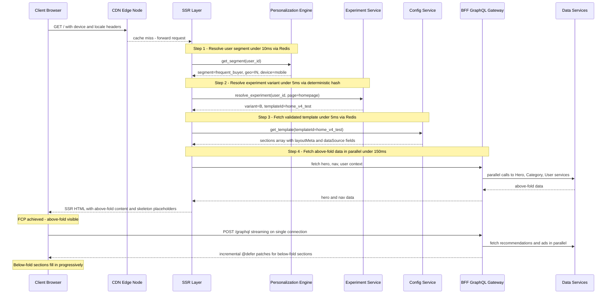
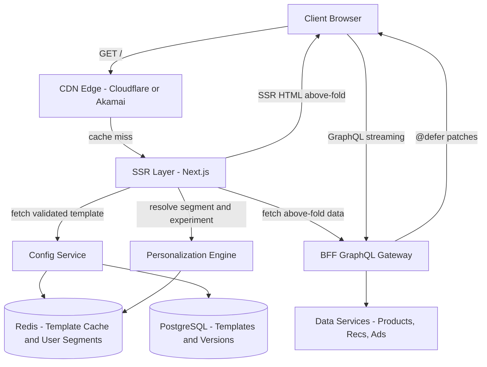
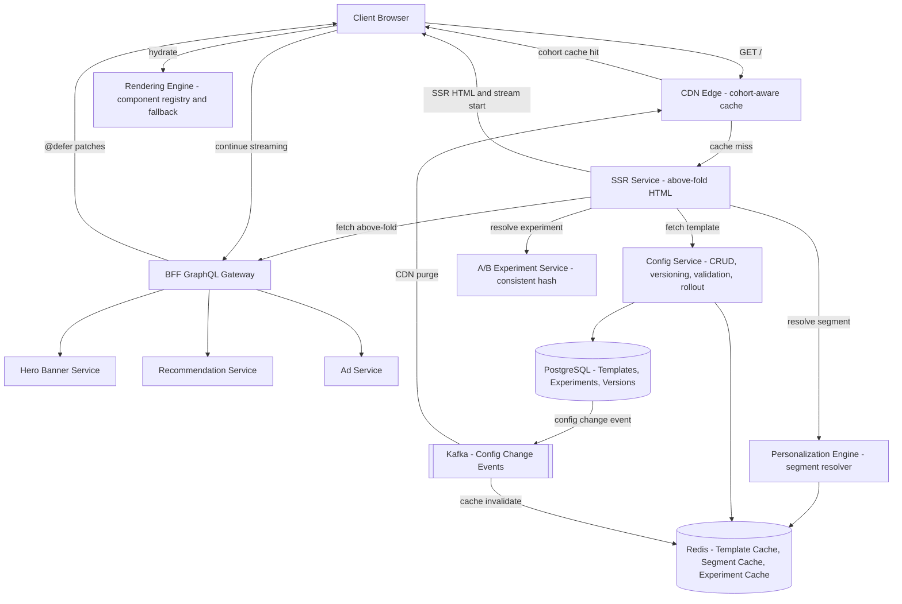
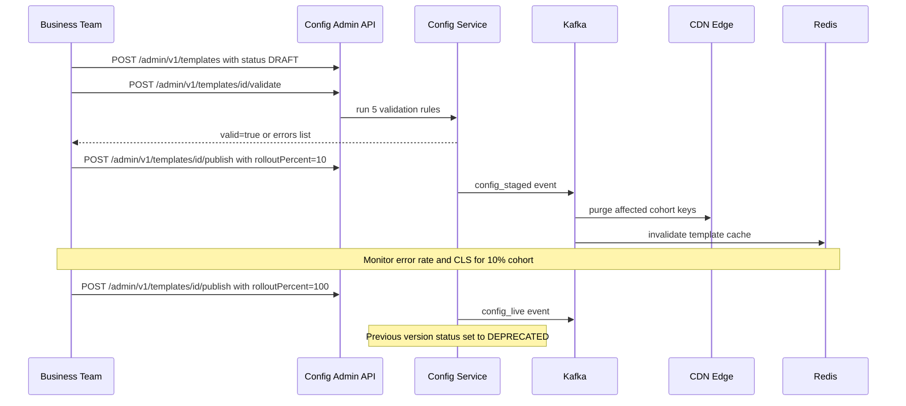
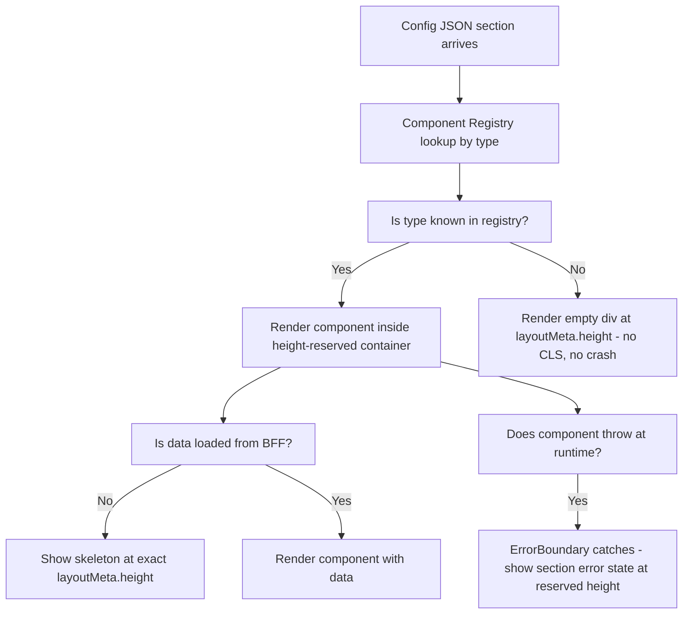
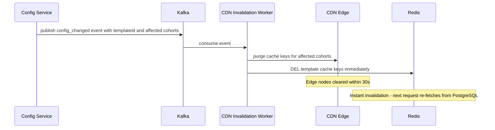

# System Design: Config-Driven Homepage (Amazon / Flipkart / eBay)

---

## 1. Problem + Scope

Design a configurable homepage platform (like Amazon/Flipkart) where the UI is driven entirely by backend configuration. Business teams change layouts 5-10x/week without code deploys. Different users (cohorts, geographies, device types, A/B experiments) see different templates. Pages must load fast: FCP under 1s, LCP under 2.5s, CLS under 0.1.

**In scope:** Config Service (versioning, validation, staged rollout), Personalization Engine (segment resolution, experiment assignment), Rendering Engine (component registry, fallback, lazy loading), BFF data aggregation, SSR + GraphQL streaming pipeline, CDN/edge caching strategy.

**Out of scope:** Product catalog service internals, recommendation ML model training, ads auction engine, user authentication.

---

## 2. Assumptions & Scale

```
Users:
  100M DAU
  Average 10 homepage loads/day = 1B page loads/day

Traffic:
  1B / 86,400s = ~11,574 req/sec average
  Peak (2x): ~23,000 req/sec

CDN cache hit ratio:
  Config template: ~90% hit (cohort-static, TTL 5 min)
  Origin hits after CDN: ~2,300 req/sec

Data per page:
  5-8 data sources in parallel (hero, recs, ads, categories)
  Each source: ~10-50 KB -- total ~200 KB per page

Bandwidth at peak:
  23,000 req/sec x 200 KB = ~4.6 GB/sec (mostly CDN + S3)
  App servers: ~2,300 req/sec x 50 KB = ~115 MB/sec

Config storage:
  ~10,000 templates (device x locale x segment x variants)
  Each template: ~5 KB -- total ~50 MB -- fits entirely in Redis
  ~20 versions per template -- ~1 GB PostgreSQL -- trivial
```

> *These numbers drive every decision below: CDN absorbs 90% of traffic, personalization must resolve in under 50ms, config must fit in Redis, SSR must complete above-fold in under 400ms.*

---

## 3. Functional Requirements

1. **Config-driven layout** — backend sends template JSON defining sections, types, and order; clients render without knowing the layout at build time
2. **Personalization** — different users (cohorts, geo, device) see different templates resolved server-side before the first byte is sent
3. **A/B testing** — experiment variants assigned consistently per user without code deploys or frontend changes
4. **Progressive loading** — above-fold renders immediately; below-fold sections stream in as data arrives
5. **Skeleton placeholders** — every section reserves fixed pixel space before data loads, preventing layout shift
6. **Business team control** — non-engineers modify homepage layout via config dashboard; no engineer required for layout changes
7. **Config rollout** — new templates staged (canary to 10% to 100%) with instant rollback capability

---

## 4. Non-Functional Requirements

| Requirement | Target | Reasoning |
|---|---|---|
| Throughput | 23,000 req/sec peak | Amazon-scale; CDN absorbs 90% |
| FCP (First Contentful Paint) | Under 1s | User sees content immediately; SSR + CDN |
| LCP (Largest Contentful Paint) | Under 2.5s | Google Core Web Vital threshold |
| CLS (Cumulative Layout Shift) | Under 0.1 | Fixed heights in config; skeletons fill reserved space |
| TTI (Time to Interactive) | Under 3s | Critical JS bundle under 100 KB; deferred hydration |
| Config availability | 99.99% | Stale-config CDN fallback; no blank pages |
| Personalization latency | Under 50ms | Must not block the critical path to FCP |
| Config propagation | Under 30s after publish | Kafka to CDN purge + Redis invalidation |

> [!NOTE]
> **Key Insight:** This is primarily a performance problem, not a storage problem. The challenge is not storing page configs — it is delivering them fast enough that the user sees content in under 1s on a slow connection. Every architectural decision (CDN, SSR, @defer, fixed heights) targets one of the Core Web Vitals.

---

## 5. Mental Model

A homepage is not rendered by code — it is **assembled dynamically from configuration, data, and experiment assignments at runtime.** Three systems collaborate to produce what the user sees:

- **Config Service** decides *what* to show: which sections, in what order, with what layout — versioned, validated, and gradually rolled out.
- **Personalization Engine** decides *for whom*: maps `user_id → segment → experiment variant → templateId` in under 50ms.
- **Rendering Engine** decides *how*: maps `section.type → React component`, with graceful fallback for unknown types.

```
                    +-------------------------------------------------------------+
                    |                       FAST PATH                             |
  +--------+  req   |  +----------+  template  +----------+  SSR HTML            |
  | Client | ------>|  |   CDN    | ---------->| SSR Layer| ---------> browser   |
  +--------+        |  +----------+  (cached)  +----------+  (above fold ready)  |
                    |                                  |  stream below-fold       |
                    +----------------------------------|--------------------------+
                                                       |  GraphQL @defer patches
                    +----------------------------------v--------------------------+
                    |                    RELIABLE PATH                            |
                    |  Personalization Engine --> correct template for this user  |
                    |  Config Service --> versioned, validated template JSON      |
                    |  Rendering Engine --> section.type --> React component      |
                    +-------------------------------------------------------------+
```

### Core Design Principles

| Path | Optimized For | Mechanism |
|---|---|---|
| Fast Path | Latency (FCP under 1s) | CDN serves cached config by cohort; SSR renders above-fold HTML immediately |
| Reliable Path | Correctness and consistency | Config validated before publish; experiment assignment via consistent hash; stale-config fallback always available |
| Progressive Path | Perceived performance | GraphQL @defer streams below-fold data as patches after above-fold renders |

---

## 6. API Design

| Method | Path | Description |
|---|---|---|
| GET | /api/v1/homepage?user_id=&platform=&version= | Fetch personalized page config — returns ordered section list with component types and data |
| GET | /api/v1/config/{page_id}?experiment_id= | Fetch specific page config for A/B experiment variant |
| POST | /api/v1/cart/items | Add item {product_id, quantity, seller_id} |
| GET | /api/v1/cart | Fetch current cart with prices re-validated |
| POST | /api/v1/cart/checkout | Convert cart to order, returns {order_id} |
| POST | /api/v1/config (admin) | Publish new page config version |

> [!NOTE]
> `GET /homepage` is the most architecturally interesting endpoint — it drives the entire server-driven UI pattern. The response is a config payload (section types + data URLs), not HTML or components. The client renders whatever sections the server returns, which means new section types can be deployed without app updates.

---

## 7. End-to-End Flow

App launch to config fetch to render sections:



---

## 8. High-Level Architecture

### Simple Design



### Evolved Design - A/B Testing + Edge Personalization + Streaming



---

## 9. Data Model

| Entity | Storage | Key Columns | Why This Store |
|---|---|---|---|
| Page Template | PostgreSQL | template_id, version, status, cohort, sections JSON, created_at | ACID + versioning history; rollback = status flip; ~1 GB total — trivial |
| Template Cache | Redis | template:{templateId}:{version} to sections JSON, TTL 10 min | Under 5ms reads; entire 50 MB fits in memory; invalidated on publish or rollback |
| User Segment | Redis | segment:{user_id} to segment, geo, device, TTL 10 min | Ephemeral; ML assigns offline; cache miss falls back to default segment |
| Experiment Assignment | Redis | exp:{user_id}:{experiment_id} to variant and templateId, TTL 10 min | Deterministic hash means no persistent state needed; Redis is a warm cache layer |
| Experiment Config | PostgreSQL | experiment_id, buckets JSON, variant to templateId mapping, status | Durable; bucket ranges rarely change; must survive restarts |
| Config Audit Log | PostgreSQL | template_id, version, actor, action, timestamp | Compliance + rollback investigation; append-only |
| Section Render Registry | In-memory on frontend | type to React component reference | Client-side map; updated on frontend deploy; unknown types fall through to empty reserved space |

> [!NOTE]
> **Key Insight:** Config versioning is not for history — it is for rollback speed. Rollback must be instant: a status flip in PostgreSQL, a Redis key delete, and a Kafka event to purge CDN. No re-upload, no re-deploy. Keeping the previous LIVE version in Redis means rollback completes in under 30 seconds.

---

## 10. Deep Dives

### 10.1 Config Schema Design + A/B Testing

Here's the problem: a homepage layout change sounds simple — "move the carousel above the banner." Done wrong, it causes a production incident. Bad config = blank sections for millions of users at 11,500 req/sec. The Config Service is not a JSON blob store — it is a production system with schema validation and controlled rollout.

**Config lifecycle:**

```
DRAFT --> REVIEW --> STAGED (canary, 10%) --> LIVE (100%) --> DEPRECATED
```

**Key fields in a section object:**

| Field | Required | Why it matters |
|---|---|---|
| id | Yes | Unique identifier for deduplication and telemetry |
| type | Yes | Maps to component in Rendering Engine registry |
| position | Yes | Ordering on page; duplicate positions block publish |
| layoutMeta.height | Yes | Pixel height for skeleton — missing causes CLS in production |
| layoutMeta.aboveTheFold | Yes | Whether section must be in initial SSR response |
| dataSource.field | Yes | Which GraphQL field provides data for this section |
| targetCohort | No | If absent, section shows to all users |

**Validation rules enforced at publish time:**

| Validation | Error if violated |
|---|---|
| All sections have layoutMeta.height | Block publish — missing height causes CLS |
| All type values exist in component registry | Block publish — unknown type = blank section |
| All dataSource.field values are valid GraphQL fields | Block publish — bad field = no data for section |
| No two sections share the same position | Block publish — ordering conflict |
| targetCohort exists in Personalization Service | Warn only — allow publish with warning |

**Rollout + A/B assignment:**



**Consistent hashing for stable A/B assignment:**

```
bucket = consistent_hash(user_id) mod 100

Experiment: variant_A = buckets 0-49, variant_B = buckets 50-99
User "u_abc123" always hashes to bucket 37 -- always variant_A
```

Without consistent hashing, the same user sees a different variant each page load — polluting experiment data and breaking UX. Consistent hash is deterministic with no state storage required.

> [!IMPORTANT]
> **Config Service is a production system, not a feature.** A template with type "FlashSaleTimer" that the Rendering Engine does not know about will render a blank section for every user in that cohort. Schema validation at publish time is far cheaper than a rollback drill at 11,500 req/sec.

---

### 10.2 Server-Driven UI Rendering Pipeline

Here's the problem: the backend sends `"type": "HeroBanner"` in the config JSON. The client must render it without knowing the full list of types at build time. And when it receives a type it has never seen, it must not crash.

**The Rendering Engine contract:**



**Three failure modes the Rendering Engine must handle:**

| Failure | What Happens | Recovery Strategy |
|---|---|---|
| Unknown section.type | New type in config, old client build | Render empty reserved space — no crash, no CLS |
| Component throws runtime error | ErrorBoundary wraps every section | Show error state at reserved height; rest of page unaffected |
| Data timeout — section data never arrives | Skeleton stays visible beyond threshold | Show refresh prompt after 5s; section-level retry |

**Lazy loading:** Above-fold components (HeroBanner, NavigationBar) are eagerly bundled — must be available at FCP. Below-fold components use lazy loading with Suspense triggered by an IntersectionObserver with 200px rootMargin, pre-loading before the section scrolls into view. This reduces initial JS bundle by ~40%.

> [!NOTE]
> **Key Insight:** The component registry is a versioning boundary. Config and frontend components deploy independently. Unknown types must degrade gracefully — not crash. A new section type can be added to config during gradual rollout; old clients ignore it cleanly while new clients render it.

---

### 10.3 Config Caching + Invalidation

Here's the problem: 11,500 req/sec for a homepage that is 90% identical across users in the same cohort. Hitting the origin for every config fetch wastes compute and adds latency.

**Cache layers and TTLs:**

| Content | Cache Layer | TTL | Cache Key |
|---|---|---|---|
| Template JSON per cohort | CDN edge node | 5 min | device + locale + segment |
| Hero banner image | CDN | 1 hour | URL hash |
| Non-personalized section data (nav, categories) | CDN | 5 min | locale + device |
| User-specific data (recs, cart) | Not cached at CDN | - | Never CDN-cached |
| Experiment assignment | Redis | 10 min | user_id + experiment_id |
| User segment | Redis | 10 min | user_id |

**Cache invalidation on config change:**



**Cache stampede on config invalidation:** When a popular config key expires or is purged, thousands of requests hit the origin simultaneously. Mitigation: Redis mutex lock — first request acquires a short-lived lock and repopulates the cache; all others serve the stale value (if available) or wait under 100ms for the lock to release.

> [!NOTE]
> **Key Insight:** Personalized data (recs, ads, cart) must never be cached at CDN. CDN keys can only vary by coarse dimensions. User-specific data is always fetched and streamed server-side. The split between "cacheable template" and "non-cacheable data" is the fundamental architecture of this system.

---

## 11. Bottlenecks & Scaling

### Config Cache Stampede

**What breaks:** A popular config key expires or is purged after publish. Thousands of SSR requests simultaneously miss the Redis cache and hammer PostgreSQL.

**Fix:** Redis mutex (distributed lock). First request acquires a short TTL lock, fetches from PostgreSQL, and repopulates the cache. All other requests either get a slightly stale value (jitter window) or wait under 100ms for the lock to clear. Config reads never reach PostgreSQL in steady state after warmup.

### Personalization at Scale

**What breaks:** At 2,300 SSR req/sec (after CDN), if each request does a cold ML inference for segment resolution, latency blows the 50ms budget.

**Fix:** ML runs offline in a nightly batch job, writing `user_id → segment` assignments to Redis with a 10-min TTL. At request time, the Personalization Engine is a Redis lookup — under 5ms. On cache miss, the fallback is the default template (never block render). The 10-min TTL means segment changes propagate within a reasonable window without real-time ML per request.

### Config Propagation Latency

**What breaks:** A rollback is triggered, but CDN edge nodes still serve the bad config for up to 5 minutes (TTL window). Users see the broken layout during the propagation window.

**Fix:** Kafka-driven CDN purge with a target SLA of 30s. For critical rollbacks, a "purge all" command bypasses TTL immediately. Accepting up to 5 min stale for normal changes is a deliberate trade-off — the CDN cache hit rate benefit (90%) justifies it, since layout changes are not time-critical for the user.

> [!TIP]
> In an interview: say "I would reduce CDN TTL from 5 min to 30s for experiment-related templates to tighten the A/B invalidation window, at the cost of a ~20% increase in origin requests for experiment cohorts." This shows you understand the TTL vs freshness trade-off precisely.

---

## 12. Failure Scenarios

| Failure | Impact | Recovery Strategy |
|---|---|---|
| Config Service down | No new config fetches; in-flight SSR misses Redis | Serve stale CDN-cached config (TTL 5 min); Redis TTL extended to 30 min as circuit breaker |
| Redis cache fully down | Every SSR request hits PostgreSQL directly | PostgreSQL can handle ~2,300 req/sec burst; degrade gracefully; page still loads |
| Kafka partition lag (slow CDN invalidation) | Stale config served at edge beyond TTL window | Short CDN TTL (5 min) limits blast radius; manual purge command for emergencies |
| SSR service down | No server-rendered HTML | CDN serves last-known good HTML (stale SSR cache, 5 min); client-side fallback renders minimal layout |
| Personalization Engine unavailable | Cannot resolve user segment | Fallback: serve global default template (no personalization); no blank page |
| Below-fold data service timeout (Recs, Ads) | Section never fills; skeleton persists | Client shows retry prompt after 5s timeout; above-fold unaffected; section-level retry |
| Config publish with bad schema | Broken layout for 10% canary cohort | Detect via error rate spike (CLS over 0.1 or blank section rate); rollback = status flip in PostgreSQL to Kafka to CDN purge within 30s |
| Frontend rendering crash (unknown type) | Section blank | Rendering Engine fallback: empty reserved space at layoutMeta.height; ErrorBoundary catches runtime errors |

---

## 13. Trade-offs

### Server-Driven UI vs Client-Driven (Hardcoded) UI

| Dimension | Server-Driven UI (chosen) | Hardcoded Frontend |
|---|---|---|
| Layout changes | Config update — no deploy | Frontend code change + deploy |
| A/B testing | Template variants — instant | Feature flags in code |
| Performance overhead | Extra config fetch (~5ms Redis) | No overhead |
| Debugging complexity | Higher — layout from server at runtime | Lower — layout visible in code |
| Client robustness requirement | Must handle unknown types gracefully | Only known types rendered |

**Chosen: Server-Driven UI.** Business velocity is the primary driver — product teams change homepage layouts 5-10x/week at Amazon scale. Requiring an engineer and a deploy for each layout change is not viable. The trade-off we accept is debugging complexity, mitigated by a config dashboard showing the resolved template for any user segment.

> [!NOTE]
> **Key Insight:** Server-Driven UI shifts page ownership from engineering to product. The frontend becomes a rendering substrate — it must handle any layout the backend sends, including layouts it has never seen. The Rendering Engine's fallback handling is what makes this safe.

---

### CDN vs Redis for Config Delivery

| Dimension | CDN (chosen for templates) | Redis Only |
|---|---|---|
| Geographic latency | Under 10ms from edge node | 50-100ms cross-region |
| Cache hit ratio | 90% (cohort-static templates) | 100% if keys populated |
| Invalidation control | Kafka-driven purge, 30s SLA | Instant DEL |
| Cost at 23K req/sec | Low — edge absorbs traffic | Higher — Redis cluster under full load |
| User-specific data | Not suitable | Ideal |

**Chosen: CDN for cohort-level templates; Redis for user-specific segments and experiment assignments.** CDN absorbs 90% of template traffic with under 10ms global latency. Redis handles the dynamic, user-specific lookups that CDN cannot vary on.

> [!NOTE]
> **Key Insight:** CDN caches cohorts, not users. User-level CDN caching has near-zero hit rate at scale. Cohort-level (device + locale + segment) achieves 90% hit rate. Truly personalized data (recs, cart) bypasses CDN entirely and is streamed server-side.

---

### Static Sections vs Dynamic Sections

| Dimension | Fully Static Sections | Fully Dynamic config-driven (chosen) |
|---|---|---|
| Page load | Fastest — no config fetch | +5ms Redis lookup |
| A/B testing | Requires code change | Config variant swap — instant |
| Business control | Engineering required | Business team via dashboard |
| Deployment coupling | Frontend owns layout | Config Service owns layout |
| Incident risk | Low (known layouts) | Schema validation required to prevent bad config |

**Chosen: Fully dynamic config-driven sections.** At Amazon scale, "static sections require an engineer" is a bottleneck that blocks product velocity. Dynamic config with validation gates is the correct trade-off — the risk of bad config is mitigated by schema validation at publish time, not by avoiding config-driven UI.

---

## 14. Interview Summary

### Key Decisions

| Decision | Problem It Solves | Trade-off Accepted |
|---|---|---|
| Server-Driven UI with config JSON | Layout changes without code deploys | Debugging complexity; component registry must be maintained |
| Config Service with validation and versioning | Bad config = production incident; rollback must be instant | Config schema is a production contract — additions require care |
| Rendering Engine with graceful fallback | Unknown component types must not crash | Frontend is a dumb rendering substrate; must handle any type |
| Personalization Engine via Redis lookup | 100M users, segment resolution in under 50ms | ML runs offline; cache miss falls back to default template |
| Consistent hash for A/B | User sees same variant every session; clean experiment data | Cannot change experiment bucket boundaries while it runs |
| Fixed layoutMeta.height in every section | CLS = 0 — no layout shift when data loads | Backend must know pixel heights; inflexible for fluid responsive design |
| Cohort-level CDN caching | 90% traffic absorbed at edge | Personalization only at cohort granularity, not per-user |
| GraphQL @defer for below-fold | Above-fold renders in under 200ms; rest streams progressively | Complex streaming client; patch merge logic required |
| Kafka for cache invalidation | Config change propagates to CDN + Redis within 30s | Up to 5 min stale during CDN TTL window |

### Fast Path vs Reliable Path

```
FAST PATH (optimized for FCP under 1s):
  Client --> CDN edge (cohort cache hit) --> SSR HTML delivered
  CDN hit: 90% of requests never reach origin
  Remaining 10%: SSR resolves segment (Redis under 10ms) + template (Redis under 5ms)
               + fetches above-fold data (parallel, under 150ms)
               --> HTML sent --> FCP under 400ms total

RELIABLE PATH (optimized for correctness):
  Config validated before publish (5 schema rules block bad templates)
  Experiment assignment via consistent hash -- same bucket every session
  Personalization fallback: cache miss --> global default (never blank page)
  Config rollback: status flip --> Kafka --> CDN purge --> 30s propagation
  Rendering Engine fallback: unknown type --> reserved empty space (no crash)
```

### Key Insights Checklist

- **A homepage is assembled, not rendered.** Config decides structure. Personalization Engine decides which config. Rendering Engine decides how to paint it. No single system owns the page.
- **Config is a first-class production system.** Every template is versioned, validated before publish, and staged gradually. A bad template at 11,500 req/sec is a production incident — schema validation at publish time is cheaper than a rollback drill.
- **The Rendering Engine must handle unknowns.** Config and client deploy independently. Unknown section.type must degrade gracefully — empty reserved space, never a crash. This is what makes config and frontend truly decoupled.
- **Personalization is a lookup, not inference.** ML runs offline. At request time, the engine maps user_id to Redis to segment to templateId in under 50ms. Real-time ML inference per request would blow the FCP budget.
- **Layout before data — always.** Template JSON with fixed section heights must arrive before any data. CLS = 0 requires every skeleton to occupy the same pixel space as the real component.
- **CDN caches cohorts, not users.** User-level CDN caching has near-zero hit rate. Cohort-level (device + locale + segment) achieves 90% hit rate. Truly personalized data bypasses CDN entirely.
