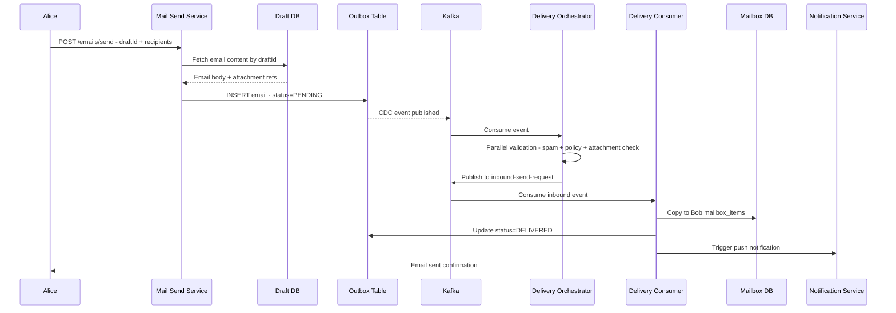
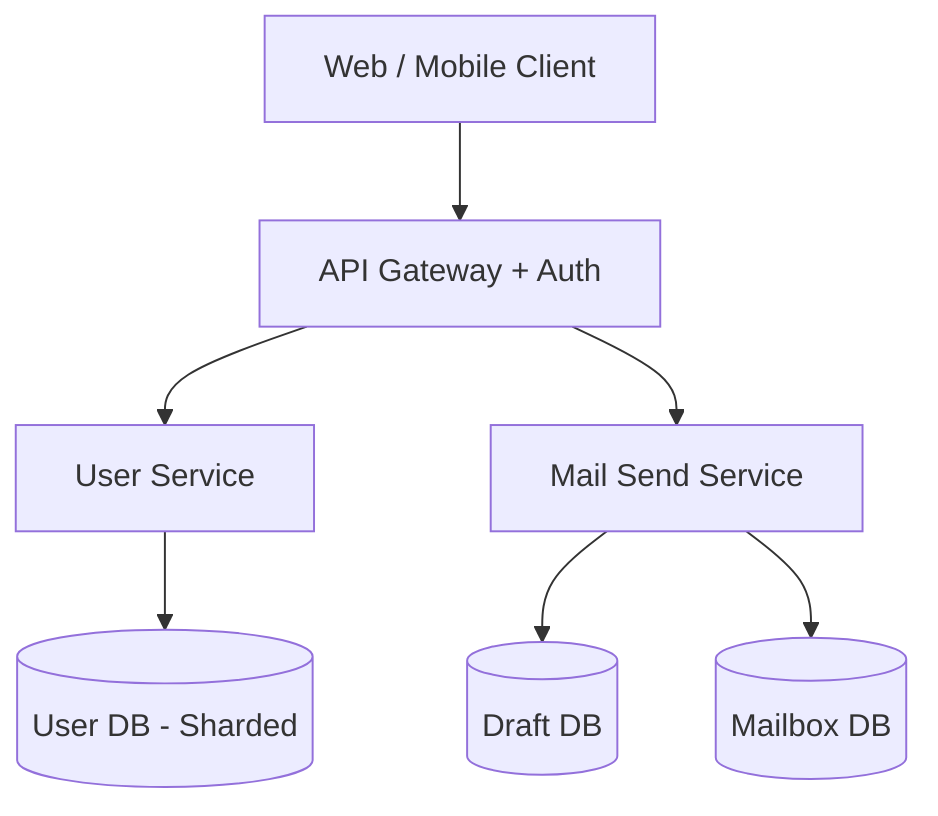
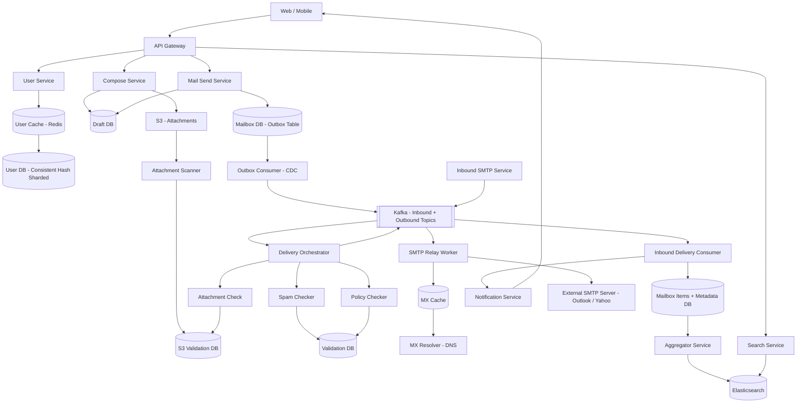

# Email Delivery System — Gmail / Outlook

> **Backend / Frontend Split: 90% Backend · 10% Frontend**
> The interesting engineering is entirely on the backend: transactional outbox pattern for zero email loss, SMTP protocol handshake for cross-domain delivery, async parallel validation pipeline, consistent hashing for sharding 1.5B user records, and routing logic to split internal vs external delivery. Frontend is a standard SPA — worth mentioning but not a deep focus.

---

## 1. Problem + Scope

Design an email delivery platform like Gmail. Users register with a unique email address, compose and send emails to one or multiple recipients (with CC/BCC and attachments), receive emails from other users across different domains, and search their mailbox by keyword.

**In scope:** User registration (unique email ID guarantee), compose + draft, send email (internal Gmail-to-Gmail + external cross-domain via SMTP), receive email from external domains, attachments, email threading, search.

**Out of scope:** Calendar integration, Google Meet, spam ML model training, email marketing bulk send, DKIM/SPF key management internals.

---

## 2. Assumptions & Scale

| Metric | Value |
|---|---|
| Daily Active Users | 1.5B |
| Emails sent per day | ~300B (200 emails/user/day at peak) |
| Peak email send rate | ~3.5M emails/sec |
| Avg email size (body + metadata) | 75KB |
| Avg attachment size | 2MB |
| Emails with attachments | ~20% |
| Storage per user/year | ~15GB |
| Total storage | 1.5B × 15GB = 22.5 exabytes |
| Search QPS | ~10M/sec |
| User DB lookup QPS | ~50M/sec (autocomplete + auth) |

**Write path math:**

3.5M emails/sec × 75KB body = ~260GB/sec of email body writes. This cannot land on a single DB. We need horizontally sharded storage for the mailbox, separated from metadata (for search optimization).

*These numbers drive: sharded user DB (consistent hashing), separate mailbox body vs metadata tables, Elasticsearch with pre-joined aggregator, S3 for attachments (not DB), Kafka decoupled delivery pipeline.*

---

## 3. Functional Requirements

- User registration with globally unique email ID
- Compose and auto-save email as draft (body + attachments)
- Send email to one or multiple recipients (To, CC, BCC)
- Receive email — both from Gmail users (internal) and other domains (Outlook, Yahoo) via SMTP
- View inbox, drafts, sent items folder structure
- Reply to email maintaining conversation thread
- Attach files (PDF, images, documents) — up to 25MB
- Search email by keyword (subject, body, sender)

---

## 4. Non-Functional Requirements

| Requirement | Target |
|---|---|
| Email send latency | < 2 seconds for internal delivery |
| Cross-domain delivery | < 30 seconds (SMTP handshake + DNS lookup) |
| Availability | 99.99% (email is business-critical) |
| Durability | Zero email loss — at-least-once delivery guaranteed |
| Search latency | < 500ms |
| Attachment upload | Non-blocking (async, pre-scanned before send) |

**Consistency Model — CAP Theorem applied per domain:**

| Domain | Model | Justification |
|---|---|---|
| User registration | Strong (CP) | No two users can share an email ID — uniqueness must be enforced globally |
| Email send/receive | Eventual (AP) | 1–2 second delay reaching recipient's inbox is acceptable |
| Draft autosave | Eventual | Losing a draft keystroke is acceptable; losing a sent email is not |
| Validation pipeline | Eventual | Async parallel validation — email queued until all pass |

> [!IMPORTANT]
> The consistency split is an interview favourite. Registration must be strongly consistent (unique email = primary key, DB constraint). Everything after that — send, receive, search — can be eventually consistent. This is why the write path goes through a queue, not a direct DB insert.

---

## 🧠 Mental Model

Email delivery has **four distinct flows** worth knowing cold:

1. **Registration flow** — User picks an email ID → system must guarantee no duplicate globally → consistent DB write with email as primary key
2. **Compose + Send flow** — User drafts email → attachments pre-uploaded to S3 → on Send: email saved to outbox table → Kafka consumer picks it up → validation pipeline (spam, malware, policy) → route to internal delivery or SMTP relay
3. **Internal delivery flow** — Recipient is a Gmail user → delivery consumer moves email from outbox table into recipient's mailbox items table → push notification
4. **External delivery flow** — Recipient is Outlook/Yahoo → SMTP relay worker does DNS/MX lookup → opens TCP connection to recipient's SMTP server → 15-step SMTP handshake → email delivered cross-domain

```
 User Composes Email
        │
        ▼
  Draft DB + S3 (attachments)
        │
   User clicks Send
        │
        ▼
  Mail Send Service
  (fetch from draft DB)
        │
        ▼
  Outbox Table (persisted first — never lose)
        │
  CDC / Outbox Consumer
        │
        ▼
     Kafka Broker
        │
  Delivery Orchestrator
  (spam + malware + policy — async parallel)
        │
   ┌────┴────────────┐
   ▼                 ▼
Inbound Topic    Outbound Topic
(Gmail→Gmail)    (Gmail→Outlook/Yahoo)
   │                 │
   ▼                 ▼
Delivery         SMTP Relay Worker
Consumer         (DNS/MX → TCP → handshake)
   │                 │
   ▼                 ▼
Mailbox DB      Recipient SMTP Server
```

**⚡ Core Design Principles**

| Path | Optimized For | Mechanism |
|---|---|---|
| Fast Path | Perceived send latency | Optimistic: email saved to outbox immediately, UI shows "Sent" — delivery happens async |
| Reliable Path | Zero email loss | Transactional outbox pattern: email persisted before Kafka publish — survives any service crash |

---

## 5. API Design

| Method | Path | Description |
|---|---|---|
| POST | `/api/v1/accounts` | Register new user. Email ID in body. DB enforces uniqueness via primary key constraint. |
| POST | `/api/v1/emails/draft` | Autosave draft. Called on every keystroke with debounce. Returns `draftId`. |
| POST | `/api/v1/emails/send` | Send email. Body contains only `draftId` + recipients (To/CC/BCC) — NOT the content. Mail Send Service fetches content from Draft DB using `draftId`. |
| GET | `/api/v1/emails/:emailId` | Fetch full email (body + attachment URLs). Attachment URLs are pre-signed S3 URLs, not raw bytes. |
| GET | `/api/v1/emails?folder=inbox&page=` | Paginated mailbox listing. Returns metadata only (subject, sender, preview snippet). |
| POST | `/api/v1/attachments` | Upload attachment. Returns `attachmentId`. Client passes this ID in the draft — not the file bytes. Two-step upload: client → S3 signed URL (direct), then registers `attachmentId` here. |
| GET | `/api/v1/search?q=&page=` | Full-text search across subject + body. Hits Elasticsearch. |

> [!TIP]
> **Interview tip on send API design:** The `POST /emails/send` body should contain `draftId`, not the full email payload. Say: "If we pass the entire email content + 25MB attachment in the send request, we get timeouts and heavy payload. We decouple: attachments are pre-uploaded to S3, body is pre-saved as draft. The send request is lightweight — just 'send draft X to these recipients.'"

---

## 6. End-to-End Flow

### 6.1 Send Email (Internal — Gmail to Gmail)

1. User clicks **Send**. Client calls `POST /emails/send` with `{ draftId, to: ["bob@gmail.com"], cc: [], bcc: [] }`.
2. Mail Send Service fetches full email content from Draft DB using `draftId` (body + S3 attachment references).
3. Mail Send Service writes the email to the **Outbox Table** in Mailbox DB. Status = `PENDING`. This write is the durability guarantee — if anything crashes after this, the email is not lost.
4. **Outbox Consumer** (CDC pipeline watching Outbox Table) detects the new row and publishes the event to **Kafka**.
5. **Delivery Orchestrator** consumes from Kafka. Fires async parallel validation:
   - Spam checker (content analysis)
   - Policy checker (enterprise rules)
   - Attachment check (reads pre-computed result from S3 Validation DB — scan already done at upload time)
6. All validations write their result to the **Validation DB** (one row per email, one column per check).
7. Once all validation columns are green: Orchestrator checks recipient domain. `bob@gmail.com` = internal → publishes to `inbound-send-request` Kafka topic.
8. **Delivery Consumer** picks up the inbound event. Copies email from Outbox Table → **Mailbox Items Table** for `bob@gmail.com`. Updates Outbox row status = `DELIVERED`.
9. Notification Service pushes "New email from alice@gmail.com" to Bob's connected WebSocket / push notification.



### 6.2 Send Email (External — Gmail to Outlook)

Steps 1–6 same as above. At step 7, recipient domain = `outlook.com` → Orchestrator publishes to `outbound-send-request` topic.

7. **SMTP Relay Worker** consumes from `outbound-send-request`.
8. DNS/MX lookup: queries MX resolver for `outlook.com` → gets list of Outlook SMTP server addresses with priority order. Result cached in **MX Cache** (TTL = 1 hour) — avoids DNS round-trip on every email.
9. SMTP Relay Worker opens TCP connection to Outlook SMTP server on **port 25**.
10. SMTP handshake:
    - Gmail sends `EHLO` → Outlook responds `250` + supported extensions
    - Gmail sends `MAIL FROM: alice@gmail.com` → Outlook responds `250 OK`
    - Gmail sends `RCPT TO: bob@outlook.com` → Outlook validates bob exists in its DB → `250 OK` (or `550 No such user`)
    - Gmail sends `DATA` → streams headers + body → Outlook responds `250 Message accepted`
    - Gmail sends `QUIT`
11. Outlook's own delivery system routes email to Bob's inbox.
12. SMTP Relay Worker receives `250` success → updates Outbox Table status = `DELIVERED_EXTERNAL`.

---

## 7. High-Level Architecture

### Simple Design



### Evolved Design (Full Pipeline)



---

## 8. Data Model

| Entity | Storage | Key Columns | Why this store |
|---|---|---|---|
| User | PostgreSQL (sharded) | `email_id` (PK), `user_id`, `password_hash`, `status`, `created_at` | ACID — `email_id` as PK enforces uniqueness. Sharded by consistent hashing on `email_id`. |
| Draft | PostgreSQL | `draft_id`, `user_id`, `to`, `cc`, `bcc`, `subject`, `body`, `attachment_ids[]`, `updated_at` | ACID — drafts are personal, low-write-volume. Simple relational structure. |
| Outbox Table | PostgreSQL | `message_id`, `sender_id`, `recipient_ids[]`, `draft_id`, `status` (PENDING/DELIVERED), `created_at` | Transactional outbox — must be in same DB as other mail writes for atomicity. CDC triggers Kafka. |
| Mailbox Items | Cassandra | `user_id` (partition key), `message_id` (clustering key, TIMEUUID), `sender_id`, `subject`, `body_ref`, `folder`, `is_read` | 3.5M writes/sec inbox delivery — Cassandra multi-master handles linear scale. Partition by `user_id` for fast inbox queries. |
| Mailbox Metadata | Cassandra | `message_id`, `sender_id`, `recipient_ids[]`, `subject`, `attachment_type`, `folder`, `timestamp` | Separated from body — search aggregator joins metadata + body ref. Avoids loading full email bodies for search index. |
| Validation DB | PostgreSQL | `message_id`, `spam_check` (bool), `policy_check` (bool), `attachment_check` (bool), `updated_at` | Small table, low volume — one row per in-flight email. Ephemeral (deleted post-delivery). |
| S3 Validation | Redis | `attachmentId → {status, scanned_at}` | Pre-computed at upload time. TTL = 7 days. Fast lookup at validation time — O(1). |
| MX Cache | Redis | `domain → [smtp_server_address, priority]` | DNS is slow (~100ms). MX records change rarely. TTL = 1 hour. |
| Attachments | S3 | Binary blob, referenced by `attachmentId` | Binary files don't belong in DB. Pre-signed URLs for secure client access. |
| Search Index | Elasticsearch | `message_id`, `sender`, `recipients`, `subject`, `body_snippet`, `timestamp` | Full-text search with inverted index. Pre-joined by Aggregator service — avoids runtime joins. |

> [!NOTE]
> **Key Insight:** Mailbox body and metadata are stored in separate Cassandra tables. Aggregator pre-joins them into Elasticsearch documents at write time — not at search time. Runtime joins at 10M search QPS = latency disaster.

---

## 9. Deep Dives

### 9.1 Transactional Outbox Pattern — Zero Email Loss

**Here's the problem we're solving:** When a user clicks Send, we need to both save the email to DB AND publish to Kafka. If we publish to Kafka first and the service crashes before DB write — email appears sent but is lost. If we write to DB first and crash before Kafka publish — email stuck in DB, never delivered. How do we guarantee at-least-once delivery?

**Naive solution:** Write to DB and publish to Kafka in sequence. Problem: not atomic — any crash between the two leaves the system in an inconsistent state.

**Chosen solution — Transactional Outbox Pattern:**
1. Mail Send Service writes the email to the **Outbox Table** in the same DB transaction as any other state update. DB write = durability guarantee.
2. A separate **Outbox Consumer** (Change Data Capture — watches the Outbox Table for new rows via Postgres logical replication or polling) publishes to Kafka.
3. The Outbox Consumer runs independently. If it crashes, it resumes from the last committed offset — Kafka publish is retried. Email is never lost.
4. Once delivered, Outbox Table row is updated to `DELIVERED` (or archived).

**Trade-off accepted:** Adds operational complexity (CDC pipeline, extra table). Delivery is at-least-once — if Outbox Consumer crashes mid-publish, the same email may be published twice. Handle with idempotency key (`message_id`) at the consumer side.

> [!NOTE]
> **Key Insight:** The Outbox Table is a correctness requirement, not a performance optimization. It makes DB write and Kafka publish atomic by using the DB as the source of truth, not Kafka.

---

### 9.2 Async Parallel Validation Pipeline

**Here's the problem we're solving:** Before delivering an email, we must run spam check, policy check, and attachment scan. If we run these sequentially: 3 services × 200ms each = 600ms minimum per email at 3.5M emails/sec = billions of seconds of latency stacked up. If one validation service goes down for 15 minutes, every in-flight email blocks forever.

**Naive solution:** Sequential synchronous calls from Orchestrator to each validation service. Service downtime = full pipeline stall.

**Chosen solution — Async parallel with Validation DB:**

1. Orchestrator consumes email from Kafka. Creates a row in **Validation DB** with all check columns set to `NULL` (not-yet-checked).
2. Orchestrator fires all validation services **simultaneously** (async, non-blocking).
3. Each service independently reads the email, runs its check, and updates its column in Validation DB (e.g., `spam_check = true`).
4. **Attachment check** is special — it reads from the pre-computed **S3 Validation DB** (scan was done at upload time, not send time). Scanning a 25MB PDF at send time = too slow.
5. Orchestrator polls Validation DB (or uses a trigger) until all columns are non-NULL. If all green → route to delivery topic. If any red → reject + notify sender.
6. If a validation service is down: that column stays NULL. After a timeout, email moves to **Delay Queue** and is retried later — pipeline never blocks permanently.

**Trade-off accepted:** Eventual consistency in validation — a service returning after a delay means email delivery is delayed, not blocked. This is acceptable; blocking is not.

> [!NOTE]
> **Key Insight:** Attachment scanning is pre-computed at upload time, not at send time. By send time, the result is already in S3 Validation DB — the check is O(1) Redis lookup. This is the only way to keep the validation pipeline fast.

---

### 9.3 SMTP Cross-Domain Delivery — 15-Step Handshake

**Here's the problem we're solving:** Gmail doesn't know how to deliver to Outlook. They're separate networks. How do two mail servers that have never met communicate?

**The answer is SMTP (Simple Mail Transfer Protocol)** — a standardized set of rules all mail servers follow. SMTP is not a service or a server; it is a protocol.

**SMTP Relay Worker flow:**

1. Consumes email from `outbound-send-request` Kafka topic.
2. **MX Lookup:** Queries DNS MX resolver for recipient domain (e.g., `outlook.com`). Gets list of Outlook SMTP server addresses with priority (lower number = higher priority). Caches result in **MX Cache** (Redis, TTL = 1 hour).
3. Opens **TCP connection** to Outlook SMTP server on **port 25**.
4. Outlook responds: `220 outlook.com ESMTP ready`
5. Gmail sends: `EHLO gmail.com` (identify ourselves)
6. Outlook responds: `250` + list of supported extensions (TLS, size limits, etc.)
7. Gmail sends: `MAIL FROM: alice@gmail.com` — Outlook logs the sender
8. Outlook responds: `250 OK`
9. Gmail sends: `RCPT TO: bob@outlook.com` — **critical validation step**
10. Outlook checks if `bob@outlook.com` exists in its own user DB. If not: `550 No such user here` — delivery fails, Gmail notifies Alice. If yes: `250 OK`
11. Gmail sends: `DATA` — signals start of email content
12. Outlook responds: `354 Start mail input`
13. Gmail streams: headers + body + attachment references
14. Gmail sends: `.` (single period = end of message)
15. Outlook responds: `250 Message accepted for delivery` — email is in Outlook's inbox pipeline
16. Gmail sends: `QUIT` → TCP connection closed
17. SMTP Relay Worker receives `250` → updates Outbox Table `status = DELIVERED_EXTERNAL`

**Trade-off accepted:** If Outlook's SMTP server is temporarily unreachable, SMTP Relay Worker retries with exponential backoff using the next-priority MX record. Email may be delayed minutes. This is expected behaviour and standard in SMTP.

> [!NOTE]
> **Key Insight:** SMTP is the lingua franca of email servers. Every mail server — Gmail, Outlook, Yahoo — speaks it. The MX cache is critical: DNS lookup adds ~100ms. At 3.5M cross-domain emails/sec, skipping DNS for cached domains saves ~350K CPU-seconds per second.

---

### 9.4 User Registration — Uniqueness at 1.5B Scale

**Here's the problem we're solving:** No two users can register with the same email ID. At 1.5B users, a single PostgreSQL instance can't hold all records or serve 50M autocomplete lookups/sec. How do we enforce global uniqueness while sharding?

**Naive solution:** Single DB, email as primary key. Enforces uniqueness trivially. Fails at scale — table too large, single point of failure.

**Chosen solution — Consistent Hashing + Primary Key constraint:**

1. Hash the email ID → modulo assigns it to a shard.
2. **Consistent hashing ring** (not simple modulo): adding a shard only redistributes a fraction of keys, not all of them. Simple modulo with 10 shards → if you add shard 11, all `hash % 10 ≠ hash % 11` entries must be remapped. Consistent hashing: only keys on the affected arc move.
3. Each shard has `email_id` as PRIMARY KEY — DB-level uniqueness enforced within the shard.
4. **Concurrent registration race condition:** Two users try `alice@gmail.com` simultaneously on the same shard. PRIMARY KEY constraint rejects the second insert. First commit wins — ACID guarantee.

**User Cache for autocomplete:**

- Redis cache per user: stores top 50 recently-contacted email IDs + all contact book entries. TTL = session duration.
- On typing in To/CC field: check user cache first. Cache hit → show autocomplete. Cache miss (unknown email) → no suggestion until user presses Enter → DB lookup only on explicit intent.
- Why cache? 50M QPS autocomplete hits against a sharded DB at 50M lookups/sec × 10ms per lookup = 500K seconds of compute/sec. Cache brings this to < 1ms.

> [!NOTE]
> **Key Insight:** Uniqueness is enforced at the shard level via PRIMARY KEY, not via a global lock or cross-shard lookup. Consistent hashing guarantees each email maps to exactly one shard. Two registrations for the same email ID always land on the same shard — DB constraint handles the race.

---

## 10. Bottlenecks & Scaling

**What breaks first at 10× scale:**

1. **Mailbox writes (35M emails/sec):**
   - Cassandra sharded by `user_id` handles this. Add nodes horizontally — Cassandra rebalances automatically.
   - Read path: `SELECT * FROM mailbox_items WHERE user_id = ? ORDER BY message_id DESC LIMIT 50` — single partition scan, fast.

2. **Search at 100M QPS:**
   - Elasticsearch cluster with data nodes sharded by `user_id`. Each user's emails live on the same shard — no scatter-gather.
   - Aggregator Service pre-joins body + metadata before indexing. Never join at query time.
   - Cache recent search results in Redis: `search:{userId}:{queryHash} → result` TTL = 5 min.

3. **SMTP Relay Worker saturation:**
   - Stateless workers — scale horizontally. Each worker handles its own TCP connection pool to external SMTP servers.
   - Per-domain connection pooling: opening a new TCP + TLS connection to Outlook per email is expensive. Maintain persistent connection pools per domain.
   - MX Cache hit rate target: > 99% (most emails go to top 10 domains — Gmail, Outlook, Yahoo, corporate domains).

4. **User DB autocomplete (50M QPS):**
   - Served from User Cache (Redis) for 95%+ of requests.
   - User DB only hit on cache miss (unknown email + Enter key). Read replicas absorb the remaining load.

---

## 11. Failure Scenarios

| Failure | Impact | Recovery |
|---|---|---|
| Mail Send Service crashes after Outbox write | No impact | Outbox Consumer retries Kafka publish. Email not lost — it's in the DB. |
| Kafka broker goes down | Email delivery stalls | Outbox Consumer retries with backoff. Emails queue up in Outbox Table. Kafka cluster is multi-broker — single broker failure doesn't down the cluster. |
| Validation service (spam/policy) goes down | Emails pile up in Delay Queue | After timeout, moved to Delay Queue, retried on recovery. Does not block all emails — only those awaiting that specific check. |
| SMTP Relay Worker can't reach Outlook | External email delayed | Exponential backoff retry. Try next-priority MX record. Industry-standard: retry for up to 4 days before bouncing. |
| Cassandra node fails | Partial inbox unavailability for affected partition range | Replication factor = 3. Reads/writes rerouted to replicas. No data loss. |
| Elasticsearch node fails | Search degraded | ES cluster rebalances shards to healthy nodes. Search may be slow during rebalance but never fully down. |
| S3 outage | Attachment upload fails | Client retries. Draft saves without attachment. Email can't be sent until attachment upload succeeds — enforced client-side. |

---

## 12. Trade-offs

### Cassandra vs PostgreSQL for Mailbox

| Dimension | Cassandra | PostgreSQL |
|---|---|---|
| Write throughput | Multi-master, linear scale (35M writes/sec) | Single primary ~100K writes/sec ceiling |
| Query flexibility | Limited — must know partition key | Full SQL, joins, complex queries |
| Consistency | Eventual (tunable quorum) | Strong ACID |
| Operational complexity | Higher — tuning compaction, GC | Lower |

**Chosen:** Cassandra — mailbox is write-heavy (every email = inbox write), append-only, always queried by `user_id`. No joins needed. PostgreSQL primary would be the first bottleneck at scale.

> [!NOTE]
> **Key Insight:** Mailbox is an append-only, partition-by-user workload. Cassandra's partition model is a perfect fit — every query is `WHERE user_id = ?` and every write is to a known partition. No cross-partition queries ever needed.

---

### Sync vs Async Delivery Pipeline

| Dimension | Sync (direct call) | Async (Kafka + Outbox) |
|---|---|---|
| Simplicity | Simple — no queue | Complex — CDC + Kafka + consumers |
| Durability | Email lost if service crashes | Zero loss — email persisted before Kafka |
| Validation | Blocks send response | Non-blocking — UI shows "Sent" immediately |
| Scale | Each service must scale with send rate | Each stage scales independently |

**Chosen:** Async — at 3.5M emails/sec, synchronous validation would require every validation service to handle 3.5M req/sec simultaneously or become the bottleneck. Async decouples each stage.

> [!NOTE]
> **Key Insight:** The queue is not a performance optimization — it's a correctness requirement. Without the Outbox Table + Kafka, a service crash between "email saved" and "email delivered" loses the email permanently.

---

### Pre-scan Attachments vs Scan at Send Time

| Dimension | Pre-scan at upload | Scan at send time |
|---|---|---|
| Send latency | Zero — result pre-computed | +200–500ms per attachment |
| Resource usage | Scanning at low-traffic upload time | Scanning during high-traffic send window |
| Stale scan risk | Attachment modified after scan? No — S3 is immutable | N/A |

**Chosen:** Pre-scan at upload — scanning a 25MB PDF at send time adds unacceptable latency to the hot send path. S3 objects are immutable — a scan result at upload time is always valid.

> [!NOTE]
> **Key Insight:** Move expensive work out of the critical path. Attachment scanning is O(file_size) — it belongs at upload time (low frequency, user is waiting anyway) not at send time (high frequency, user expects instant delivery).

---

## Interview Summary

### Key Decisions

| Decision | Problem it solves | Trade-off accepted |
|---|---|---|
| Transactional Outbox Pattern | Zero email loss on service crash | CDC pipeline complexity; at-least-once delivery (idempotency needed at consumer) |
| Cassandra for Mailbox Items | 35M writes/sec inbox delivery | Eventual consistency; limited query flexibility (no joins) |
| Pre-computed attachment scans | Keep send path fast | S3 Validation DB must be maintained; small storage overhead |
| Consistent hashing for User DB | Shard 1.5B users without remapping all keys on scale-out | More complex routing layer vs simple modulo sharding |
| Async parallel validation | Avoid blocking send on slow/down validation services | Eventual delivery (email delayed, not blocked, on service outage) |
| Separate mailbox body + metadata | Elasticsearch aggregator pre-joins at index time | Two tables to maintain; aggregator service adds complexity |

### Fast Path vs Reliable Path

```
FAST PATH (optimized for perceived send latency)
  User clicks Send
      │
      ▼
  Mail Send Service writes to Outbox Table (DB write = durable)
      │
  UI immediately shows "Message Sent" ← user feedback is instant
      │
  Outbox Consumer detects CDC event → Kafka (async, non-blocking)


RELIABLE PATH (optimized for zero email loss)
  If Kafka publish fails → Outbox Consumer retries from DB
  If Delivery Orchestrator crashes → resumes from Kafka offset
  If Validation service down → email moves to Delay Queue, retried on recovery
  If SMTP handshake fails → exponential backoff, try next MX record, retry up to 4 days
  Final state: email always reaches DELIVERED or BOUNCED — never silently lost
```

### Key Insights Checklist

- "The Outbox Table makes DB write and Kafka publish effectively atomic. DB is the source of truth, not Kafka. Email is never lost because the persistent record exists before any async work begins."
- "Attachment scanning is pre-computed at upload time. By send time, the result is a single Redis lookup. Scanning at send time would add 200–500ms to every email on the hot path."
- "Cassandra partition key is `user_id`. Every inbox query and every inbox write maps to a single partition. No scatter-gather, no joins. This is why Cassandra is the right choice here — not for its write speed generally, but for this specific access pattern."
- "SMTP is a protocol, not a server. Every mail server speaks it. The MX cache avoids DNS lookup per email — at 3.5M cross-domain emails/sec, that's the difference between functional and overloaded."
- "Registration must be strongly consistent — email ID as PRIMARY KEY in each DB shard. Consistent hashing guarantees two registrations for the same email ID always land on the same shard. DB constraint handles the race without a global lock."
- "The validation pipeline runs in parallel, not serially. Each service writes its result to Validation DB independently. The orchestrator checks when all columns are set — no service blocks another."
