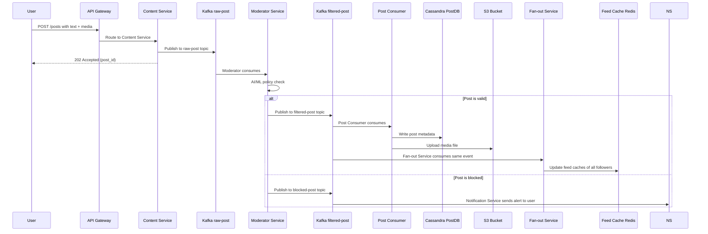
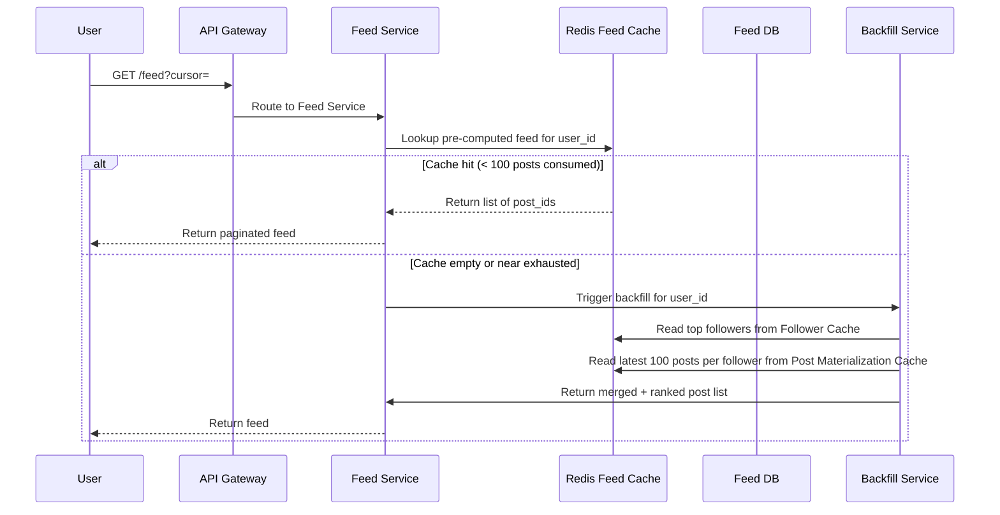
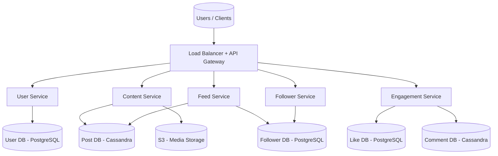
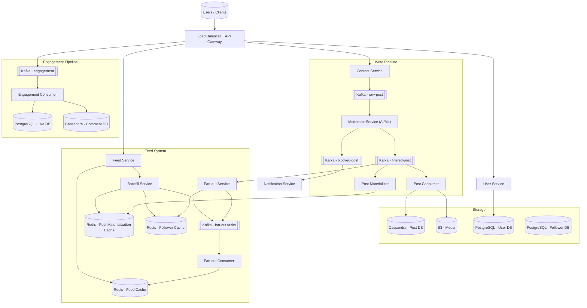

# Facebook — Social Media Platform System Design

> **Frontend / Backend Split:** 60% backend · 40% frontend
> Feed generation, fan-out, and content pipeline dominate the design. Frontend deserves equal depth for infinite scroll, virtual list, and optimistic engagement UI.

---

## 🧠 Mental Model

Facebook is fundamentally a **read-heavy, write-amplified** system. Every post write triggers thousands of feed updates (fan-out). Every page load must return a pre-computed, personalised feed in under 200ms — even for users with 10,000 friends. There are three core flows:

1. **Write path** — Post created → Kafka buffer → Content moderation → Post DB + S3 → Fan-out updates all follower feeds
2. **Read path** — User opens app → Feed Cache hit (Redis, pre-computed) → Instant response; backfill kicks in before the user scrolls to the bottom
3. **Engagement path** — Like/comment → Kafka buffer → Engagement consumer → Cassandra (comments) + PostgreSQL (likes)

```
                     WRITE PATH                                 READ PATH
 User ──POST /post──▶ Content Svc ──▶ Kafka(raw-post) ──▶ Moderator
                                                              │
                                             ┌──── filtered-post ────┐
                                             ▼                       ▼
                                       Post Consumer           Fan-out Svc
                                       (Cassandra+S3)          │
                                                               ▼
                                                     Kafka(fanout-tasks)
                                                               │
                                                               ▼
 User ──GET /feed──▶ Feed Svc ──▶ Redis(feed-cache) ◀── Fan-out Consumer
```

**⚡ Core Design Principles**

| Path | Optimized For | Mechanism |
|---|---|---|
| Fast Path (feed read) | Latency < 200ms | Pre-computed feed in Redis; serve from cache, skip DB entirely |
| Reliable Path (post write) | Durability + moderation | Kafka buffer → Moderator → Post Consumer → guaranteed write to Cassandra |
| Celebrity Path | Write efficiency | Skip push fan-out; backfill pulls celebrity posts on-demand via Redis materialization cache |

---

## 1. Problem + Scope

Design a social media platform like Facebook at scale (500M DAU). Users can sign up, create and share posts (text, image, video), follow each other, like and comment on posts, and view a personalised feed of content from people they follow.

**In Scope:** User onboarding, post creation (text + media), follow/unfollow, like/comment, personalised feed generation.

**Out of Scope:** Stories, Messenger/chat (separate system), video encoding pipeline (follows OTT platform design), friend-of-friend suggestions, ads ranking.

---

## 2. Assumptions & Scale

| Metric | Value |
|---|---|
| Daily Active Users (DAU) | 500M |
| Avg posts per user per day | 1 (40% include media) |
| Post write QPS (baseline) | ~5,800/sec |
| Post write QPS (peak, 10×) | ~58,000/sec |
| Feed reads per user per day | 5 sessions |
| Feed read QPS (baseline) | ~29,000/sec |
| Likes + comments per user per day | 10 interactions |
| Engagement write QPS (peak) | ~57,000/sec |
| Avg text post size | 1 KB |
| Avg media file size | 1 MB (image), 100 MB (video) |
| Text storage per day | 500 GB |
| Media storage per day | ~200 TB |
| Feed cache (Redis, post IDs only at 8B each) | 500M users × 100 posts × 8B ≈ **400 GB** |
| Post materialization cache (100 posts/user) | 500M × 100 × 8B ≈ **400 GB** |

**Post fan-out write amplification:**
Average user has 200 followers. 500M posts/day × 200 = 100B feed update writes/day = **~1.16M feed writes/sec peak** — this is the single hardest problem to solve.

> These numbers drive the following decisions: Cassandra for write-heavy post/comment storage, Redis for feed cache (memory-only, no disk I/O), Kafka as fan-out buffer to absorb burst writes, and a hybrid push/pull fan-out to handle celebrities.

---

## 3. Functional Requirements

- Users can register, log in, and manage their profile
- Users can create posts (text, image, video)
- Users can follow and unfollow other users
- Users can like and comment on posts
- Users see a personalised feed of posts from people they follow
- Feed supports infinite scroll (pagination via cursor)
- Users are notified when their post is blocked by content moderation

---

## 4. Non-Functional Requirements

| Requirement | Target |
|---|---|
| Feed load latency | < 200ms (p99) |
| Post upload latency | < 500ms for text/image |
| Availability | 99.99% (AP system) |
| Consistency | Eventual — new posts may take seconds to minutes to appear in all feeds |
| Durability | Zero post loss after write acknowledgement |
| Read/Write ratio | ~5:1 (read-heavy but write fan-out amplifies writes 200×) |

**Consistency Model:**

| Domain | Model | Reason |
|---|---|---|
| Feed generation | Eventual | It's OK if a new post appears in your feed after 1–2 minutes |
| Post storage | Strong (within shard) | A post must not be lost or double-written |
| Like counts | Eventual | Approximate counts (±10) are acceptable |
| Comment ordering | Eventual + client-side seq | Comments within a post should appear in order |
| User authentication | Strong | Auth tokens must be consistent |

---

## 🧠 Mental Model *(see above)*

---

## 5. API Design

| Method | Path | Description |
|---|---|---|
| POST | `/api/v1/auth/register` | Register new user (returns JWT) |
| POST | `/api/v1/auth/login` | Login, returns JWT |
| GET | `/api/v1/users/:userId` | Get user profile metadata |
| PUT | `/api/v1/users/:userId` | Update profile metadata |
| POST | `/api/v1/posts` | Create a post (text/media); returns post_id |
| GET | `/api/v1/posts/:postId` | Get post metadata + media URL |
| DELETE | `/api/v1/posts/:postId` | Delete a post |
| GET | `/api/v1/feed?cursor=&limit=50` | Get personalised feed (cursor-based pagination) |
| GET | `/api/v1/users/:userId/posts?cursor=` | Get all posts by a user |
| POST | `/api/v1/posts/:postId/like` | Like a post |
| DELETE | `/api/v1/posts/:postId/like` | Unlike a post |
| POST | `/api/v1/posts/:postId/comments` | Add a comment |
| GET | `/api/v1/posts/:postId/comments?cursor=` | Get comments (paginated) |
| POST | `/api/v1/follow/:targetUserId` | Follow a user |
| DELETE | `/api/v1/follow/:targetUserId` | Unfollow a user |

> [!NOTE]
> **Key Insight:** Feed API uses cursor-based pagination, not offset. Offset = re-scan from top on every page. Cursor = O(1) resume from last seen post. Critical at 500M users.

---

## 6. End-to-End Flow

### 6.1 — Post Creation (Write Path)



### 6.2 — Feed Read (Fast Path)



---

## 7. High-Level Architecture

### Simple Design



### Evolved Design (Production Scale)



---

## 8. Data Model

| Entity | Storage | Key Columns | Why this store |
|---|---|---|---|
| User | PostgreSQL | user_id, username, email, password_hash, phone, created_at | Flat relational metadata; ACID for auth correctness |
| Post | Cassandra | post_id (UUID), user_id, post_type, content_text, media_url, thumbnail_url, like_count, comment_count, created_at | Write-heavy (58K/sec peak); Cassandra multi-master handles it; wide rows for timeline queries |
| Follower | PostgreSQL | follow_id, follower_id, following_id, status (pending/active), created_at | Simple relational; JOIN-free; use Graph DB only if friend-of-friend recommendations required |
| Comment | Cassandra | comment_id (TIMEUUID), post_id (partition key), user_id, content, like_count, created_at | Write-heavy; TIMEUUID clustering gives time-ordered comments per post automatically |
| Like | PostgreSQL | like_id, post_id, comment_id (nullable), user_id, reaction_type, created_at | Lower volume than comments; relational for dedup checks |
| Feed Cache | Redis | user_id → sorted set of post_ids (score = timestamp) | Ephemeral pre-computed feed; TTL = 24h; max 100 entries per user |
| Post Materialization Cache | Redis | user_id → sorted set of post_ids (latest 100) | Backfill source — avoids DB scan on scroll exhaustion |
| Follower Cache | Redis | user_id → list of top_follower_ids (ML-ranked) | Limits fan-out to relevant followers; reduces 10K friends to 200 active connections |

> [!NOTE]
> **Key Insight:** Feed Cache stores post_ids only (8 bytes each), not full post objects. Full hydration happens in a single batch `MGET` from Post DB or a separate post cache. This keeps Redis memory at ~400 GB instead of 40 TB.

---

## 9. Deep Dives

### 9.1 — Feed Generation: The Fan-out Problem

**Here's the problem we're solving:** A user has 10,000 friends. When they open the app, we need to return 50 relevant posts in under 200ms. Computing this at runtime requires fetching all 10,000 friend IDs, querying posts per friend, joining and ranking — easily 5–10 seconds. That's a non-starter.

**Naive solution — pull at read time:**
```
GET /feed → fetch follower list (10K IDs) → for each friend fetch posts → inner join + rank → return
```
Fails at scale: DB fan-in across 10K queries per feed load. Even with caching, query latency compounds.

**Chosen solution — pre-computed fan-out (push model for regular users):**

When a user posts:
1. Fan-out Service reads the `filtered-post` Kafka topic
2. Fetches the user's follower list from **Follower Cache** (Redis, top N followers ranked by interaction)
3. Publishes `(follower_id, post_id)` pairs to Kafka `fan-out-tasks`
4. Fan-out Consumer reads tasks and writes `post_id` into each follower's **Feed Cache** (Redis sorted set, score = timestamp)

When the user opens the app:
1. Feed Service reads from Redis Feed Cache — O(1) lookup
2. Returns 50 post IDs → batch hydrate from Post Cache or Cassandra
3. Feed is returned in < 200ms

**Trade-off accepted:** Feed writes are amplified (~200× per post for average user). At 5,800 posts/sec × 200 followers = 1.16M feed writes/sec. This is acceptable because Kafka absorbs burst and Fan-out Consumer is horizontally scalable.

> [!NOTE]
> **Key Insight:** The pre-computation cost is paid at write time (fan-out), not read time (feed load). This is the right trade-off: writes are async and can be delayed by seconds; feed reads must be instant.

---

### 9.2 — Celebrity Fan-out Problem (Pull Model)

**Here's the problem we're solving:** A celebrity with 10M followers posts once. Push fan-out = 10M feed write operations in seconds. Redis gets hammered. Fan-out Consumer queues spike. The system destabilises.

**Naive solution — same push model for everyone:**
Fan-out Service tries to enqueue 10M `(follower_id, post_id)` pairs. Kafka lag spikes. Small users' feeds get delayed. Cascading failure.

**Chosen solution — hybrid fan-out with celebrity threshold:**

- If the posting user has **< 1,000 followers** → push model (fan-out writes to follower feeds immediately)
- If the posting user has **≥ 1,000 followers** → pull model (skip fan-out; post goes to **Post Materialization Cache** only)

At feed read time, if a user follows celebrities:
1. Backfill Service checks Follower Cache for celebrity followees
2. Pulls their latest posts from **Post Materialization Cache** (Redis, 100 posts per user)
3. Merges with regular feed from Feed Cache
4. Returns merged, ranked feed

**Trade-off accepted:** Celebrity posts may appear slightly delayed (seconds vs milliseconds) in a follower's feed. Acceptable for eventual consistency SLA.

> [!NOTE]
> **Key Insight:** Fan-out strategy is a function of follower count, not content type. The threshold (1,000) is tuneable based on observed write amplification at scale.

---

### 9.3 — Content Moderation Pipeline

**Here's the problem we're solving:** At 58K posts/sec peak, synchronous content moderation would block the write path. A 500ms AI/ML model call per post × 58K posts/sec = 29,000 concurrent model calls. Synchronous moderation is impossible at this scale.

**Naive solution — synchronous moderation in Content Service:**
```
POST /post → Content Service → call Moderator API → wait 500ms → write to DB → 202 Accepted
```
Fails: Moderator API becomes a bottleneck. Post latency grows to 500ms+. Any moderation service outage = complete post creation failure.

**Chosen solution — async Kafka-based moderation pipeline:**

1. Content Service writes raw post to Kafka `raw-post` topic immediately → returns `202 Accepted` with `post_id` (< 50ms)
2. Moderator Service consumes from `raw-post` asynchronously, runs AI/ML classifier
3. Routes to `filtered-post` (valid) or `blocked-post` (policy violation) topic
4. Post Consumer writes valid posts to Cassandra + S3
5. Notification Service alerts user on blocked posts

**Trade-off accepted:** Post is not immediately visible after `202 Accepted` — it takes a few seconds to pass moderation and appear in feeds. Users see a local optimistic preview in the client UI. This is acceptable given eventual consistency SLA.

> [!NOTE]
> **Key Insight:** The Kafka buffer is a correctness requirement, not a performance optimisation. Without it, a Moderator outage loses posts entirely. With Kafka, posts are durable in the log and moderation resumes when the service recovers.

---

## 10. Bottlenecks & Scaling

| Bottleneck | Breaks at | Solution |
|---|---|---|
| Feed Cache memory | 500M users × 100 posts | Store post IDs only (8B each = 400GB); shard Redis by user_id consistent hash |
| Cassandra Post DB write throughput | 58K posts/sec | Horizontal scaling; partition by post_id; replication factor 3 |
| Fan-out write amplification | Celebrity with 10M followers | Hybrid push/pull; celebrity threshold = 1,000 followers |
| Kafka fan-out-tasks lag | Viral post spike | Auto-scale Fan-out Consumer group; 100+ partitions on fan-out topic |
| Follower DB read fan-out | 10K friends per user lookup | Follower Cache (Redis) pre-computes top followers per user; full Follower DB only queried on cache miss |

**Sharding Strategy:**
- Post DB (Cassandra): partitioned by `post_id` UUID — natural distribution
- Feed Cache (Redis): sharded by `user_id % N_shards` consistent hashing
- User DB (PostgreSQL): sharded by `user_id` range; read replicas for profile reads

**CDN:**
- All media (images, video thumbnails) served via CDN
- Signed S3 URLs with 1-hour TTL for private media
- Profile pictures and post thumbnails cached at edge — 90%+ cache hit rate expected

---

## 11. Failure Scenarios

| Failure | Impact | Recovery |
|---|---|---|
| Cassandra Post DB node fails | Write latency spike; some reads temporarily degrade | Replication factor 3; automatic failover to replica; Kafka retains unwritten posts until service resumes |
| Redis Feed Cache node fails | Users served stale or empty feed | Backfill Service triggers on cache miss; regenerates feed from Post Materialization Cache |
| Kafka broker failure | Posts buffered in Content Service; fan-out delayed | Kafka replication across 3 brokers; ISR (in-sync replicas) ensures no message loss |
| Fan-out Consumer crash mid-write | Some follower feeds not updated | At-least-once Kafka delivery; Fan-out Consumer resumes from last committed offset; idempotent writes to Redis sorted set |
| Moderator Service outage | Posts pile up in raw-post topic; nothing passes moderation | Kafka retains unprocessed events; Moderator Service catches up on restart; users see "Post is being reviewed" in UI |
| S3 outage | Media upload fails | Content Service returns error to user; text post metadata saved; user prompted to retry media upload separately |
| API Gateway overload | All services unreachable | Rate limiting at gateway; circuit breaker pattern; horizontal scale-out behind LB |

---

## 12. Trade-offs

### Fan-out Strategy: Push vs Pull

| Dimension | Push (fan-out on write) | Pull (fan-out on read) |
|---|---|---|
| Feed load latency | < 200ms (pre-computed) | 2–10 seconds (computed at runtime) |
| Write amplification | High (200× per post) | None at write time |
| Celebrity problem | Catastrophic (10M writes) | Efficient (1 read) |
| Consistency | Slight delay (seconds) | Always fresh |

**Chosen:** Hybrid — push for regular users (< 1,000 followers), pull for celebrities.
`> [!NOTE]` **Key Insight:** There is no single correct fan-out strategy. The correct answer is always "it depends on follower count." Saying this in an interview immediately signals senior-level thinking.

---

### Post Database: Cassandra vs PostgreSQL

| Dimension | Cassandra | PostgreSQL |
|---|---|---|
| Write throughput | 1M+/sec (multi-master) | ~50–100K/sec (single primary) |
| Read patterns | Excellent for partition key lookups | Excellent for joins and aggregations |
| Schema flexibility | Wide rows, good for time-series posts | Rigid schema |
| Consistency | Eventual (tunable quorum) | Strong (ACID) |
| Operational cost | Complex tuning | Simpler operations |

**Chosen:** Cassandra for Post DB and Comment DB — write-heavy workloads dominate. PostgreSQL for User DB and Like DB where relational consistency matters.

> [!NOTE]
> **Key Insight:** Cassandra is not always "more scalable." It's optimised for write-heavy workloads with known partition key access patterns. For ad-hoc queries or joins, PostgreSQL wins. Use the right tool per access pattern.

---

### Feed Cache Invalidation: TTL vs Event-Driven

| Dimension | TTL-based expiry | Event-driven invalidation |
|---|---|---|
| Stale data | Possible (up to TTL window) | Minimal |
| Complexity | Simple | Complex (need to track all cache keys per user) |
| Cache stampede risk | On TTL expiry for popular users | On post deletion / edit |
| Write cost | None | Extra write per post per follower |

**Chosen:** TTL (24h) + event-driven for critical cases (post deletion). TTL is sufficient for eventual consistency SLA. Event-driven invalidation only for deleted/edited posts to avoid serving removed content.

> [!NOTE]
> **Key Insight:** Cache invalidation is only worth the complexity when serving stale data has real user impact. Serving a post 2 minutes late = fine. Serving a deleted post = unacceptable. Invalidate selectively.

---

### Content Moderation: Synchronous vs Asynchronous

| Dimension | Synchronous | Asynchronous (Kafka) |
|---|---|---|
| Post upload latency | 500ms+ | < 50ms (202 Accepted immediately) |
| Failure isolation | Moderator outage = post creation fails | Moderator outage = post queued, not lost |
| User experience | Post visible immediately or blocked | Post visible after 2–5 seconds |
| Complexity | Simple | Kafka + moderator + consumer pipeline |

**Chosen:** Asynchronous Kafka pipeline. At 58K posts/sec, synchronous moderation is architecturally infeasible. Optimistic local preview in the client hides the delay.

> [!NOTE]
> **Key Insight:** The Kafka buffer turns a synchronous dependency into a durable contract. The Moderator Service can be deployed, updated, or restarted without dropping a single post.

---

## Frontend Notes (40% of design)

| Component | Pattern | Why it matters in an interview |
|---|---|---|
| Infinite scroll feed | Intersection Observer + cursor-based pagination | Offset pagination re-scans from top; cursor resumes exactly where user stopped |
| Virtual list | Virtualise DOM (only render visible posts) | Feed with 500 pre-loaded posts = 500 DOM nodes = memory leak + jank at 60fps |
| Optimistic engagement | Like/unlike updates local count before server confirms | Reduces perceived latency; revert on server error |
| Optimistic post creation | Show post locally with pending state before moderation confirms | Async pipeline means the server can't confirm immediately |
| Feed cache on client | Store last 100 posts in IndexedDB | Instant re-render on revisit; background refresh with newer posts |
| Media lazy loading | IntersectionObserver triggers image load | Off-screen images should not be fetched; critical for mobile data |

---

## Interview Summary

### Key Decisions

| Decision | Problem it solves | Trade-off accepted |
|---|---|---|
| Kafka for post write pipeline | Async moderation without blocking write path | Post not immediately visible (eventual, 2–5 sec delay) |
| Redis Feed Cache (pre-computed) | Feed load in < 200ms for 500M users | Write amplification 200× per post; requires Fan-out infrastructure |
| Hybrid fan-out (push for regular, pull for celebrities) | Avoid 10M write-storm on celebrity post | Celebrity posts may appear seconds later than regular-user posts |
| Cassandra for posts + comments | 58K writes/sec post ingestion; 57K engagement writes/sec | No ACID guarantees; eventual consistency for like counts |
| Post Materialization Cache (Redis, 100 posts/user) | Backfill at scroll exhaustion without DB scan | Redis memory cost ~400GB; must be kept warm by Post Materializer Service |

### Fast Path vs Reliable Path

```
FAST PATH (feed read)
User → API Gateway → Feed Service → Redis Feed Cache → return post_ids → hydrate → 200ms ✓

RELIABLE PATH (post write)
User → API Gateway → Content Service → Kafka(raw-post) [durable] → Moderator Service
→ Kafka(filtered-post) [durable] → Post Consumer → Cassandra [replicated, RF=3] ✓
```

### Key Insights Checklist *(say these out loud in the interview)*

- "Feed is pre-computed at write time, not computed at read time. Without this, a 10K-friend user's feed load would take 10 seconds."
- "Fan-out strategy is a function of follower count. Regular users get push fan-out; celebrities get pull. The threshold is tuneable — this is a business decision, not a technical one."
- "The Kafka buffer between Content Service and Moderator is a correctness requirement. Without it, a Moderator outage drops posts permanently. With it, posts queue safely and are processed on recovery."
- "Feed Cache stores post_ids only — 8 bytes each. Full hydration is a batch lookup. This keeps Redis at 400GB instead of 40TB."
- "Cassandra for posts and comments because they're write-heavy with known partition key access patterns. PostgreSQL for users and likes because they need relational consistency."
- "Celebrity fan-out is the hardest scaling problem in social media. Any system that applies push fan-out uniformly will fail on the first viral post."
