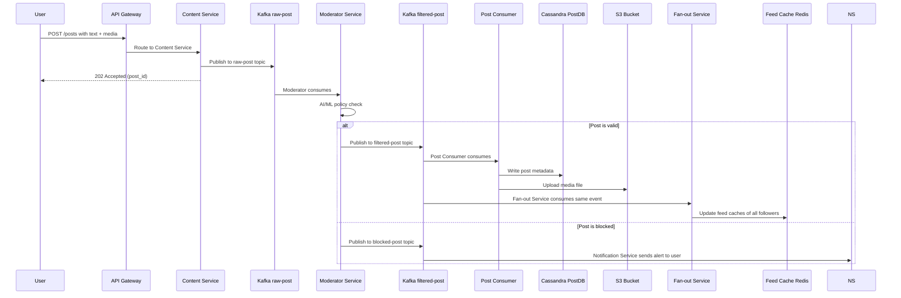
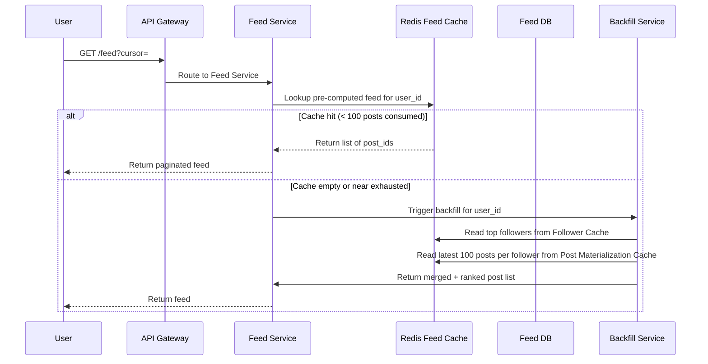
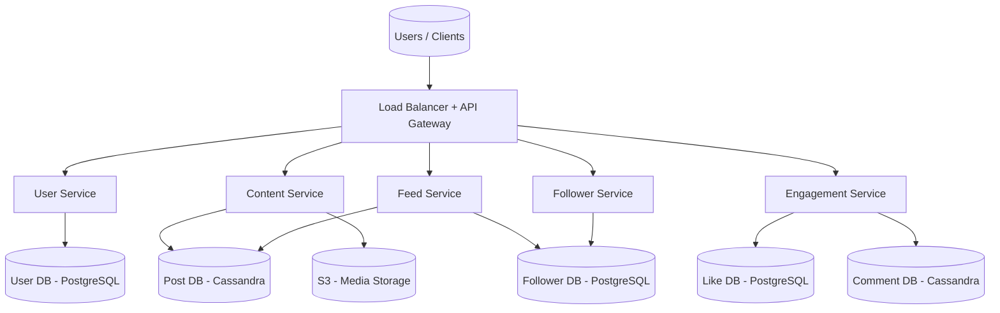
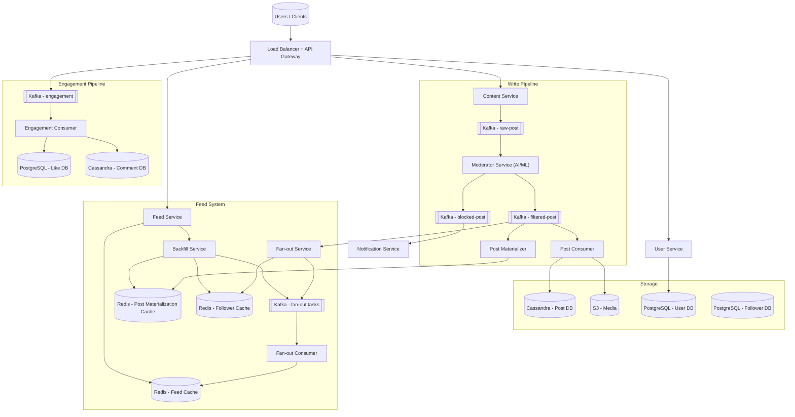

# Facebook — Social Media Platform System Design

> **Frontend / Backend Split:** 60% backend · 40% frontend
> Feed generation, fan-out, and content pipeline dominate the design. Frontend deserves equal depth for infinite scroll, virtual list, and optimistic engagement UI.

---

## 🧠 Mental Model

Facebook is fundamentally a **read-heavy, write-amplified** system. Every post write triggers thousands of feed updates (fan-out). Every page load must return a pre-computed, personalised feed in under 200ms — even for users with 10,000 friends. There are three core flows:

1. **Write path** — Post created → Kafka buffer → Content moderation → Post DB + S3 → Fan-out updates all follower feeds
2. **Read path** — User opens app → Feed Cache hit (Redis, pre-computed) → Instant response; backfill kicks in before the user scrolls to the bottom
3. **Engagement path** — Like/comment → Kafka buffer → Engagement consumer → Cassandra (comments) + PostgreSQL (likes)

```
                     WRITE PATH                                 READ PATH
 User ──POST /post──▶ Content Svc ──▶ Kafka(raw-post) ──▶ Moderator
                                                              │
                                             ┌──── filtered-post ────┐
                                             ▼                       ▼
                                       Post Consumer           Fan-out Svc
                                       (Cassandra+S3)          │
                                                               ▼
                                                     Kafka(fanout-tasks)
                                                               │
                                                               ▼
 User ──GET /feed──▶ Feed Svc ──▶ Redis(feed-cache) ◀── Fan-out Consumer
```

**⚡ Core Design Principles**

| Path | Optimized For | Mechanism |
|---|---|---|
| Fast Path (feed read) | Latency < 200ms | Pre-computed feed in Redis; serve from cache, skip DB entirely |
| Reliable Path (post write) | Durability + moderation | Kafka buffer → Moderator → Post Consumer → guaranteed write to Cassandra |
| Celebrity Path | Write efficiency | Skip push fan-out; backfill pulls celebrity posts on-demand via Redis materialization cache |

---

## 1. Problem + Scope

Design a social media platform like Facebook at scale (500M DAU). Users can sign up, create and share posts (text, image, video), follow each other, like and comment on posts, and view a personalised feed of content from people they follow.

**In Scope:** User onboarding, post creation (text + media), follow/unfollow, like/comment, personalised feed generation.

**Out of Scope:** Stories, Messenger/chat (separate system), video encoding pipeline (follows OTT platform design), friend-of-friend suggestions, ads ranking.

---

## 2. Assumptions & Scale

| Metric | Value |
|---|---|
| Daily Active Users (DAU) | 500M |
| Avg posts per user per day | 1 (40% include media) |
| Post write QPS (baseline) | ~5,800/sec |
| Post write QPS (peak, 10×) | ~58,000/sec |
| Feed reads per user per day | 5 sessions |
| Feed read QPS (baseline) | ~29,000/sec |
| Likes + comments per user per day | 10 interactions |
| Engagement write QPS (peak) | ~57,000/sec |
| Avg text post size | 1 KB |
| Avg media file size | 1 MB (image), 100 MB (video) |
| Text storage per day | 500 GB |
| Media storage per day | ~200 TB |
| Feed cache (Redis, post IDs only at 8B each) | 500M users × 100 posts × 8B ≈ **400 GB** |
| Post materialization cache (100 posts/user) | 500M × 100 × 8B ≈ **400 GB** |

**Post fan-out write amplification:**
Average user has 200 followers. 500M posts/day × 200 = 100B feed update writes/day = **~1.16M feed writes/sec peak** — this is the single hardest problem to solve.

> These numbers drive the following decisions: Cassandra for write-heavy post/comment storage, Redis for feed cache (memory-only, no disk I/O), Kafka as fan-out buffer to absorb burst writes, and a hybrid push/pull fan-out to handle celebrities.

---

## 3. Functional Requirements

- Users can register, log in, and manage their profile
- Users can create posts (text, image, video)
- Users can follow and unfollow other users
- Users can like and comment on posts
- Users see a personalised feed of posts from people they follow
- Feed supports infinite scroll (pagination via cursor)
- Users are notified when their post is blocked by content moderation

---

## 4. Non-Functional Requirements

| Requirement | Target |
|---|---|
| Feed load latency | < 200ms (p99) |
| Post upload latency | < 500ms for text/image |
| Availability | 99.99% (AP system) |
| Consistency | Eventual — new posts may take seconds to minutes to appear in all feeds |
| Durability | Zero post loss after write acknowledgement |
| Read/Write ratio | ~5:1 (read-heavy but write fan-out amplifies writes 200×) |

**Consistency Model:**

| Domain | Model | Reason |
|---|---|---|
| Feed generation | Eventual | It's OK if a new post appears in your feed after 1–2 minutes |
| Post storage | Strong (within shard) | A post must not be lost or double-written |
| Like counts | Eventual | Approximate counts (±10) are acceptable |
| Comment ordering | Eventual + client-side seq | Comments within a post should appear in order |
| User authentication | Strong | Auth tokens must be consistent |

---

## 🧠 Mental Model *(see above)*

---

## 5. API Design

| Method | Path | Description |
|---|---|---|
| POST | `/api/v1/auth/register` | Register new user (returns JWT) |
| POST | `/api/v1/auth/login` | Login, returns JWT |
| GET | `/api/v1/users/:userId` | Get user profile metadata |
| PUT | `/api/v1/users/:userId` | Update profile metadata |
| POST | `/api/v1/posts` | Create a post (text/media); returns post_id |
| GET | `/api/v1/posts/:postId` | Get post metadata + media URL |
| DELETE | `/api/v1/posts/:postId` | Delete a post |
| GET | `/api/v1/feed?cursor=&limit=50` | Get personalised feed (cursor-based pagination) |
| GET | `/api/v1/users/:userId/posts?cursor=` | Get all posts by a user |
| POST | `/api/v1/posts/:postId/like` | Like a post |
| DELETE | `/api/v1/posts/:postId/like` | Unlike a post |
| POST | `/api/v1/posts/:postId/comments` | Add a comment |
| GET | `/api/v1/posts/:postId/comments?cursor=` | Get comments (paginated) |
| POST | `/api/v1/follow/:targetUserId` | Follow a user |
| DELETE | `/api/v1/follow/:targetUserId` | Unfollow a user |

> [!NOTE]
> **Key Insight:** Feed API uses cursor-based pagination, not offset. Offset = re-scan from top on every page. Cursor = O(1) resume from last seen post. Critical at 500M users.

---

## 6. End-to-End Flow

> [!IMPORTANT]
> **Facebook is a queue-first, event-driven system across three independent Kafka pipelines:**
>
> | Pipeline | Kafka Topic | Why async |
> |---|---|---|
> | Post write + moderation | `raw-post` → `filtered-post` → `blocked-post` | Moderation is 500ms AI/ML — cannot block the write response |
> | Feed generation (fan-out) | `fan-out-tasks` | 1.16M feed writes/sec — must be buffered and consumed independently |
> | Notifications + analytics | `notifications`, `analytics-events` | Decoupled from delivery; analytics must never slow down the user path |
>
> **Retry:** exponential backoff on consumer failure; Fan-out Consumer resumes from Kafka offset.
> **Idempotency:** `post_id` + `follower_id` dedup in Redis sorted set prevents double-insertion to feeds.
> **Delivery guarantee:** at-least-once (Kafka default) + idempotent consumers = effectively-once.

---

### 6.1 — Complete End-to-End: Post → Feed (say this out loud in the interview)

**Write path — user creates a post:**

```
1. User clicks Post
   → POST /posts {text, mediaId, post_id (client-generated)}
   → API Gateway authenticates JWT, routes to Content Service

2. Content Service publishes to Kafka raw-post topic immediately
   → Returns 202 Accepted + post_id in < 50ms
   → I chose async here because synchronous moderation at 58K posts/sec
     would require 29,000 concurrent AI/ML calls — architecturally infeasible

3. Moderator Service consumes raw-post
   → Runs AI/ML classifier (image hash check + text policy)
   → Valid → publishes to filtered-post topic
   → Blocked → publishes to blocked-post → Notification Service alerts user

4. Post Consumer consumes filtered-post
   → Writes metadata to Cassandra PostDB (partition = post_id)
   → Uploads media bytes to S3 (if media post)
   → I store metadata and media separately: Cassandra for structured queries,
     S3 for binary blobs — DB is wrong for 100MB video files

5. Fan-out Service consumes the same filtered-post event (parallel to step 4)
   → Checks poster's follower count
   → If < 1,000 followers (regular user): PUSH model — reads Follower Cache,
     enqueues (follower_id, post_id) pairs to Kafka fan-out-tasks
   → If ≥ 1,000 followers (celebrity): PULL model — writes post_id only to
     Post Materialization Cache; skips fan-out entirely

6. Fan-out Consumer processes fan-out-tasks
   → ZINCRBY on each follower's Feed Cache Redis sorted set
   → Score = post timestamp → feed stays time-ordered automatically
   → I use Redis sorted set because it's always sorted — no server-side
     ranking logic needed at read time

7. Post Materializer (parallel to steps 5-6)
   → Writes post_id to poster's "latest 100 posts" Redis cache
   → This is the celebrity pull source + backfill source
```

**Read path — user opens the feed:**

```
1. User opens app / scrolls
   → GET /feed?cursor=&limit=50
   → Feed Service reads from Redis Feed Cache (ZREVRANGE user:feed:{userId} 0 49)
   → O(1) lookup — returns 50 post_ids in < 1ms

2. Feed Service batch-hydrates post_ids
   → MGET from Post Cache (Redis) or Cassandra PostDB for post details
   → CDN URL for media thumbnails (never stream raw S3 from API)
   → Returns ranked feed to client in < 200ms total

3. If user follows celebrities → Backfill Service merges
   → Reads celebrity post_ids from Post Materialization Cache
   → Merges with regular feed, re-sorts by timestamp
   → Merged result returned as single feed

4. When user is 80% through the 50 posts (Intersection Observer fires)
   → Client pre-fetches next 50 posts in background
   → Infinite scroll feels seamless — no spinner unless network is slow

On fan-out failure: Kafka Consumer retries from last offset; feed may lag seconds
On Redis miss: Backfill Service regenerates from Post Materialization Cache
On Redis node failure: Fall through to Cassandra + slower backfill path
```

---

### 6.2 — Post Creation (Sequence Diagram)



### 6.3 — Feed Read (Sequence Diagram)



---

## 7. High-Level Architecture

### Simple Design



### Evolved Design (Production Scale)



---

## 8. Data Model

| Entity | Storage | Key Columns | Why this store |
|---|---|---|---|
| User | PostgreSQL | user_id, username, email, password_hash, phone, created_at | Flat relational metadata; ACID for auth correctness |
| Post | Cassandra | post_id (UUID), user_id, post_type, content_text, media_url, thumbnail_url, like_count, comment_count, created_at | Write-heavy (58K/sec peak); Cassandra multi-master handles it; wide rows for timeline queries |
| Follower | PostgreSQL | follow_id, follower_id, following_id, status (pending/active), created_at | Simple relational; JOIN-free; use Graph DB only if friend-of-friend recommendations required |
| Comment | Cassandra | comment_id (TIMEUUID), post_id (partition key), user_id, content, like_count, created_at | Write-heavy; TIMEUUID clustering gives time-ordered comments per post automatically |
| Like | PostgreSQL | like_id, post_id, comment_id (nullable), user_id, reaction_type, created_at | Lower volume than comments; relational for dedup checks |
| Feed Cache | Redis | user_id → sorted set of post_ids (score = timestamp) | Ephemeral pre-computed feed; TTL = 24h; max 100 entries per user |
| Post Materialization Cache | Redis | user_id → sorted set of post_ids (latest 100) | Backfill source — avoids DB scan on scroll exhaustion |
| Follower Cache | Redis | user_id → list of top_follower_ids (ML-ranked) | Limits fan-out to relevant followers; reduces 10K friends to 200 active connections |

> [!NOTE]
> **Key Insight:** Feed Cache stores post_ids only (8 bytes each), not full post objects. Full hydration happens in a single batch `MGET` from Post DB or a separate post cache. This keeps Redis memory at ~400 GB instead of 40 TB.

---

## 9. Deep Dives

### 9.1 — Feed Generation: Push vs Pull vs Hybrid

**Here's the problem we're solving:** News feed is the #1 feature of Facebook. It must load in < 200ms for 500M DAU. Computing it at read time is too slow. Writing it to all followers at post time is too expensive. Neither pure model works. This is the question inside the question.

**The three models — comparison:**

| Dimension | Push (fan-out on write) | Pull (fan-out on read) | Hybrid |
|---|---|---|---|
| Read latency | < 200ms — feed pre-computed in Redis | 2–10 seconds — computed at read time | < 200ms — regular users pre-computed, celebrities pulled |
| Write cost | **High** — 200× amplification per post. 5,800 posts/sec × 200 followers = 1.16M writes/sec | **Low** — just write the post once to PostDB | Medium — fan-out only for users < 1,000 followers |
| Celebrity problem | **Catastrophic** — 1 post × 10M followers = 10M writes in seconds | No problem — 1 write, read on demand | Solved — celebrities use pull; their posts are pulled at read time |
| Consistency | Eventual — feed may lag seconds | Fresh — always current | Eventual for regular, fresh for celebrity |
| Storage | High — Redis feed cache per user | Low — only PostDB | Medium |
| **Best for** | Regular users with few followers | Celebrity content only | Production systems at scale |

> [!NOTE]
> **Key Insight:** Push = low read latency but high write cost. Pull = scalable writes but slow reads. Hybrid = the only answer that works at 500M DAU. Knowing all three models and when each breaks is what staff-level candidates say.

**Push model implementation (regular users < 1,000 followers):**

When a user posts:
1. Fan-out Service reads the `filtered-post` Kafka topic
2. Fetches the user's top followers from **Follower Cache** (Redis, pre-ranked by interaction frequency)
3. Publishes `(follower_id, post_id)` pairs to Kafka `fan-out-tasks`
4. Fan-out Consumer reads tasks → `ZINCRBY user:feed:{followerId} {timestamp} {post_id}` in Redis
5. Feed is pre-computed and waiting before the follower ever opens the app

When the follower opens the app:
1. Feed Service: `ZREVRANGE user:feed:{userId} 0 49` → O(1) — returns 50 post_ids
2. Batch hydrate from Post Cache → return full feed in < 200ms

**Pull model implementation (celebrities ≥ 1,000 followers):**

When a celebrity posts:
1. Fan-out Service skips fan-out entirely — no Kafka fan-out-tasks published
2. Post Materializer writes `post_id` to celebrity's **Post Materialization Cache** (Redis, TTL-bounded, latest 100 posts)

When a follower opens the app:
1. Feed Service checks Follower Cache → identifies which followees are celebrities
2. Backfill Service pulls celebrity post_ids from Post Materialization Cache for each celebrity followee
3. Merges celebrity posts with pre-computed regular feed → re-sorts by timestamp
4. Returns unified feed

**Trade-off accepted:** Celebrity posts may appear 1–3 seconds later than regular posts (pull merge adds latency). Acceptable — eventual consistency SLA covers this.

> [!NOTE]
> **Key Insight:** The celebrity threshold (1,000 followers) is a business tuning parameter, not an engineering constant. Facebook likely uses a much higher threshold and factors in engagement velocity, not just follower count. Say "the threshold is tuneable based on write amplification observed in production."

---

### 9.2 — Content Moderation Pipeline

**Here's the problem we're solving:** At 58K posts/sec peak, synchronous content moderation would block the write path. A 500ms AI/ML model call per post × 58K posts/sec = 29,000 concurrent model calls. Synchronous moderation is impossible at this scale.

**Naive solution — synchronous moderation in Content Service:**
```
POST /post → Content Service → call Moderator API → wait 500ms → write to DB → 202 Accepted
```
Fails: Moderator API becomes a bottleneck. Post latency grows to 500ms+. Any moderation service outage = complete post creation failure.

**Chosen solution — async Kafka-based moderation pipeline:**

1. Content Service writes raw post to Kafka `raw-post` topic immediately → returns `202 Accepted` with `post_id` (< 50ms)
2. Moderator Service consumes from `raw-post` asynchronously, runs AI/ML classifier
3. Routes to `filtered-post` (valid) or `blocked-post` (policy violation) topic
4. Post Consumer writes valid posts to Cassandra + S3
5. Notification Service alerts user on blocked posts

**Trade-off accepted:** Post is not immediately visible after `202 Accepted` — it takes a few seconds to pass moderation and appear in feeds. Users see a local optimistic preview in the client UI. This is acceptable given eventual consistency SLA.

> [!NOTE]
> **Key Insight:** The Kafka buffer is a correctness requirement, not a performance optimisation. Without it, a Moderator outage loses posts entirely. With Kafka, posts are durable in the log and moderation resumes when the service recovers.

---

## 10. Bottlenecks & Scaling

| Bottleneck | Breaks at | Solution |
|---|---|---|
| Feed Cache memory | 500M users × 100 posts | Store post IDs only (8B each = 400GB); shard Redis by user_id consistent hash |
| Cassandra Post DB write throughput | 58K posts/sec | Horizontal scaling; partition by post_id; replication factor 3 |
| Fan-out write amplification | Celebrity with 10M followers | Hybrid push/pull; celebrity threshold = 1,000 followers |
| Kafka fan-out-tasks lag | Viral post spike | Auto-scale Fan-out Consumer group; 100+ partitions on fan-out topic |
| Follower DB read fan-out | 10K friends per user lookup | Follower Cache (Redis) pre-computes top followers per user; full Follower DB only queried on cache miss |

**Sharding Strategy:**
- Post DB (Cassandra): partitioned by `post_id` UUID — natural distribution
- Feed Cache (Redis): sharded by `user_id % N_shards` consistent hashing
- User DB (PostgreSQL): sharded by `user_id` range; read replicas for profile reads

**CDN:**
- All media (images, video thumbnails) served via CDN
- Signed S3 URLs with 1-hour TTL for private media
- Profile pictures and post thumbnails cached at edge — 90%+ cache hit rate expected

---

## 11. Failure Scenarios

| Failure | Impact | Recovery |
|---|---|---|
| Cassandra Post DB node fails | Write latency spike; some reads temporarily degrade | Replication factor 3; automatic failover to replica; Kafka retains unwritten posts until service resumes |
| Redis Feed Cache node fails | Users served stale or empty feed | Backfill Service triggers on cache miss; regenerates feed from Post Materialization Cache |
| Kafka broker failure | Posts buffered in Content Service; fan-out delayed | Kafka replication across 3 brokers; ISR (in-sync replicas) ensures no message loss |
| Fan-out Consumer crash mid-write | Some follower feeds not updated | At-least-once Kafka delivery; Fan-out Consumer resumes from last committed offset; idempotent writes to Redis sorted set |
| Moderator Service outage | Posts pile up in raw-post topic; nothing passes moderation | Kafka retains unprocessed events; Moderator Service catches up on restart; users see "Post is being reviewed" in UI |
| S3 outage | Media upload fails | Content Service returns error to user; text post metadata saved; user prompted to retry media upload separately |
| API Gateway overload | All services unreachable | Rate limiting at gateway; circuit breaker pattern; horizontal scale-out behind LB |

---

## 12. Trade-offs

### Fan-out Strategy: Push vs Pull vs Hybrid

| Dimension | Push (fan-out on write) | Pull (fan-out on read) | Hybrid |
|---|---|---|---|
| Read latency | **Low** — < 200ms, pre-computed | **High** — 2–10 seconds | **Low** for regular users |
| Write cost | **High** — 1.16M writes/sec at 200× fan-out | **Low** — 1 write | **Medium** — fan-out only for < 1K followers |
| Celebrity problem | **Breaks** — 10M writes on 1 post | No issue | **Solved** — celebrities skip push |
| Storage | High (Redis feed per user) | Low | Medium |
| Freshness | Eventual (seconds) | Always fresh | Eventual + fresh for celebrity |

**Chosen:** Hybrid — push for regular users, pull for celebrities.

> [!NOTE]
> **Key Insight:** Push = low read latency, high write cost. Pull = low write cost, high read latency. Neither works alone at 500M DAU. The hybrid approach is the only correct answer — and knowing WHY each pure model fails is what interviewers are testing for.

---

### Post Database: Cassandra vs PostgreSQL

| Dimension | Cassandra | PostgreSQL |
|---|---|---|
| Write throughput | 1M+/sec (multi-master) | ~50–100K/sec (single primary) |
| Read patterns | Excellent for partition key lookups | Excellent for joins and aggregations |
| Schema flexibility | Wide rows, good for time-series posts | Rigid schema |
| Consistency | Eventual (tunable quorum) | Strong (ACID) |
| Operational cost | Complex tuning | Simpler operations |

**Chosen:** Cassandra for Post DB and Comment DB — write-heavy workloads dominate. PostgreSQL for User DB and Like DB where relational consistency matters.

> [!NOTE]
> **Key Insight:** Cassandra is not always "more scalable." It's optimised for write-heavy workloads with known partition key access patterns. For ad-hoc queries or joins, PostgreSQL wins. Use the right tool per access pattern.

---

### Feed Cache Invalidation: TTL vs Event-Driven

| Dimension | TTL-based expiry | Event-driven invalidation |
|---|---|---|
| Stale data | Possible (up to TTL window) | Minimal |
| Complexity | Simple | Complex (need to track all cache keys per user) |
| Cache stampede risk | On TTL expiry for popular users | On post deletion / edit |
| Write cost | None | Extra write per post per follower |

**Chosen:** TTL (24h) + event-driven for critical cases (post deletion). TTL is sufficient for eventual consistency SLA. Event-driven invalidation only for deleted/edited posts to avoid serving removed content.

> [!NOTE]
> **Key Insight:** Cache invalidation is only worth the complexity when serving stale data has real user impact. Serving a post 2 minutes late = fine. Serving a deleted post = unacceptable. Invalidate selectively.

---

### Content Moderation: Synchronous vs Asynchronous

| Dimension | Synchronous | Asynchronous (Kafka) |
|---|---|---|
| Post upload latency | 500ms+ | < 50ms (202 Accepted immediately) |
| Failure isolation | Moderator outage = post creation fails | Moderator outage = post queued, not lost |
| User experience | Post visible immediately or blocked | Post visible after 2–5 seconds |
| Complexity | Simple | Kafka + moderator + consumer pipeline |

**Chosen:** Asynchronous Kafka pipeline. At 58K posts/sec, synchronous moderation is architecturally infeasible. Optimistic local preview in the client hides the delay.

> [!NOTE]
> **Key Insight:** The Kafka buffer turns a synchronous dependency into a durable contract. The Moderator Service can be deployed, updated, or restarted without dropping a single post.

---

## Frontend Design (40% of this system)

> The frontend of a social feed is a performance engineering problem. The challenge is not rendering posts — it's rendering thousands of posts at 60fps without memory leaks, blank flashes, or layout shifts. This is where frontend candidates differentiate.

### Infinite Scroll + Feed Pagination

**Problem:** User scrolls indefinitely. Loading all posts at once = memory overflow. Polling for new posts = wasted requests.

**Solution:**
```
                    viewport
                   ┌─────────┐
  posts above  ─── │ post 3  │ ← rendered (visible)
  viewport are     │ post 4  │ ← rendered (visible)
  unmounted  ───── │ post 5  │ ← rendered (near viewport)
                   └─────────┘
  posts below  ─── [sentinel div] ← IntersectionObserver watches this
  viewport are
  not yet fetched
```

1. **Cursor-based pagination** — `GET /feed?cursor={lastPostId}&limit=50`. Cursor = last seen post_id. Why: offset pagination re-scans from page 1 each time. Cursor = O(1) resume.
2. **IntersectionObserver on sentinel element** — fires when user is 3 posts from the bottom → triggers `GET /feed?cursor=` for next page
3. **Pre-fetch** — next page is fetched while user is still reading current page. No spinner, no blank gap.
4. **Append-only state** — new posts appended to feed array, not replaced. Never re-render the full list.

### Virtual List (DOM Virtualisation)

**Problem:** After 10 minutes of scrolling, user has seen 500 posts. 500 DOM nodes × ~15 elements each = 7,500 DOM nodes active. Frame rate drops, memory spikes, browser tab crashes on mobile.

**Solution — render only what's visible:**
```
Total posts in state:  [1...500]
DOM nodes rendered:    [posts 47–62] ← only 15 nodes exist at any time
Posts above viewport:  height placeholder div (maintains scroll position)
Posts below viewport:  height placeholder div
```

- Track `scrollTop` → calculate which post indices are in viewport (index = scrollTop / avgPostHeight)
- Render only visible posts ± 3 buffer posts
- Replace off-screen posts with height-preserving placeholder divs → scroll position never jumps
- **Why it matters:** 15 DOM nodes vs 7,500 = 60fps vs 8fps on a mid-range Android.

### Skeleton Loading (Prevent CLS)

**Problem:** Posts load at different speeds. Without placeholders, content jumps around as it loads (Cumulative Layout Shift — CLS). Google uses CLS as a Core Web Vital ranking signal.

**Solution — skeleton screens:**
```jsx
// While post is loading:
<div className="post-skeleton">
  <div className="skeleton-avatar" />    // same size as real avatar
  <div className="skeleton-text" />      // same line-height as real text
  <div className="skeleton-image" />     // same aspect ratio as real image
</div>
```
- Skeleton has **identical dimensions** to the real post — no layout shift when content arrives
- Animated shimmer effect (CSS gradient sweep) signals "loading" without a spinner
- Reserve exact height for media before image loads (`aspect-ratio: 16/9` on the image container) — prevents CLS from image popping in

### CDN for Media

**Problem:** Serving images and videos from origin servers at 500M DAU = 200TB/day of media bandwidth from a handful of data centres. Latency for users far from origin = seconds.

**Solution:**
- All media URLs point to CDN edge nodes, not S3 directly: `https://cdn.facebook.com/images/{post_id}/thumb.jpg`
- Pre-signed S3 URLs are never exposed to clients — CDN fetches from S3 on first request, caches at edge
- **Thumbnail strategy:** serve low-res thumbnail (50KB) immediately; swap to high-res on click/fullscreen
- **Video:** first frame thumbnail served as image; actual video loaded only on play intent (IntersectionObserver)
- CDN cache hit rate target: > 95% for profile pictures, > 85% for post images

### Client-Side Feed Cache (Redux + IndexedDB)

**Problem:** User visits feed, scrolls 50 posts, navigates to a profile, hits back button → feed re-fetches from server. Perceived as slow.

**Solution:**
```
Redux store (in-memory, fast):
  feedSlice: { posts: [...], cursor: "abc123", hasMore: true }

IndexedDB (persisted across sessions):
  key: "feed_cache_userId"
  value: { posts: first 100, timestamp: Date.now() }
```

- On app open: render from IndexedDB cache immediately (0ms) → background-fetch fresh posts from API
- Compare fresh response to cache: if different, animate new posts in at top of feed
- On back navigation: restore scroll position from Redux — user returns to exactly where they were
- Cache TTL: 5 minutes. After TTL, full refresh. During TTL, stale-while-revalidate.
- **Why Redux for feed, not local state:** feed state must survive component unmounts during navigation.

### Optimistic UI for Engagement

**Problem:** Like button press → API call → wait 200ms → counter updates. Feels laggy. At 57K likes/sec, every like feeling slow = bad UX.

**Solution:**
```
User clicks Like:
  1. Instantly increment local like count (Redux dispatch)
  2. Show filled heart icon immediately
  3. POST /posts/:postId/like in background
  4a. Server responds 200 → no-op (local state is already correct)
  4b. Server responds 429/500 → revert to pre-click state + show error toast
```

**Why it matters:** The user perceives zero latency. 95%+ of like requests succeed. Reverting on error is rare — the optimistic assumption is almost always correct.

### WebSocket for New Post Notifications

**Problem:** New posts from friends arrive while user is on the feed. Without real-time notification, user misses them until next pull.

**Solution:**
- Maintain a single WebSocket connection to Notification Service per session
- On new post event: show a `"5 new posts — click to refresh"` pill at top of feed
- Do NOT auto-inject new posts into the feed while user is reading — this shifts layout and disorients the user
- On pill click: prepend new posts and scroll to top
- On WebSocket disconnect (mobile background): reconnect silently on foreground resume

---

## Interview Summary

### Key Decisions

| Decision | Problem it solves | Trade-off accepted |
|---|---|---|
| Kafka for post write pipeline | Async moderation without blocking write path | Post not immediately visible (eventual, 2–5 sec delay) |
| Redis Feed Cache (pre-computed) | Feed load in < 200ms for 500M users | Write amplification 200× per post; requires Fan-out infrastructure |
| Hybrid fan-out (push for regular, pull for celebrities) | Avoid 10M write-storm on celebrity post | Celebrity posts may appear seconds later than regular-user posts |
| Cassandra for posts + comments | 58K writes/sec post ingestion; 57K engagement writes/sec | No ACID guarantees; eventual consistency for like counts |
| Post Materialization Cache (Redis, 100 posts/user) | Backfill at scroll exhaustion without DB scan | Redis memory cost ~400GB; must be kept warm by Post Materializer Service |

### Fast Path vs Reliable Path

```
FAST PATH (feed read)
User → API Gateway → Feed Service → Redis Feed Cache → return post_ids → hydrate → 200ms ✓

RELIABLE PATH (post write)
User → API Gateway → Content Service → Kafka(raw-post) [durable] → Moderator Service
→ Kafka(filtered-post) [durable] → Post Consumer → Cassandra [replicated, RF=3] ✓
```

### Key Insights Checklist *(say these out loud in the interview)*

- "The news feed is the core engineering problem of Facebook. Push model gives low read latency but costs 1.16M writes/sec in fan-out. Pull model is cheap to write but takes 10 seconds to read. Neither works alone — the hybrid is the only answer at this scale."
- "Feed is pre-computed at write time. When a user opens the app, their feed is already sitting in a Redis sorted set. The read path is a single ZREVRANGE — O(1). Without this, a 10K-friend user's feed load would take 10 seconds."
- "The celebrity threshold is tuneable — it's a business parameter, not an engineering constant. I'd set it based on write amplification observed in production, not a fixed number."
- "Facebook runs three independent Kafka pipelines: post write + moderation, feed fan-out, and notifications/analytics. Each scales independently. Coupling any two of these would create a shared bottleneck."
- "Feed Cache stores post_ids only — 8 bytes each. Full hydration is a batch MGET. This keeps Redis at 400GB instead of 40TB. The post content lives in Cassandra, not the feed cache."
- "Virtual list is not optional on a social feed. 500 loaded posts = 7,500 active DOM nodes = 8fps on Android. With virtualisation: 15 nodes rendered at any time = 60fps. This is the difference between 'it works' and 'it ships'."
- "Skeleton loading prevents CLS. If image containers don't reserve height before the image loads, content shifts when it arrives. Google measures this as a Core Web Vital. Reserve exact dimensions with aspect-ratio CSS."
- "Optimistic UI for likes is the right default assumption — 95%+ of requests succeed. Show the update immediately, revert on error. Users perceive zero latency. Waiting for server confirmation is the wrong mental model for engagement actions."
