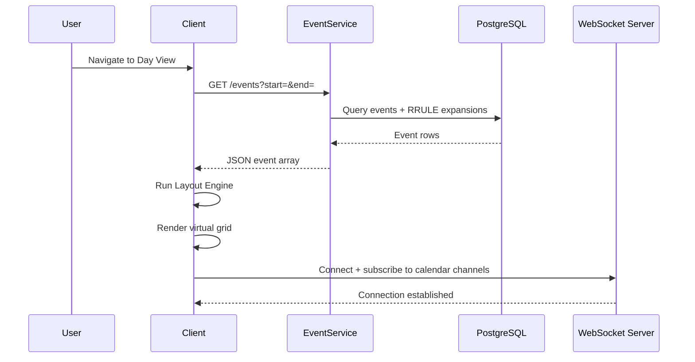
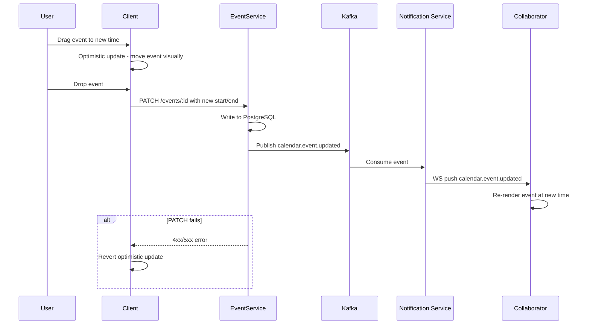
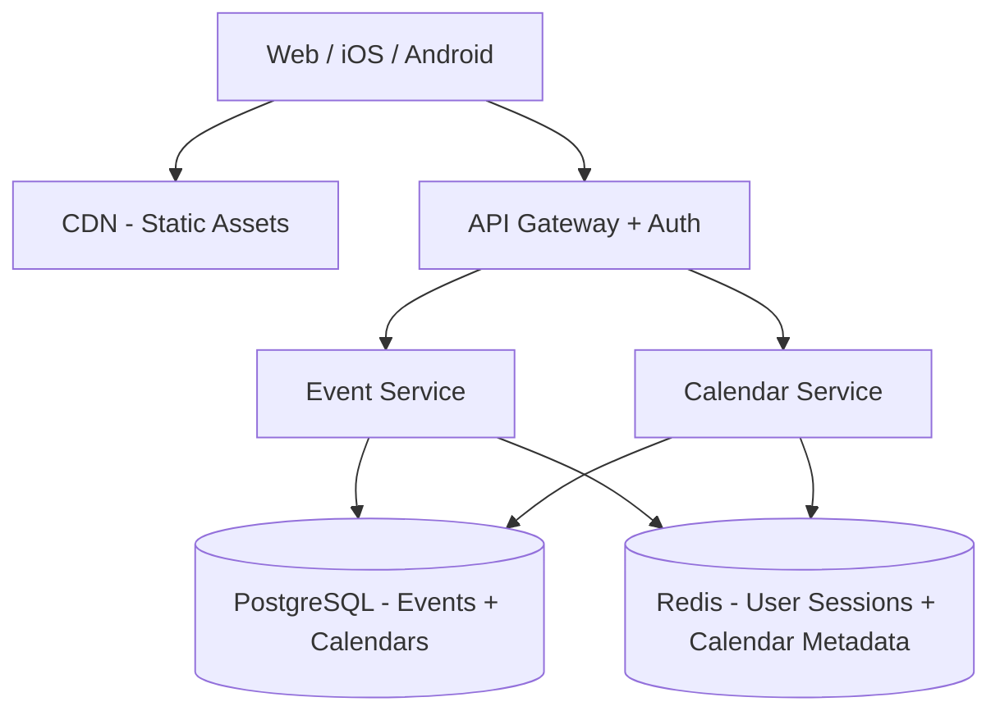
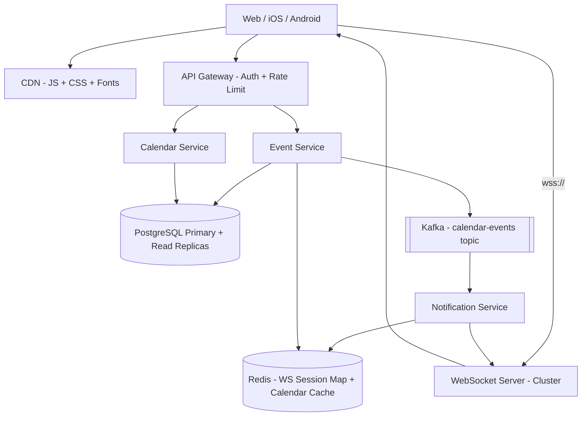
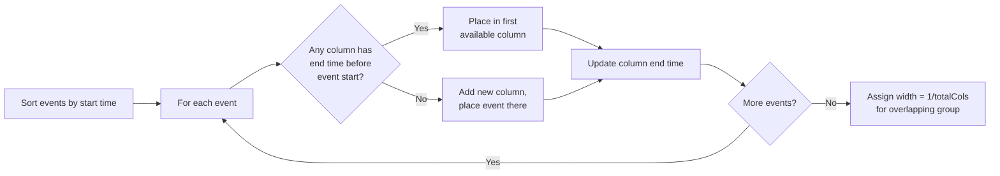

# Google Calendar — Day View

> **Frontend / Backend Split: 40% Backend · 60% Frontend**
> Google Calendar Day View is frontend-heavy. The backend is a standard CRUD + WebSocket notification service. The interesting engineering is all in the client: virtual scrolling a 24-hour grid, drag-and-drop with snapping, overlapping event layout, and RRULE expansion. Both sections get full coverage.

---

## 1. Problem + Scope

Design the Google Calendar **Day View** — a time-grid UI that displays all events for a single day, supports creating/editing/deleting events via drag, resize, and click, handles recurring events, and broadcasts real-time updates to shared-calendar collaborators.

**In scope:** Day view grid, event CRUD, drag & resize, recurring events (RRULE), overlapping event layout, real-time collaboration on shared calendars, all-day events, timezone rendering.

**Out of scope:** Meeting Room booking, Google Meet integration, calendar migration/import, Google Tasks integration.

---

## 2. Assumptions & Scale

| Metric | Value |
|---|---|
| Daily Active Users | 500M |
| Avg events visible in day view | 10–20 per user |
| Peak concurrent users | 50M |
| Event reads (day view load) | 3–5 API calls |
| Peak event writes | 10M updates/min → ~167K writes/sec |
| Event storage per user/year | ~10K events × 1KB = 10MB |
| Total storage | 500M × 10MB = 5PB |
| WebSocket connections (shared calendars) | ~5M concurrent |

**Scale calculation for write path:**

167K writes/sec is easily handled by a PostgreSQL cluster with read replicas. No NoSQL needed — events are relational (attendees, calendars, permissions). The fan-out to collaborators (shared calendar update → notify N users) is the harder problem at scale.

*These numbers drive the following decisions: PostgreSQL for ACID event storage, Redis for WebSocket session routing, Kafka for fan-out notifications to shared calendar members.*

---

## 3. Functional Requirements

- Display a 24-hour time grid for a selected date, showing all events for the user
- Create events via click-and-drag on the grid
- Edit events: drag to move (reschedule), drag edge to resize (change duration)
- Delete events
- Handle overlapping events — render them side-by-side without overlap
- Support recurring events defined by RRULE (daily, weekly, monthly, custom)
- Show all-day events in a dedicated strip at the top
- Render events from multiple calendars with color coding
- Real-time sync: if a collaborator edits a shared event, the other user's view updates within 1 second
- Timezone-aware: store in UTC, render in the user's local timezone

---

## 4. Non-Functional Requirements

| Requirement | Target |
|---|---|
| Initial load latency | < 500ms (events visible) |
| Drag & resize frame rate | 60 fps (no jank) |
| Real-time update latency | < 1 second for shared calendars |
| Availability | 99.9% |
| Consistency | Eventual for real-time; strong for event creation/deletion |
| Offline | Read-only view from local cache; writes queued |

**Consistency model:**

| Domain | Model | Justification |
|---|---|---|
| Event CRUD | Strong (PostgreSQL) | Prevents double-booking, attendee confusion |
| Real-time collaboration | Eventual (WebSocket + Kafka) | 1-second delay acceptable; last-write-wins |
| RRULE expansion | Computed on read | Recurrences are derived — no consistency issue |

---

## 🧠 Mental Model

Google Calendar Day View has **three core flows**:

1. **Load flow** — user navigates to a date → client fetches events for that day → frontend computes the layout (overlaps, positions, widths) → renders the grid
2. **Edit flow** — user drags/resizes/clicks → optimistic UI update locally → API call → server persists → WebSocket broadcasts change to collaborators
3. **Real-time flow** — collaborator edits a shared event → Event Service writes to DB → Kafka message → Notification Service → WebSocket push → all connected clients for that calendar receive the update

```
User navigates to Day View
         │
         ▼
   Fetch /events?date=X
         │
    ┌────┴────────────────────────────┐
    │  LAYOUT ENGINE (client-side)    │
    │  1. Sort events by start time   │
    │  2. Detect overlapping groups   │
    │  3. Assign columns + widths     │
    └────┬────────────────────────────┘
         │
         ▼
   Render 24h grid with positioned events
         │
    User drags event
         │
    ┌────┴──────────────────────────────┐
    │  DRAG ENGINE                      │
    │  1. Snap to 15-min increments     │
    │  2. Optimistic update (local)     │
    │  3. PATCH /events/:id on drop     │
    │  4. WS broadcast to collaborators │
    └───────────────────────────────────┘
```

**⚡ Core Design Principles**

| Path | Optimized For | Mechanism |
|---|---|---|
| Fast Path | Perceived latency | Optimistic UI — event moves instantly on drag; API fires async |
| Reliable Path | Correctness | If PATCH fails, revert optimistic update + show error toast |

---

## 5. API Design

**Calendar APIs**

| Method | Path | Description |
|---|---|---|
| GET | `/api/v1/events?calendarId=&start=&end=` | Fetch events for a date range. Returns expanded recurrences. |
| POST | `/api/v1/events` | Create event. Returns event with server-assigned ID (idempotency key in body). |
| PATCH | `/api/v1/events/:id` | Partial update — move/resize uses this. Supports `start`, `end`, `recurrenceAction`. |
| DELETE | `/api/v1/events/:id?recurrenceAction=` | Delete single instance or all/future recurrences. |
| GET | `/api/v1/calendars` | List user's calendars (own + shared). Used to set color coding. |

**WebSocket**

| Event | Direction | Payload |
|---|---|---|
| `calendar.event.updated` | Server → Client | `{ eventId, calendarId, changes, updatedBy }` |
| `calendar.event.deleted` | Server → Client | `{ eventId, calendarId, recurrenceAction }` |

> [!TIP]
> **Interview tip:** The `recurrenceAction` parameter on PATCH/DELETE is a key design question. Options: `THIS` (only this instance), `THIS_AND_FOLLOWING`, `ALL`. Say: "I expose this as a query parameter because the semantic differs from a normal update — it's modifying the RRULE or creating an exception, not just patching data."

---

## 6. End-to-End Flow

### 6.1 Day View Load

1. User navigates to Day View for date `2025-03-28`.
2. Client sends `GET /api/v1/events?calendarId=primary&start=2025-03-28T00:00Z&end=2025-03-28T23:59Z`.
3. Event Service queries PostgreSQL: fetch base events + any RRULE exceptions that fall on this date. For each recurring event, expand the RRULE server-side and return the occurrence for this day as a concrete event object.
4. Response arrives (≤ 500ms). Client receives array of event objects, each with `id`, `start`, `end`, `title`, `calendarId`.
5. Layout Engine runs: sorts events by start time → groups overlapping events → assigns each event a column index and a width fraction. A group of 3 overlapping events each gets width = 1/3 of the slot.
6. Virtual scroll renders only the visible portion of the 24h grid. Events are positioned absolutely using `top = (startMinutes / 1440) * gridHeight` and `height = (durationMinutes / 1440) * gridHeight`.
7. WebSocket connection opens to `wss://calendar.google.com/ws?calendarId=primary`. Client subscribes to shared calendars.



### 6.2 Drag & Drop (Move Event)

1. User starts dragging an event. Client immediately applies **optimistic update**: the event visually follows the cursor. The original time is saved in memory for rollback.
2. As the event moves, client snaps the `top` position to the nearest 15-minute increment (every `gridHeight / 96` pixels).
3. On drag end, client computes the new `start`/`end` from the final Y position.
4. Client sends `PATCH /api/v1/events/:id` with `{ start: newStart, end: newEnd }`.
5. Event Service writes to PostgreSQL. If the event is a recurring instance and `recurrenceAction=THIS`, it creates an exception record (stores the modified occurrence, marks the RRULE to skip this date).
6. Event Service publishes `calendar.event.updated` to Kafka topic `calendar-events`.
7. Notification Service consumes from Kafka, looks up all WebSocket connections subscribed to this `calendarId`, and pushes the update.
8. All collaborators' clients receive the WS event and re-render the event at the new time.
9. **If PATCH fails** (network error, conflict): client reverts optimistic update, shows error toast, event snaps back to original position.



---

## 7. High-Level Architecture

### Simple Design



### Evolved Design (with Real-Time + Scale)



> [!NOTE]
> **Key Insight:** The WebSocket server is stateless fanout — it doesn't store event data. Kafka decouples write path from notification path. Event Service never directly calls WebSocket servers.

---

## 8. Data Model

| Entity | Storage | Key Columns | Why this store |
|---|---|---|---|
| Event | PostgreSQL | `event_id`, `calendar_id`, `owner_id`, `title`, `start_utc`, `end_utc`, `rrule`, `is_all_day` | ACID — prevents double-booking; relational joins for attendees |
| Recurrence Exception | PostgreSQL | `event_id`, `original_date`, `new_start_utc`, `new_end_utc`, `is_deleted` | Models RRULE overrides without duplicating base event |
| Calendar | PostgreSQL | `calendar_id`, `owner_id`, `name`, `color`, `timezone` | Relational — permissions, sharing, color metadata |
| Calendar Members | PostgreSQL | `calendar_id`, `user_id`, `role` (owner/editor/viewer) | Many-to-many sharing; permission checks at write time |
| WS Session Map | Redis | `calendarId → [connectionId, ...]` | Ephemeral; TTL = connection lifetime. DB lookup = too slow for fanout |
| Calendar Metadata Cache | Redis | `userId:calendars → JSON` | TTL = 5min. Avoids DB hit on every day view load |

> [!NOTE]
> **Key Insight:** Recurring events are stored as a **rule + exceptions model** (not pre-expanded rows). Expansion happens at read time. Pre-expanding 10 years of weekly events = 520 rows per event × 500M users = storage explosion.

---

## 9. Deep Dives

### 9.1 Overlapping Event Layout Algorithm

**Here's the problem we're solving:** Multiple events on the same day can have overlapping time ranges. Rendering them stacked (one behind the other) makes them unreadable. We need a layout algorithm that places overlapping events side-by-side with correct widths so all are visible.

**Naive solution:** Render each event at full width. Overlapping events cover each other — user can't see or click the hidden events.

**Chosen solution — Column-based greedy layout:**

1. Sort events by `start_time` ascending.
2. Maintain an array of "columns," each tracking the latest `end_time` of events placed in it.
3. For each event: find the first column where the column's last event ended before this event starts. Place the event in that column. If no column fits, add a new column.
4. After processing all events in an overlapping group: width of each event = `1 / totalColumns`. Left offset = `columnIndex / totalColumns`.

This runs in O(n log n) (sort) + O(n·c) where c = max concurrent overlaps. For typical calendars (c ≤ 5), this is O(n).

**Trade-off accepted:** This greedy algorithm doesn't always minimize the number of columns (that's NP-hard for general interval graphs). For calendar use cases — where c is small — greedy produces the same result as optimal.



> [!NOTE]
> **Key Insight:** Event layout is a pure client-side computation. The backend returns raw `start`/`end` times; the client computes positions. This keeps the API simple and lets different clients (web, mobile) implement different visual strategies.

---

### 9.2 Drag & Drop with 15-Minute Snapping

**Here's the problem we're solving:** Drag-and-drop on a continuous pixel grid gives sub-second precision, but calendar events are scheduled in meaningful increments (15 min, 30 min). Allowing arbitrary placement (e.g., 10:03 AM) creates chaos. We need to snap movement to 15-minute increments in real time, at 60fps.

**Naive solution:** On each mouse/touch move, compute the time from Y position, round to nearest 15 minutes, re-render the event. Problem: React re-renders on every mousemove event = 60–120 events/sec = performance bottleneck.

**Chosen solution — CSS transform + commit-on-drop:**

1. During drag: **do not update React state** on every mousemove. Instead, directly mutate the DOM element's `transform: translateY(px)`. This bypasses React entirely and runs at 60fps with zero re-renders.
2. Snap logic runs in the event handler (not in React): `snappedY = Math.round(rawY / snapInterval) * snapInterval` where `snapInterval = gridHeight / 96` (96 = 4 per hour × 24 hours).
3. On drop: compute the new time from `snappedY`, then trigger a single React state update + API call.
4. Optimistic update: React state updates immediately with the new time. API call fires async. If it fails, revert.

**Trade-off accepted:** Directly mutating the DOM breaks React's virtual DOM contract — this event's position is "out of sync" during drag. This is acceptable because: (a) it's a known, contained exception; (b) the React state is corrected on drop; (c) the visual result is smooth 60fps — no alternative achieves this with React re-renders.

> [!NOTE]
> **Key Insight:** Drag-and-drop at 60fps = decouple visual feedback (DOM mutation) from data update (React state). Commit once on drop, not on every pixel.

---

### 9.3 Recurring Events — RRULE Expansion

**Here's the problem we're solving:** A "weekly team standup every Monday" is one event logically, but needs to appear on every Monday in the day view. How do we store this efficiently and handle edits (change only this occurrence vs. all future ones)?

**Naive solution — Pre-expand and store:** Create one DB row per occurrence. A weekly event for 2 years = 104 rows. Fine for one user. At 500M users with average 20 recurring events each = 500M × 20 × 52 = 520 billion rows. Not viable.

**Chosen solution — Store rule, expand on read:**

- Store one row with the RRULE string (RFC 5545 format): e.g., `RRULE:FREQ=WEEKLY;BYDAY=MO`
- On `GET /events?start=&end=`, the Event Service calls an RRULE library to expand only the occurrences within the requested window. For a day view, this expands at most 1–2 occurrences.
- **Exceptions** (user edits "only this event"): store a row in `recurrence_exceptions` with `original_date` + modified fields. The expand logic checks exceptions and overrides the generated occurrence.
- **"This and following"**: update the base event's `UNTIL` to `originalDate - 1 day`, create a new base event starting from `originalDate` with the new RRULE. Two rows represent the split.

**Trade-off accepted:** Expansion logic lives in the service layer (not the DB). This means every day-view load runs the RRULE library. At 50M concurrent users loading day views, this is ~50M RRULE expansions/sec. Each expansion is O(1) for a single-day window — microseconds. Acceptable.

> [!NOTE]
> **Key Insight:** RRULE is a read-time computation problem, not a storage problem. Store the rule + exceptions. Expand at query time. Pre-expanding = write amplification with no benefit.

---

### 9.4 Timezone Rendering

**Here's the problem we're solving:** A user in New York creates an event at 9 AM EST. Their colleague in London views the same shared event. London should see it at 2 PM GMT. The stored time must be unambiguous regardless of who reads it or where.

**Solution:**
- All times stored in UTC in the DB (`start_utc`, `end_utc` — TIMESTAMPTZ columns).
- Each calendar has a `timezone` field (IANA timezone string, e.g., `America/New_York`). Each user also has a profile timezone.
- On read: `start_utc` is returned to the client. The client renders using `Intl.DateTimeFormat` with the user's local timezone.
- The day view renders the grid in the **user's timezone**, not the event's origin timezone.
- For recurring events with DST transitions: the RRULE library handles DST-aware expansion (a "9 AM" weekly event stays at 9 AM local time across DST boundaries, not at a fixed UTC offset).

> [!NOTE]
> **Key Insight:** Store UTC, render local. The DB never knows about timezones. The client knows everything about display. DST is a display-layer problem.

---

## 10. Bottlenecks & Scaling

**What breaks first at 10× scale:**

1. **Event Service write path** — 1.67M writes/sec. Single PostgreSQL primary caps at ~50–100K writes/sec.
   - Shard by `user_id` (or `calendar_id`). Events are never queried cross-user — sharding is clean.
   - Each shard = independent PostgreSQL primary + 2 read replicas.

2. **RRULE fan-out for shared calendars** — When a user edits a recurring event with 500 attendees, Notification Service must push to 500 WebSocket connections.
   - Kafka topic partitioned by `calendar_id`. Each Notification Service instance handles a partition. Scales horizontally.
   - WebSocket server cluster: Redis pub/sub routes messages to the correct WS server node holding each connection.

3. **Day view cache** — 50M concurrent users each load ~20 events. At 3–5 API calls per load, that's 150–250M reads/sec.
   - Cache recent day views in Redis: key = `events:{userId}:{date}`, TTL = 5 minutes.
   - Cache invalidation: when an event is written, invalidate all affected users' date keys. Acceptable since events are rarely shared with >10 users.

**CDN strategy:** All static assets (JS, CSS, fonts) served from CDN edge. First load: 200ms. Subsequent loads: service worker cache → near-instant.

---

## 11. Failure Scenarios

| Failure | Impact | Recovery |
|---|---|---|
| PostgreSQL primary fails | Event writes fail; reads continue from replica | Automatic failover (Patroni / RDS Multi-AZ). Reads never interrupted. |
| WebSocket server node fails | ~N/totalNodes users lose real-time updates | Client reconnects with exponential backoff. WS session map in Redis allows reconnection to any node. |
| Kafka consumer lag | Real-time updates delayed (seconds to minutes) | Backpressure alert. Consumer auto-scales. Events are durable in Kafka — no loss, just delay. |
| PATCH fails on drag drop | Event appears moved in client but not saved | Optimistic update reverts. User sees error toast: "Failed to save — changes reverted." |
| Clock skew between clients | Concurrent edits to same event overlap | Last-write-wins with server timestamp. For shared events, this is acceptable — calendar conflicts are rare. |
| CDN outage | Initial load fails or is slow | API Gateway serves static assets as fallback (slower but functional). |

---

## 12. Trade-offs

### Optimistic UI vs. Confirmed Update

| Dimension | Optimistic UI | Wait for confirmation |
|---|---|---|
| Perceived latency | Instant (0ms) | Full round-trip (100–300ms) |
| Risk | Revert on failure (jarring UX) | No visual inconsistency |
| Complexity | Rollback logic required | Simple |
| User experience | Smooth, modern feel | Laggy on slow networks |

**Chosen:** Optimistic UI — calendar events rarely fail to save. The latency improvement (0ms vs 200ms) is significant at scale and across mobile connections.

> [!NOTE]
> **Key Insight:** Optimistic UI is only viable when the failure rate is low and rollback is well-defined. Event drag-and-drop fails <0.1% of the time — making it the ideal candidate.

---

### WebSocket vs. Polling for Real-Time Sync

| Dimension | WebSocket | Long Polling |
|---|---|---|
| Real-time latency | < 100ms | 1–30s |
| Server connections | Persistent (expensive) | Stateless (cheaper per req) |
| Scale complexity | Need WS cluster + Redis routing | Any stateless server |
| Bandwidth | Low (push only changed data) | Higher (repeated full requests) |

**Chosen:** WebSocket — for collaborative calendars, 1-second real-time latency is the UX requirement. Polling at 1-second intervals for 500M users = 500M requests/sec of empty polls. That's the wrong math.

> [!NOTE]
> **Key Insight:** WebSocket vs polling is a math problem. 500M users × 1 poll/sec = 500M empty requests/sec. WebSocket = push only when something changes.

---

### Recurring Event Storage: Pre-Expand vs. Rule + Expand

| Dimension | Pre-expand rows | RRULE rule + expand on read |
|---|---|---|
| Read complexity | Simple SQL range query | RRULE library call |
| Write complexity | Simple | Simple |
| Storage | O(n × recurrences) = billions of rows | O(n) — one row per recurring series |
| Handling exceptions | Update single row | Exception table lookup |
| Handling "edit all future" | Update many rows | Update UNTIL + new rule row |

**Chosen:** RRULE rule + expand on read — storage efficiency is overwhelming at 500M users. RRULE expansion for a single day is O(1) — trivial cost.

> [!NOTE]
> **Key Insight:** Expand at read time for a 24-hour window = at most 2–3 occurrences. Pre-expand for 2 years = 52–730 rows per event. The read cost is the same; the write/storage cost is radically different.

---

## Interview Summary

### Key Decisions

| Decision | Problem it solves | Trade-off accepted |
|---|---|---|
| Optimistic UI for drag & drop | Instant visual feedback; 60fps drag | Must implement rollback on API failure |
| DOM mutation during drag (not React state) | 60fps without re-render bottleneck | DOM temporarily out of sync with React virtual DOM |
| RRULE rule + expand on read | O(n) storage instead of O(n × recurrences) | RRULE expansion logic in service layer on every read |
| WebSocket over polling | < 1s real-time updates | Stateful server cluster; Redis routing needed |
| UTC storage + client-side timezone render | Single source of truth; no timezone bugs | Client must handle DST-aware display logic |
| PostgreSQL with sharding | ACID for event CRUD; prevents double-booking | Shard key must be chosen carefully (user_id) |

### Fast Path vs. Reliable Path

```
FAST PATH (optimized for perceived latency)
  User drags event
      │
      ▼
  DOM translate (60fps, no React re-render)
      │
  User drops
      │
      ▼
  React state update → event renders at new time immediately
      │
  PATCH /events/:id fires async (non-blocking)


RELIABLE PATH (optimized for correctness)
  If PATCH succeeds → collaborators receive WS push → re-render
  If PATCH fails   → revert React state → event snaps back → error toast
```

### Key Insights Checklist

- "Drag at 60fps requires bypassing React. I mutate the DOM directly during drag, commit once on drop. DOM and React are briefly out of sync — that's acceptable because the window is bounded and intentional."
- "Recurring events are a storage problem in disguise. Store the RRULE rule, not the expanded instances. One row per series. Expansion is O(1) per day-view load."
- "WebSocket vs polling is a math problem. 500M users × 1 poll/sec = 500M empty requests/sec. Pushed updates from WebSocket cost nothing when nothing changes."
- "Optimistic UI only works when failure rate is low and rollback is well-defined. Calendar drag-and-drop fails < 0.1% of the time — making it the ideal use case."
- "All times stored in UTC. The DB has no concept of timezone. DST is a client-side rendering concern, not a persistence concern."
- "Overlapping event layout is a greedy column-packing algorithm — runs client-side in O(n log n). The API returns raw times; the client computes visual positions. This lets mobile and web implement different strategies independently."
