# System Design: Google Docs (Real-time Collaborative Editor)

---

## 🧠 Mental Model

> **Google Docs is not syncing text. It is syncing operations across distributed clients.**

This is the insight that unlocks the entire design. When Alice types "R" at position 29, Google Docs does not send the document. It sends `{ type: "insert", pos: 29, char: "R", version: 42, client_id: "alice" }`. The document is a *materialized view* of a sequence of operations — not the source of truth. The operations log is.

Two users editing the same position at the same millisecond will produce divergent documents unless a conflict resolution algorithm (OT or CRDT) transforms one operation against the other before applying. The entire architecture is organized around making that transformation **correct**, **fast**, and **durable**. Everything else — WebSocket, Cassandra, Redis, S3 — serves those three requirements.

The system runs two paths concurrently:
- **Fast path**: apply locally → send to OT Server → transform → broadcast to peers (optimizes latency)
- **Reliable path**: append to Operations Log before ACK (optimizes durability)

```
                    ┌──────────────────────────────────────────────────────────┐
                    │                      FAST PATH                            │
  ┌────────┐  op    │  ┌──────────┐  transform  ┌──────────┐  broadcast       │
  │ UserA  │ ──────►│  │OT Server │ ───────────►│OT Server │ ──────► peers    │
  └────────┘        │  └──────┬───┘             └──────────┘                  │
   (optimistic      │         │ concurrent ops                                 │
    local apply)    └─────────┼───────────────────────────────────────────────┘
                              │ append (before broadcast, before client ACK)
                    ┌─────────▼───────────────────────────────────────────────┐
                    │                   RELIABLE PATH                           │
                    │              ┌─────────────────┐                         │
                    │              │ Operations Log   │  <- every op stored    │
                    │              │   (Cassandra)    │     before ACK sent    │
                    │              └─────────────────┘                         │
                    └─────────────────────────────────────────────────────────┘
```

### ⚡ Core Design Principle

| Principle | Decision | Why |
|---|---|---|
| Conflict resolution | Operational Transformation (OT) | Central server already required; OT maps naturally |
| Operation granularity | Delta (insert/delete + position) | Full file replacement causes last-writer-wins data loss |
| Transport | WebSocket (persistent, bidirectional) | HTTP request-response cannot push server-initiated ops |
| Durability | Append-only Operations Log in Cassandra | Event sourcing — replay any version from any point |
| Latency | Optimistic local apply before server ACK | Visual responsiveness over consistency for text editing |
| Ephemeral state | Redis with TTL for cursors and presence | Cursor data expires naturally; storing in DB adds write amplification |

---

## 1. Problem Statement & Scope

Google Docs allows multiple users to edit the same document simultaneously in real time. Changes made by one user appear in every other user's browser within milliseconds. The system must handle billions of documents, millions of concurrent editors, and guarantee zero data loss.

**In scope:**
- Create, read, update, delete documents
- Single-user and multi-user real-time collaborative editing
- Cursor positions and presence for all active collaborators
- Document versioning — save snapshots, restore to any version
- Offline editing with automatic sync on reconnect

**Out of scope:**
- Comments and suggestions (separate service)
- Permissions and sharing UI (separate IAM service)
- Spreadsheets and Slides (different data models)

---

## 2. Requirements

### Functional Requirements

1. **CRUD Documents** — create, open, rename, and delete documents
2. **Real-time collaborative editing** — all collaborators see changes within 100ms
3. **Cursor and presence** — see where each collaborator's cursor is and who is online
4. **Document versioning** — view history, restore to any prior version
5. **Offline editing** — buffer local operations while offline, sync on reconnect

### Non-Functional Requirements

| Requirement | Target |
|---|---|
| Concurrent active editors | 1 million |
| Total documents | 1 billion |
| Edit propagation latency | < 100ms end-to-end |
| Data durability | Zero data loss (operations log is source of truth) |
| Availability | 99.99% for solo editing; strong consistency for collaborative editing |
| Throughput | 5 million operations/sec at peak |

### CAP Discussion

> [!NOTE]
> **Key Insight:** Google Docs makes a deliberate CAP choice that varies by editing mode. Solo editing: AP (availability over consistency — your edits always go through even if a replica is stale). Collaborative editing: CP (consistency over availability — all collaborators must converge to the same document state; the OT server is the single ordering point).

For collaborative editing, the OT server acts as the serialization point. If it is unreachable, clients buffer locally and display a "reconnecting" state rather than allowing divergent edits that cannot be reconciled.

---

## 3. Back-of-the-Envelope Estimations

| Parameter | Value | Reasoning |
|---|---|---|
| Total documents | 1 billion | Given |
| Concurrent active editors | 1 million | 1% of documents active at any time |
| Operations per editor per second | 5 | 1 keystroke per 200ms |
| Peak operations/sec | 5 million | 1M x 5 |
| Operation payload size | ~200 bytes | Delta: type + position + char + version + client_id |
| Operations write throughput | ~1 GB/sec | 5M x 200B |
| Snapshot frequency | Every 100 ops | Background compaction |
| Average document snapshot size | ~50 KB | Typical rich-text document |
| Snapshot storage per day | ~500 GB | 1M active docs x 1 snapshot/day x 50KB |
| WebSocket connections | 1 million | One persistent connection per active editor |
| Redis cursor entries | 1 million keys | One HSET per active document, TTL = 30s |

**Cassandra sizing for operations log:**
- 1 GB/sec write throughput -> 86 TB/day at peak (real average ~10x lower -> ~10 TB/day)
- Retain raw operations for 30 days -> ~300 TB hot storage
- Older operations compacted into snapshots -> S3 for cold storage

**WebSocket gateway sizing:**
- Each WebSocket connection consumes ~64 KB memory at the server
- 1 million connections -> ~64 GB RAM across gateway fleet
- Horizontal scaling: shard by doc_id

---

## 4. API Design

### REST API (Document Lifecycle)

```
POST   /api/v1/documents
       Body:     { title, owner_id }
       Response: { doc_id, created_at, blob_url }
       Purpose:  Create a new empty document

GET    /api/v1/documents/{doc_id}
       Response: { metadata, content_url, current_version }
       Purpose:  Fetch document metadata and URL of latest snapshot (served via CDN)

DELETE /api/v1/documents/{doc_id}
       Purpose:  Soft-delete; moves to trash, not immediately purged

GET    /api/v1/documents/{doc_id}/versions
       Response: [{ version_id, created_at, snapshot_url, op_count }]
       Purpose:  List all named versions and auto-snapshots

POST   /api/v1/documents/{doc_id}/versions
       Body:     { label }
       Purpose:  Create a manual named snapshot at current state
```

### WebSocket API (Real-time Editing Session)

```
WS     /ws/documents/{doc_id}/edit
       Auth: Bearer token (validated on handshake upgrade)
       Sticky routing: client must reconnect to same OT Server node for the document

Client -> Server (operation):
  {
    type:      "operation",
    op: {
      type:      "insert" | "delete",
      pos:       29,
      char:      "R",
      version:   142,
      client_id: "uuid"
    }
  }

Client -> Server (cursor):
  {
    type:      "cursor",
    pos:       29,
    selection: { start: 29, end: 35 }
  }

Server -> Client (transformed operation broadcast):
  {
    type:              "operation",
    op:                { ...original_op },
    transformed_op:    { type: "insert", pos: 30, char: "R" },
    committed_version: 143
  }

Server -> Client (remote cursor):
  {
    type:    "cursor",
    user_id: "alice",
    pos:     15,
    color:   "#FF6B6B"
  }

Server -> Client (presence):
  {
    type:    "presence",
    user_id: "bob",
    status:  "online" | "idle" | "offline"
  }
```

> [!NOTE]
> **Key Insight:** The `version` field in the operation is the client's local version when the op was generated, not the server's committed version. The OT server uses this gap (client version vs. server version) to determine which concurrent operations must be transformed against.

---

## 5. System Architecture

### High-Level Architecture

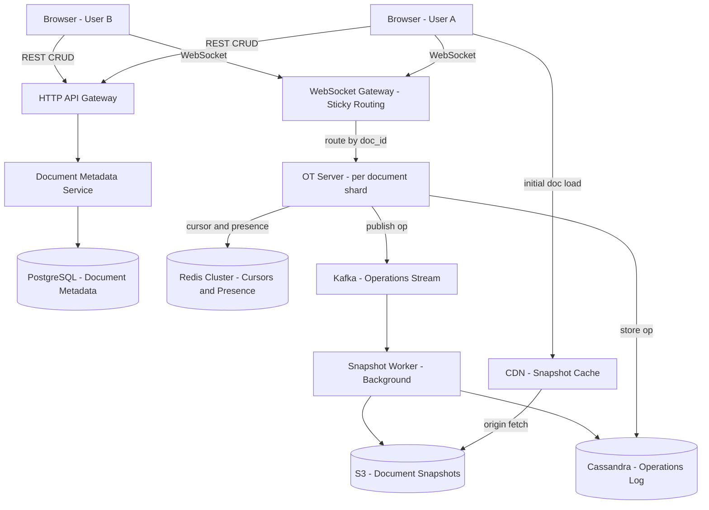

### Evolved Architecture: WebSocket Sticky Routing

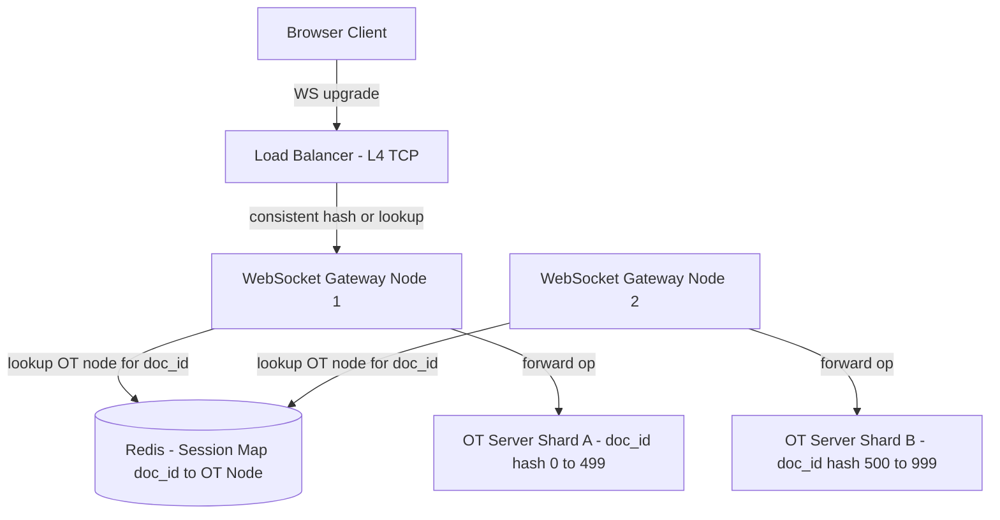

> [!NOTE]
> **Key Insight:** OT requires all operations for a document to pass through a single server — this is a correctness requirement, not a scaling limitation. Without a single ordering point, two OT servers could transform the same pair of concurrent operations in different orders, producing divergent documents. The session map in Redis routes every client for a given doc_id to the same OT Server node.

---

## 6. Operation Data Flow

> [!IMPORTANT]
> This is the flow interviewers want to hear you walk through. Every step has a purpose — know WHY each step exists.

### 🔄 The One-Line Flow (Say This First)

```
Client → apply locally → send op → Server → transform against concurrent ops
       → append to log → broadcast transformed op → other clients apply
```

This is the entire system in one line. Everything else — WebSocket, Cassandra, Redis, OT engine — exists to make each arrow in this flow **correct**, **fast**, and **durable**.

| Arrow | Mechanism | Failure mode if skipped |
|---|---|---|
| `apply locally` | Optimistic apply before server ACK | Editing feels laggy — 200ms+ perceived latency |
| `send op` | WebSocket frame with `{type, pos, char, client_version}` | Server cannot transform without the version gap |
| `transform` | OT function adjusts positions against concurrent ops | Documents diverge — different clients see different text |
| `append to log` | Cassandra write BEFORE broadcast | Op lost on server crash — cannot replay on reconnect |
| `broadcast` | Push to all connected clients on same doc_id | Peers never see the change |
| `other clients apply` | Client-side OT against own pending ops | Client and server state desync — rollback spiral |

### 🔄 Complete Operation Lifecycle

```
Step 1: Local Apply (client)
Step 2: Send to server (WebSocket)
Step 3: Transform on server (OT Engine)
Step 4: Append to Operations Log (Cassandra)
Step 5: Broadcast transformed op to all peers (WebSocket)
Step 6: Peers apply transformed op to their local doc
```

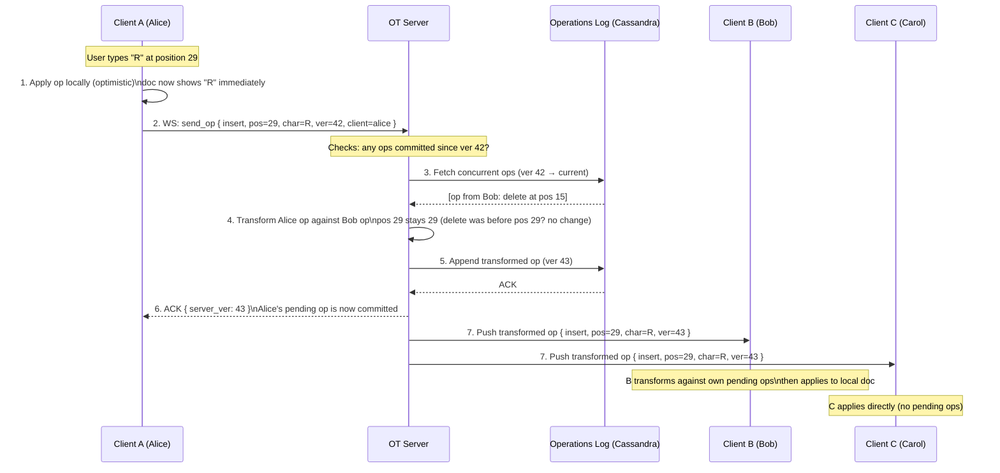

### Step-by-Step WHY

| Step | What happens | Why it must happen this way |
|------|-------------|----------------------------|
| 1. Local apply | Client applies op to local doc without waiting | Makes editing feel instant — zero perceived latency |
| 2. Send to OT Server | Op sent with `client_version` (doc version when op was generated) | Server needs the version gap to know which concurrent ops to transform against |
| 3. Fetch concurrent ops | Server retrieves all ops committed since `client_version` | These are the ops the client did NOT know about when it generated its op |
| 4. Transform | OT function adjusts positions against each concurrent op | Without this, positions become wrong → documents diverge |
| 5. Append to log | Store BEFORE broadcasting | If server crashes after write but before broadcast, the op is in the log — clients fetch on reconnect |
| 6. ACK to sender | Confirm the op's committed version | Client replaces pending op with committed version — can now generate next op correctly |
| 7. Broadcast to peers | Push transformed op to all connected clients | Peers apply the server-transformed version, not the raw client version |

> [!NOTE]
> **Key Insight:** The `client_version` is the crucial field. It tells the server "when I generated this op, I had seen operations up to version N." The server's job is to transform the op against everything that happened between version N and now. This is the entire OT algorithm in one sentence.

---

## 6b. Separation of Concerns

The system has three distinct layers. Keeping them separate is what makes the design scalable and debuggable.

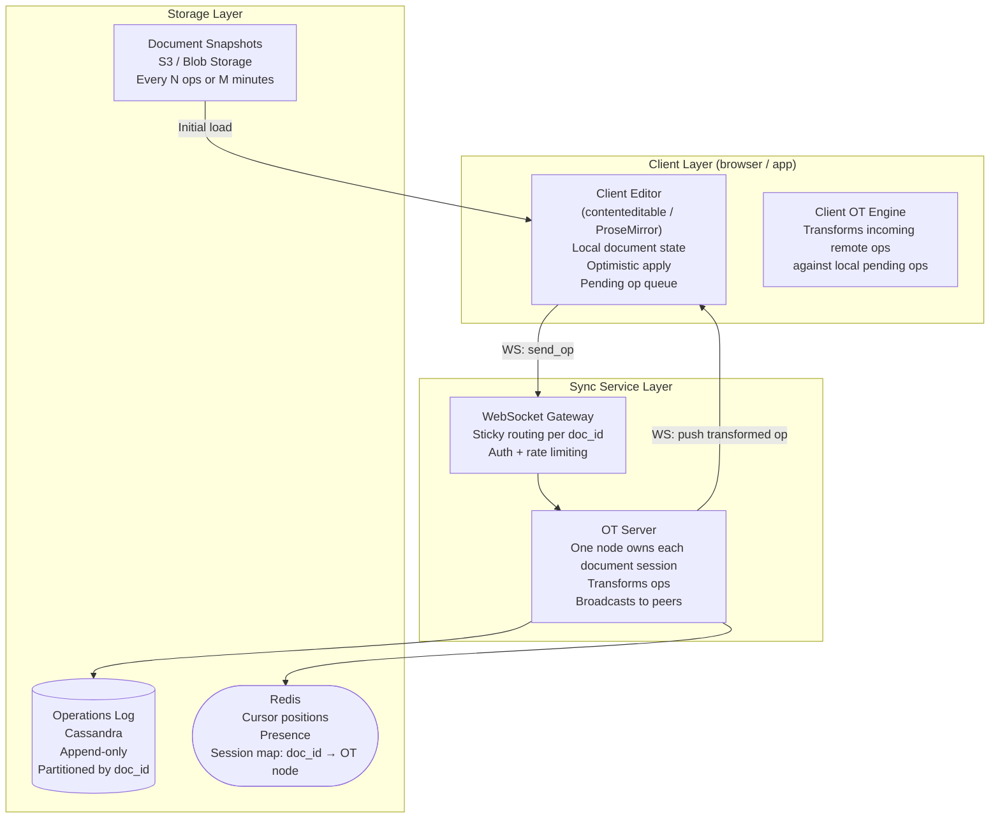

| Layer | Component | Responsibility | Why separated |
|---|---|---|---|
| Client | Editor | Local document model, keystrokes, rendering | Must be fast — no server round-trip |
| Client | Client OT Engine | Transform incoming remote ops against pending local ops | Client has unACKed ops the server hasn't seen yet |
| Sync | WebSocket Gateway | Auth, sticky routing, connection lifecycle | Stateless routing layer — separate from OT logic |
| Sync | OT Server | Canonical transformation and ordering point | Stateful per-document — must not be distributed |
| Storage | Operations Log | Durable, replayable event source | Decoupled from serving layer — allows versioning/audit |
| Storage | Snapshots | Fast initial load | Log replay from op 1 is too slow for large documents |
| Storage | Redis | Ephemeral state (cursors, presence, session map) | High-frequency writes with natural expiry — wrong fit for DB |

> [!NOTE]
> **Key Insight:** The Client OT Engine and the Server OT Engine are both necessary. The server transforms incoming ops against other clients' concurrent ops. The client transforms incoming remote ops against its own locally-pending (unACKed) ops. Neither can be skipped. Remove the client engine and cursor positions break whenever you have network lag.

---

## 6c. Consistency Model

### Eventual Consistency + Strong Convergence

Google Docs is an **eventually consistent** system with a **strong convergence** guarantee.

| Property | Definition | Google Docs guarantee |
|---|---|---|
| Eventual consistency | All replicas will agree on the same state... eventually | Yes — given no new ops, all clients converge |
| Strong convergence | If two replicas have applied the same set of ops (in any order), they are in the same state | Yes — OT's transformation property ensures this |
| Linearizability | Every op appears to execute atomically at a single point in time | No — not required for a text editor |
| Causal consistency | If op A happened before op B (as seen by the client), all clients see A before B | Yes — client version numbers enforce causal ordering |

```
Eventual consistency in practice:
  Alice:  "Hello"  →  "Hello World"  →  "Hello World!"
  Bob:     "Hello"  →  "Hello !"      →  "Hello World!"
                                               ↑
                              Both converge here after transformation
```

**Strong convergence is what OT (and CRDT) provide.** It means:
- Two clients applying the same set of operations will always reach the same final document state
- The ORDER in which concurrent ops are applied does not matter — transformation corrects positions
- This holds even with network delays, reordering, or reconnection

> [!NOTE]
> **Key Insight:** Google Docs does NOT guarantee that Alice and Bob see the same document at the same millisecond — that would require linearizability, which is prohibitively expensive at this scale. It guarantees that they converge to the same document. The gap is usually < 100ms and invisible to users.

---

## 6d. Edge Cases

### Out-of-Order Operations

**Problem:** Network reordering means op at version 44 arrives before op at version 43.

**Solution:** The OT server enforces ordering at the log level. Every op gets a monotonically increasing server version on commit. Clients buffer ops received out of order and apply them in version order.

```
Client receives: [ver=44 op], [ver=43 op]
                      ↓
Buffer: { 43: pending, 44: pending }
Wait for ver 43 → apply 43 → apply 44
```

> [!NOTE]
> **Key Insight:** The server version number is the total ordering mechanism. It converts the partial order (concurrent client ops) into a total order (globally committed sequence). Without it, clients would need vector clocks to detect ordering, which is far more complex.

---

### Duplicate Operations (At-Least-Once Delivery)

**Problem:** Client sends op, server commits and appends to log, but crashes before sending ACK. Client retries — duplicate op arrives.

**Solution:** Each op carries `(client_id, client_seq)`. OT Server checks Redis before processing:

```
GET dedup:{client_id}:{client_seq}
  → exists:  duplicate — return previously committed server_version, drop op
  → missing: process normally, SET dedup:{client_id}:{client_seq} {server_ver} EX 3600
```

---

### Network Delay and Reconnection

**Problem:** Client loses connection for 30 seconds. Misses 150 ops from other users. On reconnect, their local document is stale.

**Solution: Operation log catch-up**

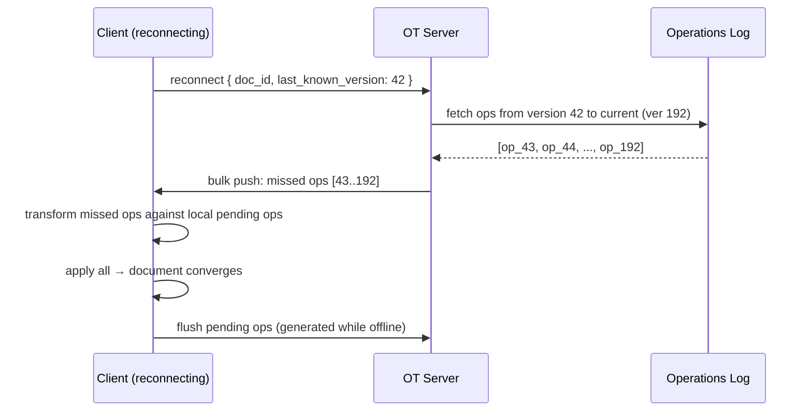

> [!NOTE]
> **Key Insight:** The Operations Log is not just for versioning — it is the reconnection mechanism. Every client disconnect/reconnect is handled identically: fetch ops since `last_known_version` from Cassandra, transform against local pending ops, apply. This also handles the offline editing case (F2 in the Frontend section).

---

## 7. Deep Dives

### 6.1 The Three Approaches to Collaborative Editing

This is the most important section of the design. Three approaches exist, and two of them fail at scale or correctness.

---

#### Approach 1: File Replacement (Brute Force)

**Idea:** On every keystroke, serialize the entire document, send it to the server, server overwrites storage, broadcasts new document to all clients.

**Problems:**

(a) **Payload is enormous.** A 100 KB document sends 100 KB per keystroke. At 5 ops/sec per user x 1M users = 500 GB/sec of document content transfer. Catastrophic.

(b) **Concurrent writes cause silent data loss.** Alice and Bob both read version N, both write version N+1 with their own changes. Bob's write overwrites Alice's. Last writer wins — Alice's work silently disappears.

(c) **DOM re-render cost.** The client must diff the entire document on every update to determine what changed for DOM patching.

**Verdict: Rejected.**

---

#### Approach 2: Locking Protocol

**Idea:** Prevent concurrent edits by serializing access.

**Pessimistic locking:** A user acquires an exclusive lock on the document before editing. Others see a read-only view until the lock is released.
- Problem: Completely incompatible with real-time collaboration. If Alice locks a document for 2 minutes of typing, Bob is frozen.

**Optimistic locking:** Users edit freely, but on commit the server checks if the base version is still current. If another write happened, the commit is rejected and the user must manually merge.
- Problem: Acceptable for code (Git), but unacceptable for a text editor. Users cannot be asked to resolve merge conflicts for every paragraph.

**Verdict: Rejected for real-time collaborative editing.**

---

#### Approach 3: Delta-Based with Conflict Resolution (OT or CRDT)

**Idea:**
1. Send only the operation delta: `{ type: "insert", pos: 29, char: "R" }` — not the whole file.
2. Use a persistent WebSocket for low-latency bidirectional messaging.
3. Use a conflict resolution algorithm (OT or CRDT) to reconcile concurrent operations before applying them.

**The Alice/Bob Problem — Why Naive Delta Merge Fails:**

```
Initial document: "BC"

Alice: insert "A" at position 0  ->  her local state: "ABC"
Bob:   insert "D" at position 2  ->  his local state:  "BCD"

Naive server merge (apply both without transformation):
  Server applies Alice's op first: "ABC"
  Server applies Bob's op (D at pos 2): "ABDC"   <- Alice sees "ABDC"
  Bob applied D to "BCD" then receives Alice's op  -> Bob sees "ABCD"

Alice sees "ABDC", Bob sees "ABCD" -- DIVERGED. Documents are inconsistent.
```

**With OT (Operational Transformation):**
- Bob's op `insert("D", pos=2)` was generated against version "BC" (before Alice's insert)
- The server knows Alice's op happened first (committed at version 1)
- The OT server transforms Bob's op: Alice inserted at pos 0, which shifts all positions right by 1 — Bob's pos 2 becomes pos 3
- Transformed op: `insert("D", pos=3)`
- Both Alice and Bob converge to: "ABCD" ✓

**Verdict: CHOSEN.** Delta-based operations with OT conflict resolution.

---

### 6.2 OT vs CRDT — The Core Algorithm Choice

Both OT and CRDT solve the concurrent edit problem. They take fundamentally different approaches. Understanding both deeply — including CRDT's real production costs — is what separates a junior answer ("use CRDT, it's simpler") from a senior answer.

#### OT (Operational Transformation)

- The server maintains a canonical operation history for the document
- When a client op arrives, the server checks: which ops were committed since the client's last known version?
- The transformation function adjusts the incoming op's position against each concurrent op
- All operations for a document must pass through a single server (the ordering point)

**Transformation rules (simplified):**

| Concurrent ops | Rule |
|---|---|
| Insert(A) vs Insert(B), A <= B | B becomes B + 1 |
| Insert(A) vs Insert(B), A > B | B stays B |
| Insert(A) vs Delete(B), A <= B | B becomes B + 1 |
| Delete(A) vs Delete(B), A < B | B becomes B - 1 |
| Delete(A) vs Delete(B), A >= B | B stays B |

---

#### CRDT (Conflict-free Replicated Data Type)

CRDT = Conflict-free Replicated Data Type. The core guarantee: **any two peers that have seen the same set of operations will converge to the same document state — regardless of the order in which those operations arrived.** No central server required to enforce this. The data structure itself makes convergence guaranteed.

**The fundamental difference from OT:** OT needs a server to impose order before merging. CRDT makes operations commutative — you can apply them in any order and always get the same result.

---

##### How CRDT Merge Works (Operation-Based)

In the operation-based model (which is what text editors use), each peer sends only the *delta* — the operation — not the full document. The key insight is that every character gets a **permanent unique identity**, not an integer position that shifts when other chars are inserted.

```
Each character carries:
  id:    a unique identifier (never reused, even after deletion)
  after: the id of the character this was inserted after (the "anchor")
  value: the character itself
```

**The same Alice/Bob problem — solved with CRDT:**

Recall the problem from the OT section:
```
Document: "BC"   (B has id=1, C has id=2)

Alice inserts "A" at the start:
  OT op:   { insert, pos=0, char="A" }       ← integer position, shifts on merge
  CRDT op: { id=3, after=START, value="A" }  ← anchored to START, never shifts
  Alice's state: "ABC"

Bob inserts "D" after "C":
  OT op:   { insert, pos=2, char="D" }       ← integer position 2, relative to "BC"
  CRDT op: { id=4, after=id2, value="D" }    ← anchored to C (id=2), never shifts
  Bob's state: "BCD"
```

**Why OT fails without a server and CRDT doesn't:**

With OT, when Alice's op arrives at Bob, Bob must *transform* it — "Alice inserted at position 0, so my position 2 must shift to position 3." That transformation requires knowing the commit order, which requires a server.

With CRDT, no transformation is needed:
- Alice's op says: "put 'A' after START." That's true regardless of what Bob did.
- Bob's op says: "put 'D' after id=2 (C)." That's true regardless of what Alice did.

Both peers simply apply both ops:
```
  START → A(id=3) → B(id=1) → C(id=2) → D(id=4)
  Rendered: "ABCD"  ✓

Alice applies Bob's op:   START → A(id=3) → B(id=1) → C(id=2) → D(id=4) = "ABCD" ✓
Bob applies Alice's op:   START → A(id=3) → B(id=1) → C(id=2) → D(id=4) = "ABCD" ✓
Both converge without any server involvement.
```

**The key difference in one line:**
> OT says "insert at position N" — positions shift, so a server must impose order before transforming.
> CRDT says "insert after character X (by id)" — ids never shift, so any peer can merge in any order.

**What if two peers insert at the same anchor concurrently?**

```
Document: "AC"  (A has id=1, C has id=2)

Alice types "B" after A:  op { id=3, after=id1, value="B" }  →  "ABC"
Bob   types "X" after A:  op { id=4, after=id1, value="X" }  →  "AXC"

Both ops say "after id=1". Tie-break: sort by peer identity (e.g. alphabetical).
"alice" < "bob" → Alice's character goes first.

Both peers converge to: "ABXC"  ✓  (consistent, even if arbitrary)
```

The result is always consistent. The tie-break is arbitrary but deterministic — the same rule on every peer produces the same order. OT has the same limitation: the server picks a commit order that's equally arbitrary.

---

##### Tombstoning — The Hidden Cost of CRDT

**Deleted characters cannot be physically removed from a CRDT.** This is the most important production constraint.

Here's why:

```
Document: A(id=1) → B(id=2) → C(id=3)

Alice deletes B. Her view: A(id=1) → C(id=3)

Bob (offline) types "D" after B — his op says: "after id=2"

Bob reconnects. If B was physically deleted, id=2 no longer exists.
Bob's operation has no anchor — it cannot be placed correctly.

Solution: B becomes a tombstone — invisible to the user, but still in the structure:
  A(id=1) → [B, id=2, deleted] → D(id=4) → C(id=3)
  Rendered: "ADC"
```

**At scale:** A heavily-edited document accumulates tombstones — invisible deleted characters that stay in memory on every client. A 10,000-word document could have 50,000 tombstones. Periodic cleanup ("compaction") removes them once every peer has confirmed they've seen the deletion — but coordinating that cleanup across offline mobile clients is a hard engineering problem.

> [!NOTE]
> **Key Insight:** Tombstoning is not a bug — it is the price of CRDT's "no central server" guarantee. You cannot fully delete a character until every peer has acknowledged the deletion. OT has no tombstoning because the server is always the ordering authority — deletion is final immediately.

---

##### Fractional Indexing — The Interview-Friendly CRDT Mental Model

The ID-anchor model above is accurate but hard to explain verbally. For an interview, the **fractional position** model is simpler to draw and reason about:

```
Initial document: "BC"
  B is assigned position 0.50
  C is assigned position 0.75

Alice inserts "A" before B:
  A gets position 0.25  (between 0 and 0.50)
  Alice's state: A(0.25) → B(0.50) → C(0.75)

Bob inserts "D" after C:
  D gets position 0.875 (between 0.75 and 1.0)
  Bob's state:   B(0.50) → C(0.75) → D(0.875)

Merge: both peers receive each other's ops.
       Sort all characters by position value:
       A(0.25) → B(0.50) → C(0.75) → D(0.875)
       Rendered: "ABCD"  ✓  Both clients converge automatically.
```

No server needed. No transformation function. Positions never conflict because every insert picks a value in the gap between its neighbors. This is the **Logoot / LSEQ** family of CRDTs.

> [!NOTE]
> **Key Insight:** Fractional indexing = CRDT where position IS the identity. You insert *between* two known positions, never *at* an integer index that can shift. The same idea as the ID-anchor model, just expressed as a number instead of a pointer. Both explain why "insert after id=X" never shifts, where "insert at pos=2" does.

---

#### OT vs CRDT — Comparison

| Dimension | OT | CRDT |
|---|---|---|
| Server required | Yes — single central ordering server per document | No — peers merge independently |
| Conflict resolution | Transform function adjusts positions against concurrent ops | Operations are self-describing (anchor by id) — no transform needed |
| Offline editing | Hard — must reconnect to server to reconcile | Native — peers merge op sets in any order |
| Deletion | Final — server confirms immediately | Tombstone — char stays in structure until all peers confirm |
| Compaction overhead | None | Required — periodic cleanup of accumulated tombstones |
| Data structures | Linear text (transform rules don't generalize) | Arbitrary structures (JSON trees, shapes) |
| Used by | Google Docs (historically) | VS Code Live Share, Figma, Notion |

**Chosen for this design: OT**

> [!NOTE]
> **Key Insight:** OT vs CRDT is not about which is "better" — it is about topology. OT requires a central server, which is a cost only if you don't already have one. Google Docs already has a central server for auth, versioning, and billing — OT's requirement is free. CRDT's advantages (no server, offline-native) only matter when you genuinely need peer-to-peer or multi-region without a single home region.

---

### 6.3 Fast Path vs Reliable Path

Every operation in Google Docs travels both paths simultaneously.

#### Fast Path (Latency-Optimized)

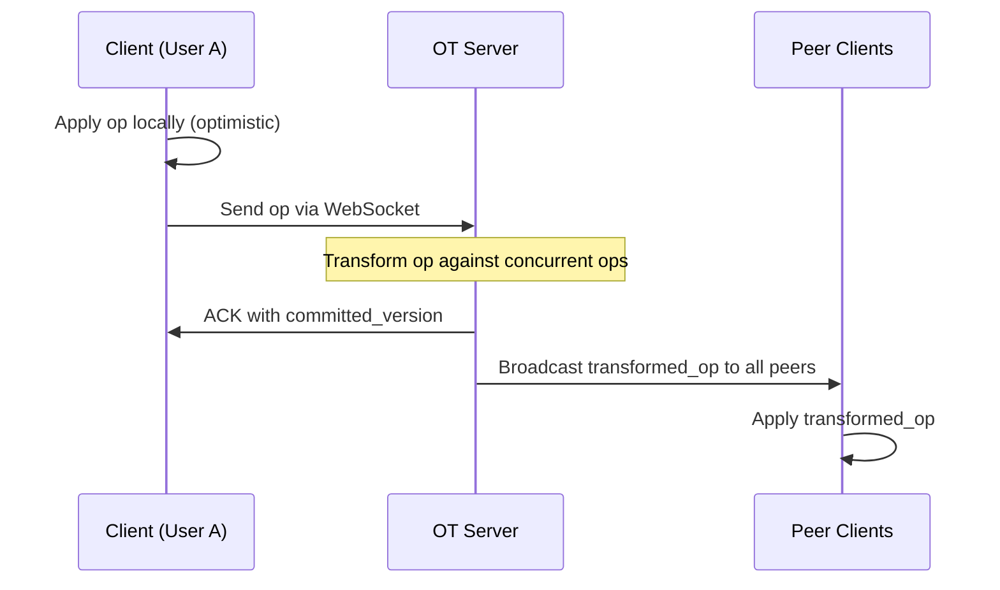

The client applies the operation to its local document model **before** the operation reaches the server. The user sees their keystroke reflected in the UI with zero network latency. If the server later transforms the operation, the client reconciles silently.

> [!NOTE]
> **Key Insight:** The client applies the operation locally BEFORE the server ACK. This is what makes Google Docs feel instant. In a chat app, the message is stored server-side first. In a text editor, visual latency matters more than consistency — you must feel that your keystroke registered immediately.

#### Reliable Path (Durability-Optimized)

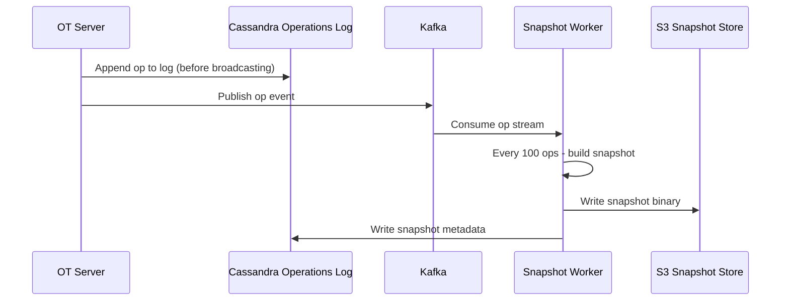

The OT Server writes the operation to Cassandra **before** broadcasting to peers. If the server crashes mid-broadcast, operations are never lost — they are replayed from the log on reconnect. The Kafka stream drives background snapshot creation without blocking the critical path.

**Reconnect flow:**
1. Client reconnects with `last_applied_version = 142`
2. Server queries Cassandra: all ops for doc_id X where version > 142
3. Server sends missed operations to client
4. Client applies them in order, transforming against any pending local ops

**Key difference from chat systems:** In Google Docs, the CLIENT applies the operation before the server ACK. In a chat app, the server stores the message first. This reflects the priority difference — in docs, visual latency matters more than consistency; in chat, message durability matters more than render speed.

---

### 6.4 Versioning (Operations Log + Snapshots = Event Sourcing)

> [!NOTE]
> **Key Insight:** Google Docs versioning is identical to the Event Sourcing pattern. The Operations Log is the event store. Document snapshots are materialized views. To reconstruct any historical state: fetch the nearest snapshot before the target version, then replay operations forward.

#### Operations Log Schema (Cassandra)

```
Table: document_operations

Partition key:  doc_id          UUID
Clustering key: version         BIGINT  (ascending)

Columns:
  op_type     TEXT        -- "insert" | "delete"
  position    INT
  content     TEXT        -- character(s) inserted
  user_id     UUID
  client_id   UUID
  timestamp   TIMESTAMP
```

**Why Cassandra?**
- **Append-only write pattern** — operations are never updated, only inserted. Cassandra's LSM-tree is optimized for append-heavy workloads.
- **Partition by doc_id** — all operations for a document are co-located on the same partition, enabling fast sequential reads for replay.
- **High write throughput** — Cassandra handles millions of writes/sec natively with tunable consistency.

#### Snapshot Lifecycle

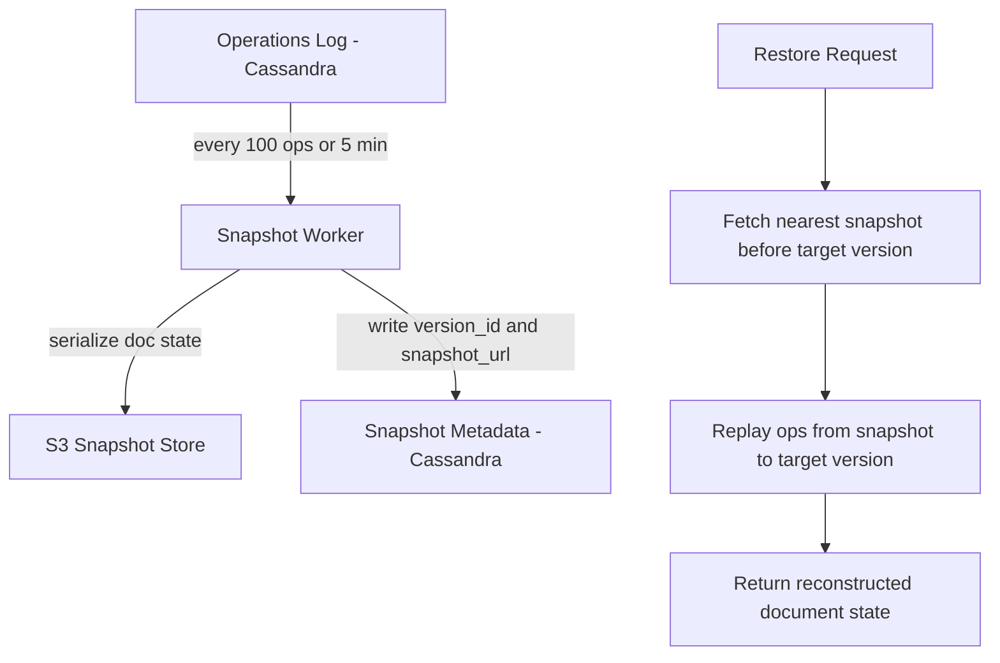

#### Version Restore Algorithm

```
1. User requests restore to version V
2. Query: SELECT MAX(snapshot_version) WHERE doc_id = X AND snapshot_version <= V
3. Fetch snapshot binary from S3 (via CDN if recent)
4. Query: SELECT op FROM document_operations
          WHERE doc_id = X
            AND version > snapshot_version
            AND version <= V
5. Apply each operation in order to the snapshot base state
6. Return reconstructed document
```

**Storage optimization:** Raw operations are retained for 30 days. After 30 days, old operations are compacted — the snapshot becomes the source of truth and individual ops are deleted. Users can still view the version (via snapshot) but cannot replay individual keystrokes.

#### Version Table Schema (Cassandra)

A separate table tracks every named version and auto-snapshot for a document. This is what populates the version history UI ("File → Version History").

```
Table: document_versions

Partition key:  doc_id          UUID
Clustering key: version_id      BIGINT   (auto-incrementing, e.g. 10, 10.1, 11)

Columns:
  snapshot_url  TEXT        -- S3 path to the serialized document binary
  created_by    UUID        -- user_id who triggered the save (or "system" for auto-save)
  created_at    TIMESTAMP
  label         TEXT        -- optional human name, e.g. "Before big rewrite"
  is_major      BOOLEAN     -- true = user-named; false = auto-save minor version
```

**Minor vs major versions:**
- **Minor versions** (is_major=FALSE): created every 10–20 seconds by auto-save during an active editing session. Purely intermediate state.
- **Major versions** (is_major=TRUE): created by manual "Save version" or by the reconciliation job at session end.

#### Session-End Reconciliation Job

The transcript's most operationally important insight: auto-saving every 10–20 seconds creates *many* intermediate minor versions and retains every op event in the ops DB. Left uncleaned, a busy document accumulates thousands of minor versions and millions of stored ops. The **reconciliation job** (a background worker triggered when the last user leaves a document) collapses all of this:

```
Trigger: last WebSocket connection for doc_id closes (TTL on Redis canonical copy expires)

Step 1: Fetch the base version (the last major snapshot) from S3
Step 2: Fetch all operation events since that base version from the ops DB
Step 3: Re-apply every operation to the base state → produce the final document state
Step 4: Write this as one new major version (e.g. 10 → 10.1) to S3
Step 5: Update document_versions table with the new major version row
Step 6: Send event to Kafka → metadata consumer updates documents.blob_url to new S3 path
Step 7: DELETE all intermediate minor version rows from document_versions
Step 8: DELETE all operation events for this session from document_operations

Net result: the session's entire edit history collapses into one committed major version.
            S3 is clean; ops DB is clean; metadata DB points to the latest canonical file.
```

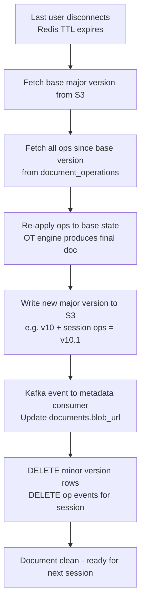

> [!IMPORTANT]
> **Why this matters for the interview:** Without this job, every document accumulates unbounded minor versions in S3 and unbounded op events in Cassandra. The reconciliation job is what keeps storage costs linear with the number of *editing sessions*, not with the number of *keystrokes*. It's the same "merge and compact" pattern as LSM-tree compaction — you buffer writes cheaply and pay the merge cost once at session end.

> [!NOTE]
> **Key Insight:** The reconciliation job is the session boundary. It is what converts the live in-progress state (Redis canonical copy + ops DB events) into durable committed history (a single S3 major version). Without it, Redis TTL just expires and the intermediate work is orphaned.

---

### 6.5 Cursor and Presence

Cursor state is ephemeral — it has a natural expiry when the user stops moving or disconnects. Storing cursor positions in a relational database would add unnecessary write amplification for data that expires within seconds.

#### Cursor Flow

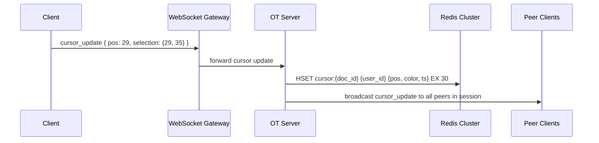

#### Redis Cursor Schema

```
Key:   cursor:{doc_id}
Type:  Hash
Field: {user_id}
Value: { pos: 29, selection: {start: 29, end: 35}, color: "#FF6B6B", ts: 1709123456 }
TTL:   30 seconds (refreshed on each cursor update)
```

> [!NOTE]
> **Key Insight:** Presence is ephemeral — Redis with TTL handles cleanup automatically. When a user disconnects without sending an explicit "offline" event (e.g., browser tab killed), the TTL ensures the cursor entry expires within 30 seconds. Storing cursor/presence state in PostgreSQL would require a background cleanup job to purge stale rows. Redis TTL is the correct primitive for data with natural expiry.

#### Presence State Machine

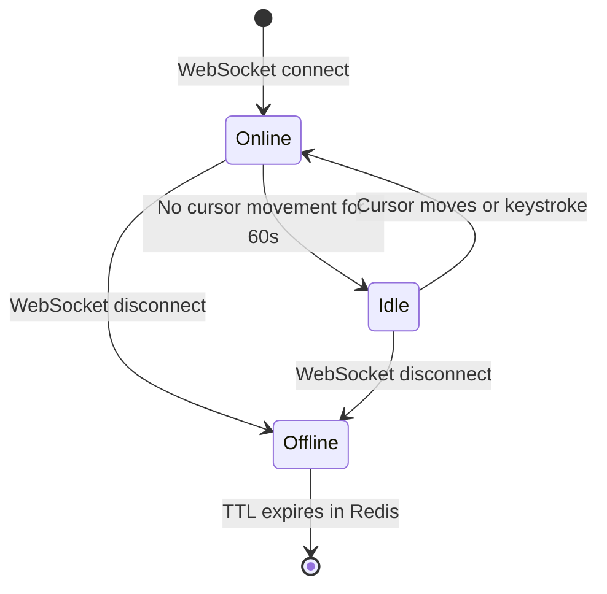

---

### 6.5b Redis Dual Role — Cursors AND Canonical Document State

Redis serves two distinct roles in this system. Section 6.5 above covers cursors and presence. The second role — **canonical live document state** — is equally critical and often missed.

#### The Problem It Solves

When User B joins a document that User A has been editing for 10 minutes, the S3 snapshot is stale (last written 10 minutes ago). The ops DB has 3,000 events since then. Replaying 3,000 ops to reconstruct current state on every new join is too slow (~seconds).

Solution: **the document editor service loads the document from S3 into Redis on first access, then applies every subsequent op to the Redis copy in memory.** The Redis copy is always current. Any new joiner gets the Redis copy instantly — no op replay needed.

#### Redis Canonical Document Schema

```
Key:   doc:{doc_id}:canonical
Type:  String (serialized document state — JSON or binary)
TTL:   Set when last user disconnects (e.g. 30 minutes idle grace)

Populated: on first WebSocket connection for doc_id
           (load from S3 → deserialize → store in Redis)

Updated:   on every committed op (OT Server applies transformed op to Redis copy)

Evicted:   when TTL expires → triggers reconciliation job
           (session end → Redis canonical → final S3 version)
```

#### Session Lifecycle with Redis

```
1. First user opens document
   → OT Server: GET doc:{doc_id}:canonical → cache miss
   → Fetch latest snapshot from S3 → load into Redis
   → Set TTL = 30 min (refreshed on each op)

2. User edits
   → Op arrives → OT Server transforms → appends to Cassandra ops log
   → OT Server applies transformed op to Redis canonical copy
   → OT Server broadcasts to all connected peers

3. Second user joins mid-session
   → OT Server: GET doc:{doc_id}:canonical → cache hit (instant)
   → Return current document state directly from Redis
   → No S3 fetch, no op replay, no latency spike

4. Auto-save (every 10–20 seconds)
   → OT Server serializes Redis canonical copy → writes to S3 as minor version
   → Refreshes TTL on Redis key

5. Last user disconnects
   → TTL on Redis canonical key expires (or is set short)
   → Reconciliation job fires: Redis state → ops replay → final major S3 version
   → Redis key deleted
```

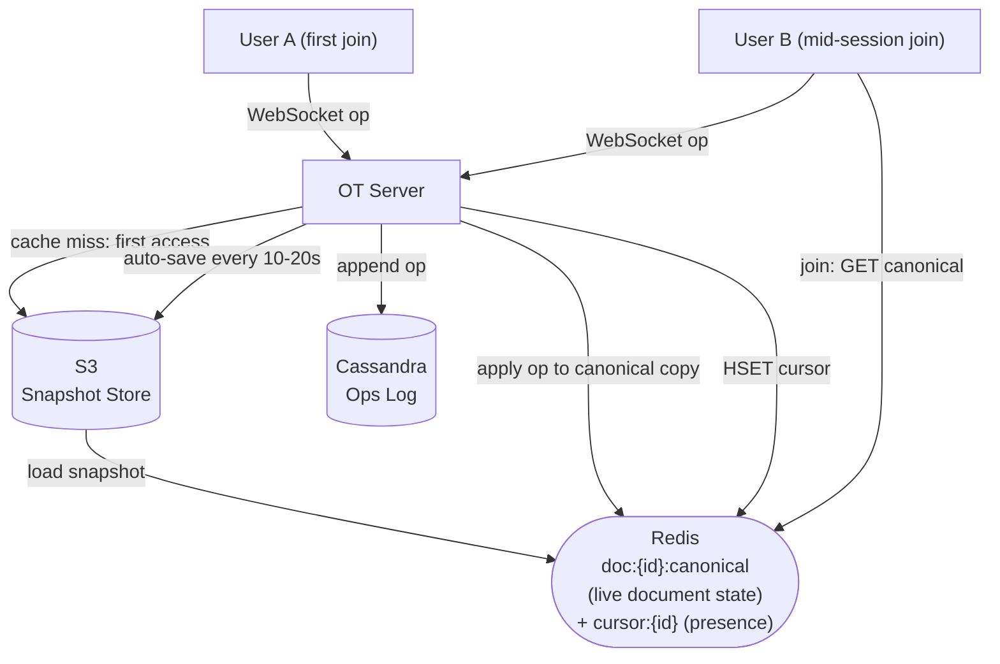

> [!IMPORTANT]
> **Redis holds two fundamentally different types of data in this system:**
> - `doc:{id}:canonical` → the **live document content** (hot, session-scoped, evicted at session end, triggers reconciliation)
> - `cursor:{id}` → **ephemeral user state** (per-user, 30-second TTL, safe to lose on Redis failover)
>
> Losing the canonical copy on Redis failover is recoverable — re-load from S3 + replay ops since last auto-save (at most 10–20 seconds of ops). Losing cursors is a non-event — clients re-send position on next keystroke.

> [!NOTE]
> **Key Insight:** Redis is not just a cache here — it is the **active working surface** for collaborative editing. The OT engine operates on the Redis copy, not on S3. S3 is the durable checkpoint. Redis is the whiteboard everyone is writing on right now.

---

### 6.6 Document Metadata Schema (PostgreSQL)

The metadata service stores the "what exists" layer — document identity, ownership, permissions, and snapshot pointer. This is relational data with ACID requirements (permission changes must not partially apply; a shared document must appear for both owner and collaborator atomically).

> [!NOTE]
> **Key Insight:** Metadata DB is PostgreSQL, not Cassandra. Metadata operations (create, rename, share, delete) are low-frequency and relational — permissions require JOIN, quota requires aggregation, ownership transfer requires a transaction. Cassandra is for the ops log (append-only, 5M writes/sec). Metadata writes are orders of magnitude less frequent and need ACID — wrong fit for Cassandra.

```sql
-- Document identity and state
CREATE TABLE documents (
  doc_id            UUID PRIMARY KEY DEFAULT gen_random_uuid(),
  title             VARCHAR(255)  NOT NULL DEFAULT 'Untitled document',
  owner_id          UUID          NOT NULL REFERENCES users(user_id),
  blob_url          TEXT,                      -- S3 URL of latest snapshot binary
  current_version   BIGINT        NOT NULL DEFAULT 0,  -- latest committed op version
  created_at        TIMESTAMP     NOT NULL DEFAULT NOW(),
  created_by        UUID          NOT NULL REFERENCES users(user_id),
  last_modified_at  TIMESTAMP     NOT NULL DEFAULT NOW(),
  last_modified_by  UUID          REFERENCES users(user_id),
  is_deleted        BOOLEAN       NOT NULL DEFAULT FALSE,
  deleted_at        TIMESTAMP
);

-- Sharing and permissions
CREATE TABLE document_collaborators (
  doc_id      UUID        NOT NULL REFERENCES documents(doc_id),
  user_id     UUID        NOT NULL REFERENCES users(user_id),
  permission  TEXT        NOT NULL CHECK (permission IN ('owner','editor','viewer','commenter')),
  added_at    TIMESTAMP   NOT NULL DEFAULT NOW(),
  added_by    UUID        REFERENCES users(user_id),
  PRIMARY KEY (doc_id, user_id)
);

-- Indexes
CREATE INDEX ON documents (owner_id);
CREATE INDEX ON documents (last_modified_at DESC) WHERE is_deleted = FALSE;
CREATE INDEX ON document_collaborators (user_id);   -- "show all docs shared with me"
```

**Operations map to simple SQL:**

| User action | What actually happens |
|---|---|
| Create document | `INSERT INTO documents` — metadata row + empty snapshot in S3 |
| Rename document | `UPDATE documents SET title='...' WHERE doc_id=X` — no bytes moved |
| Share with user | `INSERT INTO document_collaborators (doc_id, user_id, permission='editor')` |
| Revoke access | `DELETE FROM document_collaborators WHERE doc_id=X AND user_id=Y` |
| Delete document | `UPDATE documents SET is_deleted=TRUE, deleted_at=NOW()` (soft delete) |
| "My Drive" view | `SELECT * FROM documents WHERE owner_id=me AND is_deleted=FALSE` |
| "Shared with me" | `SELECT d.* FROM documents d JOIN document_collaborators dc ON d.doc_id=dc.doc_id WHERE dc.user_id=me` |

**What `blob_url` and `current_version` track:** Every time the Snapshot Worker compacts N operations into a new snapshot, it updates `blob_url` (new S3 path) and `current_version` (the version number the snapshot represents). When a client opens a document, it fetches the snapshot at `blob_url` via CDN, then requests ops from `current_version + 1` forward from the operations log to apply any uncommitted deltas.

---

## 7. ⚖️ Key Trade-offs

### Trade-off 1: OT vs CRDT

| Aspect | OT | CRDT |
|---|---|---|
| Control | Centralized — one server imposes total order | Distributed — peers merge independently |
| Complexity | Medium — transform function per op-type pair | High — tombstoning, compaction, vector clock GC |
| Ordering | Required — server version number is the total ordering | Not required — operations are commutative by design |
| Offline support | Hard — server reconciliation required on reconnect | Native — any peer merges any op set in any order |
| Data structures | Linear text only — transform rules don't generalize | Arbitrary — Automerge handles JSON trees, shapes |
| Integration with auth/versioning | Natural fit — central server already exists | Requires retrofitting — designed for no-server topologies |
| Tombstone overhead | None | Required — deleted chars stay as markers until GC |

**Chosen for this design: OT.**
One-line reason: a central server is already required for access control, versioning, and billing — OT's single-ordering-point requirement is not an additional constraint. CRDT's primary advantage (no central server) is irrelevant when the central server already exists.

---

#### Where to Use OT vs CRDT vs Both — The Honest Answer

> [!IMPORTANT]
> **Google Docs historically used OT (Google Wave / Jupiter algorithm, 2009). Whether the current production system uses pure OT, CRDT, or a hybrid is not publicly confirmed by Google.** The original design is well-documented. The current design at Google's scale — billions of documents, offline Android/iOS apps, multi-region — may have evolved. Claiming certainty either way is incorrect.

| Use Case | Right Choice | Reason |
|---|---|---|
| Real-time online collaborative editing, < 100ms latency | OT | Central server already exists; low complexity; fast path |
| Mobile offline editing (hours or days offline) | CRDT | Reconnect reconciliation without server round-trip; offline ops merge natively |
| Multi-region active-active (no single "home" region) | CRDT | OT's single ordering server becomes a cross-region bottleneck |
| Structured data (shapes, JSON trees, embedded objects) | CRDT (Automerge-style) | OT transform functions don't generalize beyond linear text |
| Comments, suggestions, presence metadata | CRDT or last-write-wins | Not linear text; central ordering less critical |
| Short offline windows (< 1 min), server always reachable | OT | Reconnect is a simple log catch-up; CRDT overhead not justified |

**Can Google use both?** Yes — and this is the likely direction at scale:

```
Layer 1: Real-time online editing (happy path)
  → OT Server handles the live session
  → All clients connected → central ordering → < 100ms latency

Layer 2: Offline / multi-device reconciliation (cold path)
  → Mobile app goes offline for hours
  → On reconnect: large divergence window → CRDT-style merge
  → Treat offline edits as concurrent CRDT ops; server applies merge rules

Layer 3: Structured content (comments, embedded objects, JSON)
  → These are not linear text — OT transform rules don't cover them
  → JSON CRDT (Automerge) handles arbitrary data structures natively
```

This is a **hybrid architecture**: OT for the hot real-time path, CRDT for the cold/offline path and non-text data. Neither algorithm alone handles all cases at Google's scale and product surface.

| Signal | Choose OT | Choose CRDT |
|---|---|---|
| Server topology | Central server already exists | Peer-to-peer or multi-master |
| Offline window | Short (seconds to minutes) | Long (hours, days, mesh networks) |
| Data model | Linear text | Arbitrary structures (JSON, vector graphics) |
| Team / maintenance | Small team, correctness priority | Large infra team comfortable with compaction and GC |
| Real-world: text editors | Google Docs (historically), Notion, Quip | VS Code Live Share (Yjs), GitHub Copilot Workspace (Automerge) |

> [!IMPORTANT]
> OT = simpler but centralized. CRDT = distributed but carries tombstone and compaction cost.
> The correct answer in an interview is not "use OT" or "use CRDT" — it is: "OT for the real-time hot path where a central server already exists; CRDT for offline reconciliation and non-text structured data where distributed merge is genuinely required."

> [!NOTE]
> **Key Insight:** The reason to know CRDT deeply is not to argue for replacing OT. It is to design the offline and structured-data layers correctly — the layers where OT's central ordering requirement becomes a bottleneck rather than a free constraint.

---

### Trade-off 2: WebSocket vs HTTP Long-Polling vs SSE

| Dimension | WebSocket | Long-Polling | SSE |
|---|---|---|---|
| Bidirectional | Yes | Simulated (2 connections) | No (server-to-client only) |
| Latency | Lowest — persistent connection | High — new HTTP request per message | Low — persistent, but client cannot push |
| Infrastructure complexity | Sticky routing required; stateful | Stateless — any node | Stateless |
| Real-time op delivery | Native | Possible but wasteful | Cannot receive client ops |

**Chosen: WebSocket.**
One-line reason: collaborative editing requires both the client pushing operations and the server pushing transforms — true bidirectional communication is mandatory.

> [!NOTE]
> **Key Insight:** The WebSocket sticky routing requirement (each client for a doc_id must connect to the same OT Server node) is a direct consequence of OT's single-ordering-point requirement. It is not a weakness of WebSocket — it is the architecture expressing the correctness constraint of OT.

---

### Trade-off 3: Delta Operations vs Full Document Replacement

| Dimension | Delta Operations | Full Document Replacement |
|---|---|---|
| Payload size | ~200 bytes per op | ~50 KB per keystroke |
| Concurrent edit safety | OT/CRDT ensures convergence | Last-writer-wins — silent data loss |
| Network throughput at 1M editors | ~1 GB/sec (manageable) | ~250 TB/sec (catastrophic) |
| Reconnect catch-up | Replay missed ops from log | Fetch current document snapshot |

**Chosen: Delta operations.**
One-line reason: full document replacement causes both catastrophic bandwidth usage and silent data loss under concurrent edits.

---

### Trade-off 4: At-Least-Once vs Exactly-Once Delivery

| Dimension | At-Least-Once | Exactly-Once |
|---|---|---|
| Complexity | Low | High — requires distributed transactions |
| Risk | Duplicate operations (detectable) | None |
| Mitigation | Idempotency via client_id + version dedup | Not needed |
| Latency impact | Minimal | Adds 2PC overhead on critical path |

**Chosen: At-least-once with idempotency.**
One-line reason: exactly-once delivery requires 2PC or Saga patterns that add latency on the critical edit path. Deduplicating by `(client_id, version)` on the OT server catches all duplicates at negligible cost.

> [!NOTE]
> **Key Insight:** At-least-once delivery is safe in OT because each operation carries a `version` and `client_id`. The OT server detects and drops duplicates in O(1) using a Redis SET with TTL. The operations log in Cassandra provides the durable deduplication record for longer windows.

---

## 8. Interview Summary

### Decision Table

| Decision | Problem It Solves | Trade-off Accepted |
|---|---|---|
| Delta operations (not file replacement) | Catastrophic bandwidth; concurrent write data loss | Requires conflict resolution algorithm |
| Operational Transformation (OT) | Concurrent edits produce divergent documents | Requires single central ordering server per document |
| WebSocket (not HTTP) | Server must push transformed ops to all peers | Sticky routing required; stateful infrastructure |
| Cassandra for operations log | 5M writes/sec; append-only; partition by doc_id | Eventual consistency on reads (acceptable for log replay) |
| Redis canonical doc copy (session-scoped) | New joiners get current state instantly; no op replay on join | Recoverable on failover — reload S3 + replay ≤20s of ops |
| Redis for cursors/presence with TTL | Cursor data is ephemeral; DB writes would be wasteful | Not durable — cursor state lost on Redis failover (acceptable) |
| Session-end reconciliation job | Collapses unbounded minor versions + op events into one major S3 version | Runs async; small window where intermediate state is in Redis only |
| S3 + CDN for document snapshots | Fast initial load for large documents; CDN caches globally | Eventual consistency between snapshot and live ops |
| Optimistic local apply | Users must feel keystrokes are instant | Client must handle rollback if server rejects op (rare) |
| Kafka for snapshot pipeline | Decouple snapshot creation from OT critical path | Small lag between committed ops and snapshot availability |

### Mental Model Summary

Google Docs is a two-path system. The **fast path** optimistically applies every keystroke locally, ships it over a persistent WebSocket to an OT Server that transforms it against any concurrent operations, then fans it out to all collaborators. The **reliable path** appends every operation to an immutable Cassandra log before the ACK is sent, enabling replay, versioning, and reconnect recovery. The hardest problem is concurrent edit reconciliation: OT requires a single central server to serialize operations and apply transformation functions that adjust character positions across all concurrent operations. Cursor positions are ephemeral and stored in Redis with TTL. Document history is event-sourced: snapshot + operation replay reconstructs any historical state.

### Key Insights Checklist

- **OT requires a single central server per document** — this is a correctness requirement, not an architectural weakness. Without a single ordering point, two nodes could transform the same concurrent ops in different orders, producing permanently divergent documents.
- **The client applies keystrokes locally before the server ACK** — this optimistic apply is what makes Google Docs feel instant. The server transforms and confirms asynchronously; the client reconciles silently.
- **OT for the hot path, CRDT for the cold path** — OT is right for real-time editing where a central server already exists. CRDT is right for long offline windows, multi-region without a home region, or non-text structured data (JSON, shapes). Google's production system likely uses both. Neither algorithm alone handles all cases at scale.
- **CRDT merge works by unique IDs, not integer positions** — each character gets a permanent unique identity. An op says "insert after id=X", not "insert at position N". Positions shift; IDs don't. This is why CRDT needs no server to resolve conflicts — the merge is self-describing.
- **CRDT's hidden cost is tombstoning** — deleted characters cannot be physically removed until every peer confirms the deletion. Heavily-edited documents accumulate invisible tombstones that require periodic compaction. OT has no tombstoning because the server is always the authority — deletion is final immediately.
- **Cursor data belongs in Redis, not a database** — it is ephemeral, high-frequency, and has a natural TTL. Storing it in PostgreSQL or Cassandra would add write amplification for data that expires in 30 seconds anyway.
- **Redis serves two roles: canonical doc state AND cursors** — `doc:{id}:canonical` holds the live working document (session-scoped, evicted at session end). `cursor:{id}` holds ephemeral user positions. Losing the canonical copy is recoverable (re-load S3 + replay ≤20s of ops). Losing cursors is a non-event (clients re-send on next keystroke).
- **The reconciliation job is the session boundary** — when the last user disconnects, the job re-applies all session ops to the base version, writes one final major version to S3, and deletes all intermediate minor versions and op events. Without it, storage grows with every keystroke, not every session.
- **CRDT fractional indexing = interview-friendly mental model** — characters get fractional positions (B=0.5, C=0.75); insert between two chars by picking a value in the gap. Merge = sort by position value. No server needed. Same convergence guarantee as ID-anchor CRDT, simpler to draw.
- **Versioning is event sourcing** — the operations log is the event store; snapshots are materialized views. Restore = nearest snapshot + operation replay. This pattern provides both durable history and efficient current-state access.

---

# Frontend Notes: Google Docs

**Complexity split: Backend 65%, Frontend 35%**

The backend carries the majority of the design weight: OT engine correctness, operations log durability, WebSocket fan-out, and snapshot management. However, the frontend in Google Docs is significantly more complex than a typical web application. The client runs a partial OT engine, manages an optimistic local document model, handles offline buffering, and renders collaborative cursors in real time. These are non-trivial engineering problems that warrant dedicated discussion in a system design interview.

---

## F1: Client-Side OT (The Hardest Frontend Problem)

The client is not a passive receiver of server operations. It runs its own OT transformation engine to reconcile incoming remote operations against locally pending (not-yet-ACKed) operations.

**Why this is necessary:**

Suppose the client sends op A to the server. While waiting for the ACK, the user types op B locally. Before the server ACKs A, a remote op C arrives from another collaborator. C was generated against the server's state before A was committed. But locally, the document already has A and B applied. The client must transform C against both A and B before applying it — otherwise C will be applied at the wrong position.

**Client OT State Machine:**

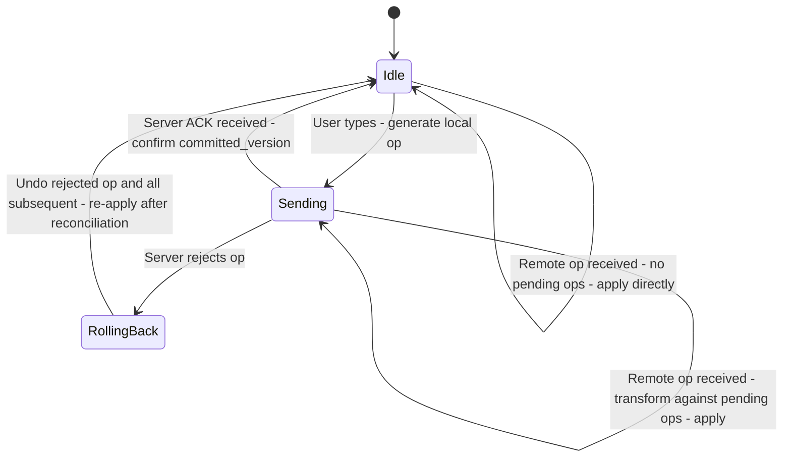

**State variables maintained by the client:**

```
local_doc:       Current in-memory document model (all local ops applied)
committed_doc:   Last server-confirmed document state
pending_ops:     Queue of ops sent but not yet ACKed by server
buffered_ops:    Ops typed while previous op is in-flight
local_version:   Client's current version count
server_version:  Last confirmed server version
```

**Incoming remote op processing:**

```
function applyRemoteOp(remote_op):
    // remote_op was generated against server_version V
    // pending_ops contains all local ops with version > V
    transformed = remote_op
    for each pending_op in pending_ops:
        transformed = transform(transformed, pending_op)
    apply(transformed, local_doc)
    // adjust all collaborator cursors for this operation
    for each cursor in remote_cursors:
        cursor.pos = transformPosition(cursor.pos, transformed)
```

> [!NOTE]
> **Key Insight:** The client OT engine transforms incoming remote ops against the client's pending (unACKed) local ops — not against all local ops. Only unACKed ops are "invisible" to the server. ACKed ops are already reflected in the server's state and thus in the remote op's base version.

---

## F2: Offline Editing

Google Docs supports continued editing when the network is unavailable. The client buffers operations locally and synchronizes on reconnect.

**Offline flow:**

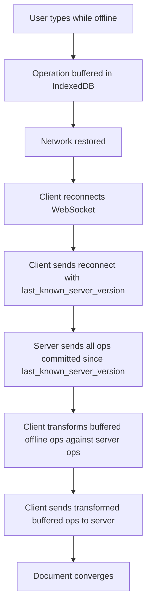

**IndexedDB schema for offline buffer:**

```
Store: offline_ops
  doc_id:     String
  op:         Object (full operation delta)
  local_seq:  Number (local ordering)
  timestamp:  Number
```

**Reconnect reconciliation:** On reconnect, the server may have received operations from other collaborators during the offline period. The client's buffered ops must be transformed against all server ops that committed during the offline window. This is the same transform logic as online — the only difference is that the gap between `last_known_server_version` and `current_server_version` may be large.

> [!NOTE]
> **Key Insight:** Offline editing is where CRDT has a natural advantage — CRDTs merge offline changes without a server round-trip. With OT, the server must be involved in reconciling offline ops. For Google Docs (which already has a central server), this is acceptable. The reconnect transform is the same algorithm as normal online operation, just with a larger operation gap.

---

## F3: Cursor Rendering

Rendering collaborative cursors involves three problems: position tracking, color assignment, and position adjustment when remote operations arrive.

**Color assignment:** On WebSocket session join, the server assigns a unique color per `(user_id, doc_id, session)`. The color is consistent across all clients in the session — all users see Alice's cursor as the same color.

**Cursor DOM rendering:**

```
- Each collaborator's cursor is an absolutely-positioned CSS pseudo-element
- Cursor position = character offset in the ProseMirror / Quill document model
- Name label floats above the cursor line (CSS tooltip, hidden after 3s of inactivity)
- Selection ranges rendered as semi-transparent background color fills
```

**Cursor position adjustment on remote op:**

```
function adjustCursorsForOp(op, cursors):
    for each (user_id, cursor) in cursors:
        if op.type == "insert" and cursor.pos >= op.pos:
            cursor.pos += 1
        if op.type == "delete" and cursor.pos > op.pos:
            cursor.pos -= 1
        if op.type == "delete" and cursor.pos == op.pos:
            cursor.pos = op.pos   // cursor collapses to deletion point
```

**Debouncing:** Cursor position updates are debounced to 50ms before sending to the server. At 5 collaborators each moving cursors continuously, this keeps cursor broadcast traffic under 100 messages/sec — negligible compared to operation traffic.

---

## F4: Optimistic UI and Rollback

**Optimistic apply** means the client mutates the local document model immediately on every keystroke, without waiting for the server to ACK the operation. The user sees their change reflected in under 1ms (local JS execution) rather than in 50-100ms (network round-trip).

**Rollback (rare):**

The server can reject an operation if:
- The operation's base version is too old (client was offline too long and the transform gap is unresolvable)
- The user lost editing permission mid-session
- A server-side validation failure (e.g., document size limit exceeded)

On rejection:

```
1. Remove rejected op from pending_ops
2. Undo all local ops applied after the rejected op (in reverse order)
3. Apply the server's authoritative state
4. Re-apply any subsequent buffered ops that are still valid
5. Display subtle "sync error" indicator if reconciliation fails
```

In practice, rollback is extremely rare (less than 0.01% of operations). The architecture optimizes for the 99.99% case where the op is accepted and the ACK arrives within 100ms.

> [!NOTE]
> **Key Insight:** Optimistic UI requires a local undo stack that is separate from the user-facing Ctrl+Z undo history. The internal rollback stack tracks unACKed ops for reconciliation purposes. The user-facing undo history tracks logical editing intent. Conflating them would cause Ctrl+Z to undo server reconciliation adjustments that the user never consciously made.
