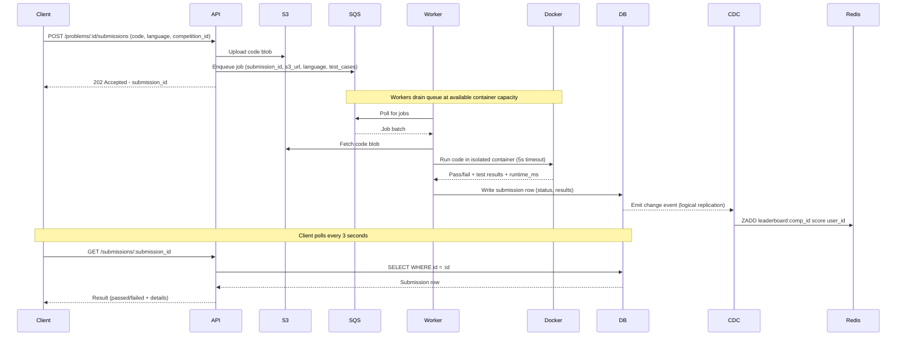
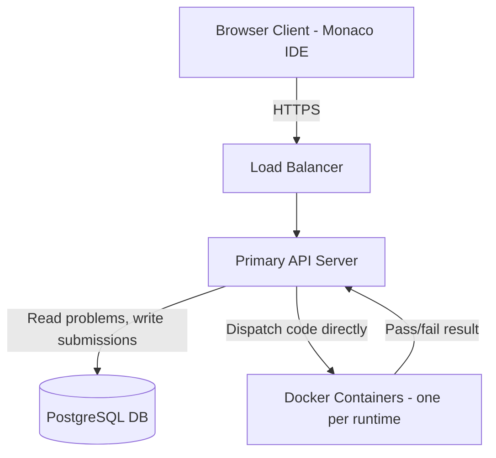
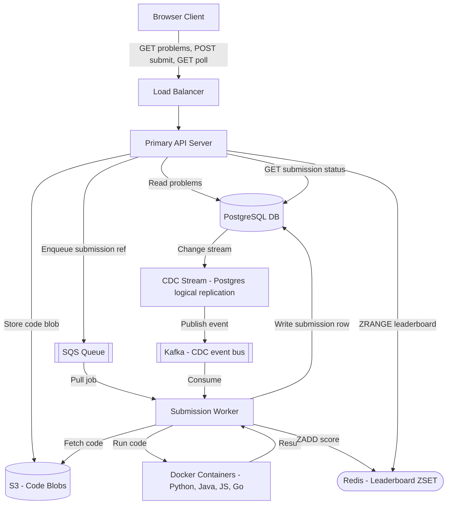
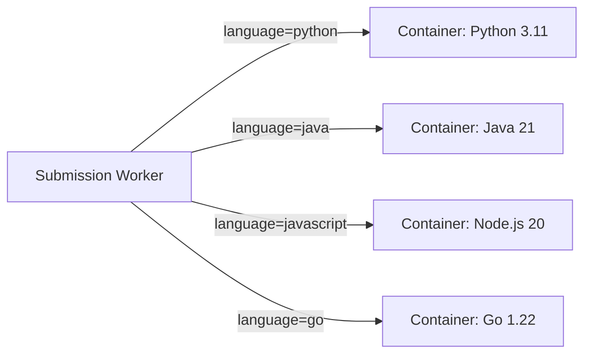
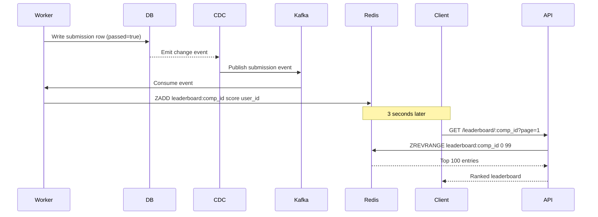

# System Design: LeetCode / Online Judge

---

## 1. Problem + Scope

Design LeetCode — a platform where users browse coding problems, write solutions in a browser IDE, submit code for automated judging, and compete in timed competitions with a live leaderboard. The hard problems are safe untrusted code execution at scale and serving a live aggregated ranking to 100K concurrent users without destroying the database.

**In scope:** Problem catalog (browse, filter, view), code submission and judging, isolated code execution, competition mode with up to 100K participants, near-real-time leaderboard (2–5 second freshness).

**Out of scope:** User authentication, admin tooling for problem creation, discussion forums, subscription/payments.

---

## 2. Assumptions & Scale

**Scale we are designing for:**
- 100,000 DAU (peak = competition day)
- 3,000 problems in catalog
- Competitions: up to 100,000 participants, 90 minutes, 10 problems

**Read QPS:**
- Problem list: 100K users × 10 sessions/day = 1M reads/day → ~12 QPS (trivial, cacheable)
- Problem detail: 100K users × 5 views/day = 500K reads/day → ~6 QPS

**Write QPS (submissions):**
- Normal day: 100K users × 10 submissions/day = 1M/day → ~12 writes/sec
- Competition average: 100K users over 90 min → ~18 submissions/sec
- Competition end-of-round burst: final 10 min → **500–1,000 submissions/sec**

**Leaderboard read QPS:**
- 100K users polling every 3 seconds = **~33,000 leaderboard reads/sec** during competition
- This cannot touch the database — must be served from Redis

**Storage:**
- 3,000 problems × 50KB avg = ~150MB (trivial)
- Submissions: 1M/day × 5KB avg = 5GB/day → ~1.8TB/year (PostgreSQL + cold archival)
- Code blobs: S3, no size concern at this scale

> [!NOTE]
> **Key Insight:** The leaderboard read volume (33K QPS) is 1,000x the write volume. The problem is not writes — it is serving aggregated read results at scale without re-computing on every request.

*These numbers drive the following decisions: queue before execution (burst absorption), Redis sorted set for leaderboard (33K QPS from memory), S3 for code blobs (SQS message size limit), Docker warm pool (low startup latency at high throughput).*

---

## 3. Functional Requirements

1. Users can browse a paginated, filterable problem list (by difficulty, category)
2. Users can view a full problem with description, code stubs per language, and sample test cases
3. Users can write code in a browser IDE (Monaco) and submit for judging
4. Submissions return pass/fail with per-test-case outcomes and runtime metrics
5. Users can join a competition; accepted submissions count toward a live leaderboard
6. Users can view the competition leaderboard with near-real-time updates during the contest

---

## 4. Non-Functional Requirements

| Requirement | Target |
|---|---|
| Availability | AP — eventual consistency acceptable; site must stay up for 100K concurrent users |
| Code execution security | Full isolation from host OS, DB, and network per submission |
| Submission throughput | Handle 500–1,000 submissions/sec burst without dropping any |
| Leaderboard freshness | 2–5 second update interval during competition |
| Submission result latency | Result visible within ~10 seconds of submit |
| Durability | No submission silently dropped; queue provides persistence |

**Consistency Model:**

| Domain | Consistency | Justification |
|---|---|---|
| Submission result (DB) | Strong | User must see their own result correctly |
| Leaderboard (Redis) | Eventual (~ms CDC lag) | Stale for milliseconds is acceptable |
| Problem catalog (cache) | Eventual (minutes) | Problems rarely change; cache TTL is fine |

---

## 🧠 Mental Model

LeetCode is a code execution pipeline wrapped around a problem catalog. Three flows define the system: users browse problems (simple read-heavy), submit code for judging (async queue + isolated container), and compete with a live leaderboard (Redis sorted set updated via CDC). The hardest part is not storing problems — it is safely running untrusted code at scale and serving an aggregated leaderboard to 33K concurrent readers without touching the database on every request.

```
                   ┌──────────────────────────────────────────────────────────────┐
                   │                      FAST PATH (Submit)                       │
 ┌────────┐ POST  │  ┌────────┐  enqueue  ┌────────┐  dispatch  ┌─────────────┐ │
 │ Client │──────►│  │  API   │──────────►│  SQS   │───────────►│ Worker +    │ │
 │(Monaco)│       │  │ Server │           │ Queue  │            │ Docker      │ │
 └────┬───┘       │  └────────┘           └────────┘            │ Container   │ │
      │  GET/poll │                                              └──────┬──────┘ │
      │◄──────────│────────────────────────────────────────────────────│        │
      │           │                                               write │ result │
      │           └────────────────────────────────────────────────────┼────────┘
      │                                                                 │
      │           ┌─────────────────────────────────────────────────────▼────────┐
      │           │                  RELIABLE PATH (Leaderboard)                  │
      │           │  DB write → CDC → Kafka → Worker → Redis ZADD                │
      │           │  GET /leaderboard → API → Redis ZRANGE → done                │
      └───────────└──────────────────────────────────────────────────────────────┘
```

### ⚡ Core Design Principles

| Path | Optimized For | Mechanism |
|---|---|---|
| Fast Path | Throughput — zero submission drops | SQS queue absorbs burst; 202 Accepted immediately; Docker worker drains at capacity |
| Reliable Path | Leaderboard freshness without DB reads | CDC on PostgreSQL emits events; Kafka consumer does ZADD to Redis sorted set |

---

## 6. API Design

| Method | Path | Description |
|---|---|---|
| GET | /api/v1/problems?difficulty=&tags=&page= | List problems with filters and pagination |
| GET | /api/v1/problems/{id} | Problem detail — description, constraints, examples |
| POST | /api/v1/submissions | Submit code {problem_id, language, code} → returns {submission_id} immediately (async) |
| GET | /api/v1/submissions/{id} | Poll result — status: PENDING / RUNNING / ACCEPTED / WRONG_ANSWER / TLE / MLE |
| GET | /api/v1/leaderboard/{contest_id}?page= | Contest leaderboard — paginated, sorted by score desc |
| POST | /api/v1/contests/{id}/register | Register for a contest |

> [!NOTE]
> **POST /submissions is the most important endpoint — it is intentionally async.** The submission is queued immediately and the client polls GET /submissions/{id} every 3 seconds. This is NOT a design compromise — LeetCode itself works this way. Polling is correct here because execution time is variable (milliseconds to seconds), and WebSocket would be overkill for a single status check.

---

## 7. End-to-End Flow

User submits code → API enqueues → Docker worker judges → client polls for result → leaderboard updates via CDC.

**The story in plain English:**

1. User clicks "Submit" — `POST /submissions {problem_id, language, code}` is sent to the API.
2. API uploads the code blob to S3 — we never store raw code in the database. S3 is cheaper and handles large payloads better.
3. API enqueues a job to SQS: `{submission_id, s3_url, language, test_case_ids}`. Returns `202 Accepted` with `submission_id` immediately — no waiting.
4. Client starts polling `GET /submissions/{id}` every 3 seconds. This is intentional — execution time is variable (ms to seconds), so polling is simpler and correct here. Not a WebSocket — you don't need a persistent connection for a one-time result.
5. A Judge Worker picks up the job from SQS. It fetches the code from S3 and spins up a Docker container with the right language runtime.
6. The container runs the code against all test cases with hard limits: 5 second CPU timeout, 256MB memory cap, read-only filesystem, network disabled. The container is destroyed after execution — no state leaks between submissions.
7. Worker writes the result to PostgreSQL: status (ACCEPTED / WRONG_ANSWER / TLE / MLE), runtime_ms, memory_kb, test case details.
8. PostgreSQL CDC (logical replication) emits the change event to Kafka.
9. A consumer reads the Kafka event and executes `ZADD leaderboard:{contest_id} {score} {user_id}` in Redis. The leaderboard updates without the judge worker needing to know about it.
10. Next poll from the client hits the API → PostgreSQL read → result returned. Client shows the verdict.



---

## 8. High-Level Architecture

### Simple Design



### Evolved Design — Queue, Cache, CDC



---

## 9. Data Model

| Entity | Storage | Key Columns | Why this store |
|---|---|---|---|
| Problems | PostgreSQL | problem_id, title, difficulty, category, description, test_cases | Relational structure; rarely written; cacheable at API layer |
| Submissions | PostgreSQL | submission_id, user_id, problem_id, competition_id, status, passed, runtime_ms, submitted_at | ACID correctness required; source of truth for CDC |
| Code blobs | S3 | s3_key (submission_id), language | Binary blobs; cheap object storage; keeps queue messages small |
| Leaderboard | Redis Sorted Set | key: leaderboard:{competition_id} — member: user_id, score: composite float | O(log n) ZADD and ZRANGE; 33K QPS from memory; no DB at read time |
| Results cache | Redis String | key: result:{submission_id} — value: serialized result | Short TTL (60s); reduces DB polling load during high-traffic contests |
| Problem list cache | Redis / CDN | key: problems:{category}:{difficulty}:{page} | Read-heavy, rarely changes; TTL of minutes is acceptable |

**Composite leaderboard score encoding:**

```
score = problems_solved + (1 / submitted_at_unix_timestamp)
```

More solved problems = higher integer part. Among ties, faster last solve = higher fractional value. Stored as a single float in the sorted set — no recomputation at read time.

---

## 10. Deep Dives

### 7.1 Docker Container Isolation and Security Hardening

Here is the problem we are solving: users submit arbitrary code we have no control over. Running it directly on the API server means malicious code can delete our database, exfiltrate credentials, run crypto miners, or fork-bomb the host. Isolation is a correctness requirement — not an optimization.

**Naive solution:** Spawn a process directly on the API server to execute code. Fails immediately — a single `os.system("rm -rf /")` or infinite loop takes down the entire service.

**VM per execution:** Full OS isolation, maximum security. Problem: VMs take minutes to boot and consume gigabytes of memory. At 500 submissions/sec during a burst, the resource cost is prohibitive.

**Chosen: Docker containers with a warm pool**

One container per supported runtime (Python, Java, JavaScript, C++, Go) kept warm and reused across submissions. Startup is under 100ms for a warm container.



**Security hardening applied inside each container:**

| Control | Implementation | Threat mitigated |
|---|---|---|
| Execution timeout | Kill process after 5 seconds | Infinite loops, TLE |
| CPU limit | Container CPU quota (0.5 vCPU) | Fork bombs, compute exhaustion |
| Memory limit | Container memory cap (256MB) | OOM attacks, unbounded allocations |
| Read-only filesystem | Mount rootfs read-only; /tmp writable only | Persistent malware, filesystem tampering |
| Network isolation | No egress; VPC firewall blocks all outbound | Data exfiltration, reverse shells |
| Syscall filtering | seccomp profile blocks dangerous syscalls | Kernel exploits, privilege escalation |
| No DB access | Containers not in DB subnet | Cannot read or delete user data |

> [!IMPORTANT]
> **Fast Path vs Reliable Path for code execution:**
> - **Fast path:** Warm container picks up job from queue, runs code, writes result — user polls and sees result in ~5–8 seconds.
> - **Reliable path:** If the container crashes mid-execution, the job stays in SQS (visibility timeout not expired). Another worker picks it up and retries. No submission is silently dropped.

> [!NOTE]
> **Key Insight:** Docker containers vs VMs is a resource efficiency trade-off — containers run 10–20x more instances per host. At 100K submissions during a competition, this difference is the gap between affordable and cost-prohibitive.

---

### 7.2 Redis Sorted Set Leaderboard with Composite Score

Here is the problem we are solving: the naive approach queries the submissions table grouped by user, filtered by competition, sorted by score — an aggregation over up to 100K rows. At 33K reads/sec during competition, this query runs constantly. At several seconds of latency per query on PostgreSQL and DynamoDB scan costs, this is both too slow and too expensive.

**Evolution of the leaderboard design:**

Stage 1 — Direct DB aggregation: works at small scale, kills DB at 33K QPS.

Stage 2 — Cache with TTL: run expensive query, cache for 10 seconds. Problem: thundering herd at TTL expiry — all 100K clients hit DB simultaneously when cache expires.

Stage 3 — Cron job refresh: scheduled worker runs query every 10 seconds and overwrites cache. Problem: if cron fails, cache goes stale indefinitely. Query still runs at full cost every 10 seconds.

Stage 4 — Redis Sorted Set (chosen):



**Write path:** Worker writes DB row → CDC emits event → Kafka consumer computes new composite score → `ZADD leaderboard:{competition_id} {score} {user_id}` (O(log n))

**Read path:** API calls `ZREVRANGE leaderboard:{competition_id} 0 99` — O(log n + k) from memory, zero DB queries.

**Why CDC instead of writing directly to Redis from the API server:** if the API server writes DB and then crashes before writing Redis, the leaderboard is permanently stale. CDC makes the Redis update a consequence of the DB write — guaranteed eventual consistency. If Redis goes down, it can be fully rebuilt from the submissions table.

> [!IMPORTANT]
> **CDC over dual writes:** Dual writes create a consistency window — DB updated, Redis not yet. On API server crash that window becomes permanent. CDC closes this gap: Redis is always derived from DB state, never independently written.

> [!NOTE]
> **Key Insight:** Redis sorted set turns a multi-second aggregation query into a sub-millisecond memory lookup. Leaderboard computation moves from read-time to write-time — O(log n) update per submission vs O(n) scan per read. At 33K reads/sec, this is the only viable architecture.

---

### 7.3 Submission Queue Burst Handling

Here is the problem we are solving: at the end of a 90-minute competition, every participant rushes to submit their final solution. A synchronized burst of up to 1,000 submissions/sec arrives. Docker containers have finite capacity — auto-scaling has a 2–5 minute reaction time — a 100K burst is over before new containers are ready.

**Chosen: SQS message queue as an elastic buffer**

The API server enqueues immediately and returns 202 Accepted. Workers drain the queue at available container capacity. The queue absorbs the entire burst; no submission is dropped regardless of the instantaneous spike.

| Without queue | With queue |
|---|---|
| API dispatches directly to containers | API enqueues immediately, returns 202 |
| Container capacity exceeded → 503 dropped | All submissions land in durable queue — zero drops |
| User loses their submission permanently | Worker retries on failure (SQS visibility timeout) |
| Auto-scale lag = lost requests | Auto-scale lag = processing delay, not data loss |

**Handling large code payloads:** SQS has a 256KB message size limit. Code is uploaded to S3 first; the queue message carries only the S3 URL and metadata. Workers fetch code from S3 before dispatching to the container.

**Worker pool sizing heuristic:**
- Each container takes up to 5 seconds per job
- Target burst: 1,000 submissions/sec × 5s = 5,000 concurrent executions needed
- At 10 containers per worker node (with CPU/memory limits): ~500 worker nodes at burst peak
- With queue buffering, pre-scale to 100–200 nodes before competition start; queue absorbs the delta

> [!NOTE]
> **Key Insight:** The queue is a correctness requirement, not a performance optimization. Without it, the end-of-competition surge drops requests. With it, every submission is durable and retryable — the only consequence of insufficient capacity is processing delay, not data loss.

---

## 11. Bottlenecks & Scaling

### Judge Worker Pool Sizing

**What breaks first:** Docker worker capacity — at 1,000 submissions/sec with a 5-second execution time, you need 5,000 concurrent containers. Insufficient workers mean queue depth grows unboundedly.

**Strategy:** Pre-scale worker fleet before competition start based on registered participant count. SQS queue depth is the primary auto-scaling signal — add workers when queue depth exceeds threshold × average processing time.

### Contest Burst Traffic

**What breaks first:** The API server tier and the DB write path under 1,000 submissions/sec.

**Strategy:**
- API servers are stateless — horizontal scale behind load balancer
- DB write path: submissions table write rate of 1,000/sec is within PostgreSQL capacity; partition submissions table by competition_id for large-scale deployments
- Code blobs go to S3 — no DB write pressure from payload storage

### Leaderboard at Scale

**What breaks first:** If Redis is not used, any DB aggregation at 33K QPS kills the primary.

**Strategy:**
- Redis sorted set serves all leaderboard reads from memory
- Redis can handle 100K+ QPS on a single node for ZRANGE operations
- For very large competitions, shard leaderboard by competition_id — each competition maps to its own sorted set key, naturally partitioned
- If Redis fails, fall back to DB query with aggressive caching — degraded freshness is acceptable as a fallback

> [!TIP]
> **Say this out loud:** "The leaderboard is the most read-heavy operation in the system — 33K QPS during competition. I pre-compute the ranking on every write so the read path is a single Redis ZRANGE. No DB involved at read time."

---

## 12. Failure Scenarios

| Failure | Impact | Recovery |
|---|---|---|
| Worker crashes mid-execution | Job still in SQS (visibility timeout not expired) | Another worker picks up and retries; submission eventually processed |
| SQS queue backup | Submissions queue but not yet judged; polling returns pending | Auto-scale workers on queue depth metric; clients see pending state, not errors |
| Redis failure | Leaderboard reads fail; API falls back to DB aggregation query | Degraded freshness (seconds vs milliseconds); Redis rebuilt from DB on restart via replay |
| PostgreSQL primary fails | Submission writes fail; new submissions cannot be stored | Failover to replica promoted as primary (RDS Multi-AZ, ~30–60s); SQS messages wait in queue |
| CDC pipeline lag | Redis leaderboard falls behind DB state by seconds | Clients see slightly stale rankings; self-healing once pipeline catches up |
| Docker container kernel exploit | Attacker escapes container to host | seccomp + read-only rootfs + no-network limits blast radius; incident response isolates host |
| S3 unavailable | Workers cannot fetch code blobs; jobs fail | SQS message not deleted (job fails, requeued); retry when S3 recovers |

---

## 13. Trade-offs

### Docker vs VM vs Lambda for Isolation

| Dimension | Docker Containers | VMs | AWS Lambda |
|---|---|---|---|
| Startup latency | under 100ms (warm) | 1–3 minutes | 1–3s cold start |
| Resource efficiency | High — shared OS kernel | Low — full OS per VM | High — managed |
| Isolation strength | Good — seccomp, namespaces | Maximum — hypervisor | Good — managed sandbox |
| Operational overhead | Medium — manage worker fleet | High — provision VMs | Low — serverless |
| Control over security | Full — seccomp, VPC, FS | Full | Limited — AWS managed |
| Cost at burst scale | Predictable (EC2 fleet) | Expensive (underutilized) | Variable per invocation |

**Chosen:** Docker containers with warm pool. VMs are too slow to start and too resource-heavy at 1,000 submissions/sec. Lambda cold start causes unacceptable latency spikes at competition end; pre-warmed Lambdas are functionally containers with less control over seccomp and filesystem hardening.

> [!NOTE]
> **Key Insight:** Lambda cold start = untrusted code execution latency during peak load. Docker containers with a warm pool = consistent sub-100ms dispatch. The real choice is who manages the container lifecycle — and for untrusted code, full control over seccomp and network egress matters.

---

### Polling vs WebSocket for Result Delivery

| Dimension | HTTP Polling (every 3s) | WebSocket / SSE |
|---|---|---|
| Implementation complexity | Low | High — stateful connections, WS manager tier |
| Server state | Stateless | Stateful — connection registry |
| Result latency | 0–3s | Sub-second |
| Infrastructure | Standard HTTP | Dedicated WS tier |
| Fault tolerance | Simple — client retries | Connection drops need reconnect logic |
| Real-world precedent | LeetCode uses polling | Overkill for single-event delivery |

**Chosen:** HTTP polling at 3-second intervals. The submission result is a single async event that takes up to 5 seconds to produce — a 3-second polling window delivers the result within 8 seconds total, which matches user expectations. WebSocket adds stateful infrastructure complexity with no meaningful UX improvement for a once-per-submission event.

> [!NOTE]
> **Key Insight:** WebSocket vs HTTP is an engineering complexity question, not a latency question. When your real-time event only happens once (submission result) or updates every few seconds (leaderboard), polling is simpler, stateless, and equally effective. Save WebSockets for truly bidirectional continuous streams.

---

### Redis ZSET vs DB for Leaderboard

| Dimension | Redis Sorted Set | DB GROUP BY query | Cron-refreshed cache |
|---|---|---|---|
| Read latency | Sub-millisecond (memory) | Seconds (100K row scan) | Fast (cached) |
| DB load at 33K QPS | Zero | Catastrophic | 1 query per 10s |
| Freshness | Per-submission (CDC lag ~ms) | Real-time (expensive) | 10-second intervals |
| Failure mode | Redis down → fallback to DB | DB overloaded → site down | Cron down → stale forever |
| Complexity | Medium — needs CDC pipeline | Low | Low |

**Chosen:** Redis sorted set with CDC pipeline. Cron-refreshed cache is operationally fragile — cron failure produces indefinitely stale data with no self-healing. Sorted set is updated atomically per submission; freshness is bounded by CDC latency (milliseconds), not a cron interval.

> [!NOTE]
> **Key Insight:** A cron job is a dependency that fails silently. A CDC-driven sorted set makes leaderboard freshness a property of the write path — it cannot fall behind unless the write path itself fails, and even then it self-heals on recovery.

---

## 14. Interview Summary

### Key Decisions

| Decision | Problem It Solves | Trade-off Accepted |
|---|---|---|
| Docker containers per runtime | Untrusted code must not touch API server, DB, or host OS | Worker fleet to manage; warm pool needed to avoid startup latency |
| SQS queue before execution | 100K end-of-competition burst drops requests without a buffer | Results become async; requires polling endpoint; adds queue infra |
| Redis sorted set for leaderboard | DB aggregation at 33K reads/sec is too slow and too costly | CDC pipeline adds eventual consistency lag (~ms); Redis adds infra |
| CDC (PostgreSQL → Kafka → Redis) | Dual writes risk cache-DB inconsistency on API server crash | Adds pipeline complexity; Redis is always recoverable from DB |
| Polling for result and leaderboard | WebSocket adds stateful infra without UX gain at this latency target | 0–3s result delay; acceptable given 5s execution time |

### Fast Path vs Reliable Path

```
FAST PATH (submission result):
  Client POST /submit
    → API uploads code to S3, enqueues job to SQS (durable immediately)
    → Returns 202 Accepted with submission_id
    → Worker pulls job, fetches code from S3, dispatches to Docker container
    → Docker runs code with 5s timeout, returns pass/fail
    → Worker writes submission row to DB
    → Client polls GET /submissions/:id every 3s → sees result

RELIABLE PATH (leaderboard):
  Worker writes submission row to DB
    → CDC (Postgres logical replication) emits change event
    → Kafka consumer computes composite score
    → ZADD leaderboard:{competition_id} {score} {user_id}
    → All leaderboard reads hit Redis ZRANGE (O(log n), in-memory)
    → Zero DB queries triggered by leaderboard requests
    → Redis recoverable from DB replay if it goes down
```

### Ordering Summary

Leaderboard ordering is maintained in the Redis sorted set using a composite score: `problems_solved + (1 / submitted_at_unix_timestamp)`. This guarantees users with more solved problems always rank higher, and among ties, the user who solved their last problem earliest ranks higher. Ordering is maintained atomically per ZADD — no recomputation needed at read time. This guarantee is scoped to the sorted set partition key (competition_id); cross-competition rankings are not supported in this design.

> [!IMPORTANT]
> Leaderboard ordering is scoped to the competition_id partition key. Cross-competition or all-time rankings require a separate aggregation job — not the same sorted set.

### Key Insights Checklist

1. **"Running user code on the API server is a security catastrophe — I use Docker containers with seccomp profiles, CPU and memory limits, a read-only filesystem, no network egress, and a 5-second execution timeout."**
2. **"The leaderboard aggregation query at 100K rows times 33K QPS is the most expensive operation in the system — Redis sorted set moves that computation to write time, making every read O(log n) from memory with zero DB involvement."**
3. **"The submission queue is a correctness requirement, not a performance optimization — without it, the end-of-competition surge drops requests permanently. With it, every submission is durable and retryable."**
4. **"I use CDC instead of dual writes so Redis and DB stay consistent even if the API server crashes between the two writes — Redis is always a derived view of DB state."**
5. **"Polling over WebSocket for both submission results and leaderboard — WebSocket adds a stateful connection tier for a once-per-submission event that takes 5 seconds to produce. Polling at 3 seconds matches the latency requirement and keeps servers stateless."**

---

## Frontend Notes (10% of design)

Backend dominates this system (90%). Three frontend points worth mentioning in an interview:

- **Monaco Editor** — the open-source editor powering VS Code, embedded in the browser with no custom IDE work needed; supports syntax highlighting and autocomplete for all supported languages
- **Optimistic submission state** — show "Submitted, running..." immediately on receiving the 202 response before polling returns; reduces perceived latency without changing the actual result delivery time
- **Leaderboard virtualization** — a 100K-row leaderboard must use a virtual list (react-window or similar) rendering only visible rows; full DOM render of 100K rows crashes the browser
