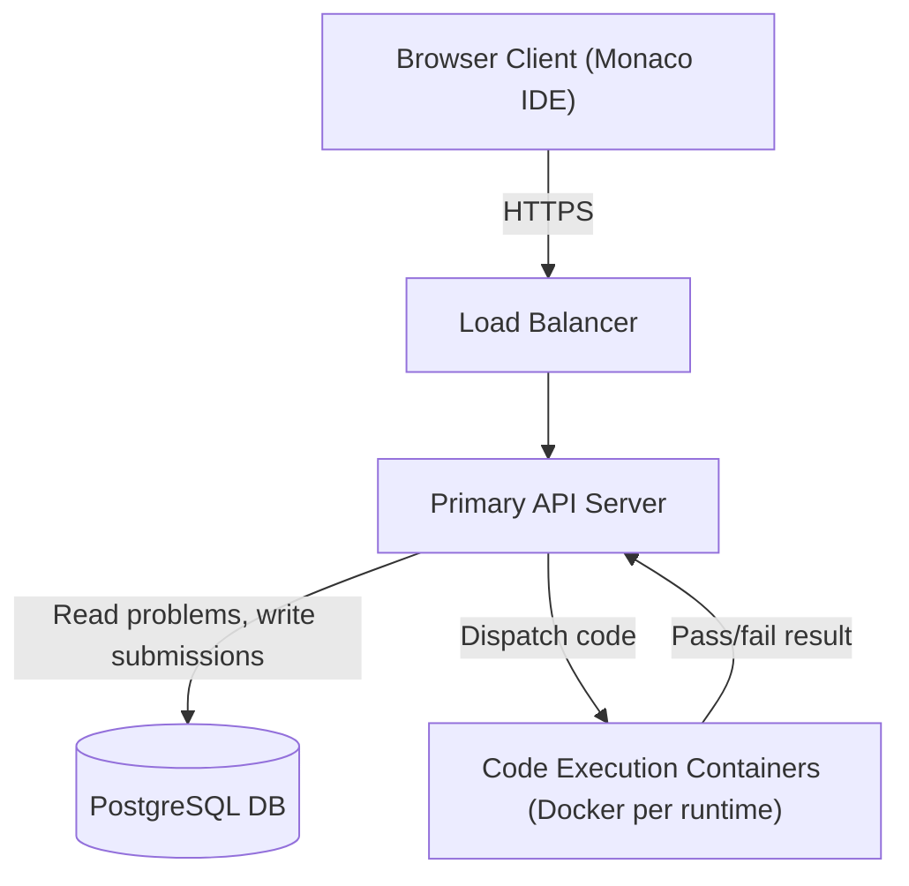
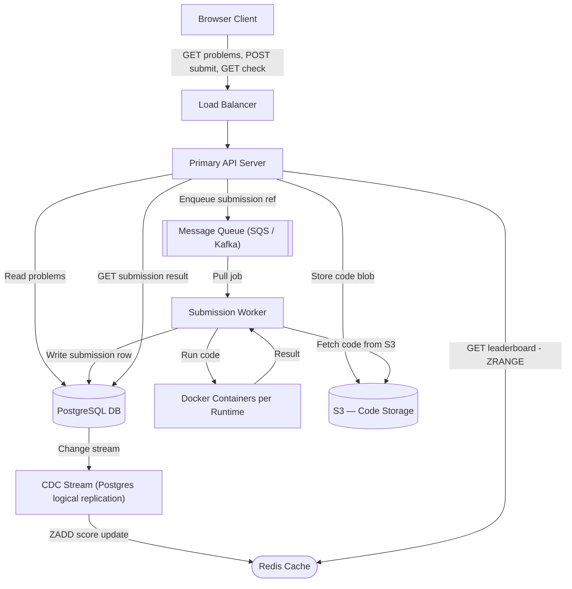
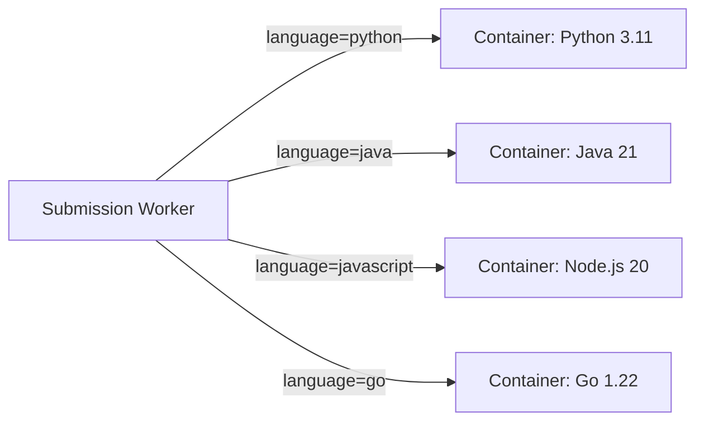
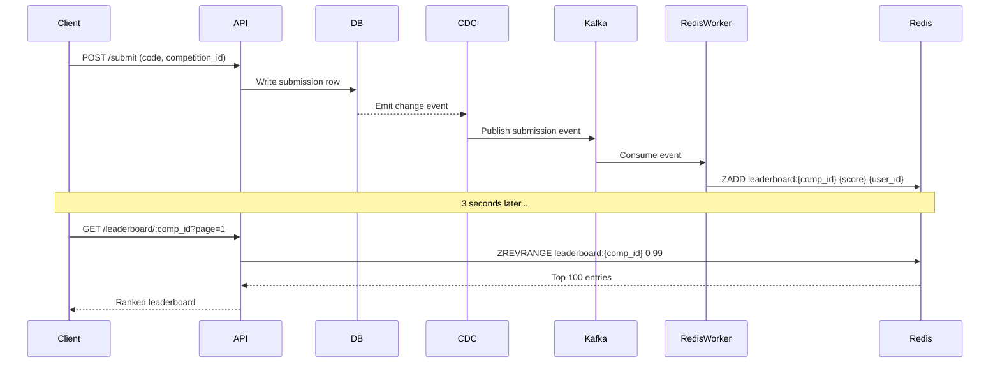
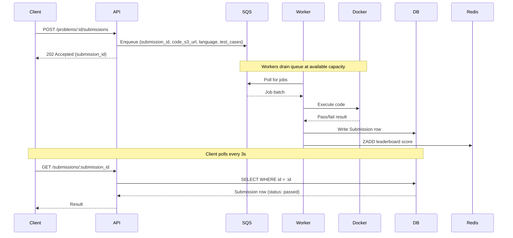

# System Design: LeetCode / Online Judge

---

## 🧠 Mental Model

> **LeetCode is fundamentally a code execution pipeline wrapped around a problem catalog — the hardest part isn't storing problems, it's safely running untrusted user code at scale.**

Three flows define this system:

| Flow | Core Problem | Key Insight |
|---|---|---|
| **Browse & Code** | Serve 3,000 problems fast with filtering | Simple read-heavy workload — any DB works |
| **Submit & Judge** | Execute untrusted code safely, report pass/fail | Isolation is a correctness requirement, not an optimization |
| **Compete & Rank** | 100K users submit simultaneously, leaderboard updates live | Aggregation query at scale = $50/query — Redis sorted set = $0 + O(log n) |

The system runs two paths:

- **Fast path**: Submit → Queue → Container → result in DB → client polls → show result (optimized for throughput, never drops a submission)
- **Reliable path**: CDC DB → Redis sorted set → leaderboard always fresh from in-memory data (no expensive query at read time)

```
                    ┌──────────────────────────────────────────────────────────┐
                    │                     FAST PATH (Submit)                    │
 ┌────────┐ POST   │  ┌────────┐  enqueue  ┌───────┐  dispatch  ┌──────────┐ │
 │ Client │───────►│  │  API   │──────────►│ Queue │───────────►│ Worker + │ │
 │(Monaco)│        │  │ Server │           │(SQS)  │            │ Docker   │ │
 └────┬───┘        │  └────────┘           └───────┘            │Container │ │
      │  GET/check │                                             └────┬─────┘ │
      │◄───────────│──────────────────────────────────────────────────│       │
      │  (polling) │                                             write │result │
      │            └─────────────────────────────────────────────────┼───────┘
      │                                                               │
      │            ┌──────────────────────────────────────────────────▼───────┐
      │            │                  RELIABLE PATH (Leaderboard)              │
      │            │  DB write → CDC stream → Kafka → Worker → Redis ZADD     │
      │            │  GET /leaderboard → Primary Server → Redis ZRANGE → done │
      └────────────└──────────────────────────────────────────────────────────┘
```

### ⚡ Core Design Principles

| Principle | Decision | Why |
|---|---|---|
| Never run code on the API server | Docker containers per runtime | Untrusted code on primary server = instant compromise |
| Queue before execution | SQS/Kafka buffer in front of workers | 100K end-of-competition surge cannot be absorbed without a buffer |
| Redis sorted set for leaderboard | ZADD/ZRANGE instead of DB GROUP BY | Aggregation query at 100K rows = seconds latency + $50/query cost |
| Polling over WebSocket | 3-second poll for submission result and leaderboard | WebSocket adds stateful infra complexity; polling is what LeetCode actually does |
| CDC for cache consistency | DB change stream → Redis update | Write to DB once; CDC guarantees Redis stays in sync even if primary server crashes |

---

## 1. Problem Statement & Scope

Design LeetCode (Online Judge) — a platform where users browse coding problems, write solutions in a browser IDE, submit code for automated judging, and compete in timed competitions with a live leaderboard.

**In scope:**
- Problem catalog (browse, filter, view)
- Code submission and judging (run against test cases, return pass/fail)
- Secure, isolated code execution environment
- Competition mode with up to 100,000 participants
- Near real-time leaderboard (2–5 second freshness, auto-updating)

**Out of scope:**
- User authentication (assumed available)
- Admin tooling to create/edit problems
- Discussion forums, editorial solutions
- Subscription/payments

**Competition definition:** A competition has a fixed start time, lasts 90 minutes, includes 10 problems, supports up to 100,000 users, and ranks by most problems solved — with fastest completion time as the tiebreaker.

---

## 2. Requirements

### Functional
1. Users can browse a paginated, filterable list of problems (by difficulty, category)
2. Users can view a problem with full description, code stubs per language, and sample test cases
3. Users can write code in a browser IDE (Monaco) and submit for judging
4. Submission returns pass/fail result with test case outcomes and runtime metrics
5. Users can join competitions; submissions in competition context count toward a live leaderboard
6. Users can view the competition leaderboard with near real-time updates

### Non-Functional
| Quality | Target | Why it matters here |
|---|---|---|
| **Availability over Consistency** | AP — eventual consistency acceptable | Stale leaderboard for a few seconds is fine; site must stay up for 100K users |
| **Code Execution Security** | Full isolation from host system and DB | User code is untrusted — infinite loops, fork bombs, network scans are real threats |
| **Scale** | 100,000 concurrent users per competition | End-of-competition submission surge is the hardest scaling challenge |
| **Leaderboard Freshness** | 2–5 second update interval | Users expect to see ranking changes without refreshing |
| **Submission Latency** | Result within ~10 seconds of submit | Code runs up to 5s; queue + worker adds overhead; polling bridges the gap |

---

## 3. Back-of-the-Envelope Estimations

**Scale assumptions:**
- 100,000 DAU (peak = competition day)
- 3,000 problems in catalog

**Reads:**
- Problem list: ~100K users × 10 browsing sessions/day = 1M reads/day → ~12 QPS (trivial)
- Problem view: ~100K users × 5 views/day = 500K reads/day → ~6 QPS

**Writes (submissions):**
- Normal day: 100K users × 10 submissions/day = 1M submissions/day → ~12 writes/sec
- Competition surge: 100K users submitting over 90 min = ~18 submissions/sec average; final 10-min burst could hit **500–1,000 submissions/sec**

**Leaderboard reads:**
- 100K users × polling every 3s = **~33,000 leaderboard reads/sec** during competition
- Must be served from cache — DB cannot handle this

**Storage:**
- 3,000 problems × ~50KB avg = ~150MB (trivial)
- Submissions: 1M/day × 5KB avg = 5GB/day → ~1.8TB/year (manageable with PostgreSQL + archival)

> [!NOTE]
> **Key Insight:** The leaderboard read volume (33K QPS) is 1,000× the write volume. The problem is not writes — it's serving aggregated read results at scale without re-computing on every request.

---

## 4. API Design

APIs map 1:1 to functional requirements:

```
# 1. Browse problems
GET /problems?category={}&difficulty={}&page={}&page_size={}
→ 200: Partial<Problem>[]   (id, name, difficulty, category only — no test cases)

# 2. View a problem
GET /problems/:problem_id
→ 200: Problem              (full: description, code_stubs{}, test_cases[], solutions[])

# 3. Submit a solution
POST /problems/:problem_id/submissions
Body: { code: string, language: "python"|"java"|"javascript", competition_id?: string }
→ 202: { submission_id: string }   (async — result comes via polling)

# 4. Check submission result (polling endpoint)
GET /problems/:problem_id/submissions/:submission_id
→ 200: Submission           (pending | passed | failed + test_case_results, runtime_ms)
→ 404: not yet processed    (client retries every 3s)

# 5. Get leaderboard
GET /leaderboard/:competition_id?page={}&page_size={}
→ 200: LeaderboardEntry[]   ({ rank, user_id, problems_solved, last_submission_at })
```

> [!TIP]
> **Say this out loud:** "POST /submit returns 202 Accepted immediately — not 200. The result is async. I'll add a polling endpoint so the client can check every 3 seconds. This is actually what LeetCode does today — open DevTools and you'll see `/check` firing on a 3-second interval."

---

## 5. High-Level Design

### Diagram 1 — Simple High-Level Design



### Diagram 2 — Evolved Design with Queue, Cache, and CDC



---

## 6. Deep Dives

### 6.1 Code Execution — Security & Isolation

> **Here's the problem we're solving:** Users submit arbitrary code we have no control over. Running it directly on the API server means malicious code can delete our database, exfiltrate credentials, run crypto miners, or fork-bomb our servers. Isolation is a correctness requirement — not an optimization.

**Option A: VM per execution**
- Full OS isolation, maximum security
- **Problem:** Heavy resource usage, slow startup (~minutes). Wasteful and expensive at scale.

**Option B: AWS Lambda (Serverless)**
- Auto-scales, no infrastructure to manage, isolated per invocation
- **Problem:** Cold start latency (seconds to boot) degrades submission experience. Mitigation: pre-warming lambdas — but pre-warmed lambdas are just containers.

**Option C: Docker containers (chosen)**
- One container per supported runtime (Python, Java, JavaScript, C++, Go, etc.)
- Containers share the host OS kernel — far more lightweight than VMs
- Startup is fast (<100ms for a warm container)



**Security hardening within each container:**

| Control | Implementation | Threat mitigated |
|---|---|---|
| **Execution timeout** | Kill process after 5s | Infinite loops, TLE |
| **CPU limit** | Container CPU quota (e.g. 0.5 vCPU) | Fork bombs, compute exhaustion |
| **Memory limit** | Container memory cap (e.g. 256MB) | OOM attacks, unbounded allocations |
| **Read-only filesystem** | Mount rootfs as read-only; /tmp writable | Persistent malware, filesystem tampering |
| **Network isolation** | No egress; VPC firewall blocks outbound | Data exfiltration, reverse shells |
| **Syscall filtering** | seccomp profile blocks dangerous syscalls | Kernel exploits, privilege escalation |
| **No DB access** | Containers not in DB subnet | Cannot read/delete user data |

> [!IMPORTANT]
> **Fast Path vs Reliable Path for code execution:**
> - **Fast path:** Warm container picks up job from queue, runs code, writes result — user polls and sees result in ~5–8 seconds.
> - **Reliable path:** If container crashes, job stays in queue (SQS visibility timeout). Worker retries. Result eventually written. No submission is silently dropped.

> [!NOTE]
> **Key Insight:** Docker containers vs VMs is a resource efficiency trade-off — containers run 10–20× more instances per host. At 100K submissions during a competition, this difference is the gap between affordable and bankrupting.

---

### 6.2 Live Leaderboard — Freshness & Scale

> **Here's the problem we're solving:** The naive approach queries the submissions table grouped by user, filtered by competition, sorted by score — an aggregation over up to 100,000 rows. At 33K reads/sec during competition, this query runs constantly. At ~$50/query equivalent cost on DynamoDB (and several seconds on PostgreSQL), this is both too slow and too expensive.

**Evolution of the leaderboard design:**

**Stage 1: Direct DB aggregation**
```sql
SELECT user_id,
       COUNT(*) AS problems_solved,
       MIN(submitted_at) AS last_solve_time
FROM submissions
WHERE competition_id = :cid AND passed = true
GROUP BY user_id
ORDER BY problems_solved DESC, last_solve_time ASC;
```
- Works at small scale. Kills DB at 33K QPS × 100K row scan.

**Stage 2: Cache with TTL (naive caching)**
- Run expensive query, cache result in Redis for 10s
- **Problem:** Thundering herd at TTL expiry — all users hit DB simultaneously when cache expires

**Stage 3: Cron job refresh**
- Scheduled worker runs query every 10 seconds, overwrites cache
- **Problem:** Introduces a new dependency; if cron fails, cache goes stale indefinitely. Also, query still runs at full cost every 10 seconds.

**Stage 4: Redis Sorted Set (chosen)**

Redis sorted sets store `(member, score)` pairs ordered by score. Operations:
- `ZADD leaderboard:{competition_id} {score} {user_id}` — O(log n)
- `ZREVRANGE leaderboard:{competition_id} 0 99` — O(log n + k) for top 100

```
Key:   leaderboard:comp_abc123
Value: sorted set
  user_111 → score: 7.0000001234  (7 problems + tiebreak via 1/timestamp)
  user_222 → score: 7.0000001456
  user_333 → score: 5.0000009999
  ...
```

**Score encoding:** `score = problems_solved + (1 / submitted_at_unix)` so more problems = higher score, and among ties, faster solve = higher fractional value.

**Write path:**
```
Submission passes test cases
   → Worker writes row to DB
   → CDC (Postgres logical replication) emits change event
   → Kafka consumer reads event
   → Worker computes new score for user
   → ZADD leaderboard:{competition_id} {new_score} {user_id}
```

**Read path:**
```
Client polls GET /leaderboard/:competition_id?page=2&page_size=100
   → API server calls ZREVRANGE leaderboard:{competition_id} 100 199
   → Returns 100 entries in O(log n) from memory
   → Zero DB queries
```

> [!IMPORTANT]
> **Why CDC instead of writing directly to Redis from the API server?**
> If the API server writes DB first and then crashes before writing Redis — leaderboard permanently stale. CDC makes Redis updates a consequence of DB writes — guaranteed eventual consistency. If Redis goes down, it can be rebuilt from the DB.



> [!NOTE]
> **Key Insight:** Redis sorted set turns a multi-second aggregation query into a sub-millisecond memory lookup. The leaderboard computation moves from read-time to write-time — an O(log n) update per submission vs O(n) scan per read. At 33K reads/sec, this is the only viable architecture.

---

### 6.3 Scaling for Competition Surge (100K Users)

> **Here's the problem we're solving:** At the end of a 90-minute competition, every participant rushes to submit their final solution. A synchronized burst of 100K submissions arrives in minutes. Our Docker containers have finite capacity — we cannot spin up fast enough to absorb the spike without dropping requests.

**Option A: Pre-scaling**
- Provision enough containers before competition starts
- **Problem:** Expensive (paying for idle capacity); hard to estimate correctly; doesn't handle surprise surges

**Option B: Auto-scaling (AWS Fargate/ECS)**
- Scale up containers based on CPU/memory thresholds
- **Problem:** Auto-scaling has a ~2–5 minute reaction time. A 100K burst is over before new containers are ready.

**Option C: Message Queue as buffer (chosen)**



**Why the queue is a correctness guarantee, not a performance optimization:**

| Without queue | With queue |
|---|---|
| API server dispatches directly to containers | API server enqueues immediately → returns 202 |
| Container capacity exceeded → 503 dropped | All submissions land in durable queue → zero drops |
| User loses their submission | Worker retries on failure (SQS visibility timeout) |
| Scale lag = lost requests | Scale lag = processing delay, not data loss |

**Handling large code payloads:**
- Don't put code directly in the queue message (SQS 256KB limit; Kafka also prefers small payloads)
- API server uploads code to S3, puts S3 URL in queue message
- Worker downloads from S3 before dispatching to container

> [!NOTE]
> **Key Insight:** The queue is mandatory for correctness, not performance. Without it, 100K end-of-competition submissions overwhelm direct container dispatch and get dropped. With it, submissions are durable — they wait in line and every one gets processed.

---

## 7. Trade-offs & Bottlenecks

### ⚖️ Key Trade-offs

#### Docker Containers vs AWS Lambda

| Dimension | Docker Containers | AWS Lambda |
|---|---|---|
| Startup latency | <100ms (warm) | 1–3s cold start |
| Resource efficiency | High (shared OS) | High (managed) |
| Operational overhead | Medium (manage workers) | Low (serverless) |
| Control over isolation | Full (seccomp, VPC) | Limited (AWS managed) |
| Cost at scale | Predictable | Variable per invocation |
| Pre-warming | Explicit container pool | Requires provisioned concurrency |

**Chosen:** Docker containers. Cold start on Lambda is acceptable if pre-warmed — but pre-warmed Lambdas are functionally containers anyway. Docker gives full control over seccomp, filesystem, and network isolation which matters for executing untrusted code.

> [!NOTE]
> **Key Insight:** Lambda cold start = untrusted code execution latency during peak load. Docker containers with a warm pool = consistent sub-second dispatch. The choice is really about who manages the container lifecycle.

---

#### Redis Sorted Set vs Cron-Refreshed Cache

| Dimension | Cron Job + Cache | Redis Sorted Set |
|---|---|---|
| Freshness | 10s intervals | Per-submission (near-instant) |
| DB load | 1 expensive query every 10s | 0 at read time |
| Consistency | Eventually consistent (cron lag) | Eventually consistent (CDC lag ~ms) |
| Complexity | Low (simple cron) | Medium (CDC pipeline) |
| Pagination | Easy (slice cached list) | Native (ZRANGE with offset) |
| Failure mode | Cron down = stale cache forever | Redis down = fallback to DB |

**Chosen:** Redis sorted set. Cron refresh is fine for mid-level interviews but has an operational risk: cron failure means indefinitely stale leaderboard. Sorted set is updated atomically per submission — freshness is bounded by CDC latency (~milliseconds), not cron interval.

> [!NOTE]
> **Key Insight:** A cron job is a dependency that can fail silently. A CDC-driven sorted set makes leaderboard freshness a property of the write path — it cannot fall behind unless the write path itself fails.

---

#### Polling vs WebSocket for Result Delivery

| Dimension | HTTP Polling (every 3s) | WebSocket / SSE |
|---|---|---|
| Implementation complexity | Low | High (stateful connections, WS manager) |
| Server state | Stateless | Stateful (connection registry) |
| Latency | 0–3s to see result | Sub-second |
| Infrastructure | Standard HTTP servers | Dedicated WS tier |
| Fault tolerance | Simple (client retries) | Connection drops require reconnect logic |
| Real-world usage | LeetCode does this | Overkill here |

**Chosen:** Polling. The 3-second result window is acceptable for a submission that takes up to 5 seconds to execute. WebSocket introduces stateful server complexity without meaningful user experience gain. LeetCode itself uses polling — you can verify by opening DevTools on the network tab.

> [!NOTE]
> **Key Insight:** WebSocket vs HTTP is an engineering complexity question, not a latency question. When your "real-time" event only happens once (submission result) or updates every few seconds (leaderboard), polling is simpler, equally effective, and stateless. Save WebSockets for truly bidirectional, continuous event streams (like chat).

---

## 8. Interview Summary

### Key Decisions Table

| Decision | Problem It Solves | Trade-off Accepted |
|---|---|---|
| Docker containers per runtime | Untrusted code must not touch API server or DB | Worker infrastructure to manage; warm container pool needed |
| Message queue before code execution | 100K end-of-competition burst drops requests without a buffer | Results become async; requires polling endpoint |
| Redis sorted set for leaderboard | DB aggregation query is too slow and costly at 33K reads/sec | CDC pipeline adds eventual consistency lag (~ms); Redis adds infra |
| CDC (Postgres → Kafka → Redis) | Dual writes from API server risk cache-DB inconsistency | Adds pipeline complexity; Redis recoverable from DB if it goes down |
| Polling for result and leaderboard | WebSocket adds stateful infra complexity; not needed at this latency target | 0–3s result delay; acceptable for judging latency |

### Fast Path vs Reliable Path

```
FAST PATH (submission result):
  Client POST /submit
    → API enqueues to SQS (durable immediately)
    → Returns 202 {submission_id}
    → Worker pulls job, dispatches to Docker container
    → Docker runs code, returns result in ≤5s
    → Worker writes to DB
    → Client poll (every 3s) hits DB → sees result

RELIABLE PATH (leaderboard):
  Worker writes submission to DB
    → CDC emits change event
    → Kafka consumer updates Redis ZADD
    → All leaderboard reads hit Redis ZRANGE (O(log n), in-memory)
    → No DB read ever triggered by leaderboard request
```

### Ordering Summary

Leaderboard ordering is maintained in the Redis sorted set with a composite score: `problems_solved + (1 / submitted_at_unix)`. This guarantees:
- Users with more solved problems always rank higher
- Among ties, the user who solved their last problem first ranks higher
- Ordering is maintained atomically per ZADD — no recomputation needed at read time

> [!IMPORTANT]
> This ordering guarantee is scoped to the sorted set partition key (competition_id). Cross-competition rankings are not supported in this design.

### Key Insights Checklist

An interviewer wants to hear these five things out loud:

1. **"Running user code on the API server is a security catastrophe — I'm using Docker containers with seccomp, CPU/memory limits, network isolation, and a 5-second execution timeout."**
2. **"The leaderboard aggregation query at 100K rows × 33K QPS is the most expensive operation in the system — Redis sorted set moves that computation to write time, making reads O(log n) from memory."**
3. **"The submission queue is a correctness requirement, not a performance optimization — without it, the end-of-competition surge drops requests. With it, everything is durable and retryable."**
4. **"I'm using CDC (change data capture) instead of dual writes so that Redis and DB stay consistent even if the API server crashes between the two writes."**
5. **"Polling over WebSocket for both submission results and leaderboard — introducing stateful WebSocket infrastructure isn't worth it when 3-second polling matches the latency requirements here. LeetCode itself does polling."**

---

## Frontend Notes (10% of design)

Backend dominates this system (90%). Frontend surface worth mentioning:

- **Monaco Editor** (open source, VS Code's editor) embedded in browser — no custom IDE needed; supports syntax highlighting, autocomplete, and keyboard shortcuts for all supported languages
- **Optimistic submission state** — show "Submitted, running..." immediately on POST 202 before polling returns; reduces perceived latency
- **Leaderboard virtualization** — 100K row leaderboard must use virtual list (react-window or similar) — only render visible rows; full render crashes browser
