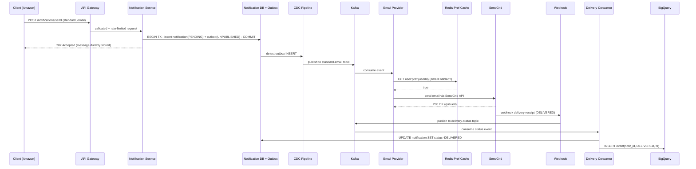
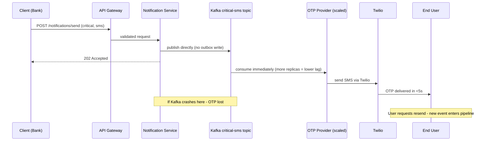
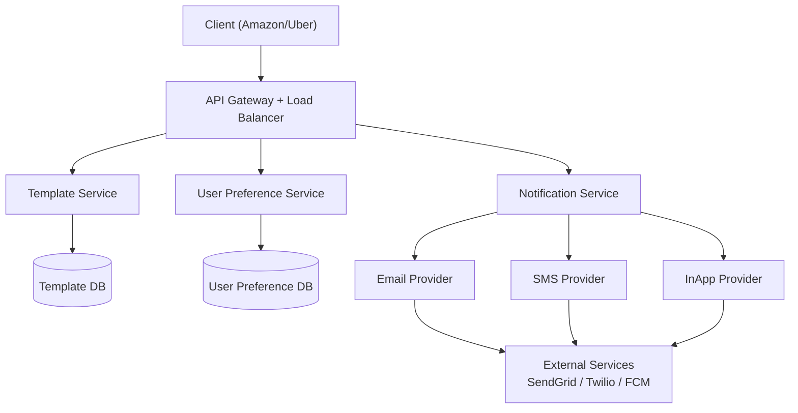
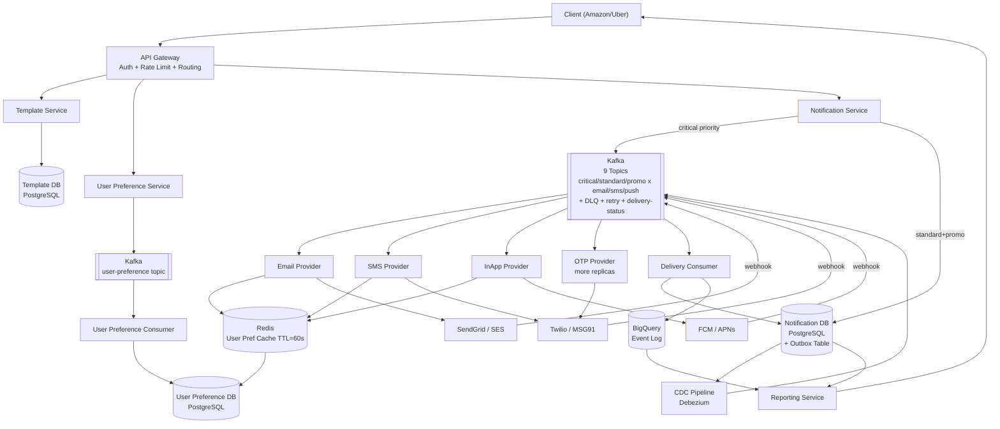

# Notification System Design

---

## 1. Problem + Scope

Design an industry-grade, multi-tenant notification platform that any third-party application (Amazon, Uber, Flipkart) can integrate with to deliver notifications to their end users across three channels: Email, SMS, and In-App Push.

**In scope:** Template management, real-time and scheduled notifications, user preference management, delivery status tracking, OTP/critical vs promotional priority handling, multi-tenant client isolation.
**Out of scope:** Building FCM/APNs/Twilio internals, user identity management (clients own their user IDs), notification content moderation.

> **Key distinction:** In this system, **Client = the organization** (Amazon, Uber) and **User = the end person** using that organization's app. This matters because user preferences are user-owned, not client-owned.

---

## 2. Assumptions & Scale

| Signal | Number |
|---|---|
| Notifications/minute (peak) | 1M |
| Notifications/second (avg) | ~16,700/sec |
| Peak burst (3×) | ~50,000/sec |
| Channels per notification (avg) | 1–2 (multi-channel fan-out) |
| Kafka events/minute (with fan-out) | ~2–3M events/min |
| Avg notification payload | 500 bytes |
| Storage (Notification DB, /day) | ~720 GB/day (1M/min × 500B × 60 × 24) |
| BigQuery event log (/day) | ~3–5 events per notification = 4B events/day |
| Template versions per client | ~50–200 active templates |
| Notification types | 3: Email, SMS, InApp Push |
| Priority tiers | 3: Critical (OTP/bank), Standard, Promotional |

**Hardest flow:** OTP delivery — must reach end user in <5 seconds. Any path involving disk writes or CDC adds 2–5s of latency. OTP must bypass the outbox pattern entirely.

**Fan-out math:** A bulk promotional campaign (Flipkart Big Billion Day) = 50M users × 1 notification = 50M events in a short window. Kafka must absorb this burst; providers consume at their own pace.

*These numbers drive the following decisions: dual write paths (fast vs reliable), dedicated OTP Kafka topics with more consumer replicas, and BigQuery (not PostgreSQL) for event-level analytics.*

---

## 3. Functional Requirements

- Support three notification channels: Email, SMS, In-App Push (FCM/APNs)
- Support real-time notifications (OTP, transaction alerts) and scheduled notifications (promotions)
- Template system with variable substitution — clients define templates once, personalise per user at send time
- User-level channel preference — end users can opt out of specific channels (e.g., no SMS, email only)
- Delivery status dashboard for clients — see pending / sent / delivered per notification
- Multi-tenant — client isolation (Amazon's templates and users never mix with Uber's)

---

## 4. Non-Functional Requirements

| Property | Requirement | Why |
|---|---|---|
| Availability | 99.99% (AP over CP) | Notification delivery must survive partial failures; stale preferences for seconds are acceptable |
| OTP latency | <5 seconds end-to-end | OTP expires; missed window = failed auth |
| Promotional latency | 5–10 seconds acceptable | No urgency; durability > speed |
| Throughput | 1M notifications/min peak | Multi-tenant at scale; burst campaigns |
| Consistency | Eventual | Template changes propagate within seconds; preference changes within seconds |
| Durability | No message loss for standard/promo | Once acknowledged to client, message must be delivered or dead-lettered |

### Consistency Model

| Domain | Model | Reason |
|---|---|---|
| Notification delivery (standard/promo) | Guaranteed (outbox + CDC) | Once client receives ACK, message cannot be lost |
| Notification delivery (OTP) | At-least-once (Kafka) | User can request resend if OTP expired; slight duplication is tolerable |
| User preferences | Eventual (Redis cache, TTL=60s) | 60s of stale preference = minor; scanning DB per notification = not scalable |
| Template updates | Eventual (seconds) | Template version change propagates on next publish |

---

## 🧠 Mental Model

Three actors, two write paths, one critical distinction:

```
Client (Amazon/Uber) → Notification Service
                            |
           ┌────────────────┴─────────────────┐
     OTP / Critical                    Standard / Promo
     (fast path)                       (reliable path)
           |                                   |
     Kafka directly                    DB Write (Outbox + Notification)
     (at-least-once)                       |
           |                           CDC Pipeline → Kafka
           └──────────────┬────────────────────┘
                    9 Kafka Topics
               (3 priorities × 3 channels)
                          |
              ┌───────────┼───────────┐
         Email Provider  SMS Provider  InApp Provider
              |               |              |
         SendGrid/SES     Twilio/MSG91   FCM / APNs
              |               |              |
              └───────────────┴──────────────┘
                    Webhook delivery receipts
                          |
                 Delivery Status Kafka
                          |
                  Delivery Consumer
                    |           |
             Notification DB   BigQuery
             (final status)    (event log)
                          |
                  Reporting Service → Client Dashboard
```

**⚡ Core Design Principles**

| Fast Path (OTP/Critical) | Reliable Path (Standard/Promo) |
|---|---|
| Notification Service → Kafka directly | Notification Service → Outbox Table + Notification DB |
| At-least-once delivery (retry on resend) | CDC pipeline → Kafka (guaranteed, no message loss) |
| Dedicated OTP consumer (more replicas) | Standard consumer (can lag up to 10s) |
| No DB write before Kafka publish | ACK to client only after DB write succeeds |

---

## 5. API Design

| Endpoint | Method | Actor | Key Params |
|---|---|---|---|
| `/templates` | POST | Client | `name, type, channel, content, variables[]` |
| `/templates/{id}` | GET | Client | `version` (optional, defaults to latest active) |
| `/notifications/send` | POST | Client | `templateId, recipientId, variables, channel, priority, scheduledAt` |
| `/notifications/{id}/status` | GET | Client | — |
| `/users/{externalUserId}/preferences` | PUT | User (via Client) | `clientId, emailEnabled, smsEnabled, pushEnabled` |

**`POST /notifications/send` payload:**
```json
{
  "templateId": "tmpl_abc123",
  "recipientId": "user_789",        // client's external user ID
  "variables": { "product": "iPhone 15", "discount": "20%" },
  "channel": ["email", "sms"],
  "priority": "standard",           // critical | standard | promotional
  "scheduledAt": null               // null = send now
}
```

**Notes:**
- `priority: critical` bypasses outbox — goes directly to Kafka
- `channel` is an array — client can fan-out to multiple channels per notification
- Clients must register with API key; API Gateway validates on every call
- No idempotency key needed here (notifications are inherently fire-and-forget, not financial)

---

## 6. End-to-End Flow

> [!IMPORTANT]
> **Queue-First Architecture — two distinct Kafka pipelines**
>
> **Pipeline 1 — Reliable Delivery (Standard/Promotional via Outbox → CDC → Kafka)**
> - WHY async: 1M notifications/min cannot be delivered synchronously. Kafka absorbs the burst; 3 provider types consume independently.
> - WHY outbox: If Notification Service crashes after writing to Kafka but before DB write → client got ACK but we have no record. Outbox writes DB first — Kafka publish happens via CDC (atomic from DB perspective).
> - Delivery guarantee: **at-least-once** (Kafka consumer replay on crash) + **effectively-once** in Notification DB (idempotent status updates via `notification_id`)
> - Retry: exponential backoff + DLQ after 3 failures
>
> **Pipeline 2 — OTP/Critical (direct Kafka, no DB pre-write)**
> - WHY bypass outbox: OTP must be delivered in <5s. DB write + CDC adds 2–5s latency — OTP would expire.
> - Trade-off accepted: at-most-once (if Kafka crashes before consumer reads, message is lost). Acceptable because user can request OTP resend.
>
> *The outbox pattern is a correctness requirement, not a performance choice. Without it, an ACK to the client is a lie — we have no durability guarantee.*

### 6.1 Standard/Promotional Notification Write Path

1. Client calls `POST /notifications/send` with `priority: standard`. I route this to the **Notification Service** via API Gateway — the gateway validates the API key, applies rate limiting, and routes by URL.
2. Notification Service does **two writes in a single DB transaction** to the Notification DB:
   - Inserts a row into `notification` table (status = `PENDING`)
   - Inserts a row into `outbox` table (status = `UNPUBLISHED`)

   Only after both succeed does it return `202 Accepted` to the client. I chose this because if I ACK the client before the DB write, a crash between ACK and Kafka publish loses the message permanently.

3. **CDC pipeline** (Debezium or similar) watches the `outbox` table for new rows. On insert, it publishes the event to the correct Kafka topic based on `(priority, channel)`. Example: `standard-email` topic. CDC publishes atomically from the DB's perspective — if Kafka is unavailable, the row stays in `outbox` until Kafka recovers.

4. **Email/SMS/InApp Provider** (consumer services) reads from their subscribed Kafka topic. Before forwarding to the external service, the provider checks **User Preference Cache** (Redis, TTL=60s). If user has `emailEnabled: false`, the message is discarded — no external call. I chose Redis cache (not DB lookup) because hitting PostgreSQL on every single notification at 1M/min would bottleneck the preference DB immediately.

5. Provider forwards to external service: SendGrid (email), Twilio (SMS), FCM/APNs (push). External service sends to the end user.

6. External service fires a **webhook** back to our Provider service with delivery status. Provider publishes to `delivery-status` Kafka topic.

7. **Delivery Consumer** reads `delivery-status` topic and does two things:
   - Updates `notification` table in Notification DB: `status = DELIVERED`
   - Appends an event row to **BigQuery** (immutable event log: `notification_id, event_type, timestamp`)

8. **Reporting Service** serves the client dashboard by reading from Notification DB (final status) and BigQuery (granular event timeline per notification).

### 6.2 OTP / Critical Notification Fast Path

1. Client calls `POST /notifications/send` with `priority: critical`.
2. Notification Service detects `critical` priority — skips the outbox and **writes directly to Kafka** on the `critical-sms` / `critical-email` topic.
3. **OTP Provider** (dedicated consumer, horizontally scaled with more replicas than standard provider) consumes immediately. More replicas = lower consumer lag = faster delivery.
4. Provider calls Twilio/FCM. OTP reaches user in <5 seconds.
5. If delivery fails: user requests OTP resend → new Kafka event → retry. This is acceptable because OTP is designed for resend; we don't need the outbox guarantee here.
6. A separate lightweight async consumer writes the OTP notification to Notification DB eventually (for the dashboard) — this does not block the delivery path.





---

## 7. High-Level Architecture

### Simple Design



### Evolved Design



---

## 8. Data Model

> [!IMPORTANT]
> **Storage Separation**
>
> | What | Where | Why |
> |---|---|---|
> | Templates | PostgreSQL (Template DB) | Structured, relational, version-controlled; low write volume |
> | User preferences | PostgreSQL (User Pref DB) | Structured per user; updated infrequently |
> | Hot preference reads | Redis (TTL=60s) | Sub-ms lookup; never source of truth |
> | Notification records (operational) | PostgreSQL (Notification DB) | Final delivery status; client queries by notification_id |
> | Outbox (transient) | Same PostgreSQL, Outbox table | Part of same transaction as notification; CDC reads from it |
> | Event-level analytics | BigQuery | Append-only, immutable; 4B events/day; never query for single-row ops |
> | Message bus | Kafka (7-day retention) | Ordered delivery, replay, fan-out by topic |

### Template Table (PostgreSQL)

| Column | Type | Note |
|---|---|---|
| template_id | UUID (PK) | |
| client_id | UUID (FK) | multi-tenant isolation |
| name | text | |
| type | enum | promotional, transactional |
| channel | enum | email, sms, push |
| content | text | body with `{{variable}}` placeholders |
| variables | jsonb | declared variable names for validation |
| version | int | incremented on update |
| is_active | boolean | only active version used at send time |
| created_at | timestamp | |
| updated_at | timestamp | |

### Notification Table (PostgreSQL)

| Column | Type | Note |
|---|---|---|
| notification_id | UUID (PK) | idempotency key for delivery consumer updates |
| client_id | UUID | |
| external_user_id | text | client's user ID |
| template_id | UUID | |
| channel | enum | email, sms, push |
| payload | jsonb | rendered content after variable substitution |
| status | enum | PENDING → SENT → DELIVERED → FAILED |
| priority | enum | critical, standard, promotional |
| scheduled_at | timestamp | null = immediate |
| last_updated_at | timestamp | |

### Outbox Table (same PostgreSQL, same transaction)

| Column | Type | Note |
|---|---|---|
| outbox_id | UUID (PK) | |
| notification_id | UUID (FK) | links to notification row |
| event_type | text | NOTIFICATION_CREATED |
| payload | jsonb | full notification payload for CDC |
| published | boolean | CDC marks true after Kafka publish |
| created_at | timestamp | |

### User Preference Table (PostgreSQL)

| Column | Type | Note |
|---|---|---|
| id | UUID (PK) | |
| client_id | UUID | |
| external_user_id | text | |
| email_enabled | boolean | default true |
| sms_enabled | boolean | default true |
| push_enabled | boolean | default true |
| updated_at | timestamp | |

---

## 9. Deep Dives

### 9.1 Transactional Outbox — Guaranteed Delivery Without Losing Messages

**Problem:** Notification Service receives a request. It must:
1. Acknowledge the client ("we got it, it'll be sent")
2. Publish to Kafka for async processing

If it ACKs the client then crashes before Kafka publish → message is lost. If it publishes to Kafka then crashes before ACK → client retries, duplicate message. How do we guarantee exactly-one durable capture?

**Naive solution:** Write to DB → publish to Kafka → ACK client.
Failure: crash between Kafka publish and DB write = Kafka has event, DB doesn't → status tracking broken.

**Chosen solution — Transactional Outbox:**
1. In a single DB transaction: INSERT into `notification` (status=PENDING) AND INSERT into `outbox` (published=false).
2. On commit success → ACK client. Message is now durable in DB.
3. CDC pipeline (Debezium) tails the `outbox` table. New row detected → publishes to Kafka. Marks `outbox.published = true`.
4. If CDC fails → Kafka is empty but DB has the row. CDC replays from last position on restart. Message is never lost.

Why CDC over a polling job? Debezium reads the PostgreSQL WAL (write-ahead log) in near-real-time (<500ms) — no polling interval overhead. Polling at 1M notifications/min would either be too slow (1s polling = 1M backlog) or too expensive (100ms polling = 600K DB reads/min).

The trade-off I accept is **operational complexity** — running Debezium requires Kafka Connect infrastructure. This is acceptable because all other approaches compromise either latency or durability.

> [!NOTE]
> Key Insight: The outbox pattern is not an optimisation — it's the only way to guarantee "ACK to client = message will be delivered or dead-lettered." Without it, an ACK is a promise we can't keep.

---

### 9.2 Priority Tiers — Two Write Paths for One System

**Problem:** OTP must arrive in <5 seconds. Promotional email can wait 10 seconds. A single write path can't satisfy both.

**The conflict:**
- **Durable path (outbox → CDC → Kafka):** adds ~2–5s latency (DB write + CDC detection). Fine for promo. Kills OTP.
- **Fast path (direct Kafka):** <100ms to Kafka. No durability guarantee before publish.

**Chosen solution — split by priority at the Notification Service:**

| Priority | Write Path | Durability | Latency |
|---|---|---|---|
| Critical (OTP, bank txn) | Direct to Kafka | At-least-once (resend on failure) | <500ms to Kafka |
| Standard (transactional) | Outbox → CDC → Kafka | Guaranteed (no message loss) | ~1–3s |
| Promotional (marketing) | Outbox → CDC → Kafka | Guaranteed | ~2–5s (acceptable) |

For OTP: "if it's lost, the user clicks resend" — the product is designed for this. A user experiencing a 5s OTP delay is worse than a user clicking resend once.

The trade-off I accept for OTP is **at-most-once delivery risk** during a Kafka crash. This is justified because: (a) Kafka is highly available, (b) OTPs are designed to be resent.

> [!NOTE]
> Key Insight: Two write paths for two SLAs. Don't force OTP through the outbox — you'll kill its latency. Don't skip the outbox for promos — you'll lose bulk campaign messages silently.

---

### 9.3 Kafka Topic Design — 9 Topics (Priority × Channel)

**Problem:** A single `notifications` Kafka topic with all events means:
- Email consumers read SMS events (wasted deserialization)
- Critical OTP events queue behind bulk promo events
- No per-priority SLA enforcement

**Chosen solution:** 9 topics = 3 priority tiers × 3 channels

```
critical-email    standard-email    promotional-email
critical-sms      standard-sms      promotional-sms
critical-push     standard-push     promotional-push
+ delivery-status
+ retry
+ DLQ
```

**Why this matters:**
- **OTP Provider** subscribes only to `critical-sms`, `critical-email` — it never gets blocked by a Flipkart bulk promo campaign
- **OTP consumer group** runs with 3× more replicas than standard consumers — consumer lag = delivery lag
- **Bulk email campaign** fills `promotional-email` — standard consumers process it at their own pace without affecting OTP SLA

> [!NOTE]
> Key Insight: Topic isolation by priority is the only way to enforce SLA differentiation. Without it, one 50M-user campaign delays every OTP in the system for 10–30 minutes.

---

### 9.4 User Preference — Cache Layer to Avoid Per-Notification DB Scans

**Problem:** At 1M notifications/min, if every provider service queries the User Preference DB before sending, that's 1M read queries/min to PostgreSQL. PostgreSQL can handle ~100K reads/min comfortably — 10× overload.

**Naive solution:** Query DB on every notification. System degrades under load.

**Chosen solution — Redis cache with TTL=60s:**
- Key: `pref:{clientId}:{externalUserId}` → `{ emailEnabled: true, smsEnabled: false, pushEnabled: true }`
- TTL: 60 seconds. If user changes preference, old value is used for up to 60 seconds.
- Cache miss: read from DB, populate cache.
- Cache write: when user preference changes, `DEL pref:{clientId}:{externalUserId}` + let next read repopulate (cache-aside pattern).

The trade-off I accept is **60-second eventual consistency** on preference changes. A user who opts out of SMS will still receive SMS for up to 60 more seconds. This is acceptable — the alternative is DB-level latency on every notification.

> [!NOTE]
> Key Insight: Preference is checked at the provider level, not at the Notification Service level. This is deliberate — by the time a message reaches a provider, we've already committed it to Kafka. Discarding at the provider (not at intake) avoids complexity in the routing layer.

---

### 9.5 Delivery Status Tracking — Webhook → Kafka → Two-Store Pattern

**Problem:** After a provider sends to Twilio/SendGrid/FCM, we don't know if the message actually reached the user. External services have their own delivery pipeline. How do we track `SENT → DELIVERED`?

**Chosen solution — webhook callback + Kafka:**
1. External service (Twilio, SendGrid, FCM) fires a webhook to our Provider service when delivery is confirmed.
2. Provider publishes to `delivery-status` Kafka topic (not directly to DB — keeps providers stateless).
3. **Delivery Consumer** reads from `delivery-status` and writes to two stores:
   - **Notification DB** (PostgreSQL): `UPDATE notification SET status = DELIVERED WHERE notification_id = ?` — final operational state
   - **BigQuery**: `INSERT INTO notification_events (notification_id, event_type='DELIVERED', ts)` — immutable audit log with full event timeline

**Why two stores?**
- Notification DB = client needs "is this notification delivered?" → single row lookup, O(1), PostgreSQL is right tool
- BigQuery = client needs "show me the timeline of all status changes for this notification" or "what's our delivery rate this week?" → analytical query over billions of rows, BigQuery is the right tool

The trade-off I accept: **two writes per delivery event** = higher write amplification. Acceptable because delivery events are far fewer than notification send events (1 send event vs 1–2 status events per notification).

> [!NOTE]
> Key Insight: Don't use your operational DB for analytics. Notification DB (PostgreSQL) for real-time status lookups. BigQuery for event timelines and delivery rate dashboards. Two tools, two purposes.

---

### 9.6 Rate Limiting — Two Tiers for Two Threats

**Two distinct rate limiting problems:**

**Tier 1 — API Gateway (protect our system from clients):**
- Rate limit per `clientId` + `apiKey`: e.g., max 10K notification requests/minute per client
- Protects against: accidental loops in client code, malicious abuse, DDoS on the public API
- Implementation: Redis sliding window counter, key = `ratelimit:{clientId}:{minute}`, INCR + TTL=60s

**Tier 2 — Provider level (protect external services from us):**
- Each external service has its own rate limit: SendGrid = 100 emails/sec per API key, Twilio = 1K SMS/sec
- If we send more than their limit, they drop or throttle requests silently
- Implementation: Token bucket per provider service, refill at external service's stated rate
- On rate limit exceeded: exponential backoff + retry queue, not DLQ

Why two tiers? API Gateway protects us inbound. Provider rate limiting protects the external services outbound. Without Tier 2, a Flipkart campaign at 50M emails would exceed SendGrid's limits and lose millions of messages with no error surfaced to the client.

> [!NOTE]
> Key Insight: Rate limiting at two points for two different adversaries — bad actors hitting your API, and your own services overwhelming external partners. Both need to be solved independently.

---

## 10. Bottlenecks & Scaling

We're designing for **1M notifications/minute**, **3 channels**, **multi-tenant** with bulk campaign spikes (Flipkart Big Billion Day = 50M+ notifications in minutes). Primary bottleneck at scale: **consumer lag on Kafka** — if providers can't consume fast enough, OTP delivery delays.

**What breaks first at 10× scale (10M notifications/min):**

| Bottleneck | Problem | Solution |
|---|---|---|
| Kafka consumer lag | 10× more events; OTP waits behind promo | Increase partitions per topic; scale consumer replicas independently per priority |
| Notification DB write throughput | 10M INSERTs/min to PostgreSQL (10× = overwhelmed) | Horizontal sharding by `client_id`; connection pooling via PgBouncer |
| Outbox CDC pipeline | Single Debezium connector → lag at 10× | Multiple connectors, partition outbox table by `client_id` |
| SendGrid / Twilio API limits | External services throttle at burst | Multiple API keys per external provider; distribute load across keys |
| BigQuery ingest | 40B events/day at 10× | Kafka → BigQuery streaming connector (native support, no custom consumer needed) |

**Spike scenario — Flipkart Big Billion Day:**
- 50M notifications in 30 minutes = ~27K/sec (vs normal 16K/sec)
- Kafka absorbs: `promotional-email` topic fills up, consumers process at max rate
- OTP is unaffected: `critical-sms` topic isolated, OTP consumers have dedicated capacity
- External service: SendGrid rate limits hit → provider applies token bucket → messages queued in retry topic → delivered within minutes, not lost

**Scheduled notifications:**
- Client sends `scheduledAt: 2024-12-10T09:00:00Z`
- Notification DB stores with status `SCHEDULED`
- Scheduler Service polls Notification DB for `status=SCHEDULED AND scheduled_at <= NOW()` (runs every second)
- On match: inserts into outbox → CDC → Kafka → normal flow

---

## 11. Failure Scenarios

| Failure | Impact | Recovery |
|---|---|---|
| Notification Service crashes after DB write, before ACK | Client sees timeout; notification row exists in DB (status=PENDING) | Client retries; second INSERT detects duplicate `notification_id` (UNIQUE constraint) and returns existing row → idempotent |
| Kafka crashes (brief) — OTP path | OTP event in Kafka but not consumed | Kafka replays from last committed offset on recovery; OTP consumer resumes. If long outage: user requests resend |
| Kafka crashes (brief) — standard path | Event not published yet (in outbox table, published=false) | Debezium replays from WAL position on restart; outbox rows re-published. No message loss |
| CDC pipeline lag | Promo notifications delayed >10s | Alert fires at P95 CDC lag >5s; horizontally scale Debezium connectors |
| External service (Twilio) downtime | SMS not delivered | Provider receives error → publishes to `retry` Kafka topic → exponential backoff (1s, 2s, 4s) → DLQ after 3 attempts → ops alerted |
| User Preference cache (Redis) down | Preferences served from DB (cold read) | Failover to DB read automatically; performance degrades but correctness maintained |
| Delivery webhook fails | Status stays `SENT`, never `DELIVERED` | Acceptable: client sees `SENT` in dashboard. For accuracy: scheduled reconciliation job polls external service delivery report API |
| BigQuery ingest failure | Event log incomplete | Kafka has all events (7-day retention); re-stream from Kafka on recovery |

---

## 12. Trade-offs

### Sync vs Async Notification Delivery

| | Synchronous (inline delivery) | Async via Kafka (chosen) |
|---|---|---|
| Latency to client ACK | High (wait for external service) | Low (<100ms ACK, async delivery) |
| Throughput at 1M/min | Impossible — external services cap at 1K/sec | Natural — Kafka absorbs burst |
| Failure handling | Client waits; timeout = lost | Kafka retry + DLQ |
| Complexity | Simple | Kafka + CDC infrastructure |

**Chosen:** Async always. Synchronous delivery to SendGrid at 1M/min would saturate any API key.

> [!NOTE]
> Key Insight: The async pipeline is not a performance optimisation — it's the only architecture that can handle 1M/min without synchronously blocking every client call on an external HTTP request.

---

### Primary DB: PostgreSQL vs Cassandra for Notification Table

| | PostgreSQL (chosen) | Cassandra |
|---|---|---|
| Write throughput | ~100K writes/min per node (need sharding at 1M/min) | Linear scale, multi-master |
| Query patterns | status updates by notification_id; range query by client_id | Optimised for partition-key + time-range |
| Operational complexity | Familiar; sharding adds some complexity | Complex multi-datacenter setup |
| Transactions | ACID (needed for outbox atomicity) | No multi-table transactions |

**Chosen:** PostgreSQL — outbox pattern requires atomic multi-table write. Cassandra doesn't support this. Shard by `client_id` at 10× scale.

> [!NOTE]
> Key Insight: The outbox pattern requires a transactional DB. That constraint rules out Cassandra for the Notification DB, despite Cassandra's superior write throughput.

---

### OTP Durability: At-Most-Once vs At-Least-Once

| | At-most-once (chosen for OTP) | At-least-once (outbox path) |
|---|---|---|
| Message loss | Possible (Kafka crash before consume) | Never (CDC from DB) |
| Latency | <500ms | 2–5s |
| Duplicate handling | N/A | Idempotent status updates |
| User impact | User clicks resend | OTP arrives but may be expired |

**Chosen for OTP:** At-most-once with resend. An expired OTP is worse than a missing OTP (user can resend; expired OTP confuses the user).

---

### Delivery Status: Single DB vs Two-Store (PostgreSQL + BigQuery)

| | Single PostgreSQL | Two-Store (chosen) |
|---|---|---|
| Single-row lookup ("is this delivered?") | O(1), fast | O(1) from PostgreSQL |
| Analytics ("delivery rate last 7 days") | Table scan over 720GB/day — dangerous | BigQuery: columnar, optimised for aggregation |
| Cost | One infra | Two infra |

**Chosen:** Two-store. Never run analytics queries on your operational DB.

---

## 13. Frontend Notes

*Notification system is 95% backend / 5% frontend. The frontend problem is the client dashboard and the template builder.*

### Delivery Status Dashboard
- Poll `GET /notifications?clientId=X&status=pending&page_cursor=Y` every 30 seconds (not WebSocket — delivery events are infrequent enough that polling is fine; WebSocket adds connection management overhead for marginal UX gain)
- Cursor pagination on notification list (never offset — millions of rows)
- Status filters: All / Pending / Sent / Delivered / Failed

### Template Builder
- Variable placeholders highlighted in editor: `{{product_name}}`, `{{user_name}}`
- Preview panel renders template with sample variables
- Version history shown as numbered list (latest active = highlighted)

### Preference UI (End-User Facing, embedded by client)
- Toggle per channel: Email / SMS / Push
- `PUT /users/{id}/preferences` on toggle change (debounced 500ms — avoid rapid-fire updates)

---

## Interview Summary

### Key Decisions

| Decision | Problem it solves | Trade-off accepted |
|---|---|---|
| Transactional Outbox + CDC | ACK to client = guaranteed delivery (no message loss) | 2–5s latency; CDC operational complexity |
| Direct Kafka for OTP (bypass outbox) | OTP must arrive in <5s | At-most-once delivery; user can resend |
| 9 Kafka topics (priority × channel) | Priority isolation — OTP never queued behind promo campaigns | More topics to manage |
| Redis preference cache (TTL=60s) | 1M/min can't scan preference DB on every notification | 60s stale preference after user opt-out |
| Webhook → Kafka → two stores | Delivery confirmation without providers writing directly to DB | Write amplification; two infra dependencies |
| BigQuery for event log | Analytics over 4B events/day; not OLTP queries | Two stores instead of one |
| Token bucket at provider level | Don't exceed external service rate limits (Twilio, SendGrid) | Slight delivery queuing at burst |

### Fast Path vs Reliable Path

```
Fast Path (OTP / Critical):
  Client request
    → API Gateway (auth + rate limit)
    → Notification Service
    → Kafka critical-{channel} topic (direct, no outbox)
    → OTP Provider (dedicated, more replicas, lower lag)
    → Twilio / FCM
    → User in <5 seconds

Reliable Path (Standard / Promotional):
  Client request
    → API Gateway
    → Notification Service
    → DB Transaction: notification(PENDING) + outbox(UNPUBLISHED) — COMMIT
    → ACK to client (message is now durable)
    → CDC Pipeline detects outbox row
    → Kafka standard/promo-{channel} topic
    → Provider checks Redis preference cache
    → External service (SendGrid / FCM)
    → Webhook → Kafka delivery-status
    → Delivery Consumer → PostgreSQL (status=DELIVERED) + BigQuery (event log)
```

### Key Insights Checklist

> [!TIP]
> Say these out loud in the interview:

1. "The outbox pattern is a correctness requirement, not a performance choice. Without it, an ACK to the client is a lie — we have no guarantee the message survives a crash between the ACK and the Kafka publish."
2. "I use two write paths for two SLAs. OTP bypasses the outbox and goes directly to Kafka — 2–5s latency from the outbox would expire the OTP before it arrives. Standard and promo go through the outbox — durability matters more than speed there."
3. "Nine Kafka topics, not one. Priority isolation is the only way to guarantee OTP SLA. A single topic means one Flipkart Big Billion Day campaign queues 50M events ahead of every OTP in the system."
4. "User preferences are checked at the provider level, not the intake level. By the time a message reaches a provider, it's already committed to Kafka. Discarding at the provider keeps the intake path simple and the routing logic decoupled."
5. "I rate-limit at two points for two different threats: at the API Gateway to protect us from bad actors, and at the provider level to protect external services from us. Missing Tier 2 means we silently drop millions of messages when our bulk campaigns exceed Twilio's rate limit."
6. "Delivery status uses two stores by design. PostgreSQL for 'is this notification delivered?' — O(1) row lookup. BigQuery for 'what's our delivery rate over the last 7 days?' — aggregation over 4 billion events. Never run analytics on your operational DB."
7. "The async pipeline isn't for performance — it's the only architecture that works. Synchronously calling SendGrid for 1M notifications/minute means 1M HTTP calls blocking 1M client requests simultaneously. Kafka decouples producer throughput from consumer throughput entirely."
8. "Client = the organisation (Amazon, Uber). User = the end person. This distinction matters for preference management — Amazon doesn't own a user's preference to opt out of SMS. The user does."
