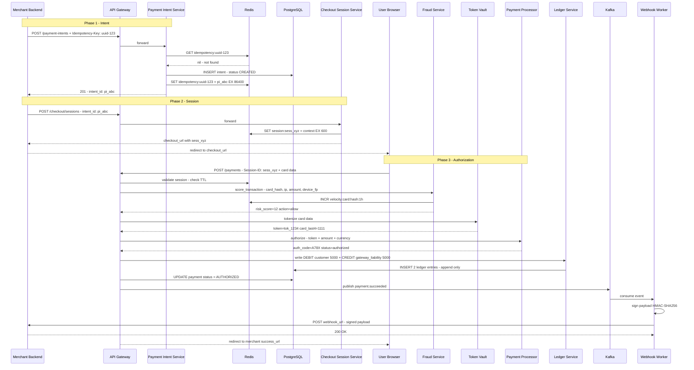
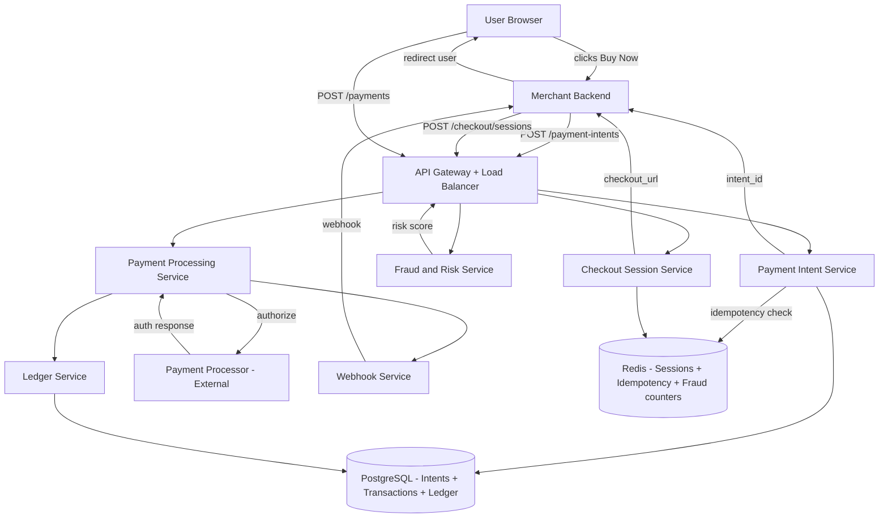
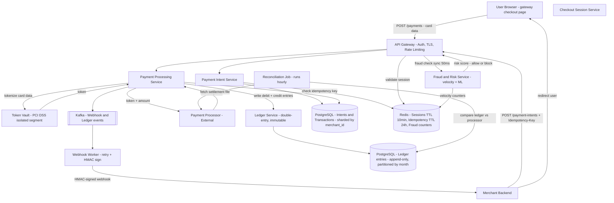
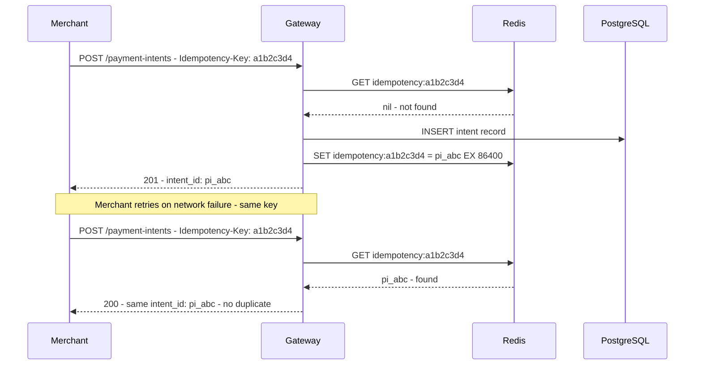
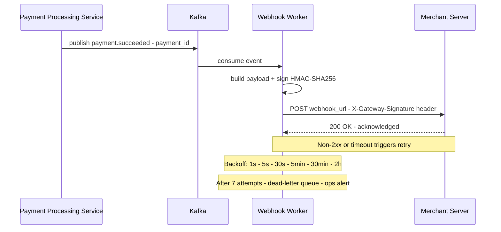
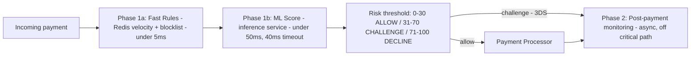

# System Design: Payment Gateway (Stripe / Razorpay / PayPal)

---

## 0. Problem + Scope

Design a payment gateway (like Stripe or Razorpay) that merchants integrate into checkout flows to accept card payments. The gateway handles secure card collection, tokenization, fraud scoring, processor routing, immutable ledger maintenance, and merchant webhook delivery.

**In scope:** payment intent creation, gateway-hosted checkout sessions, card tokenization via vault, pre-auth fraud scoring, double-entry ledger, transaction state machine, webhook delivery, hourly reconciliation.

**Out of scope:** actual bank-level money movement (payment processor is a black box), partial payments and installments, ML model training for fraud (inference is in scope), refunds and chargebacks (extensions worth mentioning).

---

## 1. Assumptions & Scale

```
Scale target:    10,000 TPS peak
Each payment:    3 API calls (intent + session + pay) → 30,000 req/sec peak

Payment intents:
  10,000/sec * 86,400s = 864M intents/day at peak
  Real average ~10x lower → ~86M/day
  Record size ~500 bytes → ~43 GB/day
  PostgreSQL sharded by merchant_id

Ledger entries:
  4 rows per payment (2 on capture + 2 on settlement)
  10,000 TPS * 4 = 40,000 ledger writes/sec — append-only, partitioned by month

Sessions (Redis):
  10,000 concurrent active sessions * 2 KB = ~20 MB — trivial for Redis
  TTL = 10 min; auto-expiry means no cleanup job

Idempotency key store (Redis):
  10,000 keys/sec * 86,400s = 864M keys/day churn
  ~200 bytes per key → ~173 GB/day; Redis cluster with LRU eviction
  TTL = 24h (covers realistic retry windows)

Webhook deliveries:
  10,000 payments/sec → ~15,000 deliveries/sec at peak (at-least-once)
  Kafka topic partitioned per merchant

Fraud scoring:
  10,000 TPS → 10,000 checks/sec
  Fast rules via Redis: under 5ms
  ML inference service: under 50ms (40ms timeout — fallback to rules on timeout)
```

These numbers drive the following decisions: append-only ledger partitioning for write throughput, Redis for sessions and idempotency (not PostgreSQL), Kafka for webhook fan-out, and synchronous fraud scoring with an ML timeout fallback.

---

## 2. Functional Requirements

1. **Payment Intent** — merchant creates an intent with amount, currency, and order reference before card data is collected
2. **Checkout Session** — gateway generates a secure, hosted card-entry page tied to the intent (10-min TTL)
3. **PCI DSS-compliant card handling** — card data is captured on the gateway's own page, tokenized, and never stored raw outside the vault
4. **Fraud scoring** — every transaction is scored synchronously before authorization; high-risk transactions are blocked or challenged
5. **Double-entry ledger** — every payment creates immutable debit and credit entries; debits must always equal credits per payment_id
6. **Transaction status** — merchant can query payment status at any time via GET
7. **Webhook notification** — gateway notifies merchant backend on payment.succeeded, payment.failed, and payment.pending events
8. **Reconciliation** — hourly job aligns gateway ledger with processor settlement file to resolve gaps from network partitions

---

## 3. Non-Functional Requirements

| Requirement | Target |
|---|---|
| Throughput | 10,000 TPS peak |
| Gateway latency | under 200ms (fraud + tokenization + session validation + ledger write) |
| Fraud check latency | under 50ms synchronous, on critical path |
| Availability | 99.99% (four nines) |
| Consistency | CP — consistency over availability; double charges are unacceptable |
| Durability | Zero payment record loss — ACID PostgreSQL with point-in-time recovery |
| Idempotency | All payment operations must be retry-safe — network retries must never double-charge |
| Security | PCI DSS Level 1 — raw card numbers must never leave the vault |
| Ledger correctness | SUM(debits) = SUM(credits) per payment_id at all times |

**Consistency Model:**

| Domain | Model | Reason |
|---|---|---|
| Ledger entries | Strong (ACID) | Financial correctness — no eventual consistency for money |
| Session store | Eventual (Redis) | Short-lived; loss means user retries checkout |
| Idempotency keys | Eventual (Redis) | 24h window covers retries; slight race is acceptable |
| Webhook delivery | At-least-once | Exactly-once requires 2PC across external system |

> [!NOTE]
> **Key Insight:** Most design decisions flow from three constraints: PCI DSS compliance, idempotency, and ledger correctness. Every major component — hosted checkout page, token vault, double-entry ledger, idempotency keys, reconciliation — exists to satisfy one or more of these three.

---

## 4. 🧠 Mental Model

A payment gateway is not simply a transaction processor — it is a correctness-first orchestration layer that moves money safely across multiple financial entities while maintaining an immutable audit trail. Three sequential phases drive every payment: the merchant registers a **payment intent**, the gateway creates a **secure session** and hosts the card entry page, and the user submits card details for **authorization**. The gateway tokenizes, scores for fraud, routes to a payment processor, writes the double-entry ledger, and fans webhooks out to the merchant — all while guaranteeing idempotency across every step.

```
Phase 1: INTENT                 Phase 2: SESSION               Phase 3: PAY
Merchant POST /payment-intents  Merchant POST /checkout/sess   User submits card on GW page
         |                               |                              |
  Idempotency-Key check          Redis TTL 10min                Fraud check  <50ms
  PostgreSQL INSERT               session_id returned           Tokenize -> Vault
  intent_id returned             checkout_url redirect          Route -> Processor
         |                               |                              |
  Redis: SET key->intent_id       User browser opens GW page    Ledger write (4 rows)
  EX 86400 (dedup 24h)            countdown timer starts        Kafka -> Webhook -> Merchant
```

### ⚡ Core Design Principles

| Path | Optimized For | Mechanism |
|---|---|---|
| Fast Path | Latency under 200ms gateway | Redis session lookup + fraud rules + Vault tokenization + sync processor call |
| Reliable Path | Correctness — zero double-charges, zero lost money | Idempotency keys, append-only ledger, ACID PostgreSQL, reconciliation job |
| Audit Path | Immutable money trail | Double-entry bookkeeping — debits = credits invariant per payment_id |

> [!IMPORTANT]
> **The gateway hosts the checkout page — not the merchant.** Card data enters on gateway infrastructure only. This is not a UX decision — it is the PCI DSS compliance boundary. Merchants never see raw card numbers.

> [!NOTE]
> **Key Insight:** Money movement must be correct (no duplication), durable (never lost), and auditable (fully traceable). Latency is secondary to correctness. A 50ms fraud check on the critical path is the right trade-off — a double-charged payment cannot be silently fixed.

---

## 5. API Design

| Method | Path | Description |
|---|---|---|
| POST | /api/v1/payment-intents | Create payment intent {amount, currency, idempotency_key}, returns {intent_id, client_secret} |
| POST | /api/v1/payment-intents/{id}/confirm | Confirm payment with tokenized card, triggers bank charge |
| GET | /api/v1/payment-intents/{id} | Poll payment status |
| POST | /api/v1/refunds | Initiate refund {payment_intent_id, amount} |
| POST | /api/v1/webhooks | Receive async events from payment processors (idempotent) |
| POST | /api/v1/tokens | Tokenize card details → returns opaque token (PCI scope boundary) |

> [!IMPORTANT]
> The `idempotency_key` on `POST /payment-intents` is the most critical design decision in the API — it's what prevents double charges on network retries. The webhooks endpoint must be idempotent too because payment processors deliver at-least-once.

---

## 6. End-to-End Flow

The complete 3-phase charge flow: client → payment service → gateway → bank → webhook callback.

**The story in plain English:**

**Phase 1 — Intent:**
1. Merchant backend calls `POST /payment-intents` with an idempotency key in the header.
2. Payment Intent Service checks Redis: has this idempotency key been seen before? If yes, return the cached response — this is what prevents double charges on network retries.
3. If new: create an intent record in PostgreSQL (status = CREATED), cache the idempotency key in Redis for 24 hours, return `intent_id` to the merchant.

**Phase 2 — Session:**
4. Merchant creates a checkout session using the intent_id. Session context is stored in Redis with a 10-minute TTL.
5. Merchant redirects the user to the hosted checkout page with the session token.

**Phase 3 — Authorization:**
6. User enters card details on the checkout page. The card data goes to the Token Vault first — it never touches the merchant's servers. This is how PCI scope is reduced.
7. Fraud Service scores the transaction in real-time: checks velocity counters in Redis (how many transactions from this card in the last hour?), device fingerprint, IP reputation.
8. If risk score is acceptable, the tokenized card is sent to the Payment Processor (Visa/Mastercard network).
9. Processor returns an authorization code. The Ledger Service writes two entries atomically: debit customer, credit gateway liability. Append-only — never updated.
10. Payment status updates to AUTHORIZED in PostgreSQL.
11. A `payment.succeeded` event is published to Kafka. Webhook Worker consumes it, signs the payload with HMAC-SHA256, and delivers it to the merchant's webhook URL.
12. User is redirected to the merchant's success page.



> [!NOTE]
> **Key Insight:** The ledger write happens BEFORE returning the result to the user. If the gateway crashes after the processor authorizes but before writing the ledger, reconciliation detects the gap and writes the missing entries. Correctness is never conditional on the happy path completing.

---

## 7. High-Level Architecture

### Simple Design



### Evolved Design — Token Vault + Kafka + Separate Ledger DB



---

## 8. Data Model

| Entity | Storage | Key Columns | Why this store |
|---|---|---|---|
| payment_intents | PostgreSQL (sharded by merchant_id) | intent_id, merchant_id, amount, currency, status, created_at | ACID for financial records; sharding by merchant_id distributes write load evenly |
| payment_events | PostgreSQL (append-only) | event_id, payment_id, from_status, to_status, fraud_score, processor_ref, created_at | Immutable audit trail; current state = latest row per payment_id |
| ledger_entries | PostgreSQL (partitioned by month) | entry_id, account_id, payment_id, type (debit/credit), amount_minor_units, currency, created_at | Append-only by design; monthly partitions allow archival; BIGINT for amounts avoids float drift |
| idempotency_keys | Redis (TTL 24h) | idempotency:key → intent_id | Under 1ms lookup; auto-expiry covers retry window; no cleanup job |
| checkout_sessions | Redis (TTL 10 min) | session:sess_id → intent context | Ephemeral by nature; TTL enforces expiry; 20 MB total at 10K TPS — trivial |
| card_tokens | Token Vault (PCI-isolated PostgreSQL) | token_id, encrypted_pan, card_last4, card_brand, created_at | AES-256 + HSM key management; isolated network segment; only component with raw card data |
| webhook_events | Kafka + PostgreSQL (delivery log) | event_id, payment_id, merchant_id, status (pending/delivered/failed), attempt_count, next_retry_at | Kafka for reliable fan-out; delivery log for retry tracking and merchant support queries |

**Ledger correctness invariant:**

For every `payment_id`, `SUM(amount WHERE type=debit) = SUM(amount WHERE type=credit)`. Any row failing this invariant means money was created or destroyed — immediate ops alert. This query is run by the reconciliation job after every batch.

**Why amounts are BIGINT in minor units (never FLOAT):**

IEEE 754 cannot represent 0.10 exactly. Across 10,000 transactions, float arithmetic drifts. Storing 5000.00 INR as the integer `500000` (paise) eliminates all rounding errors. No floats, no lost money.

> [!IMPORTANT]
> **The ledger is the most important table in the system.** If the intent table is lost and the ledger is intact, system state can be reconstructed. The reverse is not true. The ledger must be append-only, ACID-compliant, and backed up with point-in-time recovery.

---

## 9. Deep Dives

### 9.1 Idempotency Keys — Preventing Double Charges

**Here is the problem we are solving:** Merchant calls `POST /payment-intents`, network times out. Merchant does not know if the gateway received the request. Merchant retries. Without idempotency: two intents created, user charged twice.

**Naive solution and why it fails:** Checking by amount + merchant_id + timestamp is not unique enough — the same merchant can legitimately issue two payments for the same amount within seconds.

**Chosen solution:**



Idempotency applies at every layer:

| Operation | Mechanism |
|---|---|
| POST /payment-intents | Idempotency-Key header → Redis dedup (24h TTL) |
| POST /v1/payments card charge | Session ID is single-use — invalidated after first submission |
| Processor call | auth_request_id sent to processor; processor deduplicates on their side |
| Webhook delivery | payment_id as dedup key; merchant checks before fulfilling order |
| Ledger write | payment_id uniqueness constraint per entry type — double write is a no-op |

**Trade-off accepted:** Merchant must generate and include a UUID idempotency key. This is a contract requirement on the API. The 24h TTL covers realistic retry windows — longer TTLs would inflate Redis memory without benefit.

> [!NOTE]
> **Key Insight:** Idempotency is a correctness requirement, not an optimization. Without it, every network retry is a potential double charge. The 24h Redis TTL is the retry window contract — not a performance parameter.

---

### 9.2 Webhook Reliability + Retry

**Here is the problem we are solving:** After a payment is authorized, the merchant's server must be notified so it can fulfill the order. Webhook delivery is a synchronous HTTP call to an external server the gateway does not control — that server can be down, slow, or unreachable for hours.

**Naive solution and why it fails:** A direct HTTP call from the Payment Processing Service to the merchant after authorization introduces a blocking dependency on an external server. A slow merchant server holds a connection open, back-pressures the processing service, and loses the event entirely on timeout.

**Chosen solution — Kafka-backed retry queue with exponential backoff:**



**HMAC signing — why it is mandatory:** Without signing, an attacker can POST a fake `payment.succeeded` to a merchant's webhook URL and receive goods for free. HMAC-SHA256 with the merchant's secret key ensures the payload came from the gateway. Merchants must reject any webhook where `HMAC(body, secret)` does not match the `X-Gateway-Signature` header.

**Merchant-side idempotency:** Webhook worker delivers at-least-once. A correct merchant handler extracts `payment_id`, checks if that payment was already fulfilled, and skips if yes. This is documented as a contract requirement — the same way Stripe documents it.

**Trade-off accepted:** At-least-once delivery means merchants can receive duplicate webhooks. Exactly-once would require distributed 2PC across the gateway and merchant system — prohibitively complex. Duplication is safe because merchants can implement idempotent handlers.

> [!NOTE]
> **Key Insight:** Never process a webhook without verifying the HMAC signature. An unverified webhook endpoint is a free-order vulnerability. Signature verification is the authentication layer for server-to-server callbacks.

---

### 9.3 Fraud Detection — Two-Phase Architecture

**Here is the problem we are solving:** At 10,000 TPS, fraudulent cards from card testing attacks, stolen credentials, and geo-anomaly attacks arrive in the same traffic as legitimate payments. Without a fraud gate, every fraudulent authorization is a direct financial loss plus processor fees plus reversal cost.

**Naive solution and why it fails:** Running a full ML model synchronously on every transaction at 10,000 TPS requires either very low-latency model serving or accepting high latency on the critical path. A single slow inference blocks the payment.

**Chosen solution — two-phase gated architecture:**



**Phase 1a — Fast rules via Redis (under 5ms):**
- Velocity: `INCR velocity:card:hash:1h` — if count over 5 in 1h → risk += 40 (card testing signal)
- Blocklist: if card hash or IP in blocklist → risk += 60 or instant decline
- Amount anomaly: current amount over 5x 30-day rolling average → risk += 20
- Geo anomaly: card issuer country vs request IP country mismatch → risk += 30

**Phase 1b — ML score (under 50ms, 40ms timeout):** transaction sequence, device fingerprint, merchant category code vs history. Output: risk_delta 0–40 added to Phase 1a score. On ML timeout, fall back to Phase 1a score only — the critical path is never blocked on ML availability.

**Trade-off accepted:** Pre-auth fraud check adds 50ms to the critical path on every payment. This is the correct trade-off — a slightly slower payment is recoverable; a fraudulent authorization that completes incurs processor fees, chargeback risk, and reversal complexity.

> [!NOTE]
> **Key Insight:** Pre-auth fraud scoring is cheaper than post-auth reversal by every measure — no processor authorization fee, no reversal flow, no user confusion. The 50ms budget on the critical path is intentional. FRAUD_DECLINED is the cheapest terminal state in the system.

---

## 10. Bottlenecks & Scaling

### Peak Transaction Volume (10,000 TPS)

**What breaks first:** The PostgreSQL payment_intents table becomes a write bottleneck as a single primary handles 10,000 inserts/sec plus 40,000 ledger writes/sec.

**Scaling strategy:**
- Shard `payment_intents` by `merchant_id` — consistent hash distributes merchants across shards; each merchant's transactions land on one shard, making per-merchant queries fast
- Shard `ledger_entries` by `payment_id` with monthly partitioning — even distribution across partitions; older months archived to cold storage (S3)
- Read replicas for `GET /payments/{id}` and balance queries — all reads served by replicas, writes to primary only
- Redis idempotency store scales horizontally as a cluster — LRU eviction after TTL expiry keeps memory bounded at ~173 GB/day churn

### Webhook Fan-Out at Scale

**What breaks first:** 15,000 webhook deliveries/sec with external HTTP calls to merchant servers — any slow merchant server backs up the delivery queue.

**Scaling strategy:**
- Kafka topic partitioned by `merchant_id` — each merchant's events land on one partition, ensuring ordered delivery per merchant; slow merchants don't block fast merchants
- Webhook worker pool scales horizontally — each worker consumes from its assigned partitions; auto-scaling on consumer lag metric
- Per-merchant concurrency cap — max N concurrent outbound connections per merchant prevents any single merchant from monopolizing worker threads
- Dead-letter queue after 7 attempts — ops alert fires; merchant is notified via dashboard rather than indefinite retries

### Reconciliation at Scale

**What breaks first:** Hourly reconciliation job doing full table scans on `ledger_entries` at 43 GB/day growth becomes slow without proper indexing.

**Scaling strategy:**
- Reconciliation queries only the last 2-hour window (`created_at > NOW() - interval '2 hours'`) with a composite index on `(payment_id, created_at)`
- Processor settlement file is ingested incrementally — chunked by time window, not a full file scan
- Invariant check (`debits = credits per payment_id`) runs on the delta, not the full ledger — O(new rows) not O(total rows)
- Monthly partitions on `ledger_entries` mean old data is not scanned at all during reconciliation

---

## 11. Failure Scenarios

| Failure | Impact | Recovery |
|---|---|---|
| Gateway timeout before processor call | Payment never sent to bank; intent stuck in PENDING | Reconciliation fetches status from processor; writes missing ledger entries or marks FAILED |
| Processor returns success but gateway crashes before writing ledger | Processor holds authorization; ledger has no entry | Reconciliation detects gap via settlement file; writes missing ledger entries; sends webhook |
| Double charge — idempotency key race condition | Two concurrent retries both pass Redis GET before SET | Redis SET NX (set-if-not-exists) atomic operation prevents race; only one intent is created |
| Webhook delivery failure — merchant server down | Merchant does not fulfill order | Kafka retry with exponential backoff (1s, 5s, 30s, 5min, 30min, 2h); DLQ after 7 attempts; ops alert |
| Redis session store restart | Active checkout sessions lost — users mid-checkout lose session | User sees "session expired" error; merchant must re-create checkout session; no money moved yet |
| Fraud service timeout | Unable to compute risk score before processor call | ML timeout → fall back to fast rules score only; never block payment on ML availability |
| Token vault unavailable | Cannot tokenize card data; payment cannot proceed | Return 503 to user; no ledger entry; no processor call; PCI scope is not breached |
| Ledger invariant violation detected by reconciliation | SUM(debits) != SUM(credits) for a payment_id | Immediate ops page; manual investigation; compensating ledger entry written with audit note |
| PostgreSQL primary failover | Write path unavailable during failover (~30–60s) | Read replica promoted; new writes accepted after promotion; inflight transactions retry via idempotency key |
| Processor outage — primary gateway | 100% payment failures while processor is down | Multi-processor routing: failover to secondary processor in under 1s via health check; no manual intervention |

---

## 12. Trade-offs

### Idempotency Key Storage — Redis vs PostgreSQL

| Dimension | Redis with TTL 24h (chosen) | PostgreSQL idempotency table |
|---|---|---|
| Lookup latency | under 1ms | 5–50ms (disk I/O) |
| TTL support | Native key expiry — no cleanup job | Requires background DELETE job on old rows |
| Durability | Non-durable — restart loses keys | Durable — survives restarts |
| Scale at 10K TPS | 864M keys/day churn; Redis cluster handles this | 864M rows/day; PostgreSQL write bottleneck |

**Chosen: Redis with 24h TTL.** At 10,000 TPS, PostgreSQL cannot absorb 864M idempotency key writes/day on top of existing payment writes. Redis under 1ms lookup keeps idempotency check off the critical path. The durability trade-off is acceptable: a Redis restart loses keys in-flight. The only consequence is a small window where a retry could create a duplicate — caught by the PostgreSQL `payment_id` uniqueness constraint as a safety net.

> [!NOTE]
> **Key Insight:** Redis TTL makes idempotency key management zero-maintenance. PostgreSQL would need a background job deleting millions of rows per day. TTL expiry is free.

---

### At-Least-Once Webhook Delivery vs Exactly-Once

| Dimension | At-Least-Once with Kafka (chosen) | Exactly-Once delivery |
|---|---|---|
| Implementation complexity | Kafka retry queue + HMAC signing | Distributed 2PC spanning gateway + merchant |
| Risk | Merchant receives duplicate webhook | None |
| Mitigation | Merchant implements idempotent handler | Not needed |
| Infrastructure cost | Low | High — 2PC adds significant latency and complexity |
| Industry standard | Stripe, Razorpay, Braintree all use at-least-once | No major payment gateway uses exactly-once |

**Chosen: At-least-once with HMAC signing and documented idempotency contract.** Exactly-once delivery requires distributed transactions across systems the gateway does not control. At-least-once is safe because merchants can (and must) implement idempotent webhook handlers. This is standard across the payments industry — it is a documented API contract, not a limitation.

> [!NOTE]
> **Key Insight:** The queue (Kafka) is a correctness requirement for webhook delivery, not a performance optimization. Without it, webhook delivery is a synchronous call on the critical path — one slow merchant server backs up payment processing for everyone.

---

### PCI Scope Reduction via Tokenization

| Dimension | Token Vault (chosen) | Merchant stores card data |
|---|---|---|
| PCI DSS scope | Only vault and checkout page in scope | Entire merchant infrastructure in scope |
| Breach impact | Token exposed = useless without vault mapping | Card number exposed = immediate fraud risk |
| Audit cost | Gateway absorbs annual PCI audit | Every merchant needs annual PCI audit |
| Integration | Merchant redirects to gateway checkout URL | Merchant builds own card form |

**Chosen: Token Vault with gateway-hosted checkout page.** The vault isolates all raw card data into a single, audited, HSM-backed component. A breach anywhere outside the vault — Intent Service, Fraud Service, Ledger, Webhook Worker — exposes zero card data. This is the value proposition of Stripe and Razorpay: merchants accept payments without ever entering PCI scope.

> [!IMPORTANT]
> **Tokenization is not about security theatre.** The vault's network isolation means an attacker who compromises the Ledger Service or Fraud Service gets transaction metadata — amounts, merchant IDs, timestamps — but zero card numbers. The blast radius of any breach outside the vault is bounded.

---

## 13. Interview Summary

### Key Decisions

| Decision | Problem It Solves | Trade-off Accepted |
|---|---|---|
| Double-entry ledger (immutable, append-only) | No money lost; SQL invariant catches imbalance instantly | 4 writes per payment; balance requires SUM query not a column read |
| Pre-auth fraud scoring under 50ms | Block fraud before processor call — no fee, no reversal, no user confusion | +50ms on every payment critical path; ML timeout falls back to fast rules |
| Gateway hosts checkout page | Card data never touches merchant servers; PCI DSS scope isolation | Merchant must redirect users to gateway URL |
| Token Vault in isolated PCI segment | Raw card data never in main DB; breach elsewhere = zero card exposure | Additional network hop; vault is separate PCI-scoped infrastructure |
| Idempotency keys — Redis, 24h TTL | Network retries cannot double-charge | Merchant must generate and send idempotency key on every call |
| Kafka for webhook delivery | At-least-once fan-out; retry on failure; merchant server isolation | Merchants must implement idempotent webhook handlers |
| Hourly reconciliation job | Gateway ledger converges with bank truth after network partitions | Up to 1h before a PENDING payment resolves to FAILED or CAPTURED |

### Fast Path vs Reliable Path

```
Fast Path (under 200ms gateway processing):
  User submits card on gateway checkout page
    → session validation (Redis, under 1ms)
    → fraud check fast rules (Redis, under 5ms)
    → fraud check ML score (inference service, under 50ms)
    → tokenize card data (Vault, ~10ms)
    → authorize with processor (sync, 2-5s processor-side)
    → redirect user to merchant success_url

Reliable Path (correctness — zero money lost):
  Intent creation  → PostgreSQL INSERT before returning intent_id
  Fraud DECLINE    → terminal state, no ledger entry, no processor call, no fee
  Authorization    → ledger entries written BEFORE returning result to user
  State transition → payment_events append BEFORE broadcasting result
  Processor timeout → status = PENDING, reconciliation resolves within 1h
  Webhooks         → Kafka at-least-once, retry with backoff, DLQ after 7 attempts

If fast path fails (processor timeout at 30s):
  Payment status = PENDING
  No ledger entry yet (reconciliation writes it on resolution)
  Reconciliation job picks up within 1h
  Webhook sent to merchant after reconciliation resolves
  User sees "payment processing" — confirmation email follows
```

### Key Insights Checklist

- **The double-entry ledger is a mathematical invariant.** Every payment creates 4 immutable rows. `SUM(debits) = SUM(credits)` per `payment_id` is enforced by a SQL query. If that query returns rows, money is missing — not possible to miss silently.
- **Fraud check runs before the processor call — always.** Pre-auth scoring is cheaper than post-auth reversal: no processor authorization fee, no reversal flow, no user confusion. FRAUD_DECLINED is the cheapest terminal state.
- **Payment gateway is not payment processor.** The gateway orchestrates, tokenizes, scores fraud, and maintains the ledger. The processor moves money at the bank. We design the gateway — bank interaction is an external black box.
- **The gateway hosts the checkout page because of PCI DSS, not UX.** Card data enters on gateway infrastructure. Merchants never see raw card numbers. The vault isolates PCI scope to a single component.
- **Idempotency is a correctness requirement, not an optimization.** Every payment API call must be retry-safe. Without idempotency keys, retries equal double charges equal broken ledger invariant.
- **The processor's settlement file is the source of truth — not your database.** Reconciliation syncs the ledger against bank reality on a schedule. For disputes, the bank's record wins — always.
- **Webhooks are at-least-once; merchants must be idempotent.** HMAC-sign every webhook for authenticity. Merchants check if `payment_id` was already fulfilled before acting — this is documented as an API contract.
