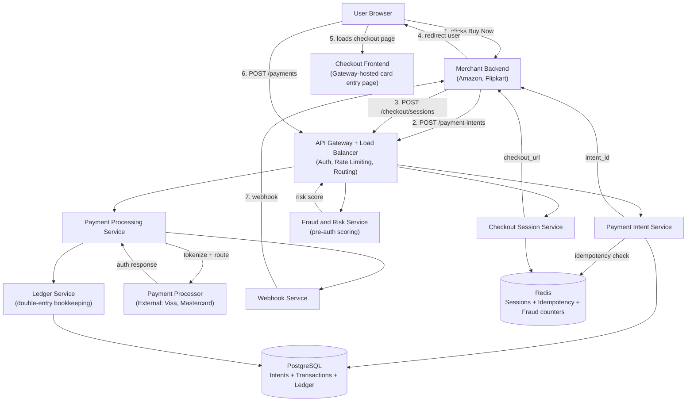
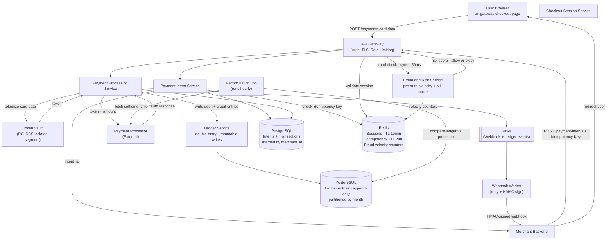
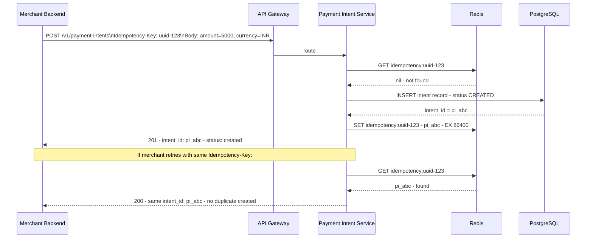
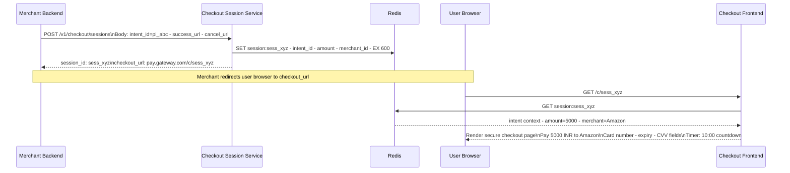
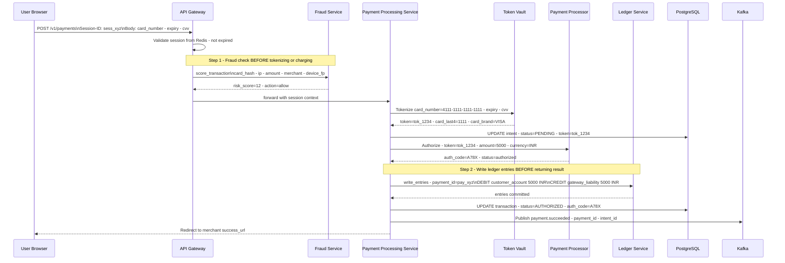
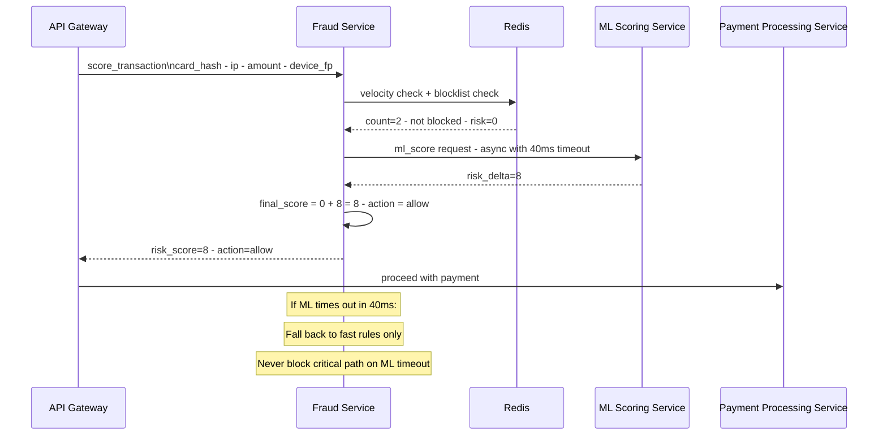
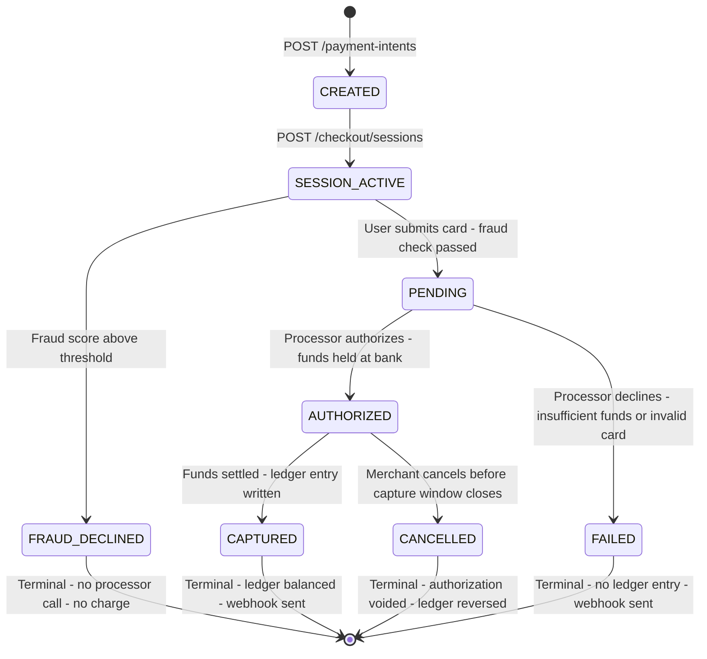
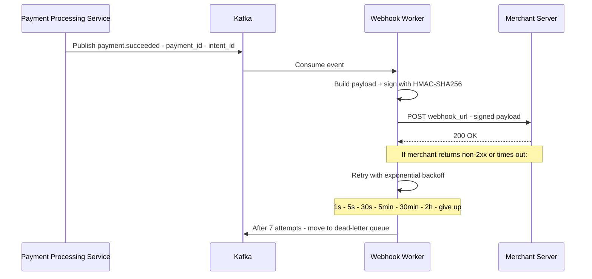

# System Design: Payment Gateway (Stripe / Razorpay / PayPal)

---

## 🧠 Mental Model

> **A payment system is not about processing requests. It is about moving money safely across multiple financial entities with strict guarantees.**

The three financial entities in motion:

| Entity | Role | Our interaction |
|---|---|---|
| **User / Customer** | Initiates payment; funds come from their bank | We collect card data, tokenize, debit their account in our ledger |
| **Payment Gateway** | Orchestrates, tokenizes, routes, records | We design this — ledger, fraud check, state machine, idempotency |
| **Merchant** | Receives money for goods/services | We credit their account in our ledger; send webhook on settlement |

And the supporting financial infrastructure:

| | Payment Gateway | Payment Processor |
|---|---|---|
| **What it is** | Orchestration + ledger + fraud engine | Financial network entity |
| **What it does** | Tokenizes card, routes to processor, maintains ledger, fires webhooks | Talks to banks and card networks (Visa/Mastercard) to authorize and settle money |
| **Our scope** | ✅ We are designing this | ❌ External black box |

The system runs three sequential phases:

```
Phase 1: INTENT             Phase 2: SESSION            Phase 3: PAY
User clicks Buy Now    →    Gateway creates        →    User submits card
                            secure checkout page        details on GW page
       │                           │                           │
Merchant backend            Merchant redirects         Gateway tokenizes
POST /payment-intents       user to GW checkout URL    → fraud check
       │                           │                    → routes to processor
       ▼                           ▼                    → writes ledger entry
Payment Intent DB           Redis (TTL 10 min)          Payment Processor
returns intent_id           returns session_id          → Bank authorization
```

> [!IMPORTANT]
> **The gateway hosts the checkout page — not the merchant.** When you click "Pay Now" on Amazon, Amazon redirects you to Razorpay/Stripe's page to enter card details. This is not a UX choice — it is the PCI DSS compliance boundary. Card data must never touch the merchant's servers.

### ⚡ Core Design Principle

> **Money movement must be: correct (no duplication), durable (never lost), auditable (fully traceable). Latency is secondary to correctness.**

| Principle | Mechanism | Why it cannot be skipped |
|---|---|---|
| **Correctness — no duplication** | Idempotency key per request; deduplicated in Redis before any DB write | Every network retry is a potential double charge. Correctness is non-negotiable. |
| **Durability — never lost** | Append-only ledger; PostgreSQL ACID; reconciliation closes the gap | Money cannot disappear from the books. Every debit must have a matching credit. |
| **Auditability — fully traceable** | Double-entry ledger; append-only event log; immutable records | Regulators, chargebacks, and disputes require a complete money trail going back years. |
| **Latency is secondary** | Synchronous fraud check (< 50ms) sits on the critical path; everything else is async | A slightly slower payment is recoverable. A fraudulent or double-charged payment is not. |
| **Tokenization** | Card data → random token; raw card number never stored in main DB | PCI DSS compliance; vault isolates card data; breach elsewhere = zero card exposure |
| **Session = Redis TTL** | Checkout session lives ~10 min; auto-expires | Low latency lookup; no cleanup job needed |
| **Async confirmation** | Processor responds "authorization placed", not "money moved" | Decouples gateway latency from bank processing; reconciliation bridges the gap |
| **Webhook at-least-once** | Kafka retry queue; HMAC-signed payloads | Reliable merchant notification; merchants must handle duplicates |

> [!NOTE]
> **Key Insight:** The 200ms latency target covers only the gateway's processing — fraud check, tokenization, session validation, routing to processor. The actual bank authorization (inside the payment processor) takes 2–5 seconds. We are responsible for < 200ms of that total. Correctness constraints (ledger writes, idempotency checks) sit on this critical path — they cannot be deferred.

---

## 1. Problem Statement & Scope

Design a payment gateway (like Stripe, Razorpay, or PayPal) that merchants integrate into their checkout flows to accept payments from users. The gateway collects card details securely, tokenizes them, scores transactions for fraud, routes to payment processors, maintains an immutable financial ledger, and notifies merchants of payment outcomes.

**In scope:**
- Payment intent creation — register a payment before card data is collected
- Secure checkout session — gateway-hosted card entry page (not merchant's)
- Card tokenization and routing to external payment processor
- Double-entry ledger — immutable financial record of every money movement
- Fraud and risk scoring — pre-authorization fraud check on every transaction
- Transaction status tracking and state machine
- Webhook delivery to merchants on payment outcomes
- Reconciliation — aligning gateway ledger with processor settlement

**Out of scope:**
- Actual bank-level money movement (payment processor — black box)
- Partial payments and installments
- Refunds and chargebacks (mention as extensions)
- ML model training for fraud (inference is in-scope; training is not)

---

## 2. Requirements

### Functional Requirements

1. **Payment Intent** — merchant creates a payment intent (what's being bought, amount, currency)
2. **Checkout Session** — gateway generates a secure session and hosted checkout page for card entry
3. **PCI DSS-compliant data handling** — card data captured on gateway's page, tokenized, never stored raw
4. **Fraud scoring** — every transaction scored before authorization; high-risk blocked or challenged
5. **Ledger entry** — every payment creates immutable debit/credit entries in the double-entry ledger
6. **Transaction status** — merchant can query payment status at any time
7. **Webhook notification** — gateway notifies merchant's backend when payment succeeds or fails
8. **Reconciliation** — hourly job aligns gateway ledger with processor settlement file

### Non-Functional Requirements

| Requirement | Target | Reasoning |
|---|---|---|
| Scale | 10,000 TPS | Stated by interviewer |
| CAP choice | Consistency over Availability (CP) | Money — double charges or lost payments are unacceptable |
| Latency | < 200ms for gateway processing | Fraud check + tokenization + session validation + ledger write |
| Security | PCI DSS Level 1 compliant | Card data must never be exposed to merchants or stored raw |
| Durability | Zero payment record loss | Every transaction record must survive server failures |
| Idempotency | All payment operations must be retry-safe | Network retries must never double-charge |
| Fraud detection latency | < 50ms (synchronous, on critical path) | Must not push total gateway latency over 200ms |
| Ledger consistency | Books must always balance (debits = credits per payment) | Any imbalance means money is lost or duplicated |

> [!NOTE]
> **Key Insight:** This system is domain-centric — most design decisions flow from three constraints: PCI DSS compliance, idempotency, and ledger correctness. Every major architectural choice (hosted checkout page, token vault, double-entry ledger, idempotency keys, reconciliation) exists to satisfy one or more of these.

---

## 3. Back-of-Envelope Estimations

```
Scale: 10,000 TPS peak

Each payment = 3 API calls (intent + session + pay) → 30,000 req/sec peak

Payment Intent records:
  10,000/sec × 86,400s = 864M intents/day at peak
  Real average ~10× lower → ~86M/day
  Record size ~500 bytes → ~43 GB/day
  PostgreSQL sharded by merchant_id — manageable

Ledger entries:
  Each payment = 4 ledger entries (2 for capture, 2 for settlement)
  10,000 payments/sec × 4 entries = 40,000 ledger writes/sec
  Append-only — high write throughput, no updates
  Partitioned by created_at month; older partitions archived to cold storage

Session data (Redis):
  10,000 concurrent active sessions (TTL = 10 min)
  Session size ~2 KB each → ~20 MB in Redis at any time
  Trivial for Redis — billions of keys supported

Webhook deliveries:
  10,000 payments/sec → 10,000 webhooks/sec to merchants
  At-least-once + retry → ~15,000 deliveries/sec peak
  Kafka topic with per-merchant partitioning

Idempotency key store (Redis):
  TTL = 24h; 10,000 keys/sec × 86,400s = 864M keys/day
  Key size ~200 bytes → ~173 GB/day churn
  Redis cluster with LRU eviction — manageable

Fraud scoring:
  10,000 TPS → 10,000 fraud checks/sec
  Fast rules via Redis (< 5ms); ML scoring service (< 50ms)
  Redis counters: ~50 bytes per card per time window → hundreds of MB
```

---

## 4. API Design

### Merchant-Facing APIs

```
POST /v1/payment-intents
  Header:  Authorization: Bearer {merchant_api_key}
  Header:  Idempotency-Key: {client_generated_uuid}
  Body:    { amount, currency, customer_id, order_id, metadata }
  Response: { intent_id, status: "created", created_at }
  Purpose: Register a payment before any card data is collected

POST /v1/checkout/sessions
  Header:  Authorization: Bearer {merchant_api_key}
  Body:    { intent_id, success_url, cancel_url }
  Response: { session_id, checkout_url: "https://pay.gateway.com/c/{session_id}" }
  Purpose: Create secure session; merchant redirects user to checkout_url

GET /v1/payments/{payment_id}
  Header:  Authorization: Bearer {merchant_api_key}
  Response: { payment_id, intent_id, status, amount, currency, created_at, updated_at }
  Purpose: Poll transaction status (supplement to webhook)

GET /v1/ledger/accounts/{merchant_id}/balance
  Header:  Authorization: Bearer {merchant_api_key}
  Response: { account_id, balance, currency, last_settled_at }
  Purpose: Merchant views their ledger balance (money owed to them)
```

### Gateway-Internal API (Checkout Page Only)

```
POST /v1/payments
  Header:  Session-ID: {session_id}     ← validated server-side from Redis
  Body:    { card_number, expiry, cvv, cardholder_name }
  Response: { payment_id, status: "pending" }
  Purpose: User submits card data on gateway-hosted checkout page
  Note:    This endpoint is ONLY called by the gateway's own checkout frontend.
           Merchants never call this directly — they have no access.
           This endpoint lives inside the PCI DSS-scoped network segment.
```

### Webhook Payload (Pushed to Merchant)

```
POST {merchant_webhook_url}
  Header:  X-Gateway-Signature: HMAC-SHA256(payload, merchant_webhook_secret)
  Body:    {
    event:      "payment.succeeded" | "payment.failed" | "payment.pending",
    payment_id: "pay_xyz",
    intent_id:  "pi_abc",
    amount:     5000,
    currency:   "INR",
    timestamp:  "2026-03-28T10:00:00Z"
  }
```

> [!NOTE]
> **Key Insight:** The Idempotency-Key header on POST /payment-intents is the most important field in the entire API. If the merchant's server crashes after calling the API but before receiving the response, it retries with the same key — and gets back the same intent_id without creating a duplicate payment. This prevents double charges on any infrastructure failure.

---

## 5. Architecture

### Simple High-Level Design



### Evolved Design (with Token Vault + Kafka + Ledger + Fraud + Reconciliation)



---

## 6. Deep Dives

### 6.1 Complete Payment Flow (The 3-Phase Journey)

> **Here is the problem we are solving: a user wants to pay a merchant, but the merchant must never see card data, and we must guarantee exactly-once money movement even across retries and failures.**

#### Phase 1 — Payment Intent



#### Phase 2 — Secure Session (Gateway creates checkout page)



#### Phase 3 — Authorization (User clicks Pay Now)



---

### 6.2 Ledger System — The Financial Backbone

> **Here is the problem: without a ledger, you have no way to answer: "How much money is owed to merchant X?" or "Did any money disappear during a failure?" The double-entry ledger is how banks have solved this for 600 years. Stripe solves it the same way.**

**Double-entry bookkeeping — the invariant:**

```
For every payment, the sum of all debits = sum of all credits.
Money is never created or destroyed — only transferred between accounts.
If debits ≠ credits for any payment_id → money is lost or duplicated → immediate alert.
```

**The three accounts in the gateway ledger:**

| Account | Represents | Debited when | Credited when |
|---|---|---|---|
| `customer:{customer_id}` | Money leaving the customer | User pays (authorization) | Refund issued |
| `gateway_liability` | Money gateway holds on behalf of merchants | Merchant is paid (settlement) | User pays (authorization) |
| `merchant:{merchant_id}` | Money owed to the merchant | Funds returned/reversed | Settlement confirmed |

**Concrete example — a ₹5,000 payment:**

```
Event 1: User pays ₹5,000 (authorization)
  DEBIT   customer:cust_abc    5000 INR  payment_id=pay_xyz
  CREDIT  gateway_liability    5000 INR  payment_id=pay_xyz
  ─────────────────────────────────────────────────────────
  Net movement: 5000 debit - 5000 credit = 0  ✅ books balance

Event 2: Gateway settles ₹5,000 to merchant (capture/settlement)
  DEBIT   gateway_liability    5000 INR  payment_id=pay_xyz
  CREDIT  merchant:merch_xyz   5000 INR  payment_id=pay_xyz
  ─────────────────────────────────────────────────────────
  Net movement: 5000 debit - 5000 credit = 0  ✅ books balance

Total entries for this payment: 4 rows
Invariant check: SUM(all debits for pay_xyz) = SUM(all credits for pay_xyz) = 5000 ✅
```

**Ledger schema (append-only — never update, never delete):**

```sql
CREATE TABLE ledger_entries (
  entry_id    UUID         PRIMARY KEY DEFAULT gen_random_uuid(),
  account_id  TEXT         NOT NULL,  -- "customer:cust_abc" | "gateway_liability" | "merchant:merch_xyz"
  payment_id  UUID         NOT NULL,  -- FK to payments table
  type        TEXT         NOT NULL   CHECK (type IN ('debit', 'credit')),
  amount      BIGINT       NOT NULL,  -- in minor units (paise, cents) — no floats
  currency    TEXT         NOT NULL,
  description TEXT,
  created_at  TIMESTAMPTZ  NOT NULL DEFAULT NOW()
  -- NEVER UPDATE. NEVER DELETE.
  -- If you need to reverse: INSERT new entries with opposite sign.
);

-- Index for balance queries
CREATE INDEX idx_ledger_account_currency ON ledger_entries(account_id, currency);

-- Index for reconciliation
CREATE INDEX idx_ledger_payment ON ledger_entries(payment_id);
```

**Account balance query:**

```sql
-- Merchant balance = total credited - total debited
SELECT
  SUM(CASE WHEN type = 'credit' THEN amount ELSE -amount END) AS balance
FROM ledger_entries
WHERE account_id = 'merchant:merch_xyz'
  AND currency = 'INR';
```

**Invariant check (runs during reconciliation):**

```sql
-- For every payment_id, total debits must equal total credits
-- Any row here = money is lost or duplicated = page on-call immediately
SELECT payment_id,
       SUM(CASE WHEN type = 'debit'  THEN amount ELSE 0 END) AS total_debits,
       SUM(CASE WHEN type = 'credit' THEN amount ELSE 0 END) AS total_credits
FROM ledger_entries
GROUP BY payment_id
HAVING SUM(CASE WHEN type = 'debit' THEN amount ELSE 0 END)
    != SUM(CASE WHEN type = 'credit' THEN amount ELSE 0 END);
```

**How the ledger connects to reconciliation:**

```
Reconciliation uses the ledger as the gateway's source of truth:

Processor settlement file says: pay_xyz = ₹5,000 captured
Ledger should show:             merchant:merch_xyz credited ₹5,000 for pay_xyz

If they match  → no action
If they differ → which system is wrong?
  Processor file is the ultimate truth (bank reality)
  Update ledger to match + alert ops team
```

**Why amounts are stored as integers (BIGINT), never floats:**

```
float64 representation of ₹0.10:
  0.1 (decimal) ≠ 0.1000000000000000055511151231257827021181583404541015625 (IEEE 754)

Accumulated across 10,000 transactions:
  1000 × 0.10 using float = 99.9999999... ≠ 100.00

Ledger uses BIGINT minor units:
  ₹5000.00 stored as 500000 paise
  No floating point — no rounding errors — no lost money
```

> [!IMPORTANT]
> **The ledger is the most important table in the system.** It is the answer to every dispute, every regulatory audit, and every reconciliation failure. It must be append-only (never update, never delete), stored in ACID-compliant PostgreSQL, and backed up with point-in-time recovery. If the intent table is lost and the ledger is intact, you can reconstruct the system state. The reverse is not true.

> [!NOTE]
> **Key Insight:** Double-entry bookkeeping enforces a mathematical invariant: debits = credits per payment. This makes money loss detectable — not just possible to detect by checking logs, but guaranteed to produce an anomaly in a simple SQL query. That query running clean means no money was lost. This is why Stripe, every bank, and every financial system uses double-entry. It is not accounting jargon — it is a correctness invariant enforced by schema design.

---

### 6.3 Fraud and Risk System

> **Here is the problem: at 10,000 TPS, fraudulent cards from card testing, stolen credentials, and geo-anomaly attacks arrive in the same traffic as legitimate payments. Without a fraud gate, every declined authorization is a cost, and every fraudulent authorization that succeeds is a loss.**

**Two-phase fraud architecture:**

```
Phase 1: Pre-authorization (synchronous — on the critical path — must complete < 50ms)
  Runs BEFORE tokenization and processor call
  If risk_score > threshold → decline immediately, charge nothing

Phase 2: Post-payment monitoring (asynchronous — off critical path)
  ML model on transaction sequences, device fingerprints, chargeback patterns
  Feeds risk signals back into fast rules for future transactions
```

**Phase 1 — Fast rules via Redis (< 5ms):**

```
Input: { card_hash, ip_address, amount, merchant_category, device_fingerprint }

Rule 1: Velocity check — card testing pattern
  INCR velocity:card:{card_hash}:1h
  EXPIRE velocity:card:{card_hash}:1h 3600
  If count > 5 attempts in 1h → risk += 40
  (Card testers try small amounts on many merchants rapidly)

Rule 2: Blocklist check
  GET blocklist:card:{card_hash} → if exists: decline immediately (risk = 100)
  GET blocklist:ip:{ip_address}  → if exists: risk += 60

Rule 3: Amount anomaly
  GET user_avg_txn:{customer_id} → stored as rolling 30d average
  If current_amount > 5 × avg → risk += 20

Rule 4: Geo anomaly
  Card issuer country: US
  Request IP country: NG (Nigeria)
  Transaction at: 3:00 AM local time
  → risk += 30
```

**Phase 1 — ML score (< 50ms, synchronous inference service):**

```
ML model inputs:
  - Transaction sequence (last 10 transactions for this card)
  - Merchant category code (MCC) vs historical MCCs for this card
  - Device fingerprint match vs card's known devices
  - Time of day + day of week anomaly
  - BIN (Bank Identification Number) country vs IP country

ML model output:
  risk_delta: 0-40 (added to fast rule score)
```

**Risk threshold and action:**

```
Final score = fast_rules_score + ml_score

0  – 30: ALLOW           → proceed to tokenization and processor
31 – 70: CHALLENGE        → require 3DS (one-time password from card bank)
71 – 100: DECLINE         → reject immediately, no processor call

3DS Challenge flow:
  Gateway detects: action = CHALLENGE
  Returns redirect to card bank's 3DS page
  User completes OTP/biometric
  Bank redirects back to gateway with 3DS result
  Gateway proceeds if 3DS passed; declines if failed
```

**Fraud detection architecture:**



**Why fraud check runs before tokenization:**

```
Without pre-auth fraud check:
  1. Gateway tokenizes card (uses vault compute)
  2. Gateway calls processor (incurs authorization fee even if later reversed)
  3. Processor returns authorized
  4. Fraud detected post-hoc → must issue reversal → merchant is notified → bad UX

With pre-auth fraud check:
  1. Fast rules + ML score in < 50ms
  2. Decline → no vault call, no processor call, no fee, no reversal needed
  3. User sees decline reason immediately
```

> [!NOTE]
> **Key Insight:** Pre-auth fraud scoring is cheaper than post-auth reversal by every measure: processor fees, vault compute, chargeback risk, and user experience. The 50ms budget for fraud check on the critical path is the correct trade-off — a slightly higher latency payment is acceptable; a fraudulent authorization that completes is not.

---

### 6.4 Tokenization and PCI DSS Compliance

> **The gateway never stores raw card numbers. The token vault is the only PCI DSS-scoped system. Everything else operates on tokens.**

**What tokenization does:**

```
User enters:  card_number = 4111 1111 1111 1111
              expiry      = 12/28
              cvv         = 123

Token Vault:
  1. Encrypt card with AES-256 (key stored in HSM — Hardware Security Module)
  2. Generate random token: tok_abc123xyz
  3. Store: tok_abc123xyz → encrypted(4111..., 12/28, 123)
  4. Return: token = tok_abc123xyz,  card_last4 = 1111

Gateway DB stores:  token, card_last4, card_brand
Gateway NEVER stores: card_number, full expiry, cvv

When routing to processor:
  Vault looks up token → decrypts real card data → sends to processor over TLS + mutual auth
  Processor receives real card data (from vault), not tokens
```

**PCI DSS scope isolation:**

```
┌────────────────────────────────────────────────────────────────┐
│  PCI DSS Scope (isolated network segment, strict access control)│
│  ┌──────────────────────────────────────────────────────────┐  │
│  │  Token Vault                                             │  │
│  │  - Only component that receives raw card data            │  │
│  │  - Encrypts using HSM-backed keys                        │  │
│  │  - Communicates with processor via TLS + mutual auth     │  │
│  └──────────────────────────────────────────────────────────┘  │
└────────────────────────────────────────────────────────────────┘

All other services (Intent Service, Fraud Service, Ledger Service,
Webhook Worker) operate OUTSIDE PCI scope — they only handle tokens.
A breach anywhere outside the vault exposes zero card data.
```

> [!IMPORTANT]
> **The reason the gateway hosts the checkout page is PCI DSS compliance.** If the merchant's website collected card data, the merchant's entire infrastructure would be in PCI scope — requiring expensive annual audits, penetration testing, and compliance overhead. By hosting the card entry page, the gateway takes on PCI scope so merchants don't have to.

> [!NOTE]
> **Key Insight:** Tokenization isolates PCI scope. The vault is the only component that ever sees raw card numbers. A breach in any other part of the system — Intent Service, Fraud Service, Ledger, Webhook Worker — exposes zero card data. This is the security architecture that makes it possible to run a payment company with a relatively small compliance footprint.

---

### 6.5 Idempotency — Preventing Double Charges

> **The most critical correctness property in a payment system: the same payment must never be processed twice, even when the client retries due to network failures.**

**The problem:**

```
Merchant calls POST /v1/payment-intents
  → Network timeout at 150ms
  → Merchant doesn't know: did the gateway receive it?
  → Merchant retries
  → WITHOUT idempotency: two intents created → user charged twice
```

**The solution:**

```
Request header:  Idempotency-Key: a1b2c3d4-uuid-generated-by-merchant

Gateway logic:
  1. Check Redis: GET idempotency:a1b2c3d4
     → Found:     return cached response immediately (no DB write, no duplicate)
     → Not found: proceed with processing
  2. Process request → write to PostgreSQL
  3. Cache result: SET idempotency:a1b2c3d4 {intent_id, status} EX 86400
  4. Return response

On merchant retry with same key:
  → Redis HIT → return same intent_id → zero duplicates
```

**Idempotency applies across all operations:**

| Operation | Mechanism |
|---|---|
| POST /payment-intents | Idempotency-Key header → Redis dedup (24h TTL) |
| POST /v1/payments (card charge) | Session ID is single-use — invalidated after first use |
| Processor call | auth_request_id sent to processor; processor deduplicates on their side |
| Webhook delivery | payment_id as dedup key; merchant must check before acting |
| Ledger write | payment_id uniqueness constraint per entry type — double write is a no-op |

> [!NOTE]
> **Key Insight:** Idempotency is not an optimization — it is a correctness requirement. Without it, every network retry is a potential double charge. The 24h TTL on idempotency keys covers the realistic window for retries. After 24h, a new payment with the same key is treated as a fresh payment.

---

### 6.6 Payment State Machine

Every payment flows through defined states. No state can be skipped; no backward transitions are allowed (except to FAILED from any in-progress state).



**State stored in PostgreSQL (append-only event log):**

```sql
CREATE TABLE payment_events (
  event_id      UUID PRIMARY KEY DEFAULT gen_random_uuid(),
  payment_id    UUID NOT NULL,
  from_status   TEXT,
  to_status     TEXT NOT NULL,
  processor_ref TEXT,          -- auth_code or decline_code from processor
  fraud_score   INTEGER,       -- risk score at time of decision
  metadata      JSONB,
  created_at    TIMESTAMPTZ NOT NULL DEFAULT NOW()
  -- NEVER UPDATE. Current status = to_status of latest event.
);
```

**Why FRAUD_DECLINED is a terminal state with no ledger entry:**

```
FRAUD_DECLINED path:
  1. Fraud check runs: risk_score = 85 → action = decline
  2. Gateway returns 402 to checkout page immediately
  3. No tokenization
  4. No processor call (no authorization fee)
  5. No ledger entries (no money moved)
  6. Event log: { from: SESSION_ACTIVE, to: FRAUD_DECLINED, fraud_score: 85 }

This is the cheapest and safest outcome.
```

> [!NOTE]
> **Key Insight:** Never update a payment record in place — append events. This gives you a complete audit trail (including fraud scores at time of decision), makes reconciliation straightforward (compare event log with processor settlement), and prevents race conditions from overwriting state. The current status is always the `to_status` of the latest event.

---

### 6.7 Reconciliation — The Source of Truth Problem

> **Here is the problem: the gateway ledger says a payment is AUTHORIZED. The processor's settlement file says it never happened. Who is right? Answer: the processor's settlement file is always right — it reflects bank reality.**

**Why reconciliation is necessary:**

```
Scenario 1 — Gateway ahead of reality:
  Ledger:            DEBIT customer + CREDIT gateway_liability = 5000
  Bank settlement:   no record found
  Action:            Reverse ledger entries, mark FAILED, notify merchant

Scenario 2 — Gateway behind reality:
  Gateway crashed after calling processor, before writing ledger
  Bank:              money deducted, status = CAPTURED
  Ledger:            no entry for pay_xyz
  Action:            Write missing ledger entries, update to CAPTURED, send webhook

Scenario 3 — Timeout during processor call:
  Gateway:           status = PENDING (processor call timed out)
  Bank:              authorization did happen (processor accepted before timeout)
  Action:            Fetch status from processor, write ledger entry, update to AUTHORIZED
```

**Reconciliation job (runs every hour):**

```
1. SELECT all payments WHERE status IN ('PENDING', 'AUTHORIZED') from PostgreSQL

2. Fetch processor settlement file for the window
   (CSV or API: { processor_ref, status: settled|declined|pending|not_found, amount })

3. Compare and act:
   Gateway    | Processor  | Ledger action               | Status action
   PENDING    | settled    | write DEBIT+CREDIT entries  | → CAPTURED + webhook
   PENDING    | declined   | no ledger change             | → FAILED + webhook
   PENDING    | not_found  | no ledger change             | → flag manual review
   AUTHORIZED | settled    | write settlement entries     | → CAPTURED + webhook
   AUTHORIZED | not_found  | reverse existing entries     | → CANCELLED + alert

4. Run invariant check: debits = credits per payment_id (any failure = page ops)
5. Write all status changes as new payment_events rows (append-only)
6. Emit Kafka events for status changes → Webhook Worker delivers to merchant
```

> [!IMPORTANT]
> **Reconciliation is not a fallback — it is a required feature.** Every payment gateway runs reconciliation. Network partitions between the gateway and processor are not edge cases at 10,000 TPS — they happen daily. The processor's settlement file is the ultimate source of truth, not your database. Reconciliation is what ensures your ledger converges with bank reality.

> [!NOTE]
> **Key Insight:** The double-entry ledger makes reconciliation mechanical. For every payment in the processor's settlement file, you run a SQL query: does this payment_id have balanced debit/credit entries in the ledger? If not, write them. If they conflict, alert. The ledger's structure makes it impossible for money to disappear silently — it either appears as an imbalance in the invariant check, or it appears as a reconciliation mismatch.

---

### 6.8 Webhook Delivery

> **Merchants need to know when payments succeed or fail. The gateway pushes this via webhooks — but delivery must be reliable, protected against spoofing, and the merchant must handle duplicates.**

**Delivery pipeline:**



**HMAC signature — why it matters:**

```
Without signing:
  Attacker sends fake POST to merchant's webhook URL:
    { event: "payment.succeeded", payment_id: "pay_fake123" }
  Merchant ships order for free.

With HMAC-SHA256 signing:
  signature = HMAC-SHA256(request_body, merchant_webhook_secret)

Merchant verifies:
  expected = HMAC-SHA256(received_body, stored_secret)
  if signature != expected: reject — spoofed webhook
  if signature == expected: process
```

**Merchant-side idempotency (required):**

```
Webhook worker delivers at-least-once.
Merchant may receive the same event twice.

Correct merchant handler:
  1. Verify HMAC signature
  2. Extract payment_id
  3. SELECT from orders WHERE payment_id = ? AND status = 'paid'
     → Found: return 200 (already processed, no action)
     → Not found: fulfill order, mark paid, return 200
```

> [!NOTE]
> **Key Insight:** Never process a webhook without verifying the HMAC signature. An unverified webhook endpoint is a free order vulnerability — any attacker can POST a fake "payment.succeeded" event. Signature verification is the authentication layer for server-to-server callbacks.

---

## 7. ⚖️ Key Trade-offs

### Trade-off 1: Double-Entry Ledger vs Single-Table Balance

| Dimension | Double-Entry Ledger (chosen) | Single balance column (UPDATE payments SET balance = balance - amount) |
|---|---|---|
| Auditability | Full history — every entry is a row | Current state only — no trail |
| Correctness invariant | Debits must equal credits — SQL query catches imbalance | No invariant — silent errors possible |
| Regulators / disputes | Full money trail available | Cannot reconstruct history |
| Write complexity | 4 rows per payment (2 capture + 2 settlement) | 1 UPDATE per payment |
| Reconciliation | Mechanical — compare ledger rows with processor | Manual — no structure to diff against |

**Chosen: Double-entry ledger.**
Financial systems require auditability by law. A single balance column cannot answer "what happened to payment pay_xyz at 14:23:07?" — the ledger can. The trade-off we accept is 4 DB writes per payment instead of 1. At 10,000 TPS, that is 40,000 ledger writes/sec — handled by a partitioned, append-only PostgreSQL table (no index maintenance on updates, only inserts).

> [!NOTE]
> **Key Insight:** The ledger is immutable by design. Corrections are new entries, not updates. This is not a limitation — it is a feature. An auditor can verify every money movement from day one by reading rows in order. No UPDATE statement can silently fix a fraudulent record.

---

### Trade-off 2: Pre-Auth vs Post-Auth Fraud Detection

| Dimension | Pre-Auth (synchronous, chosen) | Post-Auth (async) |
|---|---|---|
| When it runs | Before processor call — on critical path | After authorization — off critical path |
| Latency impact | +50ms on every payment | Zero impact on payment flow |
| If fraud detected | Decline immediately — no processor fee, no ledger entry | Must reverse authorization — incurs fee, customer sees charged then refunded |
| Coverage | Catches card testing, velocity attacks, blocklisted cards | Catches complex patterns, chargeback rings |
| ML latency budget | Tight — must complete in 40ms | Unlimited — runs as background job |

**Chosen: Pre-auth synchronous check (fast rules + ML with 40ms timeout) + post-auth async monitoring.**
Pre-auth is cheaper: no processor authorization fee on declined transactions, no reversal flow, no user confusion. The 50ms budget is acceptable because the total gateway latency target is 200ms and this is the first step. Post-auth monitoring catches sophisticated fraud that pre-auth fast rules miss. Both run — they complement each other.

---

### Trade-off 3: Redis vs PostgreSQL for Sessions

| Dimension | Redis (chosen) | PostgreSQL |
|---|---|---|
| Latency | < 1ms | 5–50ms |
| TTL support | Native — key auto-expires | Requires background cleanup job |
| Durability | Not durable — session loss = user retries | Durable |
| Active sessions at 10K TPS | 10,000 keys × 2 KB = 20 MB in Redis | 10,000 rows (trivial) |
| Cleanup complexity | None | Cron job to delete expired rows |

**Chosen: Redis.**
Sessions are short-lived (10 min TTL), high-frequency (10,000 concurrent), and loss is acceptable — user retries checkout. Redis TTL eliminates cleanup jobs entirely. The trade-off we accept is non-durability: a Redis restart loses active sessions. This is acceptable because a user re-initiating checkout is far better than adding DB write pressure for ephemeral data.

---

### Trade-off 4: Synchronous vs Asynchronous Authorization

| Dimension | Synchronous (chosen) | Fully Asynchronous |
|---|---|---|
| User experience | User waits ~2–5s, sees result immediately | User sees "processing", webhook arrives later |
| Ledger write timing | Synchronous — written before returning result | Async — small window where ledger can be behind |
| Failure handling | Timeout → PENDING → reconciliation picks up | Natural for async — message replay |
| Appropriate for | Consumer payments (user expects immediate result) | High-volume B2B batch payments |

**Chosen: Synchronous with timeout + async reconciliation fallback.**
The user-facing flow is synchronous — we wait for the processor's authorization response (up to 30s timeout). If the processor times out, we set status to PENDING and rely on reconciliation to resolve. Ledger entries are written synchronously (before returning result) for consistency. The trade-off we accept is holding a connection open during processor processing (~2–5s), which is acceptable because users expect immediate payment feedback.

---

### Trade-off 5: At-Least-Once vs Exactly-Once Webhook Delivery

| Dimension | At-Least-Once (chosen) | Exactly-Once |
|---|---|---|
| Implementation | Kafka + retry queue | Distributed 2PC or Kafka transactions |
| Risk | Merchant receives duplicate webhook | None |
| Mitigation | Merchant implements idempotent handler | Not needed |
| Infrastructure cost | Low | High — 2PC adds significant latency |

**Chosen: At-least-once with HMAC signing + merchant-side idempotency.**
Exactly-once delivery requires distributed transactions spanning the gateway and the merchant's system — prohibitively complex. At-least-once is safe because merchants can (and must) implement idempotent webhook handlers. This is standard in the payment industry — Stripe documents this requirement explicitly.

---

### Trade-off 6: Single Processor vs Multi-Processor Routing

| Dimension | Single Processor | Multi-Processor (chosen) |
|---|---|---|
| Failure resilience | Single point of failure | Failover to backup processor in < 1s |
| Cost optimization | No flexibility | Route to cheapest processor per card type |
| Authorization rate | Limited by one processor | Higher — failover improves success rate |
| Integration complexity | Simple | Multiple integrations required |

**Chosen: Multi-processor routing with primary/fallback.**
At 10,000 TPS, a single processor outage = 100% payment failure = direct revenue loss. Multi-processor routing lets the gateway failover in under 1 second. The trade-off we accept is integration complexity (each processor has a different API), which is justified because payment success rate is a direct revenue metric.

---

## 8. Interview Summary

### Decision Table

| Decision | Problem It Solves | Trade-off Accepted |
|---|---|---|
| Double-entry ledger (immutable) | No money lost; full audit trail; SQL invariant catches imbalance | 4 writes per payment; append-only means balance requires SUM query |
| Pre-auth fraud scoring (< 50ms) | Block fraud before processor call — no fee, no reversal | +50ms on critical path; ML timeout falls back to fast rules only |
| Gateway hosts checkout page | Card data never touches merchant servers; PCI DSS scope isolation | Merchant must redirect users to gateway URL |
| Token Vault (isolated segment) | Raw card data never in main DB; breach elsewhere = zero card exposure | Additional network hop; vault is separate PCI-scoped infra |
| Idempotency keys (Redis, 24h TTL) | Network retries cannot double-charge | Merchant must generate and send idempotency key |
| Redis for sessions (TTL 10 min) | Sub-1ms session lookup; automatic expiry; no cleanup job | Non-durable — Redis restart loses active sessions |
| Append-only event log for state | Full audit trail; fraud score at time of decision preserved | Current state requires latest-event query |
| Reconciliation job (hourly) | Gateway ledger converges with bank truth after partitions | Up to 1h before failed payments are detected |
| Kafka for webhook delivery | Reliable at-least-once fan-out; retry on failure | Merchants must implement idempotent handlers |

### Fast Path vs Reliable Path

```
Fast Path (user experience, < 200ms gateway latency):
  User submits card → fraud check (Redis rules + ML, < 50ms)
                    → session validation (Redis, < 1ms)
                    → tokenization (Vault, ~10ms)
                    → processor call (sync, ~2-5s processor-side)
                    → redirect to success URL

Reliable Path (correctness, zero money lost):
  Intent → PostgreSQL write BEFORE returning intent_id
  Fraud decline → terminal state, no ledger entry, no processor cost
  Processor auth → ledger entries written BEFORE returning result to user
  Status transitions → event log append BEFORE broadcasting result
  Processor timeout → status = PENDING → reconciliation resolves within 1h
  Webhooks → Kafka at-least-once → retry with exponential backoff → DLQ

If fast path fails (processor timeout at 30s):
  Status = PENDING
  No ledger entry yet (will be written on reconciliation)
  Reconciliation job picks up within 1h
  Webhook sent to merchant on resolution
  User sees "payment processing" — email confirmation follows
```

### Key Insights Checklist

- **Money movement requires a double-entry ledger.** Every payment creates 4 immutable rows: debit customer + credit gateway_liability on capture; debit gateway_liability + credit merchant on settlement. The invariant (debits = credits per payment) is enforced by a SQL query. If that query returns rows, money is missing.
- **Fraud check runs before the processor call — always.** Pre-auth fraud scoring is cheaper than post-auth reversal: no processor authorization fee, no reversal flow, no user confusion. The 50ms budget on the critical path is the right trade-off.
- **Payment gateway ≠ payment processor.** The gateway orchestrates, tokenizes, scores fraud, and maintains the ledger. The processor moves money at the bank. We design the gateway — the bank interaction is an external black box.
- **The gateway hosts the checkout page, not the merchant.** This is how PCI DSS compliance is achieved. Card data enters on gateway infrastructure. Merchants never see raw card numbers.
- **Idempotency is a correctness requirement.** Every payment API call must be retry-safe. The idempotency key is the mechanism. Without it, retries = double charges = broken ledger invariant.
- **The processor's settlement file is the source of truth — not your database.** Reconciliation syncs the ledger against bank reality on a schedule. For disputes, the bank's record wins — always.
- **Webhooks are at-least-once; merchants must be idempotent.** HMAC-sign every webhook for authenticity. Merchants must check if payment_id was already processed before fulfilling orders.

---

## 9. Frontend Notes

**Frontend / Backend split: 90% backend, 10% frontend.**

The design is almost entirely backend: ledger, fraud scoring, tokenization, idempotency, state machine, reconciliation, webhook delivery. The one frontend component worth mentioning is the gateway's own hosted checkout page.

| Concept | What to say in an interview |
|---|---|
| **Hosted Checkout Page** | The gateway renders its own secure HTML page for card entry. This page loads session context from Redis (merchant name, amount, timer). It submits card data directly to the gateway's PCI-scoped endpoint — not to any merchant server. |
| **Session Timer** | A countdown timer (10 min) shown on checkout. Implemented as `session_expires_at` in Redis. On submit, gateway checks TTL before processing. Expired session = reject with "session expired, please try again". |
| **3DS Redirect** | When fraud score is in the CHALLENGE range (31–70), the gateway returns a redirect to the card bank's 3D Secure page. User completes OTP/biometric. Bank redirects back to gateway with 3DS result. Gateway proceeds if 3DS passed; declines if failed. This is mid-flow server-driven redirect, not frontend logic. |
