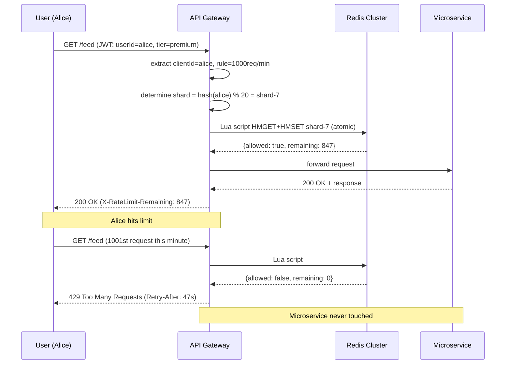
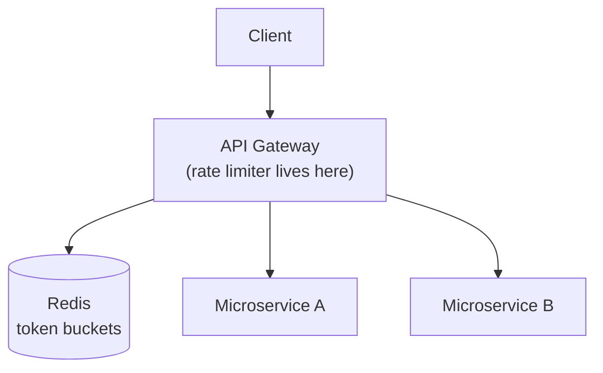
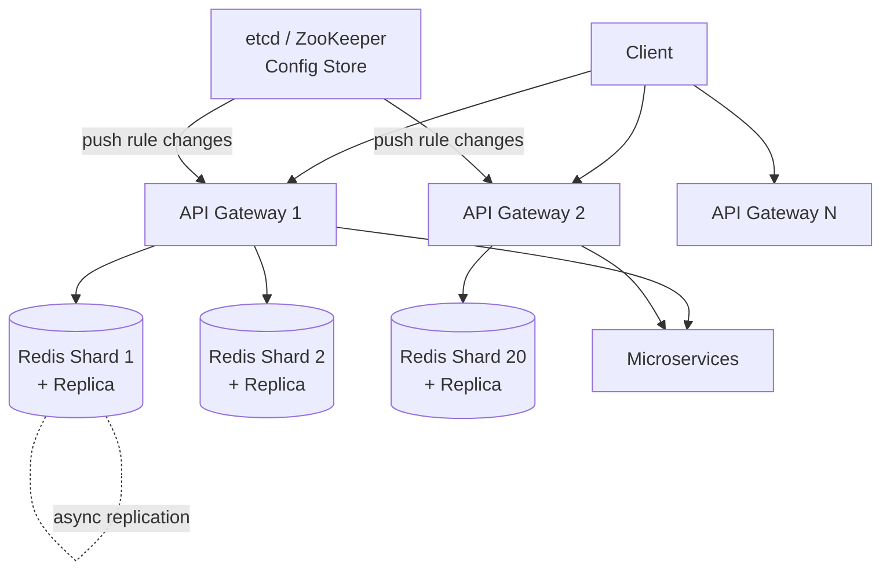

# Distributed Rate Limiter — System Design

---

## 1. Problem + Scope

Design a server-side distributed rate limiter that protects backend services by controlling how many requests any given client can make within a configurable time window.

> **Core problem:** Control request rate without increasing latency, while maintaining accuracy across a distributed system of multiple gateway instances sharing no local state.

**In scope:** Client identification (user ID, IP, API key), configurable rules per client tier, token bucket algorithm, distributed shared state, dynamic rule updates, proper error responses.
**Out of scope:** Client-side rate limiting (trivially spoofed, not valuable), billing/quota metering, content-based throttling.

> **This is a backend infrastructure component, not a user-facing product.** Users interact with the social media app — the rate limiter is an invisible layer protecting the services behind it.

---

## 2. Assumptions & Scale

| Signal | Number |
|---|---|
| Daily Active Users | 100M |
| Requests/second (peak) | 1M RPS |
| Redis ops per request check | 2 (HMGET + HMSET) |
| Single Redis ops/sec ceiling | ~100K |
| RPS per Redis instance | 50K (100K ops / 2 ops per check) |
| Redis shards needed | 1M / 50K = **20 minimum** |
| Token bucket storage per user | 2 × int64 = 16 bytes |
| Total in-memory storage (100M users) | ~3–4GB total → ~150–200MB per shard |

**Hardest constraint:** <10ms added latency per request. The rate limiter is in the critical path of every single user request — any latency it adds is latency the user feels directly.

**Primary bottleneck:** Redis throughput at 1M RPS, not storage. At 2 ops per check, a single Redis instance is 20× undersized.

*These numbers drive: Redis Cluster with 20 shards, connection pooling at every gateway, geographic colocation of Redis with gateway.*

---

## 3. Functional Requirements

- Identify clients by User ID (authenticated), IP address (anonymous), or API key (developer APIs)
- Enforce configurable rate limit rules per client tier (e.g., regular user = 100 req/min, premium = 1000 req/min, API key = 50K req/min)
- Apply token bucket algorithm: burst capacity + steady refill rate
- Return `429 Too Many Requests` immediately on limit exceeded (fail fast — no queuing)
- Include informative response headers: remaining requests, reset time, retry-after
- Support dynamic rule changes without gateway redeployment

---

## 4. Non-Functional Requirements

| Property | Requirement | Why |
|---|---|---|
| Availability | AP — availability over consistency | Rate limiter must stay up even during partial failures; stale rules for seconds are acceptable over going offline |
| Rate check latency | <10ms added overhead | Rate limiter is in the critical path of every user request |
| Throughput | 1M RPS | 100M DAU at peak |
| Fault tolerance | Fail close (with local fallback) | Failing open lets bad actors through and can cascade-kill backend services |
| Rule propagation | <1 second for rule changes | Achieved via push-based config (ZooKeeper/etcd), not polling |

### Consistency Model

| Domain | Model | Reason |
|---|---|---|
| Token bucket state | Eventual (async replication) | A user getting 1 extra request through on replica failover is acceptable |
| Rate limit rules | Near-real-time push | Rules pushed via etcd/ZooKeeper subscription — no polling delay |
| Client identification | Read-your-writes not required | Rule: per-window, not per-session |

---

## 🧠 Mental Model

**A rate limiter is a distributed counter system that decides whether a request should pass based on time and usage.**

```
Rate Limiter = time window + counter + decision engine
```

- **Time window** — defines the measurement period (e.g., 1 minute)
- **Counter** — tracks how many requests a client has made in that window (stored in Redis, shared across all gateway instances)
- **Decision engine** — the algorithm (token bucket) that converts counter state into allow/reject

**E2E flow in one line:**
```
Client → Gateway → Rate Limiter (Lua script) → Redis → Decision → Service (or 429)
```

Every user request passes through one gate: the API Gateway. Before routing, the gateway asks one question: *"Is this client allowed?"* That answer lives in shared Redis state, not in the gateway itself.

```
Incoming Request
     |
[API Gateway] ← rules cached in-memory (pushed by etcd)
     |
  isAllowed(clientId, rule)?   ← Lua script (atomic)
     |
[Redis Cluster] ← {token_count, last_refill_ts} per clientId
     |
  YES → route to Microservice
  NO  → 429 immediately (fail fast, never touches microservice)
```

**⚡ Core Design Principles**

| Fast Path (allow) | Reliable Path (reject) |
|---|---|
| Gateway HMGET from Redis (<1ms) | Atomic Lua script: read + update in one Redis op |
| Rules cached in-memory on gateway | 429 + headers returned immediately, no queue |
| Connection pool reuses TCP (no handshake) | Fail close if Redis unavailable |

---

## 5. System Interface

This is a backend component — clients don't call it directly. It exposes an internal RPC:

```
isRequestAllowed(clientId: string, rule: Rule) → Response

Response {
  allowed:       bool
  remaining:     int       // tokens left after this check
  reset_at:      int64     // unix ts when bucket fully refills
  retry_after_s: int       // seconds until next token available (on reject)
}
```

**On reject → HTTP 429 to end user with headers:**
```
HTTP/1.1 429 Too Many Requests
X-RateLimit-Limit:     100          ← the rule ceiling
X-RateLimit-Remaining: 0            ← tokens left
X-RateLimit-Reset:     1704067260   ← unix ts of next full refill
Retry-After:           47           ← seconds until retry makes sense
```

**Why fail fast, not queue?** A queued request means the user waits and waits — they assume something is broken and click again. Now we have a growing backlog + double the requests. For interactive APIs, fail fast with a clear 429 is always the right answer. Queuing only makes sense for batch jobs that can afford to wait.

---

## 6. End-to-End Flow

> [!IMPORTANT]
> **No async queue in this system — rate limiting is synchronous by design.**
>
> The check must complete before the request is forwarded. Async rate limiting would mean: route the request, check the limit later — by then we've already done the work we were trying to protect. Rate limiting is a gate, not a filter.

### 6.1 Happy Path — Request Allowed

1. Alice makes a GET request to the social media app. Request hits the **API Gateway**.
2. Gateway extracts client identity from the request:
   - Authenticated request: `userId` from JWT in `Authorization` header
   - Anonymous request: source IP from `X-Forwarded-For`
   - Developer: `API-Key` from request header
3. Gateway determines which **rule** applies to this client: premium users get 1000 req/min, regular users 100 req/min — rule looked up from in-memory cache (populated by etcd push on startup and rule changes).
4. Gateway calls Redis Cluster with a **Lua script** (atomic read-modify-write):
   ```lua
   -- atomic: no race condition possible
   local bucket = redis.call('HMGET', clientKey, 'tokens', 'last_refill')
   local tokens = tonumber(bucket[1]) or MAX_TOKENS
   local last_refill = tonumber(bucket[2]) or now
   local elapsed = now - last_refill
   local refill = math.floor(elapsed * REFILL_RATE)
   tokens = math.min(MAX_TOKENS, tokens + refill)
   if tokens > 0 then
     tokens = tokens - 1
     redis.call('HMSET', clientKey, 'tokens', tokens, 'last_refill', now)
     return {1, tokens}   -- allowed
   end
   return {0, 0}          -- rejected
   ```
5. Lua script returns `{allowed=true, remaining=43}`.
6. Gateway routes request to the appropriate microservice. Total overhead: <2ms.

### 6.2 Rejection Path — 429

1–4. Same as above, but Lua script returns `{allowed=false, remaining=0}`.
5. Gateway immediately returns `429 Too Many Requests` with headers — **does not forward to microservice**. Total overhead: <2ms, microservice is fully protected.

### 6.3 Redis Node Failure Path

1. Gateway sends HMGET to Redis shard-3. Connection times out.
2. Gateway detects failure. **Does not fail open** — does not route the request.
3. Gateway falls back to **local in-memory fixed window counter** (simple Map in gateway process). Less accurate (no cross-gateway coordination), but still rate limiting.
4. Meanwhile, Redis Cluster promotes shard-3's replica (automatic, <30s via Sentinel).
5. Gateway reconnects to new primary. Local fallback discarded.
6. Alice may have gotten a few extra requests through during the 30s window — acceptable.



---

## 7. High-Level Architecture

### Simple Design



### Evolved Design



---

## 8. Data Model

> [!IMPORTANT]
> **Storage Separation**
>
> | What | Where | Why |
> |---|---|---|
> | Token bucket state (count + last_refill) | Redis Cluster (sharded, in-memory) | Sub-ms lookup; shared across all gateway instances |
> | Rate limit rules | etcd / ZooKeeper + gateway in-memory cache | Rules change rarely; push to in-memory eliminates per-check network round-trip |
> | Audit log (rejected requests) | Optional: Kafka → S3 | For abuse analysis and debugging; never on the critical path |

### Core Data Model (the simplest mental picture)

```
key:   user_id  (or ip_address, or api_key)
value: { count, timestamp }
```

That's it. Everything else is an optimisation on top of these two fields — the algorithm that decides what `count` means, the sharding that scales it, the atomicity that keeps it correct.

### Redis Token Bucket (per client)

```
Key:   rl:{clientId}         (e.g., rl:user_alice, rl:ip_1.2.3.4)
Type:  Hash
Field  tokens        → current token count (int)
Field  last_refill   → unix timestamp ms (int64)

HMGET rl:user_alice tokens last_refill
HMSET rl:user_alice tokens 847 last_refill 1704067213000
```

**Memory per user:** 2 fields × ~8 bytes + Redis hash overhead ≈ ~100 bytes per user.
**Total for 100M users:** ~10GB, distributed across 20 shards = ~500MB per shard. Fits easily in a standard Redis node.

### Rule Configuration (etcd, in-memory on gateway)

```json
{
  "rules": [
    { "tier": "premium",   "max_tokens": 1000, "refill_rate": 1000 },
    { "tier": "standard",  "max_tokens": 100,  "refill_rate": 100  },
    { "tier": "anonymous", "max_tokens": 20,   "refill_rate": 20   },
    { "endpoint": "/api/v1/search", "max_tokens": 50, "refill_rate": 50 }
  ]
}
```

---

## 9. Deep Dives

### 9.1 Rate Limiting Algorithms — Four Options, One Winner

**The problem:** How do we decide whether to allow or reject a request, given a configurable limit?

**Option 1 — Fixed Window Counter**
A counter per client that resets at the start of each fixed window (e.g., every minute at :00).

```
Alice: { count: 87, window_start: 12:01:00 }
```

Simple to implement — just a hash table. But **boundary effect**: Alice can send 100 requests at 12:01:59 and 100 more at 12:02:00 — 200 requests in 2 seconds. We claimed to limit her to 100/min. We lied.

**Option 2 — Sliding Window Log**
Track exact timestamp of every request in a sorted set. Count how many fall within the last 60 seconds. Reject if ≥ limit.

Perfect accuracy. But memory: need a sorted set per user, unbounded size. At 1M users × 100 requests = 100M timestamps in memory. Expensive.

**Option 3 — Sliding Window Counter**
Two counters: `prev_count` (last full window) + `curr_count` (current window). Estimate true sliding count:

```
estimated = curr_count + prev_count × (1 - elapsed/window_size)
```

Example: prev=8, curr=6, 70% through window.
Estimate = 6 + 8 × 0.3 = 8.4. Under limit of 10 → allow.

Only 2 integers per user. Good approximation. But assumes requests are evenly distributed — bursts within a window are underestimated.

**Option 4 — Token Bucket (chosen)**

Each client has a bucket with:
- **Max tokens** (burst capacity) — e.g., 100. Alice can fire 100 requests instantly.
- **Refill rate** — e.g., 60 tokens/min (1/sec). Steady-state rate.

On each request: add tokens based on elapsed time since last check, consume 1 token, reject if 0 tokens.

```
tokens = min(max_tokens, stored_tokens + elapsed_seconds × refill_rate)
allowed = tokens > 0
new_tokens = tokens - 1 (if allowed)
```

Store only 2 values: `tokens` (float/int) + `last_refill_ts`. Same memory as sliding window counter, but handles bursts explicitly and naturally.

| Algorithm | Memory | Accuracy | Burst handling |
|---|---|---|---|
| Fixed Window Counter | O(1) per user | Poor (boundary effect) | No |
| Sliding Window Log | O(requests) per user | Perfect | No |
| Sliding Window Counter | O(1) per user | Good (approximation) | No |
| Token Bucket (chosen) | O(1) per user | Good | Yes — explicit burst capacity |

**Chosen:** Token Bucket. Best combination of memory efficiency, burst handling, and simplicity. The burst capacity is a feature, not a bug — it allows short bursts while enforcing a steady-state limit.

> [!NOTE]
> Key Insight: Token Bucket models how real APIs are actually used — users send a burst of requests when they open the app, then slow down. Fixed window punishes this burst unfairly. Token Bucket accommodates it by design.

---

### 9.2 Where to Place the Rate Limiter — Three Options

**Problem:** Where in the architecture does the rate limit check live?

**Option 1 — Inside each microservice (application code)**
Rate limiter logic embedded in each service, state in local memory.

Fast — no network hops. But no global picture: request to Service A and Service B both see only their own count. Alice makes 2 requests split across 2 instances → each sees count=1 → both allow → global count=2 is invisible. Fails at distributed scale.

**Option 2 — Centralized rate limiter service**
Microservices call out to a dedicated rate limiter service before processing.

Solves global coordination. But adds a network hop per request: client → gateway → microservice → rate limiter service → microservice. Two network hops before any business logic runs. Violates our <10ms requirement.

**Option 3 — At the API Gateway / edge (chosen)**
Rate limiter logic runs inside the gateway itself, reading from shared Redis. Checks happen before routing — requests that fail never reach microservices.

```
Client → Gateway (rate check → Redis) → Microservice (only if allowed)
```

Like a bouncer at the door. Troublemakers never get inside.

The trade-off I accept: the gateway only has access to HTTP request data (headers, URL, IP, JWT payload). It can't see deeper application state without an additional lookup. For premium user detection: solved by encoding tier in the JWT — the token carries the claim, no extra DB call needed.

> [!NOTE]
> Key Insight: Placing the rate limiter at the gateway is the only option that satisfies both the global-state requirement (all gateways share Redis) and the latency requirement (one Redis round-trip, not two network hops through a separate service).

---

### 9.3 Race Condition — Lua Script for Atomic Read-Modify-Write

**Problem:** Two gateway instances (GW-A and GW-B) both serve Alice simultaneously. Both HMGET Alice's bucket — both read `tokens=1`. Both compute: 1 > 0 → allowed. Both decrement to 0 and HMSET. Alice gets 2 requests through, but her actual count is 1 token left.

```
GW-A:  HMGET → tokens=1
GW-B:  HMGET → tokens=1   (stale read, GW-A hasn't written yet)
GW-A:  HMSET tokens=0     ← correct
GW-B:  HMSET tokens=0     ← overwrites GW-A's write, as if GW-A never ran
```

Both accepted. One request got through for free.

**Naive solution — Redis WATCH/MULTI/EXEC (optimistic locking):**
WATCH the key, start transaction, check + update. If key changed between WATCH and EXEC → transaction aborted → retry. Works but retries under contention add latency.

**Chosen solution — Lua scripting:**
Redis executes Lua scripts atomically and single-threaded. The entire HMGET + calculate + HMSET sequence runs as one indivisible operation on the Redis server. GW-B's script waits until GW-A's script finishes — no interleaving possible.

```lua
local bucket = redis.call('HMGET', KEYS[1], 'tokens', 'last_refill')
-- ... calculate new tokens ...
if tokens > 0 then
  redis.call('HMSET', KEYS[1], 'tokens', tokens-1, 'last_refill', ARGV[1])
  return 1
end
return 0
-- all of this runs atomically in Redis, single-threaded
```

One network round-trip, atomic. No race condition possible.

> [!NOTE]
> Key Insight: Redis is single-threaded for command execution. A Lua script runs atomically — no other command can interleave. This is why Lua scripting solves the race condition without distributed locks or optimistic retry loops.

---

### 9.4 Scalability — Sharding Redis to 1M RPS

**Problem:** Single Redis handles ~100K ops/sec. Each rate limit check = 2 ops (HMGET + HMSET via Lua). So single Redis supports ~50K RPS. We need 1M RPS.

**Math:** 1M RPS / 50K per instance = **20 Redis shards minimum**. Add 25% headroom → 25 shards.

**Sharding strategy:** Shard by `clientId` (user ID, IP, or API key). Gateway hashes the clientId → determines which shard to query. Alice always goes to shard-7. No cross-shard coordination needed — one rate limit check = one Redis call to one shard.

**Implementation:** Use **Redis Cluster** — not DIY consistent hashing.
- Redis Cluster divides 16,384 hash slots across N nodes
- `CLUSTER KEYSLOT rl:alice` → slot 7832 → mapped to shard-7
- Redis Cluster handles rebalancing on node add/remove automatically
- Client-side cluster-aware libraries (redis-py, ioredis) route transparently

The trade-off I accept: Redis Cluster uses hash slots (not consistent hashing). Node addition requires slot migration — brief latency spike during resharding. For a rate limiter, this is acceptable — it happens rarely.

> [!NOTE]
> Key Insight: Hash the clientId to a shard. One rate limit check = one Redis node, one Lua script, one round-trip. No scatter-gather, no cross-shard coordination. This is what makes horizontal scaling linear.

---

### 9.5 Fault Tolerance — Fail Close with Local Fallback

**Problem:** What happens when a Redis shard goes down? Two options with no good answer:

| | Fail Open | Fail Close |
|---|---|---|
| Behavior | Let all requests through | Reject all requests |
| Risk | Bad actors flood the system; backend services cascade-fail | Site appears down to users |
| When acceptable | Never for a social media app | Standard choice |

**Chosen:** Fail close — but with a local fallback to avoid total blackout.

**Local fallback strategy:**
When a Redis shard is unreachable, the gateway falls back to a **local in-memory fixed window counter** for that shard's clients:

```
if (redis.ping() fails) {
  // fallback: local Map<clientId, {count, windowStart}>
  return localWindowCounter.isAllowed(clientId, rule);
}
```

- Less accurate: gateways don't coordinate, so a user could get N × allowance (N = number of gateway instances)
- But: still rate limiting, still protecting services, not a complete blackout
- Duration: only until Redis Cluster promotes the replica (~30 seconds)

**Replica configuration:** Each Redis shard has 1 replica (async replication). Trade-off: async means the replica may be 1–2 writes behind on failover. Alice may get 1–2 extra requests through during the failover window. Acceptable — this is not a financial system.

> [!NOTE]
> Key Insight: Fail close protects your backend. Fail open is the rate limiter admitting it can't do its job — and the consequences (cascading microservice failures) are worse than a 30-second service degradation during Redis failover.

---

### 9.6 Dynamic Rule Configuration — Push, Not Poll

**Problem:** Rules need to change at runtime (e.g., temporarily restrict a specific user who is abusing, or raise limits for a sale event). How do gateways get updated rules without redeployment?

**Option 1 — Polling the DB every N seconds:**
Gateway polls PostgreSQL every 5 seconds. Problem: 5-second delay + wastes CPU on constant polling for data that rarely changes.

**Option 2 — Check Redis on every request:**
Store rules in Redis, gateway reads the rule key alongside the token bucket. Problem: adds a second HMGET per request, increases latency and Redis ops.

**Option 3 — Push-based config via etcd / ZooKeeper (chosen):**
1. Rules stored in **etcd** (distributed key-value store designed for config management)
2. On startup, each gateway **pulls all rules** and caches them in-memory
3. Gateway **subscribes** to rule change events (persistent TCP connection to etcd)
4. When a rule changes in etcd → etcd **pushes** the diff over the open connection → gateway updates its in-memory cache

Zero additional latency on the hot path (rules already in memory). Rule changes propagate in <1 second. No polling overhead.

The trade-off I accept: gateways may have slightly different rule versions for <1s during propagation. Acceptable — a user getting one extra request through during a 1s propagation window is not a correctness problem.

> [!NOTE]
> Key Insight: Rules live in gateway memory. etcd pushes changes — no polling, no per-request rule lookup. The hot path stays at exactly one Redis round-trip regardless of rule complexity.

---

## 10. Bottlenecks & Scaling

We're designing for **100M DAU**, **1M RPS peak**. The primary bottleneck is **Redis throughput** — everything else scales horizontally without coordination.

**What breaks first at 10× scale (10M RPS):**

| Bottleneck | Problem | Solution |
|---|---|---|
| Redis throughput | 10M RPS × 2 ops = 20M ops/sec → 200 shards | Redis Cluster scales linearly — add more nodes |
| Gateway CPU | Lua script execution, connection management | Auto-scale gateway instances behind load balancer |
| etcd rule propagation | 200 gateway instances all subscribing | etcd is designed for this; cluster of 3–5 etcd nodes handles thousands of watchers |
| Connection pool exhaustion | 200 gateways × connections per gateway > Redis max connections | Tune pool size; Redis 6+ supports 65K connections per node |

**Spike handling:**
- Flash sale event: rules changed in etcd → all gateways updated in <1s → new lower limits enforced before spike lands
- DDoS attempt: IP-based rate limiting kicks in at gateway; attacker IP hits limit within first second
- Viral post: legitimate traffic spike → token buckets drain → users see 429 with Retry-After → clients back off → system stabilizes

**Multi-region:**
- Deploy gateway + Redis Cluster per region (e.g., US-East, EU-West, AP-Tokyo)
- Each region's Redis is independent — no cross-region coordination for rate limit checks
- User identified by JWT (global) or IP (regional) — consistent within a session
- Trade-off: a user in transit between regions resets their token bucket. Acceptable for most use cases.

---

## 11. Failure Scenarios

| Failure | Impact | Recovery |
|---|---|---|
| Redis shard goes down | ~5% of clients can't be rate limited (the shard's portion of key space) | Gateway falls back to local in-memory fixed window counter; Redis Cluster promotes replica in <30s |
| Redis replica lag during failover | Replica is 1–2 writes behind primary | ~1–2 clients get 1 extra request through; acceptable (not a financial system) |
| etcd goes down | Gateways can't receive rule updates; use last-known rules from memory | Gateways continue rate limiting with stale rules (rules rarely change); etcd cluster of 3 nodes; Raft quorum survives 1 node failure |
| Gateway crash | In-flight requests lost; local fallback state lost | Load balancer routes to other gateways; stateless so instant restart; no state to recover |
| Lua script exceeds 5ms | Redis blocks other commands during script | Set SCRIPT_TIMEOUT; script is <1ms in practice (just arithmetic + 2 HMSET operations) |
| Redis connection pool exhausted | Gateways queue Redis requests; latency spikes | Monitor pool utilization; scale gateway instances to distribute connection load; tune pool size |
| Clock skew between gateway and Redis | `elapsed` calculation uses gateway's clock; Redis uses server clock | Use Redis server time via `TIME` command in Lua script — eliminates clock drift entirely |

---

## 12. Trade-offs

### Rate Limiting Algorithm

| | Fixed Window | Sliding Window Log | Sliding Window Counter | Token Bucket (chosen) |
|---|---|---|---|---|
| Memory | O(1) | O(requests) | O(1) | O(1) |
| Accuracy | Poor (boundary) | Perfect | Good (approx.) | Good |
| Burst handling | No | No | No | Yes (explicit) |
| Implementation | Trivial | Complex (heap) | Moderate | Simple (2 values) |

**Chosen:** Token Bucket. Only algorithm with explicit burst handling — reflects real usage patterns.

---

### Rate Limiter Placement

| | In each microservice | Centralized service | API Gateway (chosen) |
|---|---|---|---|
| Global state | No (each sees only its own traffic) | Yes | Yes (via shared Redis) |
| Latency overhead | 0ms (in-process) | 2× network hops | 1 Redis round-trip (~1–2ms) |
| Microservice isolation | No — must implement in every service | Yes | Yes — microservices unaware |
| Context available | Full application context | HTTP headers only | HTTP headers + JWT claims |

**Chosen:** API Gateway. Bouncer at the door — bad requests never reach services.

---

### Failure Mode: Fail Open vs Fail Close

| | Fail Open | Fail Close + Local Fallback (chosen) |
|---|---|---|
| Redis down behavior | All requests pass (no protection) | Rate limiting continues via local counter |
| User experience | Normal (but backend may die) | Slightly less accurate limits for <30s |
| Backend risk | High — cascading failures | Protected |
| Correctness | None | Best-effort during failover |

**Chosen:** Fail close with local fallback — protection is the primary job of the rate limiter.

> [!NOTE]
> Key Insight: The rate limiter exists to protect backend services. Failing open is the rate limiter abandoning its only responsibility. Failing close with a local fallback is the best of both worlds — protection maintained even without Redis.

---

### Rule Updates: Polling vs Push

| | DB Polling | Redis per-request lookup | etcd Push (chosen) |
|---|---|---|---|
| Hot path latency | 0 (rules cached) | +1 Redis op per request | 0 (rules in gateway memory) |
| Rule propagation | N-second delay (poll interval) | Immediate | <1 second (push) |
| CPU overhead | Constant polling | Per-request overhead | Near-zero (persistent connection) |

**Chosen:** etcd push. Zero hot path overhead, sub-second propagation, no polling waste.

---

## 13. Frontend Notes

*Rate limiter is 100% backend infrastructure. There is no frontend.*

**The only user-visible surface is the error response on rejection.** Make it clear and actionable:

```json
HTTP 429 Too Many Requests
{
  "error": "rate_limit_exceeded",
  "message": "Too many requests. Please retry after 47 seconds.",
  "retry_after": 47,
  "limit": 100,
  "window": "60s"
}
```

**Client-side best practices (what SDK/client code should do on 429):**
- Respect `Retry-After` header — don't retry immediately
- Use exponential backoff if `Retry-After` is not present
- Surface a user-friendly message ("Slow down — try again in a moment"), not a raw 429 error
- Do NOT automatically retry transparent to the user — this defeats the rate limiter

---

## Interview Summary

### Key Decisions

| Decision | Problem it solves | Trade-off accepted |
|---|---|---|
| Token Bucket algorithm | Handles burst traffic naturally; 2 values per user (memory-efficient) | Approximation (not exact sliding window) |
| Rate limiter at API Gateway | Global coordination via Redis; microservices unaware; no extra network hops | Can only see HTTP request data (JWT carries tier claim) |
| Lua scripting for atomic read-modify-write | Race condition: two gateways both read tokens=1, both accept | Lua script blocks other Redis commands during execution (<1ms — acceptable) |
| Redis Cluster (20 shards) | Single Redis = 50K RPS; need 1M RPS | Resharding during node changes causes brief latency spike |
| Fail close + local fallback | Protect backend on Redis failure; avoid total blackout | Local fallback loses cross-gateway coordination; users may get N× allowance for <30s |
| etcd push for rule config | Rules in gateway memory = zero hot-path overhead; sub-second propagation | <1s rule propagation window where gateways may have different rules |

### Fast Path vs Reliable Path

```
Fast Path (allow — happy path):
  Incoming request
    → API Gateway extracts clientId from JWT / IP / API key
    → Lookup rule from in-memory cache (no network)
    → Redis Cluster Lua script: HMGET + calculate + HMSET (atomic, ~1ms)
    → allowed=true → route to microservice
    → Total added latency: <2ms

Reliable Path (reject + fault tolerance):
  Incoming request
    → Redis check: tokens=0 → 429 immediately (fail fast)
    → No microservice involvement, backend fully protected

  Redis failure:
    → Gateway detects timeout
    → Falls back to local in-memory fixed window counter
    → Redis Cluster promotes replica in <30s
    → Gateway reconnects, local fallback discarded
```

### Key Insights Checklist

> [!TIP]
> Say these out loud in the interview:

1. "I place the rate limiter at the API Gateway — it's a bouncer at the door. Requests that fail never touch the microservices. The gateway has everything it needs from the HTTP request itself, including the user tier from the JWT."
2. "I use Token Bucket, not Fixed Window. Fixed Window has a boundary effect — a user can double their limit by straddling a window boundary. Token Bucket handles bursts explicitly via bucket size, while enforcing a steady rate via refill rate."
3. "The race condition between two gateways both reading tokens=1 is solved by Lua scripting. Redis is single-threaded — a Lua script runs atomically. No other command can interleave between my HMGET and HMSET. No locks, no retries, no overhead."
4. "Single Redis is 50K RPS. I need 1M. I shard by clientId using Redis Cluster — 20 shards, each responsible for its own key slice. One rate limit check = one shard, one round-trip. Linear horizontal scale."
5. "I fail close, not open. The rate limiter's job is to protect the backend. Failing open means I've abandoned that job — and the result is cascading microservice failures far worse than a 30-second degradation. I use local in-memory counters as a fallback during Redis failover."
6. "Rules live in gateway memory, pushed by etcd. The hot path — every single request check — does exactly one Redis round-trip. No polling, no per-request rule lookup, no extra latency."
7. "I return 429 with Retry-After immediately. No queuing. If I queue the request, the user waits, assumes it's broken, clicks again — now I have double the requests in a growing backlog. Fail fast with a clear 429 is always the right answer for interactive APIs."
8. "Each Redis shard has one async replica. If a primary fails, the replica is promoted in <30 seconds. Alice may get 1–2 extra requests through during failover. This is acceptable — a rate limiter protecting a social media feed is not a financial transaction system."
