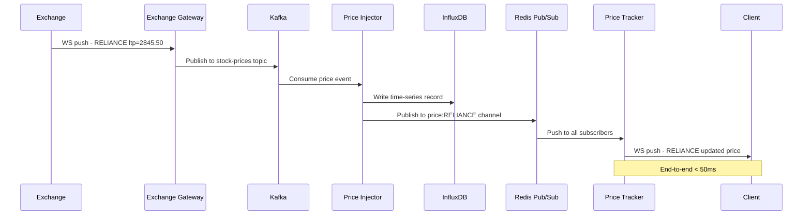
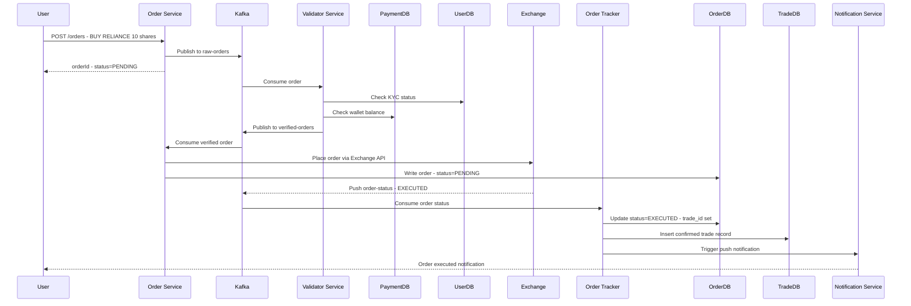
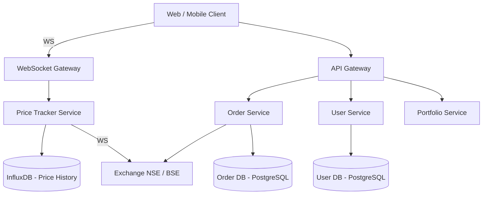
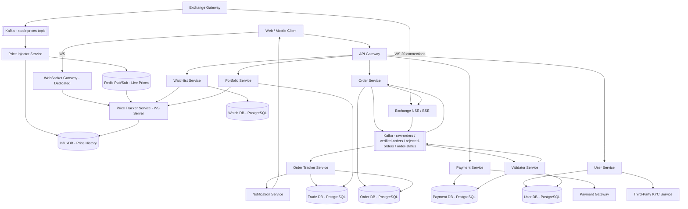

# Stock Broker Platform — Zerodha / Groww

> **Backend / Frontend Split: 85% Backend · 15% Frontend**
> The interesting engineering is in the backend: WebSocket-based real-time price streaming from the exchange, Kafka-buffered high-frequency order pipeline, order validation before hitting the expensive exchange API, two-phase order tracking (Order DB vs Trade DB), InfluxDB time-series for historical prices, and Redis pub/sub for fanout to millions of subscribers. Frontend is a standard WebSocket consumer — worth mentioning but not a deep focus.

> **Critical distinction:** A **stock broker** (Zerodha, Groww) is NOT a stock exchange (NSE, BSE). The broker is the client-facing platform; the exchange is a black box with paid APIs. All actual stock allocation happens at the exchange. The broker's job is: show prices, validate orders, forward to exchange, track status, show P&L.

---

## 1. Problem + Scope

Design a stock broker platform like Zerodha or Groww. Users register with KYC verification, view near-real-time stock prices and historical data, place buy/sell orders (market and limit), manage a watchlist, and view their portfolio P&L.

**In scope:** User registration + KYC, real-time + historical stock price feed, order placement (market + limit), order validation, order tracking (pending → confirmed/rejected), portfolio P&L, watchlist, wallet/fund management.

**Out of scope:** Stock exchange internals (NSE/BSE matching engine), high-frequency trading algorithms, margin lending, options/futures derivatives (can be mentioned as extensions), cross-border trading.

---

## 2. Assumptions & Scale

| Metric | Value |
|---|---|
| Total users | 50M registered, 5M DAU |
| Total stocks tracked | 8,000–10,000 (NSE + BSE) |
| Peak orders per second | 100K orders/sec during market open |
| Stock price updates/sec | 10,000 stocks × 1 update/sec = 10,000 price events/sec |
| Market hours | 9:15 AM – 3:30 PM IST (6.25 hours/day) |
| WebSocket connections to exchange | 10,000 stocks ÷ 500 stocks/connection = 20 persistent connections |
| Concurrent WebSocket connections (client-facing) | 5M users × 20% active = 1M concurrent WS connections |
| Historical price storage | 10,000 stocks × 1 update/sec × 6.25 hrs × 250 days = ~56B rows/year |
| Geography | Single-region (India) — all infra in India datacenters |

**Scale rationale:**

Single-region constraint is a key advantage — latency targets (< 50ms price updates, < 100ms order placement) are achievable only because all clients and servers are in the same geographic region. A global exchange system would require different architectural choices.

*These numbers drive: WebSocket over SSE (bidirectional subscription changes), InfluxDB for time-series price storage, Kafka as buffer between 100K order/sec and exchange API calls, Redis pub/sub for 1M concurrent price subscribers.*

---

## 3. Functional Requirements

- User registration with KYC verification (Aadhaar/PAN via third-party KYC service)
- View real-time stock prices (< 50ms latency from exchange update to client screen)
- View historical stock price charts (intraday + multi-day)
- Place buy/sell orders — market orders (execute at current price) and limit orders (execute at target price)
- Cancel pending orders
- View all orders and their current status (pending / executed / rejected / cancelled)
- Portfolio dashboard: holdings, positions, P&L calculated against current price
- Watchlist: save and monitor a custom list of stocks
- Wallet: deposit funds, withdraw funds, view transaction history

---

## 4. Non-Functional Requirements

| Requirement | Target |
|---|---|
| Stock price update latency | < 50ms from exchange event to client display |
| Order placement latency | < 100ms from user submit to exchange acknowledgement |
| Availability | 99.9% during market hours (9:15 AM – 3:30 PM IST) |
| Consistency | **High consistency over availability** — money and stocks must never be in inconsistent state |
| Order durability | Zero order loss — Kafka ensures at-least-once delivery |
| Historical data retention | 5+ years |

**Consistency Model — CAP applied per domain:**

| Domain | Model | Justification |
|---|---|---|
| Order placement | Strong (CP) | Payment deducted ↔ stock allocated must be atomic. Inconsistency = financial loss. |
| User registration / KYC | Strong (CP) | Regulatory requirement — KYC status must be accurate before any trade |
| Portfolio P&L | Eventual | P&L recalculated on price changes — 1–2 second staleness acceptable |
| Price display | Eventual | Stock price is a market observable — slight delay acceptable, never misleading |
| Watchlist | Eventual | Low stakes — eventual consistency fine |

> [!IMPORTANT]
> This system prioritizes **consistency over availability** — the opposite of most consumer apps. Reason: if our system shows a trade succeeded but the exchange rejected it, the user has lost money from their wallet with no stock to show for it. Financial systems always choose CP over AP.

---

## 🧠 Mental Model

A stock broker has **three independent but interconnected flows**:

1. **Price Feed Flow** — Exchange pushes stock prices → WebSocket gateway → Kafka → Price Injector → InfluxDB (historical) + Redis pub/sub → Price Tracker Service → client WebSocket connections
2. **Order Flow** — User places order → Kafka raw order topic → Validator Service (KYC + funds check) → verified/rejected topics → Order Service → Exchange API → acknowledgement → Order Tracker → Order DB + Trade DB + Notification
3. **Portfolio Flow** — Portfolio Service reads Trade DB (confirmed trades only) + current price from Price Tracker → calculates P&L per holding

```
 EXCHANGE (NSE / BSE)
       │  WebSocket (20 persistent connections, 500 stocks each)
       ▼
 Exchange Gateway
       │
       ▼
    Kafka  ──────────────────────────────────────
   (stock-prices topic)                         │
       │                                        │
       ▼                                        ▼
 Price Injector                         Order Status topic
  │          │                                  │
  ▼          ▼                           Order Tracker
InfluxDB  Redis Pub/Sub                  │           │
(history) (realtime)               Order DB      Trade DB
              │                                     │
              ▼                              Portfolio Service
      Price Tracker Service                         │
              │                                     ▼
       WebSocket Gateway                        P&L Display
              │
         5M Clients

USER → API Gateway → Order Service → Validator → Kafka (raw-orders)
                                                      │
                                              Validator Service
                                              │               │
                                       verified-orders   rejected-orders
                                              │
                                        Order Service → Exchange
```

**⚡ Core Design Principles**

| Path | Optimized For | Mechanism |
|---|---|---|
| Fast Path | Price latency < 50ms | Exchange WebSocket → Kafka → Redis pub/sub → client WS — no DB in the hot path |
| Reliable Path | Zero order loss | Every order persisted in Kafka before processing; Order DB written before exchange call |

---

## 5. API Design

**User & KYC**

| Method | Path | Description |
|---|---|---|
| POST | `/api/v1/users/register` | Register user. Triggers KYC flow with third-party service. |
| POST | `/api/v1/users/kyc` | Submit KYC documents. Calls external KYC provider (e.g., Aadhaar/PAN verification). Returns `kyc_verified` flag. |
| POST | `/api/v1/users/login` | Authenticate. Returns JWT. |

**Market Data**

| Method | Path | Description |
|---|---|---|
| GET | `/api/v1/stocks?page=&limit=` | Paginated list of all stocks with last known price. |
| WS | `/ws/prices?symbols=RELIANCE,INFY` | WebSocket connection. Client subscribes/unsubscribes to symbols over the same connection. Bidirectional — this is why WS over SSE. |
| GET | `/api/v1/stocks/:symbol/history?from=&to=&interval=` | Historical OHLCV data from InfluxDB. |

**Orders**

| Method | Path | Description |
|---|---|---|
| POST | `/api/v1/orders` | Place order. Body: `{ symbol, type: MARKET/LIMIT, side: BUY/SELL, quantity, price? }`. Returns `orderId` with status `PENDING`. |
| GET | `/api/v1/orders?status=&page=` | List user's orders. `userId` from JWT header — never in URL. |
| GET | `/api/v1/orders/:orderId` | Order detail with current status. |
| DELETE | `/api/v1/orders/:orderId` | Cancel a pending limit order. |

**Portfolio & Funds**

| Method | Path | Description |
|---|---|---|
| GET | `/api/v1/portfolio/holdings` | Current holdings with avg buy price + current price + unrealised P&L. |
| GET | `/api/v1/portfolio/positions` | Intraday positions. |
| POST | `/api/v1/funds/deposit` | Add funds to wallet. Calls payment gateway. |
| POST | `/api/v1/funds/withdraw` | Withdraw funds. Validates available balance. |

> [!TIP]
> **Interview tip on WebSocket vs SSE for price feed:** "SSE is server-to-client only. With SSE, every time a user wants to add a new stock to their view, the client must close and reopen a new SSE connection with the updated symbol list. With WebSocket, the user sends a subscribe/unsubscribe message over the existing connection — no reconnection needed. At 1M concurrent connections, avoiding reconnect storms is critical."

---

## 6. End-to-End Flow

### 6.1 Real-Time Price Feed

1. On market open (9:15 AM), Exchange Gateway opens **20 persistent WebSocket connections** to NSE/BSE exchange — each connection subscribed to ~500 stocks. All 10,000 stocks covered.
2. Exchange pushes price update: `{ symbol: "RELIANCE", ltp: 2845.50, timestamp: ... }` in real time.
3. Exchange Gateway receives update → publishes to **Kafka** `stock-prices` topic. Kafka partitioned by symbol — all RELIANCE updates go to same partition, ordering guaranteed.
4. **Price Injector Service** consumes from Kafka. Writes to two stores simultaneously:
   - **InfluxDB**: append time-series record `(symbol, timestamp, open, high, low, close, volume)` — historical data
   - **Redis pub/sub**: publish to channel `price:RELIANCE` — real-time fanout
5. **Price Tracker Service** subscribes to Redis pub/sub channels for all symbols. When a client subscribes to RELIANCE via WebSocket, Price Tracker subscribes to `price:RELIANCE` in Redis.
6. When Redis publishes `price:RELIANCE`, Price Tracker receives it and pushes to all WebSocket connections subscribed to RELIANCE.
7. On new user connection: Price Tracker fetches last N minutes of history from InfluxDB to populate the price chart, then streams real-time via the open WebSocket.



### 6.2 Place Order (Market Order)

1. User taps **Buy RELIANCE — Market — 10 shares**. Client calls `POST /api/v1/orders`.
2. Order Service writes order to **Kafka** `raw-orders` topic. Returns `orderId` with `status=PENDING` immediately to client — order is durably queued.
3. **Validator Service** consumes from `raw-orders`. Runs checks:
   - Is user KYC verified? (User DB lookup)
   - Is market open? (Time check)
   - Does user have sufficient wallet balance? (Payment DB lookup)
   - Does order type/quantity pass exchange rules?
4. If all checks pass → publishes to `verified-orders` topic. If any fail → publishes to `rejected-orders` topic.
5. **Order Service** consumes from `verified-orders`. Calls Exchange API to place the order. Writes order to **Order DB** with `status=PENDING`, `trade_id=null`.
6. Exchange allocates stock → sends acknowledgement on the exchange WebSocket connection (`order-status` event).
7. **Order Tracker Service** consumes `order-status` from Kafka. For a successful allocation:
   - Updates **Order DB**: `status=EXECUTED`, `trade_id=EXCHANGE_TXN_ID`
   - Inserts into **Trade DB**: confirmed trade record
   - Sends push notification to user: "Order executed — 10 shares of RELIANCE bought at ₹2845.50"
8. For rejected orders (from Validator): Order DB updated `status=REJECTED`, funds not deducted, notification sent.



---

## 7. High-Level Architecture

### Simple Design



### Evolved Design (Full Pipeline)



---

## 8. Data Model

| Entity | Storage | Key Columns | Why this store |
|---|---|---|---|
| User | PostgreSQL | `user_id`, `email`, `phone`, `name`, `is_kyc_verified`, `created_at` | ACID — KYC status must be consistent. Sensitive data (PAN/Aadhaar) stored encrypted by third-party KYC provider, not here. |
| Payment/Wallet | PostgreSQL | `transaction_id`, `user_id`, `amount`, `type` (DEPOSIT/WITHDRAW), `status`, `timestamp` | ACID — financial transactions require strong consistency. |
| Order | PostgreSQL | `order_id`, `user_id`, `symbol`, `order_type` (MARKET/LIMIT), `side` (BUY/SELL), `price`, `quantity`, `status` (PENDING/EXECUTED/REJECTED/CANCELLED), `trade_id`, `created_at` | ACID — every state change (pending → executed) must be durable. `trade_id` null until exchange confirms. |
| Trade | PostgreSQL | `trade_id`, `order_id`, `user_id`, `symbol`, `quantity`, `executed_price`, `exchange_trade_id`, `status`, `timestamp` | Separate from Order DB — only confirmed exchange trades. Used for P&L calculation and end-of-day reconciliation with exchange. |
| Stock Price (time-series) | InfluxDB | `symbol` (tag), `timestamp`, `open`, `high`, `low`, `close`, `ltp`, `volume` | 56B rows/year — time-series DB handles append-only time-indexed data with automatic downsampling. PostgreSQL would collapse under this write rate. |
| Live Price | Redis pub/sub | Channel: `price:{symbol}` → `{ ltp, timestamp }` | Ephemeral — no persistence needed. Sub-millisecond fanout to all subscribers. TTL implicit (channel has no history). |
| Watchlist | PostgreSQL | `watchlist_id`, `user_id`, `name` + `watchlist_items: watchlist_id, symbol` | Relational — user → many watchlists → many symbols. Low write volume, simple joins. |

> [!NOTE]
> **Key Insight:** Order DB and Trade DB are separate by design. Order DB contains ALL orders — including rejected ones. Trade DB contains only exchange-confirmed trades. Portfolio P&L reads Trade DB, never Order DB. End-of-day reconciliation with exchange compares Trade DB — a clean audit trail.

---

## 9. Deep Dives

### 9.1 Real-Time Price Feed — WebSocket vs SSE and Why

**Here's the problem we're solving:** 10,000 stocks update every second during market hours. We need to stream these updates to 1M concurrent user connections with < 50ms end-to-end latency. Users dynamically change which stocks they're watching. Which connection protocol — WebSocket or Server-Sent Events (SSE)?

**Naive solution — Polling:** Client calls `GET /stocks/RELIANCE/price` every second. At 1M users × 1 stock each = 1M HTTP requests/sec for just one stock. For 10 stocks each = 10M req/sec of empty or stale responses. Immediately ruled out.

**SSE analysis:** SSE is server-to-client only (unidirectional). When a user wants to add a stock to their view, the client must close the existing SSE connection and open a new one with the updated symbol list. At 1M concurrent connections, reconnection storms on every subscription change = catastrophic.

**Chosen solution — WebSocket (bidirectional):**
- One persistent WS connection per user, open for the entire trading session
- Client sends subscription messages: `{ action: "subscribe", symbols: ["RELIANCE", "INFY"] }` — no reconnect needed
- Server pushes price updates only for subscribed symbols
- Same connection handles subscribe/unsubscribe dynamically

**Why WebSocket over Exchange too:**
- Exchange-to-broker: one WS connection handles 500 stock subscriptions. If broker wants to add stock 501, it sends a subscribe message on the existing connection — no new TCP handshake. With SSE, a new connection would be needed each time the subscription set changes.
- At market open, broker subscribes to all 10,000 stocks across 20 WS connections (500/connection). Stays connected all day.

**Trade-off accepted:** WebSocket connections are stateful — WebSocket Gateway must maintain session state. Requires sticky sessions or a session map (Redis) so reconnects land on the correct server. More operational complexity than SSE.

> [!NOTE]
> **Key Insight:** WebSocket vs SSE is a subscription management problem. SSE only allows the server to push — changing what you're subscribed to requires a new connection. WebSocket lets the client say "also give me TATA Steel" over the same connection. At 1M live connections, avoiding reconnects is not a nicety — it's a correctness requirement.

---

### 9.2 Order Pipeline — High Frequency with Validation

**Here's the problem we're solving:** 100K orders/sec at market open. Each order must be validated (KYC, funds, market hours) before hitting the exchange — because every exchange API call costs money. Validation requires DB lookups (User DB, Payment DB) which take time. How do we handle 100K orders/sec without blocking?

**Naive solution:** Synchronous pipeline — receive order → validate (DB lookups) → call exchange → return response. At 100K orders/sec, each DB lookup adds 5–10ms → pipeline latency = 20–50ms. Under load, DB becomes the bottleneck. Service goes down = orders lost.

**Chosen solution — Kafka-buffered async pipeline:**

```
User → Order Service → Kafka (raw-orders) → Validator Service
                                                    ↓
                                        Kafka (verified-orders OR rejected-orders)
                                                    ↓
                                           Order Service → Exchange
                                                    ↓
                                        Kafka (order-status from Exchange WS)
                                                    ↓
                                            Order Tracker → Order DB + Trade DB
```

1. Order Service immediately persists order to Kafka — durable queue. Returns `orderId` + `PENDING` status to user. UI is responsive.
2. Validator Service consumes asynchronously. DB lookups happen at the consumer's pace — decoupled from user-facing latency.
3. Exchange calls happen only for verified orders. Rejected orders never touch the expensive exchange API.
4. Order Tracker reconciles exchange acknowledgements (including partial fills for limit orders) back to Order DB and Trade DB.

**Handling Limit Orders (partial fills):**

A limit order for 100 shares might execute in batches: 30 shares now, 70 shares 15 minutes later. Order Tracker handles each partial fill acknowledgement from the exchange, updating Trade DB incrementally. Order status stays `PARTIALLY_FILLED` until all 100 shares are confirmed or order expires.

**Trade-off accepted:** Async pipeline = eventual consistency between order placement and confirmation. User sees `PENDING` for up to seconds. This is acceptable and standard in real-world brokers. Strong consistency between funds deducted and stock allocated is maintained by the exchange — broker just tracks the outcome.

> [!NOTE]
> **Key Insight:** The Kafka queue before validation means every order is durably stored before any processing. If the Validator Service crashes, it resumes from its Kafka offset — zero order loss. Without Kafka, a validator crash loses all in-flight orders.

---

### 9.3 Exchange Gateway — Why a Dedicated Proxy

**Here's the problem we're solving:** Multiple internal services need to interact with the exchange — Price Tracker subscribes to price feeds, Order Service places orders, Order Tracker receives confirmations. If each service opens its own connection to the exchange, we have uncontrolled connection sprawl and the exchange charges per connection/request.

**Chosen solution — Exchange Gateway as single proxy:**
- One service owns all exchange communication
- Manages the 20 WebSocket connections for price feeds
- Routes order placement requests from Order Service
- Receives order status callbacks from exchange WebSocket
- Other services never talk to the exchange directly — they talk to Exchange Gateway or consume from Kafka topics that Gateway publishes to

**Why this matters for cost:**
- Exchange API access in India (NSE/BSE) is charged per connection and per request — costs crores per month for large brokers
- Exchange Gateway applies rate limiting internally, deduplicates unnecessary calls, and batches where possible
- Centralised monitoring: all exchange connectivity visible in one place

> [!NOTE]
> **Key Insight:** The Exchange Gateway is the same pattern as an API Gateway — it abstracts an expensive external dependency behind a single controlled interface. Exchange API calls cost real money; the gateway ensures no internal service can accidentally spam the exchange.

---

### 9.4 Trade DB vs Order DB — Why Two Tables

**Here's the problem we're solving:** Orders can be rejected (by Validator before even reaching exchange), cancelled, partially filled, or fully executed. Portfolio P&L needs only confirmed executed trades. End-of-day reconciliation with the exchange needs a clean list of what actually transacted.

**Order DB** — full audit trail:
- Every order ever placed: pending, rejected, cancelled, executed
- Rejected-by-validator orders live here (never reached exchange)
- Status: PENDING → EXECUTED / REJECTED / CANCELLED
- `trade_id` = null until exchange confirms

**Trade DB** — exchange-confirmed only:
- Only orders that the exchange acknowledged as executed
- Contains `exchange_trade_id` for reconciliation
- Portfolio Service reads ONLY from Trade DB — never sees rejected/cancelled orders
- End-of-day reconciliation: compare Trade DB with exchange's settlement report

**Why not one table?**

Portfolio P&L calculation = `(current_price - avg_buy_price) × quantity`. Avg buy price is computed from Trade DB. Including rejected/cancelled orders would corrupt the avg price calculation. Two tables keep concerns cleanly separated.

> [!NOTE]
> **Key Insight:** Order DB is for the broker's internal audit. Trade DB is for financial truth — what actually happened at the exchange. Portfolio P&L, reconciliation, and regulatory reporting all use Trade DB exclusively.

---

## 10. Bottlenecks & Scaling

**What breaks first at 10× scale:**

1. **Price Injector at 100K stocks/sec:**
   - Kafka partitioned by symbol — scale consumers horizontally
   - Redis pub/sub scales vertically (single Redis node handles ~1M pub/sub messages/sec). At extreme scale: Redis Cluster with consistent hashing on channel name
   - InfluxDB: add nodes, shard by symbol prefix

2. **Order Service at 1M orders/sec:**
   - Kafka handles ingestion — add partitions to `raw-orders` topic
   - Validator Service scales horizontally as Kafka consumer group
   - Order DB (PostgreSQL): shard by `user_id`. Order queries are always per-user
   - Exchange remains the real bottleneck — exchange API has its own rate limits. Broker must implement order throttling to avoid breaching exchange limits

3. **WebSocket Gateway at 10M concurrent connections:**
   - Dedicated WS Gateway cluster. Each node handles ~100K connections
   - Redis pub/sub for cross-node fanout: when price updates arrive on node A, subscribers on node B receive via Redis
   - Sticky session routing: user reconnects must land on same node (or use shared session map in Redis)

4. **Portfolio P&L at high read load:**
   - Cache P&L snapshots in Redis: `portfolio:{userId} → P&L JSON`, TTL = 5 seconds
   - Invalidate on new trade confirmed (Order Tracker triggers cache bust)
   - InfluxDB downsampling for old historical data (minute-level candles beyond 1 month, daily candles beyond 1 year)

---

## 11. Failure Scenarios

| Failure | Impact | Recovery |
|---|---|---|
| Exchange WebSocket drops | Price feed pauses; orders still accepted but unconfirmed | Exchange Gateway reconnects immediately. Last known prices served from InfluxDB. Client shows "Delayed data" indicator. |
| Kafka broker fails | Order processing pauses; no data loss | Kafka cluster (3+ brokers, replication factor 3). No message loss. Orders resume when broker recovers. |
| Validator Service crashes | Orders queue in raw-orders topic | Consumer group resumes from last committed offset. At-least-once: duplicate validation handled by idempotent order_id check. |
| Order Service crashes before Exchange call | Order in Kafka but not yet sent to exchange | Validator has already published to verified-orders. Order Service re-consumes on restart, re-sends to exchange. Idempotency key (order_id) prevents duplicate at exchange. |
| Order DB primary fails | Cannot write new order status | PostgreSQL read replicas available. Auto-failover (RDS Multi-AZ). Brief write pause during promotion. |
| InfluxDB outage | Historical price charts unavailable | Real-time prices (Redis pub/sub) unaffected. Charts show "Historical data unavailable" until restored. |
| Exchange rejects order | User placed order but exchange says invalid | Order Tracker marks order REJECTED in Order DB. Funds not deducted. Notification sent to user with rejection reason. |

---

## 12. Trade-offs

### WebSocket vs SSE for Price Feed

| Dimension | WebSocket | SSE |
|---|---|---|
| Direction | Bidirectional | Server → Client only |
| Subscription changes | Send message on same connection | Must close + reopen connection |
| Connection overhead | Higher (persistent TCP) | Lower (standard HTTP) |
| Browser support | Universal | Universal |
| Reconnect cost | Low (client sends subscribe list) | High (new connection per change) |

**Chosen:** WebSocket — dynamic subscription changes (user opens different stock charts) require bidirectional communication. SSE reconnect storms at 1M connections = unacceptable.

> [!NOTE]
> **Key Insight:** SSE is "server pushes to client." WebSocket is "client and server talk." The moment the client needs to change what it's subscribed to — which happens constantly in a trading app — you need WebSocket.

---

### InfluxDB vs PostgreSQL for Stock Prices

| Dimension | InfluxDB | PostgreSQL |
|---|---|---|
| Write throughput | 1M+ points/sec per node | ~50K rows/sec ceiling |
| Query type | Time-range aggregations (OHLCV) | General SQL |
| Storage efficiency | Automatic compression for time-series | Row-based, less efficient for time data |
| Downsampling | Built-in continuous queries | Manual jobs |
| Operational complexity | Higher | Lower |

**Chosen:** InfluxDB — 56B rows/year of price data. PostgreSQL would require extreme sharding and still struggle with time-range aggregation queries. InfluxDB is purpose-built for this exact access pattern.

> [!NOTE]
> **Key Insight:** Time-series data has two properties that general databases handle poorly: extremely high append-only write rate and range-based aggregation queries. InfluxDB is built for exactly this — OHLCV queries over billions of rows are sub-second.

---

### Sync vs Async Order Processing

| Dimension | Synchronous | Async (Kafka) |
|---|---|---|
| User-facing latency | Lower (direct response) | Higher (PENDING → eventual confirmation) |
| Order durability | Lost on crash | Kafka = at-least-once, no loss |
| Exchange API calls | Every order hits exchange | Only validated orders hit exchange (saves cost) |
| Scalability | Bottlenecked by validation DB | Each stage scales independently |

**Chosen:** Async — exchange API calls cost real money. Async pipeline ensures only valid orders reach the exchange, and every order is durably queued before processing.

> [!NOTE]
> **Key Insight:** In a stock broker, async order processing is not just a performance choice — it's a cost control mechanism. Every unnecessary exchange API call is a financial expense. The Kafka buffer + validator layer is the gatekeeper.

---

## Interview Summary

### Key Decisions

| Decision | Problem it solves | Trade-off accepted |
|---|---|---|
| WebSocket over SSE | Dynamic stock subscription changes without reconnects | Stateful connections — need sticky sessions or Redis session map |
| Exchange Gateway (single proxy) | Centralised, controlled, cost-managed exchange access | Single point of failure — mitigated with multi-instance deployment |
| Kafka buffer before order processing | Durability at 100K orders/sec; decouple validation from ingestion | Async = user sees PENDING before EXECUTED; eventual confirmation |
| InfluxDB for price history | 56B rows/year time-series — PostgreSQL can't handle this write rate | Higher operational complexity; separate query language |
| Redis pub/sub for live prices | Sub-millisecond fanout to 1M subscribers | Ephemeral — no message persistence; replay not possible |
| Trade DB separate from Order DB | Clean separation: all orders vs exchange-confirmed trades | Extra DB to maintain; sync logic in Order Tracker |

### Fast Path vs Reliable Path

```
PRICE FAST PATH (optimised for < 50ms latency)
  Exchange WS push
      │
  Exchange Gateway → Kafka (no DB write in hot path)
      │
  Price Injector → Redis pub/sub (in-memory, sub-ms)
      │
  Price Tracker → WebSocket → Client
  (InfluxDB write is async, does not block the hot path)


ORDER RELIABLE PATH (optimised for zero loss + consistency)
  User places order
      │
  Order Service → Kafka raw-orders (durable before any processing)
      │
  Validator (KYC + funds) → Kafka verified-orders
      │
  Order Service → Exchange API (only validated orders touch exchange)
      │
  Exchange acknowledgement → Kafka order-status
      │
  Order Tracker → Order DB + Trade DB + Notification
  (every state change is persisted before notifying user)
```

### Key Insights Checklist

- "Broker ≠ Exchange. The exchange (NSE/BSE) is a black box with expensive paid APIs. The broker's job is to validate, forward, track, and display. Every unnecessary exchange API call costs money — that's why we validate in Kafka before touching the exchange."
- "WebSocket over SSE because of bidirectional subscription changes. SSE requires a new connection every time the user changes which stocks they're watching. WebSocket lets the client send subscribe/unsubscribe messages on the same connection. At 1M connections, reconnect storms are catastrophic."
- "InfluxDB for price history — not PostgreSQL. 56 billion rows/year, append-only, time-range queries. InfluxDB is purpose-built for this. PostgreSQL would be the first bottleneck."
- "Trade DB and Order DB are separate by design. Order DB is for audit — includes rejected and cancelled orders. Trade DB is financial truth — exchange-confirmed only. P&L calculation and reconciliation use Trade DB exclusively."
- "This system prioritises CP over AP — opposite of most apps. A stale price feed for 2 seconds is fine. Money deducted with no stock allocated is a financial disaster. Consistency always wins in fintech."
- "On market open, Exchange Gateway subscribes ALL 10,000 stocks across 20 WebSocket connections — not just stocks users are watching. Why? Because historical data must be complete. If a user opens a chart for a stock no one was watching, the InfluxDB data must be there from 9:15 AM."
