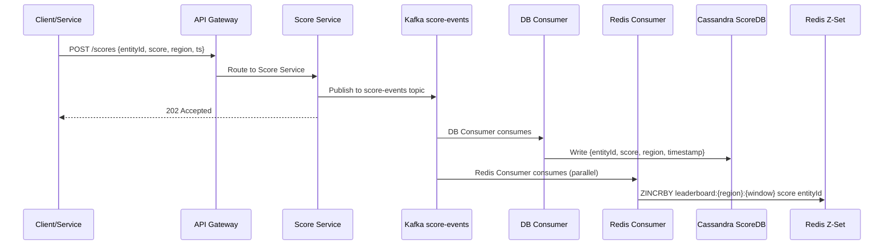
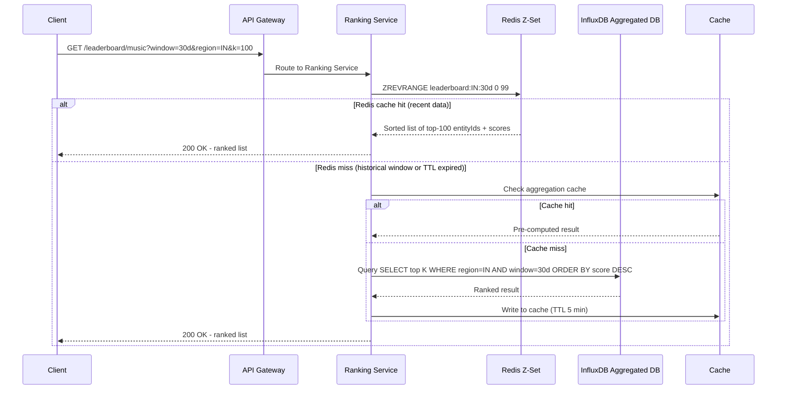
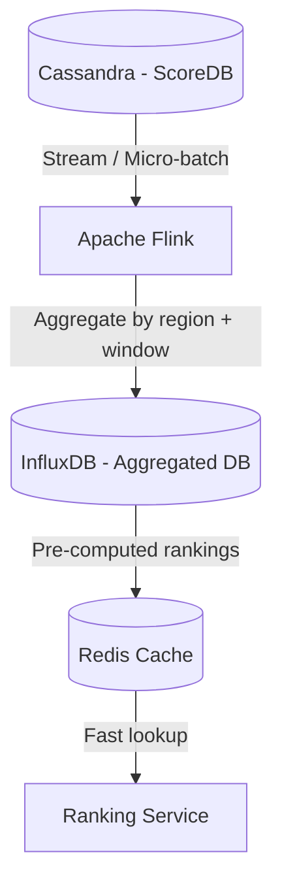
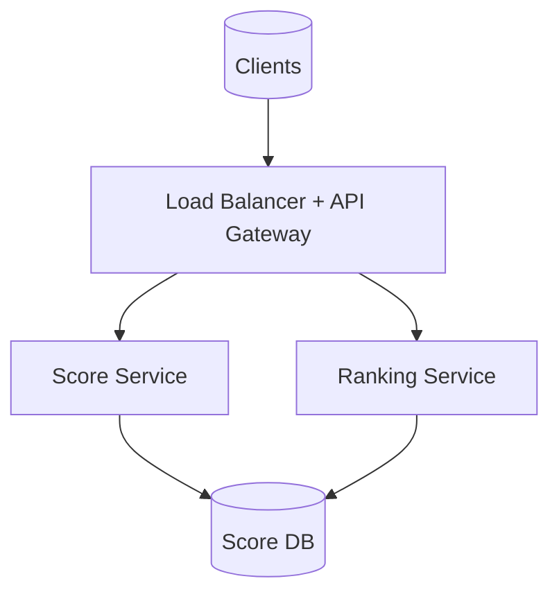
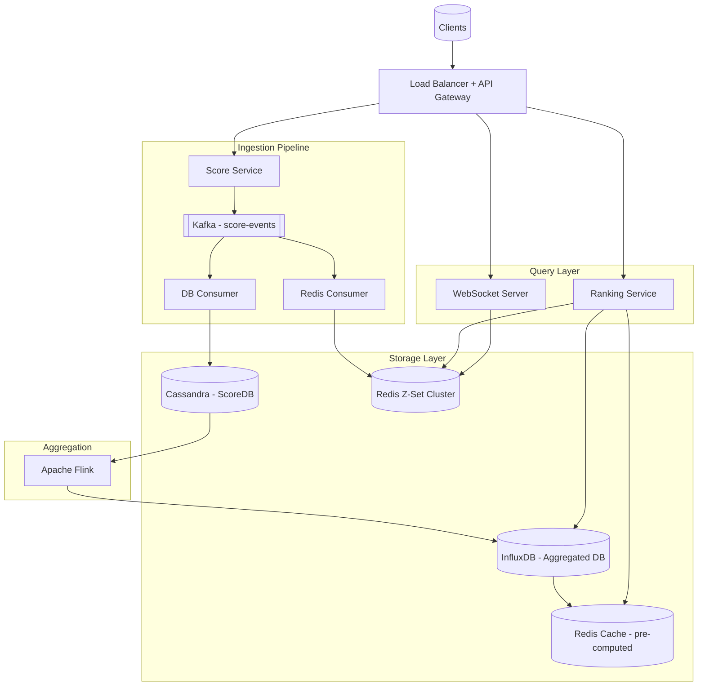

# Top K Leaderboard — System Design

> **Frontend / Backend Split:** 90% backend · 10% frontend
> This is a pure backend problem. The interesting design space is entirely in the ranking pipeline — how you ingest 1M events/sec and serve top-K results in < 100ms.

---

## 🧠 Mental Model

A Top K Leaderboard has exactly two jobs: **ingest scores fast** and **answer "who's in the top K?" instantly**. The tension is that writes arrive at 1M/sec (you can't compute rankings synchronously on each write), and reads demand < 100ms latency (you can't do a full DB scan per query). The solution is to **decouple ingestion from ranking** and maintain a pre-sorted data structure that is always ready to answer the top-K query.

Three progressively better solutions exist, each trading off latency vs durability vs scale:

```
INGESTION PATH
User/Service ──▶ Score Service ──▶ Kafka ──────────────────────┐
                                          │                      │
                                   DB Consumer           Redis Consumer
                                          │                      │
                                    Score DB (Cassandra)   Redis Z-Set
                                          │
                                    Apache Flink
                                          │
                                   Aggregated DB (InfluxDB)
                                          │
                                       Cache

QUERY PATH (Solution 3 — Hybrid)
Client ──GET /leaderboard──▶ Ranking Service ──▶ Redis Z-Set (recent data)
                                              └──▶ Aggregated DB (historical data, on cache miss)
```

**⚡ Core Design Principles**

| Path | Optimized For | Mechanism |
|---|---|---|
| Fast Path (recent data) | Latency < 1ms | Redis Sorted Set in memory; auto-sorted; ZREVRANGE in O(log N + K) |
| Reliable Path (historical + durability) | Correctness + durability | Cassandra (durable log) → Flink → InfluxDB (aggregated, queryable by time window) |
| Real-time Path (gaming leaderboards) | Live updates | WebSocket server pushes Redis Z-Set delta on every score change |

---

## 1. Problem + Scope

Design a Top K Leaderboard system that can ingest 1M score/view/like events per second and serve a ranked list of top K entities (players, videos, songs) filtered by region and time window in under 100ms.

**In Scope:** Score ingestion (insert/update), top-K query with time frame and region filters, real-time ranking updates via WebSocket (gaming), individual rank lookup with surrounding players.

**Out of Scope:** User authentication, content storage, probabilistic top-K (Count-Min Sketch variant mentioned as enhancement only), recommendation feeds.

---

## 2. Assumptions & Scale

| Metric | Value |
|---|---|
| Ingestion rate (score events/sec) | 1,000,000/sec (1M/sec) |
| Total entities (players/videos/songs) | Billions |
| K range (max result set size) | 1 – 10,000 |
| Active time windows | Hour, Day, 30 days, 90 days, All-time |
| Regions | Global (partitioned by country) |
| Read QPS (leaderboard queries) | ~50,000/sec |
| Latency SLA — top-K fetch | < 100ms |
| Latency SLA — score ingestion | < 500ms |
| Consistency model | Eventual (AP) |
| Result type | Accurate (exact top-K, not probabilistic) |

**Write amplification (key insight):**
1M events/sec × multiple time windows (hour/day/30d/90d) × multiple regions = **~5–10M Redis Z-Set updates/sec** at full global scale. This is the core driver for Redis Cluster partitioning.

**Redis memory estimate (Solution 1/3):**
- 10 active regions × 4 time windows × top-10K entities × 100 bytes per entry = ~40 GB per Redis cluster
- With snapshots and TTL-based eviction (Solution 3), this stays bounded

> These numbers drive the following decisions: Kafka for ingestion buffering (absorbs 1M/sec burst), Redis Sorted Set for < 1ms ranking, Cassandra for durable write-heavy score storage, Apache Flink + InfluxDB for historical aggregation.

---

## 3. Functional Requirements

- Score/view/like events can be ingested into the system in real time (insert, update, delete)
- Clients can query the top K entities (players, videos, songs) by score for a given leaderboard
- Queries support time-frame filters: last hour, day, 30 days, 90 days, or all-time
- Queries support region filters (country-level)
- Value of K is bounded: 1 ≤ K ≤ 10,000; large K responses are paginated
- Individual rank lookup: given a user ID and time window, return their rank + K surrounding players
- Real-time leaderboard updates via WebSocket (for gaming/live events)

---

## 4. Non-Functional Requirements

| Requirement | Target |
|---|---|
| Top-K query latency | < 100ms (p99) |
| Score ingestion latency | < 500ms (eventual consistency acceptable) |
| Availability | 99.99% (AP — high availability over strong consistency) |
| Consistency | Eventual — leaderboard positions may lag by seconds |
| Durability | Zero score loss after Kafka acknowledgement |
| Accuracy | Exact top-K (not probabilistic approximation) |
| Scale | 1M ingestion events/sec, billions of entities |

**Consistency Model:**

| Domain | Model | Reason |
|---|---|---|
| Leaderboard rankings | Eventual | A video moving from #2 to #1 can lag by seconds |
| Score ingestion | At-least-once (Kafka) | No event loss; idempotent consumer handles duplicates |
| Historical aggregation | Batch-consistent | Flink processes completed time windows; slight delay is acceptable |
| Individual rank lookup | Eventual | Rank may be 1–2 positions off in high-velocity events |

---

## 5. API Design

| Method | Path | Description |
|---|---|---|
| POST | `/api/v1/scores` | Ingest a score event `{entityId, leaderboardId, score, region, timestamp}` |
| GET | `/api/v1/leaderboard/:id?window=30d&region=IN&k=100&cursor=` | Fetch top-K entities for a leaderboard; cursor-based pagination for K > 50 |
| GET | `/api/v1/leaderboard/:id/rank?userId=&window=30d&k=5` | Get user's rank + K surrounding players (2 above, 2 below for k=5) |

**Notes:**
- `GET /leaderboard` supports both REST (trending lists) and **WebSocket upgrade** (gaming live leaderboards)
- `window` accepts: `1h`, `1d`, `7d`, `30d`, `90d`, `all`
- `region` is ISO 3166-1 alpha-2 (e.g. `IN`, `US`, `GB`)
- K is capped server-side at 10,000; responses > 50 items are always paginated

> [!NOTE]
> **Key Insight:** The same leaderboard endpoint serves two protocols. REST for YouTube trending (poll every 5 minutes). WebSocket for gaming leaderboards (push delta on every rank change). Don't build two endpoints — the ranking logic is identical; only the delivery mechanism differs.

---

## 6. End-to-End Flow

### 6.1 — Score Ingestion (Write Path)



### 6.2 — Top-K Query (Fast Path — Solution 3 Hybrid)



### 6.3 — Historical Aggregation (Flink Batch Path)



---

## 7. High-Level Architecture

### Simple Design



### Evolved Design — Solution 3 Hybrid



---

## 8. Data Model

| Entity | Storage | Key Columns | Why this store |
|---|---|---|---|
| Raw Score Events | Cassandra | entity_id (partition), region, timestamp (clustering), score, leaderboard_id | Write-heavy (1M/sec); partition by entity_id gives even distribution; time-series access pattern |
| Redis Sorted Set (recent) | Redis | Key: `lb:{leaderboardId}:{region}:{window}` → ZSet of `(entityId, score)` | In-memory sorted data structure; ZREVRANGE = O(log N + K); auto-ranks on ZINCRBY |
| Aggregated Rankings | InfluxDB | measurement: leaderboard, tags: region + window, fields: entity_id + score, time: bucket_start | Time-series DB is optimal for time-windowed aggregations; tag-based indexing avoids full scans |
| Aggregation Cache | Redis | Key: `cache:{leaderboardId}:{region}:{window}:{page}` → JSON list | TTL = 5 min; prevents repeated InfluxDB queries for same parameters |

**Redis Z-Set key design:**

```
leaderboard:{leaderboardId}:{region}:{window}
e.g.
  leaderboard:music:IN:30d    → ZSet { "song_abc": 4500000, "song_xyz": 3200000, ... }
  leaderboard:gaming:US:1d    → ZSet { "player_001": 98500, "player_002": 87200, ... }
  leaderboard:videos:GLOBAL:7d → ZSet { "vid_aaa": 210000000, ... }
```

> [!NOTE]
> **Key Insight:** One Redis key per (leaderboard × region × time window). This is the critical schema decision. A single global key with all-time data cannot answer "top K for last 30 days in India" without scanning the whole set. Separate keys make every query O(log N + K) with zero filtering.

---

## 9. Deep Dives

### 9.1 — Solution 1: Redis Sorted Set (Pure In-Memory Ranking)

**Here's the problem we're solving:** At 1M inserts/sec we need ranked results in < 100ms. A SQL `ORDER BY score DESC LIMIT K` over billions of rows takes seconds. We need a data structure that is always sorted and can return top-K in microseconds.

**The insight from DSA:** LeetCode #347 (Top K Frequent Elements) uses a min-heap. Redis Sorted Set is exactly a heap in the form of a distributed data structure — scores are the heap key, ZINCRBY updates in O(log N), ZREVRANGE returns top K in O(log N + K).

**How it works:**
1. Every score event published to Kafka is consumed by the Redis Consumer
2. Redis Consumer calls `ZINCRBY leaderboard:IN:30d delta entityId`
3. Redis auto-maintains sorted order — no server-side sorting needed
4. Ranking Service calls `ZREVRANGE leaderboard:IN:30d 0 K-1 WITHSCORES` → returns top K instantly

**Limitations and fixes:**

| Problem | Fix |
|---|---|
| All-time data bloats Redis memory | Create one key per time window; apply TTL on each key |
| Single Redis node = SPOF | Redis Cluster partitioned by region (IN node, US node, etc.) |
| Redis node crash = lose rankings | Take periodic snapshots to Cassandra; rebuild Z-Set from snapshot on restart |
| Multiple time windows = redundant writes | Write to all active window keys on each event (hour, day, 30d, 90d) — 4 ZINCRBY calls per event |

**Trade-off accepted:** Redis Cluster adds operational complexity. Rebuilding from snapshot after a crash takes minutes during which rankings are unavailable. Acceptable at small-to-mid scale (single region).

> [!NOTE]
> **Key Insight:** Redis Sorted Set is a DSA heap promoted to a distributed system primitive. ZINCRBY = heap push. ZREVRANGE = heap peek top K. The entire ranking problem reduces to choosing the right data structure.

---

### 9.2 — Solution 2: Apache Flink + InfluxDB (Pre-computed Batch Aggregation)

**Here's the problem we're solving:** At global scale (50+ regions, 5 time windows), a Redis Cluster holding all combinations requires enormous memory and complex operational management. We need a solution that scales globally without keeping everything in RAM.

**Naive solution — SQL database with ORDER BY:**
```sql
SELECT entity_id, SUM(score) FROM scores
WHERE region='IN' AND timestamp > NOW() - INTERVAL 30 DAY
GROUP BY entity_id ORDER BY SUM(score) DESC LIMIT 100
```
Over billions of rows in Cassandra, this full-table aggregation takes minutes. Unacceptable.

**Chosen solution — Flink stream processing to InfluxDB:**
1. Cassandra ScoreDB acts as the durable event store
2. Apache Flink reads the stream of score events (or micro-batches from Cassandra)
3. Flink computes rolling aggregates per (leaderboard, region, time window)
4. Results written to InfluxDB (time-series DB) — tagged by region + window
5. Ranking Service queries InfluxDB; result cached in Redis for 5 minutes

**Why InfluxDB over PostgreSQL for aggregated data:**
- InfluxDB is natively optimised for `GROUP BY time(1d), region` queries
- Tag-based indexing means no full table scan — queries hit only matching partitions
- Retention policies automatically expire old buckets — no manual cleanup
- PostgreSQL alternative requires heavy partitioning + indexing to match InfluxDB performance

**Trade-off accepted:** Leaderboard lags behind real-time by Flink's processing delay (seconds to minutes depending on window size). Rankings are not live. Acceptable for trending videos/songs; not acceptable for gaming competitions.

> [!NOTE]
> **Key Insight:** Pre-computation shifts the cost from read time to write time. The ranking computation happens once per Flink micro-batch and is amortised across all readers. 50,000 concurrent users querying the same leaderboard all hit the same pre-computed InfluxDB result.

---

### 9.3 — Solution 3: Hybrid (Redis for Recent + InfluxDB for Historical)

**Here's the problem we're solving:** Solution 1 has durability risk and memory scale limits. Solution 2 has real-time lag. We need both: live rankings for current windows AND durable, queryable history for past windows.

**The insight:** Recent data (last 30 days) is queried most frequently and changes fast — keep it in Redis. Historical data (last quarter, last year) is queried rarely and doesn't change — store it in InfluxDB. The two stores are complementary, not competing.

**Architecture:**

```
Score Event
    │
    ▼
Kafka score-events
    │
    ├──── DB Consumer ────▶ Cassandra (durable event log)
    │                              │
    │                         Apache Flink ──▶ InfluxDB (aggregated, all windows)
    │
    └──── Redis Consumer ──▶ Redis Z-Set (keyed by window, TTL = window duration)
                                 │
                                 └──▶ Snapshot ──▶ InfluxDB (backup on node failure)

Query:
    Ranking Service ──▶ Redis Z-Set (hit for recent windows: hour, day, 30d, 90d)
                   └──▶ InfluxDB (miss for expired/historical windows: past quarters)
```

**TTL strategy for Redis keys:**

| Window | Redis TTL | Why |
|---|---|---|
| Last 1 hour | 2 hours | Small buffer above window; auto-expires stale data |
| Last 1 day | 48 hours | 2× window to allow for gradual query falloff |
| Last 30 days | 60 days | Current + previous month always warm |
| Last 90 days | 120 days | Current quarter always warm |
| All-time | No TTL (InfluxDB only) | Too large for Redis; always routed to InfluxDB |

**Failure recovery:**
- Redis cluster node fails → Ranking Service routes to InfluxDB cache automatically
- Redis rebuilds from InfluxDB snapshot on restart (minutes, not hours)
- Cassandra node fails → Kafka retains unprocessed events; DB Consumer catches up on recovery

**Trade-off accepted:** Hybrid adds two data stores and a Flink pipeline. Operational complexity is higher. But it delivers < 1ms Redis reads for current windows AND durable InfluxDB storage for history — the correct engineering trade-off at global scale.

> [!NOTE]
> **Key Insight:** "Recent" and "historical" are different access patterns requiring different storage engines. Treating them as the same problem leads to either over-engineering Redis (Solution 1) or under-serving real-time (Solution 2). The split is the insight.

---

### 9.4 — Real-Time Leaderboard Updates (WebSocket)

**Here's the problem we're solving:** A gaming competition has 100,000 players. When a player's score changes, all viewers watching the live leaderboard need to see the update within milliseconds. HTTP polling at 100ms intervals × 100K viewers = 1M requests/sec just for polling — wasteful and slow.

**Chosen solution — WebSocket + Redis Pub/Sub:**
1. Redis Consumer calls ZINCRBY as before
2. After each write, Redis Consumer publishes a delta event to a Redis Pub/Sub channel: `leaderboard:{id}:{region}:updates`
3. WebSocket Server subscribes to that channel
4. WebSocket Server pushes rank-change deltas to connected clients: `{entityId, oldRank, newRank, score}`
5. Client updates the UI locally — no full re-fetch needed

**Why delta events, not full list push:**
- Full top-K list (100 entities) per update × 10,000 rank changes/sec × 100K viewers = 100TB/sec of data. Infeasible.
- Delta events (10 bytes each) × same parameters = 10GB/sec. Manageable with fan-out.

**For trending lists (YouTube, Spotify):** Use REST polling at 5-minute intervals. Rankings change slowly; WebSocket overhead is not justified.

> [!NOTE]
> **Key Insight:** WebSocket vs REST is a math problem. 1M score events/sec means rank changes are continuous during a live event. HTTP polling at any reasonable interval either misses updates or creates a request storm. WebSocket is the only viable choice for live gaming leaderboards.

---

## 10. Bottlenecks & Scaling

| Bottleneck | Breaks at | Solution |
|---|---|---|
| Score Service single node | > 100K req/sec | Horizontal scale-out; stateless service; Kafka absorbs all burst |
| Kafka topic throughput | > 1M/sec on single partition | Partition by `leaderboardId % N`; 100+ partitions; Consumer Group auto-distributes |
| Redis Z-Set single node memory | > 50GB per instance | Redis Cluster partitioned by region; separate cluster per major region (IN, US, EU) |
| Redis write throughput (ZINCRBY) | > 500K/sec per node | Redis Cluster with multiple shards; pipeline ZINCRBY calls in batch |
| Flink processing lag | Grows with data volume | Increase parallelism (more Flink task slots); tune micro-batch interval |
| InfluxDB query latency | Grows with data age | Retention policies; continuous queries (pre-aggregate to coarser buckets) |
| Ranking Service fan-out (K=10,000) | Slow pagination | Cursor-based pagination; max 50 per page; client requests next page lazily |

**Redis Cluster partition strategy:**

```
Redis Cluster
  ├── Shard 0: leaderboard:IN:*   (India)
  ├── Shard 1: leaderboard:US:*   (United States)
  ├── Shard 2: leaderboard:EU:*   (Europe)
  └── Shard 3: leaderboard:*:*    (Rest of World)
```

Consistent hashing on region ensures a country's data always lands on the same shard, allowing `ZREVRANGE` to be a local operation without cross-shard coordination.

---

## 11. Failure Scenarios

| Failure | Impact | Recovery |
|---|---|---|
| Redis node failure | Ranking queries fall through to InfluxDB; slightly higher latency | Automatic failover to InfluxDB; rebuild Redis from snapshot on restart |
| Kafka broker failure | Score events queue at producers; ingestion pauses | Kafka replication (ISR=2); failover to replica broker within seconds |
| DB Consumer crash | Score events not persisted to Cassandra | Consumer resumes from last committed Kafka offset; at-least-once delivery |
| Redis Consumer crash | Redis Z-Set falls behind | Consumer resumes from Kafka offset; Z-Set catches up; eventual consistency |
| Flink job failure | Historical aggregation stalls | Flink checkpointing allows restart from last checkpoint; no data loss |
| InfluxDB node failure | Historical queries fail | InfluxDB cluster replication; failover to replica; Redis Cache still serves recent data |
| Score deletion/correction | Wrong entity in top-K | Trigger Flink re-computation for affected window; Redis Z-Set key can be invalidated and rebuilt from Cassandra |

---

## 12. Trade-offs

### Ranking Approach: Redis Z-Set vs SQL ORDER BY vs Pre-computed Batch

| Dimension | Redis Sorted Set | SQL ORDER BY | Flink + InfluxDB |
|---|---|---|---|
| Query latency | < 1ms (in-memory) | Seconds (full scan) | 5–50ms (pre-computed, cached) |
| Real-time accuracy | Near real-time (< 1 sec lag) | Real-time (on each query) | Eventual (seconds to minutes lag) |
| Storage cost | High (all data in RAM) | Low (disk) | Medium (aggregated only) |
| Durability | Low (RAM volatile) | High (ACID) | High (durable + replayable) |
| Scale | Limited by memory | Limited by query cost | Scales globally |

**Chosen:** Solution 3 hybrid — Redis for recent windows (< 1ms, near real-time), Flink + InfluxDB for historical (durable, scalable).

> [!NOTE]
> **Key Insight:** No single store is correct for all time windows. Redis wins at "last 30 days," InfluxDB wins at "last 3 years." The right answer is always "it depends on the time window" — saying this out loud immediately signals senior-level thinking.

---

### Event Ingestion: Kafka vs Direct DB Write

| Dimension | Kafka Buffer | Direct DB Write |
|---|---|---|
| Burst absorption | Handles 1M/sec without back-pressure | DB overwhelmed at 1M/sec |
| Durability | Durable log; replay on consumer failure | Lost on write failure |
| Decoupling | Score Service is independent of downstream consumers | Score Service coupled to DB + Redis |
| Latency | +50ms (Kafka round-trip) | Lower write latency |
| Operational cost | Kafka cluster to manage | Simpler stack |

**Chosen:** Kafka. At 1M events/sec, direct DB writes create an unavoidable bottleneck. Kafka's 50ms overhead is irrelevant given the 500ms ingestion SLA. The replay-on-failure guarantee alone justifies the complexity.

> [!NOTE]
> **Key Insight:** Kafka is a correctness requirement here, not a performance optimisation. Without it, a Redis Consumer crash loses all score events between the crash and restart. With Kafka, the consumer simply resumes from its last committed offset.

---

### Score DB: Cassandra vs PostgreSQL

| Dimension | Cassandra | PostgreSQL |
|---|---|---|
| Write throughput | 1M+/sec (multi-master) | ~50–100K/sec (single primary) |
| Time-range queries | Good (clustering key by timestamp) | Good (with partitioning) |
| Aggregation support | Poor (no GROUP BY) | Excellent |
| Durability | Strong (RF=3) | Strong (WAL + replicas) |

**Chosen:** Cassandra for Score DB (raw events) — it's a write-only append log. Aggregation never happens on Cassandra; that's Flink's job. InfluxDB for the aggregated store — native time-series aggregation with tag-based indexing.

> [!NOTE]
> **Key Insight:** Cassandra is the ingest buffer; InfluxDB is the query surface. Cassandra never answers ranking questions directly. This separation of concerns is what makes 1M writes/sec + < 100ms reads coexist in the same system.

---

## Frontend Notes (10% of design)

| Component | Pattern | Interview note |
|---|---|---|
| Live leaderboard (gaming) | WebSocket client, only apply delta updates to existing sorted list | Never re-render the full list on each rank change — O(K) re-render at 10K rank changes/sec = 60fps violation |
| Trending list (YouTube/Spotify) | Poll REST endpoint every 5 minutes, update in background | Users don't notice a 5-minute delay in trending topics; WebSocket is overkill |
| Infinite scroll (K > 50) | Cursor-based pagination, pre-fetch next page | Same pattern as feed; offset pagination breaks at large K |
| Rank highlight (my position) | Separate request to `/leaderboard/:id/rank`, overlay on list | Don't embed user rank in main list response — different caching TTL |

---

## Interview Summary

### Key Decisions

| Decision | Problem it solves | Trade-off accepted |
|---|---|---|
| Kafka between Score Service and consumers | Absorbs 1M events/sec burst; enables consumer replay on failure | +50ms ingestion latency; Kafka cluster operational cost |
| Redis Sorted Set for recent windows | < 1ms top-K query latency; auto-sorted by score | Data in RAM = volatile; memory cost; TTL-keyed by window |
| Apache Flink + InfluxDB for history | Durable, globally scalable aggregation; handles all-time and past-quarter queries | Not real-time; minutes lag; Flink operational complexity |
| Hybrid Solution 3 | Combines near-real-time Redis reads with durable InfluxDB fallback | Two data stores + Flink = higher operational complexity |
| Redis Cluster partitioned by region | Prevents a single Z-Set node from holding all global data in RAM | Cross-region queries require aggregation at query layer |

### Fast Path vs Reliable Path

```
FAST PATH (recent top-K, < 1ms)
Score Event → Kafka → Redis Consumer → Redis Z-Set → Ranking Service → Client
                                         (ZINCRBY)      (ZREVRANGE)

RELIABLE PATH (durable ingestion + historical ranking)
Score Event → Kafka [durable log] → DB Consumer → Cassandra [RF=3] → Flink → InfluxDB
                                                                         (aggregate)
```

### Key Insights Checklist *(say these out loud in the interview)*

- "Redis Sorted Set is a LeetCode min-heap promoted to a distributed primitive. ZINCRBY is a heap push. ZREVRANGE is a top-K query. The entire ranking problem reduces to choosing the right data structure."
- "One Redis key per (leaderboard × region × time window) is the critical schema decision. A single global key can't answer 'top K in India for the last 30 days' without scanning everything."
- "Recent data and historical data are different access patterns requiring different storage engines. Redis for recent; InfluxDB for historical. The split is the insight."
- "Kafka is a correctness requirement here, not a performance optimisation. Without it, a consumer crash between writes means lost score events with no way to replay them."
- "WebSocket vs REST is a math problem. HTTP polling at 100ms × 100K viewers = 1M polling requests/sec, mostly empty. WebSocket pushes only on rank change — orders of magnitude more efficient for live gaming events."
- "Always clarify with the interviewer: accurate top-K or probabilistic? Accurate = Redis Z-Set + Flink. Probabilistic = Count-Min Sketch, which uses ~100MB RAM regardless of entity count but accepts ±5% error."
