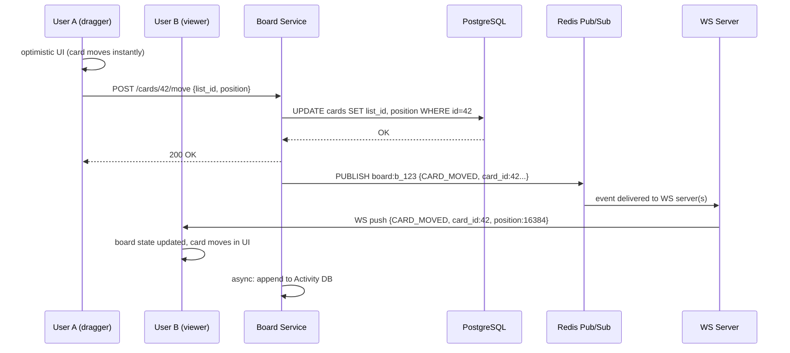
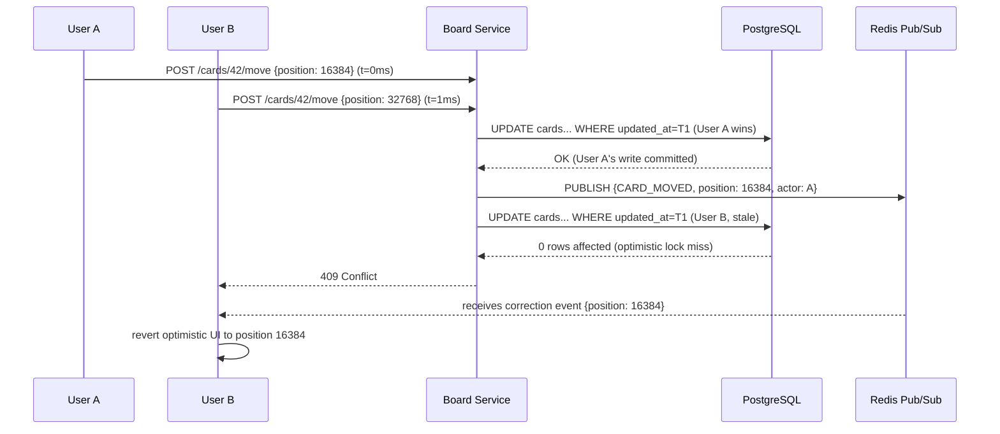
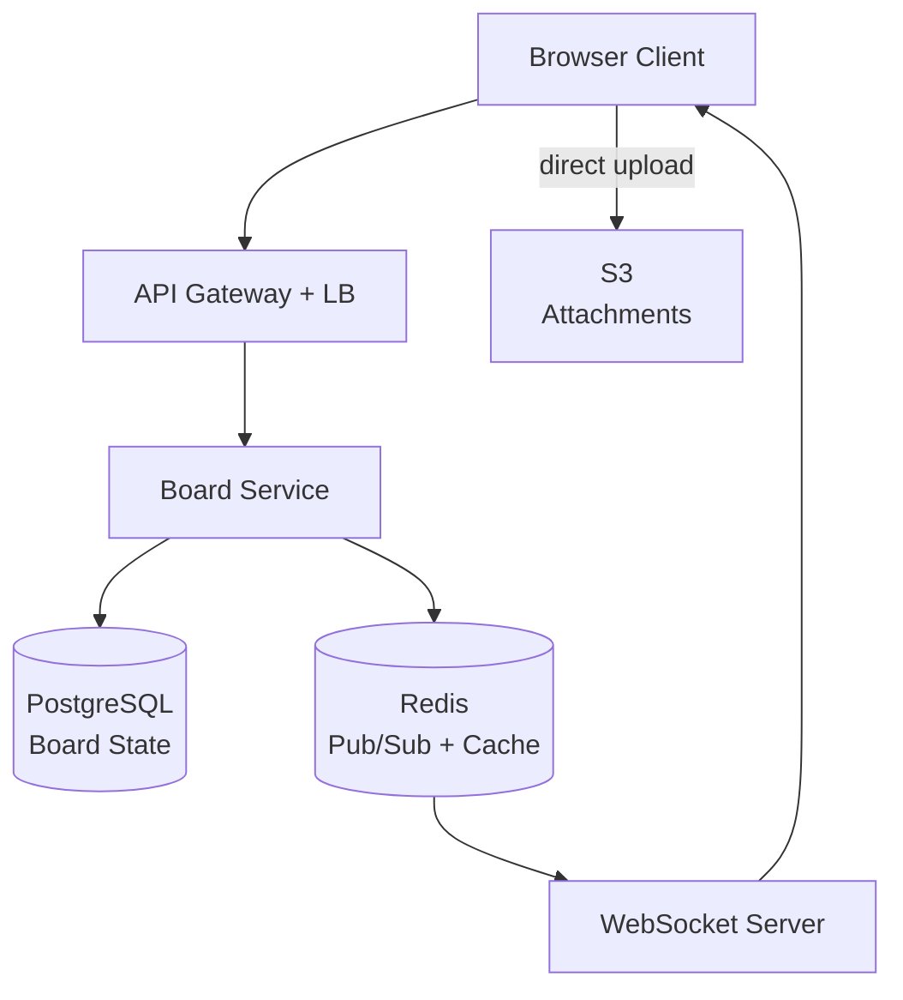
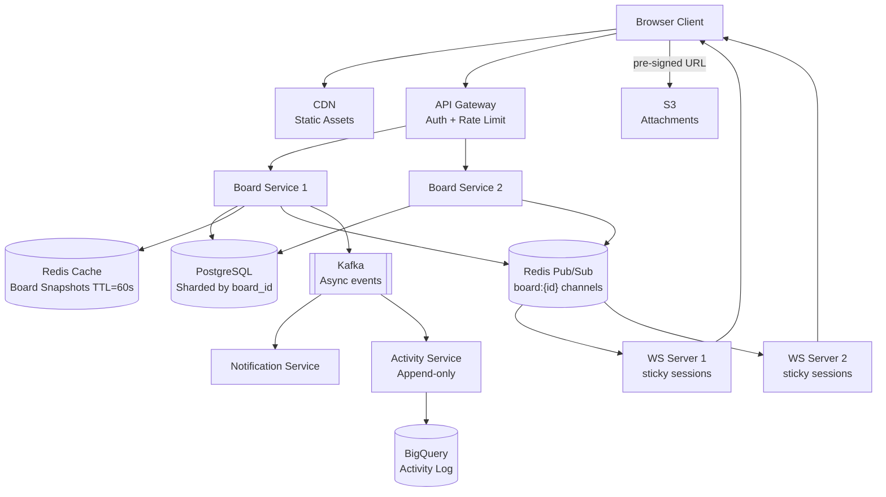

# Trello / Issue Manager System Design

---

## 1. Problem + Scope

Design a real-time collaborative kanban board system (Trello/Jira-lite) where multiple users can manage boards, lists, and cards simultaneously, with changes propagating to all active collaborators in real time.

> **Core problem:** Synchronize mutable board state — card positions, list order, card content — across multiple concurrent users with low latency, correct ordering, and no lost updates.

> **This is NOT a document editor (no OT/CRDT needed).** It is a board state machine. Each mutation (move card, rename, comment) is a discrete event applied to a shared state. The challenge is fanout, ordering, and conflict handling for concurrent positional mutations, not character-level merge.

**In scope:** Boards, Lists, Cards (CRUD + drag-and-drop reorder), real-time multi-user sync, comments, labels, due dates, assignments, activity feed, file attachments, notifications.
**Out of scope:** Gantt charts, advanced reporting/analytics, time-tracking, billing/subscription management.

---

## 2. Assumptions & Scale

| Signal | Number |
|---|---|
| DAU | 50M |
| Boards per user (avg) | 5 active |
| Cards per board (avg) | 40 |
| Active boards at peak | ~5M concurrent boards |
| Concurrent WebSocket connections | ~8–10M (users × avg open tabs) |
| Card mutations/sec (moves, edits) | ~100K/sec peak |
| Comments/sec | ~20K/sec |
| Attachment uploads/day | ~10M files |
| Board state read (on open) | Full board snapshot — lists + cards + members |
| Fanout per card move | avg 4 other members per board watching |
| Activity events/day | ~2B (every card move, comment, label = 1 event) |

**Hardest flow:** Concurrent card drag — two users move the same card simultaneously. Which wins? The board must converge to a consistent state for all members.

**Fanout math:** 100K card moves/sec × avg 4 other members = **400K WebSocket pushes/sec**. Must be handled via Redis Pub/Sub fan-out, not direct server-to-server calls.

**Primary bottleneck at scale:** WebSocket connection management and fan-out throughput — not storage.

*These numbers drive: WebSocket servers behind sticky-session load balancer, Redis Pub/Sub per board for fan-out, PostgreSQL for board state with optimistic locking, S3 for attachments.*

---

## 3. Functional Requirements

- Create / update / delete boards, lists, and cards
- Drag-and-drop cards within and across lists (reorder)
- Real-time sync — all board members see mutations within ~200ms
- Card details: title, description, labels, due date, assignees, checklist, attachments
- Comments on cards with @mentions
- Activity feed per card and per board (audit log)
- Board member management (invite, role: admin/member/viewer)
- Notifications (mention, due date reminder, card assigned)

---

## 4. Non-Functional Requirements

| Property | Requirement | Why |
|---|---|---|
| Real-time sync latency | <200ms for board mutations | Collaborative feel — lag above 200ms breaks the "same room" illusion |
| Availability | 99.99% (AP) | Board state must be readable even during partial failures |
| Consistency | Eventual for display, strong for card position | Two users can't persist the same card position — last-write-wins with vector clock |
| Read latency | <100ms for board load | Full board snapshot on open must feel instant |
| Attachment upload | Async, direct-to-S3 | Never block board interactivity on file upload |
| Notification delivery | At-least-once, <5s | Missed @mention is bad UX; <5s is acceptable |

### Consistency Model

| Domain | Model | Reason |
|---|---|---|
| Card position (order within list) | Last-write-wins with server timestamp | Concurrent moves are rare; simple LWW is sufficient — no financial consequence |
| Card content (title, description) | Eventual (last write wins per field) | Two users editing description simultaneously → last save wins; acceptable |
| Board membership | Strong (CP) | Must not allow access after removal; stale member list = security issue |
| Activity feed | Eventual, append-only | Order within same second doesn't matter |

---

## 🧠 Mental Model

**Trello is a real-time collaborative board state management system optimized for low-latency multi-user synchronization.**

```
Board state = a tree:
  Board
    └── List[]
          └── Card[]
                └── Comment[], Attachment[], Activity[]

Every user mutation = an event applied to this tree.
Every event must be:
  1. Persisted in DB (source of truth)
  2. Fanned out to all other board members via WebSocket
```

**E2E flow in one line:**
```
User drags card → optimistic UI update → POST mutation → DB write →
  Redis Pub/Sub publish → WS Server fan-out → all members update board
```

The fanout model is **push (fan-out on write)** — small groups (avg 4 other members), so write amplification is minimal. Every mutation is immediately pushed to all active WebSocket connections for that board.

```
User A drags Card-42 from List-1 to List-2
          |
    [Optimistic UI] ← card moves immediately in A's browser
          |
    POST /cards/42/move {list_id, position}
          |
    [Board Service] → PostgreSQL UPDATE (position, list_id)
          |
    Redis PUBLISH board:{boardId} {event: CARD_MOVED, card_id, ...}
          |
    ┌─────┴──────────────────────┐
  WS Server 1               WS Server 2
  (User B connected)         (User C connected)
          |                       |
    User B sees               User C sees
    card move                 card move
    in <200ms                 in <200ms
```

**⚡ Core Design Principles**

| Fast Path (optimistic) | Reliable Path (sync) |
|---|---|
| Optimistic UI — card moves instantly in user's browser | DB write before Redis publish — no publish without persistence |
| WebSocket delta push — only the changed card, not full board | Activity event appended for every mutation (audit trail) |
| Client reconciles on WS reconnect (full snapshot diff) | Conflict: server LWW wins, client receives correction event |

---

## 5. API Design

**Boards**

| Endpoint | Method | Key Params / Body | Notes |
|---|---|---|---|
| `/boards` | GET | — | List boards for authenticated user (from their workspaces) |
| `/boards` | POST | `name, workspace_id, visibility` | Create board; visibility = public/private |
| `/boards/{id}` | GET | — | Full board snapshot: `{ board, lists: [{…, cards:[…]}], members }` |
| `/boards/{id}` | DELETE | — | Soft delete (set `is_archived=true`) |
| `/boards/{id}/members` | POST | `user_id, role` | Invite member |
| `/boards/{id}/members/{userId}` | PATCH | `role` | Change member role |
| `/boards/{id}/members/{userId}` | DELETE | — | Remove member (strong consistency required) |
| `/boards/{id}/activity` | GET | `cursor, limit=20` | Cursor-paginated board activity feed |

**Lists**

| Endpoint | Method | Key Params / Body | Notes |
|---|---|---|---|
| `/boards/{id}/lists` | POST | `name, position` | Add list |
| `/lists/{id}` | PATCH | `name, position` | Rename or reorder list |
| `/lists/{id}` | DELETE | — | Soft delete list (sets `is_archived=true`); archives all cards in list |

**Cards**

| Endpoint | Method | Key Params / Body | Notes |
|---|---|---|---|
| `/lists/{id}/cards` | POST | `title, position` | Create card |
| `/cards/{id}` | GET | — | Full card detail: title, description, labels, checklists, attachments, comments, activity |
| `/cards/{id}` | PATCH | `title, description, due_date, assignee_ids, label_ids` | Update card fields |
| `/cards/{id}` | DELETE | — | Soft delete (set `is_archived=true`) |
| `/cards/{id}/move` | POST | `list_id, position, updated_at` | Move card; `updated_at` is client's last-known version (optimistic lock check) |
| `/cards/{id}/comments` | POST | `body, mentions[]` | Add comment; triggers @mention notifications async |
| `/cards/{id}/attachments` | POST | `filename, content_type` | Returns pre-signed S3 URL for direct upload |

**WebSocket message contract:**
```json
// Server → Client (event push)
{
  "event": "CARD_MOVED",
  "board_id": "b_123",
  "card_id": "c_456",
  "from_list": "l_1",
  "to_list": "l_2",
  "position": 16384.0,
  "actor_id": "u_789",
  "event_id": "evt_abc",   ← idempotency key
  "ts": 1712000000000
}

// Client → Server (subscribe)
{ "action": "subscribe", "board_id": "b_123" }
{ "action": "unsubscribe", "board_id": "b_123" }
```

---

## 6. End-to-End Flow

> [!IMPORTANT]
> **Real-time Fanout via Redis Pub/Sub**
>
> **Why Redis Pub/Sub (not Kafka) for board events:**
> Board mutations must reach all connected members in <200ms. Kafka's throughput is massive but adds 10–100ms broker latency. Redis Pub/Sub is in-memory, sub-millisecond publish, and perfectly suited for small-group real-time fanout (avg 4 recipients per board).
>
> **Delivery guarantee:** At-least-once. WebSocket connections can drop; clients reconnect and fetch a full snapshot diff to catch up on missed events. `event_id` (UUID) on every event prevents duplicate application on client.
>
> **The mutation pipeline is a correctness requirement:** DB write must succeed before Redis publish. If Redis publish fails after DB write, client reconnects and snapshot diff delivers the missed event. If DB write fails, Redis is never published — no phantom updates.

### 6.1 Card Move — Happy Path

1. User A drags Card-42 from List-1 to position 2 in List-2. Browser applies **optimistic UI update immediately** — card visually moves before any server response. I chose optimistic UI because 99%+ of moves succeed; the perceived latency drops from 200ms to 0ms.

2. Client fires `POST /cards/42/move { list_id: "l_2", position: 16384.0 }`. Position is a **fractional index** (float) — I'll explain this in Deep Dive 9.1.

3. **Board Service** receives the request. Before writing, it checks the `event_id` in the request — if this event was already applied (client retry after timeout), return the existing result immediately (idempotent).

4. Board Service executes a DB transaction:
   ```sql
   UPDATE cards SET list_id='l_2', position=16384.0,
                    updated_at=NOW(), updated_by='u_A'
   WHERE id='c_42'
   ```
   Returns 200 OK to User A.

5. Board Service publishes to Redis channel `board:b_123`:
   ```json
   { "event": "CARD_MOVED", "card_id": "c_42", "list_id": "l_2",
     "position": 16384.0, "actor_id": "u_A", "event_id": "evt_xyz", "ts": ... }
   ```

6. **WS Server 1** (where User B is connected) and **WS Server 2** (User C) are both subscribed to `board:b_123` channel. Both receive the Redis message and push it over their respective WebSocket connections to Users B and C.

7. Users B and C update their board state from the event delta. Card-42 moves in their browsers — total latency from User A's drag to B/C seeing it: **~150–200ms**.

8. Async: Board Service appends an activity event to the Activity DB (BigQuery/append-only table): `{board_id, card_id, actor, event_type: CARD_MOVED, ts}`.

### 6.2 Conflict — Two Users Move Same Card Simultaneously

1. User A and User B both drag Card-42 at the same instant.
2. Both clients send `POST /cards/42/move` with their target positions.
3. DB serializes writes. Whichever request arrives first gets written. Second request sees a conflicting `updated_at` timestamp (optimistic lock check: `WHERE updated_at = {client_known_ts}`).
4. Second write is rejected with `409 Conflict`.
5. Board Service publishes the winning move to Redis → all members (including the loser) receive the correction event.
6. The losing client's optimistic update is **reverted** — card snaps to the server-correct position. I chose last-write-wins because: board conflicts are rare, reversing a card move has zero consequence (unlike financial double-spend), and the complexity of CRDT for position is not justified.

### 6.3 Board Load — User Opens Board

1. Client opens board `b_123`. Fires `GET /boards/b_123`.
2. **Board Service** checks Redis cache: `board:snapshot:{b_123}` (TTL=60s).
3. Cache hit → return full snapshot (lists + cards + members) in ~5ms.
4. Cache miss → query PostgreSQL:
   ```sql
   SELECT lists.*, cards.* FROM lists
   JOIN cards ON cards.list_id = lists.id
   WHERE lists.board_id = 'b_123'
   ORDER BY lists.position, cards.position
   ```
   Write result to Redis cache. Return to client.
5. Client renders board, then immediately opens WebSocket `WS /boards/b_123/sync` to subscribe to future events.
6. From this point, all mutations arrive as delta events over WebSocket — client never re-fetches the full board.





---

## 7. High-Level Architecture

### Simple Design



### Evolved Design



---

## 8. Data Model

> [!IMPORTANT]
> **Storage Separation**
>
> | What | Where | Why |
> |---|---|---|
> | Board state (boards, lists, cards) | PostgreSQL (sharded by board_id) | Relational, ACID transactions for positional consistency |
> | Board snapshot cache | Redis (TTL=60s) | Sub-ms board load; invalidated on any mutation |
> | Real-time event fanout | Redis Pub/Sub (channel per board) | Sub-ms publish; ephemeral — no persistence needed |
> | File attachments | S3 | Never store binary in DB; direct client-to-S3 upload via pre-signed URL |
> | Activity / audit log | BigQuery (append-only) | 2B events/day; analytical queries, never OLTP |
> | Notification queue | Kafka | Async, durable; at-least-once delivery to Notification Service |

### Core Tables (PostgreSQL, sharded by `board_id`)

**users**
| Column | Type | Note |
|---|---|---|
| id | UUID (PK) | |
| email | text (unique) | login identity |
| display_name | text | |
| avatar_url | text | S3 key |
| created_at | timestamp | |

**workspaces**
| Column | Type | Note |
|---|---|---|
| id | UUID (PK) | |
| name | text | |
| owner_id | UUID (FK → users) | |
| created_at | timestamp | |

**boards**
| Column | Type | Note |
|---|---|---|
| id | UUID (PK) | |
| workspace_id | UUID (FK → workspaces) | |
| name | text | |
| visibility | enum | public / private |
| is_archived | boolean | soft delete |
| created_by | UUID (FK → users) | |
| created_at | timestamp | |

**lists**
| Column | Type | Note |
|---|---|---|
| id | UUID (PK) | |
| board_id | UUID (FK, shard key) | |
| name | text | |
| position | float8 | fractional index — see Deep Dive 9.1 |
| is_archived | boolean | |
| created_by | UUID (FK → users) | |
| created_at | timestamp | |

**cards**
| Column | Type | Note |
|---|---|---|
| id | UUID (PK) | |
| board_id | UUID (shard key) | denormalized for query efficiency |
| list_id | UUID (FK) | current list |
| title | text | |
| description | text | |
| position | float8 | fractional index within list |
| due_date | timestamp | nullable |
| assignee_ids | UUID[] | PostgreSQL array |
| label_ids | UUID[] | FK array → labels.id |
| is_archived | boolean | soft delete |
| created_by | UUID (FK → users) | |
| created_at | timestamp | |
| reminded_24h | boolean | set true after due-date reminder sent — see Deep Dive 9.7 |
| updated_at | timestamp | **optimistic lock version field** |
| updated_by | UUID (FK → users) | |

**board_members**
| Column | Type | Note |
|---|---|---|
| board_id | UUID (PK, FK → boards) | composite PK |
| user_id | UUID (PK, FK → users) | composite PK |
| role | enum | admin / member / viewer |
| joined_at | timestamp | |

**labels**
| Column | Type | Note |
|---|---|---|
| id | UUID (PK) | |
| board_id | UUID (FK, shard key) | labels are board-scoped |
| name | text | e.g. "Bug", "Feature" |
| color | text | hex color string |

**attachments**
| Column | Type | Note |
|---|---|---|
| id | UUID (PK) | |
| card_id | UUID (FK) | |
| board_id | UUID (shard key) | |
| uploader_id | UUID (FK → users) | |
| filename | text | original file name |
| s3_key | text | S3 object key |
| size_bytes | bigint | |
| status | enum | PENDING / UPLOADED / DELETED |
| created_at | timestamp | |

**checklists**
| Column | Type | Note |
|---|---|---|
| id | UUID (PK) | |
| card_id | UUID (FK) | |
| board_id | UUID (shard key) | |
| title | text | e.g. "Acceptance Criteria" |
| position | float8 | fractional index within card |

**checklist_items**
| Column | Type | Note |
|---|---|---|
| id | UUID (PK) | |
| checklist_id | UUID (FK → checklists) | |
| board_id | UUID (shard key) | |
| title | text | |
| is_checked | boolean | |
| position | float8 | fractional index within checklist |
| due_date | timestamp | nullable |
| assignee_id | UUID (FK → users) | nullable |

**comments**
| Column | Type | Note |
|---|---|---|
| id | UUID (PK) | |
| card_id | UUID (FK) | |
| board_id | UUID (shard key) | |
| author_id | UUID (FK → users) | |
| body | text | |
| mentions | UUID[] | parsed from @mentions |
| is_edited | boolean | true if body was edited post-creation |
| created_at | timestamp | |
| updated_at | timestamp | |

### Indexes (PostgreSQL)

```sql
-- Hot path: board load (lists + cards ordered by position)
CREATE INDEX idx_lists_board_pos    ON lists    (board_id, position);
CREATE INDEX idx_cards_list_pos     ON cards    (list_id, position);
CREATE INDEX idx_cards_board        ON cards    (board_id);          -- shard fan-out

-- Card detail
CREATE INDEX idx_comments_card      ON comments (card_id, created_at DESC);
CREATE INDEX idx_attachments_card   ON attachments (card_id);
CREATE INDEX idx_checklists_card    ON checklists (card_id, position);
CREATE INDEX idx_items_checklist    ON checklist_items (checklist_id, position);

-- Membership
CREATE UNIQUE INDEX idx_members_pk  ON board_members (board_id, user_id);
CREATE INDEX idx_members_user       ON board_members (user_id);      -- "user's boards" query

-- Labels
CREATE INDEX idx_labels_board       ON labels (board_id);

-- Attachments cleanup job
CREATE INDEX idx_attachments_status ON attachments (status, created_at) WHERE status = 'PENDING';

-- Due date reminder job (partial index — only non-reminded, non-archived cards with due dates)
CREATE INDEX idx_cards_due_date     ON cards (due_date) WHERE reminded_24h = false AND is_archived = false;
```

---

## 9. Deep Dives

### 9.1 Card Position — Fractional Indexing

**Problem:** Cards have an order within a list. User drags Card-42 between Card-10 (position=100) and Card-20 (position=200). How do we store the new position without renumbering all cards?

**Naive solution — integer index:**
Card-42 gets position=150. Fine. But what if the user drags again between position=100 and position=150? We need 125. Eventually: positions 100, 112, 113, 113 — we run out of integers between adjacent values and must renumber all cards in the list. Renumber = N writes + N WebSocket push events = expensive fan-out.

**Chosen solution — fractional indexing (float64):**
Each position is a float64. Inserting between positions A and B → `new_position = (A + B) / 2`.

```
Initial:  A=10000, B=20000
Insert:   new = 15000
Insert again between 10000 and 15000: new = 12500
Insert again: new = 11250
...
```

Float64 gives ~15 decimal digits of precision. In practice, after ~50 consecutive inserts between the same two positions, precision degrades. **Rebalancing trigger:** if `|A - B| < 0.01`, rebalance the entire list (assign evenly-spaced positions 10000, 20000, 30000...). Rebalancing is rare — triggered for <0.01% of moves.

The trade-off I accept: float precision edge cases require a rebalance job. Acceptable because rebalancing a list of 40 cards = 40 writes, once in every ~50 consecutive inserts to the same gap.

> [!NOTE]
> Key Insight: Fractional indexing makes 99.9% of card moves a single-row UPDATE with zero fan-out to other cards. Integer indexing makes every insert an N-row UPDATE that fans out to all N board members. Wrong at scale.

---

### 9.2 Real-time Sync — WebSocket + Redis Pub/Sub

**Problem:** 8–10M concurrent WebSocket connections. A card move on board B must reach all members of board B — but those members may be connected to different WS servers. How does WS Server 1 know to push to User B on WS Server 2?

**Naive solution — broadcast to all WS servers:**
Every WS server holds all connections. Any mutation broadcasts to all servers. Each server checks if any of its connections care about this board. At 8M connections × 100K mutations/sec = wasteful.

**Chosen solution — Redis Pub/Sub with per-board channels:**

1. When User B's browser opens board `b_123`, WS Server 2 subscribes to Redis channel `board:b_123`.
2. Board Service publishes every mutation to `board:{boardId}` — one Redis PUBLISH command, regardless of how many members are watching.
3. All WS servers subscribed to that channel receive the event and push it to their respective connected users.

**Connection routing:** Load balancer uses **sticky sessions** (consistent hash on `userId`) to ensure a user's WebSocket always reconnects to the same WS server — simplifies per-user state management (pending ACKs, subscription list).

**Scale check:** 8M connections / 10 WS servers = 800K connections per server. Each server manages 800K WebSocket connections + subscribes to ~200K active board channels (users watching many boards simultaneously). Redis handles this: one PUBLISH = fan-out to all subscribers across all WS servers.

> [!NOTE]
> Key Insight: WebSocket vs SSE here is a subscription management problem, not a performance problem. I chose WebSocket (not SSE) because clients also send events to the server (subscribe/unsubscribe messages). SSE is read-only — can't send from client.

---

### 9.3 Conflict Resolution — Optimistic Locking for Card Moves

**Problem:** Two users drag the same card simultaneously. Both send `POST /cards/42/move`. Without coordination, the second write silently overwrites the first — the "winner" depends on network race, not user intent.

**Naive solution — last write wins (no version check):**
Silent overwrite. No conflict surfaced. One user's move disappears without explanation. Confusing UX.

**Chosen solution — optimistic locking via `updated_at` timestamp:**

Client sends its known `updated_at` with every move request:
```sql
UPDATE cards SET list_id=?, position=?, updated_at=NOW()
WHERE id=? AND updated_at=?   ← client's last-known timestamp
```

- If 0 rows affected → conflict → return 409 → client reverts optimistic UI
- If 1 row affected → success → publish to Redis

The winning write publishes a correction event to all members, including the losing client. Every client's optimistic update is reconciled against server truth.

**Why not pessimistic locking?** `SELECT FOR UPDATE` on a card while a user is dragging (hundreds of milliseconds) would hold a row lock for the drag duration. At 100K drags/sec, this serialises all drags globally — instant bottleneck.

> [!NOTE]
> Key Insight: Optimistic locking is the right concurrency control for collaborative boards. Card conflicts are rare (<0.1% of moves). Pessimistic locking would serialise all concurrent drags for a conflict rate that almost never occurs.

---

### 9.4 Board Snapshot — Fast Initial Load

**Problem:** Opening a board must feel instant. A board with 200 cards across 6 lists needs full state — lists, cards, members, labels. PostgreSQL query with joins over millions of boards = slow cold read.

**Naive solution:** `SELECT * FROM cards JOIN lists WHERE board_id=?` on every board open.
At 5M concurrent boards × opens/day → PostgreSQL overwhelmed.

**Chosen solution — Redis snapshot cache (TTL=60s):**
- Board Service caches serialized full board state in Redis at key `board:snapshot:{boardId}`.
- Cache hit → return in ~5ms (Redis in-memory).
- Cache miss → query DB, populate cache.
- **Invalidation:** Every mutation calls `DEL board:snapshot:{boardId}` before publishing the Redis Pub/Sub event. Next board open rebuilds from DB.

Why TTL=60s even with explicit invalidation? Safety net — if invalidation misses (service crash mid-mutation), cache auto-expires in 60s. Stale board state for max 60s is acceptable.

**Board open + WebSocket:** Client fetches snapshot, then opens WebSocket subscription. There's a small race window (between snapshot fetch and WS subscribe) where events might be missed. Fix: snapshot response includes a `last_event_id`. WS server buffers events for 5 seconds; client catches up from `last_event_id` on subscribe.

> [!NOTE]
> Key Insight: Board snapshot in Redis = O(1) board load for 99% of opens. The 1% cache miss pays the DB query cost — acceptable. Without the cache, every board open = a multi-table JOIN over a DB that also handles 100K mutations/sec.

---

### 9.5 File Attachments — Direct S3 Upload

**Problem:** Cards can have file attachments. Files can be large (up to 100MB). If the client uploads via our API server, the file transits through our servers — wasted bandwidth, wasted CPU, added latency.

**Chosen solution — pre-signed S3 URL:**
1. Client requests `POST /cards/{id}/attachments { filename, content_type }`.
2. Board Service generates a pre-signed S3 URL (valid 10 min), saves attachment metadata (card_id, filename, s3_key, status=PENDING) to DB.
3. Returns pre-signed URL to client.
4. Client uploads directly to S3 (no traffic through our servers).
5. S3 fires an event notification → Lambda/webhook updates attachment status to UPLOADED → publishes to Kafka → Notification Service and WS event fanout ("User A attached file.pdf").

Trade-off I accept: if client upload fails, attachment row stays in PENDING state. Background cleanup job deletes PENDING rows older than 24 hours and revokes the S3 key.

> [!NOTE]
> Key Insight: Never route binary file uploads through your API servers. Pre-signed S3 URL = zero server bandwidth for attachments. 10M uploads/day at avg 2MB = 20TB/day. Routing that through API servers would require 50+ servers just for upload I/O.

---

### 9.6 @Mentions — Notification Flow

**Problem:** When a user types `@alice` in a comment, Alice must receive a notification within 5 seconds — in-app, email, or push — without blocking the comment POST response.

**Flow:**
1. Client sends `POST /cards/{id}/comments { body: "check this @alice", mentions: ["u_alice"] }`.
2. Board Service saves the comment row (mentions = `[u_alice]`), returns 200 OK immediately.
3. Board Service publishes two events asynchronously to Kafka:
   - `board.events` topic → Redis Pub/Sub fan-out (so all board members see the new comment in real-time via WS)
   - `notification.mentions` topic → Notification Service
4. **Notification Service** consumes `notification.mentions`:
   - Looks up Alice's notification preferences (push / email / in-app)
   - Checks rate limit: no more than 10 notifications/min per user
   - Dispatches to the appropriate channel(s)

**Delivery guarantee:** At-least-once from Kafka. Idempotency key = `comment_id + user_id`. `ON CONFLICT DO NOTHING` in the notifications table prevents duplicate in-app alerts.

```
User types @alice in comment
  → POST /cards/{id}/comments
  → DB write (mentions=[u_alice])
  → Kafka: board.events + notification.mentions (async, non-blocking)
  → Kafka → Notification Service → push/email/in-app to Alice (<5s)
```

> [!NOTE]
> Key Insight: @mention notification is fire-and-forget from the comment write path. Never block the comment save on notification delivery. Kafka decouples the two concerns — comment is persisted first, notification dispatched async.

---

### 9.7 Due Date Reminders — Scheduled Job

**Problem:** Cards have due dates. Users expect a reminder notification before a card is due (e.g., 24h before). This is not triggered by a user action — it must be proactively scheduled.

**Chosen solution — polling job with distributed lock:**

1. A **Due Date Reminder Worker** runs every 5 minutes (cron).
2. Queries PostgreSQL for cards where `due_date BETWEEN NOW() AND NOW() + 25h` and `reminded_24h = false`.
   ```sql
   SELECT id, assignee_ids, due_date FROM cards
   WHERE due_date BETWEEN NOW() AND NOW() + INTERVAL '25 hours'
     AND reminded_24h = false
     AND is_archived = false
   ```
   (This query runs against a dedicated replica to avoid impacting write throughput.)
3. For each card, publishes a `notification.due_date` event to Kafka with `card_id`, `assignee_ids`, `due_date`.
4. Marks `reminded_24h = true` on the card row (UPDATE).
5. Notification Service consumes and dispatches to each assignee's preferred channel.

**Distributed lock:** Multiple worker instances could run the same job simultaneously. Use Redis `SET NX EX 270` (270s = 4.5min) on key `due_date_job_lock` — only one worker acquires the lock and runs the job per 5-min window.

**Why not event-driven (set a timer at card creation)?** Timer-based approach (e.g., SQS delay queue) requires canceling and rescheduling on every due_date change. Polling is simpler and a 5-min poll interval is well within the 24h reminder tolerance.

> [!NOTE]
> Key Insight: Due date reminders are a scheduling problem, not a real-time problem. A 5-minute polling job with a distributed lock is simpler than a timer queue that must be maintained across every due_date edit/delete.

---

## 10. Bottlenecks & Scaling

We're designing for **50M DAU**, **8M concurrent WebSocket connections**, **100K card mutations/sec peak**, **5M active boards**. Primary bottleneck: **WebSocket fan-out throughput** — not DB write throughput.

**What breaks first at 10× scale (500M DAU, 80M concurrent WS):**

| Bottleneck | Problem | Solution |
|---|---|---|
| WebSocket servers | 800K→8M connections per server | Scale WS servers horizontally; Redis Cluster for Pub/Sub channel distribution |
| Redis Pub/Sub throughput | 1M publish events/sec at 10× | Redis Cluster shards channels by `board_id` hash |
| PostgreSQL write throughput | 100K→1M mutations/sec | Shard by `board_id` (consistent hashing); each shard owns a range of boards |
| Board snapshot cache (Redis) | 5M→50M active boards × 60s TTL | Redis Cluster; each shard owns a slice of board_id space |
| Activity DB | 20B events/day at 10× | BigQuery handles petabyte-scale natively; increase Kafka partition count |

**Peak spike scenario — end of sprint (all teams updating boards simultaneously):**
- Mutation rate spikes 5× over baseline
- Redis Pub/Sub absorbs the burst (in-memory, no disk I/O)
- Board snapshot cache hit rate drops as many boards mutate simultaneously (more invalidations)
- WS servers auto-scale on connection count metric

**Sharding strategy for PostgreSQL:**
Shard key = `board_id`. All tables include `board_id` as a denormalized shard key. A board's entire data (lists, cards, comments) lives on one shard — no cross-shard joins for any board operation.

---

## 11. Failure Scenarios

| Failure | Impact | Recovery |
|---|---|---|
| WS Server crash | Connected users lose real-time updates | Clients detect disconnect (WS `onclose`), reconnect to new WS server (LB re-routes), fetch snapshot diff from `last_event_id` |
| Redis Pub/Sub node down | Events not fanned out to WS servers | Redis Cluster promotes replica; during failover (~10s), WS clients see no updates. On reconnect, snapshot diff catches up missed events |
| Board Service crashes mid-mutation | DB write may or may not have committed | Client retries with same `event_id`; idempotent write via `ON CONFLICT DO NOTHING` on event_id unique index |
| PostgreSQL shard unresponsive | Boards on that shard can't be loaded/mutated | Route reads to replica; writes fail with 503 until primary recovered; user sees "Unable to save changes" |
| Redis snapshot cache OOM | Board opens go to DB directly | DB handles the load (degraded but functional); alert fires; increase Redis memory or add shards |
| S3 upload fails | Attachment status stays PENDING | Background cleanup job after 24h; user can retry upload via new pre-signed URL |
| Kafka consumer (Activity Service) lag | Activity feed delayed | Kafka 7-day retention; consumer catches up; activity feed shows "loading" until caught up |

---

## 12. Trade-offs

### Real-time Protocol: WebSocket vs SSE vs Polling

| | Long Polling | SSE | WebSocket (chosen) |
|---|---|---|---|
| Direction | Request-response | Server → Client only | Full-duplex |
| Latency | 500ms–2s | <200ms | <200ms |
| Server state | Stateless | Stateful (connection held) | Stateful |
| Client can send | Yes (new request) | No | Yes (same connection) |
| Scaling | Easy (stateless) | Medium | Hard (sticky sessions) |
| Use case | Legacy fallback | Notifications (no client send) | Collaborative boards |

**Chosen:** WebSocket — clients must send subscribe/unsubscribe messages as they navigate between boards. SSE is read-only and can't support this.

> [!NOTE]
> Key Insight: WebSocket vs SSE is a subscription management problem, not a performance problem. Both have similar latency. WebSocket wins because collaborative boards need bidirectional communication for subscription control.

---

### Conflict Resolution: LWW vs CRDT vs OT

| | Last-Write-Wins (chosen) | OT (Operational Transformation) | CRDT |
|---|---|---|---|
| Complexity | Low | Very high | High |
| Card move conflicts | Loser reverts (UX: small jerk) | Merge both moves | Automatic merge |
| When conflicts happen | <0.1% of moves | Every character edit | Every character edit |
| Right tool for | Discrete position updates | Real-time text editing (Google Docs) | Eventually-consistent counters |

**Chosen:** LWW — board position conflicts are discrete and rare (<0.1%). OT/CRDT are built for character-level merging in real-time text editors. Bringing that complexity to card position updates (which happen ~once/minute per active user) is massive over-engineering.

> [!NOTE]
> Key Insight: Trello is NOT Google Docs. Card moves are discrete events, not character streams. LWW with optimistic lock + client revert is the correct, simple solution. CRDT for position management solves a problem that barely exists.

---

### Card Position: Fractional vs Integer Index

| | Integer (gap-based) | Fractional float64 (chosen) |
|---|---|---|
| Insert between two cards | Renumber N cards | One UPDATE, new midpoint |
| Fan-out per insert | N card events to all members | 1 card event |
| Precision limit | Never | After ~50 consecutive inserts to same gap — rebalance |
| Implementation | Simple | Slightly more complex (rebalance trigger) |

**Chosen:** Fractional indexing — single-row UPDATE per move. Integer rebalancing at 100K moves/sec would generate N fan-out events per move, overwhelming WS servers.

---

### Storage: PostgreSQL vs Cassandra for Board State

| | PostgreSQL (chosen) | Cassandra |
|---|---|---|
| Optimistic locking | Native (`WHERE updated_at=?`) | No multi-row transactions |
| Shard by board_id | Manual sharding | Native partition key |
| Complex queries | Joins, ORDER BY, array ops | Partition-key + cluster key only |
| Board load (lists + cards join) | O(1) with index | Cross-partition = scatter-gather |

**Chosen:** PostgreSQL — optimistic locking requires atomic row-level versioning. Cassandra's eventual consistency model makes conflict detection unreliable. Manual sharding by `board_id` gives linear scale without sacrificing ACID per-board.

---

## 13. Frontend Notes

*Trello is a balanced system — 50% backend / 50% frontend. The frontend problem is drag-and-drop, optimistic UI, and real-time reconciliation.*

### Drag-and-Drop
- Use a library (react-beautiful-dnd or dnd-kit) for native drag semantics + keyboard accessibility
- On drag start: clone card to drag layer; original card becomes a placeholder (ghost)
- On drop: compute new fractional position client-side (`(prev.position + next.position) / 2`); apply optimistic update; fire `POST /cards/{id}/move`
- On 409 conflict: animate card back to server-correct position (CSS transition, 300ms)

### Optimistic UI
- Every mutation (move, rename, comment, label toggle) applies to local state immediately
- Pending mutations tracked in a `pendingEvents` Map keyed by `event_id`
- On WS event received: if `event_id` is in pending → it's our own echo, skip (idempotent)
- On 409 or WS correction event: revert specific card/list to server state

### WebSocket Lifecycle
```js
// One WS connection per open board tab
const ws = new WebSocket(`/boards/${boardId}/sync`);

ws.onopen = () => ws.send(JSON.stringify({ action: 'subscribe', board_id: boardId }));
ws.onmessage = ({ data }) => applyBoardEvent(JSON.parse(data));
ws.onclose = () => {
  // Reconnect with exponential backoff
  setTimeout(() => reconnect(), backoff.next());
  // On reconnect: fetch snapshot diff from last_event_id
};
```

### Board State Reconciliation on Reconnect
- On WS reconnect, client sends its `last_event_id`
- Server returns all events after that ID (buffered for 30s)
- Client applies diffs in order → board state catches up without full reload
- If `last_event_id` is older than 30s buffer: fetch full snapshot (board reload)

### Virtual List for Large Boards
- Boards with 500+ cards (e.g., sprint backlog) render all cards → 7,500+ DOM nodes → 8fps
- Use virtual list within each column: render only visible cards + 5 buffer above/below
- Height of each card must be known upfront (or estimated) to maintain scroll position

### Skeleton Loading
- Board load shows skeleton columns with grey card placeholders
- `aspect-ratio` CSS on card containers prevents CLS when real cards load
- Data arrives in ~100ms; skeleton visible for <100ms — barely noticeable

---

## Interview Summary

### Key Decisions

| Decision | Problem it solves | Trade-off accepted |
|---|---|---|
| WebSocket + Redis Pub/Sub fanout | 8M connections across N servers; sub-200ms delivery to all board members | Sticky sessions required; WS servers are stateful |
| Fractional indexing (float64) for positions | Card move = 1 DB write, 1 WS event (not N rewrites) | Precision degrades after ~50 inserts to same gap → rebalance needed |
| Optimistic locking (updated_at) for conflicts | Prevent silent overwrites on concurrent card moves | Losing client's optimistic UI reverts (small UX jerk) |
| LWW conflict resolution (not CRDT/OT) | Board card moves are discrete, rare conflicts — not character streams | Loser's move lost; acceptable because conflicts are <0.1% of moves |
| Redis snapshot cache (TTL=60s) + invalidation | Board load <100ms despite complex multi-table joins | 60s max staleness on cache miss; snapshot rebuild on every mutation |
| Pre-signed S3 for attachments | 10M uploads/day — can't route 20TB/day through API servers | Upload failure leaves PENDING row; cleanup job required |
| Shard PostgreSQL by board_id | All board data (lists, cards, comments) on one shard — no cross-shard joins | Manual resharding on topology change |
| @mention notification via Kafka (async) | Comment save must not block on notification delivery | At-least-once; deduped by `comment_id + user_id` idempotency key |
| Due date reminder via 5-min polling job + Redis lock | Timer queues require cancel/reschedule on every due_date edit | 5-min polling interval is well within 24h tolerance |

### Fast Path vs Reliable Path

```
Fast Path (card move, happy path):
  User drags card
    → Optimistic UI (0ms)
    → POST /cards/{id}/move
    → PostgreSQL UPDATE (optimistic lock check)
    → 200 OK to actor
    → Redis PUBLISH board:{id}
    → WS servers push to all members
    Total: ~150–200ms actor-to-viewer

Reliable Path (reconnect + catch-up):
  WS disconnects
    → Client reconnects (exponential backoff)
    → Sends last_event_id
    → Server replays buffered events (30s window)
    → Client applies diffs in order
    → Board state fully reconciled
    (If >30s gap: full snapshot reload)
```

### Key Insights Checklist

> [!TIP]
> Say these out loud in the interview:

1. "Trello is a board state management system, not a document editor. Card moves are discrete events — last-write-wins with optimistic locking is the correct conflict model. CRDT and OT are for character-level merges. They'd be massive over-engineering here."
2. "I use fractional indexing (float64) for card positions. Moving a card is a single-row UPDATE. Integer-based ordering requires renumbering N cards per insert — N fan-out events to all board members. Wrong at 100K moves/sec."
3. "Real-time fanout uses Redis Pub/Sub, not Kafka. Board mutations must reach all connected members in <200ms. Redis is in-memory sub-millisecond publish. Kafka adds 10–100ms broker latency — too slow for this use case."
4. "WebSocket over SSE because board clients must send subscribe/unsubscribe messages as users navigate between boards. SSE is read-only. That single requirement forces WebSocket."
5. "Optimistic UI is the right default — 99%+ of card moves succeed. The user sees instant feedback. On the rare 409 conflict, the card animates back to server position. The latency cost of waiting for server confirmation before rendering would make the board feel broken."
6. "Every WS server subscribes to the same Redis Pub/Sub channel per board. One Redis PUBLISH fans out to all WS servers simultaneously. This is how a user on WS Server 1 sees a move made by a user on WS Server 3 in <200ms without any server-to-server calls."
7. "I never route file uploads through API servers. Pre-signed S3 URL means 10M files/day (potentially 20TB) goes directly client-to-S3. My API servers handle metadata only — they'd need 50+ dedicated upload servers otherwise."
8. "Board open uses a Redis snapshot cache (TTL=60s, explicitly invalidated on mutation). 99% of board opens hit the cache at ~5ms. The 1% cold read pays the DB query cost. Without this, every board open = a multi-table JOIN against a DB handling 100K mutations/sec simultaneously."
