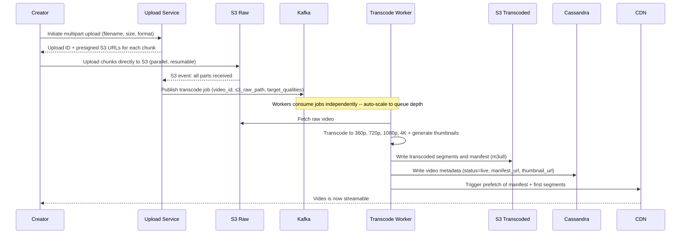
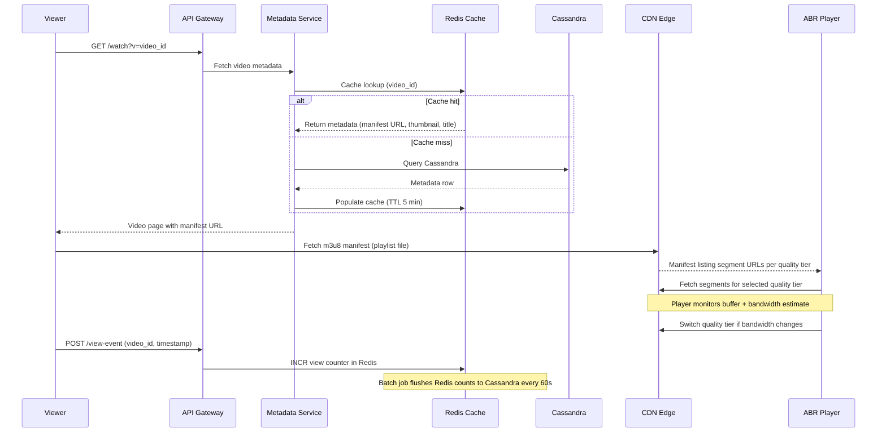
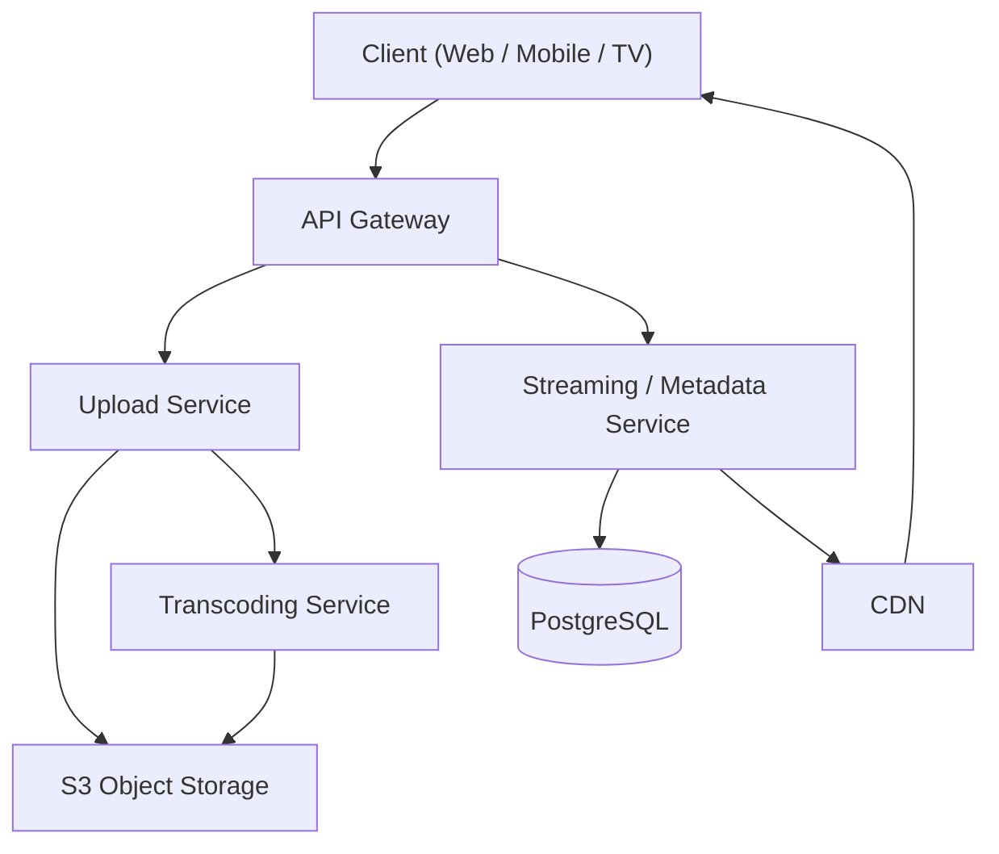
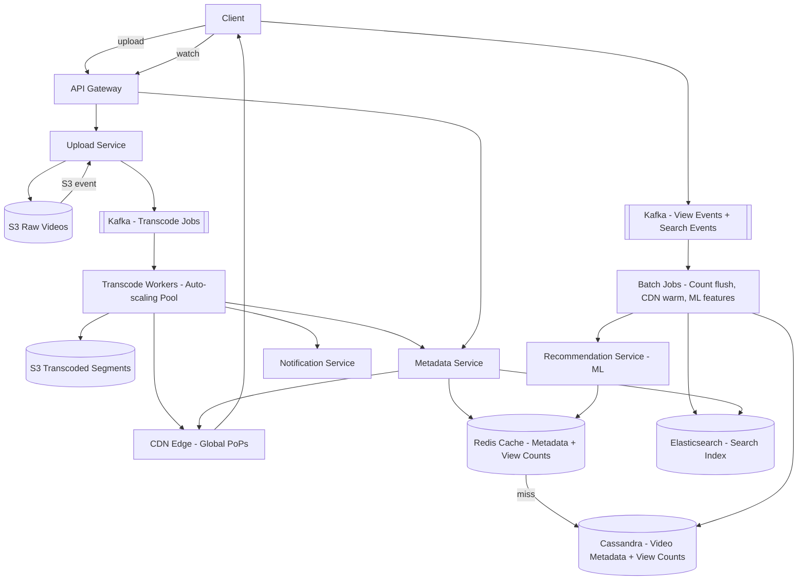
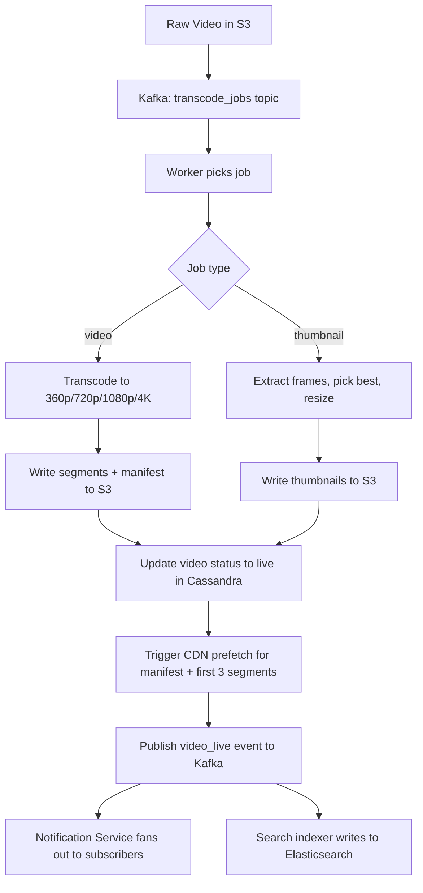

# System Design: YouTube / Video Streaming

---

## 1. Problem + Scope

YouTube is a video platform where creators upload videos and viewers watch them globally at any quality. The core challenge is that **upload throughput and watch latency are opposing forces** — we solve them with separate, purpose-built pipelines.

**In scope:** Video upload, transcoding to multiple resolutions, adaptive bitrate streaming, video search, personalized recommendations, view counts, subscriptions and notifications.

**Out of scope:** Live streaming (different protocol stack — RTMP/WebRTC vs HLS), comments system (CRUD + ranking, separate deep dive), content moderation pipeline.

---

## 2. Assumptions & Scale

**Given numbers:** 500M DAU, 500 hours of video uploaded per minute, 10M concurrent streams.

### Storage Per Day

```
Upload rate:      500 hrs/min x 1440 min/day = 720,000 hrs/day of raw video
Raw video:        720,000 hrs x 3,600 sec/hr x ~5 Mbps avg = ~1.6 PB/day raw
After transcode:  Store 4 quality tiers (360p/720p/1080p/4K) + original
                  Multiplier ~3.5x = ~5.6 PB/day new video added
Compression gain: H.265/AV1 saves ~40-50% vs H.264 -- use modern codecs
Realistic:        ~2-3 PB/day after compression, tiered to cold storage
```

### Bandwidth

```
Concurrent streams:  10M
Avg bitrate mix:     ~3 Mbps (weighted avg across quality tiers)
Peak bandwidth:      10M x 3 Mbps = 30 Tbps
CDN absorbs 95%+ so origin sees: ~1.5 Tbps worst case
```

### Transcoding Queue Depth

```
500 hrs/min uploaded
Avg video length: 7 min -> 500 hrs x 60 / 7 = ~4,300 videos/min = ~72 videos/sec
Each video needs 4 transcode jobs -> 288 jobs/sec at steady state
Peak (viral events): 3-5x -> need ~1,000-1,500 workers at peak
Auto-scaling transcoding workers is mandatory, not optional
```

> These numbers drive three decisions: async transcoding (synchronous is impossible at 288 jobs/sec), CDN-first delivery (30 Tbps requires edge caching), and Redis for view counts (10M concurrent viewers generating events cannot write to DB directly).

---

## 3. Functional Requirements

- Creators can upload videos up to 128GB in any common format (MP4, MOV, AVI, MKV)
- System transcodes every video to 360p, 720p, 1080p, and 4K (where source quality allows)
- Viewers stream video with adaptive bitrate — quality adjusts automatically to network conditions
- Videos are searchable by title, description, and tags within seconds of going live
- Homepage and sidebar show personalized recommendations based on watch history
- View counts are displayed and updated in near-real-time (eventual consistency acceptable)
- Subscribers receive notifications when a channel uploads a new video
- Creators can upload custom thumbnails; system auto-generates thumbnails from video frames

---

## 4. Non-Functional Requirements

| Requirement | Target | Rationale |
|---|---|---|
| Video start latency | < 2 seconds | Studies show >3s abandonment rate spikes sharply |
| Upload processing | < 5 minutes for 720p to go live | Creator experience; viral uploads need speed |
| Availability | 99.9% for streaming (8.7 hrs downtime/year) | Planned maintenance windows acceptable |
| Durability | 99.999999999% (S3 eleven-nines) | Videos must never be lost |
| Search freshness | < 30 seconds after video goes live | Near-real-time indexing via Kafka -> Elasticsearch |
| View count freshness | eventual, ~60 second lag | Strong consistency not worth the write amplification |

### Consistency Model

| Domain | Model | Why |
|---|---|---|
| Video metadata (title, URL, status) | Strong | Viewer must see correct URL or playback breaks |
| View counts, likes | Eventual | Redis buffer + batch flush; 60s lag is imperceptible |
| Recommendations | Eventual | ML pipeline runs in batch; stale recs are acceptable |
| Search index | Near-real-time eventual | Elasticsearch replication lag is fine for search |

---

## 🧠 Mental Model

YouTube is two completely different systems sharing a data store. The **Upload Path** is a reliable, async pipeline — correctness over speed. The **Watch Path** is a fast, read-heavy path — latency over everything. Every design decision maps cleanly to one of these two paths.

```
UPLOAD PATH (Write-heavy, async, correctness-first)
================================================================
Creator --> Chunked Upload --> Raw S3
                                  |
                            Transcoding Queue (Kafka)
                                  |
                     +-----------+-----------+
                     |           |           |
                   360p        720p       1080p/4K
                     |           |           |
                     +-----------+-----------+
                                  |
                         Transcoded S3 Buckets
                                  |
                         CDN Prefetch + DB Metadata
                                  |
                           Video Goes Live


WATCH PATH (Read-heavy, latency-first, CDN-dominated)
================================================================
Viewer --> API Gateway --> Metadata Service --> Redis Cache
                                                     |
                                              Cassandra (miss)
                                                     |
                                          CDN Edge (m3u8 manifest)
                                                     |
                                        ABR Player picks quality tier
                                                     |
                                     CDN serves video segments (ts files)
                                   (95%+ cache hit -- segments are immutable)
```

### ⚡ Core Design Principles

| Path | Optimized For | Mechanism |
|---|---|---|
| Upload Fast Path | Throughput | Chunked multipart upload to S3, no server buffering |
| Upload Reliable Path | Durability | Kafka job queue, idempotent transcoding workers, raw video persisted before any processing |
| Watch Fast Path | Latency | CDN edge serves segments, Redis serves metadata, ABR player never waits for origin |
| Watch Reliable Path | Availability | Multi-region CDN origins, Redis fallback to Cassandra, circuit breaker on origin |

---

## 6. API Design

| Method | Path | Description |
|---|---|---|
| POST | /api/v1/videos/upload/init | Initiate upload, returns {video_id, upload_url} — direct-to-S3 pre-signed URL |
| POST | /api/v1/videos/upload/complete | Confirm upload done, triggers transcoding pipeline |
| GET | /api/v1/videos/{id} | Video metadata + manifest URL (.m3u8 or .mpd) for player |
| GET | /api/v1/videos/{id}/stream | Redirects to CDN manifest — this is what the player fetches |
| GET | /api/v1/search?q=&page= | Full-text search via Elasticsearch |
| GET | /api/v1/feed/recommendations?user_id= | Personalized feed — collaborative filtering results |
| POST | /api/v1/videos/{id}/views | Record a view event (fire-and-forget, eventual consistency) |

> [!NOTE]
> `GET /videos/{id}/stream` is architecturally important — it returns a CDN URL (m3u8 manifest), not video bytes. The app server's job is just to hand off to CDN. Every subsequent segment fetch goes directly to CDN edge — the app server is never in the video data path again.

---

## 7. End-to-End Flow

### Upload Flow



### Watch Flow



---

## 8. High-Level Architecture

### Simple Design (Start Here in the Interview)



### Evolved Design (After Identifying Bottlenecks)



> [!NOTE]
> **Key Insight:** The CDN is not a performance optimization — at 30 Tbps, it is the only way the system physically works. Origin servers cannot absorb that bandwidth.

---

## 9. Data Model

| Entity | Storage | Key Columns | Why This Store |
|---|---|---|---|
| Video metadata | Cassandra | video_id (partition), created_at, title, channel_id, manifest_url, status, view_count | Write-heavy (500 videos/sec going live + 10M view count updates/min). Cassandra multi-master handles this; PostgreSQL primary would saturate at ~50K writes/sec |
| Video segments | S3 | bucket/video_id/quality/segment_N.ts + video_id/master.m3u8 | Immutable objects, unlimited scale, CDN-native integration |
| User accounts | PostgreSQL | user_id, email, channel_id, created_at, subscription_list | Relational data with ACID requirements; user records are low-write, read-mostly |
| Search index | Elasticsearch | video_id, title, description, tags, channel, upload_time | Inverted index for full-text search across billions of videos; Cassandra cannot do text search efficiently |
| View counts (hot) | Redis HyperLogLog / INCR | video_id -> count | 10M concurrent viewers generating events = ~100K writes/sec. Redis INCR is atomic, in-memory, sub-millisecond. Flushed to Cassandra every 60s by batch job |
| Recommendations | Redis + ML Feature Store | user_id -> [video_id list] | Pre-computed recommendations served from Redis (< 1ms). Recomputed every few hours by ML pipeline using watch history from Cassandra |
| Subscriptions | Cassandra | channel_id (partition), subscriber_id | Fan-out query: "give me all subscribers for channel X" — Cassandra partition key makes this a single-node read |
| Upload sessions | Redis | upload_id -> chunk_bitmask, expiry | Ephemeral state, TTL-based cleanup. DB would create write amplification for short-lived upload state |

> [!NOTE]
> **Key Insight:** Cassandra for video metadata is a write-throughput decision, not a schema decision. The moment view count updates hit 100K/sec, SQL primary write ceiling becomes the bottleneck.

---

## 10. Deep Dives

### 7.1 Adaptive Bitrate Streaming (ABR)

Here is the problem we are solving: a viewer on a mobile network experiences bandwidth swings from 500 Kbps to 20 Mbps in a single session. A fixed-quality stream either buffers (if too high) or looks terrible (if too low). ABR lets the player choose quality dynamically without the server knowing.

**How HLS works:**

The transcoding pipeline outputs a **master manifest** (`master.m3u8`) that lists every quality tier and their individual playlists. Each quality playlist lists segment URLs (2-10 second `.ts` files). The player fetches segments, measures how fast each download completed, and picks the next segment from a higher or lower quality tier accordingly.

```
master.m3u8
  ├── 360p/playlist.m3u8   -> segment_0001.ts, segment_0002.ts ...
  ├── 720p/playlist.m3u8   -> segment_0001.ts, segment_0002.ts ...
  └── 1080p/playlist.m3u8  -> segment_0001.ts, segment_0002.ts ...
```

**Segment size trade-off:**

| Segment Size | Startup Latency | Quality Switch Granularity | CDN Object Count |
|---|---|---|---|
| 2-second chunks | Fast (buffer faster) | Fine-grained switching | Very high object count |
| 10-second chunks | Slow (need 2+ chunks to start) | Coarse, quality lags bandwidth changes | Low object count |

YouTube uses ~2 second segments for a balance. Netflix uses 4 seconds.

**Why CDN caching is perfect for video segments:** Segments are immutable — once transcoded, `segment_0001.ts` for video X at 720p never changes. Cache-Control: max-age=31536000 (1 year). CDN hit rate for popular videos approaches 100%. This is the key property that makes video delivery economically feasible.

**HLS vs DASH:**

| Dimension | HLS (Apple) | DASH (ISO standard) |
|---|---|---|
| Codec support | H.264/H.265 only natively | Any codec including VP9, AV1 |
| iOS/Safari support | Native, no polyfill needed | Requires Media Source Extensions |
| Segment format | MPEG-TS or fMP4 | fMP4 only |
| Adoption | YouTube (legacy), Apple | Netflix, YouTube (modern), Disney+ |

YouTube has moved to DASH + fMP4 for better codec flexibility (AV1 saves ~30% bandwidth at same quality vs H.264).

> [!NOTE]
> **Key Insight:** Video segments are immutable content — this is the property that makes CDN caching perfect. A 99% CDN hit rate on segments means the origin only sees 1% of traffic.

---

### 7.2 Transcoding Pipeline

Here is the problem we are solving: 500 hours of video uploaded every minute cannot be transcoded synchronously. A single 1-hour 4K video takes 20-40 minutes to transcode even on powerful hardware. At 72 videos/sec arriving, we need a distributed async pipeline that auto-scales.

**Why raw video goes to S3 before transcoding, not after:**

If the transcoding worker crashes mid-job, we need to re-read the raw input. If raw video was buffered in the Upload Service's memory or local disk, it is gone. S3-first means any worker can pick up a failed job from scratch. **Durability is the input contract.**

**Pipeline flow:**



**Output formats:** H.264 for compatibility (all devices), H.265 for 4K (50% smaller than H.264), VP9 for web (better than H.264, free), AV1 for modern devices (best compression, slow encode — use for popular videos only).

**Worker auto-scaling:** Kafka consumer lag metric drives scaling. If queue depth > 1,000 jobs, spin up more EC2 spot instances. Transcoding is CPU-bound and embarrassingly parallel — perfect for spot instances with checkpointing.

> [!NOTE]
> **Key Insight:** The transcoding queue is a correctness requirement, not a performance optimization. Without it, a worker crash loses the video permanently. Kafka's durable log guarantees the job survives any single worker failure.

> [!IMPORTANT]
> Idempotency is mandatory: if a worker crashes after writing 720p but before writing 1080p, the job must be safe to retry. Workers use video_id + quality as the S3 key — writing the same key twice is idempotent in S3.

---

### 7.3 View Count at Scale

Here is the problem we are solving: 10M concurrent viewers each generate multiple view events per session. At 1 event per viewer per minute, that is 167K writes/sec just for view counts. A naive DB increment per event would immediately saturate any single SQL database.

**Naive solution and why it fails:**

```
UPDATE videos SET view_count = view_count + 1 WHERE video_id = X
```

This is a row-level write lock. PostgreSQL handles ~10K-50K writes/sec on a single row before lock contention kills throughput. At 167K/sec for a single viral video, this is 3-17x over the ceiling before fanout.

**Chosen solution — Redis INCR with batch flush:**

```
On view event:  INCR views:video_id   # atomic, in-memory, sub-millisecond
Every 60s:      Batch job reads Redis counts, writes delta to Cassandra, resets Redis counter
```

Redis `INCR` is atomic and lock-free. A single Redis node handles 1M+ operations/sec. The 60-second lag in Cassandra is imperceptible to users.

**Unique view counting with HyperLogLog:**

Unique views (deduplicated per user) use Redis HyperLogLog: `PFADD unique_views:video_id user_id`. HyperLogLog provides ~0.81% error rate using only 12KB per key regardless of set size. Storing a set of 10M user IDs would cost gigabytes; HyperLogLog costs 12KB. The approximation error is acceptable — view counts are never exact anyway.

**When does eventual consistency become a problem?**

For view counts: it does not. A video showing 1,234,567 vs 1,234,623 views is indistinguishable to users. The only case where strong consistency matters is gating (e.g., "unlock at 1M views") — this uses a separate synchronous counter with a DB transaction, not the main view count path.

> [!NOTE]
> **Key Insight:** View count at scale is a write-throughput problem, not a consistency problem. Eventual consistency is not a compromise — it is the correct model. Nobody needs to see their view reflected in under 60 seconds.

---

## 11. Bottlenecks & Scaling

**CDN cache hit rate is the #1 metric.** If this drops below 90%, origin bandwidth costs explode and latency degrades. Causes of low hit rate: too-short TTLs, poor cache key design, unpredictable access patterns. Fix: set segment TTL to 1 year (immutable), use consistent cache keys, pre-warm CDN for scheduled releases.

**Transcoding worker pool sizing.** At 288 jobs/sec steady state and ~5 min per job per worker, steady-state pool = 288 × 300s = ~86,400 concurrent transcode slots. Each worker processes 1 job at a time. So ~86K worker processes — use auto-scaling groups of spot instances. Monitor Kafka consumer lag as the scaling signal.

**Elasticsearch at billions of videos.** YouTube has ~800M videos. Elasticsearch handles this with index sharding (partition by video_id hash). Search queries fan out to all shards and merge results. Bottleneck: write throughput for new video indexing. Solution: Kafka -> Logstash -> Elasticsearch pipeline, not synchronous API calls. Index refresh interval set to 5-30 seconds (not real-time) to batch writes.

**Recommendation cold start.** New users have no watch history. New videos have no engagement signals. Solution: new users get popularity-based recommendations (trending + category); new videos get boosted into a sampling pool to gather initial signals within 24 hours.

---

## 12. Failure Scenarios

| Failure | Impact | Recovery |
|---|---|---|
| Transcoding worker crashes mid-job | Video stuck in processing state | Kafka message not ACKed, job redelivered to another worker within visibility timeout (30 min). Idempotent S3 writes make retry safe. |
| CDN origin overload | High latency for cache misses | Multiple S3 origins across regions. Circuit breaker on origin: if error rate > 5%, serve stale cached manifest. Origin shield (a single CDN PoP that fronts origin) absorbs miss traffic. |
| Redis view count service down | View count writes lost during outage | View events buffered in Kafka. When Redis recovers, batch replayer catches up from Kafka log. At-most ~5 min lag on view counts. |
| S3 region unavailable | Uploads and streaming fail for that region | S3 cross-region replication keeps transcoded segments in 2+ regions. CDN reroutes to healthy origin automatically. Upload service retries to secondary region. |
| Kafka consumer lag spikes | Transcoding backlog grows, videos delayed | Auto-scale workers immediately on lag > 1000. New uploads get estimated wait time shown in Creator Studio. SLA: 720p live within 5 min for videos under 30 min. |
| Elasticsearch index lag | Search misses new videos | Acceptable per design (eventual consistency on search). If lag > 5 min, alerting triggers. Fallback: metadata service can serve direct title-match queries against Cassandra. |
| Cassandra node failure | Read/write latency spike on affected token range | Cassandra replication factor 3 means data survives 1-node failure with no data loss. Hinted handoff for temporary node outage. |

---

## 13. Trade-offs

### HLS vs DASH

| Dimension | HLS | DASH |
|---|---|---|
| iOS/Safari support | Native | Requires MSE polyfill |
| Codec flexibility | H.264/H.265 | Any codec (VP9, AV1) |
| Industry adoption | Dominant on Apple devices | Dominant on Android/Web |
| DRM integration | FairPlay | Widevine / PlayReady |
| Segment format | MPEG-TS or fMP4 | fMP4 only |

**Chosen:** Both — HLS for Apple devices, DASH for everything else. The manifest URL is device-detected at the API layer. The segments are identical (fMP4) — only the manifest format differs. This avoids double-transcoding.

> [!NOTE]
> **Key Insight:** HLS vs DASH is a client compatibility problem, not a backend architecture problem. Same segments, two manifest formats. The CDN caches both.

---

### Push CDN vs Pull CDN

| Dimension | Push CDN | Pull CDN |
|---|---|---|
| Storage cost | High (pay for all PoPs) | Low (pay only for what is fetched) |
| Cache warmth | Pre-warmed (good for viral) | Cold on first request (bad for live uploads) |
| Operational complexity | High (need to push to all PoPs) | Low (CDN handles it) |
| Best for | Predictable, popular content | Long-tail content |

**Chosen:** Pull CDN as the default with selective push for known viral content (trending videos, scheduled premieres). Long-tail videos (90% of catalog) are rarely watched — paying to push to all PoPs would waste enormous storage cost.

> [!NOTE]
> **Key Insight:** Pull CDN + selective push warming is a cost optimization. Most videos are never watched after 30 days. Pushing all of them to all CDN PoPs would cost more than the bandwidth savings.

---

### Redis vs DB for View Counts

| Dimension | Redis INCR | DB direct write |
|---|---|---|
| Write throughput | 1M+ ops/sec per node | 10-50K/sec per node |
| Consistency | Eventual (60s lag) | Strong |
| Durability | In-memory (RDB/AOF persistence) | ACID |
| Cost at scale | Low (one Redis cluster) | High (sharded DB cluster + write replicas) |

**Chosen:** Redis INCR with 60-second batch flush to Cassandra. Strong consistency for view counts is not a business requirement — no revenue or access control depends on real-time view count accuracy.

> [!NOTE]
> **Key Insight:** Eventual consistency for view counts is not a compromise — it is the correct model. The write load for strong consistency would cost 10x more infrastructure to serve a number that users interpret as "approximately N."

---

### Single Transcode Job vs DAG Pipeline

| Dimension | Single job per video | DAG pipeline (each quality = separate task) |
|---|---|---|
| Parallelism | One worker per video | N workers per video (N = quality count) |
| Failure granularity | Whole video retries on crash | Only failed quality tier retries |
| Complexity | Simple queue consumer | Orchestrator needed (Temporal/Airflow) |
| Time to first quality | All qualities done together | 360p done first, 4K done last |

**Chosen:** DAG pipeline where each quality tier is a separate Kafka message. 360p goes live in ~1 minute, 4K follows in ~10 minutes. This makes viral videos watchable faster. The orchestrator (we use Temporal) handles dependency tracking and retry logic.

> [!NOTE]
> **Key Insight:** "360p first" is a product decision with architectural consequences. It requires a DAG pipeline instead of a monolithic transcode job — complexity is justified by creator experience.

---

### PostgreSQL vs Cassandra for Video Metadata

| Dimension | PostgreSQL | Cassandra |
|---|---|---|
| Write throughput | ~50K/sec (single primary) | 500K+/sec (multi-master) |
| Read patterns | Flexible (JOINs, secondary indexes) | Partition key only (no JOINs) |
| Consistency | Strong (ACID) | Tunable (eventual by default) |
| Operational complexity | Low | Medium-high |
| Best for | Low-write, complex queries | High-write, known access patterns |

**Chosen:** Cassandra for video metadata. The access pattern is always by video_id (known partition key). View count updates at 100K+/sec make SQL primary a hard bottleneck within 12 months of scale. The trade-off accepted: no ad-hoc queries, no JOINs — analytics runs on a separate Spark/BigQuery pipeline that reads from Cassandra backups.

> [!NOTE]
> **Key Insight:** Cassandra is chosen because of view count write load, not because of video metadata schema complexity. The metadata schema is simple enough for PostgreSQL — the write amplification from view events is what breaks SQL.

---

## 14. Interview Summary

### Key Decisions

| Decision | Problem It Solves | Trade-off Accepted |
|---|---|---|
| Async transcoding via Kafka | 288 transcode jobs/sec is impossible synchronously; sync would mean 5+ hr wait for creators | Eventual availability — video not live instantly on upload |
| CDN for all segment delivery | 30 Tbps cannot physically hit origin servers | CDN cost, cache invalidation complexity for rare re-encodes |
| Redis INCR for view counts | 100K+ writes/sec exceeds DB write ceiling for a single viral video | 60-second eventual consistency on view counts |
| Cassandra for video metadata | View count updates + 500 videos/sec going live overwhelm SQL primary | No JOINs, no ad-hoc queries — access patterns must be known upfront |
| DAG transcode pipeline | "360p first" improves creator experience for viral uploads | Orchestration complexity (Temporal) vs simple queue consumer |
| HLS + DASH dual manifest | No single format covers all devices (Apple requires HLS) | Two manifest generation paths; segment storage is shared |

### Fast Path vs Reliable Path

```
WATCH FAST PATH (target: < 2s video start)
Viewer --> CDN Edge --> m3u8 manifest (cached) --> segments (cached, immutable)
No origin contact needed if CDN hit rate is high. Redis serves metadata in < 1ms.

WATCH RELIABLE PATH (CDN miss or origin needed)
Viewer --> API Gateway --> Metadata Service --> Redis miss --> Cassandra read
           --> CDN miss --> S3 origin --> segments served from origin with fallback

UPLOAD FAST PATH (target: upload bytes as fast as possible)
Creator --> presigned S3 URL --> direct multipart to S3 (no service in the path)

UPLOAD RELIABLE PATH (correctness guarantee)
S3 raw stored first --> Kafka job queued (durable) --> worker fetches raw from S3
--> idempotent transcode --> S3 transcoded --> DB update --> CDN prefetch
Any step can fail and be retried safely. Raw video is never lost.
```

### Key Insights Checklist

These are the lines an interviewer wants to hear out loud:

1. "Upload and watch are two completely separate systems — upload is async and correctness-first, watch is synchronous and latency-first. I never mix them."
2. "At 30 Tbps of streaming bandwidth, the CDN is not a caching layer — it is the primary delivery infrastructure. Origin servers are a fallback for cache misses only."
3. "Raw video goes to S3 before transcoding begins, not after. This is because the transcoding job must be idempotent — any worker must be able to retry from scratch without losing the original."
4. "View count eventual consistency is not a compromise. It is the correct model. No business decision depends on real-time view accuracy, and strong consistency would require 10x the write infrastructure."
5. "Cassandra for video metadata is a write-throughput decision driven by view count updates, not by metadata schema complexity. If we only had metadata writes, PostgreSQL would be fine."
6. "HyperLogLog for unique views uses 12KB regardless of audience size. A set of 10M user IDs would use gigabytes. The 0.81% error rate is acceptable — view counts are approximate by design."
