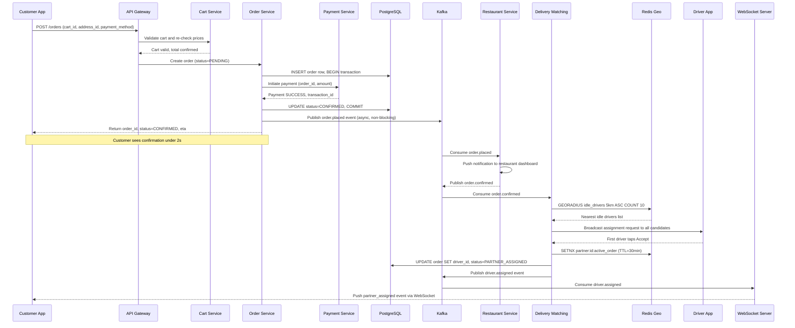
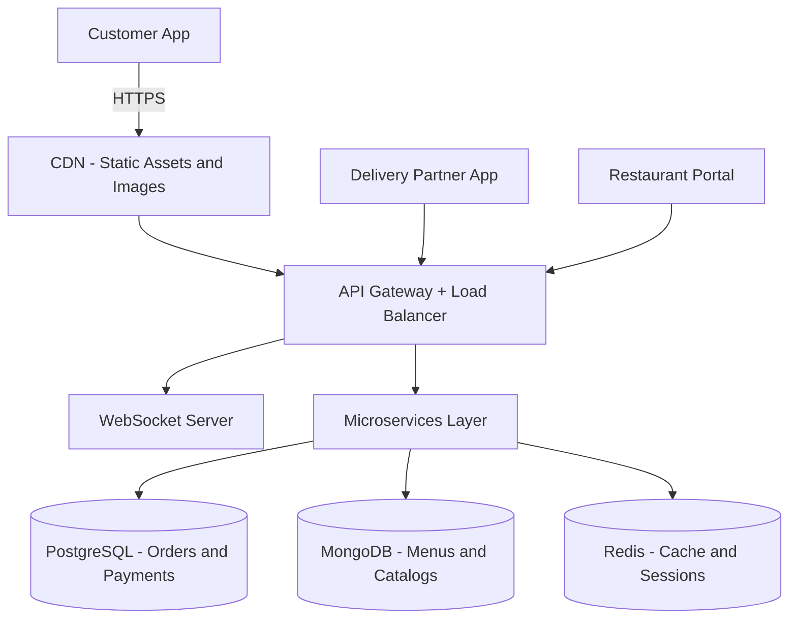
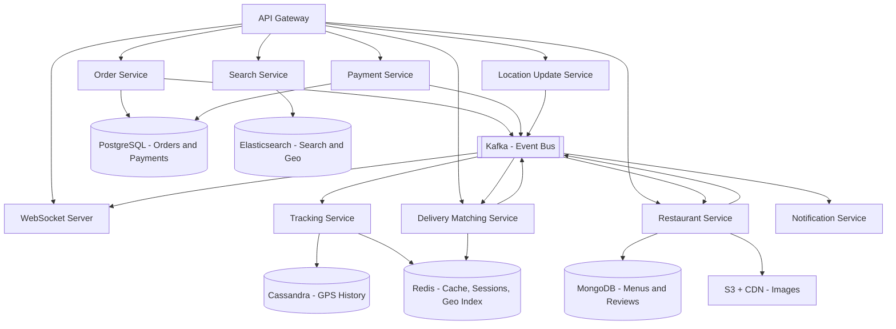
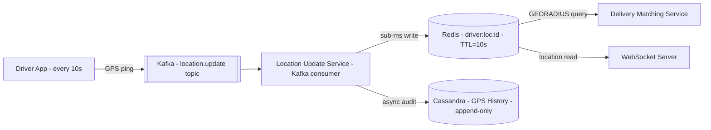
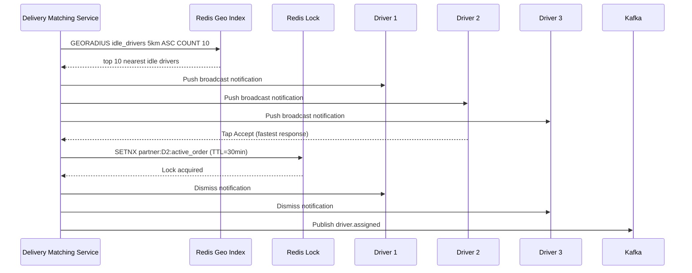
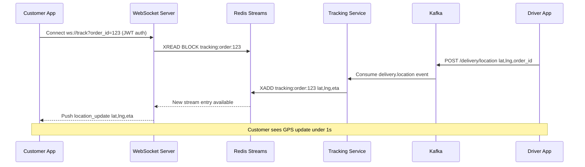

# System Design: Zomato / Food Delivery App

## 🧠 Mental Model

Every food delivery interview is really three sub-systems layered on top of each other. The entire platform exists to coordinate three actors — each with a distinct flow and a distinct bottleneck. The key insight is that these three flows are **decoupled by Kafka**: Customer flow writes to `order.placed` → Restaurant flow consumes and confirms → `order.confirmed` fires → Delivery flow picks it up. No service ever calls another service directly. That is the architecture in one sentence.

```
┌───────────────────────────────────────────────────────────────────┐
│  ACTOR            FLOW                         KEY CHALLENGE       │
├───────────────────────────────────────────────────────────────────┤
│  Customer         Browse → Cart → Order         Geo-search scale   │
│  Restaurant       Accept → Prepare → Ready      Event-driven push  │
│  Delivery Agent   Assign → Pickup → Deliver     100K GPS writes/s  │
└───────────────────────────────────────────────────────────────────┘

  Customer places order
          │
          ▼
  [Order Service] ──kafka: order.placed──> [Restaurant Service]
                                                   │
                                          kafka: order.confirmed
                                                   │
                                                   ▼
                                         [Delivery Service]
                                          assigns via Redis Geo
                                                   │
                                                   ▼
                                         [Tracking Service]
                                          GPS → Kafka → Redis Streams
                                                   │
                                                   ▼
                                         [WebSocket Server] → Customer App
```

> [!TIP]
> **Interview tip:** Name all three actors upfront and ask the interviewer which flow they want to go deep on. Interviewers who want breadth will say "all three"; interviewers who want depth will pick one. Either way, naming the actors first shows structured thinking before you touch a diagram.

### ⚡ Core Design Principles

| Path | Optimized For | Mechanism |
|---|---|---|
| Fast Path — Order Placement | Latency, confirm in under 2s | Cart → Order → Payment sync. Kafka publish is async and non-blocking |
| Reliable Path — Order Safety | Durability, zero orders lost after payment | PostgreSQL ACID commit + idempotency keys + Kafka outbox replay |
| Fast Path — Tracking | Freshness, GPS update visible in under 1s | Driver → Kafka → Redis Streams → WebSocket push |
| Reliable Path — GPS Audit | Audit trail, dispute resolution | Cassandra append-only GPS history written async |

---

## 0. Assumptions & Scale

**Scale baseline:**
- 50M registered users, 10M daily active users
- 500K restaurants, 1M active delivery partners
- 5M orders/day → ~60 orders/sec average, **300 orders/sec peak**
- 50K concurrent order tracking sessions at lunch/dinner peak

**GPS write load — the single hardest write path:**
```
1,000,000 active drivers × 1 ping every 10s = 100,000 writes/sec peak
PostgreSQL ceiling ~50–100K writes/sec with contention → cannot absorb this directly
Kafka write buffer required → consumers fan out to Redis (live) and Cassandra (audit)
```

**Storage estimates:**
- Orders: ~1KB × 5M/day = 5GB/day → ~1.8TB/year (PostgreSQL, 3-year retention)
- GPS history: 100K writes/sec × ~10 bytes × 86400s = ~86GB/day → ~2.5TB/month (Cassandra, 30-day retention)
- Menu images: ~500KB × 500K restaurants = 250GB (S3 + CDN, rarely changes)
- Total active hot storage: ~10–15TB/year

**Redis memory budget:**
```
Sessions:              10M × 1KB   = 10GB
Carts (active):       500K × 2KB   = 1GB
Restaurant list cache: 50K × 5KB   = 250MB
Driver locations:     100K × 500B  = 50MB
Geo index:            100K drivers  = ~100MB
Idempotency keys:      5M × 100B   = 500MB
Total: ~12GB → use 32GB instance with LRU eviction on cache keys
```

**Kafka throughput:** Peak ~100K events/sec across GPS and order topics. 5 brokers, replication factor 3, 10 partitions per topic.

> These numbers drive every storage and infrastructure decision below. The GPS write load is why we need Kafka + Cassandra. The 300 orders/sec peak is why PostgreSQL is perfectly fine for orders.

---

## 1. Problem + Scope

Design a food delivery platform that connects customers with restaurants and delivery partners, supporting restaurant discovery, order placement, payment, real-time GPS tracking, and delivery. The system must handle 300 orders/sec peak, 100K GPS writes/sec from drivers, and guarantee that no order is lost after payment succeeds.

**In scope:** Restaurant browse and search, cart management, order placement + payment, delivery partner assignment, real-time GPS tracking, order state notifications.

**Out of scope:** Restaurant menu management portal, financial settlement/payouts, surge pricing, fraud detection, machine learning recommendations.

---

## 2. Functional Requirements

- **Restaurant Discovery:** Browse restaurants filtered by location, cuisine, rating, delivery time, and dietary preference
- **Search:** Full-text + geo search across restaurant names and dish names; autocomplete suggestions
- **Cart Management:** Add/remove items, apply promo codes, re-validate prices at checkout
- **Order Placement:** Checkout with address selection and payment processing; order confirmation under 2 seconds
- **Delivery Assignment:** Find and assign the nearest idle delivery partner; handle rejection and timeout fallbacks
- **Real-time Tracking:** Live GPS updates from delivery partner visible to customer in under 1 second
- **Order State Notifications:** Push/SMS for every state transition (confirmed, preparing, picked up, delivered)
- **Order History:** Customer can view all past orders and re-order

---

## 3. Non-Functional Requirements

| Requirement | Target |
|---|---|
| Restaurant listing latency | Under 500ms |
| Search results latency | Under 300ms |
| Order placement end-to-end | Under 2s |
| GPS tracking update latency | Under 1s customer-visible |
| Availability | 99.9% (8.7 hours downtime/year) |
| Order durability | Zero loss after payment success |
| GPS write throughput | 100K writes/sec sustained |
| Peak order throughput | 300 orders/sec |

### Consistency Model

Different parts of the system require different consistency guarantees based on business risk and failure cost.

| Domain | Consistency | Why |
|---|---|---|
| Orders | Strong (ACID) | Cannot lose or duplicate — financial record |
| Payments | Strong | Financial correctness, regulatory requirement |
| Inventory / item availability | Strong per restaurant | Prevent selling unavailable items |
| Delivery assignment | Strong | One rider per order — Redis SETNX lock |
| GPS tracking updates | Eventual | Jitter acceptable; 1s staleness imperceptible |
| Restaurant listings | Eventual | Slight staleness fine for browse |
| Reviews and ratings | Eventual | Not business-critical |
| Search results | Eventual | Cached and indexed |

> [!IMPORTANT]
> The system is eventually consistent everywhere except money and orders. PostgreSQL ACID transactions for order + payment, Redis distributed locks for delivery assignment, Kafka async propagation everywhere else.

---

## 4. End-to-End Flow

The happy path for order placement and delivery assignment — the core interview flow.



> [!NOTE]
> **Key Insight:** The Kafka publish after the PostgreSQL commit is fire-and-forget. The order is durably saved before we even attempt to notify the restaurant. If Kafka is temporarily unavailable, the order is safe — events replay via outbox on recovery.

---

## 5. High-Level Architecture

### Simple Design



### Evolved Design with Kafka, Cassandra, and Elasticsearch



> [!NOTE]
> **Key Insight:** No service calls another service directly. All cross-service communication flows through Kafka. A Notification Service outage cannot block order placement. A Tracking Service slowdown cannot delay the delivery assignment. Each service fails in isolation.

---

## 6. Data Model

| Entity | Storage | Key Columns | Why This Store |
|---|---|---|---|
| Orders | PostgreSQL | order_id, user_id, restaurant_id, driver_id, status, total_amount, created_at | ACID transactions — order + payment must commit atomically |
| Order Items | PostgreSQL | order_item_id, order_id, item_id, price_snapshot, quantity | Price snapshotted at checkout — retroactive menu changes cannot corrupt totals |
| Payments | PostgreSQL | payment_id, order_id, gateway_txn_id, status, gateway_response (JSONB) | ACID, full gateway response stored for dispute resolution |
| Restaurants | MongoDB | restaurant_id, name, location (GeoJSON), cuisines, operating_hours, rating | Deeply nested menu documents, high read/write ratio, geospatial index |
| Menus | MongoDB | restaurant_id, categories (nested), items, customizations | Embedded document avoids joins on the hottest read query |
| GPS History | Cassandra | partition: driver_id, cluster: timestamp DESC, lat, lng | 100K writes/sec time-series — relational DBs cannot absorb this write volume |
| Order Tracking Events | Cassandra | partition: order_id, cluster: event_time DESC, status, lat, lng | Append-only audit trail, query by order_id only |
| Driver Live Location | Redis | driver:loc:{id} → lat,lng (TTL=10s) | Sub-millisecond reads for proximity matching; TTL provides implicit liveness |
| Delivery Geo Index | Redis | GEOADD delivery:partners {lng} {lat} {partner_id} | GEORADIUS query for nearest idle drivers — native Redis Geo command |
| Restaurant List Cache | Redis | restaurant:list:{lat_round}:{lng_round}:{filter_hash} (TTL=5min) | Collapse nearby users onto same cache key; reduces Elasticsearch load |
| Cart | Redis | cart:{user_id} (TTL=24h) | Ephemeral session data, fast key-value access, natural expiry |
| Idempotency Keys | Redis | webhook:{webhook_id} (TTL=24h) | Payment webhook dedup — prevents double-processing on retry |
| Search Index | Elasticsearch | restaurant doc with nested dishes, geo_point location, cuisines keyword | Full-text + geo-filtered search under 300ms; nested dishes match dish-level queries |

> [!NOTE]
> **Key Insight:** Each store is matched to its workload. PostgreSQL for 300 orders/sec with strict ACID. Cassandra for 100K GPS writes/sec as append-only time-series. Redis for sub-millisecond ephemeral reads. Elasticsearch for sub-300ms full-text + geo queries. There is no single best database.

---

## 7. Deep Dives

### 7.1 Driver Location Write Architecture

**Here's the problem we're solving:** With 1M active delivery partners each pinging GPS every 10 seconds, the system receives **100,000 writes/sec** at peak. This is the single hardest scaling challenge in the entire system. If you route these writes directly to any relational or document database, you will hit the write ceiling and cascade into latency spikes across the entire platform.

**Naive solution and why it fails:** Write GPS pings directly to PostgreSQL or MongoDB. PostgreSQL handles ~50K writes/sec under contention; at 100K writes/sec it saturates the WAL and response time blows out. MongoDB fares slightly better but still cannot absorb bursts reliably without horizontal sharding complexity.

**Chosen solution:**



Kafka absorbs all 100K writes/sec as a durable write buffer. The Location Update Service is a Kafka consumer that writes to two destinations: Redis (live, sub-millisecond, with TTL) and Cassandra (audit trail, async, append-only). The Delivery Matching Service never touches Cassandra — it only queries Redis.

**The TTL trick:** `driver:loc:{id}` has a TTL equal to the update interval (10 seconds). If a driver stops sending pings (goes offline, crashes, loses signal), their Redis key expires automatically. The Delivery Matching Service can no longer see them — zero stale assignments, zero manual cleanup. Liveness detection is a free side-effect of TTL design.

**Trade-off accepted:** Redis is not durable. If Redis restarts, all live driver locations are lost. This is acceptable — drivers re-register their location on the next ping cycle (within 10 seconds), and Cassandra holds the full history for audit. Ephemeral data belongs in ephemeral storage.

> [!NOTE]
> **Key Insight:** Redis is the live read path. Cassandra is the audit path. These are separate concerns — never conflate them. The Cassandra write is async and non-blocking; it never slows the assignment decision.

---

### 7.2 Delivery Assignment Broadcast

**Here's the problem we're solving:** Once a restaurant confirms an order, we must find and assign a delivery partner. The naive approach — pick the single closest driver and send only them a notification — has a critical flaw: that driver might reject, be slow to respond, or go offline in the window between selection and acceptance. Every rejection adds seconds of delay.

**Naive solution and why it fails:** Serial unicast — try driver 1, wait for timeout, try driver 2. At a 5-second timeout per rejection, a 3-rejection chain adds 15 seconds before assignment. Customer ETA prediction breaks. Restaurant holding hot food gets frustrated.

**Chosen solution — broadcast + first-accept wins:**



Broadcasting to all idle drivers in radius and taking the first acceptance minimizes assignment latency. The Redis `SETNX` lock (set-if-not-exists) prevents a driver from double-accepting two simultaneous orders. The lock TTL of 30 minutes ensures a driver crash does not permanently block them from future assignments.

**Fallback:** If no driver accepts within 30 seconds → order moves to `WAITING_FOR_PARTNER`. Retry every 30 seconds. Expand radius from 5km to 10km after 2 minutes. Page on-call operations team if no assignment after 10 minutes.

**Trade-off accepted:** Broadcasting to 10 drivers simultaneously sends 10 notifications instead of 1. At 300 orders/sec peak, that is 3,000 push notifications/sec — well within Firebase/APNs capacity. The extra notification cost is worth the reduction in assignment latency.

> [!NOTE]
> **Key Insight:** The `SETNX` lock is a correctness requirement, not a performance optimization. Without it, two simultaneous order broadcasts could race and both assign the same driver. The lock makes assignment atomic.

---

### 7.3 Real-Time Tracking via WebSocket

**Here's the problem we're solving:** A customer watching live GPS needs sub-second updates for 50K concurrent tracking sessions. The naive approach — customers poll `GET /orders/{id}/track` every 3 seconds — generates 50K / 3 = **~17K HTTP requests/sec** of mostly empty responses. At 1M tracking sessions during peak, that is 330K requests/sec of pure waste.

**Naive solution and why it fails:** HTTP long-polling at 3-second intervals. At 1M sessions × 1 poll/3s = 333K requests/sec. Most return no new data (GPS updates every 10s). Each request re-authenticates, re-routes through the LB, and re-queries the data store. This is pure CPU and network waste at no benefit.

**Chosen solution — WebSocket + Redis Streams fan-out:**



WebSocket eliminates polling. The server pushes only when there is a new GPS point — no empty responses. Redis Streams act as a fan-out buffer: multiple WebSocket server instances can subscribe to the same `tracking:order:{id}` stream, so sticky sessions at the LB are needed for connection management but not for data routing.

**WebSocket scaling:** WebSocket connections are stateful. The load balancer uses consistent hashing on `order_id` to route reconnects to the same WebSocket server instance. Redis Streams hold entries with a MAXLEN of ~100 entries per order, covering the last ~16 minutes of tracking even if a client disconnects and reconnects.

**Fallback on disconnect:** Client falls back to REST polling `GET /orders/{id}/track` every 10 seconds. No tracking data is lost — Redis Streams persist entries across reconnects.

**Trade-off accepted:** Stateful WebSocket connections require sticky sessions at the LB. This complicates rolling deployments (must drain connections gracefully). The operational complexity is accepted because eliminating polling at scale is a math argument — the bandwidth and CPU savings dominate.

> [!NOTE]
> **Key Insight:** WebSocket vs HTTP polling for tracking is a math problem. 1M sessions × 1 poll/5s = 200K HTTP requests/sec of mostly empty responses. WebSocket reduces server-side event generation to the actual GPS update rate — ~100K events/sec across all active deliveries.

---

## 8. Bottlenecks & Scaling

**What breaks first as scale grows 10x:**

| Bottleneck | Breaks At | Strategy |
|---|---|---|
| GPS write ingestion | 1M+ drivers | Kafka partitions scaled horizontally; Location Service consumer group scaled by topic partition count |
| Order write throughput | 3,000 orders/sec | PostgreSQL read replicas for all reads; primary for writes only; partition orders table by created_at month |
| Restaurant listing cache | Cache miss storm at startup | Warm cache proactively on deploy; use Redis Cluster (hash slots) for horizontal memory scaling |
| WebSocket connection limit | ~100K connections per server | Horizontal scale WebSocket servers; consistent hash LB on order_id for reconnect affinity |
| Elasticsearch geo queries | High QPS from search | 5 primary shards + 2 replicas; query cache on filter clause; Redis cache layer in front |
| Delivery assignment broadcast | Many simultaneous orders | Kafka consumer group for Match Service scaled independently; Redis Cluster for geo index |

**Horizontal scaling strategy:**
- Order Service: stateless, scale horizontally behind LB
- Location Update Service: scale by Kafka partition count (add partitions, add consumers)
- WebSocket Server: scale by adding nodes; consistent-hash LB routes reconnects correctly
- Delivery Matching: stateless Kafka consumer group, scale by partition count
- PostgreSQL: primary + 2 read replicas; use PgBouncer connection pooling; partition by `created_at`
- Cassandra: linear scale — add nodes to cluster, data rebalances automatically

**Cache strategy:**
- Restaurant listings: Redis cache, 5-minute TTL, coordinate rounding to 4 decimal places (~11m) collapses nearby users onto same key
- Menus: Redis cache, 15-minute TTL, invalidated on restaurant menu update via Kafka `cache.invalidate` event
- Static assets (images): CloudFront CDN, 7-day TTL, invalidated on S3 object update
- Search results: Redis cache, 3-minute TTL, key includes search query hash

**Data the system never caches:**
- Order status and order details (always PostgreSQL)
- Payment status (always PostgreSQL)
- Item availability at checkout (always MongoDB primary)
- Delivery partner assignment (always Redis lock, never application cache)

---

## 9. Failure Scenarios

| Failure | Impact | Recovery |
|---|---|---|
| Payment succeeds, Kafka temporarily down | Order committed to PostgreSQL, downstream services not yet notified | Outbox pattern — background job scans `orders` table for CONFIRMED orders with no Kafka ack; replays events on recovery. Money never lost. |
| Restaurant rejects or times out (15 min) | Customer order stranded in CONFIRMED state | Order Service auto-cancels after timeout, initiates full refund via Payment Service, notifies customer via push/SMS |
| Delivery driver rejects assignment | Order returns to WAITING_FOR_PARTNER | Redis lock released, new GEORADIUS broadcast triggered immediately; radius expanded after 2 minutes |
| No drivers available in radius | No assignment possible | Retry every 30s, expand to 10km after 2 min, 15km after 5 min; customer shown updated ETA and transparent status message |
| WebSocket server crashes | Active tracking sessions disconnected | Clients detect disconnect, fall back to REST polling every 10s. Redis Streams persist location history — no data lost on reconnect |
| Redis failure | Driver geo index unavailable, cache miss for listings | Assignment falls back to PostgreSQL slow-path geo query (acceptable, low volume). Listings served stale from CDN. Order safety unaffected — PostgreSQL is source of truth |
| Elasticsearch down | Search returns empty results | Degraded mode: MongoDB geo query fallback for location-based browse. Slower (500ms vs 300ms) but functional. |
| PostgreSQL primary fails | Order writes blocked | Automated failover to replica (RDS Multi-AZ, ~30s). In-flight order writes may fail — client retries with idempotency key prevent duplicate orders |
| Cassandra node failure | GPS write throughput reduced | Cassandra consistency level QUORUM with replication factor 3 tolerates one node failure. Remaining nodes absorb writes. Auto-repair on recovery. |
| Payment gateway timeout | Payment status unknown | Order stays PENDING. Background reconciliation job polls gateway for status after 5 minutes. If confirmed → CONFIRMED. If failed → CANCELLED + customer notified. |

---

## 10. Trade-offs

### WebSocket vs HTTP Polling for Tracking

| Dimension | WebSocket | HTTP Polling |
|---|---|---|
| Latency | Under 1s — server pushes on GPS update | 3–10s — bounded by poll interval |
| Server load at 1M sessions | Low — push only when GPS changes | ~333K requests/sec of mostly empty responses |
| Infrastructure complexity | Stateful — requires sticky sessions at LB | Stateless — trivial horizontal scale |
| Fallback requirement | Need polling fallback for disconnects | Simple, no fallback needed |
| Connection overhead | Persistent TCP connection maintained | Per-request handshake and auth overhead |

**Chosen:** WebSocket with polling fallback. At 1M concurrent tracking sessions polling at 3-second intervals, we serve 333K HTTP requests/sec of mostly no-new-data responses. WebSocket eliminates this entirely — the server only sends bytes when the GPS position changes.

> [!NOTE]
> **Key Insight:** WebSocket vs HTTP for tracking is a math problem. 1M sessions at 1 poll/3s = 333K empty requests/sec. WebSocket reduces server event generation to the actual GPS update rate — a 10x reduction in pointless network traffic.

---

### PostgreSQL vs Cassandra for Orders

| Dimension | PostgreSQL | Cassandra |
|---|---|---|
| ACID transactions | Yes — mandatory for order + payment atomicity | No native multi-row transactions |
| Financial correctness | Guaranteed | Requires application-level compensating transactions |
| Write throughput | ~50–100K writes/sec | Millions writes/sec, linear horizontal scale |
| Query flexibility | Full SQL, arbitrary JOINs, reporting | Limited to partition key access patterns |
| Operational maturity | Decades of tooling, RDS managed service | Higher operational complexity |

**Chosen:** PostgreSQL for orders and payments. The trade-off accepted is lower raw write throughput — which is fine because 300 orders/sec peak is nowhere near PostgreSQL's ceiling. Financial correctness is non-negotiable and cannot be retrofitted onto an eventually consistent store.

> [!NOTE]
> **Key Insight:** Cassandra is chosen for GPS history (100K writes/sec time-series, no transactions needed) and PostgreSQL for orders (300 writes/sec, strict ACID required). Each database is matched to its workload — the question is never "which is better?" but "which fits this workload?"

---

### Kafka vs Direct Service Calls

| Dimension | Kafka Event Bus | Direct REST/gRPC Calls |
|---|---|---|
| Decoupling | Full — producer never waits for consumer | Tight — slow downstream service blocks upstream |
| Fault tolerance | Events persist on crash, replayed on consumer recovery | Message lost if downstream crashes during call |
| Throughput | Handles 100K events/sec with buffering | Each call adds round-trip latency per downstream service |
| Cascading failure risk | None — services fail in isolation | One slow service can cascade across the call chain |
| Operational complexity | Kafka cluster to manage, consumer lag to monitor | Simple — standard HTTP/gRPC |

**Chosen:** Kafka for all cross-service communication. The trade-off is operational complexity (broker management, consumer lag alerting, schema registry). This is accepted because at 100K events/sec, direct calls would create cascading failure chains — one slow Notification Service would block every order placement.

> [!NOTE]
> **Key Insight:** The Kafka event bus is a correctness requirement, not just a performance optimization. If Order Service called Restaurant Service directly, a restaurant service timeout would appear as order placement latency. Kafka makes order placement constant-time regardless of how many downstream consumers exist.

---

### At-Least-Once vs Exactly-Once Delivery

| Dimension | At-Least-Once + Dedup | Exactly-Once (Kafka 2PC) |
|---|---|---|
| Delivery guarantee | Events replayed on consumer crash; dedup key prevents double-processing | Events processed exactly once end-to-end |
| Latency overhead | None — standard Kafka consumer | Adds 2-phase commit round trip, significant latency cost |
| Implementation complexity | Idempotency key per consumer | Kafka transactional API, all consumers must participate |
| Failure modes | Duplicate delivery possible before dedup check | No duplicates, but much harder to reason about partial failures |

**Chosen:** At-least-once delivery with idempotency keys. Payment webhooks use `webhook:{id}` in Redis (24h TTL) as a dedup key. Order creation uses `SETNX` distributed lock per user+cart. The result is effectively-once behavior at standard Kafka latency without 2PC overhead.

> [!NOTE]
> **Key Insight:** Exactly-once in distributed systems is expensive. At-least-once + idempotent consumers gives you the same correctness guarantee at a fraction of the cost. The dedup key is the correctness mechanism, not the delivery guarantee.

---

## Interview Summary

### Key Decisions Table

| Decision | Problem It Solves | Trade-off Accepted |
|---|---|---|
| Kafka between all services | Downstream slow services cannot block order placement; events survive crashes | Operational complexity, ~10ms publish latency |
| PostgreSQL for orders and payments | ACID atomicity: payment success and order creation must commit together | Lower raw write throughput — acceptable at 300 orders/sec peak |
| Cassandra for GPS history | 100K writes/sec time-series; relational DBs cannot absorb this volume | No transactions; access patterns must be pre-designed by partition key |
| WebSocket for tracking | 1M sessions polling = 333K empty HTTP requests/sec eliminated | Stateful connections require sticky sessions at LB |
| Redis Geo with TTL for driver location | Sub-millisecond proximity queries; TTL equals update interval for implicit liveness | Not durable — driver location is ephemeral by design, acceptable |
| Broadcast + first-accept for assignment | Serial unicast adds multi-second delays per rejection | Slightly higher push notification volume — well within capacity |

### Fast Path vs Reliable Path

```
FAST PATH — order placement, optimized for latency under 2s:
  Customer
    → Cart Validation (Redis cart read)
    → Order Created (PostgreSQL commit)
    → Payment Processed (gateway call)
    → CONFIRMED returned to client
  Kafka publish is fire-and-forget after the DB commit — never blocks the response

RELIABLE PATH — order safety, optimized for durability:
  PostgreSQL commit = source of truth, order exists regardless of downstream state
  Kafka event = async signal to restaurant, delivery, notification services
  If Kafka is down: order is safe in DB, events replayed via outbox on recovery
  If Payment Gateway is slow: order stays PENDING, auto-cancels after 15 minutes
  If restaurant times out: auto-cancel with full refund

TRACKING FAST PATH — GPS update visible to customer under 1s:
  Driver GPS ping
    → Kafka location.update topic (durable buffer)
    → Location Update Service
    → Redis Streams XADD (push notification to WebSocket server)
    → WebSocket push to customer

TRACKING AUDIT PATH — GPS history for dispute resolution:
  Driver GPS ping → Kafka → Cassandra (async, append-only, 30-day retention)
```

### Key Insights Checklist

These are the lines an interviewer wants to hear out loud:

1. "Three actors, three flows, three bottlenecks — geo-search scale, event-driven restaurant notification, and 100K GPS writes per second. Kafka decouples all three so each flow fails in isolation."
2. "100K GPS writes per second is the single hardest challenge. No relational database absorbs this directly. Kafka buffers it; Redis holds the live state with TTL equal to the update interval for free liveness detection — no polling, no manual cleanup."
3. "WebSocket versus polling is a math problem. At 1M tracking sessions polling every 3 seconds, we serve 333K empty HTTP responses per second. WebSocket eliminates this entirely — the server only sends bytes when the GPS position changes."
4. "PostgreSQL for orders is a correctness choice, not a performance choice. 300 orders per second is trivial for PostgreSQL. ACID transactions mean I never write compensating logic for a partial order-plus-payment failure. That code never exists."
5. "The Kafka event bus is a correctness requirement. If Order Service calls Restaurant Service directly, a 500ms restaurant timeout becomes a 500ms order placement latency spike. Kafka makes order placement constant-time regardless of how many downstream consumers exist."
6. "I accept at-least-once delivery everywhere and add idempotency keys at the consumer. This gives effectively-once behavior without Kafka 2PC overhead. The dedup key is the correctness mechanism — not the delivery guarantee."
