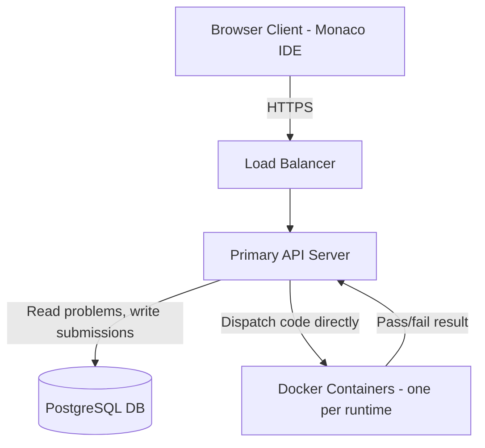
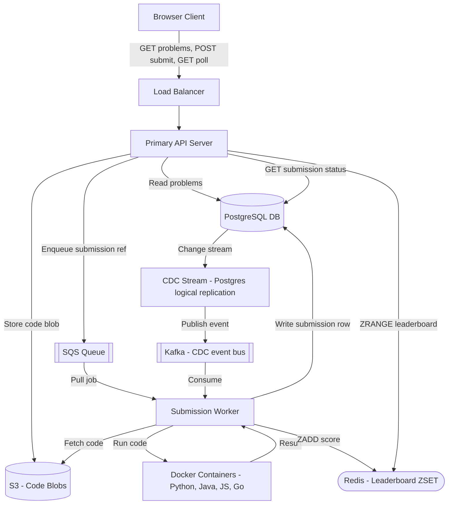
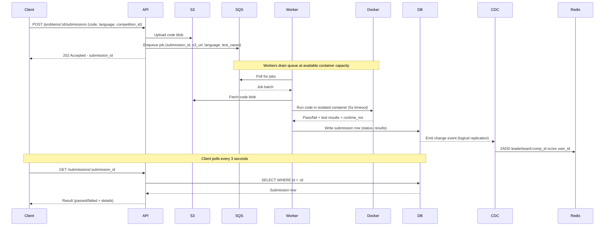
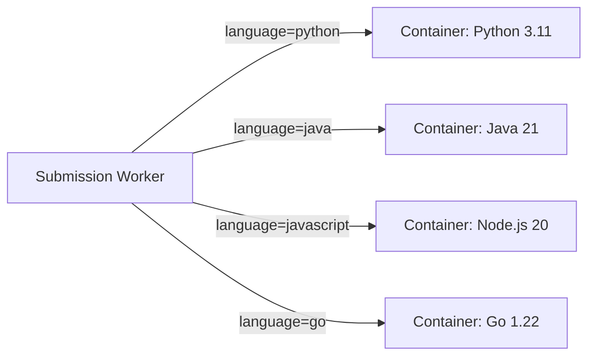
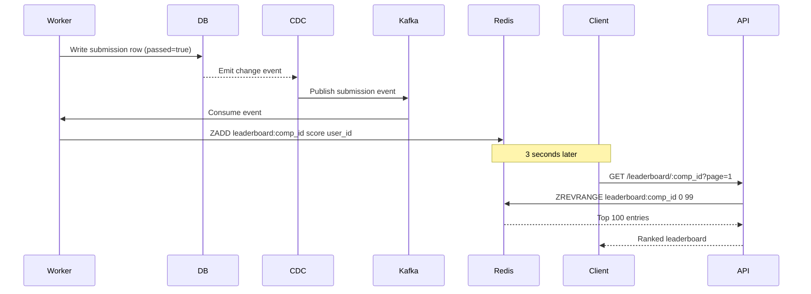

# System Design: LeetCode / Online Judge

> **Frontend / Backend Split: 90% Backend · 10% Frontend**
> Backend dominates this design — safe untrusted code execution and a live 33K-QPS leaderboard are the hard problems here. The frontend still matters: an embedded Monaco IDE, optimistic submission state, and a virtualized leaderboard list are covered in §10.

---

## 1. What Is LeetCode / Online Judge?

LeetCode is a website for practicing coding problems: you browse a catalog, pick one, write a solution in a code editor right in your browser, and submit it to find out whether it's correct. It also runs timed competitions — solve a set of problems within a fixed window, and a live leaderboard ranks every competitor while the contest is still running.

At the scale this runs at, the hard part isn't the catalog or the editor — it's two things happening underneath, invisibly, every time someone hits Submit or refreshes a leaderboard: running someone else's arbitrary code without letting it damage anything, and telling 100,000 competitors who's winning without that question ever becoming a database query.

---

## 2. A Day in the Life

Meera is prepping for interviews. She opens LeetCode after work, filters the problem list down to "Medium" difficulty and the "Arrays" tag, and clicks into "Two Sum." She reads the description, glances at the sample test cases, and starts typing a solution directly into the browser editor.

When she's happy with it, she clicks Submit. The button flips to "Running..." for a few seconds — long enough that she has time to second-guess an edge case — and then turns green: "Accepted — 12/12 test cases passed, 42ms runtime." No page reload, no waiting on a spinner that might mean the site is broken.

Later that evening she joins a live 90-minute contest with nine other problems. She submits her first solution, and a few seconds later her name appears on the leaderboard. As she solves more problems, her rank climbs — and so does everyone else's, all at once, the numbers shifting every few seconds without her ever refreshing the page, even though thousands of other competitors are submitting at the exact same moment she is.

In the closing minute of the contest, nearly everyone rushes to submit whatever they've got. Meera's own last-second submission takes a little longer than usual to come back — "Running..." lingers for a bit — but it does come back, cleanly, with a verdict. Nothing errors out, nothing gets lost. She never once thought about a queue, a container, or a database — she was just solving problems and watching a leaderboard move. Everything from here on is how that experience actually gets built.

---

## 3. Requirements — and Why They Matter

**Scope.** In scope: problem catalog (browse, filter, view), code submission and judging, isolated code execution, competition mode with up to 100,000 participants, near-real-time leaderboard (2–5 second freshness). Out of scope: user authentication, admin tooling for problem creation, discussion forums, subscription/payments.

**Functional requirements:**

1. Users can browse a paginated, filterable problem list (by difficulty, category)
2. Users can view a full problem with description, code stubs per language, and sample test cases
3. Users can write code in a browser IDE (Monaco) and submit for judging
4. Submissions return pass/fail with per-test-case outcomes and runtime metrics
5. Users can join a competition; accepted submissions count toward a live leaderboard
6. Users can view the competition leaderboard with near-real-time updates during the contest

<details markdown="1">
<summary><strong>Point to Ponder:</strong> What happens if a submission's judge container crashes partway through running someone's code — does the user just lose their submission?</summary>

No — the job never lived only inside that container. It stays sitting in the SQS queue, because the visibility timeout on that message hasn't expired yet, so another worker simply picks it up and retries. The submission is eventually processed with no special intervention needed and nothing is silently dropped. See §8.1 Deep Dives for the full isolation and retry mechanism.

</details>

<details markdown="1">
<summary><strong>Point to Ponder:</strong> The leaderboard has to serve roughly 33,000 reads a second during a competition — why can't that just be a database query like everything else here?</summary>

Because that query would be an aggregation over up to 100,000 submission rows, and at 33,000 requests a second it wouldn't run occasionally — it would run almost continuously, taking seconds per query on PostgreSQL and racking up ruinous scan costs on something like DynamoDB. The design instead pre-computes the ranking on every write, so a read never touches a database at all. See §8.2 Deep Dives for the full evolution from "just query it" to the actual mechanism.

</details>

**Non-functional requirements — and why each one matters to a real user, not just as a target:**

| Requirement | Target | Why it matters |
|---|---|---|
| Availability | AP — eventual consistency acceptable; site must stay up for 100K concurrent users | A coding platform that's down mid-interview-prep or mid-contest isn't a minor bug — it's a missed problem or a forfeited competition. |
| Code execution security | Full isolation from host OS, DB, and network per submission | One person's buggy or malicious submission must never be able to read another user's data, wipe the catalog, or take the whole site down for everyone else. |
| Submission throughput | Handle 500–1,000 submissions/sec burst without dropping any | The one moment every competitor submits at once — the closing minute of a contest — is exactly the moment a dropped submission would matter most. |
| Leaderboard freshness | 2–5 second update interval during competition | A leaderboard that lags noticeably makes competitors distrust the ranking they're actually competing against in real time. |
| Submission result latency | Result visible within ~10 seconds of submit | Waiting past a few seconds for pass/fail on code you just wrote breaks the feedback loop that makes iterating on a problem feel responsive. |
| Durability | No submission silently dropped; queue provides persistence | A submission that just vanishes means a user did the work, got no verdict, and has no way to know whether to resubmit or wait. |

**Consistency Model:**

| Domain | Consistency | Justification |
|---|---|---|
| Submission result (DB) | Strong | User must see their own result correctly |
| Leaderboard (Redis) | Eventual (~ms CDC lag) | Stale for milliseconds is acceptable |
| Problem catalog (cache) | Eventual (minutes) | Problems rarely change; cache TTL is fine |

---

## 4. Scale, From First Principles

Before designing anything, it's worth working the numbers out rather than treating "100K users" and "real-time leaderboard" as slogans.

**Starting assumptions:**
```
Daily Active Users:     100,000 (peak = competition day)
Problem catalog:        3,000 problems
Competition size:       up to 100,000 participants, 90 minutes, 10 problems
```

**How much traffic does just browsing the catalog generate?** If 100,000 users each load the problem list about 10 times a day, that's 1,000,000 reads/day — about 12 QPS, trivially cacheable. Viewing individual problems is similar: 100,000 users × 5 views/day = 500,000 reads/day, about 6 QPS. Neither number is remotely close to being a hard problem — this is ordinary read-heavy caching, not one of the two things this design actually has to solve carefully.

**What does submission write traffic look like — and where does it spike?** On a normal day, 100,000 users submitting 10 times each is 1,000,000 submissions/day, roughly 12 writes/sec — unremarkable on its own. During a competition, that same 100,000 users spread across a 90-minute window average out to about 18 submissions/sec. But the average hides where the actual danger sits: in the closing 10 minutes of a competition, when everyone rushes their final submission at once, that rate spikes to **500–1,000 submissions/sec**. That spike — not the steady-state average — is the number that rules out dispatching code straight to a fixed pool of Docker containers; something has to sit in front of execution and absorb it (§8.3).

**What does the leaderboard actually have to serve?** 100,000 competitors, each polling the leaderboard roughly every 3 seconds, works out to **~33,000 leaderboard reads/sec** while a competition is running — a number that dwarfs every write figure above by three orders of magnitude.

> [!NOTE]
> **Key Insight:** The leaderboard read volume (33K QPS) is 1,000x the write volume. The problem is not writes — it is serving aggregated read results at scale without re-computing on every request.

**What does storage actually cost?** The catalog is trivial: 3,000 problems × 50KB average is about 150MB. Submissions run at roughly 5GB/day (1M/day × 5KB average) — around 1.8TB/year, comfortably within PostgreSQL plus cold archival. Code blobs themselves go to S3, where size simply isn't a concern at this scale.

These numbers are what drive every major decision from here: a queue in front of code execution to absorb the submission burst (§8.3), a Redis sorted set for the leaderboard because 33K QPS is achievable from memory and isn't from a database (§8.2), S3 for code blobs because SQS has a message-size limit a raw code blob would blow past (§8.3), and a warm pool of Docker containers because cold-starting a fresh one per submission can't keep up at this throughput (§8.1).

---

## 5. High-Level Architecture

Remember Meera hitting Submit on Two Sum, and watching her name climb the leaderboard mid-contest — here's what's actually running underneath both of those moments.

LeetCode is a code execution pipeline wrapped around a problem catalog. Three flows define the system: users browse problems (simple read-heavy), submit code for judging (async queue + isolated container), and compete with a live leaderboard (Redis sorted set updated via CDC). The hardest part is not storing problems — it is safely running untrusted code at scale and serving an aggregated leaderboard to 33K concurrent readers without touching the database on every request.

```
                   ┌──────────────────────────────────────────────────────────────┐
                   │                      FAST PATH (Submit)                       │
 ┌────────┐ POST  │  ┌────────┐  enqueue  ┌────────┐  dispatch  ┌─────────────┐ │
 │ Client │──────►│  │  API   │──────────►│  SQS   │───────────►│ Worker +    │ │
 │(Monaco)│       │  │ Server │           │ Queue  │            │ Docker      │ │
 └────┬───┘       │  └────────┘           └────────┘            │ Container   │ │
      │  GET/poll │                                              └──────┬──────┘ │
      │◄──────────│────────────────────────────────────────────────────│        │
      │           │                                               write │ result │
      │           └────────────────────────────────────────────────────┼────────┘
      │                                                                 │
      │           ┌─────────────────────────────────────────────────────▼────────┐
      │           │                  RELIABLE PATH (Leaderboard)                  │
      │           │  DB write → CDC → Kafka → Worker → Redis ZADD                │
      │           │  GET /leaderboard → API → Redis ZRANGE → done                │
      └───────────└──────────────────────────────────────────────────────────────┘
```

### Core Design Principles

| Path | Optimized For | Mechanism |
|---|---|---|
| Fast Path | Throughput — zero submission drops | SQS queue absorbs burst; 202 Accepted immediately; Docker worker drains at capacity |
| Reliable Path | Leaderboard freshness without DB reads | CDC on PostgreSQL emits events; Kafka consumer does ZADD to Redis sorted set |

<details markdown="1">
<summary><strong>Point to Ponder:</strong> Why does the leaderboard get updated via a CDC event from the database, instead of the judge worker just writing straight to Redis right after judging a submission?</summary>

Because a direct second write can fail independently of the first one. If the worker writes the submission to the database and then crashes before it gets to the second write, the leaderboard is now silently wrong with nothing anywhere to notice it. Routing the update through CDC makes the Redis write a guaranteed *consequence* of the database write rather than a separate write that can fail on its own — and it means Redis is never the only copy of anything: if it's lost, it can be rebuilt in full from the submissions table. See §8.2 Deep Dives.

</details>

### From Simple to Evolved

The architecture starts simple and adds a queue, a cache, and CDC as the system matures — here's both versions.

### Simple Design



### Evolved Design — Queue, Cache, CDC



### The Full Sequence

When Meera clicks Submit, here's the path her code actually takes. The client sends `POST /problems/:id/submissions` with her code, language, and competition ID. Rather than storing raw code in the database, the API immediately uploads the code blob to S3 — cheaper storage that handles large payloads without adding load to the database — and enqueues a job onto SQS carrying just a reference: `{submission_id, s3_url, language, test_case_ids}`. The API replies `202 Accepted` with a `submission_id` right away, without waiting for the code to actually run. Meera's browser starts polling `GET /submissions/{id}` every 3 seconds from there — intentional, since execution time is variable (milliseconds to seconds), so a lightweight poll is simpler and more correct here than holding a persistent connection open for what's fundamentally a one-time result.

Somewhere in the worker fleet, a Judge Worker picks the job up off SQS, fetches the code from S3, and spins up a Docker container running the right language runtime. The container runs the code against every test case under hard limits — a 5-second CPU timeout, a 256MB memory cap, a read-only filesystem, no network access — and is destroyed the instant it's done, so nothing about one submission can leak into the next. The worker writes the verdict to PostgreSQL: status (ACCEPTED / WRONG_ANSWER / TLE / MLE), runtime, memory used, and per-test-case detail.

That same write is also what quietly updates the leaderboard, without the judge worker needing to know anything about competitions. PostgreSQL's logical replication (CDC) emits the change as an event to Kafka; a consumer reads it and runs `ZADD leaderboard:{contest_id} {score} {user_id}` against Redis. The next time Meera's client polls and gets back `ACCEPTED`, her leaderboard position has typically already moved — not because anything waited for her poll, but because the leaderboard update happened independently, seconds earlier, off the back of the same database write that recorded her result.



---

## 6. API Design

The API surface splits into what a user does before code even runs (browse, view) and what happens once they hit Submit (submit, poll, leaderboard, register) — six endpoints in total. Every one of them behaves like a plain request/response call except submission, which is worth calling out on its own.

| Method | Path | Description |
|---|---|---|
| GET | /api/v1/problems?difficulty=&tags=&page= | List problems with filters and pagination |
| GET | /api/v1/problems/{id} | Problem detail — description, constraints, examples |
| POST | /api/v1/submissions | Submit code {problem_id, language, code} → returns {submission_id} immediately (async) |
| GET | /api/v1/submissions/{id} | Poll result — status: PENDING / RUNNING / ACCEPTED / WRONG_ANSWER / TLE / MLE |
| GET | /api/v1/leaderboard/{contest_id}?page= | Contest leaderboard — paginated, sorted by score desc |
| POST | /api/v1/contests/{id}/register | Register for a contest |

> [!NOTE]
> **POST /submissions is the most important endpoint — it is intentionally async.** The submission is queued immediately and the client polls GET /submissions/{id} every 3 seconds. This is NOT a design compromise — LeetCode itself works this way; §9.2 walks through why polling beats a WebSocket here.

---

## 7. Data Model

Six kinds of data live in this system, split by how durable each one actually needs to be.

**The catalog and the record of what happened must never be lost, so both live in PostgreSQL.** Problems change rarely and are read constantly, so beyond being relationally structured they're cheap to cache at the API layer on top of the database. Submissions are the more load-bearing resident here: status, pass/fail, runtime, and timestamp all have to be ACID-correct, because this table is the one place a user's actual result for actual code lives — and it's also the source of truth the CDC pipeline in §8.2 reads from to build the leaderboard. If this table were wrong or lossy, the leaderboard downstream would be wrong too.

**Everything read at leaderboard-and-catalog volume, where sub-millisecond latency matters more than durability, lives in Redis.** The leaderboard itself is a Redis Sorted Set specifically because `ZADD` and `ZRANGE` are both O(log n) and run entirely from memory — that's what makes 33,000 reads a second (§4) tractable without ever reaching PostgreSQL on a read. A short-lived results cache sits next to it purely to absorb repeated polling from clients during a high-traffic contest, with a 60-second TTL. The problem list gets its own Redis/CDN cache because it's read constantly and changes essentially never, so minutes of staleness cost nothing.

**Code itself isn't really "data" in the query sense at all** — it's a binary blob, keyed by submission ID and language, that nothing ever needs to query or join against. S3 is the obvious fit: cheap object storage, and — as §8.3 covers — keeping it out of the SQS message entirely is what keeps queue messages small enough to fit SQS's own size limit.

| Entity | Storage | Key Columns |
|---|---|---|
| Problems | PostgreSQL | problem_id, title, difficulty, category, description, test_cases |
| Submissions | PostgreSQL | submission_id, user_id, problem_id, competition_id, status, passed, runtime_ms, submitted_at |
| Code blobs | S3 | s3_key (submission_id), language |
| Leaderboard | Redis Sorted Set | key: leaderboard:{competition_id} — member: user_id, score: composite float |
| Results cache | Redis String | key: result:{submission_id} — value: serialized result (TTL 60s) |
| Problem list cache | Redis / CDN | key: problems:{category}:{difficulty}:{page} |

The leaderboard's score deserves a beat of its own explanation, since it isn't just a count: `score = problems_solved + (1 / submitted_at_unix_timestamp)`. More problems solved always wins on the integer part; among competitors tied on problem count, whoever finished their last solve earliest gets the higher fractional value. That whole comparison collapses into a single stored float, with zero recomputation needed at read time — which is exactly why a single `ZRANGE` is enough to answer "who's winning" with no application logic sitting in the read path at all.

---

## 8. Deep Dives

### 8.1 Docker Container Isolation and Security Hardening

The problem here is blunt: users submit code we have no control over, and something has to run it. Run it directly on the API server, and a single malicious or merely careless submission — `os.system("rm -rf /")`, an infinite loop, a fork bomb — takes down the service for everyone else using it at that moment. This isn't a performance concern to optimize later; isolation is a correctness requirement from the first line of code this system ever runs.

The next-most-obvious answer, a full virtual machine per submission, actually solves the security problem completely — a VM is genuinely isolated at the hardware level. It just can't keep up with the traffic from §4: VMs take minutes to boot and consume gigabytes of memory each, and at a burst of 500 submissions a second, provisioning a fresh VM per submission is something no reasonable boot time or budget survives.

What the system actually runs is Docker containers, kept warm in a pool — one per supported runtime (Python, Java, JavaScript, C++, Go) — and reused across submissions rather than spun up fresh each time. A warm container starts in under 100ms, which is the only reason isolation and throughput can coexist here at all.



A warm container by itself isn't the whole answer, though — it's still just a process with a thinner wall around it than a VM, so the isolation has to be built up in layers, each one closing off a specific way untrusted code could do damage. An execution timeout kills the process after 5 seconds, which is what actually stops an infinite loop or a submission designed to just run forever. A CPU quota (0.5 vCPU per container) and a 256MB memory cap do the same job for fork bombs and unbounded allocations — the failure mode changes from "takes down the host" to "this one container gets killed." The filesystem is mounted read-only with only `/tmp` writable, so nothing persists between runs and there's no foothold for malware to plant itself. Network access is cut off entirely — no egress, enforced at the VPC firewall — which is what actually stops a submission from exfiltrating data or opening a reverse shell, since even a compromised container has nowhere to send anything. A seccomp profile filters which syscalls are even reachable, closing off the kernel-exploit and privilege-escalation path that container isolation alone doesn't fully cover. And the containers simply aren't on the same network as the database at all, so even a fully compromised container has no path to read or delete user data — not because of a permission check, but because there's no route there to begin with.

| Control | Implementation | Threat mitigated |
|---|---|---|
| Execution timeout | Kill process after 5 seconds | Infinite loops, TLE |
| CPU limit | Container CPU quota (0.5 vCPU) | Fork bombs, compute exhaustion |
| Memory limit | Container memory cap (256MB) | OOM attacks, unbounded allocations |
| Read-only filesystem | Mount rootfs read-only; /tmp writable only | Persistent malware, filesystem tampering |
| Network isolation | No egress; VPC firewall blocks all outbound | Data exfiltration, reverse shells |
| Syscall filtering | seccomp profile blocks dangerous syscalls | Kernel exploits, privilege escalation |
| No DB access | Containers not in DB subnet | Cannot read or delete user data |

None of this is only about keeping a submission safe while it runs, either — it has to survive the container itself dying mid-execution, not just the code inside it misbehaving.

> [!IMPORTANT]
> **Fast Path vs Reliable Path for code execution:**
> - **Fast path:** Warm container picks up job from queue, runs code, writes result — user polls and sees result in ~5–8 seconds.
> - **Reliable path:** If the container crashes mid-execution, the job stays in SQS (visibility timeout not expired). Another worker picks it up and retries. No submission is silently dropped.

The other axis this trades against is raw density, not just security depth: packing far more concurrent executions onto the same hardware is what actually keeps this affordable once a competition is pushing thousands of submissions through the system at once.

> [!NOTE]
> **Key Insight:** Docker containers vs VMs is a resource efficiency trade-off — containers run 10–20x more instances per host. At 100K submissions during a competition, this difference is the gap between affordable and cost-prohibitive.

---

### 8.2 Redis Sorted Set Leaderboard with Composite Score

The naive way to answer "who's winning" is the query that comes to mind first: aggregate the submissions table, grouped by user, filtered to this competition, sorted by score. That's fine at small scale and falls apart at the scale from §4 — it's an aggregation over up to 100,000 rows, and at 33,000 reads a second during a live competition, that query would be running essentially continuously. On PostgreSQL that's several seconds of latency per query; on something like DynamoDB, the scan cost alone would be ruinous. It isn't that the query is impossible — it's that running it fresh on every single read is the wrong shape entirely.

The design that gets used didn't arrive there in one step, and each earlier version's failure is what motivates the next one. Querying the database directly, as above, simply kills the database at 33K QPS. Caching that query's result with a short TTL fixes the steady-state cost, but creates a thundering herd the instant the cache expires — all 100,000 clients miss the cache together and hit the database at once, for exactly the reason the cache was supposed to prevent. Moving to a scheduled cron job that refreshes the cache every 10 seconds avoids the thundering herd, but trades it for a quieter fragility: if the cron job itself fails silently, the cache goes stale indefinitely with nothing noticing, and the expensive query still runs at full cost on every cycle regardless of whether anything actually changed.

What actually works is inverting where the computation happens: instead of computing the ranking at read time, compute it once, incrementally, at write time, and let every read be a lookup instead of a computation. A submission getting judged writes a row to PostgreSQL as before; PostgreSQL's logical replication (CDC) emits that write as an event to Kafka; a consumer reads the event, computes the new composite score, and runs `ZADD leaderboard:{competition_id} {score} {user_id}` against Redis — an O(log n) operation. Every leaderboard read after that is `ZREVRANGE leaderboard:{competition_id} 0 99` — O(log n + k), entirely in memory, with zero database queries involved.



The one detail worth pausing on is why this update goes through CDC at all, rather than having the worker (or an API server) write to Redis directly right after writing PostgreSQL — a plain "update the database, then update the cache" pair of writes. That ordering has one narrow but real failure window: a process can complete the first write and then crash before it gets to the second one, and there's nothing anywhere that would notice the leaderboard is now silently wrong.

> [!IMPORTANT]
> **CDC over dual writes:** Dual writes create a consistency window — DB updated, Redis not yet. On API server crash that window becomes permanent. CDC closes this gap: Redis is always derived from DB state, never independently written.

> [!NOTE]
> **Key Insight:** Redis sorted set turns a multi-second aggregation query into a sub-millisecond memory lookup. Leaderboard computation moves from read-time to write-time — O(log n) update per submission vs O(n) scan per read. At 33K reads/sec, this is the only viable architecture.

---

### 8.3 Submission Queue Burst Handling

The problem shows up predictably, near the end of every competition: with a couple of minutes left on the clock, essentially every participant rushes to submit whatever they have. That's a synchronized burst of up to 1,000 submissions a second (§4) arriving all at once, against a pool of Docker containers with hard, finite capacity — and auto-scaling that pool takes 2–5 minutes to react. A burst like this is entirely over, one way or another, before new containers could ever come online to help.

What makes this survivable is not trying to handle the burst synchronously at all: the API server enqueues each submission onto SQS and returns `202 Accepted` immediately, and workers drain that queue at whatever rate the available container capacity allows. The queue is what absorbs the entire burst — every submission lands somewhere durable the instant it arrives, regardless of how far behind the workers currently are.

Without a queue, capacity being exceeded means the API has nowhere to put a submission except reject it — a 503, a permanently lost submission, and a user with no idea whether their code was ever actually evaluated. With the queue in place, that same moment of insufficient capacity just becomes a longer wait: the submission still lands durably, a worker retries it if it fails (via SQS's visibility timeout), and the only thing auto-scale lag costs anyone is processing delay, never data.

Getting code into that queue safely has its own small wrinkle: SQS caps message size at 256KB, and a submission's code — plus test cases, plus metadata — can exceed that. The fix mirrors what §8.1 already does for storing code: upload it to S3 first, and let the queue message carry nothing but the S3 URL and a bit of metadata. Workers fetch the actual code from S3 right before dispatching it to a container.

Sizing the worker fleet for this is just arithmetic once the shape of the burst is known: each container job takes up to 5 seconds, so a 1,000-submissions-a-second burst needs roughly 5,000 concurrent executions in flight to keep up. At about 10 containers per worker node — bounded by each node's own CPU and memory limits — that works out to roughly 500 worker nodes at the actual burst peak. Rather than running that many nodes around the clock, the fleet pre-scales to somewhere around 100–200 nodes ahead of a scheduled competition's start, and lets the queue absorb whatever gap remains between that pre-scaled capacity and the true peak.

> [!NOTE]
> **Key Insight:** The queue is a correctness requirement, not a performance optimization. Without it, the end-of-competition surge drops requests. With it, every submission is durable and retryable — the only consequence of insufficient capacity is processing delay, not data loss.

---

## 9. Bottlenecks & Scaling

Every part of this design has a point where it stops fitting the traffic in front of it — and because judging capacity, database write pressure, and leaderboard reads are three genuinely separate paths, each hits its own ceiling independently.

Judge worker capacity is the first thing to give: at 1,000 submissions a second with a 5-second execution time each, sustaining that requires 5,000 concurrent containers, and falling short of that just means SQS queue depth grows without bound. The fix is the same pre-scaling from §8.3 taken further — size the worker fleet ahead of time based on registered participant count, and treat queue depth itself as the primary auto-scaling signal, adding workers whenever depth crosses a threshold relative to average processing time.

The API server tier and the database's write path are what actually strain under that same 1,000-submissions-a-second burst, and they fail differently. API servers are stateless, so scaling them out behind a load balancer is unremarkable. The database side has more headroom than it looks like it needs: a write rate of 1,000 submissions a second sits comfortably within what PostgreSQL can sustain, and partitioning the submissions table by `competition_id` buys further headroom for larger deployments — code blobs never touch this path at all, since they go straight to S3.

The leaderboard is the one that breaks worst if it's ever allowed to fall back to raw querying: without Redis, any database aggregation attempted at 33,000 queries a second takes the primary down outright. With Redis, a single node comfortably handles well over 100,000 `ZRANGE` queries a second, and for competitions large enough to need more than that, sharding by `competition_id` falls out naturally — each competition already maps to its own sorted-set key. If Redis itself goes down, the fallback is a direct database query with aggressive caching; freshness degrades, but the leaderboard doesn't disappear.

> [!TIP]
> **Say this out loud:** "The leaderboard is the most read-heavy operation in the system — 33K QPS during competition. I pre-compute the ranking on every write so the read path is a single Redis ZRANGE. No DB involved at read time."

---

### 9.1 Failure Scenarios

Failures split cleanly by whether what broke was holding state that self-heals, or state that has to be recovered carefully.

On the self-healing side, a worker crashing mid-execution leaves its job sitting in SQS with its visibility timeout not yet expired, so another worker simply picks it up and retries — the submission is eventually processed with no special intervention. A broader SQS backup behaves the same way at a larger scale: submissions queue up but aren't yet judged, polling clients see a pending state rather than an error, and the system responds by auto-scaling workers off the queue-depth metric until it drains.

The leaderboard's Redis layer degrades rather than breaks. If Redis fails outright, leaderboard reads fall back to a direct database aggregation query — slower, but not gone — and once Redis is restored, it rebuilds itself completely from the submissions table rather than needing any special recovery procedure. A milder version of the same thing happens if the CDC pipeline itself just falls behind: the leaderboard in Redis lags the database by a few seconds, competitors see slightly stale rankings, and the gap closes on its own once the pipeline catches back up — nothing needs to be manually reconciled.

The database itself failing is the one scenario that isn't self-healing by default, because it holds the one thing in this system that must never just be recreated from somewhere else: if the PostgreSQL primary goes down, new submission writes fail outright until a replica is promoted to primary — about 30–60 seconds via RDS Multi-AZ — during which SQS simply holds submissions in the queue rather than losing them.

Two more failure modes sit outside the state-recovery pattern above entirely. If a Docker container's isolation is ever actually breached — a kernel exploit letting an attacker escape to the host — the layered defenses from §8.1 (seccomp, no network egress, no DB subnet access) are what bound the blast radius while incident response isolates the affected host; this is a containment story, not a self-healing one. And if S3 itself becomes unavailable, workers simply can't fetch the code they need to run — the job fails, the SQS message isn't deleted, and it's retried automatically once S3 recovers.

---

### 9.2 Trade-offs

Three decisions in this design were close calls worth making explicit, rather than presenting the chosen option as the only one ever considered.

### Docker vs VM vs Lambda for Isolation

The three options trade startup speed, resource efficiency, and how much control the isolation layer actually gives you, and none of them wins on every axis. Docker containers start in under 100ms once warm and pack far more concurrent instances onto the same hardware than a VM would, because containers share one kernel instead of each carrying a full OS — but their isolation, while good (seccomp, namespaces), stops short of a VM's hardware-level guarantee. VMs give the strongest isolation available, a full hypervisor boundary around each execution, but pay for it with 1–3 minute boot times and per-VM memory overhead that makes them prohibitively expensive at the burst volumes from §4. AWS Lambda sits in between operationally — no fleet to manage at all — but a 1–3 second cold start on first invocation, and meaningfully less control over the sandbox than hand-configured seccomp and network rules provide.

**Chosen:** Docker containers with a warm pool. VMs are too slow to start and too resource-heavy at 1,000 submissions/sec, and a pre-warmed Lambda ends up functionally equivalent to a container anyway — just with less direct control over seccomp and filesystem hardening than running the containers themselves.

> [!NOTE]
> **Key Insight:** Lambda cold start = untrusted code execution latency during peak load. Docker containers with a warm pool = consistent sub-100ms dispatch. The real choice is who manages the container lifecycle — and for untrusted code, full control over seccomp and network egress matters.

---

### Polling vs WebSocket for Result Delivery

The two differ mostly in what they cost to build and run, not in what a user actually experiences. Polling every 3 seconds is stateless — any server can answer any request — and a dropped connection just means the next poll tries again with no reconnect logic needed; the cost is a 0–3 second window before a result shows up. WebSocket delivers a result the instant it's ready, sub-second, but that requires a stateful connection registry and a dedicated tier just to hold connections open, and a dropped connection now needs explicit reconnect handling rather than just trying again next tick.

**Chosen:** HTTP polling at 3-second intervals. A submission's result takes up to 5 seconds to produce in the first place, so a 3-second poll delivers it within about 8 seconds total — well inside what users actually expect from a code judge, without paying for a dedicated stateful connection tier to get there.

> [!NOTE]
> **Key Insight:** WebSocket vs HTTP is an engineering complexity question, not a latency question. When your real-time event only happens once (submission result) or updates every few seconds (leaderboard), polling is simpler, stateless, and equally effective. Save WebSockets for truly bidirectional continuous streams.

---

### Redis ZSET vs DB for Leaderboard

This is the same three-stage evolution from §8.2, looked at as a straight comparison rather than a sequence of failures. A direct database `GROUP BY` query gives real-time accuracy — the ranking is always exactly correct the instant you ask — but at 33,000 reads a second it's a query over up to 100,000 rows running essentially continuously, and it takes the database down. A cron-refreshed cache fixes the load problem cheaply, at the cost of freshness bounded to whatever the refresh interval is (10 seconds here) and a specific operational risk: if the cron job itself silently stops running, the cache goes stale indefinitely with nothing noticing. The Redis sorted set gives up nothing on load — reads are sub-millisecond and touch the database zero times — and its freshness is bounded only by CDC lag, typically milliseconds, not by a fixed refresh schedule.

**Chosen:** Redis sorted set with a CDC pipeline. A cron-refreshed cache is operationally fragile in a way the other two options aren't: nothing about its design would ever tell you the refresh job had quietly stopped running, and the ranking would just be wrong until someone happened to notice.

> [!NOTE]
> **Key Insight:** A cron job is a dependency that fails silently. A CDC-driven sorted set makes leaderboard freshness a property of the write path — it cannot fall behind unless the write path itself fails, and even then it self-heals on recovery.

---

## 10. Frontend Notes (10% of design)

Backend dominates this system (90%). Three frontend points worth mentioning in an interview:

- **Monaco Editor** — the open-source editor powering VS Code, embedded in the browser with no custom IDE work needed; supports syntax highlighting and autocomplete for all supported languages
- **Optimistic submission state** — show "Submitted, running..." immediately on receiving the 202 response before polling returns; reduces perceived latency without changing the actual result delivery time
- **Leaderboard virtualization** — a 100K-row leaderboard must use a virtual list (react-window or similar) rendering only visible rows; full DOM render of 100K rows crashes the browser

---

## 11. Evaluation: Did We Meet the Requirements?

Six non-functional requirements were set out in §3. Here's how the design actually satisfies each one — not just what was promised, but the specific mechanism doing the work.

**Availability (AP, site stays up for 100K concurrent users):** The system is built to prefer staying reachable over staying perfectly consistent everywhere — the leaderboard tolerates a CDC lag of milliseconds rather than blocking on strong consistency, and a Redis outage degrades leaderboard freshness (§9.1) instead of taking the whole site down.

**Code execution security (full isolation from host, DB, network):** Layered Docker hardening (§8.1) — execution timeout, CPU and memory limits, a read-only filesystem, no network egress, seccomp syscall filtering, and no route to the database subnet at all — is what actually makes "full isolation" true, not any single one of those controls alone.

**Submission throughput (500–1,000/sec burst, zero drops):** The SQS queue in front of code execution (§8.3) absorbs the entire end-of-competition burst by design — the API returns `202 Accepted` the instant a submission is enqueued, so no burst, however large, turns into a rejected request.

**Leaderboard freshness (2–5 second updates):** The CDC pipeline from database write to Kafka to Redis `ZADD` (§8.2) typically completes in milliseconds, comfortably inside the 2–5 second target — the requirement is a ceiling this design clears with room to spare, not a threshold it's straining to meet.

**Submission result latency (visible within ~10 seconds):** Judging itself takes up to 5 seconds inside the container's timeout, and a 3-second poll interval adds at most another 3 seconds on top of that — landing comfortably inside the 10-second target.

**Durability (no submission silently dropped):** Every submission lands in SQS before anything else happens to it, and SQS's visibility timeout means a crashed worker's job is always picked up by another one (§8.1, §9.1) — there's no point in the pipeline where a submission exists only in one process's memory.

| Requirement | Mechanism |
|---|---|
| Availability (AP) | Eventually consistent leaderboard; Redis outage degrades freshness, not uptime |
| Code execution security | Layered Docker isolation — timeout, CPU/memory limits, read-only FS, no network, seccomp, no DB route |
| Submission throughput (500–1,000/sec burst) | SQS queue absorbs burst; 202 Accepted on enqueue |
| Leaderboard freshness (2–5s) | CDC: DB write → Kafka → Redis ZADD, typically ms-scale |
| Submission result latency (~10s) | 5s execution timeout + 3s poll interval |
| Durability (no submission dropped) | SQS visibility timeout; crashed worker's job retried by another |

---

## 12. Conclusion

This design treats LeetCode as two hard engineering problems hiding behind a fairly ordinary CRUD product. Browsing a catalog of 3,000 problems is unremarkable; running someone else's arbitrary code safely, and telling 100,000 competitors who's winning every few seconds without ever making the database do that math, are not. Isolation is solved by layering cheap, boring controls — timeouts, resource caps, no network, no DB route — around a container instead of reaching for a heavier single fix like a VM per submission. The leaderboard is solved by moving the expensive part of the problem from read time to write time: every submission triggers one small, incremental update instead of every read triggering a fresh aggregation over the whole competition. Neither problem is solved by a single clever trick — both come from the same discipline, applied twice: figure out exactly what has to be true, and do the minimum work at the right time to make it true.

---

## 13. Interview Summary

### Key Decisions

| Decision | Problem It Solves | Trade-off Accepted |
|---|---|---|
| Docker containers per runtime | Untrusted code must not touch API server, DB, or host OS | Worker fleet to manage; warm pool needed to avoid startup latency |
| SQS queue before execution | 100K end-of-competition burst drops requests without a buffer | Results become async; requires polling endpoint; adds queue infra |
| Redis sorted set for leaderboard | DB aggregation at 33K reads/sec is too slow and too costly | CDC pipeline adds eventual consistency lag (~ms); Redis adds infra |
| CDC (PostgreSQL → Kafka → Redis) | Dual writes risk cache-DB inconsistency on API server crash | Adds pipeline complexity; Redis is always recoverable from DB |
| Polling for result and leaderboard | WebSocket adds stateful infra without UX gain at this latency target | 0–3s result delay; acceptable given 5s execution time |

### Fast Path vs Reliable Path

```
FAST PATH (submission result):
  Client POST /submit
    → API uploads code to S3, enqueues job to SQS (durable immediately)
    → Returns 202 Accepted with submission_id
    → Worker pulls job, fetches code from S3, dispatches to Docker container
    → Docker runs code with 5s timeout, returns pass/fail
    → Worker writes submission row to DB
    → Client polls GET /submissions/:id every 3s → sees result

RELIABLE PATH (leaderboard):
  Worker writes submission row to DB
    → CDC (Postgres logical replication) emits change event
    → Kafka consumer computes composite score
    → ZADD leaderboard:{competition_id} {score} {user_id}
    → All leaderboard reads hit Redis ZRANGE (O(log n), in-memory)
    → Zero DB queries triggered by leaderboard requests
    → Redis recoverable from DB replay if it goes down
```

### Ordering Summary

Leaderboard ordering is maintained in the Redis sorted set using a composite score: `problems_solved + (1 / submitted_at_unix_timestamp)`. This guarantees users with more solved problems always rank higher, and among ties, the user who solved their last problem earliest ranks higher. Ordering is maintained atomically per ZADD — no recomputation needed at read time. This guarantee is scoped to the sorted set partition key (competition_id); cross-competition rankings are not supported in this design.

> [!IMPORTANT]
> Leaderboard ordering is scoped to the competition_id partition key. Cross-competition or all-time rankings require a separate aggregation job — not the same sorted set.

### Key Insights Checklist

1. **"Running user code on the API server is a security catastrophe — I use Docker containers with seccomp profiles, CPU and memory limits, a read-only filesystem, no network egress, and a 5-second execution timeout."**
2. **"The leaderboard aggregation query at 100K rows times 33K QPS is the most expensive operation in the system — Redis sorted set moves that computation to write time, making every read O(log n) from memory with zero DB involvement."**
3. **"The submission queue is a correctness requirement, not a performance optimization — without it, the end-of-competition surge drops requests permanently. With it, every submission is durable and retryable."**
4. **"I use CDC instead of dual writes so Redis and DB stay consistent even if the API server crashes between the two writes — Redis is always a derived view of DB state."**
5. **"Polling over WebSocket for both submission results and leaderboard — WebSocket adds a stateful connection tier for a once-per-submission event that takes 5 seconds to produce. Polling at 3 seconds matches the latency requirement and keeps servers stateless."**
